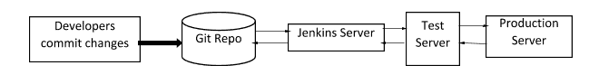
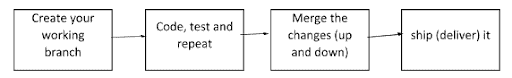

# 50 强詹金斯面试问答[更新]

> 原文：<https://hackr.io/blog/jenkins-interview-questions>

Jenkins 的口号“以任何规模建造伟大的东西”恰当地描述了 Jenkins 所做的事情。你可能在许多博客和文章中读到过 Jenkins 如何帮助持续集成，从而帮助开发人员和测试人员协同工作来创建一个健壮的软件。但是什么是持续集成呢？

## **快速概述**

在传统的[软件生命周期](https://hackr.io/blog/sdlc-methodologies)中，开发者首先开发一个完整的模块，并在完整性检查后进行测试。测试人员在开发周期中是自由的，但是如果后来发现很多问题，他们最终会超负荷工作。这会导致混乱、最后一刻的变更和最佳实践的破坏。通过持续集成，开发人员每天都会提交多个代码变更。这样，测试人员就有可能在早期测试和检测应用程序中的问题。

Jenkins 就是这样一个用 Java 编写的令人敬畏的持续集成工具，它允许开发人员将他们的更改集成到项目中。Jenkins 通过自动化来处理构建、部署、测试和分析过程的其余部分。整个软件开发周期现在变得更快、更顺畅。

### 詹金斯是如何做到的？

一个简单的答案——插件！有数以千计的插件可用。如果没有找到需要的，可以自己编码，分享给社区，获得更大的收益。Jenkins 社区提供了大量的支持和工具。Jenkins 的一些很酷的功能是

*   可扩展的自动化服务器，有助于持续集成和持续交付
*   开源——非常适合任何人开始使用自己的设置进行练习
*   易于安装、设置和配置
*   使用它与数以千计的插件，以提高软件应用程序的可用性
*   可以跨平台使用，因为它是用 Java 编写的

## **顶级詹金斯面试问答**

谈到面试问题，面试官很可能会从问一些基本问题开始，比如“什么是詹金斯”，“詹金斯有什么特点”，优点，关于安装的一点点等等。但是，随着他了解你的知识水平，他可能会增加问题的难度。回答时要干脆。

无论你是 Jenkins 的新手还是有一些实践经验的程序员，我们的综合问题列表将帮助你破解任何 Jenkins 面试。从基础开始，到最后一道题，题的难度会逐渐增加。

#### **问题:詹金斯是什么，为什么用它？**

**回答:** Jenkins 是一个持续集成(CI)工具，用于在大量代码中实时测试和报告较小的构建。它是用 Java 写的。使用它是因为它帮助开发人员和测试人员协同工作，在软件开发生命周期的早期检测和关闭缺陷，并鼓励构建的自动化测试。

### **问题:列举詹金斯的一些特征。**

**回答:**詹金斯的特点是

*   免费和开源
*   优秀的社区和文档
*   详尽的插件和集成集
*   易于在任何平台上设置、安装和使用，因为它是基于 Java 的
*   由于主从架构，支持分布式构建，因此减少了 CI 服务器上的负载

#### **问题:用 Jenkins 有什么好处？**

**回答:**詹金斯的优势是

*   在开发和运营团队之间提供强大的协作，使其成为单一的开发运维团队
*   可以尽早检测到代码错误。
*   代码部署非常简单，只需几分钟就能完成，同时生成报告。
*   集成工作的自动化，从而减少集成问题的数量。

#### 问题:詹金斯是如何产生的？

**回答:**Jenkins 最初名为 Hudson，是在甲骨文接管所有权继续开发该产品时成立的，后来被重新命名为 Jenkins。

#### **问题:如何使用 Jenkins 实现持续集成？**

**回答:**以下是步骤——

*   所有开发人员都将他们的源代码变更提交给共享的 Git 存储库。
*   Jenkins server 以指定的时间间隔检查共享的 Git 存储库，然后将检测到的更改加入到构建中。
*   构建结果和测试结果与开发人员共享
*   构建的应用程序显示在 Selenium 这样的测试服务器上，并运行自动化测试。
*   干净且经过测试的构建被部署到生产服务器上。

这张图表清楚地展示了这些步骤

**回答:**还有许多其他 CI 工具，其中最突出的是

*   团队城市
*   竹子
*   不得已
*   圆形 CI
*   去
*   思想作品
*   完整
*   特拉维斯·CI

还有很多。我们不能说詹金斯是否比每个人都好，因为每个人都有自己独特的特点。例如，团队城市提供了伟大的。NET 支持，但是复杂且昂贵，Travis CI 和 Jenkins 一样是免费的，并且有很好的文档。Bamboo 提供了高效快速的构建，但并不是完全免费的，等等。

#### **问题:什么是 DevOps，詹金斯处于哪个阶段？**

**回答:** DevOps 是一种软件开发实践，它将软件开发(Dev)与 IT 运营(Ops)相结合，通过不断地交付构建、修复、更新和功能，使整个开发生命周期变得更简单、更短。Jenkins 扮演了一个重要的角色，因为它通过自动化构建、测试和部署过程来帮助集成。

#### **问题:安装 Jenkins 有什么系统要求？**

**回答:**所需的最低配置是

*   256MB 内存
*   1 GB 的驱动器空间
*   Java 语言(一种计算机语言，尤用于创建网站)
*   网络浏览器

#### **问题:如何安装 Jenkins？**

**回答:**要安装 Jenkins，请确保安装了以下各项

*   Java(第 8 版)
*   Apache Tomcat(第 9 版)

下载 Jenkins war 文件，并使用 Tomcat 部署它。你可以选择在安装过程中安装 Jenkins 建议的插件。一旦安装完成，您将能够看到詹金斯仪表板。

#### **问题:给出 Jenkins 中一些重要的插件。**

**回答:**给你——

*   Maven 2
*   胃肠治疗系统
*   亚马逊 EC2
*   加入
*   复制工件
*   绿色的球
*   HTML 发布者

#### 问题:什么是 Groovy？

**回答:** [来自 Apache 的 Groovy](https://hackr.io/tutorials/learn-apache-groovy?ref=blog-post) 是一种面向 Java 平台的语言。它是 Jenkins 的本地脚本语言。基于 Groovy 的插件通过出色的界面增强了 Jenkins，并构建了动态且一致的报告。

#### 问题:给出一个简单的用例/场景来解释 Jenkins 是如何工作的。

**答案:**

*   假设一个开发人员正在进行一些代码变更，并最终将它们提交给存储库。
*   Jenkins server 不断检查存储库中的变更，检测变更并提取变更以触发构建。
*   构建可能会失败，在这种情况下，开发人员会收到报告。
*   如果构建通过，它将被部署到测试服务器上。
*   一旦测试完成，测试报告就会生成并发送给开发人员。这个过程一直持续到所有的测试都成功，然后代码被部署到生产环境中。

#### **问题:你能用命令行启动 Jenkins 吗？怎么会？**

**回答:**是的，使用 jenkins.exe 启动

**回答:【Jenkins 支持的 SCM 或源代码管理工具有 SVN、Clearcase、CVS、Git、AccuRev、Perforce、RTC、Mercurial。**

#### **问题:詹金斯的工作是什么？**

**答:**作业或构建作业是整个构建过程中的一个任务或步骤。可能是编译源代码、运行单元测试、将应用程序部署到 web 服务器等等。

#### 问题:你如何创造一份工作？

**答:**在仪表盘页面，你只需选择一个‘新工单’即可。创建作业时，可以选择 SCM、要控制的触发器、构建脚本和通知等选项。

#### **问题:詹金斯管道是什么意思？**

**答:**流水线是一组按顺序一个接一个完成的相互关联的作业。为了集成和实现连续交付管道，Jenkins pipelines 提供了一组插件。要执行的指令通过代码给出。连续交付管道可以表示为

#### **问题:詹金斯的管道类型有哪些？**

**回答:**有 3 种类型——

1.  CI CD 渠道(持续集成持续交付)
2.  脚本化管道
3.  声明管道

#### 问题:Jenkins 使用什么语法来安排构建作业或 SVN 轮询？

**回答:**cron 语法。

Cron 语法用五个星号表示，每个星号用一个空格隔开。语法如下—[分钟][小时][一个月中的某一天][一个月][一周中的某一天]。例如，如果您想为每个星期一晚上 11:59 设置一个 cron，它应该是

59 11 * * 1

#### 问题:您是否在 Jenkins 中创建了一个构建任务？解释一下怎么做。

**回答:**是的。简单的步骤是

*   单击仪表板上的新项目。
*   选择自由式项目选项
*   指定作业的详细信息，如 SCM、构建触发器、高级选项等
*   指定应该构建的文件的位置非常重要。
*   标记所有设置后，单击“添加构建步骤”并选择适当的选项。例如，如果要构建一个文件，请选择文件名和构建命令。
*   单击 Build now 保存构建并进行测试运行。

#### **问题:Jenkins 如何认证用户？**

**回答:**有 3 种方式——

*   默认方式是将用户数据和凭据存储在内部数据库中。
*   将 Jenkins 配置为使用由部署它的应用服务器定义的身份验证机制。
*   将 Jenkins 配置为针对 LDAP 服务器进行身份验证。

**回答:**假设我们要使用第三方工具节点。

*   首先确保安装了节点。
*   通过 Jenkins 管理控制台，为节点安装 Jenkins 插件。
*   转到管理控制台中的管理，并在工具选项卡上配置设置。
*   您可以将任何已配置的 nodeJS 工具添加到管道中的构建作业中

对于不同的第三方工具，由于配置设置的差异，该过程可能略有不同。

#### **问题:解释詹金斯和竹子的区别？**

**答案:**

| 詹金斯 | **竹子** |
| 开源工具。 | 商业工具。 |
| 由一个庞大的全球社区支持。 | 有自己专门的开发团队。 |
| 与竹子相比不太方便使用。 | 更人性化的功能。 |
| 有许多插件来执行各种功能。 | 大多数功能都是内置的，在 Atlassian marketplace 上也有插件。 |

#### **问题:詹金斯的流程是怎样的？**

**回答:** Jenkins 通过插件将完整的持续部署和交付流程自动化。流程如下:

*   开发人员向 Git 存储库提交各种源代码更改。
*   Jenkins 服务器会不断检查存储库的变更，并且每次签入都会完成一次构建。
*   Jenkins 然后将构建的应用程序部署到测试服务器上(就像 Selenium 一样)。测试结果作为反馈发送回来。
*   一旦在测试服务器上执行了所有的测试，就在生产服务器上构建代码。
*   反馈再次通过不同的级别(测试服务器、Jenkins 服务器、Git repo)发送给开发人员。



#### **问题:詹金斯的各种好处是什么？**

**回答:**詹金斯的好处有很多:

*   拥有广泛社区支持的免费开源工具。
*   易于安装和配置。
*   因为它是基于 Java 构建的，所以可以移植到所有主流平台。
*   有许多不同任务的插件。如果没有任何插件，那么开发者可以编写代码并将其贡献给社区。
*   高度可定制。
*   支持高速软件开发。

#### **问题:描述一下在 Jenkins 中创建备份和复制文件的过程？**

**答:**要创建备份，您应该定期备份您的 JENKINS_HOME 目录。

该目录包含所有构建作业配置、从属节点配置和构建历史。

要创建备份，请复制此目录，或者也可以复制作业目录来复制任何作业或重命名目录。

#### **问题:解释 DSL 詹金斯？**

**回答:** Jenkins DSL(领域特定语言)是一个插件，通过它可以以人类可读的编程方式定义作业。通过这个插件，UI 配置被直观地翻译成代码。这样，您可以为作业创建一个版本，并维护更改的历史记录。转换后的代码是基于 Groovy 的语言。例子，

如果 config.xml 文件中有如下参数定义:

```
<hudson.model.StringParameterDefinition>
 <name>MESSAGE</name>
 <defaultValue>Welcome to Hackr.io</defaultValue>
</hudson.model.StringParameterDefinition>
The corresponding code will look like:
parameters {
 stringParam('MESSAGE', 'Welcome to Hackr.io')
}
```

#### **问题:解释一下在 Jenkins 中创建多分支管道的过程？**

**回答:**流程如下:

*   打开 Jenkins 仪表盘，点击左上方菜单中的“新项目”创建一个新项目。
*   输入您的项目名称，并从显示的选项中选择“多分支管道”，然后单击“确定”。
*   然后您应该选择存储库位置、分支源(GitHub/Bitbucket ),并添加分支源的凭证。
*   保存项目。
*   Jenkins 自动为具有分支的存储库创建新的多分支管道，并提取包含 Jenkins 文件的请求。
*   要连接到 GitHub repo，我们需要 HookURL。从存储库设置中获取此 URL。
*   将此 HookURL 添加到 Webhooks 部分。
*   一旦创建了作业，Jenkins 就会自动触发构建。

#### **问题:解释詹金斯的蓝海。**

**回答:**蓝海是 Jenkins 的一个现代 UI，它有助于现代设计的个性化体验。通过这个界面，任何用户都可以创建、诊断和可视化连续交付管道。它不需要技术技能来创建或理解管道，因为一切都是可视化的。此外，自动化问题的检测也很容易，因为每个步骤都可以轻松导航。

#### **问题:描述持续测试。**

**回答:**在持续测试中，在持续交付管道的每个阶段都会收到反馈。它有助于通过反复运行自动化测试用例来提高代码质量。它还减少了代码和测试周期，确保在更短的时间内获得稳定的构建，从而优化了测试过程。

#### **问题:解释 Git 与 Jenkins 集成的流程？**

**回答:**下面是 Git 与 Jenkins 集成的步骤:

*   创建新的 Jenkins 作业并打开 Jenkins 仪表板。
*   输入项目名称(在项目名称中)并选择作业类型。点击确定。
*   输入项目信息。转到“源代码管理”选项卡。如果 Git 插件已经安装在 Jenkins 中，您会看到选项‘Git’。
*   如果你看不到它，那么你应该重新安装插件-GitHub 插件，GitHub 分支源代码插件，GitHub API 插件，Gitclient 插件等。
*   安装插件后，重启 Jenkins 以反映更改。
*   要从 GitHub 提取代码，请输入存储库 URL。如果您的机器上没有安装 Git，请安装它。要检查是否安装了 Git，请在 cmd(命令提示符)中键入 Git，您应该会看到各种选项，如用法、版本、帮助等。

#### **问题:为连续交付工作流创建一个工作流。**

**答:**要创建一个 CD 工作流，我们得先创建一个分支。所有的编码、测试和代码更改都在分支中完成。一旦测试完成，分支变更就被合并并交付。



#### **问题:解释持续集成、持续交付和持续部署之间的区别？**

**答:**持续集成:是在交付管道的所有阶段，一旦变更在测试环境上被测试，就不断地将变更集成到主软件中的过程。CI 也可以指 Jenkins 或 Bamboo 服务器所做的工作。

连续交付:它是通过手工发布，将代码交付到特定的环境，如测试、集成或生产。

持续部署:它是在 CI 阶段完成测试后，将代码自动发布到阶段化或生产环境中。

#### **问题:在 Jenkins 中，管道作为一个代码是什么？解释各种类型的管道？**

**答:** Pipeline-as-a-code 是一种技术或一组功能，帮助您在源代码存储库中维护 CI/CD 工作流逻辑，而无需为每个 Jenkins 分支进行任何额外的配置。这适用于在 repo(包含管道脚本)的根文件夹中有一个名为 Jenkinsfile 的文件的项目。管道语法的类型有声明性语法和语法。

*   *Declarative* :这些提供了一种创建管道的简单方法，并且有一个预定义的层次结构来创建 Jenkins 管道。你可以控制管道的所有方面。
*   脚本化的:它通过一个轻量级执行器在 Jenkins master 上运行，使用很少的资源将管道翻译成代码(命令)。

#### **问题:Jenkins 中的代理指令是什么？**

**答:**代理指令指导 Jenkins 如何以及在哪里执行流水线或其子集。所有的管道都需要代理。代理导致分配包含来自源代码管理的签出文件和管道所需的其他工作文件的工作空间。当有执行人时，它还会导致执行所需的步骤由 Jenkins 执行。

#### **问题:解释一下 Maven、Ant 和 Jenkins 的区别？**

**回答:** Jenkins 是 CI 工具，而 Ant 和 Maven 是构建工具。Jenkins 为要执行的构建提供了一个触发器。Maven 和 Ant 只能执行构建操作；然而，Jenkins 可以运行单元测试，自动部署应用程序。

在 Ant 和 Maven 之间，Ant 只是一个工具，是程序性的，而 Maven 是一个完整的声明式框架，有生命周期。Ant 脚本不能重用，但是 Maven 插件可以重用。Ant 是遗留系统使用的旧工具。大多数新应用程序都使用 Maven。

#### **问题:解释一下设立詹金斯职位的流程？**

**回答:** Jenkins 通过 jobs 处理项目构建。要设置作业，您应该遵循以下几个步骤:

*   选择一个新项目，并输入作业的名称。
*   选择自由式项目，然后按确定。
*   输入作业描述，并配置构建的数量和应保留的时间。
*   配置存储库(例如 Git)。输入 URL 和凭据。
*   指定生成触发器。
*   保存作业。
*   通过单击“立即构建”来验证作业。

#### **问题:如何保护詹金斯？**

**回答:**我们可以通过以下方式保护 Jenkins 并配置全局安全性:

*   将 Jenkins.war 文件部署到服务器并启动它。
*   从主页(通过网址)，点击管理詹金斯。
*   在此页面上，单击“设置安全性”按钮。
*   选中“启用安全性”复选框。
*   为了安全起见，拥有自己的数据库是一个很好的做法。在“安全领域”中选择此选项，并选中“允许用户注册”复选框。
*   填写注册表格。注册成功后，您可以使用新帐户登录。
*   接下来，转到“管理 Jenkins”和“配置全局安全性”。现在，取消选中“允许用户注册”复选框。这样，没有权限就不能创建新用户。
*   现在，您可以配置帐户身份验证。有两种策略:基于矩阵的安全性和基于项目的项目授权策略。你可以选择一个适合你的。
*   保存表单并注销，然后使用新帐户登录。

#### **问题:什么是代理？**

**答:**代理为流水线中的某个特定阶段或者整个流水线本身指定执行点。

#### **问题:你如何在 Jenkins 中定义参数？**

**答:**一个构建可以带几个输入参数来执行。例如，如果您有多个测试套件，但是您只想运行一个。您可以设置一个参数来决定应该运行哪个。要在作业中包含参数，您需要在定义参数时指定相同的参数。该参数可以是字符串、文件或自定义参数。

#### **问题:配置 Jenkins 节点代理与 Jenkins 主节点通信的方法有哪些？**

**答:**启动节点代理有两种方式

*   浏览器–如果从浏览器启动 Jenkins 节点代理，则会下载一个 JNLP (Java Web Start)文件。该文件在客户机上启动一个新进程来运行作业。
*   命令行–要使用命令行启动节点代理，客户端需要可执行的 agent.jar 文件。当这个文件运行时，它在客户机上启动一个进程，与 Jenkins 主服务器通信以运行构建作业。

#### **问题:什么是触发器？举例说明当检测到新的提交时，如何轮询存储库。**

**答:**触发器定义了何时以及如何执行管道。

当 Jenkins 与 SCM(例如 Git)集成时，每次提交时都可以轮询存储库。

*   应该首先安装和设置 Git 插件。
*   之后，您可以构建一个触发器来指定新的构建何时开始。例如，您可以创建一个作业来轮询存储库，并在提交更改时触发构建。

#### **问题:JENKINS_HOME 目录有什么用？**

**回答:**所有的设置、日志、配置都存储在 JENKINS_HOME 目录下。

#### **问题:什么是备份插件？为什么用？**

**回答:**这是一个有用的插件，备份了所有关键设置和配置，以备将来使用。这在出现故障时特别有用，这样我们就不会丢失设置。

#### 问题:如果你的项目构建失败了，你该怎么办？

**回答:**有两种方法可以解决构建中断的问题

*   打开控制台，仔细检查是否所有文件都被取走。如果缺少任何更改，请将其正确放置。
*   在您的本地设置上重现问题，以调试和修复问题。

#### **问题:假设你有一个管道。第一份工作成功了，但第二份工作失败了。你下一步应该做什么？**

**答:**您可以通过执行“从阶段重新启动”来从失败点重新启动管道。

#### **问题:如何将 Jenkins 从旧服务器移动或复制到新服务器？**

**回答:**所有的配置、设置都存储在 JENKINS_HOME (/var/lib/Jenkins)目录下。您应该将整个主目录复制到新服务器。为此，您可以使用命令“rsync”。

#### **问题:什么是 Git 插件？**

**回答:** Git 插件是在你使用 Git 作为仓库的时候使用的。

#### **问题:Maven 是什么？maven 与 Jenkins 整合的好处是什么？**

**回答:** Maven 是一个构建管理工具。使用一个简单的 pom.xml，就可以配置构建、测试和运行代码所需的所有依赖项。Maven 管理测试项目的整个生命周期。一旦与 Jenkins 集成，maven Webdriver 将高效地构建项目并执行所有测试。

#### 问:你对 Jenkins 进行过自动化测试吗？是怎么做到的？

**回答:**是的。自动化测试可以通过 Selenium 或 maven 等工具运行。开发人员可以安排测试运行。Jenkins 显示测试结果，并向开发人员发送报告。

#### **问题:什么是 Kubernetes？怎么能把詹金斯和 Kubernetes 融合在一起？**

**回答:** Kubernetes 是一个容器编排工具。使用 Kubernetes，可以创建多个容器实例来实现更高的容错能力。您可以使用 Kubernetes deploy 插件将它与 Jenkins 一起用于持续部署。

#### **问题:你了解云计算吗？Jenkins 如何适应云计算环境？举例说明。**

**回答:**我们以 AWS 云服务为例。云计算服务使用 CI/CD 模型，这样它们就可以将自己的工作推给客户，并不断接收反馈。Jenkins 习惯于自动化 CI/CD 管道。例如，许多 Jenkins 插件可用于许多 AWS 服务，如 Amazon EC2 和 ECS。

### **结论**

詹金斯是一个强大的工具和一个正在发生的。在你面试之前，试着写一些简单的脚本，了解 Jenkins 支持的最流行的插件。比如 Amazon EC2、Git、Kubernetes、Azure、pipeline、SCM、dashboard view 等等……有了上面的一组问题，你一定能破解面试，对这个超级简单又极其有用的 CI 工具了如指掌。

如果您正在寻找更多的面试问题来做准备，那么您可以在这里查看帮助您准备 Jenkins 面试的最佳课程: [Jenkins 2 训练营:从构建到部署的全自动化](https://click.linksynergy.com/deeplink?id=jU79Zysihs4&mid=39197&murl=https://www.udemy.com/course/jenkins-continuous-integration-bootcamp/)。

如果你正在寻找平装的面试书籍，那么你可以看看这些伟大的编程问答书籍: [189 个编程问题和解决方案](https://geni.us/5NRsc)。

**人也在读:**