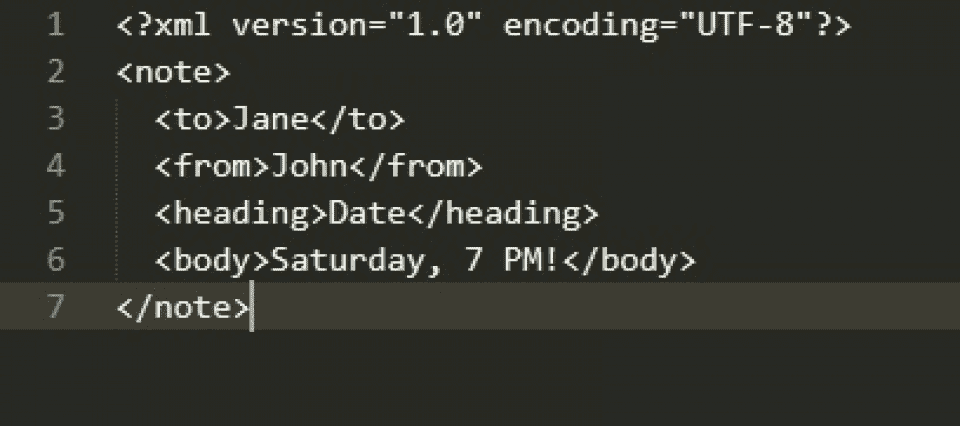
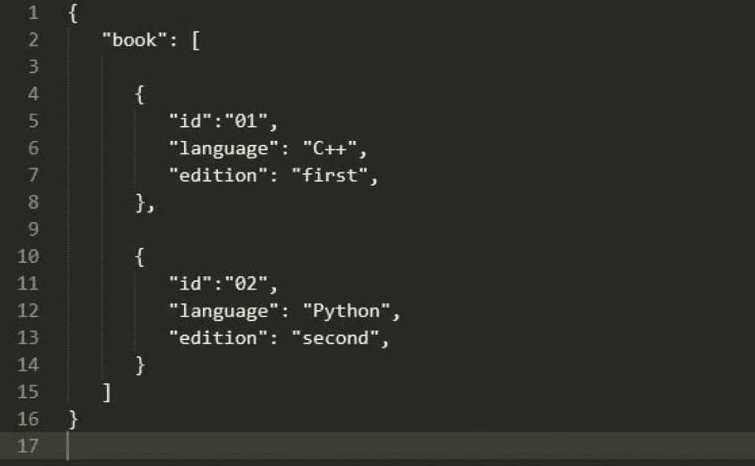
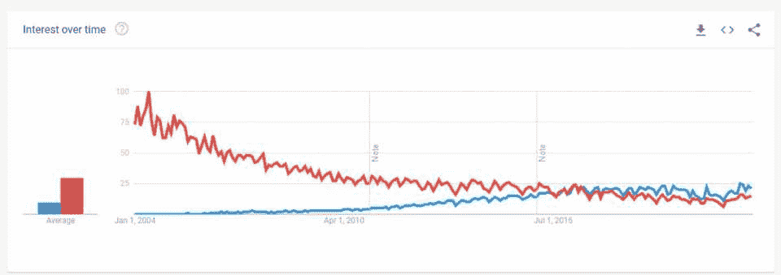

# 2023 年的 JSON 与 XML:比较特性和示例

> 原文：<https://hackr.io/blog/json-vs-xml>

JSON 和 XML 已经存在了几十年，尽管 XML 更老一些。开发人员已经广泛地使用了这两种技术，并且每种技术都有自己独特的特性。

在这里，我们将解释 JSON 和 XML 之间的区别，同时也讨论两者实际上是什么，以及它们各自的优缺点。如果你想要简短的答案，你可以看看下面的汇总表；我们以后再讨论细节。

## **JSON vs XML:总结**

| **功能** | **XML** | **JSON** |
| 语言 | XML 是一种标记语言，而不是编程语言，它有标记来定义元素。 | JSON 只是用 JavaScript 编写的一种格式。 |
| 数据存储 | XML 数据存储为树形结构。示例:

```
2001

 Varsha

 2002

 Akash
```

 | 数据像一个带有键值对的映射一样存储。示例:

```
{“employees”: [

 {"id":"2001", “name":"Varsha"}, 

 {"id":"2002", "name":"Akash"}

]}
```

 |
| 处理 | 可以处理和格式化文档和对象 | 不进行任何处理或计算 |
| 速度 | 解析庞大而缓慢，导致数据传输速度变慢 | 非常快，因为文件非常小，JavaScript 引擎解析更快，因此数据传输更快 |
| 名称空间支持 | 支持名称空间、注释和元数据 | 没有提供名称空间、添加注释或编写元数据 |
| 文档大小 | 文档体积庞大，对于大文件，标签结构使得阅读起来庞大而复杂。 | 紧凑易读，没有多余或空的标签或数据，使文件看起来简单。 |
| 阵列支持 | 不直接支持数组。为了能够使用数组，必须为每个项目添加标签。 | 支持数组 |
| 数据类型支持 | 支持许多复杂的数据类型，包括图表、图像和其他非原始数据类型。 | JSON 只支持字符串、数字、数组、布尔值和对象。对象只能包含基元类型。 |
| UTF 支持 | XML 支持 UTF-8 和 UTF-16 编码。 | JSON 支持 UTF 和 ASCII 编码。 |
| 安全性 | XML 结构容易受到一些攻击，因为默认情况下启用了外部实体扩展和 DTD 验证。当这些被禁用时，XML 解析器更安全。 | JSON 解析几乎在任何时候都是安全的，除非使用 JSONP，这会导致跨站点请求伪造(CSRF)攻击。 |
| 数据处理 | 虽然 AJAX 中的 X 代表 XML，但是由于 XML 中的标签，大量的带宽被不必要的消耗，使得 AJAX 请求很慢。 | 由于在 JSON 中数据是串行处理的，所以结合 AJAX 使用它可以确保更快的处理，因此是更好的选择。使用 eval()方法可以很容易地操作数据。 |

### **什么是 XML？**

### ****

XML(可扩展标记语言)是数据交换的默认选择，因为几乎每种语言都有一个解析器。它是 SGML 的一个应用程序，由一个 11 人的工作组编写。它的初稿于 1996 年 8 月至 11 月在 Sun Microsystems 发布，第一个版本的 XML 于 1998 年 2 月发布。

从 XML 中获取特定数据很容易，而且有一些模式可以验证 XML。XML 在当今的在线世界中被广泛使用——银行服务、在线零售店、集成工业系统等等。

**优点**

| **缺点** | 使用 XSLT 处理器基于处理逻辑创建交互式网页、存储内容数据并将其呈现给用户。 |
| XML 需要处理应用程序。 | XML 简化了平台变更过程。 |
| XML 语法有时会令人困惑，因为它与其他替代方法相似。 | 在 XML 的帮助下，不同平台之间的数据交换很快完成。因此，它使得文档可以跨系统和应用程序进行传输。 |
| 不支持内部数据类型。 | 规定以可重用和可移植的格式定义元数据。 |
| XML 语法是多余的。 | 更准确的网络搜索结果，因为数据存储在标签内。 |
| [](https://click.linksynergy.com/deeplink?id=Qouy7GhEEFU&mid=39197&murl=https://www.udemy.com/course/learn-xml-crash-course/) |

### **JSON 是什么？**

### ****

JSON (JavaScript Object Notation)数据格式最初是由道格拉斯·克洛克福特在 2001 年 3 月规定的。其官方网站于 2002 年推出，到 2005 年，雅虎开始在 JSON 中提供网络服务。到 2013 年，它很快成为 ECMA 的国际标准。最新的 JSON 格式标准发布于 2017 年。

JSON 是 XML 进行数据传输的一个更好的选择，它需要更少的编码，具有更小的尺寸，使得处理和传输数据更快。虽然它是用 [JavaScript](https://hackr.io/tutorials/learn-javascript?ref=blog-post) 编写的，但它是独立于语言的。然而，它没有 XML 所具有的任何强大的验证和模式相关特性。那么，是什么让 JSON 如此受欢迎呢？

随着 REST APIs 相对于 SOAP/WSDL 模型的流行，JSON 在 API 代码和 web 服务编程方面获得了发展势头。它是基于文本的、轻量级的，并且具有易于解析的数据格式，不需要额外的代码来进行解析。

因此，JSON 有助于更快的数据交换和 web 服务结果。所以对于只需要返回大量数据并显示这些数据的 web 服务，理想的选择是 JSON。

**优点**

| **缺点** | JSON API 提供了一个高级外观，从而简化了常用的用例。‬ ‬‬‬‬‬‬‬‬‬‬‬‬‬‬‬‬‬‬‬‬‬‬‬‬‬‬‬‬‬‬‬‬‬‬‬‬‬‬‬‬‬ |
| 由于没有名称空间支持，JSON 的可扩展性很差。 | JSON 非常快，因为它消耗很少的内存空间，适合大型对象图或系统。 |
| 有限的开发工具支持。 | JSON 库是开源的，每个人都可以免费使用。 |
| 它提供了对形式语法定义的支持。 | Jackson API 为许多要序列化的对象提供了默认映射。 |
| 创建清晰、兼容且易于阅读的 JSON 结果。 |
| JSON 库不需要任何其他库来处理。 |
| 支持所有浏览器。 |
| [](https://click.linksynergy.com/deeplink?id=Qouy7GhEEFU&mid=39197&murl=https://www.udemy.com/course/json-training-a-javascript-object-notation-course/) |

### **XML vs JSON 的结构**

### 下面的例子说明了 XML 和 JSON 在结构上的不同

**XML**

| **JSON** | 

```
01   Adam   Cloud computing </technology >  Development
```

 |
|   | 

```
{

"employees": 

 [

{

"id": "01",

"name": "Adam",

"technology": "Cloud computing",

"title": "Engineer",

"team": "Development"

}

}
```

正如我们所看到的，标签结构无疑增加了一些复杂性，而 JSON 格式看起来就像读取一个简单的文本！此外，随着 Node.js 等基于 JavaScript 的框架越来越流行，获取 JSON 格式的数据使得将数据加载到对象树变得容易。 |

JSON 战胜 XML 的另一个例子是当您想将数据从 web 应用程序导出到数据库时。JSON 是这种转换的完美文件格式，因为每种编程语言都能够解析 JSON——一种真正开放的标准和可互操作的格式！

随着云计算和 API 的出现，JSON 在未来将发挥更大的作用，现在对数据的适当存储和传输的需求非常大，并且在未来可能会进一步增长。

[](https://click.linksynergy.com/deeplink?id=Qouy7GhEEFU&mid=39197&murl=https://www.udemy.com/course/api-documentation-1-json-and-xml/)

## 【JSON 和 XML 的区别简而言之

## ****

XML(可扩展标记语言)已经存在了 30 多年，它是每个 web 应用程序不可或缺的一部分。无论是配置文件、映射文档还是模式定义，XML 都为数据提供了清晰的结构，并有助于变量的动态配置和加载，从而简化了数据交换。

JSON 以一种简洁且易于理解的映射格式(键/值对)存储所有数据。人们将数据建模或直接映射到域对象的便利性作为 JSON 优于 XML 的主要优势——这使得它更容易预测和理解结构。请记住，不是每个人都同意这一点。

首先，JSON 只是一种数据格式，而 XML 是一种标记语言。实际上，您可以通过 XPath 进行查询并获得答案。类似地，元数据、属性和名称空间也可以添加到 XML 中。此外，XML 以及 XSL、XSD、XQuery 等。这是一个强大的组合。这些重要的特性仍然使 XML 成为值得选择的东西。

**无论如何，如果一个项目需要文档标记和元数据信息，最好使用 XML。否则，对于更有组织的数据交换，JSON 可能是您的首选。**

**XML 还是 JSON？**

JSON 和 XML 关注的目的有些相似，但是选择取决于细节。底线是，如果您有简单的数据交换，而不考虑语义和验证，那么就使用 JSON。然而，即使使用 JSON，学习 XML 和相关技术也是必不可少的，不仅仅是数据交换和快速处理。JSON 要想与 XML 的能力相提并论还有很长的路要走，但是它有自己的便利之处。

## **常见问题解答**

## XML 和 JSON 哪个更好？

### 这个问题没有直接的答案，因为两者都有自己的用例。这取决于你的目的是什么。如果想要简单的数据交换，JSON 更好。

**XML 和 JSON 有什么不同？**

### XML 允许你创建定制的化妆语言，并且有很多特性。JSON 是一种数据交换格式，为数据编码提供了规范。

**什么时候应该使用 JSON？**

### 当您创建与浏览器或移动应用程序通信的软件时，应该使用 JSON。它是为交换数据而设计的。

**JSON 比 XML 快吗？**

### 是的，JSON 比 XML 快，因为它是轻量级的。JSON 解析器不太复杂，占用的内存也较少。

**人也在读:**

**People are also reading:**