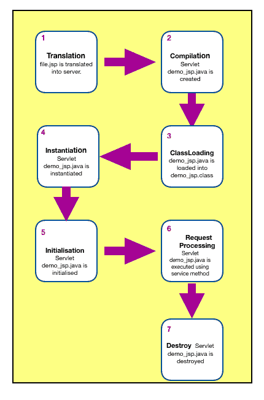

# 前 50 名 JSP 面试问题和答案[更新]

> 原文：<https://hackr.io/blog/jsp-interview-questions>

## JSP 是什么？

JSP 代表 JavaServer Pages。JSP 是创建动态网页的 Java 服务器端技术。JSP 是 Servlet 技术的扩展，帮助开发人员使用类似 HTML 的语法创建动态页面。

用户也在 servlets 中创建用户视图，但是代码变得难看而且容易出错。此外，由于网页上的大部分元素是静态的，因此 JSP 页面适用于网页。JSP 页面中的业务逻辑应该避免，并且只能用于查看目的。

## JSP 面试问答

现在让我们看看流行的 JSP 面试问题和答案。

#### **问题:JSP 有什么好处？**

**答:**应该避免使用 JSP 脚本元素在 JSP 页面中编写 Java 代码，而应该使用 JSTL 标签、JSP 动作元素或自定义标签来实现相同的功能。

JSP 的另一个好处是大多数容器支持 JSP 页面的热部署。在 JSP 页面中进行更改，并用部署目录中更新的 JSP 页面替换旧页面，然后容器加载新的 JSP 页面。我们不需要编译我们的项目代码或重启服务器，不像在 servlet 代码中进行更改时，我们需要再次构建完整的项目并进行部署。尽管大多数容器仍然为应用程序提供热部署支持，但这比 JSP 页面要多。

#### **问题:解释 JSP 的生命周期阶段**

**答案:**



典型的 JSP 页面代码看起来像 HTML，一点也不像 java 类。JSP 容器负责翻译 JSP 页面并创建在 web 应用程序中使用的 servlet 类。以下是 JSP 生命周期的各个阶段:

1.  **翻译:**对 JSP 代码进行检查和解析，生成 servlet 源代码。例如，在 Tomcat 中，生成的 servlet 类文件位于名为 Tomcat/work/Catalina/localhost/web app/org/Apache/JSP 的目录中。如果 home.jsp 是 JSP 页面名，那么通常生成的 servlet 类名是 home_jsp，home_jsp.java 是文件名。
2.  **编译:**在这个阶段，JSP 容器编译 JSP 类源代码，产生一个类文件。
3.  **ClassLoading:** 在这个阶段，容器将类加载到内存中。
4.  **实例化:**容器调用生成的类的无参数构造函数，将其加载到内存中并实例化。
5.  **初始化:**JSP 类对象的 init 方法由容器调用，servlet config 用部署描述符中配置的 init 参数初始化。在这个阶段之后，JSP 就可以处理客户机请求了。通常，JSP 的初始化转换发生在第一个 JSP 请求到来时。尽管如此，我们可以配置它在部署时加载和初始化，就像 servlets 使用 load-on-startup 元素一样。
6.  **请求处理:**这是处理客户端请求时 JSP 页面最长的生命周期。处理是多线程的，类似于 servlets，并且为每个应用程序产生一个新线程。创建 Servlet 请求和 ServletResponse 对象，并调用 JSP 服务方法。
7.  **Destroy:** 这是 JSP 生命周期的最后一个阶段，从内存中卸载 JSP 类。通常，当取消部署应用程序或关闭服务器时会发生这种情况。

#### **问题:讨论 JSP 生命周期**

**回答:** JSP 生命周期由以下方法组成:

1.  **jspInit():** 这是一个在 JspPage 中声明的方法，由 JSP 容器实现来实现。该方法在 JSP 生命周期中被调用一次，用部署描述符中配置的配置参数初始化它。我们可以使用 JSP 声明脚本元素来覆盖这个方法，以初始化我们想要在 JSP 页面中使用的任何资源。
2.  **_ JSP service():**JSP 容器为每个客户端请求调用 JSP 方法，绕过请求和响应对象。请注意，方法名称以下划线开头，以区别于其他生命周期方法，因为此方法不能被覆盖。默认情况下，所有 JSP 代码都放在方法内部并被替换。我们不应该试图用 JSP 声明脚本元素来替换它。该方法是在 HttpJspPage 接口中定义的。
3.  **jspDestroy():** 当 JSP 从内存中卸载时，容器调用这个方法，比如关闭应用程序或 box。该方法在 JSP 生命周期中只被调用一次，并且该方法被覆盖以释放在 JSP init 方法中创建的资源。

#### 问题:可以覆盖 JSP 生命周期方法吗？如果是，哪些方法可以被覆盖？

**回答:**是的，我们可以覆盖 JSP 生命周期方法。通过使用 JSP 声明脚本元素，可以覆盖 jspInit()和 jspDestroy()等方法。我们覆盖 jspInit()方法来创建我们希望在 JSP 服务方法中使用的公共资源，并覆盖 jspDestroy()方法来释放公共资源。

#### **问题:提及 JSP 中使用的文字**

**答案:** JSP 使用以下文字；

*   空
*   布尔代数学体系的
*   线
*   整数
*   浮动

**答:**JSP Bean 开发使用如下三个标签:

*   jsp:useBean
*   jsp:setProperty
*   jsp:getProperty

**回答:**JSP 页面提供了两种类型的注释，我们可以使用:

*   **HTML 注释:**我们可以像<一样使用 HTML 注释！- HTML 注释- >既然 JSP 页面像 HTML。这些注释也被发送到客户端，并且可以在 HTML 源代码中看到。所以我们必须避免使用 HTML 注释调试注释或代码级注释。
*   **JSP 注释:**像< % - JSP 注释- % >这样的 Scriptlets 用于编写 JSP 注释。这些注释不会发送给客户机，而是出现在生成的 servlet 源代码中。我们应该对任何代码级别或调试信息注释使用 JSP 注释。

#### **问题:描述 JSP 中的脚本元素**

**答案:**

Expression、Scriptlets 和 Declaration 是 JSP 页面中的脚本元素，使用它们可以在 JSP 页面中添加 java 代码。

在 scriptlet 标记内编写的任何代码都进入 _jspService()方法。scriptlet 标签以开始。比如说；

```
<%
Date dt = new Date( );
System.out.println("Current Date=" +dt);
%>
```

有一种通过 JSP 表达式使用 out.print()方法在 JSP 页面中打印动态数据的快捷方式。JSP 表达式以开头。

```
<% out.print("John"); %> can be written using JSP Expression as <%= "John" %>
```

请注意，中的任何内容都作为参数发送给 out.print()方法。另外，注意 scriptlets 可以包含多个 java 语句，并且总是以分号(；)，但表达式不以分号结尾。

servlet 类的成员变量和方法的声明是使用 JSP 声明进行的。JSP 声明分别以“”开始和结束。

例如，我们在 JSP 中在类级别创建一个 int 变量作为。

**回答:**JSP 注释叫隐藏注释，而 HTML 注释叫输出注释。如果用户查看页面的源代码，JSP 注释将不会显示，而 HTML 注释将会显示。

#### **问题:为什么不鼓励在 JSP 中使用脚本元素？**

**回答:** JSP 页面是用于视图目的的，所有的业务逻辑应该在 servlet 或者模型类中。我们应该通过属性将参数传递给 JSP 页面，然后使用它们在 JSP 页面中创建 HTML 响应。

JSP 页面的大部分都包含 HTML 代码，为了帮助 web 设计人员理解 JSP 页面并快速开发它们，JSP 技术提供了 action 元素、JSP 标准标记库、JSP EL 和自定义标记，我们使用它们而不是脚本元素来弥合 JSP HTML 和 JSP java 部分之间的差距。

**答:**根据 JSTL 函数将它们分为五种类型:

1.  **核心标签:**提供对迭代、条件逻辑、捕捉异常、URL、转发或重定向响应等的支持。
2.  **格式化和本地化标签:**通过资源包和语言环境提供日期、数字和 i18n 支持的格式化。
3.  **SQL 标签:**提供与 Oracle、MySql 等关系数据库的交互支持。
4.  **XML 标签:**用于处理 XML 文档，比如解析 XML、转换 XML 数据和 XPath 表达式求值。
5.  **JSTL 函数标签:** JSTL 标签提供了几个我们可以用来执行标准操作的函数；其中大多数用于字符串操作，如字符串连接、拆分字符串等。

#### **问题:什么是 JSP 自定义标签，一个 JSP 自定义标签有哪些组成部分？**

**回答:** Action 标签、JSP EL、JSTL 标签有时候不够用，可能会诱惑我们用 Java 写代码来执行 JSP 页面上的一些操作。幸运的是，JSP 是可扩展的，我们可以创建定制的标签来提供特定的服务。

我们可以使用以下组件创建 JSP 自定义标记:

*   JSP 自定义标记处理程序
*   正在创建标签库描述符(TLD)文件
*   TLD 的部署描述符配置

我们可以使用 taglib 指令在 JSP 页面中添加自定义标记库，然后使用它。

#### **问题:什么是 JSP 隐式对象？**

**回答:**web 容器在将 JSP 页面翻译成 Servlet 源码帮助开发者时创建的对象是 JSP 隐式对象。我们在服务方法中的 scriptlets 中直接使用这些对象。然而，它们不能在 JSP 声明中使用，因为代码将在类级别上。

我们有九个隐式对象，可以直接在 JSP 页面上使用。其中七个在 _jspService()方法的开始被声明为局部变量，而其中两个是我们可以使用的 _jspService()方法参数的一部分。

1.  在外
2.  请求
3.  反应
4.  配置
5.  应用
6.  会议
7.  页面上下文
8.  页，面，张，版
9.  例外

#### **问题:我们可以在 JSP 声明中定义的方法中使用 JSP 隐式对象吗？真的还是假的？对齐**

**回答:**假！因为这些对象对于服务方法是本地的，而且这些 JSP 隐式对象是由 JSP 容器添加的。它还将 JSP 页面翻译成 servlet 源代码。JSP 声明代码在服务方法之外，它用于创建类级别的变量和方法。因此不能使用 JSP 隐式对象。

#### **问题:如何在 JSP 中包含静态文件？**

**答:**静态页面可以使用 include 指令包含在 JSP 中。在翻译阶段，以这种方式执行一次包含。必须为文件属性提供相对 URL。虽然可以包含静态资源，但这不是首选，因为每个请求都需要包含静态资源。

#### 问题:解释客户端和服务器端的验证。

**答:**验证在浏览器内的客户端使用 JavaScript 和 HTML 进行。客户端验证的主要优点是它不需要网络连接，因为它发生在客户端的机器上，因此可以提供接近即时的反馈。有一些客户端约束需要应用于 HTML 无法处理的输入。使用 JavaScript 验证表单。我们在表单中添加了一个事件监听器，这样我们就可以在表单提交之前执行一些 JavaScript。信用卡信息是 JavaScript 客户端验证的一个典型例子。

我们相信服务器端验证会对所有输入正确无误地执行。在向用户显示任何成功或错误消息之前，客户端应该等待服务器的响应，因为服务器在收到 HTTP 请求之前无法执行验证。在验证失败的情况下，需要额外的网络行程来重新发送表单，以便由客户端用正确的数据填写表单。

#### **问题:解释 JSP 声明**

**答:**声明字段和方法是使用 JSP 声明标签完成的。代码包在<里面%！% >标记，并放在自动生成的 servlet 的 service()方法之外。因此，它不会在每次请求时都获取内存。

语法:

```
<%! field or method %> 
Example
<html>
<body>
<%! int val=50; %>
<%= "Value of the variable is:"+val %>
</body>
</html>
```

#### **问题:区分 JSP Scriptlet 和 JSP 声明。**

**答案:**

| **JSP 脚本程序** | **JSP 声明** |
| 它只能声明变量，不能声明方法。 | 它可以声明方法和变量。 |
| 它被放在 _jspService()方法中。 | 它被放在 _jspService()方法之外。 |

#### **问题:JSP 比 ASP 有什么优势？**

**答案:**

*   它功能强大且易于使用，因为代码的动态部分是用 Java 编写的，而不是 Visual Basic 或微软特有的语言。
*   它可以移植到非微软的 Web 服务器和其他操作系统。

#### **问题:定义 JSP 自定义标签及其组件。**

**答案:**自定义标签是用户自定义的标签；我们可以用我们的功能定义我们的标签，并在 JSP 页面中使用这些标签。

它具有以下优点:

*   它消除了对 scriptlet 标记的需要。
*   从 JSP 页面中分离业务逻辑
*   JSP 页面的可重用性。

它由以下组件组成:

1.  自定义标记处理程序类。
2.  创建一个 TLD(标签库描述符)文件。
3.  TLD 的部署描述符配置

我们可以使用 taglib 指令在 JSP 页面中添加自定义标记库，然后使用它。

**问题:JavaScript 可以和 JSP 页面一起使用吗？**

**回答:**是的，我们可以，尽管 JSP 是一种服务器端技术，但它是用来生成客户端响应的，我们可以像任何其他 HTML 页面一样添加 javascript 或 CSS 代码。

#### **问题:如何为 JSP 配置 init params？**

**回答:**我们可以为 JSP 配置类似于 web.xml 文件中 servlet 的 init params 还有必要用 servlet 和 servlet 映射元素配置 JSP init 参数。与 servlet 唯一不同的是 jsp-file 元素，在这里我们需要提供 jsp 页面的位置。

#### **问题:区分 JSP 中的包含指令和包含动作**

**答案:**

| **包含指令** | **包含动作** |
| 它在翻译时被处理。 | 它在运行时被处理。 |
| 它使用相对或绝对路径 | 它使用相对路径。 |
| 不能传递其他参数。 | 可以传递其他参数。 |
| 它只包含资源的内容，不会处理动态资源。 | 它处理动态资源，结果将被添加到调用 JSP 中 |
| 不允许将任何请求或响应对象传递给包含文件或 jsp 的调用 JSP，反之亦然。 | 允许将任何请求或响应对象传递给包含文件或 jsp 调用 JSP，反之亦然。 |

**答:**标签提供了有用的功能，比如包含资源、使用 Java Bean、转发请求以及生成动态 XML 元素。Action 元素以 jsp:开头，可以直接在 JSP 页面中使用，无需导入任何标记库或任何其他配置更改。JSP 标签是:

| **JSP 标签** | **描述** |
| jsp:转发 | 将响应和请求转发给另一个资源。 |
| jsp:包含 | 包括另一个资源 |
| JSP:bean 的使用 | 定位或创建 bean 对象 |
| jsp:setProperty | 属性的值是在 bean 对象中设置的 |
| jsp:getProperty | 打印 bean 的属性值 |
| jsp:插件 | 像 applet 一样嵌入另一个组件 |
| jsp:我的钱 | 设置参数值。它用于 forward 和 includes mostly。 |
| jsp:回退 | 可以用来打印消息，如果插件正在工作。它用在 jsp: plugin 中。 |

#### **问题:什么是 JSP 表达式语言(EL)？**

**回答:** JSP EL 简化了存储在 Java bean 组件和其他对象(如请求、应用程序和会话)中的数据的可访问性。

语法:

```
$
```

#### **问题:如何使用 JSP EL 获取 HTTP 方法名？**

**答案:** pageContext JSP EL 隐式对象用于获取请求对象引用，点运算符用于获取 JSP 页面中的 HTTP 方法名。

下面是相同的代码片段:

```
$
```

#### 问题:一个 JSP 可以扩展另一个 java 类吗？如果是，如何实现？

**回答:**是的，JSP 可以用这个扩展另一个 JSP

```
<%@ include page extends="classname" %>
```

这是正确的，因为当 JSP 转换为 servlet 时，它实现了 javax . servlet . JSP . httpjspage 接口，所以 JspPage 扩展了另一个 java 类。

#### **问题:JSP 如何与 Java 文件通信？**

**答案:**进口标签

```
<%@ page import="market.stock.*” %>
```

像这样，我们将所有的 java 文件导入到 jsp 中，并将它们作为一个常规类使用。另一种方式是 servlet 可以将 java 类的实例发送给 jsp，并且可以从请求对象中检索该对象并在页面上使用它。

#### 问题:JSP 自定义标记中使用了哪个指令？

**答案:** JSP taglib 指令。

**答案:**

1.  jsp:useBean
2.  jsp:setProperty
3.  jsp:getProperty

#### 回答:

```
<%-- Comment --%>
```

#### **问题:JSP 技术可扩展吗？怎么会？**

**回答:**是的，JSP 技术可以通过开发封装在标签库中的标签或自定义动作来进行扩展。

#### **问题:如何实现线程安全的 JSP 页面？**

**回答:**通过让 JSP 实现 SingleThreadModel 接口，我们可以使它们线程安全。这可以通过在 JSP 页面中添加指令**<% @ page is thread safe = " false " %>**来实现。

#### **问题:定义 JSP 表达式**

**答案:**JSP 表达式元素内部包含的脚本语言表达式首先被求值，然后被转换成字符串，再被插入到 JSP 文件中表达式出现的地方。

根据 Java 语言规范，expression 元素可以包含任何有效的表达式，但分号不能用于结束表达式。

语法:

```
<% expression %>
```

#### **问题:定义 JSP 指令？**

**答:**servlet 类的整体结构受一个 JSP 指令的影响。它具有以下形式:

```
<%@ directive attribute = "value" %>
```

**答案:**

| **指令标签** | **描述** |
|  | 定义页面相关属性。 |
|  | 文件包含在翻译阶段。 |
|  | 声明页面中使用的包含自定义操作的标记库。 |

#### **问题:定义 JSP 文字**

**答:**文字被定义为作为代码的一部分写入的值，如文本字符串或数字。

jsp 字面意思是:

| **JSP 文字** | **描述** |
| 布尔代数学体系的 | 对还是错 |
| 线 | 用单引号和双引号；"被转义为\，" '被转义为\，',而\被转义为\\。 |
| 整数 | 就像在 Java 里 |
| 浮点 | 就像在 Java 里 |
| 空 | 空 |

#### **问题:JSP 运行时异常是如何处理的？**

**答:**异常定义为运行时抛出的异常，处理运行时错误的进程称为异常处理。

在 JSP 中，异常以两种方式处理:

1.  通过 Page 指令的 errorPage 和 isErrorPage 属性
2.  web.xml 文件中的 By <error-page>元素</error-page>

#### **问题:什么是页面指令？**

**答:**页面指令向容器提供与当前 JSP 页面相关的指令。页面指令可以在 JSP 页面的任何地方编码。

#### **问题:为什么 _jspService()方法以' _ '开头，而其他生命周期方法没有？**

**答:** jspInit() jspDestroy()和 _jspService()是主要的 JSP 生命周期方法，默认情况下，JSP 页面中写入的任何内容都将由容器放入 _jspService()方法中，如果再次尝试覆盖此方法，JSP 编译器将会给出一个错误，但我们可以覆盖其他两个生命周期方法，因为在 JSP 中实现了这两个方法，所以使此差异容器使用 _ in jspService()方法，并表明该方法不能被覆盖。

#### **问题:JSP 在 MVC 模式中是如何使用的？**

**答案:** JSP 用于模型视图控制器模式(MVC)中的展现；这意味着它扮演了视图的角色。控制器调用模型和业务类，它们依次获取数据，然后这些数据被呈现给 JSP 以呈现给客户机。

#### **问题:jspInit()、_jspService()和 jspDestroy()方法可以被覆盖吗？**

**答:**我们不能覆盖 _jspService()方法，但是 jspinit()和 jspDestroy()方法可以被覆盖。

#### **问题:什么时候使用应用范围？**

**答:**当我们想让数据对整个应用程序可用时，就使用它。

#### **问题:区分 JavaBeans 和 taglib 指令**

**回答:** JavaBeans 和 taglib 是为了复用性而引入的。以下是它们之间的主要区别

*   JavaBeans 适合存储信息和状态，而 Taglibs 适合生成表示元素。
*   使用定制标签实现动作，使用 JavaBeans 呈现信息。

#### **问题:信息是如何从 JSP 传递到被包含的 JSP 的？**

**答案:**使用

```
<%jsp:param>
```

#### **问题:定义自动刷新功能**

**答案:**想象一个网页，显示现场游戏比分或股市状况或货币兑换比率。对于所有此类页面，需要使用浏览器的刷新或重新加载按钮定期刷新网页。

JSP 通过提供一种机制使这项工作变得简单，在这种机制下，网页可以在给定的时间间隔后自动刷新。

#### **问题:JSP 中的自动刷新是如何实现的？**

**答:**刷新网页最简单的方法就是使用响应对象的方法**setin header()**。下面是这个方法的签名

```
public void setIntHeader(String header, int header value)
```

该方法将标头“Refresh”与一个整数值一起发送回浏览器，该整数值指示时间间隔(以秒为单位)。

**答:**JSTL SQL 标记库提供了用于与 Oracle、MySQL 或 Microsoft SQL Server 等关系数据库(RDBMSs)交互的标记。

下面是在 JSP 中包含 JSTL SQL 库的语法

```
<%@ taglib prefix = "sql" uri = "http://java.sun.com/jsp/jstl/sql" %>
```

#### 问题:JSP 代码会遇到什么类型的错误？

**答案:**

*   **检查异常:**异常是用户错误或程序员无法预见的问题。例如，如果要打开一个文件，但找不到该文件，则会发生异常。这些例外很难被忽略。
*   运行时异常:发生的异常可能已经被程序员避免了。编译时会忽略运行时异常。
*   错误:这些不被认为是例外，而是超出用户或程序员控制的问题。代码中的错误会被忽略，因为您很少能对错误做任何事情。例如，如果发生堆栈溢出，就会出现错误。它们在编译时也会被忽略。

#### **问题:如何禁用脚本？**

**答:**我们可以通过将部署描述符的 scripting-invalid 元素设置为 true 来禁用脚本。它是 jsp-property-group 的子元素。它的有效值为 true 和 false。禁用脚本的语法是:

```
<jsp-property-group>
<url-pattern>*.jsp</url-pattern>
<scripting-invalid>true</scripting-invalid>
</jsp-property-group>
```

## 结论

准备面试可能会很有压力，所以我们在这里向你展示最受欢迎的 JSP 面试问题，让你在 JSP 面试中脱颖而出。你还有什么问题要分享吗？或者有什么破解这个面试的小技巧？

面向初学者的 JSP、Servlets 和 JDBC:构建一个数据库应用是准备 JSP 面试时一些很受欢迎的 Udemy 课程。

求一本 JSP 面试问题书？参考这个磨砺你的 JSP 技能:【Java 面试 1000 强问题:包括 Spring、Hibernate、微服务、GIT、Maven、JSP、AWS、云计算:(最新 2018 版)。

请在下面的评论中告诉我们！！

**人也在读:**