# 理解机器学习中的 K-均值聚类

> 原文：<https://hackr.io/blog/k-means-clustering>

在深入研究算法之前，让我们先了解一些算法的背景知识。K-means 聚类是一种机器学习 算法。准确地说，机器学习算法大致分为有监督的和无监督的。无监督学习被进一步分类为数据集的变换和聚类。聚类还有几种类型，K-均值属于层次聚类。

在开始详细研究算法之前，让我们对这些概念有一个概述。

## **什么是无监督学习？**

在没有任何指导的情况下，机器对未标记的数据进行训练，它应该发现数据中隐藏的模式。无监督学习算法执行复杂的任务，但与自然学习方法相比可能更令人怀疑。无监督方法允许找到对分类有用的特征。此外，所有未知模式都可以使用无监督学习找到。无监督学习的问题分为聚类和关联问题。

要详细了解无监督学习的更多信息[访问这里](https://hackr.io/blog/what-is-unsupervised-learning)和[查看这里](https://hackr.io/blog/supervised-vs-unsupervised-learning)无监督学习和有监督学习的区别。

现在让我们看看什么是集群:

## **什么是聚类？**

 ******让我们考虑一个由点组成的数据集:

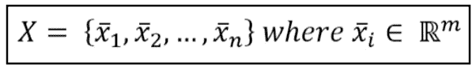

我们假设有可能找到一个标准(不是唯一的)，这样每个样本都可以与一个特定的组相关联:

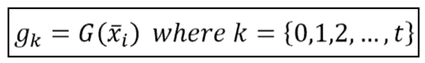

按照惯例，每个组被称为一个聚类，并且寻找函数 G 的过程被称为聚类。聚类被认为是在一堆未知数据中发现结构或模式的一个重要概念。聚类算法处理数据并发现数据中存在的自然聚类(组)。这取决于用户来调整算法应该识别的聚类的数量，因为算法给出了修改组的粒度的能力。

您可以使用各种类型的聚类:

*   **分区:**数据是这样组织的，单个数据只能是一个集群的一部分。
*   **凝聚:**每一个数据在这种技术中都是一个聚类。
*   **重叠:**在这种技术中，使用模糊集对数据进行聚类。
*   **概率性:**这种技术中使用概率分布来进行聚类。
*   **层次化:**这种算法使聚类具有层次性。它从分配给自己的群集的所有数据开始。那么两个聚类将在同一个聚类中。当只剩下一个聚类时，算法结束。
*   **K 均值聚类:** K 指的是枯燥的聚类算法，有助于找到每个问题的最高值。在这种聚类方法中，选择所需数量的聚类，将数据点聚类成 k 个组。更大的 k-意味着更小的组具有更大的粒度，而更小的 k 意味着更大的组具有更小的粒度。

现在让我们详细研究 k-means 聚类算法:

## **K 均值聚类算法**

k-means 算法基于初始条件，通过分配 k 个初始质心或均值来决定聚类数:

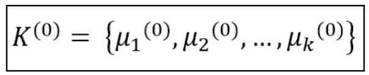

然后计算每个样本和每个质心之间的距离，并将该样本分配给距离最小的聚类。这种方法通常被称为最小化集群的惯性，其定义如下:

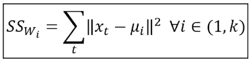

该过程是迭代的，一旦所有的样本被处理，一组新的质心 K 被计算，并且所有的距离被重新计算。当达到所需容差时，或者换句话说，当质心变得稳定时，算法停止，因此惯性最小。

## **算法步骤**

设 X = { x 1 ，x 2 ，x 3 ，……，x n }为数据点 an 的集合

μ = {μ 1 ，μ 2 ，μ 3 ，........，μ n }是中心点。

1.  随机选择“C”个聚类中心。
2.  计算每个数据点和聚类中心之间的距离。
3.  离聚类中心距离最小的数据点被分配给聚类中心。
4.  用公式矩形化新的聚类中心:

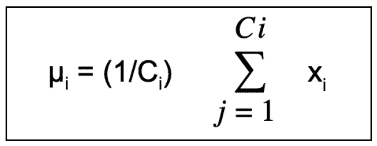

其中 ci 表示第 I 个聚类中数据点的数量

1.  重新计算距离 b/w 新获得的聚类中心和数据点。
2.  如果没有重新分配数据点，则停止，否则从步骤 3 开始重复。

## **样本数据集讲解 K-均值聚类**

 ******考虑一个带有虚拟数据集的简单示例:

```
from sklearn.datasets import make_blobs
nb_samples = 1000
X, _ = make_blobs(n_samples=nb_samples, n_features=2, centers=3, cluster_std=1.5 
```

在我们的例子中，由于每个斑点的标准偏差，我们有三个具有二维特征和部分重叠的聚类。我们在这里没有使用变量，因为我们想生成一组局部一致的点来测试我们的算法:

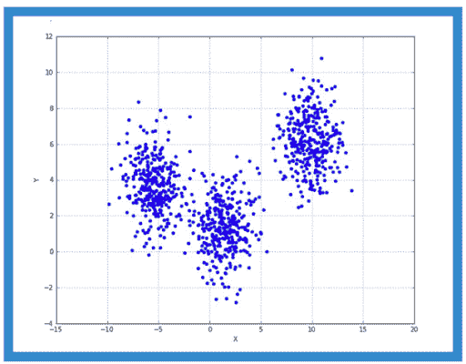

在这种情况下，我们期望 k-means 在有界于[-5，0]之间的 X-区域中以最小误差分离三个组。因此，保留我们得到的默认值:

```
from sklearn.cluster import KMeans
>>> km = KMeans(n_clusters=3)
>>> km.fit(X)

KMeans(algorithm='auto', copy_x=True, init='k-means++', max_iter=300,
n_clusters=3, n_init=10, n_jobs=1, precompute_distances='auto', random_state=None, tol=0.0001, verbose=0)

>>> print(km.cluster_centers_) 

[[ 1.39014517, 1.38533993]
[ 9.78473454, 6.1946332 ]
[-5.47807472, 3.73913652]] 
```

用三种不同的标记替换数据，我们验证 k-means 如何成功地分离数据。

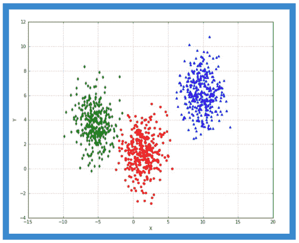

在这种情况下，分离是容易的，因为 k-means 是基于欧几里德距离的，欧几里德距离是径向的，因此聚类预期是凸的。如果所有这些都没有发生，这个问题就不能用这个算法来解决。大多数情况下，即使不完全保证凸性，k-means 也可以产生良好的结果，但是在几种情况下，预期的聚类是不可能的，并且让 k-means 找出质心会导致错误的解决方案。

让我们也考虑一下同心圆的情况，scikit-learn 提供了一个内置函数来生成这样的数据集:

```
from sklearn.datasets import make_circles
>>> nb_samples = 1000
>>> X, Y = make_circles(n_samples=nb_samples, noise=0.05) 
```

显示同心圆的图形:

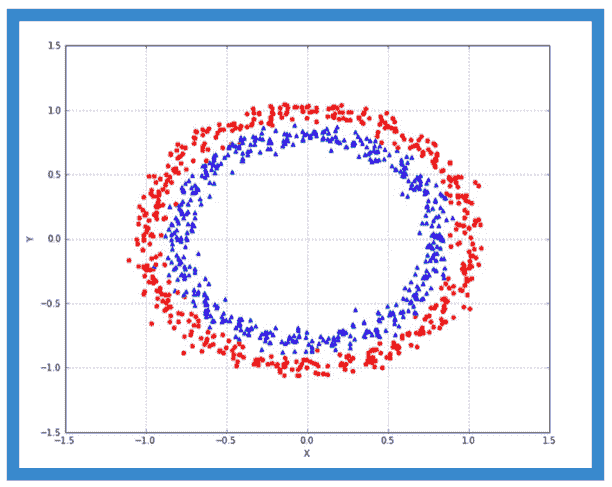

这里我们有一个内部聚类(蓝色三角形标记)和一个外部聚类(红色圆点标记)。这样的集合不是凸的，因此 k-means 不可能正确地分离它们。

假设，我们将算法应用于两个集群:

```
>>> km = KMeans(n_clusters=2)
>>> km.fit(X)

KMeans(algorithm='auto', copy_x=True, init='k-means++', max_iter=300,
n_clusters=2, n_init=10, n_jobs=1, precompute_distances='auto', random_state=None, tol=0.0001, verbose=0) 
```

我们得到如下所示的分离:


不出所料，k-means 收敛在两个半圆中间的两个质心上，得到的聚类截然不同。

## **K-means 聚类算法的 Python 代码**

```
df = pd.DataFrame({
    'x': [12, 20, 28, 18, 29, 33, 24, 45, 45, 52, 51, 52, 55, 53, 55, 61, 64, 69, 72],
    'y': [39, 36, 30, 52, 54, 46, 55, 59, 63, 70, 66, 63, 58, 23, 14, 8, 19, 7, 24]
})
from sklearn.cluster import KMeans
kmeans = KMeans(n_clusters=3)
kmeans.fit(df)
------------------------------------------------------------------------------labels = kmeans.predict(df)
centroids = kmeans.cluster_centers_
fig = plt.figure(figsize=(5, 5))

colors = map(lambda x: colmap[x+1], labels)

plt.scatter(df['x'], df['y'], color=colors, alpha=0.5, edgecolor='k')
for idx, centroid in enumerate(centroids):
    plt.scatter(*centroid, color=colmap[idx+1])
plt.xlim(0, 80)
plt.ylim(0, 80)
plt.show()
------------------------------------------------------------------------------
```

## **K-表示聚类算法代码中的 R**

```
# K-Means Algorithm 
#k=3 # the number of K
max=5000 # the maximum number for generating random points
n=100 # the number of points
maxIter = 10 # maximum number of iterations
threshold = 0.1 #difference of old means and new means
# Randomly generate points in the form of (x,y)
x <- sample(1:max, n)
y <- sample(1:max, n)
# put point into a matrix
z <- c(x,y)
m = matrix(z, ncol=2)
ks <- c(1,2,4,8,10,15,20) # different Ks
for(k in ks)
   myKmeans(m, k, max)
myKmeans <- function(m, k, max)
{
#initialization for k means: the k-first points in the list
x <- m[, 1]
y <- m[, 2]
d=matrix(data=NA, ncol=0, nrow=0)
for(i in 1:k)
    d <-  c(d, c(x[i], y[i]))
init <- matrix(d, ncol=2, byrow=TRUE)
dev.new()
plotTitle <- paste("K-Means Clustering K = ", k)
plot(m, xlim=c(1,max), ylim=c(1,max), xlab="X", ylab="Y", pch=20, 
        main=plotTitle)
par(new=T)
plot(init, pch=2, xlim=c(1,max), ylim=c(1,max), xlab="X", ylab="Y")
par(new=T)
oldMeans <- init
oldMeans 
cl <- Clustering(m, oldMeans)
cl
means <- UpdateMeans(m, cl, k)
thr <- delta(oldMeans, means)
itr <- 1
while(thr > threshold)
{
cl <- Clustering(m, means)
oldMeans <- means
means <- UpdateMeans(m, cl, k)
thr <- delta(oldMeans, means)
itr <- itr+1
}
cl
thr
means
itr
for(km in 1:k)
{
   group <- which(cl == km)
   plot(m[group,],axes=F, col=km, xlim=c(1,max), ylim=c(1,max), pch=20, xlab="X", ylab="Y")
   par(new=T)
}
plot(means, axes=F, pch=8, col=15, xlim=c(1,max), ylim=c(1,max), xlab="X", ylab="Y")
par(new=T)
dev.off()
} # end function myKmeans
#function distance
dist <- function(x,y)
{
 d<-sqrt( sum((x - y) **2 ))
}
createMeanMatrix <- function(d)
{
 matrix(d, ncol=2, byrow=TRUE)
}
# compute euclidean distance
euclid <- function(a,b){
 d<-sqrt(a**2 + b**2)
}
euclid2 <- function(a){
 d<-sqrt(sum(a**2))
}
#compute difference between new means and old means
delta <- function(oldMeans, newMeans)
{
 a <- newMeans - oldMeans
 max(euclid(a[, 1], a[, 2]))
}
Clustering <- function(m, means)
{
  clusters = c()
  n <- nrow(m)
  for(i in 1:n)
  {
    distances = c()
    k <- nrow(means)
    for(j in 1:k)
    {
 di <- m[i,] - means[j,]
 ds<-euclid2(di)
 distances <- c(distances, ds)
    }
    minDist <- min(distances)
    cl <- match(minDist, distances)
    clusters <- c(clusters, cl)    
  }
  return (clusters)
}
UpdateMeans <- function(m, cl, k)
{
 means <- c()
 for(c in 1:k)
 {
    # get the point of cluster c
    group <- which(cl == c)
    # compute the mean point of all points in cluster c
    mt1 <- mean(m[group,1])
    mt2 <- mean(m[group,2])
    vMean <- c(mt1, mt2)
    means <- c(means, vMean)
 }
 means <- createMeanMatrix(means)
 return(means)
}
```

## **K-means 聚类算法的挑战**

### **1。不同的集群大小**

算法面临的共同挑战是不同的聚类规模。

让我们用一个例子来理解这一点:

考虑如下所示的一组原始点:

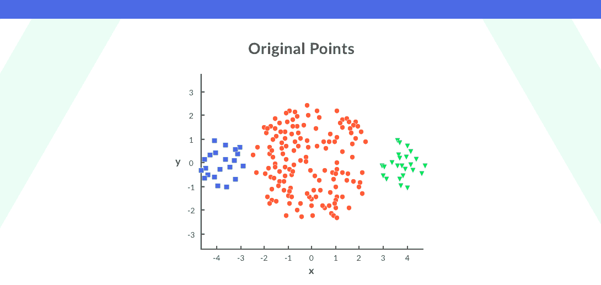

在原始图中，与对该算法应用 k-means 聚类的中心聚类相比，右边和最左边的聚类具有较小的大小，结果将如下所示:

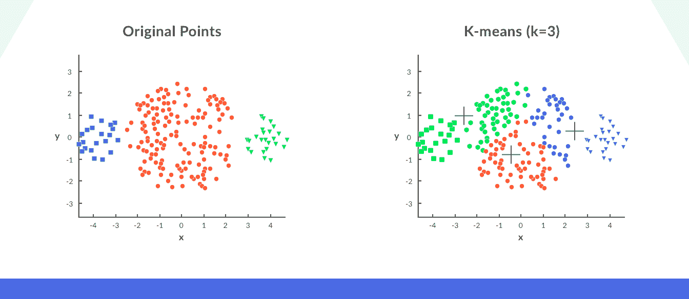

### **2。不同密度的数据点**

当原始点的密度不同时，算法的其他挑战出现。

再考虑一下，一组原始点如图:

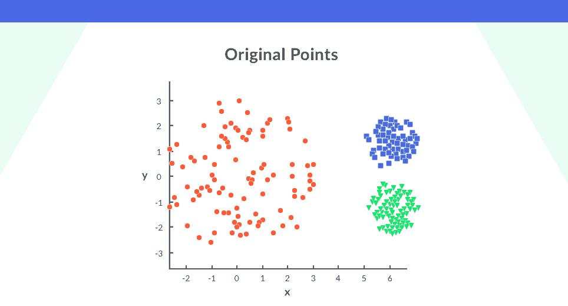

在上面的图中，蓝色和给定聚类中的点紧密排列，而红色聚类中的点通过对这些点应用 k-means 聚类而分散开来。我们将得到如图所示的集群。

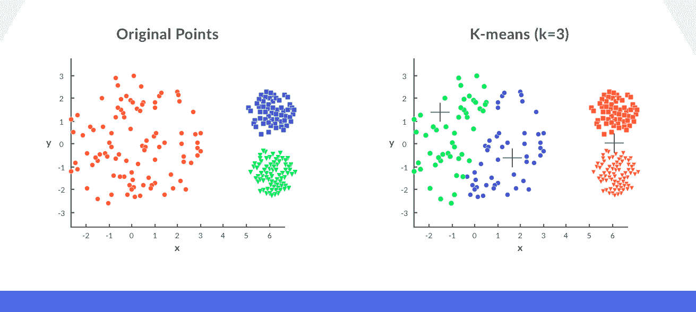

我们看到，紧凑的点被分配到一个单独的簇中，而之前分散在同一个簇中的点被分配到不同的簇中。

解决方案可以是使用更多的簇，而不是三个簇(k=10 ),从而形成有意义的簇。

## **K-means 聚类算法的应用**

### **1。文件分类**

这是一个非常标准的分类问题，这个算法被认为适合解决它。基于文档的标签、内容、主题，文档被聚集在多个类别中。

### 2.客户细分

聚类技术根据购买历史、兴趣或活动监控对客户进行细分，从而帮助市场改善其客户基础，在目标领域开展工作。这种分类将有助于公司瞄准特定的客户群。

### **3。保险欺诈检测**

通过利用欺诈性索赔的历史数据来隔离新的索赔是可能的。基于历史数据，可以形成指示欺诈的聚类。

### **4。通话记录数据分析**

CDR 是电信公司获取的信息，用于了解客户群的小时使用情况。

通过电话、短信和互联网收集的信息在与客户的人口统计数据结合使用时，可以更深入地了解客户的需求。

### 5.网络侧写罪犯

网络特征分析的理念源自犯罪特征分析，并在从个人和团体收集数据的过程中发现重要的相互关系

网络特征分析为调查部门提供信息，以便对犯罪现场的罪犯类型进行分类。

## **K-means 聚类算法的优势**

1.  容易理解。
2.  鲁棒快速算法。
3.  复杂度为 O(tknd)的高效算法其中:

*   t:迭代次数。
*   k:质心(簇)的数量。
*   n:物体的数量。
*   d:每个物体的尺寸。

*   通常是 k，t，d<T3【n】*   当数据集互不相同且相互分离时，它会给出最佳结果。

## **K-means 聚类算法的缺点**

1.  该算法需要聚类中心数量的先验规范。
2.  如果有两个高度重叠的数据，k-means 不能分辨出有两个聚类。
3.  该算法对于非线性变换不是不变的，即不同的数据表示揭示不同的结果。
4.  欧几里得距离度量可以不相等地加权潜在因素。
5.  该算法不适用于分类数据，仅在定义平均值时适用。
6.  无法处理噪音数据和异常值。
7.  对于非线性数据集，算法失败。

[Python 开发者机器学习入门](https://click.linksynergy.com/link?id=jU79Zysihs4&offerid=1045023.2092098&type=2&murl=https%3A%2F%2Fwww.udemy.com%2Fcourse%2Fmachine-learning-intro-for-python-developers%2F)

## **结论**

这让我们结束了无监督学习算法，k-means 聚类。我们已经研究了无监督技术，这是一种[类型的机器学习](https://hackr.io/blog/types-of-machine-learning)，其中机器使用未标记的数据进行训练。此外，我们讨论了聚类，简单地说，聚类是将数据集分成由相似数据点组成的组的过程。它有多种用途，最受欢迎的是亚马逊的推荐系统和网飞的电影推荐。接下来，我们学习了我们的博客主题 K-means 聚类算法，它的算法步骤，并使用一个虚拟数据集来理解它。我们还用 Python 和 T4 的代码实现了这个算法。最后，我们研究了该算法面临的挑战及其应用和优缺点。

你可以在这里概述更多的机器学习算法[。](https://hackr.io/blog/machine-learning-algorithms)

这些信息对你理解这种算法有帮助吗？让我们知道您的反馈！

**人也在读:**************