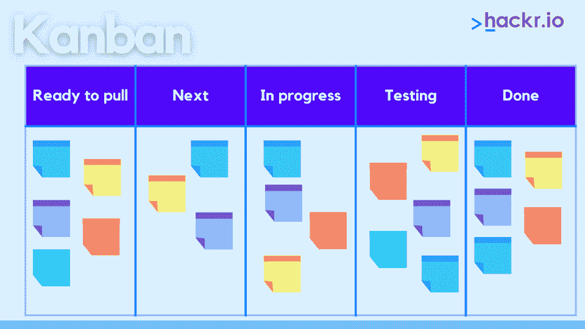
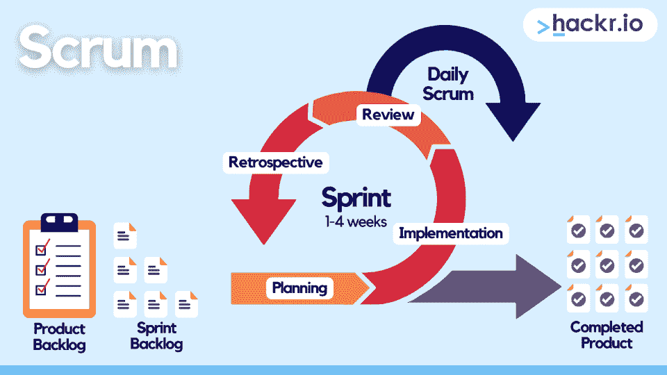
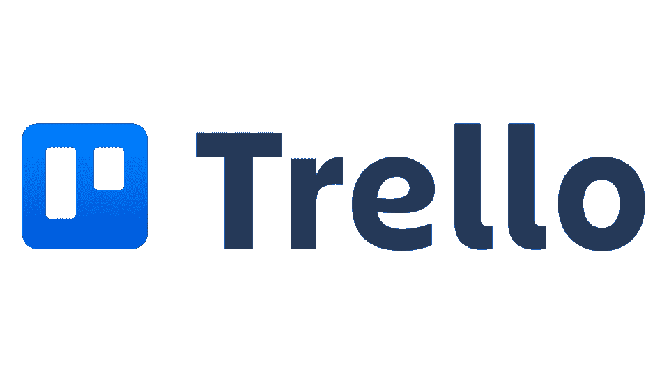
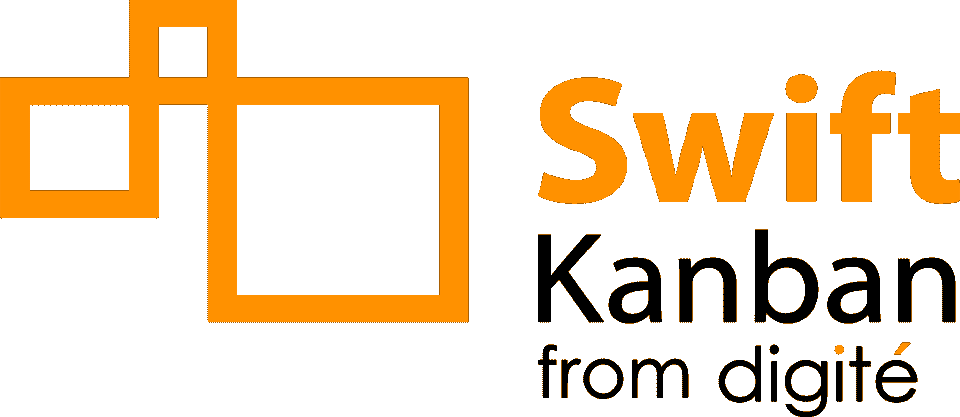

# 看板与 Scrum:解释关键差异[2023]

> 原文：<https://hackr.io/blog/kanban-vs-scrum>

无论你或你的团队在做什么类型的项目，适当的项目管理对你的成功至关重要。今天有无数的项目管理方法可用，其中两个是看板和 Scrum。

看板和 Scrum 是两种项目管理方法，专注于将大项目分解成更小、更易管理的增量。但是，虽然两者都有助于使项目更易于管理，但它们使用不同的方法来做到这一点。看板和 Scrum 借鉴了精益和敏捷方法，尽管你可能会发现 Scrum 与敏捷更密切相关。

但是 Scrum 和看板有什么区别呢？而你的情况应该选择哪一个呢？你甚至必须选择，或者你可以一起使用吗？当比较看板和 Scrum 时，这里有一个你可以期待的快速概述:

| **Scrum** | **中的“T1”** |
| 敏捷学习

*   更严格——更适合具有稳定优先级的团队和项目
*   起源于软件开发
*   团队成员不超过 9 人，每个团队有一个 Scrum 主管、产品负责人，其余的是开发团队
*   工作周期被定义为冲刺，这是一个严格计划的一到四周的周期，团队必须在这个周期内完成商定的工作
*   敏捷和精益

 | 更灵活，更适合具有广泛和不同优先级的团队

*   源自制造过程——在日本的丰田工厂！
*   使用视觉线索来跟踪进度
*   限制正在进行的工作，以防止压力过大，并确保当前任务在继续进行之前完成
*   一旦工作完成，团队就从任务中抽身出来
*   现在你已经看到了我们的概述，但是你仍然想知道选择哪种方法，下面我们提供看板和 Scrum 的深入比较。继续阅读，了解更多关于 Scrum 和看板的区别！
*   **相关** : [敏捷面试 40 强问答](https://hackr.io/blog/agile-interview-questions)

 |

**什么是看板？**

****

## 看板是一种项目管理方法，它使用可视化的方法，使跟踪项目任务变得更容易，同时帮助个人和团队找到并减少过程中的瓶颈和低效。

您可能听说过看板，它可以是物理的或数字的板，分成几列来描述任务或项目的每个阶段。任务被放在卡片上，然后可以从一列到另一列进行，直到完成。

看板和看板是提高项目透明度的极好方法，允许团队成员直观地确认哪些任务需要完成，哪些任务已经完成，以及任务可能会在过程中堆积在哪里。有了这种可视化的方法，团队可以更容易地将资源分配到最需要的地方。

值得注意的是，看板还允许团队设置 WIP(工作进展)限制，确保团队成员不会被任务淹没。WIP 限制还允许团队定位瓶颈，从而更容易地简化流程。

如果你发现看板本身不能满足你团队的需求，你可以很容易地将看板和其他方法一起使用。

什么是 Scrum？

****

## 像看板一样，Scrum 是一种大量借鉴敏捷的项目管理方法。Scrum 最适合复杂的项目，允许团队在必要的地方适应和改变。它使用迭代的方法来帮助团队完成项目，这样团队就可以分阶段完成他们的任务。这种方法允许团队根据他们不断发展的需求和优先级进行改变。

Scrum 使用短的开发周期，或“冲刺”来计划项目。在周期重新设定之前，冲刺可以持续一到四周。团队通常会召开会议来决定他们打算在冲刺阶段做什么。一旦团队决定了这些任务，Scrum 方法论非常不鼓励给 sprint 增加额外的任务。如果优先级在冲刺阶段转移，冲刺通常会被取消，团队必须重新开始计划过程。

使用 Scrum，团队通常是自组织的。每个团队不超过 9 名成员，有一个 Scrum 主管和一个产品负责人。其他成员被称为开发团队。

Scrum 观察框架的三个支柱:透明性、适应性和检查。

适应指的是 Scrum 的适应性，允许它拥抱变化。因此，这种方法很容易适应项目方向可能改变的情况。

透明度确保每个团队成员都知道项目中发生了什么以及为什么。

*   检查意味着每个团队成员或利益相关者持续检查他们的项目，鼓励改进文化。
*   **相关** : [【敏捷与 Scrum】敏捷与 Scrum 的区别](https://hackr.io/blog/agile-vs-scrum)
*   **看板和 Scrum 有什么相似之处？**

当你对比看板和 Scrum 板时，你可能会注意到两者之间的一些相似之处。但是，让我们快速看一下这些方法是如何协调的:

## 看板和 Scrum 都是敏捷方法。

这两种方法都允许团队和项目在过程中适应和改变。

*   这两种方法都允许团队在更短的时间内完成交付。
*   开发周期更短，整个过程的透明度也增加了。
*   看板和 Scrum 都鼓励团队成员更多地参与进来。
*   【Scrum 和看板有什么区别？
*   虽然 Scrum 和看板有相似之处，但它们也有一些区别。下面我们来看看看板和 Scrum 的区别:

## 看板借鉴了敏捷和精益方法，而 Scrum 更倾向于敏捷。

看板使用一种方法，团队可以更清楚地可视化任务，看到进展，并识别瓶颈。另一方面，Scrum 在冲刺阶段涉及到高度结构化的工作流程。

*   Scrum 预先定义了冲刺阶段要完成的工作，看板允许持续的工作和任务交付，直到项目完成。
*   Scrum 需要一个 Scrum Master、产品所有者和开发团队，而看板不在团队中分配预先定义的角色。
*   看板在优先级转移方面更加灵活，而如果需要重大变更，团队必须重新开始计划过程。
*   **Scrum 与看板** : **面对面的比较**
*   让我们比较一下敏捷 Scrum 和看板，看板吸取了敏捷和精益的优点。

## **比较**

**Scrum**

| **中的“T1”** | **原点** | 软件开发行业 |
| 精益制造——在一家日本丰田工厂开发，当时人们用卡片来跟踪生产进度 | **角色和职责** | 团队限于 9 名成员，每个成员都有一个预定义的角色。Scrum Master 管理时间表，产品负责人定义团队目标，其余成员(开发团队)执行 |
| 无；角色不是预先定义的，尽管团队可能仍然有项目经理。看板鼓励团队成员协作和贡献，这样团队成员就不会被任务淹没 | **意识形态** | 团队通过经验学习。他们进行组织和优先排序，然后反思他们的成功，同时在每次冲刺后找出需要改进的地方 |
| 允许团队使用视觉提示和计划来改进他们正在进行的工作 | **授权和优先排序** | 使用一个系统化的工作流程，称为拉动系统，团队在每个 sprint 迭代中拉动整批的工作和任务 |
| 还使用拉式系统，该系统只允许团队成员在当前或之前的工作完成后拉新任务 | **到期日和交付时间表或“节奏”** | 使用持续一到四周的“冲刺”。Sprints 是设定的工作时间周期，团队必须在此期间完成之前在计划期间商定的工作 |
| 根据需要持续交付工作；截止日期取决于团队的优先级和需求 | **做法** | 冲刺计划→冲刺→每日的 Scrum →冲刺回顾→冲刺后回顾 |
| 工作可视化→在制品限制→流程管理→反馈回路整合 | **处理修改或变更** | 一旦冲刺开始，改变是非常不鼓励的；如果优先级改变，团队被鼓励从冲刺计划阶段重新开始循环 |
| 对中游的变化更加灵活；更适用于希望进行迭代和持续改进的团队 | **生产率指标和测量** | 使用视觉线索；通过“周期时间”(从开始到结束完成一个完整的项目需要多长时间)来衡量进度和成功 |
| 通过“速度”衡量；冲刺是同时进行的，每个冲刺都依赖于前一个冲刺的成功 | **最佳使用案例** | 团队和项目具有稳定的优先级，不太可能随着时间的推移而发生很大变化 |
| 优先事项范围广泛的项目 | 如果你决定尝试 Scrum，你可能会考虑下面的一些工具。 | [****](https://clickup.com/) |

拥有免费的永久等级和实惠的起步计划

特性允许 bug 跟踪、产品发布、冲刺管理等等

*   使用甘特图、多个董事会视图、添加无限任务等等
*   实时协作
*   [****](https://activecollab.com/)
*   有一个免费的永久层

有一个 Pro+获得支付计划，允许用户跟踪工作和发票他们的时间

*   允许团队计划、交流和协作
*   如果看板是你的首选方法，你可以试试下面一些最流行的工具。
*   [****](https://trello.com/en)

市场上最流行的看板工具之一

有一个免费的永久层

*   创建多个工作区并与其他人协作
*   可在多个平台上使用
*   使用基本看板来可视化工作，而不是时间线
*   使用列表和卡片
*   难以置信的易用性，通过简单的导航和简单的用户界面帮助更大
*   [****](https://www.digite.com/swiftkanban/)
*   Digité提供的工具

非常适合看板，但也可以用于 Scrum

*   提供高度可配置的可视化工作流程
*   允许您实施在制品限制
*   提供强大的度量标准来帮助团队变得更加敏捷并进一步提高
*   允许协作、积压管理等
*   方便用户的
*   使用甘特图或日程表视图
*   你能一起使用 Scrum 和看板吗？
*   可能在某些情况下，您会发现自己喜欢这两种方法的某些方面。幸运的是，您可以使用它们的组合或“Scrumban”方法来获得更大的灵活性。

### 如果你想要一个允许你使用看板和 Scrum 的解决方案，而不需要使用其中的一个，考虑一下像 Monday.com 这样的工具。周一的工作操作系统使用户能够拥有一个 Scrum 模板和一个看板视图，所以你可以从两者中获取并创建你自己的解决方案。你可以[试试 Monday.com](https://try.monday.com/hackr)，看看它是否适合你。

看板与 Scrum:你应该使用哪一个？

归根结底，在看板和 Scrum 之间做出选择取决于您团队的需求和您项目的参数。如果你在寻找更多的灵活性，看板是你最好的选择。但是如果你喜欢更结构化的东西，Scrum 是你的方法论。你也可以尝试两者的混合，或者“Scrumban ”,看看它是否能更好地满足你的需求！

## 你在考虑成为一名 Scrum 大师吗？如果你觉得已经准备好开始你的职业生涯，并在这一领域寻找工作，可以考虑看看这些 [**顶级 Scrum 大师面试问题**](https://hackr.io/blog/scrum-master-interview-questions-and-answers) **来帮助你做准备。**

**常见问题解答**

**1。看板比 Scrum 好吗？**

## 这个问题没有单一的答案。尽管两者都有自己独特的优势和劣势，但是“更好”的选择取决于团队的独特需求。确定看板和 Scrum 哪个更适合你的最好方法是评估一些因素，比如你的团队、项目或产品、时间表和工作习惯。如果你不能在两者之间做出选择，你可以从两者中取其精华，使用一个组合的“Scrumban”方法。

### **2。Scrum 和看板都是敏捷吗？**

[敏捷](https://hackr.io/blog/what-is-agile-methodology)描述了一种在软件开发和类似行业中经常使用的项目管理方法。在敏捷中，复杂的项目被分解成更小、更易管理的任务。由于 Scrum 和看板将大任务分解成小块，你可以认为它们都是敏捷的。

### **3。看板比 Scrum 难吗？**

看板比 Scrum 更灵活，规则更少，许多团队可能会觉得更容易处理。然而，如果您的团队更喜欢定义了规则集的更严格的风格，那么看板可能总体上更具挑战性。

### **3\. Is Kanban Harder Than Scrum?**

Kanban is more flexible and has fewer rules than Scrum, which many teams may find easier to handle. However, if your team prefers a stricter style with defined rulesets, Kanban might be more challenging overall.