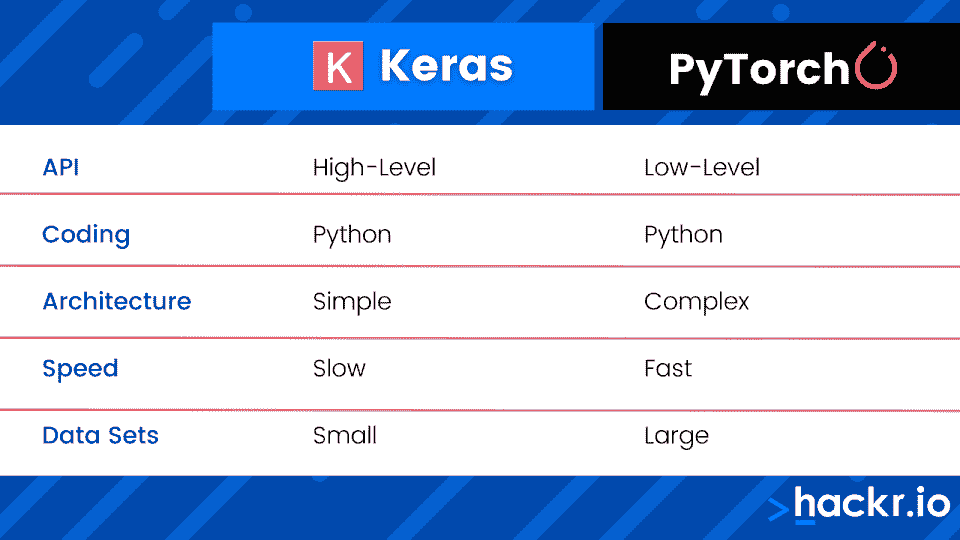

# Keras vs PyTorch:应该学习哪个 ML 框架？

> 原文：<https://hackr.io/blog/keras-vs-pytorch>

[Keras](https://keras.io/) 和 [PyTorch](https://pytorch.org/) 都是用于设计和开发神经网络和深度学习技术的开源框架。

具体来说，Keras 是一个运行在[开源](https://hackr.io/blog/top-10-open-source-security-testing-tools-for-web-applications)库 TensorFlow(或其他)之上的神经网络平台，而 PyTorch 是一个底层 API，旨在直接控制表达式。

哪个更好？这取决于你使用这项技术的目的。

如果你是一个科学和数学倾向的个人，深入挖掘深度学习的框架，PyTorch 可能是更好的解决方案。如果你是一名对深度学习技术的快速开发和原型制作感兴趣的开发人员，Keras 可以提供更多。

让我们深入了解一下 Keras 或 PyTorch 是否适合您。

## **An Intro to Keras vs Pytorch**

**Keras** 于 2015 年发布，设计上尽可能简单易用。Keras 语言的特性包括高级 API、直观的界面和健壮的文档。

PyTorch 于 2016 年发布，作为一种低级 API，旨在支持科学和数学领域的[机器学习](https://hackr.io/tutorial/intro-machine-learning-pytorch)和人工智能应用。PyTorch 可用于深度学习和大型数据集，主要是数值优化任务。

**相关文章: [PyTorch vs TensorFlow:你需要知道的区别](https://hackr.io/blog/pytorch-vs-tensorflow)**

## PyTorch:为 Power 设计的底层环境

[****](https://pytorch.org/)

PyTorch 是一个为底层环境设计的开源机器学习框架。PyTorch 由脸书开发，在 BSD 许可下发布，任何人都可以免费使用。

作为一种深度学习解决方案，PyTorch 可以筛选、分析和识别大量数据。

科学家使用 PyTorch 来创建和训练模型，然后这些模型可以用来模拟处理和智能。作为一个低级环境，PyTorch 提供了显著的灵活性和强大的功能，尽管对于初学者来说这可能是一个挑战。

**优点:**

*   PyTorch 的底层环境快速高效。
*   为开发人员和科学家提供了一个极其高效的环境。
*   比 TensorFlow 更容易调试，虽然在某种程度上比得上 Keras。
*   拥有一个活跃(年轻)的社区。

**缺点:**

*   PyTorch 尚未被广泛采用，因为它仍然是一个相对较新的平台。
*   由于上述原因，有些领域可能缺乏 [PyTorch 文档](https://pytorch.org/docs/stable/index.html)和社区。
*   PyTorch 没有内置监控或可视化工具。

### **py torch 比 Keras 好吗？**

对于某些应用，PyTorch 更好。正在寻找对深度学习背后的数学和算法进行更深入控制的数学家、统计学家和科学家将会发现 PyTorch 是一个优越的环境。

在任何首选低级环境的情况下，PyTorch 都会更好。

### **py torch 和 Keras 相似吗？**

PyTorch 和 Keras 非常相似。事实上，大多数深度学习或机器学习应用程序都可以在 PyTorch 或 Keras 中完成，最终结果非常相似。

区别在于系统的使用方式。PyTorch 提供了对函数更直接的控制，而 Keras 提供了一种简化的高级控制。

### 我们为什么使用 PyTorch？

PyTorch 用于自然语言处理(NLP)、视频分析和图像识别等应用。PyTorch 用于特斯拉自动驾驶系统以及优步的 Pyro 系统。

## Keras:为易用性而设计的高级环境

[****](https://keras.io/)

[Keras 是一个框架](https://keras.io/#:~:text=Built%20on%20top%20of%20TensorFlow,not%20only%20possible%3B%20it's%20easy.)，用于与 TensorFlow 等机器学习后端的高层 API 接口。

TensorFlow 是一个深度学习开源端到端解决方案，它提供了创建、训练和部署神经网络所必需的所有低级和高级 API 和实用程序。

有了 Keras，使用 TensorFlow(以及其他[机器学习后端](https://hackr.io/blog/best-machine-learning-libraries))就变得容易多了。但是 Keras 本身并不是一个机器学习库。

**优点:**

*   简单易用。
*   Keras 可以与 TensorFlow、Theano、Microsoft CNTK 和其他后端一起使用。
*   包括预先训练的模型，可用于更快的部署。
*   拥有强大的文档和活跃的社区。
*   与 TensorFlow 相比，Keras 提供了更好的调试工具。

**缺点:**

*   可能效率低且速度慢。
*   Keras 不会让您访问低级计算，并且在您操作低级 API 时可能会出错。
*   并非所有调试实用程序或错误都有用。

### **Keras 是深度学习框架吗？**

Keras 应该更准确地称为深度学习 API，它运行在机器学习框架之上。

Keras 旨在通过让开发人员更容易立即投入使用来加快机器学习应用程序的部署。

Keras 可以被称为深度学习框架，但只有在理解实际的核心库需要从其他地方调用的情况下。

### Keras 框架运行于什么之上？

Keras 可以运行在 TensorFlow 和其他类似的开源机器学习后端，比如 Theanos。它在 TensorFlow 上最受欢迎，因为它被认为是 TensorFlow 的官方接口。

TensorFlow 本身(以及其他机器学习后端)可以在没有 Keras 的情况下单独使用，但 Keras 提供了很多好处，其中最重要的是可访问性。

### **Does Keras Require TensorFlow?**

Keras 不需要 TensorFlow，但是 Keras *需要某种形式的后端。Keras 为开源机器学习后端(最常见的是 TensorFlow)提供了一个接口和定制层。*

没有后端，Keras 无法提供深度学习能力；它是一个框架，不是一个库。

## 【PyTorch 和 Keras 的区别

如你所见，PyTorch 和 Keras 之间的主要区别是它们的用户友好程度(T2)。

PyTorch 公开底层操作，允许程序员使用 Python 编程语言深度定制自己的应用。

Keras 使用高级操作来提供更简单但可能更肤浅的体验。

这里有一个方便的 PyTorch Keras 对比图:

如您所见，PyTorch 和 Keras 的主要区别之一是 PyTorch 速度更快，可以处理更大的数据集。Keras 可能很慢，这意味着处理较大的数据集可能是一个挑战。

PyTorch 和 Keras 之间的大多数差异都与 Keras 是 TensorFlow 之上的一个复杂的抽象层有关，而 PyTorch 提供了更直接的算法优先建模。同时，这意味着 PyTorch 的架构与 Keras 提供的架构相比极其复杂。

对你来说，其中一个是否比另一个更容易学，很大程度上取决于你的背景。如果你有科学背景，你可能会发现 PyTorch 更简单。

### **PyTorch vs Keras: Speed**

PyTorch 比 Keras 快。但是 PyTorch 和 TensorFlow 差不多。因为 Keras 在用户和 TensorFlow 之间提供了一个额外的抽象层，所以它天生就比较慢，扩展性也较差。

然而，如果开发人员改用 TensorFlow 而不是 Keras，他们可以获得与 PyTorch 相当的速度。

### **PyTorch vs Keras:可用性**

PyTorch 和 Keras 的设计都比 TensorFlow 更容易调试。

PyTorch 和 Keras 对于有经验的高级开发人员来说应该同样容易使用。

对于那些更有科学头脑的人来说，PyTorch 会更容易使用。PyTorch 为数学和算法提供了更高层次的可视性。

对于那些没有开发背景或不熟悉机器学习的人来说，Keras 可能更容易使用。Keras 简化并改进了 TensorFlow 的许多功能——但 TensorFlow 本身对有经验的开发人员来说并不具有挑战性。

### **指针与 times:作业**

根据 ZipRecruiter 的数据，Keras/TensorFlow 工作的平均年薪为 148，508 美元。

相比之下，PyTorch 的工作在同一个平台上平均年薪为 10.08 万美元。

如果 PyTorch 是更具挑战性的技术，为什么 Keras 的工作似乎比 PyTorch 的工作报酬高得多？

部分原因可能只是因为 PyTorch 是一种更新的技术。这是一个更年轻的框架，这意味着市场中的采用率和认知度更低。Keras 和 PyTorch 开发人员都是市场的需求者，将会有很多机会。

### 【PyTorch vs TensorFlow 怎么样？

PyTorch 和 TensorFlow 之间的比较不同于 PyTorch 和 Keras。与 PyTorch 相比，TensorFlow 与 PyTorch 一样快，但缺乏调试能力。Keras 的许多缺点从 TensorFlow 中剥离出来，但也有一些优点。

TensorFlow 与 PyTorch 类似复杂，将提供更多深度和对低级实用程序的访问。同时 TensorFlow 会更难学。有了 Keras，易用性和快速部署是有代价的——速度和效率。

## **学习 PyTorch 或 Keras**

无论您决定学习 PyTorch 框架还是 Keras 机器学习套件，您都会发现它们都是健壮的、有良好文档记录的解决方案。从 PyTorch 到 Keras，[机器学习的应用](https://hackr.io/blog/real-world-machine-learning-applications)持续增长。

如果您是数据科学家、数学家或分析师，PyTorch 可能是更好的框架。同样，如果您正在进行大量的定制编程，并且需要低级的粒度控制，PyTorch 可以提供这些。

但是如果你对神经网络的一般管理和深度学习更感兴趣，Keras 会更容易。当与 TensorFlow 配对时，Keras 可以是一个非常强大的深度学习框架，并可以提供生活质量工具，例如通过警告和警报更容易地调试。

[Python 开发者机器学习入门](https://click.linksynergy.com/link?id=jU79Zysihs4&offerid=1045023.2092098&type=2&murl=https%3A%2F%2Fwww.udemy.com%2Fcourse%2Fmachine-learning-intro-for-python-developers%2F)

## Keras vs PyTorch:头对头比较

| **参数** | **Keras** | **指针** |
| **开发于** | 2015 年 3 月 | 2016 年 10 月 |
| **API** | 高层 | 低级的 |
| **速度** | 相对较慢 | 快的 |
| **架构复杂度** | 简单的 | 复杂的 |
| **社区支持** | 有限的 | 强烈的 |
| **数据集** | 小型数据集 | 大型数据集 |
| **调试** | 挑战性的 | 快速简单 |
| **计算图表** | 静态 | 动态的 |
| **后端实现** | TensorFlow、Theano 和微软 CNTK | 不 |
| **易用性** | 易于初学者使用 | 对于有科学头脑的人来说很容易使用 |
| **平均工资** | 每年 148，000 美元 | 每年 100，800 美元 |

## **底线**

*   PyTorch 更适合需要对大型数据集进行快速、可扩展操作的科学家。
*   Keras 更适合需要对小数据集进行简单、快速操作的程序员。

不管怎样，PyTorch 和 Keras 都运行在 Python 上。如果你有兴趣了解更多关于深度学习、人工智能和神经网络的知识，学习 Python 可能是第一步。

[今天学习 Python！](https://hackr.io/blog/how-to-learn-python)

**人也在读:**