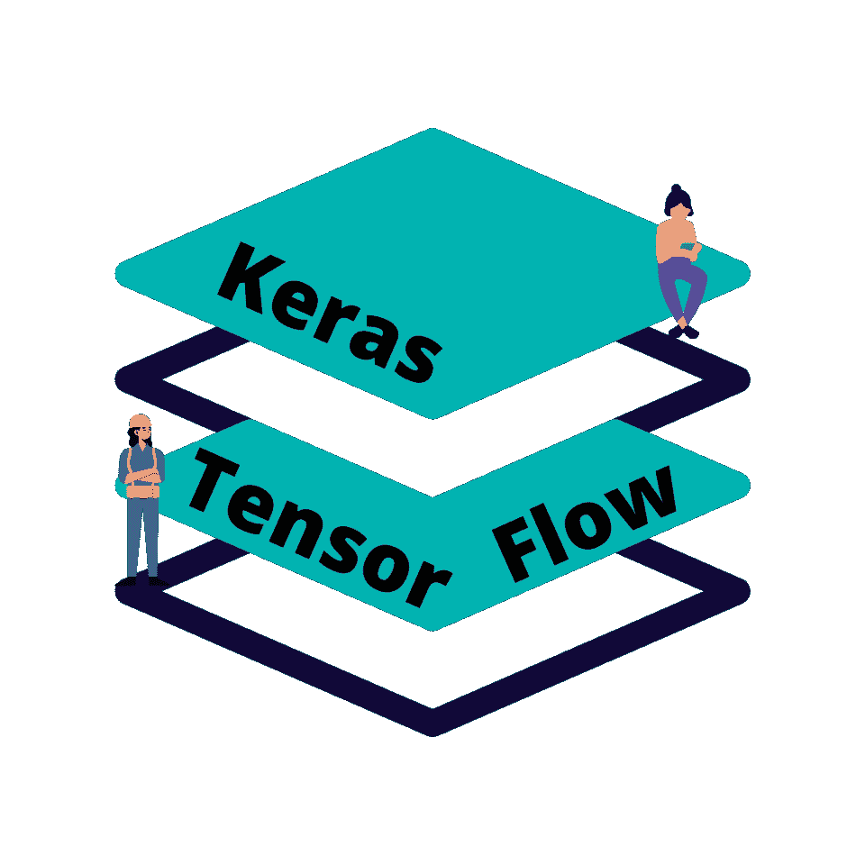
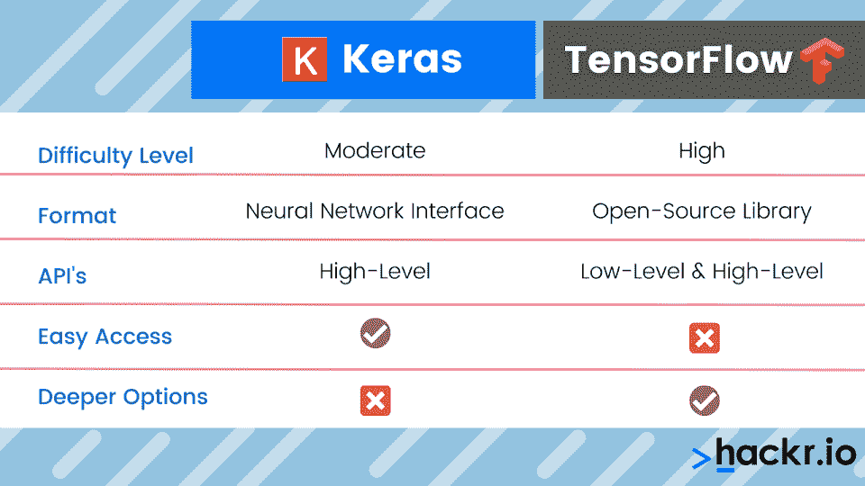

# Keras vs TensorFlow:我该用哪个？

> 原文：<https://hackr.io/blog/keras-vs-tensorflow>

Keras 和 TensorFlow 都是流行的机器学习神经网络技术。根据您是从数据科学家的角度还是从程序员的角度来研究神经网络，您可能更熟悉其中的一种。

虽然这些技术看起来相似，但 Keras 依赖于 TensorFlow，反之则不然。今天，我们将深入了解何时可以使用 Keras vs TensorFlow，以及何时 TensorFlow 本身就足够了。

## Keras 和 Tensorflow:它们是用来做什么的？

Keras 和 TensorFlow 都是神经网络机器学习系统。但是，虽然 TensorFlow 是一个用于机器学习的端到端开源库，但 Keras 是一个运行在 TensorFlow(或另一个开源库后端)之上的接口或抽象层。

当您使用 Keras 时，您实际上是在使用 TensorFlow 库。但是您使用 TensorFlow 库的方式更加直观、可视化和模块化。Keras 使 TensorFlow 库更容易使用，但也有一些缺点。具体来说，您可能无法访问更复杂(也更令人困惑)的低级实用程序。

## **Keras:tensor flow、CNTK 和 Theano 上的神经网络库**

Keras 是一个用 Python 编写的神经网络库，构建在 [TensorFlow](https://hackr.io/tutorials/learn-tensorflow) 以及其他后端如 CNTK 和 Theano 之上。它可以定制和扩展，是模块化和可组合的，并且具有易于使用的界面，非常适合那些希望快速部署的人。它还有[极其广泛的文档](https://keras.io/api/)。

**Keras 的优势包括:**

*   **用户友好的界面:**那些没有太多 Keras 或 TensorFlow 开发经验的人会遇到更少的初始障碍。如果您想快速建立并运行一个模型，这很有帮助。
*   **简单的定制构建模块:** Keras 在 TensorFlow 的高级[API](https://hackr.io/blog/what-is-api-testing)和特性之上提供了一个抽象层，尽管代价是低级 API 不再可用。
*   **总体易用性:** Keras 通过为开发人员的操作提供更多反馈来改进故障排除流程，使整个系统比界面提供的更易于使用。

如果您想要一种更快、更简单的方法来部署、构建和训练神经网络模型，以及 TensorFlow 的强大功能，您可以使用 Keras。如果你懂 Python，使用 Keras 就更容易了。

### **Is Keras Part of Tensorflow?**

Keras 是用于机器学习的 TensorFlow [开源](https://hackr.io/blog/top-10-open-source-security-testing-tools-for-web-applications)库的包装器，旨在使开发神经网络的过程更容易。但 Keras 并不是 TensorFlow 的一部分，因为 Keras 可以与其他开源库甚至专有库一起使用，只要它与它们集成在一起。将 Keras 视为一个可用于多个后端的抽象层。

### **Keras 好做研究吗？**

Keras 特别适合研究，尤其是对于那些了解 Python 或者不想深入编程的数据科学家来说。Keras 使开发神经网络和模型的过程变得更加容易，这反过来意味着那些不擅长编程和开发的人可以快速构建、训练和部署模型。

### **哪些公司使用 Keras？**

使用 Keras 的公司包括优步、Yelp、网飞、Instacart 和 Square。每当需要深度学习、机器学习或者神经网络的时候，都可以使用 Keras。对于像网飞这样的服务，Keras 可以用来建立建议引擎。对于 Square 等服务，Keras 可以用来检测欺诈或识别购买模式。

当然，需要注意的是，如果一家公司正在使用 Keras，他们可能也会使用 TensorFlow。虽然该公司可能会在不同的后端使用 Keras，但这种情况很少见。

### **使用 Keras 有什么好处？**

除了其直观的界面，Keras 还有一系列错误消息和警告，旨在让开发人员和科学家更深入地了解系统可能无法工作的原因。这极大地改进了故障排除过程并减少了开发时间。

Keras 背后的想法是实现对 TensorFlow 后端更高层次的可见性；如果你对 TensorFlow 感觉不透明感到沮丧，Keras 是一个极好的选择。

此外，Keras 还为那些仍在学习如何开发神经网络以及如何操作 TensorFlow 端到端开源库的人提供了大量文档。

## **TensorFlow:一个用于机器学习的开源库**

TensorFlow 是一个端到端的开源库，旨在支持机器学习应用。TensorFlow 中包括低级和高级 API，它们可以绑定在一起，以促进机器学习项目。虽然这是一个相当复杂的解决方案，但是安装 TensorFlow 并开始使用它并不困难。

**tensor flow 的优势包括:**

*   **轻松建立模型:** TensorFlow 非常容易上手。如果您是一名熟练的 Python 程序员，并且已经了解 TensorFlow，您将能够比 Keras 更快地在 TensorFlow 中构建、训练和部署模型，就像命令行实用程序比 GUI 使用起来更快一样。
*   **快速模型部署:**同样，只要你理解机器学习的复杂性，你就能更快地部署和测试你的模型。因为 Keras 提供了一个抽象层，所以它也可以在开发者和 TensorFlow 的功能之间提供一个工作层。
*   **灵活性和控制:**与 Keras 相比，TensorFlow 提供了更精细的控制，除了高级 API 之外，您还可以访问低级 API。

TensorFlow 是一个高级库，要求开发人员深入理解机器学习技术和编程。TensorFlow 和 Keras 一样，都是用 Python 写的，给 Python 程序员一个优势。对于神经网络和机器学习来说，Python 是最流行(如果不是最流行的话)的编程语言之一。

### 【Tensorflow 和 Keras 可以分开用吗？

你可以在没有 Keras 的情况下使用 TensorFlow，也可以将 Keras 与 CNTK、Theano 或[其他机器学习库](https://hackr.io/blog/best-machine-learning-libraries)一起使用。虽然您可以在没有 TensorFlow 的情况下使用 Keras，但 Keras 总是需要一个后端；它只是一个接口，而不是一个主要的处理工具。同时，TensorFlow 可以直接使用，不需要 Keras 接口的支持。

### **tensor flow 比 Keras 快吗？**

Keras 在张量流和个体之间引入了一个抽象层次。但这取决于你说的是什么。使用 Keras 更容易，这意味着您可以更快地部署模型。但是 Keras 可能会在原始机器速度方面引入一些低效率，因为所有内容在到达 TensorFlow 库之前都经过了 Keras 层的过滤。

### **Is TensorFlow a Keras?**

Keras 支持 TensorFlow、CNTK 和 Theano，但 TensorFlow 是自己的开源库。Keras 是 TensorFlow 库的包装器，专注于快速、直观的神经网络开发。

### **tensor flow 有什么优势？**

虽然这看起来违反直觉，但直接使用 TensorFlow 可能是创建小项目的最佳方式。如果你没有深入研究 TensorFlow，你可以在 24 小时内完成一个小项目。但是如果你试图做一些适度复杂的事情，你会遇到抽象和复杂的问题。这就是 Keras 可以简化系统的地方。

同时，如果你试图做一些非常复杂的事情，你可能会碰到 Keras 系统的边界。因此，TensorFlow 具有 U 型效益；它最适合那些开发小型快速项目的人和那些开发大型可扩展项目的人。另一方面，对于许多中型项目，Keras 可能更胜一筹。

## **Keras 和 TensorFlow 哪个好？**

这取决于你想做什么。如果你试图开发一个简单的神经网络用于快速部署，Keras 是有意义的。如果需要做深度定制或者使用底层 API，直接去 TensorFlow 是有意义的。

初学者可能想从干净、用户友好的 Keras 界面开始。同时，学习 Keras 的人可能不会直接接触到 TensorFlow 库的所有可能性。

## 【Keras 和 TensorFlow 的区别

如您所见，很难比较 Keras 和 TensorFlow，因为 Keras 本质上是一个运行在 TensorFlow 之上的应用程序，旨在使 TensorFlow 部署过程更快、更简单。TensorFlow 单独使用更困难，但也有一些好处，比如低级别的 API 访问。无论哪种方式，您都可以使用 Keras 或 TensorFlow 来构建、训练和部署模型。

Keras 专为易用性和简单性而设计，而许多人会发现 TensorFlow 提供了更好的更深入的选项。所以，这取决于你需要做什么。如果您需要额外的功能，可以从 Keras 开始，然后切换到 TensorFlow。同样，如果 TensorFlow 被证明太复杂，可以从 TensorFlow 开始，然后切换到 Keras。

## **Tensorflow 和 Keras 示例和用例**

TensorFlow 和 Keras 本质上都有相同的用例:分析大量的大数据。TensorFlow 和 Keras 模型可以根据数据进行“训练”,然后用于建模、分析和模拟数据。一些使用案例包括:

*   **图像识别:** TensorFlow Keras 可以用来识别图像，比如识别人脸，或者对图像进行分类，比如识别汽车、自行车、卡车。这可用于过滤掉不需要的数据或挖掘数据以获得更多信息。
*   **语音识别:** TensorFlow Keras 还可以进行复杂的语音和音频识别，比如出于安全目的识别某人的语音，或者出于版权检查目的识别音频。
*   自然语言处理: Keras 可用于解析自然语言，创建聊天机器人、人工智能和建议引擎，这些引擎可以将用户的句子解析为机器可以理解和回应的内容。
*   **时间序列数据:**你可以使用复杂的时间序列来理解、分析和挖掘消费者数据，以确定用户的行为。这对于大规模的电子商务市场、流媒体平台甚至游戏来说尤其有用。
*   **视频探测:** NASA 正在[使用 TensorFlow 模型](https://www.nas.nasa.gov/hecc/support/kb/multiple-cpu-nodes-and-training-in-tensorflow_644.html)对太空中的小行星进行建模。TensorFlow Keras 可用于检测和推断视频中的信息，就像它可以从图像和音频中检测信息一样。

但是机器学习技术的新用例一直在开发。数据科学家发现，通过神经网络和机器学习培养的模式识别和分析可以应用于几乎任何网络。

## Keras 与 TensorFlow:势均力敌的比较

| **参数** | **Keras** | **TensorFlow** |
| **由**开发 | 弗朗索瓦·乔莱 | 谷歌大脑团队 |
| **写于** | 计算机编程语言 | Python、CUDA 和 C++ |
| **最适合** | 小数据集和低性能模型 | 大型数据集和高性能模型 |
| **API 等级** | 高的 | 到处 |
| **架构** | 简洁明了 | 复杂的 |
| **易用性** | 高的 | 低的 |
| **社区支持** | 有限的 | 强烈的 |
| **调试** | 因其架构而简单 | 困难的 |
| **人气** | 最受欢迎 | 第二受欢迎 |
| **速度** | 慢的 | 快的 |

## **底线**

Keras 和 TensorFlow 都是[基于 Python 的神经网络](https://hackr.io/tutorial/deep-learning-basics-with-python-tensorflow-and-keras)和机器学习技术。这个领域很广阔，而且在不断发展。如果你想学习更多关于开发神经网络、创建机器学习模型以及分析和研究人工智能的知识，学习 Python 是一个好主意——并深入挖掘可用的[开源机器学习技术](https://hackr.io/tutorials/learn-machine-learning-ml)。

考虑参加机器学习训练营，学习一些 Python 课程，或者学习更多关于 Keras vs TensorFlow 的知识。

[加入最好的机器学习训练营](https://click.linksynergy.com/deeplink?id=jU79Zysihs4&mid=39197&murl=https%3A%2F%2Fwww.udemy.com%2Fcourse%2Fpython-data-science-machine-learning-bootcamp%2F)

**人也在读:**