# 可汗学院评论:利弊与选择

> 原文：<https://hackr.io/blog/khan-academy-review>

自 2008 年以来，可汗学院提供了某种形式的免费教育。它已经获得了数百万美元的捐款和资助，谷歌在 2022 年 2 月捐赠了 500 万美元。学生可以在这个平台上完全免费学习，甚至享受一些游戏化的激励元素。但是可汗学院到底是什么，是为谁服务的？

| 教练 | 5/5 |
| 课程 | 4/5 |
| 经验 | 4.5/5 |
| 总数 | 4.5/5 |

**一览:**

*   可汗学院致力于提供免费的 K-14 教育，甚至包括像 SAT 这样的标准化考试。
*   该平台具有游戏化元素和成就，有助于激励学习者。
*   您不需要帐户，但拥有一个帐户来跟踪进度和访问更多功能是一个好主意。
*   可汗学院从捐赠者那里获得资金，无论他们是个人还是大公司和基金会。
*   多亏了志愿翻译，许多课程都有其他语言的文本。
*   可汗学院在 [iOS](https://hackr.io/tutorials/learn-ios-swift) 和 Android 上都有。

在这篇 Khan Academy 评论中，我们将探讨流行学习平台的各个方面。我们将探索可用的课程，网站如何工作，以及它如何获得资金，以便它可以继续提供免费教育。让我们开始吧！

## **什么是可汗学院？**

**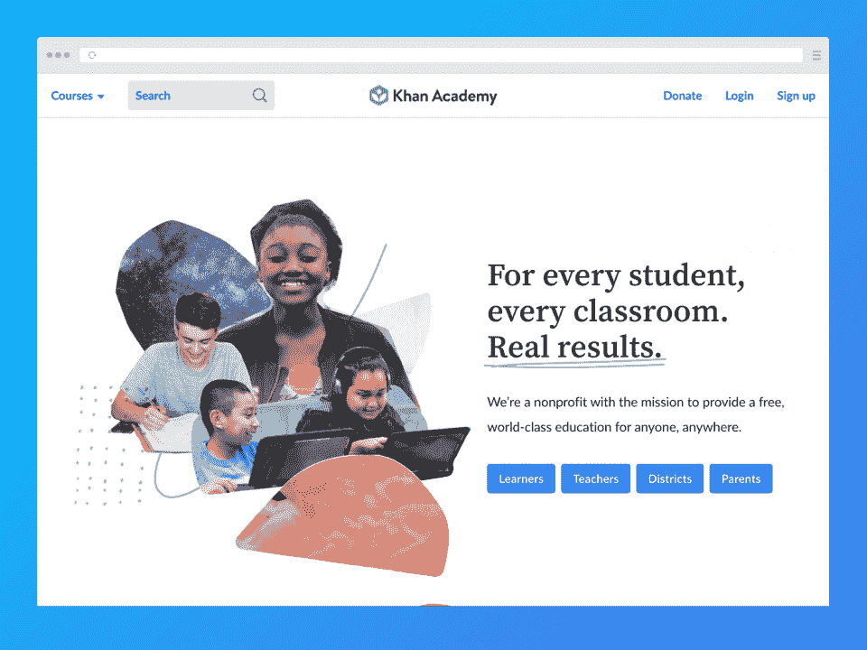**

汗学院是以萨尔曼·可汗的名字命名的，他在十年前的 2008 年建立了这个学院。它最初只是作为 Khan 帮助辅导他的堂兄弟的一种方式，快进到今天，它已经发展成为一个巨大的 501(c)(3)非营利组织，专注于为所有人提供免费教育。课程一般通过短视频和“虚拟黑板”来教授。

Khan Academy 提供适合 K-14 学习者的课程，还有一些针对成人学习者的课程。准备参加标准化考试的学生也可以使用 KA 的资源进行准备，因为该平台有 SAT，ACT，LSAT 和 GMAT 的考试准备。

除了作为学习者的网站，可汗学院还为在家教育孩子的父母和需要补充课程或资源的老师提供资源。

### 可汗学院合法吗？

绝对的！许多可汗学院的评论会告诉你这个平台有多合法。但你不必相信我们的话——自 2008 年成立以来，可汗学院免费为所有人提供优质教育。但是可汗学院是可靠的来源吗？答案也是肯定的——原因如下:

成立两年后，可汗学院收到了 200 万美元和 150 万美元的捐款来启动该平台。这些赠款分别由谷歌和比尔及梅林达·盖茨基金会在 2010 年提供。包括康卡斯特、大学委员会和美国银行在内的一些支持者甚至各自捐赠了超过 1000 万美元。就在 2022 年 2 月，谷歌又向可汗学院捐赠了 500 万美元用于内容开发。

除了汗学院的 200 多名专家确保课程质量并提供准确的信息，该平台还拥有将课程视频翻译成其他语言的贡献者。

2015 年，可汗学院发表了一篇文章，讨论大学生在可汗学院的经历。尽管可汗学院已经将重心转移到提供 K-14 教育上，这篇文章仍然是这个平台合法性的有力证明。报告称，在接受调查的 504 名斯坦福学生中，65%的人表示 KA 对他们的教育产生了有意义的影响。在来自哈佛、宾夕法尼亚大学、普林斯顿、麻省理工学院等顶尖学校的 159 名受访学生中，57%的人表示可汗学院对他们的教育有意义。

*这里* *可以看到可汗学院的支持者页面* [*。你可以在这里*](https://www.khanacademy.org/about/our-supporters.) *找到可汗学院的投稿人* [*页面。*](https://www.khanacademy.org/contribute/credits)

### 可汗学院获得认证了吗？

不——可汗学院也承认这一点。因此，可汗学院的课程更适合作为传统教育的补充。

可汗学院是否被认可为家庭学校？不幸的是，没有了。然而，这并不意味着父母不能将其作为一种资源。可汗学院为在家教育孩子的父母提供资源。最后，可汗学院对数学好吗？是啊！一些家长甚至将可汗学院的数学课程作为完整的课程。

因为可汗学院没有被认证，学习者不能获得证书。

### **谁应该使用可汗学院？**

可汗学院是为任何追求知识和学习的人设立的。你可以是来自任何背景的任何年龄的人，你很有可能会在这个平台上找到可以学习的东西。然而，值得一提的是，在过去的几年里，可汗学院加倍关注提供更面向 K-14 的教育。他们甚至在 2020 年取消了一些课程，以更好地向 K-14 看齐。

因为 Khan Academy 是 100%免费的，所以它是获得优质教育机会有限的学生的绝佳资源。可汗学院的课程和内容甚至被用于一些非营利组织的[计划](https://www.riseforyemen.org/post/no-internet-no-electricity-mobile-learning-lab-offers-solutions)中，为那些无法获得电力或互联网的人提供教育。

学习者不是唯一能从这个平台中受益的人。Khan Academy 对寻找资源的教师或在家教育孩子的家长也很有帮助。

## **可汗学院是如何运作的？**

一旦你到达可汗学院的网站，你会看到它简单明了的用户界面。网页设计简单而整洁，使导航成为一种流畅的体验。

在主页上，您会看到四个可点击的按钮:学习者、教师、学区*和家长。点击学习者、教师或家长，您将进入可汗学院的注册页面，在这里您可以注册为学习者、教师或家长。每个帐户都有不同的功能可以让您受益。然而，你甚至不需要创建一个账户就可以使用这个平台。

学习就像点击主页左上角的“**课程**链接一样简单。您将看到一个下拉菜单，列出了所有可汗学院的课程。只需选择你想学的课程，它就会带你进入课程页面。例如，点击**电脑编程**会将你带到以下页面:

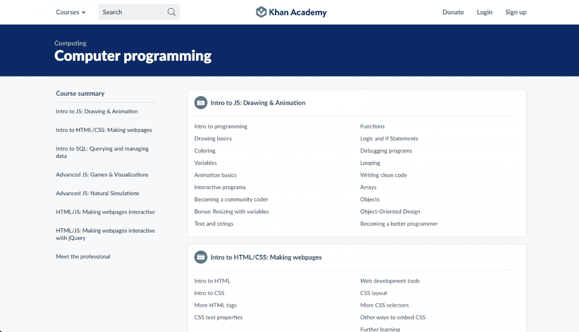

从这里，你可以选择你想开始的课程。先说 [HTML](https://hackr.io/blog/html-projects) 。点击“**HTML 简介**”将打开本课程的课程，这些课程已经安排好了，以便于你一个接一个地学习概念。

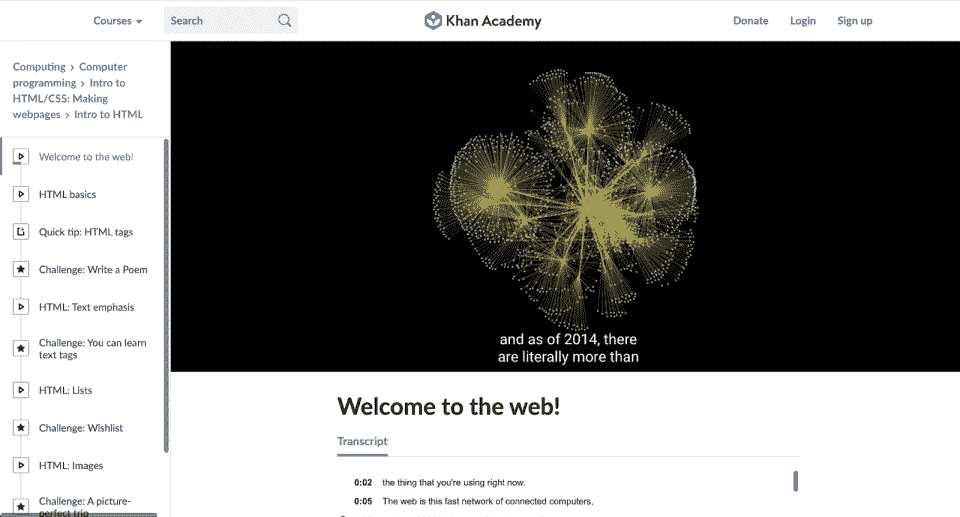

点击一个实际的课程将带您到课程页面，其中包含课程视频，抄本，问题，提示，等等。

帐户持有人可以在观看讲座和完成可汗学院的特定任务时获得“能量点”。这些要点将整个学习体验游戏化，鼓励你继续你的旅程。

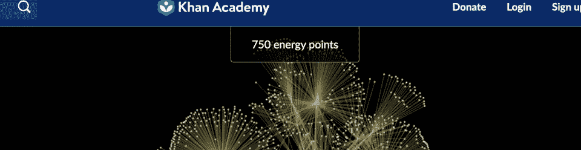

根据可汗学院的信息[页面](https://support.khanacademy.org/hc/en-us/articles/202487710-What-are-energy-points-badges-and-avatars-)显示，能量点衡量的是在平台上学习所花费的努力。然而，它们并不衡量你的能力或对这门学科的掌握程度。您可以通过以下方式赢取积分:

*   完成视频
*   完成计算机编程的挑战
*   做练习题
*   完成任务

但是你到底能用这些积分做什么呢？

赚取积分可以帮助您获得徽章。您还可以使用它们来改进您的个人资料头像:

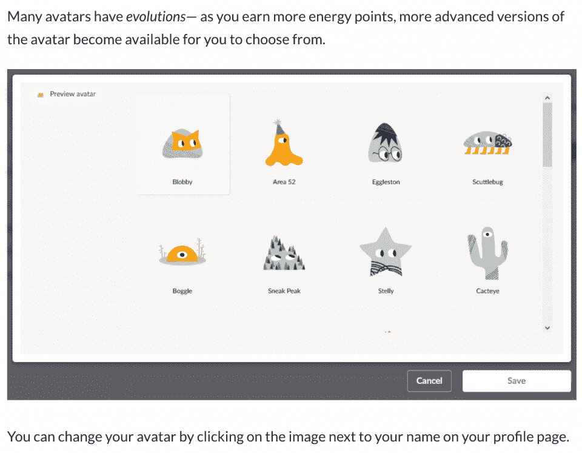

平台上的另一种游戏化形式是徽章(和挑战补丁)。您可以通过不同的方式获得徽章——获得能量点、学习计算机科学、建立锻炼掌握度等等。徽章有五个等级:陨石(最常见)，月球，地球，太阳，黑洞(最罕见)。

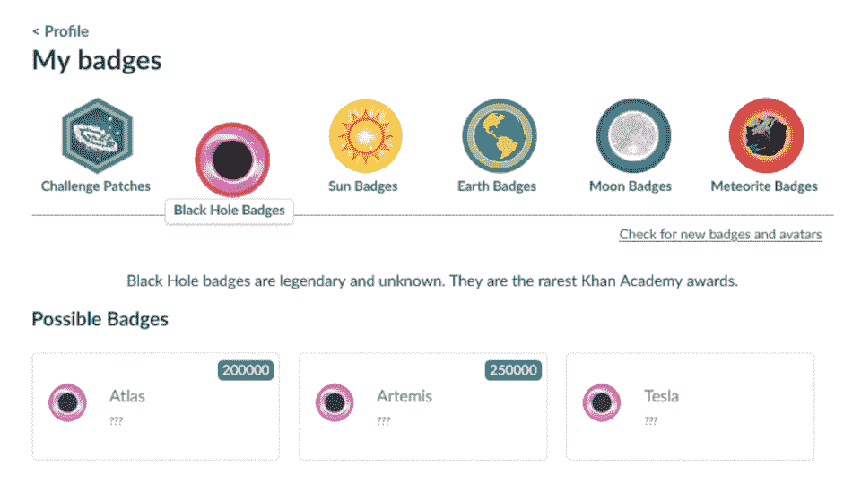

徽章、头像和能量点有助于激励学习者完成课程、任务和练习。这是一种让学生跟上课程进度的新颖方法！

[**可汗书院学区*](https://districts.khanacademy.org/) *是平台面向* *学区* *的产品之一。它为教师、校长和学区管理员提供数据洞察、专业发展和工具，帮助他们监控学生对 KA 的使用。*

### **如何开设可汗学院账户**

建立一个可汗学院的账户不是强制性的。虽然你会错过一些功能，但你可以不注册也能过下去。例如，您将无法:

*   跟踪你正在学习的课程的进度
*   赚取任何能量点
*   获得任何徽章
*   使用任何头像
*   参与课程问题部分和论坛

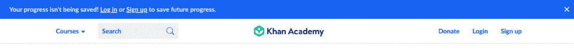

如果您在没有帐户的情况下使用 Khan Academy，网站会通知您进度没有保存，并提供一个简单的登录或注册链接。

幸运的是，注册 KA 账户非常简单。在主页上，单击下面的一个按钮开始注册过程。学区更多的是学生区，所以选择学习者，老师，或者家长。

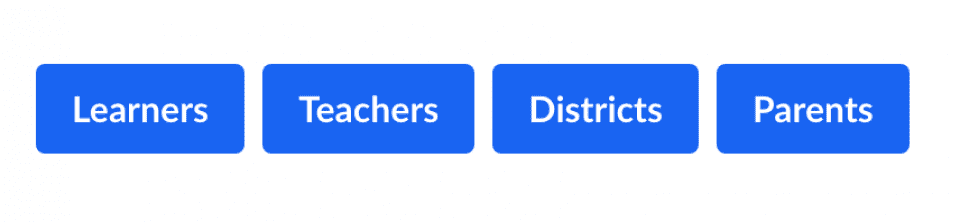

如果您点击了错误的项目，请不要担心，下一页允许您更改您的选择。

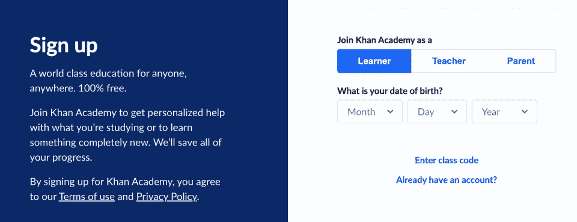

注册成为学生时，你需要输入你的出生日期。一旦你注册了，你就可以注册一个电子邮件地址，或者使用你的谷歌、脸书或苹果账户。用户必须年满 13 岁才能创建帐户；否则，他们的父母可以为他们创建帐户。

你可以用电子邮件地址或谷歌、脸书、苹果或智能账户注册成为一名教师。查看下面的一些教师帐户优势:

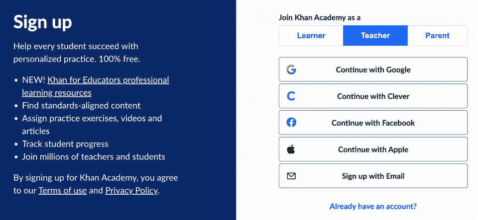

您可以使用您的电子邮件地址、谷歌、脸书或苹果帐户注册为家长。创建家长帐户后，请按照 KA 的说明为您的孩子创建一个帐户。

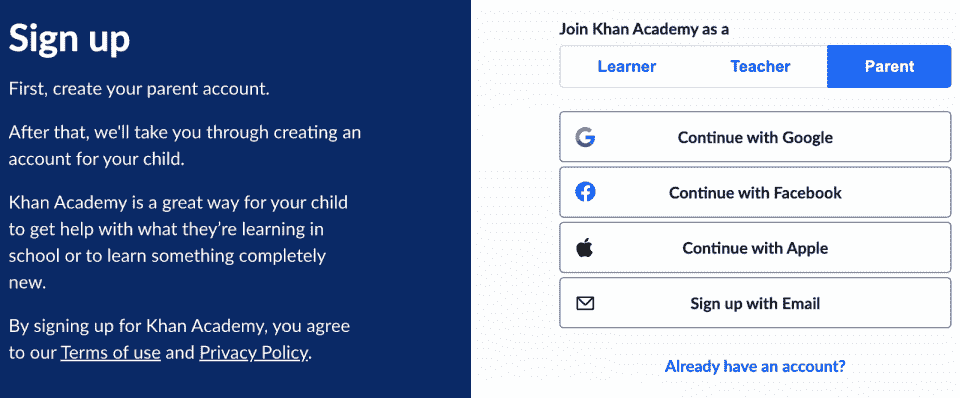

## **可汗学院的利弊**

可汗学院好吗？这个平台有一些优点和缺点，但是你很难找到很多批评性的评论。让我们评估一下可汗学院的利弊:

| **优点** | **缺点** |
| 100%免费——除非你选择向该平台进行个人捐赠，否则你永远不会为进入可汗学院的课程支付一分钱。 | 课程科目/主题有限，更侧重于 K-12 教育和美国的需求 |
| 没有广告(除了偶尔鼓励捐款的横幅) | 只有一种教学方式(虚拟黑板和视频) |
| 课程是高质量的，由对该主题有丰富知识的专家创建。有视频、测验和阅读材料。 | 不是最好的互动性，上课不是很深入 |
| 许多家长已经开始将可汗学院的课程纳入他们的家庭学校课程。像可汗学院数学这样的课程甚至可以作为完整的数学课程 |  |
| 易于使用、直观且用户友好 | 可汗学院曾因一些课程中的信息不准确而受到批评，尽管该平台聘请了 200 名事实核查专家来纠正这一问题。 |
| 尽管并非所有课程都已翻译，但可随时随地以各种语言(字幕)访问 | 缺乏对教师的个性化体验 |
| 学习被*游戏化*，有助于激励学生学习。重点是*掌握学习*，让学生能够按照自己的进度学习。 |  |
|   |  |
| 提供优质、*免费*教育的卓越声誉 |  |
|   | **可汗学院课程多少钱？** |

## 在可汗学院学习将花费你一大笔钱……什么都没有！作为一个 501(c)(3)非营利教育组织，可汗学院提供完全免费的课程。

可汗学院声称其使命是“为任何人、任何地方提供免费的世界级教育”

当你去可汗学院的时候，你会注意到没有价格和收入广告。考虑到他们没有任何收入，可汗学院到底是如何资助一切的呢？

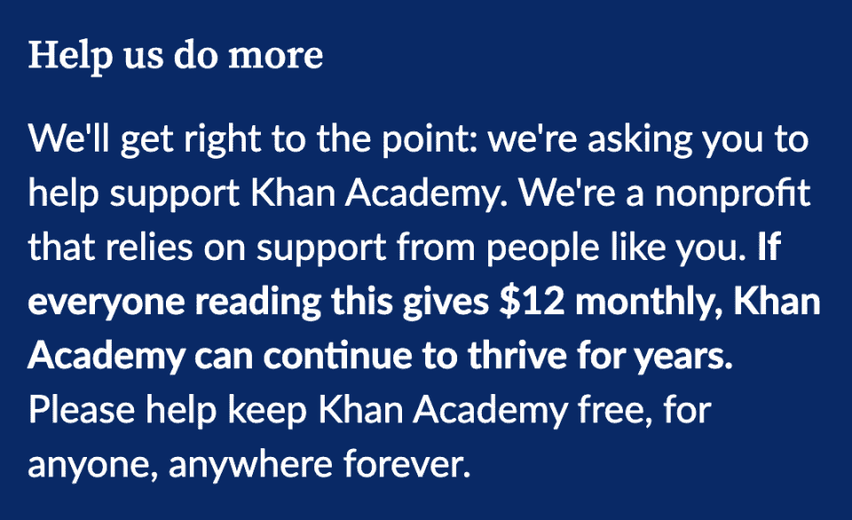

捐赠者和慈善家慷慨地支付可汗学院的费用。许多支持者向该平台捐赠了数百万美元，帮助它提供高水平和高质量的教育。然而，可汗学院也接受普通个人的捐赠。

如果你想给可汗学院捐款，你可以在这里捐款。你可以一次性捐款，也可以选择按月捐款。汗学院建议每月捐款从 12 美元开始，最高 50 美元，不过你也可以选择一个自定义的数额。该平台还有一个复选框，你可以勾选，在每月总额中增加 0.30 美元，以支付交易费用。对于一次性捐赠，交易费为 0.63 美元。

当你向可汗学院捐款时，你可以通过信用卡或 PayPal 进行。你也可以用支票或使用 Square 现金或比特币进行捐赠。你可以在这里找到更多信息[。](https://support.khanacademy.org/hc/en-us/articles/202260374-How-can-I-donate-to-Khan-Academy-)

如果你想为这个平台提供支持而不赠送任何礼物，你可以选择成为这个平台的贡献者，帮助做一些事情，比如翻译。

**可汗学院提供免费课程吗？**

### 是的——可汗学院的每一门课程都是完全免费的。

**可汗学院学费退款**

### 因为可汗学院上的课程都是免费的，不需要退款。对平台的捐赠和贡献也是不可退还的。如果你是按月捐款，你可以取消你的捐款，以停止下个月的付款。取消捐赠的链接在收据的底部。

可汗学院有哪些课程？

## Khan Academy 上有许多课程，但大多数都是面向 K-14 观众的。进入他们的网站，点击页面左上方的“课程”链接，会弹出下面截图中的菜单:

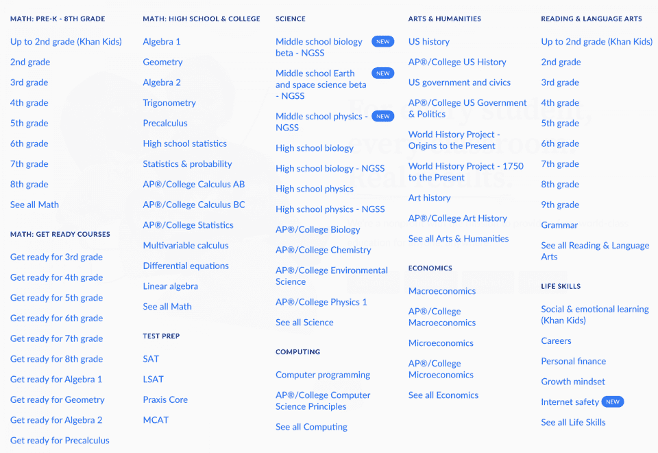

可汗学院有一些课程。学生可以学习数学、科学、计算机、艺术和人文科学、经济学、阅读和语言艺术、备考和生活技能。每个类别都有大量包含实际课程和教训的子类别。

你可能已经注意到，可汗学院主要专注于数学，甚至提供三个主要类别——预备课程、学前到八年级以及高中和大学。有了各种水平的数学课程，许多老师和在家上学的家长使用可汗学院的数学课程就不足为奇了。

当然，同样重要的是，可汗学院提供计算方面的课程，包括计算机编程和一些计算机科学课程，如信息论、算法和密码学。您还可以查看可汗学院的 AP 或大学计算机科学原理课程，其中包括以下主题:

编程；编排

*   [数据分析](https://hackr.io/blog/what-is-data-analysis-methods-techniques-tools)
*   在线数据安全
*   模拟
*   计算创新
*   您甚至不需要创建帐户，学习就像导航到您选择的课程和课时一样简单。最后，您可以在浏览器(或手机应用程序)中观看课程视频。

**如何选择合适的可汗学院课程**

## 为您选择合适的可汗学院课程就像从课程菜单中选择一个课程一样简单。所有的课程都是免费的，所以如果你不喜欢你正在上的课程，你可以停下来选择另一门课程。

**最佳可汗学院课程**

## 可汗学院的科技相关课程不多，但我们当然可以推荐[计算机编程课程](https://www.khanacademy.org/computing/computer-programming)。

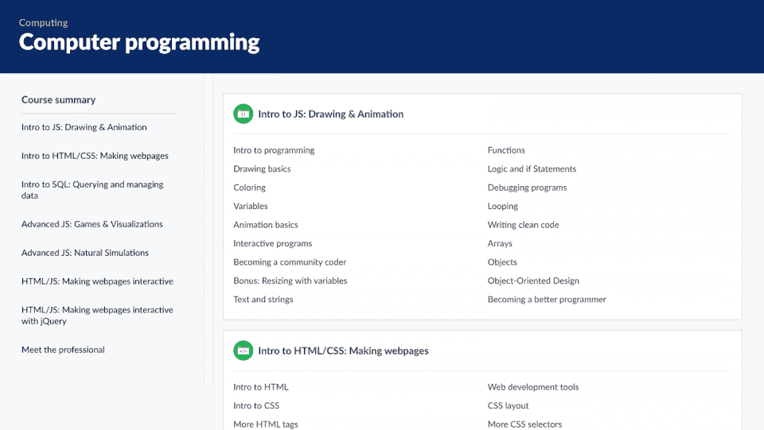

Khan Academy 的计算机编程部分提供了关于 HTML、CSS、 [JavaScript](https://hackr.io/blog/how-to-learn-javascript) 和 SQL 的精彩介绍。您可以在这里免费学习，然后继续学习其他平台上的其他课程，进行更多学习。

请随意查看 KA 的[计算部分](https://www.khanacademy.org/computing)中提供的其他课程。你甚至会发现[生活技能](https://www.khanacademy.org/college-careers-more)部分的一些课程很有用，比如个人理财和网络安全。

**可汗学院回顾:总结**

## 可汗学院是一个很好的平台，很多人都喜欢。以下是我们的评论概览:

**用户友好度:4.5/5** -使用这个平台很简单，不需要你精通技术。我们也喜欢有一个帐户不是访问课程的必要条件。

*   **便利性:5/5** -可汗学院可在所有平台上使用，包括其 iOS 或 Android 应用。你甚至可以离线访问平台。

*   **可访问性:5/5** -离线访问、视频抄本和抄本翻译成多达 28 种语言赢得了我们的最高分。

*   **负担能力:5/5**——免费。我们还需要多说吗？

*   **认证:不适用** -可汗学院不提供证书。

*   目录:2.5/5 -如果你是一名 K-14 学习者，目录实际上得到 5/5。但对于与技术相关的内容，我们给它打 2.5/5。

*   **课程质量:5/5** -可汗学院的内容专家确保课程经过事实检验，质量上乘。

*   **用户支持:5/5** -你会注意到可汗学院提供出色的客户支持，对用户的询问和投诉做出周到和持续的回应。

*   **支付方式:4.5/5** -可汗学院尽最大努力让你可以使用信用卡、PayPal、Square Cash 或比特币轻松捐款。

*   **最终裁决和评级**

## 真的很难找到负面的可汗学院评论。毕竟，很难指责可汗学院——尤其是当它免费提供它所做的一切时。然而，由于它的主要重点是 K-14 教育，你将很难学到更多基础知识来帮助你在技术领域开始职业生涯。尽管如此，我们认为可汗学院是一个优秀的平台，值得获得 **4.5/5** 颗星的评级——我们只是希望它有更多与技术相关的技能课程！

**我们的最终评分:4.5/5**

**可汗学院的替代方案**

## 汗学院提供几乎无与伦比的价值，因为它是完全免费的。然而，如果你的主要目的是学习新的技能和知识，以开始或推进科技职业生涯，汗学院可能会让你想要更多。幸运的是，有许多可供选择的方法——其中一些甚至有免费课程。最棒的是，这些选择中的大部分都提供了你可以添加到简历中的证书。

让我们来看看一些替代方案:

由 [Simplilearn](https://hackr.io/blog/simplilearn-review) 提供的SkillUp 有数百门免费课程可供选择。这些由业内专家打造的课程，可以帮助你随时随地向业内专家学习。有了 SkillUp，你可以学习 600 多种热门技能，还可以获得免费指南、求职面试技巧等等。此外，如果你想了解更多并获得证书，你可以把它放在你的简历上，你可以报名参加 Simplilearn 的付费课程。

*   如果你想提升技能，让你的职业发展，Udemy 是一个极好的平台。该平台有成千上万的课程，所以你很可能会找到一个适合你的需求(只要确保检查评论)。如果你对你的课程不满意，你可以在三十天内退还全额退款。Udemy 也有一些免费课程，但是你必须付费才能获得结业证书。最后，雇主并不总是认可 Udemy 的证书；然而，如果你能证明你的技能或者你有一个好的投资组合，你的证书就没那么重要了。

*   **[EdX](https://www.awin1.com/cread.php?awinmid=6798&awinaffid=428263&ued=https%3A%2F%2Fwww.edx.org%2F)** 是一个 [MOOC 平台](https://hackr.io/blog/edx-review)，由一些世界上最负盛名的大学——哈佛和麻省理工学院创建。该平台提供许多免费或收费的课程，甚至提供学士和硕士学位。课程是与美国一些最好的大学联合制作的，所以你可以肯定它的质量。

*   **结论**

## 可汗学院是一个非常棒的非营利组织，它的宗旨是永远免费向所有人提供学习机会。有了捐助者的持续支持以及大公司和基金会的慈善捐赠，可汗学院可以在未来许多年继续其使命。

我们希望这篇 Khan Academy 评论能够帮助您更深入地了解这个免费的电子学习平台以及它能为您做些什么。快乐学习！

如果你想找到更多获得理想 IT 工作的途径，我们可以满足你。

探索 5 种方法获得你的第一份 IT 工作！

**常见问题解答**

## **1。可汗学院值得信任吗？**

#### 绝对的！可汗学院收到了来自大公司和慈善组织的捐款，如谷歌、比尔和梅林达盖茨基金会、康卡斯特、埃隆马斯克基金会和大学理事会。2022 年 2 月，谷歌向可汗学院额外捐赠了 500 万美元，用于内容开发。

可汗学院有大量的专家帮助他们创建和策划课程，确保所有课程的高质量。你可以在这里看到他们的内容专家[。](https://www.khanacademy.org/about/our-content-specialists)

**2。可汗学院是绝对免费的吗？**

#### 可汗学院免费吗？**是**！可汗的在线学院为所有人提供免费教育，不分年龄和背景。501(c)(3)非营利组织的主张是让平台**永远对任何人、任何地方**免费。为了实现这个目标，可汗学院接受捐赠。

**3。可汗学院可以作为完整的课程吗？**

#### 一般来说，不会——我们不建议将可汗学院作为完整的课程。然而，许多在家教育孩子的父母和传统教师将可汗学院的课程作为他们课程的一部分。最后，你可能会考虑只使用可汗学院作为其数学课程的完整课程，从早期数学到微积分。

**4。可汗学院是什么年龄段的？**

#### 可汗学院是一个老少皆宜的平台。任何人都可以来这个平台上学习，不管他们的年龄，所以如果你有什么想学的，你可以直接去寻找可汗学院的课程。

也就是说，可汗学院已经将重点转向了 K-14 教育。

**5。成人学习者可以使用可汗学院吗？**

#### 是啊！你可以在可汗学院找到像历史和科学这样的课程，这些课程并不专属于年轻的学习者。当然，该网站的大部分内容更适合 K-14 学习者，但不要让这个事实阻止你。学习适合任何人，任何年龄。如果有你感兴趣的东西，试试看生活技能部分！

Yes! You can find courses at Khan Academy like history and science, which aren’t exclusive to younger-aged learners. Sure, much of the website’s content is more for K-14 learners, but don’t let that fact stop you. Learning is for anyone, *any age*. Try looking at the Life Skills section if there’s anything that interests you!