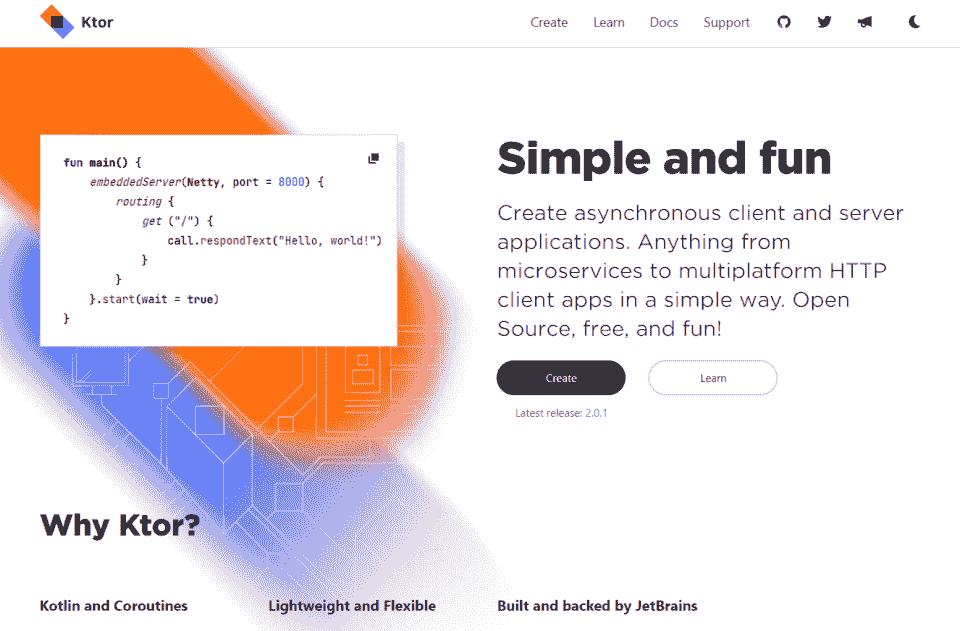
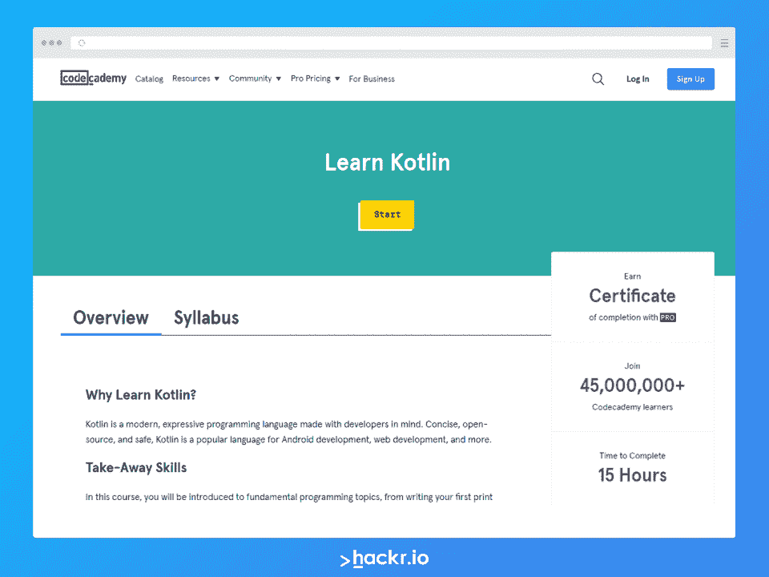
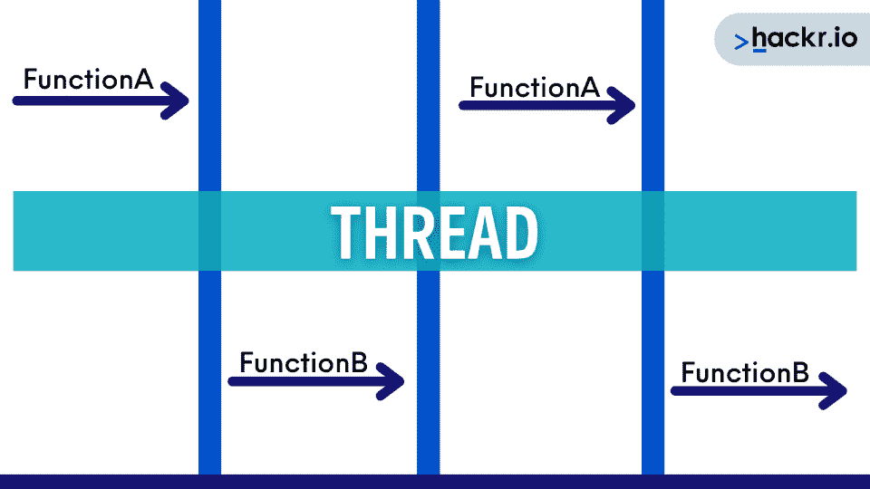
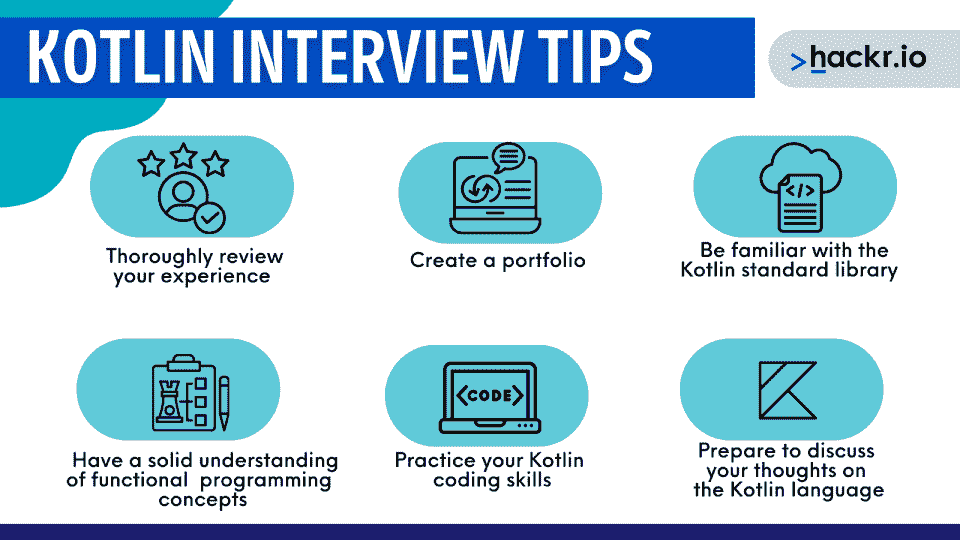

# 2023 年 40 大科特林面试问答【更新】

> 原文：<https://hackr.io/blog/kotlin-interview-questions>

Kotlin 是一种现代的、面向对象的编程语言，已经变得越来越流行。假设你想用 Kotlin 找到一份初级甚至高级开发人员的工作。你需要为各种各样具有挑战性的科特林面试问题做好准备。

即使您对编程语言很有经验，也要考虑这一点。直到你具体遇到 Kotlin 协程面试问题，你可能才意识到自己对协程了解不够。

我们来看看科特林面试的一些基础、中级、高级问答。

## **为什么要学习科特林面试问答？**

以下是面试官可能会问的一些最常见的问题。这些问题和答案会给你宝贵的面试前练习，并突出你需要改进的地方。

## **科特林面试新手问答**

在最基本的层面上，您应该熟悉一些常见的术语和概念，比如 Kotlin 的空安全特性、它对函数式编程的支持，以及它与 Java 等其他语言的比较。您还应该能够编写简单的 Kotlin 代码，并理解常见的库和框架。

以下是一些最常见的科特林基本面试问题。

#### **1。什么是 Kotlin，它的主要特征是什么？**

Kotlin 是一种现代的、静态类型的编程语言，运行在 JVM 上。它的主要特性包括空安全性、对函数式编程的支持以及 Java 兼容性。

这里是“你好，世界！”在科特林:

```
fun main(args : Array<String>) {
   println("Hello, World!")
}
```

与 Java 相比，Kotlin 有几个优势，包括更大的灵活性、可读性和更简洁的语法。此外，Kotlin 支持现代编程范例，如函数式编程，而 Java 并不完全支持函数式编程。

#### **2。Kotlin 与 Java 等其他语言相比如何？**

这里是“你好，世界！”在 Java 中:

```
class HelloWorld {
   public static void main(String[] args) {
       System.out.println("Hello, World!");
   }
}
```

Kotlin 的一些最常见的库和框架包括 [Anko](https://github.com/Kotlin/anko) 、RxJava 和 Ktor。每个库都为在 Kotlin 中构建复杂的应用程序提供了重要的功能。

#### **3。你会在 Kotlin 中使用哪些常见的库和框架？**



#### **4。Kotlin 中的零安全是什么，为什么它很重要？**

空安全是 Kotlin 的一个特性，它确保变量不能被赋值为空值。这一点很重要，因为它有助于避免 NullPointerException 错误，这可能很难调试。

#### **5。Kotlin 的一些基本语法规则是什么？**

Kotlin 的一些基本语法规则包括使用分号来终止语句，使用花括号来分隔代码块，以及使用 val 关键字来声明不可变变量。

#### **6。科特林的 var 和 val 有什么区别？**

var 是可变变量，这意味着它的值可以改变。val 是一个不可变的变量，这意味着它的值不能被改变。把它们想象成变量和常数。

#### **7。Kotlin 中接口和抽象类有什么区别？**

接口是指定一组抽象方法的类型，这些方法必须由实现该接口的任何类来实现。抽象类是定义了抽象和具体方法的类型，子类可以继承这些方法。

#### **8。Kotlin 中的数据类和普通类有什么区别？**

数据类是用来保存数据的类。常规类是可以执行任意操作的类。数据类通常比常规类更简单、更高效。

#### **9。Kotlin 中的 lambda 表达式是什么？**

lambda 表达式是一个匿名函数，可以简洁地表示一个只有一个参数的函数。Lambda 表达式通常与高阶函数(如 map 和 filter)结合使用。

#### 10。Kotlin 中的函数和方法有什么区别？

函数是从源代码中的其他位置调用的命名代码块。方法是与对象相关联的函数，可以通过点符号从其他代码中调用。

## 获得科特林证书！

[](https://www.pntra.com/t/TUJGR0lLR0JHRklKSkdCR0ZISk1N?url=https%3A%2F%2Fwww.codecademy.com%2Flearn%2Flearn-kotlin)

#### **11。Kotlin 中的类和对象有什么区别？**

类是创建对象的模板。对象是一个类的实例。类可以包含属性和方法，而对象只包含数据。

#### **12。Kotlin 中构造器和初始化器有什么区别？**

构造函数是创建对象时调用的一种特殊方法。初始值设定项是一种特殊的方法，可以用来在对象第一次使用之前初始化它。构造函数和初始化函数通常都用 unit 关键字声明。

#### 13。如何在 Kotlin 中声明默认参数？

要在 Kotlin 中声明默认参数，请在定义函数参数时使用 default 关键字。这将为该参数指定一个默认值，如果在调用函数时没有提供实际值，将使用该值。

#### **14。在 Kotlin 中如何定义一个对象？**

要在 Kotlin 中定义一个对象，只需声明一个类并用 new 关键字实例化它。这将创建一个新的类实例，它可以执行各种操作。

```
val newObject= object {
   val one = "Hello"
   val two = "World"
   override fun toString() = "$one $two"
}
```

上面会打印“Hello World”

#### 15。如何在 Kotlin 中声明一个函数？

要在 Kotlin 中声明一个函数，可以使用 fun 关键字，后跟函数名和它接受的参数。然后可以在花括号中定义函数体。

#### 16。如何在 Kotlin 中调用函数？

要在 Kotlin 中调用一个函数，只需使用它的名字，后跟括号操作符和任何必要的参数。这将导致函数以指定的参数执行。

#### **17。Kotlin 中的高阶函数是什么？**

高阶函数将一个或多个函数作为参数，或者返回一个函数作为结果。高阶函数通常与 lambda 表达式结合使用，以创建简洁而强大的代码。

## **Kotlin 针对有经验用户的访谈问答**

在中级水平上，您应该能够讨论更高级的主题，如并发性、Lambdas 和协同程序。您还应该能够编写使用 Kotlin 更高级特性的代码。

#### 18。挂起函数和常规函数有什么区别？

挂起功能可以被挂起，这意味着您可以暂停它的执行并在以后恢复它。常规函数不能被挂起，它将一直执行到完成。

#### **19。Kotlin 中的协程是什么？**

协程是 Kotlin 的特性，允许并发或并行执行代码。协同程序可以通过利用处理器中的多个内核来提高应用程序的性能。

#### 20。线程和协程的区别是什么？



线程是可以独立于其他线程运行的执行单元。协程是一个可以挂起和恢复的执行单元，允许它与其他并发或并行执行共享资源。

#### **21。如何在 Kotlin 中启动协程？**

调用 CoroutineScope 对象上的 launch 函数来启动一个 coroutine，并传入您希望执行的函数。这将创建一个新的协程并立即启动它。

#### **22。如何在科特林取消协程？**

调用 CoroutineScope 对象上的 cancel 函数来取消 Kotlin 中的一个 coroutine。这将取消协程并释放所有资源。

#### **23。在 Kotlin 中，如何在协同程序之间传递数据？**

在 Kotlin 的协同程序之间传递数据的最佳方式之一是使用通道对象，它允许在不同的线程或进程之间进行安全和同步的通信。要创建 channel 对象，只需使用 Channel 构造函数并定义任何想要发送数据的通道。

#### **24。如何在 Kotlin 中创建 lambda 表达式？**

首先，必须使用括号运算符定义表达式接受的参数。然后，您可以在花括号中提供一个可执行的代码块，并使用箭头操作符来指示该代码是 lambda 表达式的主体。

```
val items = listOf(1, 2, 3, 4, 5)
items.fold(0, {
   acc: Int, i: Int ->
   print("acc = $acc, i = $i, ")
   val result = acc + i
   println("result = $result")
   result
})
```

要将 lambda 表达式作为参数传递给函数，请将其包含在函数名和任何必要参数后的括号内。这将导致 lambda 表达式中的代码在函数被调用时被执行。25 .在 Kotlin 中，如何将 lambda 表达式作为参数传递？

#### **26。lambda 表达式和匿名函数有什么区别？**

lambda 表达式是一个可以作为参数传递给另一个函数的函数。匿名函数是没有名字的函数，不能作为参数传递给另一个函数。因此，它们实际上是对立的。

#### **27。Kotlin 中有哪些内联函数？**

内联函数在调用位置内联扩展，这意味着函数代码被复制并粘贴到调用它的代码体中。这可以通过消除对函数调用的需要来提高性能，同时也增加了代码的可读性。

#### **28。扩展函数和常规函数有什么区别？**

扩展函数是为特定类型定义的函数，可以在该类型的变量上调用。常规函数不是为特定类型定义的，可以在任何类型的变量上调用。

## **科特林针对高级开发人员的面试问题**

这些针对高级开发人员角色的 Kotlin 面试问题将测试您的知识和经验。在高级阶段，你应该能够讨论诸如编译器插件、类型推理和具体化类型等主题。您还应该能够在复杂和真实的场景中编写使用 Kotlin 更高级特性的代码。

#### **29。科特林的类型推理是什么？**

类型推断是根据变量或表达式的值自动确定其类型的过程。在 Kotlin 中，类型推断决定了变量首次声明时的类型以及函数的返回类型。

#### 三十岁。科特林中的物化类型是什么？

具体化类型可以在运行时访问，而不仅仅是在编译时。在 Kotlin 中，具体化类型在运行时提供关于类型的元数据，比如它的名称或它的成员的名称。它们也常用于反射和泛型编程。这是 Kotlin 语言初学者不常用的高级特性。

#### 31。如何在 Kotlin 中创建一个编译器插件？

要在 Kotlin 中创建编译器插件，首先需要创建一个扩展 compiler plugin 类的抽象类。这个类定义了几个应该由你的插件实现的函数，包括 load 和 init。之后，您可以使用 CompilerInstance 类来访问 Kotlin 编译器并使用其 API。

#### 32。什么是 kotlin c 编译器？

Thekotlinccompiler 是一个命令行工具，可以将 Kotlin 源代码编译成 JVM 字节码或 JavaScript。也可以用它直接运行 Kotlin 代码，而不用先编译。

#### 33。科特林的主要局限性是什么？

Kotlin 的主要限制是它缺乏对操作符重载和变量参数的支持。此外，Kotlin 没有任何内置的字符串插值或格式化功能。

#### 34。你什么时候不想用科特林？

在一些情况下，您可能不想使用 Kotlin。如果您需要编写与 Java 6 或更早版本兼容的代码，Kotlin 将不是一个选项。此外，如果您的目标是 Android 平台，您将需要使用 Java 8 或更高版本来使用 Kotlin。最后，如果您正在从事一个具有大型代码库的项目，Kotlin 缓慢的编译时间使它成为一个糟糕的选择。

## **科特林技术面试问题**

基于经验的面试问题在科特林面试中很常见。然而，你也可能遇到 Kotlin 编码面试问题，甚至更具体的问题，如 Android Kotlin 面试问题。

下面是科特林的一些常见的编码面试。

#### 35。在 Kotlin 中如何对列表进行排序？

在 Kotlin 中，有两种主要的方法对列表进行排序。第一种是通过 sort 方法，它基于自然排序对列表进行排序。第二个是 sortedBy 函数，它就地对列表进行排序，并返回一个新的排序版本。

```
val numbers = listOf("one", "two", "three", "four")
println("Sorted ascending: ${numbers.sorted()}")
println("Sorted descending: ${numbers.sortedDescending()}")
```

在 Kotlin 中，有几种不同的方法来查找列表中的一个或多个项目。您可以使用查找功能或过滤功能。还可以用 indexOf 或 lastIndexOf 直接索引项目，但这种方法用处不大。为什么？整个要点是发现与给定值相关联的索引。

#### 36。如何在 Kotlin 的列表中找到一个或多个项目？

```
var colors: List<String> = listOf("Red", "Orange","Yellow","Blue","Green","Indigo","Violet")
val favoriteColor = rainbow.find { color -> "Blue".equals(color) }
```

在 Kotlin 中，您可以用几种不同的方式从列表中删除项目。最简单的方法是 filter 方法，该方法返回满足给定谓词的所有元素，但与指定元素匹配的元素除外。此外，您可以使用 partition 函数，它将提供的列表分成两个新列表:一个匹配元素，另一个不匹配元素。最后，像这样使用 remove 函数:

#### 37。在 Kotlin 中，如何从列表中删除一个或多个项目？

```
list.remove([index])
```

#### 38。你如何在 Kotlin 中生成一个数据序列？

您可以用几种不同的方式生成数字序列或数据。最简单的方法是使用 range 函数，它根据起始值和结束值返回整数的滑动窗口。或者，您可以使用 generate Sequence 函数，该函数允许通过种子值和函数进行更复杂的生成，从而生成序列中的下一个元素。

#### 39。在 Kotlin 中，如何按键对数据进行分组？

要在 Kotlin 中按键对数据进行分组，必须首先将数据转换成地图。在这里，您可以使用 groupBy 函数按键对地图中的所有数据进行分组。或者，可以使用 mapAndFlattenToList 函数返回按键分组的值的平面列表。

#### 40。在 Kotlin 中可以互换使用 IntArray 和 Array < Int >吗？

在大多数情况下，可以互换使用 IntArray 和 Array <int>。这可能会让你认为它们是可以互换的，但事实并非如此——这样使用它们是不好的做法。</int>

IntArray 是 int[]类型，而数组<int>是 Integer[]类型。在 Integer.valueOf()之类的调用中，它们将被区别对待，并且您将收到一个类型不匹配错误。</int>

## **下次科特林面试的小贴士**



虽然上述 Kotlin 面试问题可以帮助你准备大多数类型的技术面试，但有一些技巧和最佳实践会让你更容易成功。准备时，请记住以下一些提示:

*   彻底回顾你的经历和相关项目，并准备好详细讨论它们。
*   创建一个迄今为止你在 Kotlin 已经完成的项目的文件夹，准备解释它们和你的开发过程。
*   熟悉 Kotlin 标准库，准备现场编写代码片段。
*   对函数式编程概念和一般的基本编程概念(如排序和查找)有扎实的理解。
*   通过解决问题或参加 Kotlin 训练营或课程来练习您的 Kotlin 编码技能。
*   准备讨论你对 Kotlin 语言、它的特性和它的生态系统的想法。

你为面试准备得越多越好。你不只是在为一次面试做准备。通过回顾上面的问题和答案，你可以马上准备好所有的科特林面试——并且温习科特林的基本知识。

[完整的 Android 12 &科特林开发大师班](https://click.linksynergy.com/link?id=jU79Zysihs4&offerid=1045023.2642574&type=2&murl=https%3A%2F%2Fwww.udemy.com%2Fcourse%2Fandroid-kotlin-developer%2F)

## **常见问题解答**

#### **1。科特林面试问题有哪些？**

Kotlin 面试问题是在涉及 Kotlin 编程的职位的技术面试中常见的一组问题。这些问题通常集中在函数式编程、数据结构和算法、面向对象的设计原则以及 Kotlin 语言本身。

#### **2。没有 JVM 我们能执行 Kotlin 代码吗？**

是的，Kotlin 可以编译成 JavaScript 并在 web 浏览器中运行。此外，各种工具和框架允许在不需要 JVM 的情况下执行 Kotlin 代码，比如 Ktor 框架。

#### **3。Kotlin 支持哪种编程类型？**

Kotlin 支持面向对象和函数式编程范例。此外，它还支持元编程，允许在编译时生成代码。

#### **4。Kotlin 在 Android 中有什么用？**

Kotlin 是一种静态类型的编程语言，专门为 Java 虚拟机(JVM)设计。因此，您可以使用它来编写 Android 应用程序，因为它比 Java 有几个优点，包括增强的可读性和增加的代码安全性。它在 Android 应用程序中的流行引发了 Android 开发者应该知道的一整类 Kotlin 面试问题。

最流行的 Kotlin 框架和工具包括 Ktor 和 Kotlin Android 扩展库。

#### **5。Kotlin 是前端还是后端？**

Kotlin 是一种后端编程和前端编程语言，尽管根据使用方式的不同，它的工作方式略有不同。前端编程依赖于 Kotlin/JavaScript，而后端编程运行在 JVM 上。

[完整的 Android 12 &科特林开发大师班](https://click.linksynergy.com/link?id=jU79Zysihs4&offerid=1045023.2642574&type=2&murl=https%3A%2F%2Fwww.udemy.com%2Fcourse%2Fandroid-kotlin-developer%2F)

## 结论

Kotlin 是一种通用且健壮的语言，但是它有一定的复杂性。不管你在这个游戏中待了多久，总有更多的东西要学。在你开始面试下一个 Kotlin 开发人员职位之前，记得回顾一下本指南中的 Kotlin 面试问题。你也可以考虑参加一个课程或认证来更新和巩固你的 Kotlin 技能。

[今天就参加 Kotlin 教程吧！](https://hackr.io/tutorials/learn-kotlin)

**人也在读:**