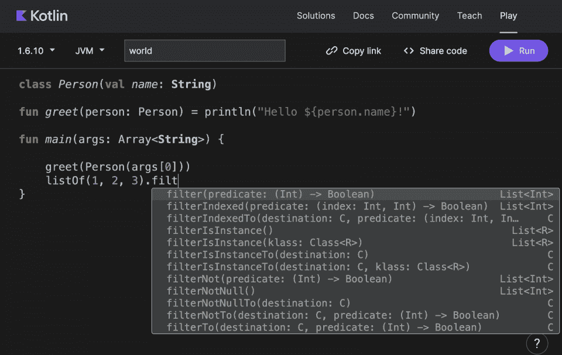
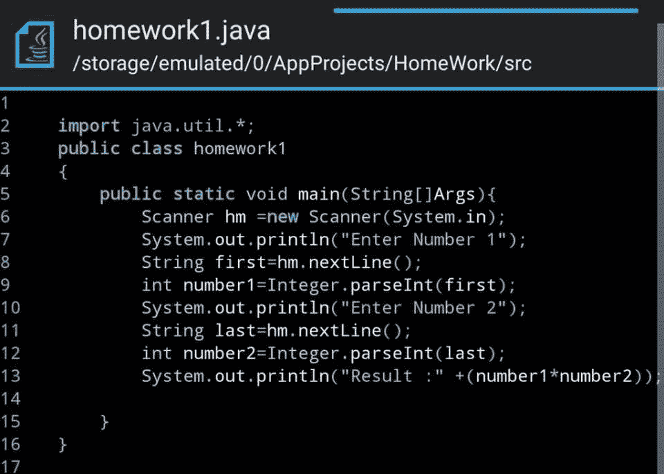
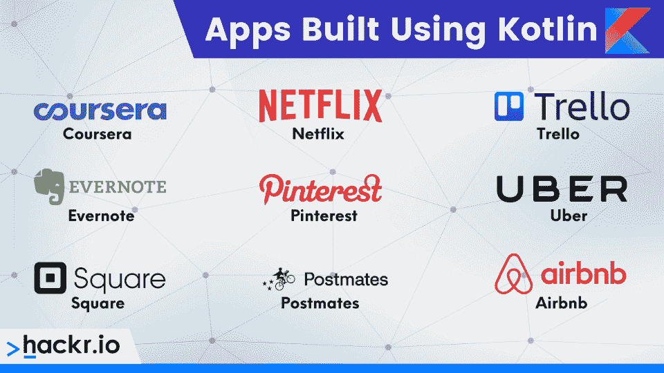
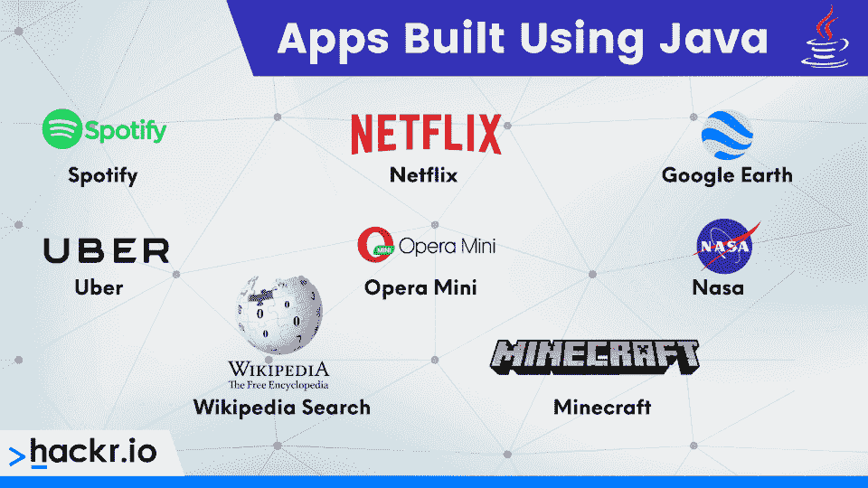

# Kotlin 与 Java:你必须知道的重要区别

> 原文：<https://hackr.io/blog/kotlin-vs-java>

Kotlin 和 Java 都是两种非常流行的编程语言。尤其是在 Android 开发的世界里，你会看到两者完全占据主导地位。如果你想开发 Android 应用，并在这个广阔的领域获得一个职位，那么了解 Kotlin 和 Java 之间的区别是至关重要的。

这就是我们在这里讨论的内容。这个 Kotlin vs Java 的头对头比较，分解了两者的异同。如果你渴望快速总结这些差异，我们在下面贴了一个表格。在那之后，你会发现更详细的差异解释。

## **Kotlin vs Java:势均力敌的比较**

| **功能** | **Java** | **锅炉** |
| 检查异常 | 有空的 | 不能利用的 |
| 代码简洁性 | 不是很简洁 | 比 Java 好 |
| 协同程序 | 不能利用的 | 有空的 |
| 数据类别 | 需要编写大量样板代码 | 要求在类定义中只添加数据关键字 |
| 扩展功能 | 不能利用的 | 有空的 |
| 高阶函数和λ | 高阶函数是使用可调用函数实现的。Java 8.0 中引入了 Lambdas 表达式 | 预建功能 |
| 隐式扩大转换 | 不能利用的 | 有空的 |
| 内嵌函数 | 不能利用的 | 有空的 |
| 对委托的本机支持 | 不能利用的 | 有空的 |
| 非私有字段 | 有空的 | 不能利用的 |
| NullPointerExceptions | 有空的 | 不能利用的 |
| 原始类型 | 原始类型的变量不是对象 | 原始类型的变量是对象 |
| 智能转换 | 不能利用的 | 有空的 |
| 静态成员 | 有空的 | 不能利用的 |
| 对构造函数的支持 | 没有辅助构造函数。虽然，可以有多个构造函数(构造函数重载) | 可以有一个或多个辅助构造函数 |
| 三元运算符 | 有空的 | 不能利用的 |
| 通配符类型 | 有空的 | 不可用，有声明站点差异和类型项目作为替代 |

## **kot Lin 是什么？**

Kotlin 是一种由 JetBrains 开发的跨平台、静态类型的通用语言。

与 Java 类似，Kotlin 已经成为开发 Android 应用程序的首选。这一点从 Android Studio 内置了对 Kotlin 的支持这一事实中可以明显看出，就像它对 Java 一样。

Kotlin 主要用于开发 Android 应用程序，而 Java 有更广泛的用例。最好把它看作是一个用于 Android 开发的功能更加丰富的 Java。它也完全兼容 Java，这使得切换更加容易。

## **Java 是什么？**

Java 是一种高级的、基于类的、面向对象的编程语言，于 1995 年创建。它由 Oracle 管理，在全球超过 30 亿台设备上运行。它在 Android 应用程序、web 和桌面应用程序以及 web 服务器中非常普遍。

这种语言非常受欢迎，有大量的社区支持，以及许多就业机会。Java 经常用于银行、金融服务、大数据和零售商店等领域。

## **Java vs Kotlin**

选择 Kotlin 还是 Java 作为学习的语言取决于某些偏好。然而，在进行转换之前，理解 Kotlin 和 Java 之间的差异是很重要的，我们将在下面详细介绍。

### **检查异常**

Java 和 Kotlin 的一个主要区别是后者没有检查异常的规定。因此，不需要捕捉或声明任何异常。

如果 Java 开发人员发现在代码中使用 try/catch 块令人恼火，那么他们可能会发现 Kotlin 要好得多。然而，如果开发人员认为检查异常鼓励错误恢复和健壮代码的创建，他们会更喜欢 Java。

### **代码简洁度**

将一个 Java 类与一个等价的 Kotlin 类进行比较，展示了 Kotlin 代码的简洁性。对于相同的操作，Kotlin 类比 Java 类需要更少的代码。

例如，Kotlin 可以显著减少样板代码总量的一个特定部分是 findViewByIds。

Kotlin Android 扩展允许将对视图的引用导入到活动文件中。这允许使用该视图，就像它是活动的一部分。

### **协程**

CPU 密集型工作和网络 I/O 是长时间运行的操作。调用线程被阻塞，直到整个操作完成。由于 Android 默认情况下是单线程的，一旦主线程被阻塞，应用程序的 UI 就会完全冻结。

Java 中解决这个问题的传统方法是为长时间运行或密集型工作创建一个后台线程。然而，管理多线程会导致复杂性的增加以及代码中的错误。

Kotlin 还允许创建额外的线程。然而，在 Kotlin 中有一种更好的管理密集型操作的方法，称为协程。协程是无堆栈的，这意味着与线程相比，它们需要更少的内存。

协程能够通过在不阻塞线程的情况下暂停执行，然后在稍后的某个时间恢复执行，来执行长时间运行的密集型任务。它允许创建看似同步的非阻塞异步代码。

### **数据类别**

全尺寸项目有几个类专门用来保存数据。尽管这些类几乎没有任何功能，但开发人员需要用 Java 编写大量样板代码。

通常，开发人员需要定义一个构造函数、几个存储数据的字段、每个字段的 getter 和 setter 函数，以及 equals()、hashCode()和 toString()函数。

Kotlin 有一个非常简单的方法来创建这样的类。开发人员只需要在类定义中包含 data 关键字，仅此而已。编译器会自己处理整个任务。

### **扩展功能**

Kotlin 允许开发人员通过扩展函数用新功能扩展一个类。这些函数在 C#等其他编程语言中可用，但在 Java 中不可用。

在 Kotlin 中创建扩展函数很容易。这是通过在需要扩展的类的名称前面加上前缀来实现的。为了在扩展类的实例上调用函数，需要使用“.”符号。

### **高阶函数和λ**

在 Java 中，高阶函数通过可调用函数成为可能，而 lambdas 是在 Java 8 中引入的。在科特林，它们是预制的。

高阶函数是以函数为参数或返回函数的函数。Lambas 本质上是匿名方法。谈到科特林，有一些事情值得了解。

科特林函数是一流的。这意味着它们可以存储在数据结构和变量中，这些数据结构和变量可以作为参数传递给其他高阶函数，也可以从其他高阶函数返回。

作为一种静态类型的编程语言，Kotlin 利用一系列函数类型来表示函数。此外，它还带有一组专门的语言结构，比如 lambda 表达式。

### **隐式扩大转换**

Kotlin 中不支持数字的隐式扩大转换。因此，较小的类型不能转换成较大的类型。Java 支持隐式转换，而 Kotlin 需要显式转换来实现转换。

### **内嵌函数**

在函数体中被访问的变量被称为闭包。使用高阶函数会带来一些运行时损失。Kotlin 中的每个函数都是一个对象，它捕获一个闭包。

类和函数对象都需要内存分配。这些与虚拟调用一起引入了运行时开销。这种额外的开销可以通过在 Kotlin 中内联 lambda 表达式来避免。一个这样的例子是 lock()函数。

与 Kotlin 不同，Java 不支持内联函数。尽管如此，Java 编译器能够使用 final 方法执行内联。这是因为 final 方法不能被子类覆盖。此外，对 final 方法的调用在编译时被解析。

### **对委托的本地支持**

在[编程术语](https://hackr.io/blog/programming-terms-definitions-for-beginners)中，委托代表接收对象将操作委托给第二个委托对象的过程。

Kotlin 通过一级委托(也称为隐式委托)支持继承设计模式上的组合。

在 Kotlin 中，类委托是继承的替代方法。这使得使用多重继承成为可能。Kotlin 的委托属性还可以防止代码重复。

### **非私有字段**

在任何程序中，封装对于达到理想的可维护性水平都是必不可少的。

通过封装对象的表示，可以强制实施调用者如何与它交互。只要公共 API 保持不变，就有可能在不需要修改调用者的情况下改变表示。

Java 中的非私有字段或公共字段在对象的调用方需要根据其表示进行更改的情况下非常有用。它只是意味着这样的字段向调用者公开了对象的表示。

Kotlin 没有非私有字段。

### **零安全**

对于开发人员来说，关于 Java 最令人恼火的一个问题是 NullPointerExceptions。Java 允许开发人员给任何变量赋一个空值。

然而，如果他们试图使用一个具有空值的对象引用，就会出现 NullPointerException！

与 Java 不同，默认情况下，Kotlin 中的所有类型都是不可空的。如果开发人员试图在 Kotlin 代码中赋值或返回 null，它将在编译时失败。然而，有一种方法可以绕过它。为了给 Kotlin 中的变量赋值 null 值，需要显式地将该变量标记为可空。这是通过在类型后添加问号来实现的，例如:

val number: Int? = null

因此，在 Kotlin 中没有 NullPointerExceptions。如果您在 Kotlin 中遇到这样的异常，那么很可能是因为您显式地指定了一个空值，或者是因为某些外部 Java 代码。

### **原始类型**

有 8 种原始数据类型，包括 char、double、float 和 int。与 Kotlin 不同，原始类型的变量不是 Java 中的对象。这意味着它们不是从类或结构实例化的对象。

### **智能强制转换**

在 Java 中对对象进行造型之前，必须检查类型。在很明显要强制转换对象的场景中也是如此。

与 Java 不同，Kotlin 具有智能强制转换特性，可以自动处理这种冗余的强制转换。如果已经用 Kotlin 中的“is 操作符”检查过了，就不需要在语句中进行强制转换。

### **静态成员**

Kotlin 没有提供静态成员。然而，在 [Java 编程](https://hackr.io/blog/what-is-java)语言中，关键字 static 反映了与关键字一起使用的特定成员属于类型本身，而不是该类型的实例。

它仅仅意味着该静态成员的一个且仅有一个实例被创建并在该类的所有实例间共享。

### **对施工人员的支持**

与 Java 类不同，Kotlin 类除了主构造函数之外，还可以有一个或多个辅助构造函数。这是通过在类声明中包含这些二级构造函数来实现的。

### **三元运算符**

与 Kotlin 不同，Java 有一个三元运算符。Java 三元运算符的工作方式就像一个基本的 if 语句。它由计算结果为 true 或 false 的条件组成。

此外，Java 三元运算符有两个值。根据条件是真还是假，只返回其中一个。Java 三元运算符的语法是:

(条件)？(值 1):(值 2)

### **通配符类型**

在泛型代码中，'？'表示未知类型。它被称为通配符。通配符有几种用法，包括作为字段、局部变量或参数的类型。

虽然 Java 的类型系统提供了通配符类型，但 Kotlin 没有。但是，它有两个不同的东西；声明-作为通配符类型替代的站点差异和类型投影。

## **使用 Kotlin 的注释处理库**

除了提供对现有 Java 框架和库的支持，Kotlin 还提供了依赖注释处理的高级 Java 框架。

然而，使用一个在 Kotlin 中使用注释处理的 Java 库，需要以与不使用注释处理的 Java 库稍微不同的方式将注释处理添加到 Kotlin 项目中。

需要使用 kotlin-kapt 插件指定依赖关系。之后，需要使用 Kotlin 注释处理工具来代替注释处理器。

## **使用 Kotlin 和 Java 构建的应用**

您可能还想知道使用 Kotlin 和 Java 构建了哪些应用程序。如果你自己使用过这些应用程序，这会让你更好地理解语言是如何影响体验的。

使用 Kotlin 构建的一些流行应用程序有 Coursera、Trello、Evernote、Pinterest、优步、Square、Postmates、Airbnb 和网飞。

使用 Java 构建的应用程序包括 Spotify、谷歌地球、优步、Opera Mini、NASA、维基百科搜索和《我的世界》。网飞使用 Kotlin 作为其移动应用，但也使用 Java 作为其后端。

## **底线**

那么在选择 Java 或 Kotlin 的时候，你怎么知道该选哪一个呢？

显然，有些特性在 Kotlin 中更好，而有些特性在 Java 中更容易使用。对于那些不愿意放弃 Android 开发的两种主流编程语言中的任何一种的人来说，谢天谢地，还有另外一种方法。

不管 Java 和 Kotlin 有什么不同，它们都是完全可以互操作的。Java 和 Kotlin 都编译成字节码。这意味着可以从 Kotlin 调用 Java 代码，反之亦然。

这种灵活性有两个优点。首先，它通过在 Java 项目中逐步引入 Kotlin 代码，方便了 Kotlin 的入门。第二，两种语言可以在任何 Android 应用程序开发项目中同时使用。

对于通用编程， [Java 占上风](https://hackr.io/blog/features-of-java)。另一方面，越来越多的开发者和组织开始采用 Kotlin 来快速开发 Android 应用。

[完整的 Android 12 &科特林开发大师班](https://click.linksynergy.com/link?id=jU79Zysihs4&offerid=1045023.2642574&type=2&murl=https%3A%2F%2Fwww.udemy.com%2Fcourse%2Fandroid-kotlin-developer%2F)

## **常见问题解答**

#### **1。Kotlin 比 Java 好吗？**

在 Android 开发方面，Kotlin 更胜一筹。然而，在通用编程方面，Java 做得更好。他们都有各自的优点和缺点。

#### **2。Kotlin 比 Java 简单吗？**

就难度而言，两者相当相似。不过 Kotlin 更简洁，所以从这个角度来看，编写代码更快可能会更容易。

#### **3。Kotlin 正在取代 Java 吗？**

不，Kotlin 不会取代 Java。虽然它越来越成为 Android 开发的热门选择，但 Java 更强的安全标准和其他特性使其成为开发中的中流砥柱。他们都有他们的用途。

#### **4。不用 Java 可以学 Kotlin 吗？**

是的，不用 Java 也可以[学习 kot Lin](https://hackr.io/tutorials/learn-kotlin)——事实上，你根本不需要 Java 知识。Kotlin 本质上是 Java 的改进版本，尽管后者允许您从事通用编程，而 Kotlin 仅限于 Android 开发。

#### **5。我应该先学 Java 再学 Kotlin 吗？**

如果你的重点是 Android 开发，那么你最好先学习 Kotlin。然而，了解一些 Java 的基础知识会有所帮助，所以不要回避学习一点 Java。如果你心中有更多的通用编程，那么先考虑学习 Java。

**人也在读:**