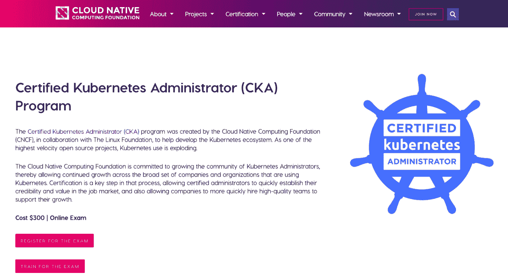
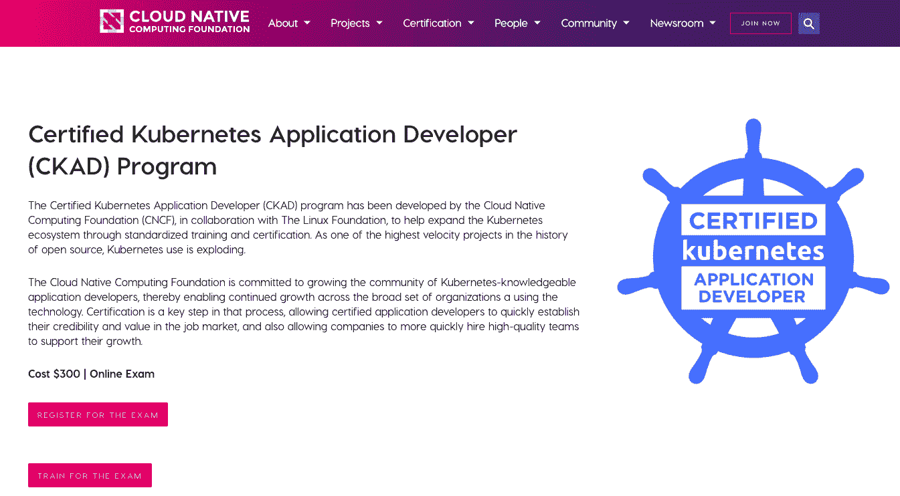
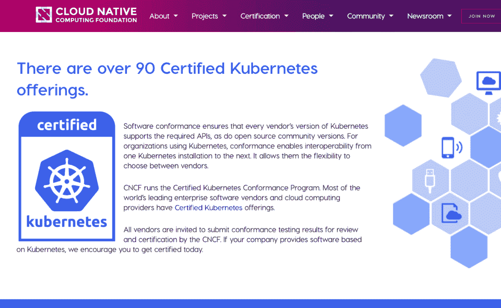
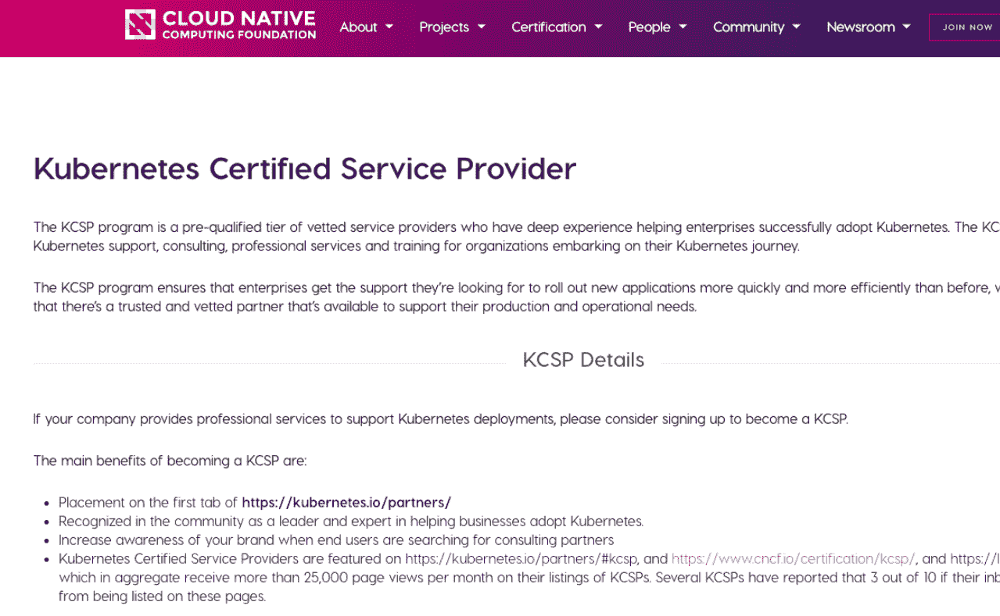

# 4 2023 年最佳 Kubernetes 认证计划[更新]

> 原文：<https://hackr.io/blog/kubernetes-certifications>

在传统系统中，在一个计算系统中开发的应用程序通常不能在其他计算系统上有效运行。此外，由于组织在同一台物理服务器上运行多个应用程序，连续资源分配问题的发生是不可避免的。

有些情况下，一个应用程序会消耗过多的资源，导致其他应用程序无法高效运行。[虚拟化](https://en.wikipedia.org/wiki/Virtualization)是针对这一问题推出的解决方案，支持在一台服务器的 CPU 上运行多个虚拟机。

集装箱化目前是市场的一个重要趋势，其采用率正在上升。在更高的层面上，一个新的软件生态系统正在形成，以支持容器化。Kubernetes 现在随着容器、云开发和并发技术的发展而发展，对于那些对该技术感兴趣并拥有使用该技术的必要技能的专业人士来说，它的就业前景也是如此。

让我们看看什么是 Kubernetes。

## **什么是 Kubernetes？**

由 Google 开发和设计的 Kube 或 Kubernetes 是一个开源容器编排平台，负责自动化许多涉及部署、管理和扩展容器化应用程序的手动流程。在优化云应用程序开发时使用 Kubernetes 是有利的，因为它提供了在物理或虚拟机(VM)集群上调度和运行容器的平台。

Kubernetes 允许我们:

*   协调覆盖多个主机的容器。
*   高效利用硬件，最大限度地利用运行应用所需的资源。
*   自动化并控制应用程序的部署和更新。
*   添加存储以运行应用程序。
*   规模化集装箱化应用
*   以声明方式管理服务，这保证了部署的应用程序总是以您希望的方式运行。
*   通过自动放置、自动重启、自动复制和自动扩展，对您的应用进行健康检查和自我修复。

## 什么是 Kubernetes 认证？

云原生计算基金会旨在通过允许使用 Kubernetes 的公司和组织的持续增长来发展 Kubernetes 管理员社区。认证是这一过程中的首要步骤，允许管理者在就业市场中建立他们的信誉和价值。这也有利于公司雇佣高质量的团队来支持他们的快速发展。

Kubernetes 认证管理员(CKA)项目的目的是确保 cka 具备履行 Kubernetes 管理员职责的技能、知识和能力。这是一个在线、监考、基于性能的测试，需要从命令行解决多个问题。

## **Kubernetes 的职业机会**

目前，职称并不能反映 Kubernetes 的招聘情况。所以，当你为 Kubernetes 寻找工作角色时，关注工作描述而不是职位名称。Kubernetes 的认证将使你成为以下职业机会的领跑者，或者你可能希望将你的职业转换为以下角色之一:

*   DevOps 工程师
*   云工程师
*   系统工程师
*   现场可靠性工程师
*   [高级] Java 架构师
*   [高级] Python 开发人员
*   软件升级工程师

已经着迷了？接下来是时候讨论目前可用的各种 apt Kubernetes 认证计划了:

## **最佳库布证书**

Kubernetes 是一项相对较新的技术，虽然有几个在线学习平台提供使用容器编排系统的认证，但享有盛誉的认证却很少。

目前，只有 [CNCF(云本地计算基金会](https://www.cncf.io/)——负责开发和维护 Kubernetes 的授权机构——提供 Kubernetes 认证项目。CNCF 总共提供 4 种 Kubernetes 认证，2 种针对有志之士和专业人士，2 种针对利用 Kubernetes 的组织。

### **Kubernetes 学生/专业人员认证**

[****](https://geni.us/HLBfCF)

期限–灵活
级别–初级
有效期–3 年

云原生计算基金会(CNCF)和 Linux 基金会合作开发的旨在扩展 Kubernetes 生态系统的认证 Kubernetes 管理员(CKA)认证允许开发人员在就业市场上建立信誉，并使公司能够雇用他们完成基于 Kubernetes 的任务。

CKA 认证允许候选人获得履行 Kubernetes 管理员职责的技能、能力和知识，然后获得相同的认证。

认证 Kubernetes 管理员认证考试在线进行，考生需要通过命令行解决多个任务。认证 Kubernetes 管理员(CKA)计划涵盖的领域有:

1.  应用生命周期管理
2.  安装、配置和管理
3.  核心概念
4.  网络、日程安排和安全性
5.  记录和监控
6.  集群维护
7.  存储和故障排除

经过认证的 Kubernetes 管理员认证的有效期为 3 年，之后，候选人需要在之前持有的 CKA 认证到期之前重新参加并通过认证考试。

为了帮助考生准备考试，Linux 基金会提供了 Kubernetes (LFS158)入门课程。这是一个免费的 Kubernetes 初学者的基础课程。

[Kubernetes Fundamentals(lfs 258)课程](https://training.linuxfoundation.org/training/kubernetes-fundamentals/)是 Kubernetes above foundation 课程的后续课程，旨在为 CKA 学员提供全面的学习。其内容与 CKA 认证考试测试的知识领域直接相关。

考试详情:

姓名-认证 Kubernetes 管理员考试
代码-不适用
持续时间-3 小时
语言-英语、德语、日语、葡萄牙语、简体中文和西班牙语
通过率-74%
先决条件-无
价格-300 美元
问题类型-使用命令行的基于绩效的任务
问题总数-不适用

你可以在这里注册。

[****](https://geni.us/vmzAj)

期限–灵活
级别–中级/专家
有效期–3 年

CKAD 认证面向 Kubernetes 应用程序开发人员的成长。它证明了开发人员为 Kubernetes 构建、配置、设计和展示原生云应用的能力。这样的开发人员能够进一步使用核心资源在 Kubernetes 中构建、监控和排除应用程序故障。

CKAD 认证的理想候选人必须能够:

*   用一种或多种编程语言实现代码，比如 Go、Java、Node.js 和/或 Python
*   利用关于云原生应用和架构的概念
*   使用符合 OCI 标准的容器运行时

容器运行时和微服务架构的先验知识虽然不是必需的，但将有助于获得 CKAD 认证。

认证 Kubernetes 应用程序开发人员认证评估候选人在以下知识领域的能力:

1.  核心概念
2.  配置
3.  多容器容器
4.  可观察性
5.  吊舱设计
6.  状态持久性
7.  服务和网络

由 Linux 基金会提供的[Kubernetes for Developers(lfd 259)课程](https://training.linuxfoundation.org/training/kubernetes-for-developers/)详细解释了在多节点集群上封装、托管、部署和配置应用程序的过程。课程内容严格按照 CKAD 认证考试所测试的知识领域编写。

考试详情:

名称–Kubernetes 认证应用程序开发人员考试
代码–不适用
持续时间–2 小时 语言–英语、德语、日语、葡萄牙语、简体中文和西班牙语
通过率–66%
先决条件–无
价格–300 美元(可免费重考一次) 题型–使用命令行的基于绩效的任务
总题数–不适用

你也可以在这里注册[。](https://geni.us/vmzAj)

**Kubernetes 组织/供应商认证**

[****](https://geni.us/3pmd57)

要求—[参见此处](https://github.com/cncf/k8s-conformance/blob/master/terms-conditions/Certified_Kubernetes_Terms.md)

许多领先的云计算提供商和企业软件供应商已经认证了 Kubernetes 产品。任何提供基于 Kubernetes 的软件的组织都需要获得软件一致性(Certified Kubernetes)认证。

有兴趣获得 Kubernetes 认证的组织和供应商需要提交一致性测试结果。然后，CNCF 对这些进行审查，以检查申请人是否有资格获得认证。

一致性为使用 Kubernetes 的组织提供了从一个 Kubernetes 版本到下一个版本的互操作性。通过获得软件一致性认证，组织可以确保每个供应商的 Kubernetes 版本都支持所需的 API。组织也可以灵活地选择供应商。

软件一致性(认证 Kubernetes)计划的好处:

*   与 Kubernetes 的任何安装交互时的一致性
*   每年或更频繁地及时更新
*   确保分销或平台保持一致性的可确认性

认证流程包括 4 个简单的步骤:

*   步骤 1 -为认证准备您的产品
*   步骤 2 -使用 Sonobuoy 运行认证测试
*   步骤 3 -准备一份 PR，并将结果提交给 GitHub 上的一致性报告。完成[条款&条件表](https://github.com/cncf/k8s-conformance/blob/master/participation-form/Certified_Kubernetes_Form.md)
*   第 4 步-等待产品认证的审查和结果

你可以在这里注册。

[****](https://geni.us/5oyqB)

要求:

1.  CNCF 的成员
2.  一种支持企业最终用户的业务模式，包括将工程师安排在客户现场
3.  3 名或更多 CKA 工程师

KCSP 或 Kubernetes 认证服务提供商计划旨在帮助企业获得必要的支持，从而高效、快速地推出新应用。Kubernetes 认证服务提供商提供:

*   咨询
*   专业性劳务
*   支持
*   培养

任何提供支持 Kubernetes 部署的专业服务的组织都必须选择 KCSP 计划。它有几个好处，包括:

*   提高品牌认知度
*   社区认可为帮助企业采用 Kubernetes 的领导者和专家
*   在以下网站上获得特写:

*   https://kubernetes.io/partners/
*   https://kubernetes.io/partners/#kcsp
*   https://www.cncf.io/certification/kcsp/
*   https://landscape.cncf.io

KCSP 认证流程只包括三个简单的步骤:

*   步骤 1 -填写 [KCSP 表格](https://docs.google.com/forms/d/e/1FAIpQLScih8ZxHpqxPDfZgizhGx5ilRlQKV6X9NBFgAkEd3d-6djKuQ/viewform)
*   第 2 步-提交至少 3 名员工的 Kubernetes 管理(CKA)认证证书。您可以通过 KCSP 表格或发送邮件至 kcsp@cncf.io 进行填写
*   第 3 步-等待审核过程和结果

你可以在这里注册。

## **虚拟机 vs 容器**

虚拟机可以更好地利用资源，降低硬件成本，并增强安全性。技术上来说，

虚拟机是硬件层的抽象，这意味着每个虚拟机都有其操作系统、CPU、文件系统、处理能力和内存的副本

简单来说，

“每个虚拟机都可以被视为一个运行着所有必需的硬件和软件组件的计算机系统。”

容器类似于虚拟机。但是，容器是应用层的抽象，这意味着它们在共享标准操作系统的同时模拟软件应用程序。它们可以跨云和操作系统移植，因为它们与底层基础设施相分离。

事实证明，容器化环境是运行应用程序的更好选择，因为它们需要更少的空间和内存。典型的虚拟机有几千兆字节大小，需要几分钟时间启动。相反，容器只有几兆字节大小，几秒钟就能启动。

## **Kubernetes 的需求**

在生产环境中，有效地管理容器是一项基本要求。Kubernetes 是一个开源平台——确切地说，是一个用于自动化应用程序部署、伸缩和管理的容器编排系统——有助于管理所有的容器。Kubernetes 提供了一个框架，使得分布式系统可以弹性运行。

Kubernetes 的主要亮点

*   容器部署
*   负载平衡、服务发现和自动扩展
*   持久存储

[完整的 Android 12 &科特林开发大师班](https://click.linksynergy.com/link?id=jU79Zysihs4&offerid=1045023.2642574&type=2&murl=https%3A%2F%2Fwww.udemy.com%2Fcourse%2Fandroid-kotlin-developer%2F)

## **结论**

Kubernetes 正在成为首选平台，一个理想的云操作系统。虽然这应该是清楚的，不是在经典意义上，而是从分布式、云原生应用的角度。

由于 Kubernetes 的采用率和受欢迎程度的上升，所有主要的云提供商现在都在提供他们自己的本地 Kubernetes 服务和基于 Kubernetes 的服务。随着新版本的频繁发布和越来越多的供应商采用开源容器编排系统，很明显 Kubernetes 正在走向成功。

因此，在这一点上，Kubernetes 出现新的令人兴奋的工作角色和职业前景是很自然的。因此，为了一个有回报的未来和职业生涯，学习 Kubernetes 当然是一个很有吸引力的选择。

Kubernetes 还是 Docker？哪个更好？选哪个？有什么区别？通过这个详细的 [Kubernetes vs. Docker 对比](https://hackr.io/blog/kubernetes-vs-docker)获得所有答案。

**人也在读:**