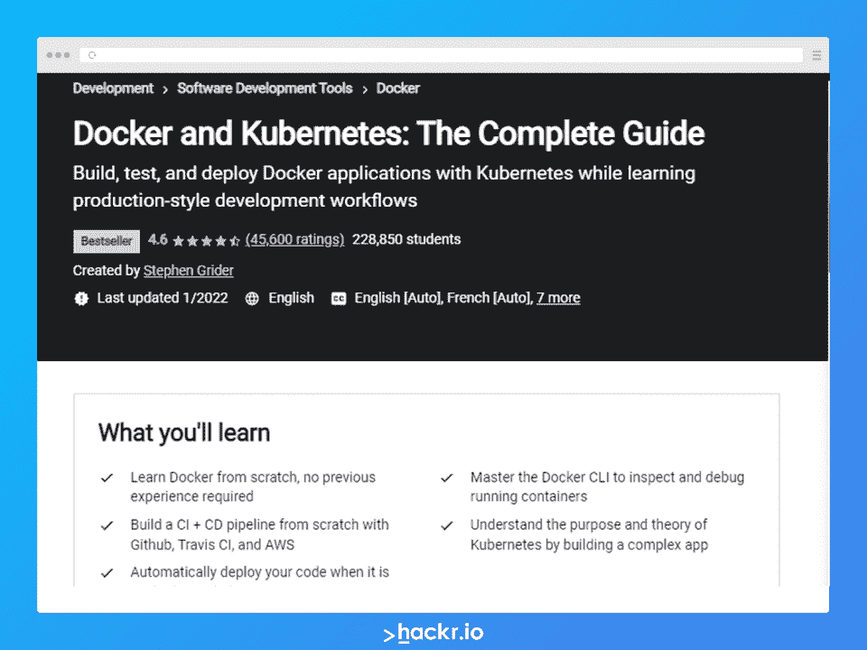
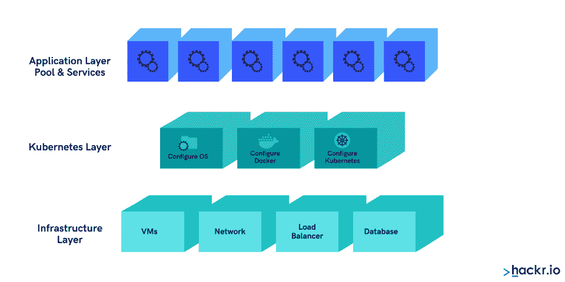
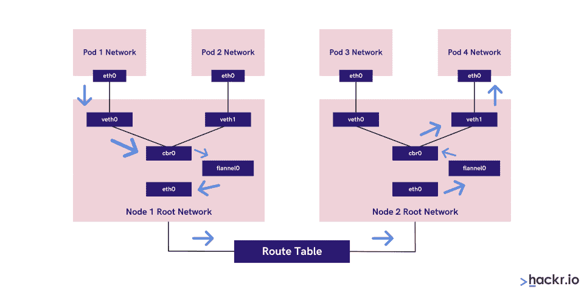

# 2023 年 Kubernetes 顶级面试问答[更新]

> 原文：<https://hackr.io/blog/kubernetes-interview-questions>

随着容器的引入，开发和运营团队的工作发生了巨大的变化。通过部署基于容器的应用程序，容器已经帮助各种公司更容易地扩展。

除了这些优势之外，it 也面临着挑战，因为它为运行应用程序创建了一个全新的基础架构。目前，大多数公司每天都要创建容器实例，这就导致了如何有效管理成千上万个容器的问题。这就是 Kubernetes 出现的原因。

Kubernetes 是 Google 推出的一款开源容器编排工具。它提供了一个平台，允许用户自动化开发、扩展和管理容器化应用程序的过程。Kubernetes 提供了编排容器的标准实践，得到了 Google、AWS、IBM、微软、思科和 RedHat 等公司的支持。

这篇文章深入探讨了 Kubernetes 的概念。它涵盖了与 Kubernetes 相关的最重要和最常见的问题，可以帮助您准备面试。

那么，让我们开始吧。

## **Kubernetes 面试问答**

### **1。什么是 Kubernetes？**

Kubernetes 是一个开源的容器编排工具，帮助管理集群内和集群间的容器化应用。任何 Kubernetes 集合都由主节点和工作节点组成。

主节点负责协调集群内的所有主要工作，如调度、维护、扩展和应用程序部署。相反，工作者节点是作为工作者机器的操作系统的实例。

节点有两个组件，分别是 Kubelet 和 tool。kubelet 是一个代理，帮助管理主节点并与主节点通信，工具用于运行各种基于容器的操作。

将一个或多个容器打包在一起的 pod 被认为是 Kubernetes 上部署的对象的最小单元。它们总是在共享资源的节点上运行，这些资源包括卷、集群唯一 IP 和其他关于运行每个容器的重要信息。

您可以在单个节点上安排 pod 的容器。要访问 pod 上的工作负载，您可以使用服务。为了在 Kubernetes 中操作对象的状态，可以使用一个叫做控制面板的 API 服务器。

### **2。Kubernetes 管理什么类型的活动？**

Kubernetes 帮助管理以下活动:

*   Consumption of resources by an application or team
*   Spreading the load of an application across a hosting infrastructure evenly
*   Automatically balancing the load of incoming requests across different instances of an application
*   Limiting resource consumption, which automatically stops applications from consuming too many resources and restarting the applications
*   Helping users move an application instance from one host to another in case of a resource shortage within a host, or if the host dies
*   Making the resources available automatically to a newly added host in a cluster
*   无缝执行 canary 部署和回滚流程

### **3。是什么让 Kubernetes 如此受欢迎？**

以下是 Kubernetes 越来越受欢迎的几个原因:

*   Kubernetes allows dev teams to request resources that are required quickly. If a team needs more resources to manage the growing load, they can get the desired resources as fast as possible since resources are available from an infrastructure shared across your teams. Kubernetes helps in provisioning the resources within seconds and lets you scale quickly.
*   Containers are lightweight and consume fewer resources, such as CPU and memory than hypervisors and VMs, making Kubernetes a cost-effective solution
*   Kubernetes is cloud-agnostic and can run significant cloud platforms such as AWS, Microsoft Azure, and GCP. It makes the migration simpler since you do not have to redesign your applications to be compatible with a new platform. Also, it solves the problem of vendor lock-in issues, as you can standardize on a platform. 
*   Kubernetes 是容器编排工具的唯一标准。因此，主要的云提供商现在提供 Kubernetes 即服务，使其在开发人员和运营团队中更受欢迎。

### **4。Kubernetes 和 Docker Swarm 有什么不同？**

下表展示了 Kubernetes 和 Docker Swarm 之间的区别:

**特性**

| **Kubernetes** | **码头工人群** | 安装&集群配置 |
| 它有一个复杂的设置过程，但集群是健壮的。 | 它有一个简单的设置过程，但集群功能并不强大。 | GUI |
| 不间断的控制板。 | 没有特定的图形用户界面。 | 可扩展性 |
| 它确保了高可扩展性，但不会像 Docker 那样蜂拥而至。 | 表现出高可扩展性，比 Kubernetes 快 5 倍。 | 自动缩放 |
| 确保自动缩放。 | 不要确保自动缩放。 | 负载均衡 |
| 需要人工干预来平衡不同集装箱和箱之间的流量。 | 它自动管理集群中容器之间的负载平衡。 | 滚动更新&回滚 |
| Kubernetes 确保滚动更新的部署，并确保自动回滚。 | Docker Swarm 确保滚动更新的部署，但不支持自动回滚。 | 数据量 |
| 它确保仅与同一 pod 中的其他可用容器共享存储容量。 | 它允许与任何其他容器共享存储卷。 | 测井&监控 |
| Kubernetes 内置了日志记录和监控工具。 | 它支持第三方工具，如 ELK stack，用于日志记录和监控。 |  |

**5。Kubernetes 的主要特点是什么？**

### 以下是 Kubernetes 的主要特点:

集装箱跨集群和集群内的自动调度

*   自我修复能力，并确保自动部署&回滚
*   管理水平扩展&负载平衡
*   一致的开发、测试和生产环境
*   与作为独立单元的每个组件松散耦合的基础设施
*   资源利用效率、以应用为中心的管理和可自动扩展的基础设施

Docker CLI 附带了一种机制，有助于有效地管理容器的生命周期，Docker 映像指定了运行时容器的构建时间框架。您可以使用 CLI 命令对容器执行各种操作。此外，这些命令允许您编排容器，并使它们在几个主机上运行。

但是你如何管理和调度这些容器，以及容器中的应用程序如何相互通信呢？

这就是 Kubernetes 使用 Docker 打包、实例化和运行容器化应用程序的地方。在各种容器运行时中，只有 Docker 与 Kubernetes 一起广泛使用，并且两者智能地一起管理容器化的应用程序。

Docker 有用于编排的集群工具，但 Kubernetes 可作为 dockered 容器的编排平台，负责扩展到生产级别。

**7。Kubernetes 的架构层有哪些？**

### Kubernetes 建筑有三个主要层。上层抽象了下层的复杂性。下图说明了不同的图层:

**基础层(基础设施层):**

*   在这一层，Kubernetes 构建了一个主机存储资源和网络集群，帮助运行系统的各种工作负载。这些集群将几台机器组成一个单元。

**中间层(Kubernetes 层):**

*   集群中的每台机器都被分配了特定的角色。主设备是负责执行活动的控制平面，如授权、身份验证和在集群级别调度 pod。主服务器的主要组件是 API 服务器、调度程序和控制器管理器。

Kubernetes 本身是一个基于 API 方法运行的复杂分布式系统。每当您希望运行一个应用程序时，都需要提交一个 YAML 或 JSON 格式的计划。主服务器检查提交的计划，并检查集群的需求和当前状态。

之后，用户使用 API 生态系统与集群进行交互。调度器和控制器管理器管理集群的运行，而工作人员则负责产生输出。

**8。Kubernetes 中的 etcd 主组件是什么？**

### Etcd 是 Kubernetes 主服务器的重要组成部分。此外，它是 Kubernetes 集群的核心，将对象存储在分布式键值存储中。它使用一种算法和复制技术来帮助维护存储在 etcd 服务器上的数据。跨 etcd 服务器比较和交换数据使用了乐观货币，避免了锁定情况，从而提高了服务器的吞吐量。

**9。什么是库伯莱？**

### kubelet 是 Kubernetes 节点上的主要流程之一，帮助在容器上执行操作。它是一个守护进程，负责与集群中每台可用机器的 Kubernetes 主服务器进行通信。它不断访问控制器，并检查和报告集群的状态。

此外，它可以将所有可用资源(如 CPU、磁盘和内存)合并到一个大型 Kubernetes 集群中，并将关于容器状态的响应发送回 API-server，以观察其当前状态。

10。什么是 kube-proxy？

### Kube-proxy 是 Kubernetes 节点服务器的另一个主要组件。该组件负责在 Kubernetes 中的每个节点上实现负载平衡器网络模型。它有助于执行 TCP 和 UDP 转发。

该组件对节点上的网络进行编程，以请求路由到实现该服务的端点的服务的虚拟 IP 地址。Kube-proxy 还使用 DNS 或环境变量来查找集群的 IP 地址。最后，它负责将流量从机器上的特定 pod 路由到集群中任何其他位置的 pod。

**11。Kubernetes 物件的各种类型有哪些？**

### 以下是 Kubernetes 用于定义工作负载的一些对象:

豆荚: 它们是 Kubernetes 的基本单位，将一个或多个容器包装在其中。容器不直接与主机交互。相反，它们通过称为 pod 的封装对象进行交互。

*   **复制控制器和集合:** 这些也被称为从 pod 模板创建的 pod 的复制。您可以使用称为复制控制器和复制集的控制器来水平扩展它们。
*   **部署:** It 指多个相同的吊舱没有明显的标识。部署控制器用于管理部署。它能够运行应用程序的多个副本，并自动替换出现故障的应用程序实例。
*   **有状态集** :它是为每个 pod 提供唯一身份的控制器，可以管理部署和扩展 pod 集。您可以将此控制器用于有状态应用程序和分布式系统。
*   **守护进程设置** :确保每个集群节点运行一个 pod 的副本。每当您向 Kubernetes 集群添加一个节点时，它都会根据需要自动将 pod 添加到新节点中。因此，it 部门负责管理大量复制的 pod。
*   **作业& Cron 作业:** 负责创建一个或多个 pod 并成功终止它们的作业。该作业将自动跟踪成功的完成。

**12。什么是豆荚？**

### Pod 是指可作为单个应用程序进行控制的单个或多个容器。

包装在单个 pod 内的集装箱具有共同的生命周期，但需要在同一节点上进行调度

*   pod 是一个具有通用卷和 IP 地址空间环境的单元
*   每个 pod 都有一个主容器，管理其他容器之间的工作负载

13。提及各种 Kubernetes 服务及其作用。

### Kubernetes 有[两大节点](https://kubernetes.io/docs/concepts/architecture/nodes/)，即执行者和主人。以下是在这两个节点上运行的服务:

**执行节点:(在主节点上运行)**

**Kube-proxy:** 该服务负责集群内的 pod 与外部网络的通信，并在每个节点上运行。该服务确保当 pod 建立网络通信时，网络协议得到维护。

*   **kubelet:** 每个节点都有一个 kubelet 服务，根据配置(YAML 或 JSON)文件定期更新运行的节点

**主服务:**

**Kube-apiserver:** 一个主 API 服务，充当 K8 集群的入口点

*   **Kube-scheduler:** 该服务负责根据执行器节点上的可用资源来调度 pods】
*   **Kube-controller-manager:**一个控制循环，它通过 API 服务器跟踪集群的共享状态，并做出所需的更改，将当前状态移向所需的稳定状态。

**14。什么是负载均衡器？**

### 负载平衡有助于将传入流量分配给多个服务器，确保每个用户都能使用该应用。所有传入流量将到达负载平衡器上对外界可见的单个 IP 地址。

稍后，流量将使用循环算法分配给特定的 pod。每当一个 pod 出现故障时，负载平衡器都会收到通知，它会避免将流量路由到该 pod，并检查其他可用的 pod。

15。如何提高 Kubernetes 的安全性？

### 由于一个 pod 可以与另一个 pod 通信，我们可以设置一些安全策略来限制这种通信。我们可以通过使用以下方法来做到这一点:

实施 RBAC(基于角色的访问控制)以缩小权限范围

*   使用名称空间建立安全边界
*   设置准入控制策略以避免特权容器的执行
*   打开审计日志以便更好地排除故障

16。如何监控 Kubernetes 集群？

### 您可以使用各种工具来监控 Kubernetes 中运行的容器的操作和状态。最常用的工具之一是 Prometheus，它有多个组件，如下所述。

普罗米修斯的服务器抓取并存储时序数据

*   它带有客户端库，可以帮助检测应用程序代码
*   它有一个推送网关来帮助支持短期工作
*   各种集装箱服务都有专门的出口商，如 StatsD、HAProxy、Graphite 等。
*   您还将获得一个警报管理器，用于处理各种支持工具上的警报

**17。你如何从 pod 中检查中央日志？**

### 您可以使用任何一种日志记录模式从 pod 获取中央日志。

使用节点级日志代理

*   传送边车集装箱
*   使用带有测井代理的边车容器
*   直接从应用程序中导出日志

18。如何对没有安排的 pod 进行故障诊断？

### 在 Kubernetes 中，调度程序负责将 pod 调度到节点中。导致不可启动吊舱失效的原因有很多。一个最常见的原因是，如果 pod 调度所需的资源不足，让他们执行特定的任务。

您可以使用类似 kubectl describe<POD>-n<Namespace>这样的命令来检查 POD 不启动的具体原因。此外，继续检查 kubectl 以获取所有正在运行的事件，从而查看来自特定集群的所有事件。

**19。如何在节点上运行 pod？**

### 以下是在 Kubernetes 集群中的特定节点上运行 pod 的各种方法:

**节点名:** 您可以在 POD 规格配置文件中提到节点的名称。它在指定的节点上运行 POD。

*   **nodeSelector:** 为此，您需要为拥有所有所需资源的节点分配一个特定的标签，并在 POD 规范文件中使用相同的节点标签，以便 POD 仅在该指定节点上运行。
*   **nodeAffinities:** 为此，您需要 during schedulingignoredduringeexecution，preferred during schedulingignoredduringeexecution，这是在特定节点上运行 POD 的硬性和软性要求。

20。如何为 Kubernetes 提供外部网络连接？

### 默认情况下，一个 POD 应该到达外部网络本身，但我们需要在相反的情况下进行一些所需的更改。您可以使用以下任何选项从外部网络连接到 POD。

Nodeport(使用这种方法，打开的端口将暴露在每个节点上，以便与之通信)

*   负载平衡器(TCP/IP 协议的 L4 层)
*   入口(TCP/IP 协议的 L7 层)

您可以尝试使用 Kube-proxy 在本地系统端口上公开一个只有集群 IP 的服务:

*$ ku bectl proxy-port = 8080 $ http://localhost:8080/API/v1/proxy/namespaces//services///*

**21。什么是入口默认后端？**

### 如果没有到任何后端的映射，Ingress 默认后端指定您需要对传入的流量或对 Kubernetes 集群的请求做什么。或者，它意味着如果没有定义后端服务，没有为传入的 HTTP 请求定义规则，您必须做什么。确保指定它，以便用户将看到一些有意义的消息，而不是得到一个不清楚的错误。

**22。Kubernetes 中的名称空间是什么？**

### 名称空间对于在多个用户之间划分集群资源非常有用。

**23。什么是守护进程集？**

### 这些是只在主机上运行一次的 pod 组。它们专门用于主机层属性，例如网络，或者用于监控不需要在主机上运行一次以上的网络。

**24。什么是云控制器管理器？**

### 云控制器管理器寻找持久存储、网络路由，并从特定于 Kubernetes 的代码中提取特定于云的代码。它还负责管理与底层云服务的交互。根据您使用的云平台，它可以在容器之间进行划分，并允许云供应商部署 Kubernetes 代码。之后，云供应商将创建他们的代码，并在您运行它时与 Kubernetes 的云控制器管理器进行交互。

云控制器管理器的不同类型有:

**节点控制器:** 检查停止后被成功删除的节点

*   **路由控制器:** 帮助管理底层云基础设施中的流量路由
*   **卷控制器:** 帮助管理存储卷，并为此与云提供商通信
*   **服务控制器:** 帮助管理云提供商负载平衡器

**25。什么是容器资源监控？**

### 从用户的角度来看，理解应用程序如何在不同的抽象层次上执行和利用资源是至关重要的。Kubernetes 通过创建不同的抽象层(如容器单元)来区分集群。现在，更容易单独监控每个级别，称为容器资源监控。

您可以使用以下任何工具来监控容器资源:

**堆:** 帮助从集群内的容器收集数据

*   **influxDB:** 您可以将该工具与 heapster 一起使用，在 Kubernetes 环境中可视化数据。
*   **Grafana:** 一个时间序列数据库，存储所有由堆舱收集的数据

**26。Kubernetes 中的主节点是什么？**

### Kubernetes master 包含主组件——如 controller manager 服务器、API 服务器和 etcd——并控制集群中的所有工作节点和容器。

这些容器是 pod 中的包，这取决于它们的通用配置和其他相关文件。无论何时部署 pod，都可以通过 GUI 或命令行命令来完成。我们根据节点上的可用资源，在节点上调度 pod。然后，kube-apiserver 确保在 Kubernetes 节点和主组件之间建立连接。

**27。什么是无头服务？**

### 这些服务几乎与普通服务相似，但没有集群 IP。headless 服务允许您直接访问 pod，而不需要通过代理访问它们。

**28。Kubernetes 中的节点是什么？**

### Kubernetes 集群中的一个节点是主工作机，也称为 minions。节点可以在物理机器或 VM 上运行，它们由运行容器或 pod 所需的所有服务组成。Kubernetes 中的主节点负责管理 Kubernetes 上的节点。

**29。什么是头盔？**

### Helm 是 Kubernetes 的一个应用包管理注册中心，由 CNF 维护。您可以在您的 Kubernetes 环境中下载和部署预先配置的 Helm charts。

它是 Kubernetes 环境中首选的包管理工具之一。这些图表有助于 DevOps 团队加快管理应用程序的过程。DevOps 团队可以使用现有的图表来制作图表、进行版本控制，以及将应用程序部署到生产和开发环境中。

三十岁。Kubernetes 中的标签是什么？

### 标签被指定为分配给 Kubernetes 中的 pod 和其他可用对象的键值对。它帮助 Kubernetes 的操作员组织和选择对象的子集。

考虑这个例子:每当你监视 Kubernetes 的对象时，标签可以帮助你方便快捷地访问你正在寻找的所需信息。

31。Kubernetes 中的 kube-apiserver 是什么？

### kube-apiserver 通过向控制平面提供主要接入点，允许主节点与集群的其余部分进行交互。

例如，kube-apiserver 有助于确保 etcd 中的配置与集群中部署的容器的配置相匹配。

**32。什么是 etcd 在库比涅斯？**

### Etcd 是一个持久的、分布式的、基于键值的数据存储，它负责存储主设备对整个集群的所有配置数据。每个节点都可以访问这个 etcd 数据存储，它帮助节点学习维护正在运行的容器的配置。如果您想运行 etcd，请在 Kubernetes master 或独立配置中运行它。

33。什么是入口网络，它是如何工作的？

### 入口网络规定了在 Kubernetes 中作为集群入口点的规则。这有助于允许通过可到达的 URL、负载平衡流量或使用基于名称的虚拟主机从外部提供服务的连接。它是一个 API 对象，帮助管理对集群中服务的外部访问。

假设两个节点通过 Linux 桥拥有 pod 和根网络名称空间。此外，我们还在网络中添加了一个名为 flannel0 的新虚拟以太网设备。

然后，我们将数据包从 pod1 移动到 pod4，如下图所示:

*   Firstly, the package moves from the network of pod1 at eth0 and arrives at the root network at veth0
*   The packet then moves to cbr0, where the request is made to find the desired destination, and finds that there is nothing on the node with the destination IP address
*   Later, the packet routes to flannel0 since the route table for the node has been configured with flannel0
*   The flannel daemon tells the API server of Kubernetes to check the IP of all the pods and create mappings for each pod IPs to node IPs
*   Later, the network plugin wraps the packet in a UDP packet with extra headers, changing the source and the destination IPs
*   Now, the route table knows how it can route the traffic between nodes. Therefore, it moves the packet to node2.
*   The packet then arrives at eth0 of node2 and goes back to flannel0 for decapsulating and emitting the packet back to the root network namespace
*   Later, it gets forwarded to the Linux bridge for making an ARP request, helping find the IP belonging to veth1

    最后，数据包穿过根网络，到达目的地 pod4

34。库伯内特斯有哪些大师？

### Master 被视为中央控制点，提供集群的统一视图。一个主节点负责控制多个从节点。主服务器协同工作，接受用户请求，指定调度工作负载容器的最佳方式，并对客户端和节点进行身份验证。此外，主服务器可以调整集群范围的网络，并管理集群的扩展和运行状况检查。

35。Kubernetes 里的奴才是什么？

### 在 Kubernetes 中，节点被认为是一个工作机，但在更早的时候，它被认为是一个 minion。它可以是物理机或虚拟机，具体取决于集群。每个节点都包含运行 pods 所需的服务，并由 Kubernetes 的主组件管理。节点上提供的服务包含容器运行时、kubelet 和 kube-proxy。

36。Kubernetes 组件中服务的角色是什么？

### 服务充当 pod 的抽象，因为它提供虚拟 IP 地址。它帮助用户在虚拟 IP 地址的帮助下连接到在 pod 内运行的容器。它是一个组件，容器基于该组件在窗格中分组在一起。

如果您想获得 Kubernetes 下运行的所有服务的详细信息，请运行以下命令:

*$kubectl 获取服务*

37。当一个工人和主人失败时会发生什么？

### 如果 Kubernetes 中的主服务器出现故障，容器仍处于运行模式，不会影响 pod 的创建和服务成员的变更。但是，如果工作节点出现故障，主节点将停止工作，并从工作节点接收更新。

38。如何在 Kubernetes 中回滚部署？

### 使用“- record”标志，您可以使用“- record”标志轻松地将所需的更改应用到部署流程中。然后，默认情况下，Kubernetes 将在历史中保存以前的部署活动。

如果您想查看所有以前的部署，请运行以下命令:

*kubectl 首次展示历史部署<部署>*

如果您想要恢复上一次部署，请运行以下命令:

*【kubectl】卷展撤销部署<部署>*

您甚至可以暂停和恢复正在进行的部署。每当一个新的部署完成时，就会创建一个新的 ReplicaSet 对象，该对象在旧的副本集缩小的同时缓慢地放大。您可以使用下面的命令获得已经推出的副本集:

*kubectl 获取 replicaset*

39。Kubernetes 中的节点组件是什么？

### 节点组件在每个节点上运行，它们管理 pod 并向 Kubernetes 提供运行时环境。以下是节点组件:

**Kubelet:** 确保容器在容器中运行

*   **Kube-proxy:** 在节点上维护所需的网络规则。这些规则允许从 Kubernetes 集群内部或外部的会话到 pods 的网络通信。
*   **容器运行时:** 这个软件运行容器。Kubernetes 支持各种容器运行时，如 Containerd、CRI-O、Docker 或任何 Kubernetes 容器运行时接口(CRI)实现。

40。什么是控制平面组件？

### 这些组件负责做出影响集群的全局决策，响应集群事件，例如启动新的 pod。下面是一些组件。

**Kube-apiserver:** 作为控制平面的前端

*   **Etcd:** 一致的键值存储，存储 Kubernetes 的所有数据
*   **Kube-scheduler:** 寻找没有分配节点的新创建的 pod，并为它们选择所需的节点，使其在正确的可用资源下运行
*   **Kube-controller-manager:**运行控制器进程，包括节点控制器、端点控制器、复制控制器、服务帐户和令牌控制器
*   **云控制器管理器:** 将您的集群链接到您的云提供商的 API。它将把与云平台交互的组件与那些只与您的集群交互的组件分开。

41。pod 和容器自检的命令是什么？

### 以下是 pod 和容器自检的命令:

**功能**

**命令**

| 列出集群中所有当前的 pods】 | 立方得到 pods |
| 描述 pod 的名称 | Kubectl 描述 pod <名称> |
| 列出所有复制控制器 | 立方得到 rc |
| 列出命名空间中的复制控制器 | ku bectl get RC–namespace = " namespace " |
| 显示复制控制器的名称 | Kubectl 描述 rc <名称> |
| 列出所有服务 | 立方得到 cvc |
| 显示服务名 | Kubectl 描述 svc <名称> |
| 删除一个 pod | Kubectl delete pod < name > |
| 持续观察节点 | Kubectl 获取节点-w |
|  | **42。调试的命令有哪些？** |

以下是调试命令:

### **功能**

**命令**

通过提供特定的容器执行服务命令

| Kubectl exec <服务>命令>[-c<$容器> | 为容器提供来自服务的日志 |
| Kubectl logs -f <名称>>[-c<$容器> ] | 显示节点的指标 |
| Kubectl 顶层节点 | 显示 pod 的指标 |
| Kubectl 顶部 pod | **43。集群自检的命令有哪些？** |
| 以下是集群自检的命令: | **功能** |

**命令**

### 获取关于版本的信息。

Kubectl 版本

获取关于集群的信息。

| Kubectl 集群信息 | 获取配置的详细信息。 |
| Kubectl 配置视图 | 获取关于一个节点的信息。 |
| Kubectl 描述节点<节点>节点 |  |
| **44。有哪些常用的 Kubernetes 命令？** | 以下是常用的 Kubernetes 命令: |
| **功能** | **命令** |

启动具有特定名称和图像的 pod

### Kubectl run<name>—image =<image-name>

创建< manifest.yaml > 中提到的服务

Kubectl create-f<manifest . YAML>

| 缩放复制计数器，计算实例数量 | kube CTL scale–replicas =<count>RC<name> |
| 将外部端口映射到内部复制端口 | 曝光 rc <名称>–port =<外部>–target-port =<内部> |
| 停止在< n >的所有吊舱。 | Kubectl drain<n>–delete-local-data–force–ignore-daemon set |
| 创建名称空间 | Kubectl 创建命名空间<命名空间> |
| 让主节点运行 pod。 | –all-node-role.kuernetes.io/master- |
|  | **45。Kubernetes 中的联邦集群是什么？** |
| 这些是作为单个集群管理的多个集群。 |  |
| **46。Kubernetes 有哪些秘密？** | Secrets 是 Kubernetes 中负责加密数据后存储敏感信息的对象。这可能是用户凭证之类的东西。 |

### **47。Kubernetes 有哪些种类的豆荚？**

有两种不同类型的容器，单容器容器和多容器容器。

### 以下是用于容器编排的工具:

码头工人群

Apache mesos

### Kubernetes

**49。节点状态的重要组成部分是什么？**

以下是节点状态的组成:

条件

*   容量
*   信息
*   地址

以下是集装箱监控工具:

### 格拉夫纳。

堆集器

*   InfluxDB
*   普罗米修斯
*   管理员
*   **这些 Kubernetes 面试问题应该让你做好准备**

【Kubernetes 面试问答到此结束。Kubernetes 是一项新兴技术，它使得管理运行数千个容器成为可能，所以当然还有更多要学习，但这是一个稳健的起点。

这些在 Kubernetes 访谈中常见的重要问题应该让你做好准备。无论您是否对 Kubernetes 有所了解，一旦您通读了上述问题，您将对 Kubernetes、其工作原理、主要组件、服务及其功能有一个基本的了解。

*   **想快速学习 Kubernetes？参加这个课程！**
*   [Kubernetes for the Absolute 初学者——手把手](https://click.linksynergy.com/deeplink?id=jU79Zysihs4&mid=39197&murl=https%3A%2F%2Fwww.udemy.com%2Fcourse%2Flearn-kubernetes%2F)
*   Prometheus
*   cAdvisor

### **These Kubernetes Interview Questions Should Prepare You Well**

That’s all for Kubernetes interview questions and answers. Kubernetes is the emerging technology that has made the management of running thousands of containers possible, so of course there’s more to learn, but this is a robust starting point. 

These significant and frequently asked questions in Kubernetes interviews should prepare you well. Whether you have prior knowledge of Kubernetes or not, once you read through the questions mentioned above, you will gain a basic understanding of Kubernetes, its working, major components, services, and their functions. 

### **Want To Learn Kubernetes Fast? Take This Course!**

[Kubernetes for the Absolute Beginners - Hands-on](https://click.linksynergy.com/deeplink?id=jU79Zysihs4&mid=39197&murl=https%3A%2F%2Fwww.udemy.com%2Fcourse%2Flearn-kubernetes%2F)