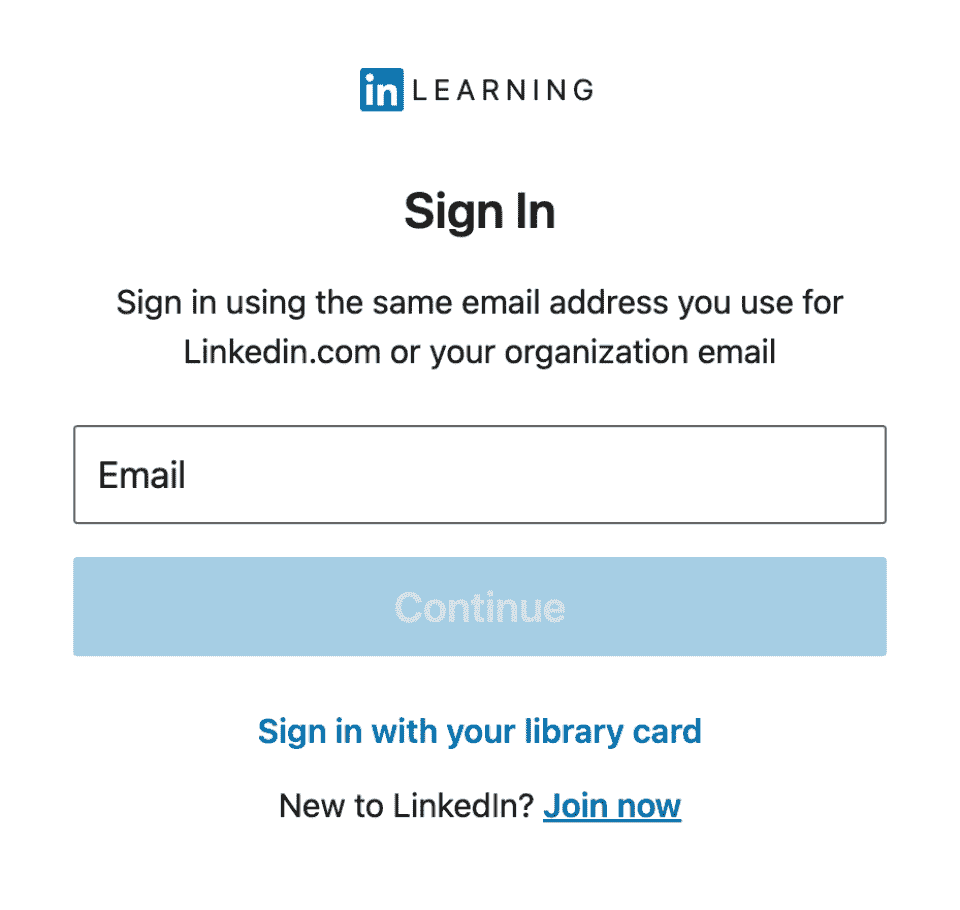
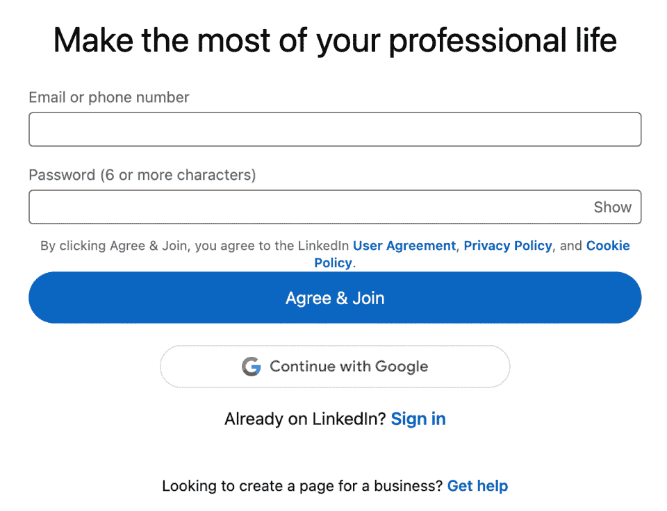
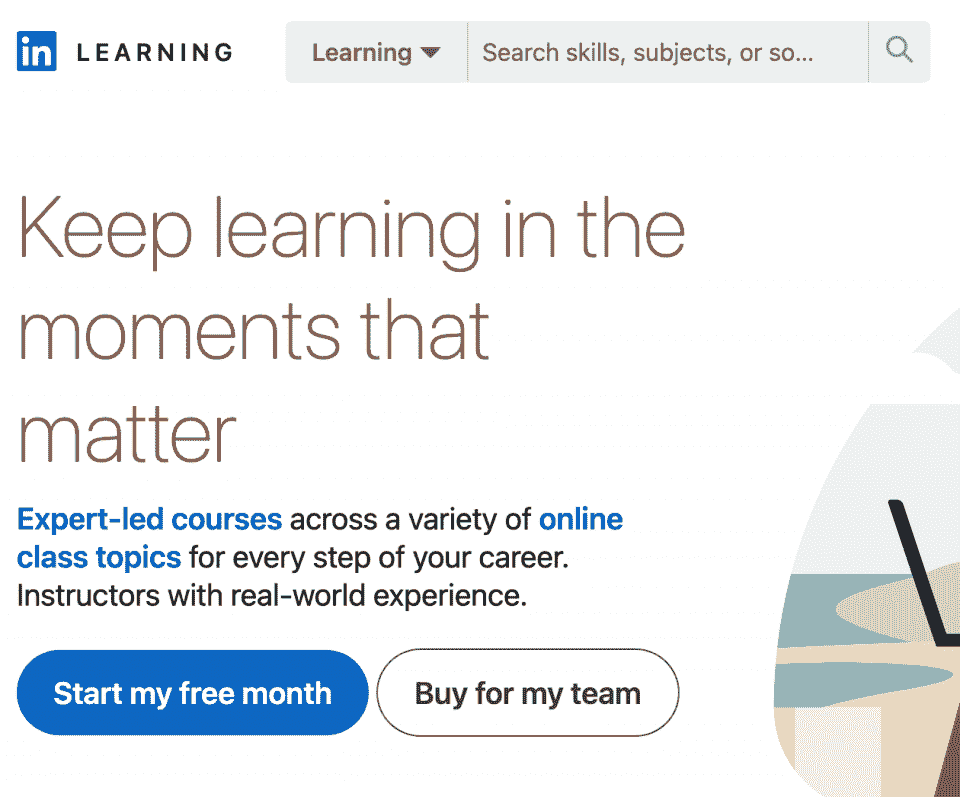
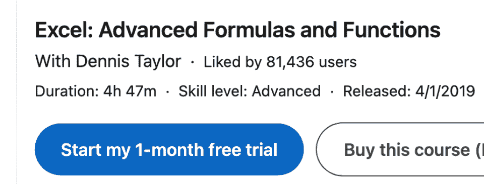
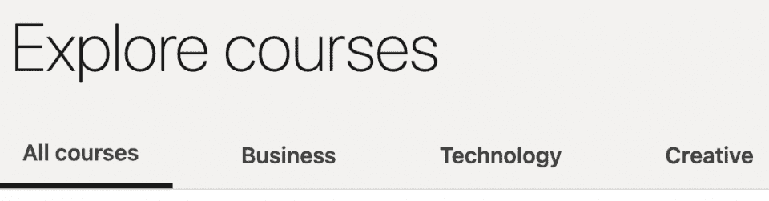
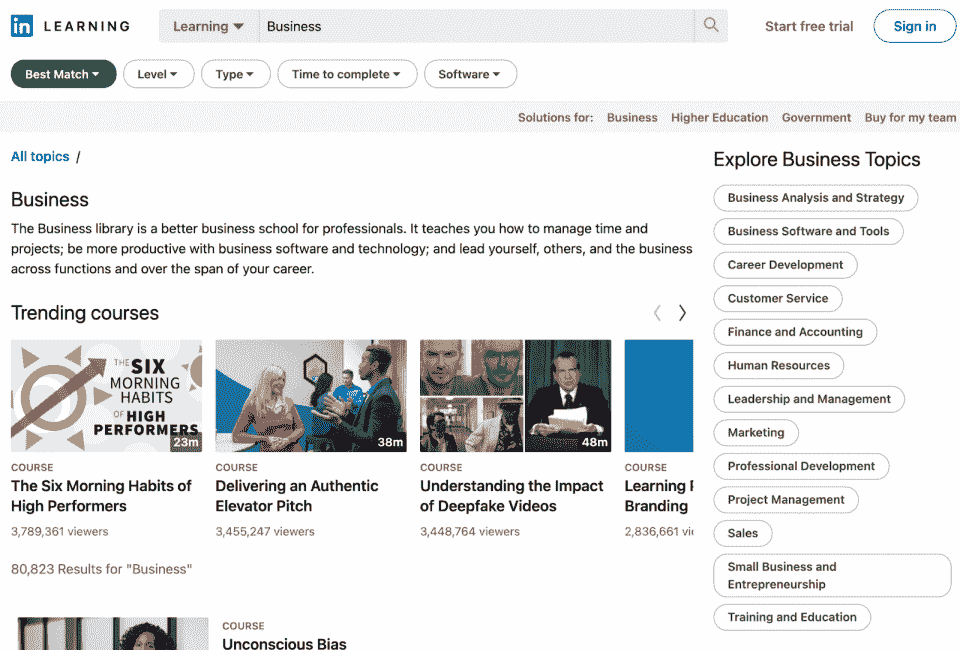

# LinkedIn 学习评论:优点、缺点和选择[更新]

> 原文：<https://hackr.io/blog/linkedin-learning-review>

LinkedIn Learning 是一个平台，可以让你学到新技能，改变你的职业生涯。它有超过 17，000 门课程，涉及与商业、技术和创造性追求相关的各种主题。该平台相当实惠，是预算教育的绝佳选择。它甚至允许你准备[认证](https://hackr.io/blog/best-cybersecurity-certification)或保持现有的。

| 教练 | 5/5 |
| 课程 | 4/5 |
| 经验 | 4.5/5 |
| 总数 | 4.5/5 |

**一览:**

*   订阅 LinkedIn Learning 可以获得 LinkedIn Premium 订阅，反之亦然。
*   课程质量一般都很好，但可能看起来“生产过剩”有些内容需要更新。
*   讲师是各自领域中受人尊敬的专家。
*   你可以单独购买课程。
*   平台价格实惠。
*   许多课程可以帮助你准备认证评估或认证维护的 ceu。

那么，领英学习值得吗？LinkedIn 学习对职业晋升有好处吗？

在这篇 LinkedIn 学习评论中，我们涵盖了关于该平台的所有信息，包括它的历史、合法性、定价、课程库等等。继续读下去，看看 LinkedIn 学习是否适合你！

## **LinkedIn 学习是什么？**

LinkedIn Learning 是一个在线学习平台，拥有超过 17，000 门课程，帮助个人和企业提升热门技能和知识。

LinkedIn 于 2015 年收购了该平台——在此之前，它曾是 Lynda.com，自 1995 年以来首批在线学习平台之一。在它的一生中，Lynda.com 提供了商业、创造技能和软件方面的课程。

### **LinkedIn 学习合法吗？**

是的，LinkedIn 学习是合法的——它是合法的，可验证的，并且在世界范围内使用。

总部位于加州的 LinkedIn 在全球拥有超过**8.3 亿用户。这个数字还在不断增长，因此在未来几年内，用户数量很可能会超过 10 亿。你会注意到公司的学习平台被许多专业人士、雇主和公司广泛使用和认可。**

 **### **LinkedIn Learning 认证了吗？**

不幸的是，没有。LinkedIn Learning *在你观看了与课程相关的每个视频后*会提供结业证书，但你不能在学院或大学中将这些证书用作可转让的学分。

然而，这并不意味着 LinkedIn 学习证书没有价值。你仍然可以在简历中添加证书。有时，你甚至可以使用证书作为 ceu(继续教育单位)来帮助你保持你的专业认证。

你也可以使用 LinkedIn 学习课程作为[认证准备](https://linkedin-learning.pxf.io/4e7mXM)，因为该平台与 **36** 认证机构相关联，包括 PMI、HRCI、CompTIA、AWS、谷歌、Adobe、思科等等。

LinkedIn 认证值得吗？当然——尤其是因为大多数雇主都认可该平台的高学习质量。

### **谁应该使用 LinkedIn 学习？**

LinkedIn Learning 是为任何想学习商业、技术和创造性学科新技能的人准备的。这是一个休闲学习和职业发展的绝佳平台。

该平台也非常适合准备专业认证评估和维护现有认证。

## 【LinkedIn Learning 是如何运作的？

LinkedIn Learning 提供视频格式的课程，你可以通过几种不同的方式缩小理想课程的范围。比如，你可以选择按科目学习，按软件学习，或者追求一种学习路径。

学习路径是围绕某个主题的一系列课程，完成后可以带你从零知识到专家。你可以找到关于如何成为软件开发人员等主题的路径。

### **如何开设 LinkedIn 学习账户**

LinkedIn 学习入门既简单又容易。如果您已经有了 LinkedIn 帐户，您只需登录即可。否则，您可以按照下面的过程创建一个帐户。

1.在 **LinkedIn 学习主页**上，点击**签到**。按钮在页面的右上角。

2.在下一页，登录您的帐户或点击**立即加入**创建一个新帐户。

3.您可以使用您的**电子邮件**或**电话号码**创建一个账户。完成创建新账户后，填写表格并点击**同意并加入**。或者，你可以通过你的**谷歌账户**创建一个账户。

就是这样！你有了一个全新的帐户，可以试用 LinkedIn 学习 30 天。

## **LinkedIn 学习的利与弊**

还不确定 LinkedIn 学习是否适合你？我们搜索了无数 LinkedIn 学习评论，看看用户对这个平台有什么看法。这里有一个简单的利弊清单供你考虑:

| **优点** | **缺点** |
| 为期一个月的免费试用让用户可以全面使用该平台的 17，000 多门课程 | 证书是不被认可的，不能在学院和大学里作为学分使用 |
| LinkedIn 个人资料上可共享的课程完成证书 | 话题仅限于那些有助于职业发展的话题(尽管考虑到 LinkedIn 的主要目的和受众，这并不总是一个缺点) |
| 具有下载功能的高度评价的 iOS 和 Android 应用 |  |
|  | 视频自动播放功能可能很烦人 |
| 高过程生产质量 | 课程/主题分类需要改进 |
| 许多课程有多种语言版本，网站本身也有语言选择器 | 一些过时的课程和内容 |
| 与其他 MOOCs 相比相对便宜 | 有些课程感觉“生产过剩”，带有太重的企业色彩 |
| 讲师是他们领域中可信的专家 |
| “注释”功能有助于标记重要细节 |
| LinkedIn 高级帐户的“免费”好处 |
| 大量的继续教育单位帮助你保持你的资格认证 |
| 大量的预备课程可以帮助你为官方(第三方)认证评估做好准备

*   【LinkedIn 学习课程多少钱？

 |

## LinkedIn Learning 提供认可度很高的课程，但是贵吗？LinkedIn 学习课程值得你付出的代价吗？

我们的份额？是的——LinkedIn Learning 的价格区间比其他 MOOC 提供商更实惠，并且包括一个月的免费试用。

免费试用版可让您获得:

完整的 17，000+课程库和所有相关的学习**加上**结业证书

*   课程推荐(个性化建议)
*   完全 LinkedIn 高级访问
*   要获得免费试用，您必须添加信用卡或借记卡号码。请务必在试用期结束前取消或更改您的套餐，以避免不必要的费用。除非您满足某些[条件](https://linkedin-learning.pxf.io/NKx07v)，否则订购购买不可退款。

在过去，LinkedIn Learning 的课程只能通过每月订阅获得。然而，LinkedIn 在 2019 年 5 月使[购买平台上的个人课程](https://linkedin-learning.pxf.io/yRKbYv)成为可能。你可以[永久、无限制地使用](https://linkedin-learning.pxf.io/YgAn7m)你以这种方式购买的课程。只需寻找写着“购买本课程”的按钮，它也应该在括号中列出价格。个别课程的价格通常在 20-40 美元之间。

个人购买的课程提供两个好处:永久访问(只要你保留你的 LinkedIn 账户)和一个 **30 天保证**窗口，在那里你可以获得全额退款。

如果你想通过 LinkedIn 学习订阅来访问该平台上的所有课程，你有两个选择:每月向 T2 付费，或者每年向 T4 付费。年费将为您节省 30%以上的费用。

每月订阅费为 39.99 美元，相当于每年 480 美元。《T2》的年度订阅费为 323.88 美元，相当于每月 26.99 美元。

请注意，LinkedIn Learning 订阅会自动为您提供 LinkedIn Premium 的访问权限，这是一项非常好的优势。

**LinkedIn 学习退款政策**

### 以下是你需要了解的关于 LinkedIn Learning 的[退款政策](https://linkedin-learning.pxf.io/7m6Ozr):

当你购买个人课程时，你可以通过 30 天退款保证获得退款。

*   在 LinkedIn 上购买的所有订阅，无论订阅的*类型*，都是**不可退款的**。您可以随时**取消**，但您不会获得订阅费退款。取消订阅后，您的平台访问将继续，直到您的最后一个订阅周期结束。
*   某些情况*可能*使您有资格获得订购付款的[退款，例如欧盟、荷兰或丹麦居住权。](https://linkedin-learning.pxf.io/7m6Ozr)

【LinkedIn Learning 提供免费课程吗？

### 很遗憾，没有。LinkedIn Learning 不提供任何免费课程。免费学习课程的唯一途径是 30 天的试用期。

如果您不想支付套餐费用或想要选择套餐条款，**请务必在** **试用期结束**之前取消或更改您的套餐 ***！***

LinkedIn Learning 上有哪些课程？

## LinkedIn 的课程值得吗？取决于你在找什么。

在这个平台上，你可以找到帮助你发展职业成长的硬技能和软技能的课程。你甚至可以学习如何使用某些软件和编程语言，比如 [Python](https://hackr.io/blog/how-to-learn-python) 或者面向对象编程。

主页上有三个主要的课程类别:商业、技术和创意。

每个主要类别下都有子类别。您通常可以在屏幕右侧的“探索 _____ 主题”下找到它们例如，点击“业务”会将您带到以下页面:

您可以使用 LinkedIn Learning 的过滤器，根据级别、内容类型(视频、课程或学习路径)、完成时间和使用的软件对结果进行排序。您还可以通过单击右侧的选项来筛选特定主题的结果。

同样的过程也适用于技术和创意类。

**如何在 LinkedIn Learning 上找到最好的课程**

## 最大化你的 LinkedIn 学习订阅的最好方法是找到平台的最佳课程。第一步？使用**免费试用**。

下一步是观看课程预览视频，阅读课程描述，并检查在线评论。寻找最合适课程的其他方法包括:

**使用 LinkedIn Learning 的课程推荐**

### 如果您已经创建了一个 LinkedIn 帐户并填写了您的个人资料，LinkedIn Learning 将根据您的个人资料推荐课程。主页上有推荐的类别，如最佳选择、最受欢迎、30 分钟内学习、新课程发布等。

因为这个功能使用你对感兴趣的**技能来编辑推荐，你可以继续添加到你的兴趣列表中，以获得更有针对性的建议。这样你可能会发现一两颗宝石！**

**找出导师是谁**

### 一定要看课程老师。你可以在课程描述页找到一篇简短的作者传记。简历还显示了教师 LinkedIn 个人资料和他们教授的其他课程的链接。

当你继续你的 LinkedIn 学习之旅时，注意你喜欢的和不喜欢的导师。

**检查课程 Q &一节**

### 如果你对课程有任何疑问或问题，请前往问答区。你会找到其他学员和教师提供的答案。

***加成:*** **考虑学习路径**

### 如前所述，学习路径是围绕特定主题的课程集合。如果你知道自己想做什么，但又不想费事去选择个别课程，那么学习路径可能是一个不错的选择。

**2023 年最佳领英学习课程**

## 在我们的迷你 LinkedIn 课程回顾中，让我们来看看 LinkedIn Learning 的一些最佳课程:

如果您想了解更多关于这个平台上最好(或最受欢迎)的课程，您可以在这里查看领英的帖子[。](https://linkedin-learning.pxf.io/jW7yqe)

**我们的 LinkedIn 学习回顾:总结**

## 用户友好度:4.25/5 -在这个平台上入门非常容易，尤其是如果你已经有了一个 LinkedIn 账户。然而，你可能会在寻找具体课程时迷路。

*   **便利性:5/5** - LinkedIn Learning 可在浏览器、iOS 和 Android 上使用。

*   **可访问性:5/5**——你可以用几种[语言访问 LinkedIn](https://linkedin-learning.pxf.io/5bdZ4j)——考虑到许多平台只提供英语内容，这一点更好。

*   负担能力:5/5 -如果单独购买，课程价格在 20-40 美元之间。包月最多 39.99 美元/月。

*   **认证:5/5**——大部分雇主认可 LinkedIn 学习证书。该平台有 36 个附属认证机构，你可以找到预科课程或获得继续教育单元。

*   **目录:4/5**——有人抱怨平台过时的课程。此外，目录组织有时令人困惑。

*   **课程质量:4.5/5** -尊敬的专家教授平台的课程；然而，一些人抱怨这些视频看起来“制作过度”和“过于公司化”

*   **用户支持:5/5** -该平台提供了一个健康的帮助中心，为最常见的问题提供了大量答案。您也可以在他们的支持聊天中提出您的问题。

*   **支付方式:4.75/5**——领英学习的[支付方式](https://linkedin-learning.pxf.io/kjKMxz)包括信用卡、借记卡、PayPal。

*   **退款政策:5/5** -尽管您不能获得订购退款，但个人课程购买有 30 天退款保证。

*   **结论:最终裁决和评级**

## LinkedIn Learning 提供数以千计的在线技能课程，可以帮助你提升或改变职业生涯。可以按照自己的进度学习，甚至可以下载课程离线查看。许多课程以不同的语言提供，以提高可访问性。

虽然该平台可以改善其用户界面和过度的公司感觉，但课程质量很高，每个课程领域都有经过认证的专家。这个平台也很实惠。

我们给 LinkedIn Learning 打了 4.5 分，满分为 5 星！

有兴趣看看其他学习平台吗？

**[查看我们的 Udacity 评论](https://hackr.io/blog/udacity-review)**

**常见问题解答**

## **1。LinkedIn 学习有什么好处吗？**

#### 如果你想提高你的技能，促进你的职业发展，或者完全改变领域，LinkedIn Learning 可以是一个很好的工具。高质量的课程和专业的教师使它成为一个值得学习的投资。

**2。LinkedIn 学习证书值得吗？**

#### 是的。LinkedIn 学习证书是简历的绝佳助推器。你甚至可以用它们作为继续教育单位来维持你在某些领域的官方认证，比如项目管理。

**3。该不该把领英学习写进简历？**

#### 是的，你应该在简历上添加 LinkedIn 学习课程和证书，以展示新技能。不错的福利？LinkedIn 会立即将你的结业证书放在你的 LinkedIn 个人资料中，完全展示给潜在的联系人和雇主。

**4。简历中可以使用 LinkedIn 证书吗？**

#### 绝对的！你当然可以在简历中加入 LinkedIn 证书来展示你的技能和专业知识。

**5。有 LinkedIn 学习 App 吗？**

#### 是的。你可以在 [iOS](https://apps.apple.com/us/app/linkedin-learning/id1084807225) 或者 [Android](https://play.google.com/store/apps/details?id=com.linkedin.android.learning&hl=en) 上下载领英学习 app。两者都得到高度评价，并提供与浏览器版本相同的核心功能。使用这些应用的一个主要好处是可以下载视频离线观看。

Yes. You can download the LinkedIn Learning app on [iOS](https://apps.apple.com/us/app/linkedin-learning/id1084807225) or [Android](https://play.google.com/store/apps/details?id=com.linkedin.android.learning&hl=en). Both are highly rated and offer all the same core functions as the browser version. One key benefit to using the apps is the ability to download videos to view offline.**