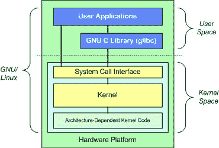

# 2023 年 50 大 Linux 面试问答[更新]

> 原文：<https://hackr.io/blog/linux-interview-questions>

Linux 不仅仅是一个操作系统。相反，它是一个庞大的基于 Linux 内核的免费开源软件操作系统家族。

系统安全和 Linux 管理密切相关。因此，当面试一份基于安全性的工作时，你会遇到 Linux 问题。

## 热门 Linux 面试问题和答案

在这里，我们收集了一份关于 Linux 面试问题和答案的列表，如果你的潜在工作机会以任何方式包含了 Linux，你必须知道。

#### **问题** : **你能告诉我们 Linux 的基本组件吗？**

**回答**:像任何其他典型的操作系统一样，Linux 有一个应用程序、GUI、内核和外壳。使用 Linux 作为操作系统的主要优势在于它是开源的和高度可定制的，这使得它对于经验丰富的专业人员和新手来说都是同样理想的。

#### **问题** : **请对 BASH 和 DOS 做一个比较。**

**回答** : DOS 代表磁盘操作系统，BASH 是 Bourne Again Shell 的缩写。一个[外壳](https://en.wikipedia.org/wiki/Shell_(computing))仅仅是一个用户界面，用于访问操作系统提供的服务。它可以使用 CLI 和/或 GUI。

以下是 DOS 和 BASH 之间的显著区别:

1.  **区分大小写–**DOS 命令不区分大小写，但 BASH 命令区分大小写。
2.  使用/和\ -在 BASH 中，/充当目录分隔符，\充当转义符。DOS 中/的作用是作为命令参数分隔符，并充当目录分隔符。
3.  **命名约定—**DOS 遵循的命名约定是，文件必须有一个 8 字符的文件名，后跟一个点和 3 字符的扩展名。BASH 没有可用的命名约定。

#### **问题** : **你如何检查 Linux 使用了多少内存？**

**回答**:在命令 shell 中，使用 concatenate 命令:

```
cat /proc/meminfo
```

这将产生如下输出:

```
Mem: “some number in bytes”
```

#### **问题** : **请解释一下 Linux 中的符号链接。**

**回答**:符号链接指向 Linux 中的目录、文件、程序。它们允许即时访问它们所指向的对象，而无需遍历整个路径。因此，符号链接就像 Windows 中的快捷方式。

#### **问题** : **你能告诉我们 Linux 下的各种许可吗？另外，解释如何更改权限。**

**回答【Linux 下有三种权限:**

*   **Read—**允许用户读取文件或列出目录
*   **Write—**允许用户写入文件或向目录中添加新文件
*   **执行–**允许用户运行文件或查找目录中的特定文件

系统管理员或文件或目录的所有者可以使用 chmod 命令向其他人授予权限。接下来是指定权限的接收者，接下来是授予还是拒绝权限，然后是权限的类型，最后是文件的名称。

一般语法是这样的:

```
chmod permissionreceiver+typeofpermissions file
```

权限接收者可以是 a 代表所有人，g 代表组，o 代表其他人，u 代表用户。Typeofpermissions 可以是 r 代表读，w 代表写，x 代表执行。例如，一个命令:

```
chmod go+rwx DemoFile.TXT
```

将授予 group 和其他人对名为 DemoFile 的文件的读取、写入和执行权限。

#### **问题** : **请解释一下虚拟桌面，以及如何在 Linux 下跨不同的虚拟桌面共享程序。**

**回答**:简单来说，虚拟桌面是最小化和最大化不同窗口的替代方案。虚拟桌面允许在具有不同程序窗口的桌面之间移动，而不是最小化或恢复不同的程序。

很多时候，需要在不同的虚拟桌面上共享一个程序。为此，只需转到程序窗口的左上角，单击图钉状的图标。它将锁定应用程序，使其可以跨所有虚拟桌面访问。

#### **问题** : **你所理解的守护进程是什么？**

**回答**:守护进程是扩展基本操作系统功能的一种方式。换句话说，守护进程是提供操作系统中可能没有的几个功能的服务。

守护进程的主要任务是主动监听服务请求，同时对它们进行处理。一旦完成服务，守护进程就会断开连接，等待进一步的请求。

#### **问题** : **请解释使用 vi 编辑器时的各种模式。**

**回答**:VI 编辑器提供 3 种模式:

*   命令模式–这是用户启动的模式
*   编辑模式–该模式允许进行文本编辑
*   Ex 模式–该模式允许与 vi 交互，允许执行指令来处理文件

#### **问题**:**/usr/local 的内容是什么？**

**回答**:/ usr/local 目录包含本地安装的文件。当文件存储在某个网络上时，目录是非常重要的。此外，该目录用于存储从某个源安装的软件包或没有正式发布的软件。

#### **问题** : **告诉我们你将如何从一个命令行入口执行多个命令或程序。**

**回答** : Linux 允许在一行中组合几个命令。每个命令由分号(:)分隔。按照指定命令的顺序，从左到右执行。

#### **问题**:**Linux 中的硬链接是什么意思？**

**回答**:Linux 中的硬链接直接指向磁盘上存在的物理文件。它与路径名无关。这只是意味着，如果文件被重命名或移动到其他位置，链接将不会中断，仍然像以前一样工作。

#### **问题** : **请解释一下 Linux 中的区分大小写问题。**

**回答**:有时候在 Linux 中输入同一个命令会产生不同的输出。这通常归因于区分大小写。因为 Linux 是区分大小写的，所以以前产生所需输出的命令在再次执行时可能不会产生同样的结果。

例如，ls 命令负责列出目录中的所有文件。但是，输入 lS、Ls 或 LS 将显示错误。此外，如果有一个名为 LS 的程序，那么输入 LS 命令将执行它，而不是列出目录中的所有文件。

#### **问题** : **你能说出一个无名目录在 Linux 中代表什么吗？**

**答案**:空目录名作为 Linux 文件系统的无名库。它作为系统中所有其他设备、目录、驱动器和文件的附件。

#### **问题** : **你会画 Linux 架构吗？**
**答案** : 

#### **问题** : **请解释一下如何在 Ubuntu 灯栈上启用 curl 和在 Ubuntu 中启用 root logging？**

**回答**:要在 Ubuntu 灯堆上启用 curl:

1.  安装 libcurl
2.  使用命令:sudo/etc/init。d /apache2 重启服务 apache2 重启

要在 Ubuntu 中启用 root 日志记录，请使用以下命令:

```
#sudo sh-c 'echo "greater-show-manual-login=true" >>/etc/lightdm/lightdm.conf'
```

#### **问题** : **在 Linux 下，你如何将一个文件附加到另一个文件上？**

**回答**:命令:

```
cat file1 > file2
```

在 Linux 中追加两个文件。您可以使用命令追加尽可能多的文件。例如，要追加三个文件，即文件 1、文件 2 和文件 3，我们可以使用命令:

```
cat file1 > file2 > file3
```

在 Linux 中，将一个文件附加到另一个文件的另一种方法是使用命令:

```
cat file2>>file1
```

>>操作符追加命名文件的输出。

#### **问题** : **在 Linux 中，你会使用什么命令来编辑、搜索和替换文本？**

**回答**:

**编辑:**

您可以使用 cd 命令，后跟您需要用来编辑文件的文本编辑器的名称，如 vi。

**搜索:**

您可以使用以下命令在 Linux 中搜索文件:

```
find –iname “filename”
```

在 Linux 中，要搜索和打印文件中的文本，可以使用 grep 命令。

**替换:**

这个过程涉及到使用流编辑器(sed)。您需要使用以下命令:

```
sed -i 's/old-text/new-text/g' input.txt
```

输入需要替换旧文本的文本和需要添加的新文本。

#### **问题** : **你对 Linux 中交换空间的理解是什么？**

**回答**:当 RAM 没有足够的内存来容纳当前正在执行的所有程序时，交换空间就开始发挥作用。交换空间是 Linux 操作系统用来临时保存并发运行的程序的一些内存空间。

#### **问题** : **请解释你将如何在后台运行一个 Linux 程序，同时启动 Linux 服务器。**

**回答**:需要先使用 nohup 命令。它将停止接收 NOHUP 信号的进程。终止将使您退出被调用的程序。然后启动 Linux 服务器，输入 Linux 程序的名称，后跟&符号，在后台运行该进程。

#### **问题** : **你能解释一下如何用 SSH 远程登录吗？**

**回答**:虽然有许多方法可以访问远程计算机，但是使用 SSH(安全外壳)协议是普遍的首选。该协议利用公钥加密认证方法来保护主机之间的通信。

要使用 SSH 命令，用户需要通过输入服务器的 IP 地址来定义服务器。如果 192.168.100.22 是需要 SSH 访问的系统的 IP 地址，则输入命令:

ssh 192

此外，您可以将显式用户名指定为:

ssh someusername@192.168.100.22

SSH 允许数据压缩以及通过 X11 发送图形命令。正确配置后，SSH 协议提供了一条安全线路，能够保护自己免受 DNS 欺骗和[中间人攻击](https://en.wikipedia.org/wiki/Man-in-the-middle_attack)。

#### **问题** : **请解释一下 Linux 中对 Rootkit 感染的检查。**

**回答**:Rootkit 是一种高级形式的恶意软件，会产生一系列安全问题，并且在许多情况下不会被普通的防病毒程序检测到。因此，需要使用先进的反间谍工具来检查 Linux 中的 Rootkit 感染。其中一个就是 [rkhunter](https://en.wikipedia.org/wiki/Rkhunter) 。

Rkhunter 可以按照发行版软件包管理的说明从软件仓库安装。Debian 和 Ubuntu 用户可以使用(sudo) apt-get install rkhunter 命令，而基于 Red Hat 的发行版可以使用 dnf 或 yum 命令。

其他几个值得注意的用于检查 Linux 中 rootkit 感染的安全工具是:

*   chroot kit . chroot kit . chroot kit . chroot kit . chroot kit . chroot kit . chroot kit . chroot kit . chroot kit . chroot kit . chroot kit . chroot kit
*   我在呼唤
*   LMD(检测到 Linux 恶意软件)
*   琳妮丝

#### **问题:定义 Linux？**

**答案:** Linux 是基于 UNIX 的操作系统。它可以在英特尔、惠普、IBM、摩托罗拉、SPARC 和 MIPS 制造的各种平台上运行。Linux 的吉祥物是 Tux Paint 的一只企鹅。

#### **问题:UNIX 和 LINUX 有什么区别吗？**

**答案:**UNIX 和 LINUX 有巨大的区别。UNIX 是贝尔实验室开发其商业版本的专有操作系统。另一方面，LINUX 是面向大众的完全免费的开源操作系统。

#### **问题:定义 LINUX 内核？**

**答案:** LINUX 内核是对能够为用户管理不同硬件资源的底层系统软件的统称。它有助于为用户级交互提供一个界面。

#### **问题:LINUX 中的 LILO 是什么？**

**答案:** LILO 是 LINUX 中给 bootload 起的名字。它的功能是将 LINUX 操作系统加载到主内存中，以便启动操作系统。

#### 问:开源的优势是什么？

**回答:** 开源有各种各样的优势，其中包括:

1.  它有助于将带有源代码的软件免费分发给用户。
2.  它支持用户添加新功能、调试和纠正源代码中的错误。
3.  它有助于重新发布新的、改进的源代码，并免费提供给其他用户。

#### 问:BASH 和 DOS 命令之间有什么区别？

**回答:**BASH 和 DOS 命令有几个不同之处，包括:

| **痛击** | **DOS** |
| 它区分大小写。 | 不区分大小写。 |
| 字符充当目录分隔符和转义符。 | 它还可以作为命令参数分隔符和目录分隔符。 |
| 它不遵循惯例。 | 它遵循命名文件的惯例，文件名为八个字符，扩展名为一个点和三个字符。 |

#### **问题:GNU 项目有什么优势？**

**回答:**GNU 项目是一个自由软件，它提供了如下各种优势。

1.  它提供了为任何目的运行程序的自由。
2.  它有助于根据用户需要学习和修改程序。
3.  它允许向人们重新分发软件的拷贝。
4.  它有助于改进软件。
5.  它支持向公众发布软件。

#### **问题:什么是 Root 账户？**

**答:**Root 帐户是系统管理员帐户，有助于对系统进行完全控制。它有助于创建和维护各种用户帐户，从而为每个帐户分配不同种类的权限。默认情况下，只要安装了 LINUX，就会出现这种情况。

#### **问题:CLI 和 GUI 的完整形式是什么？**

**答案:** CLI 代表命令行界面，GUI 代表图形用户界面。

#### **问题:解释 CLI？**

答: CLI 是一种界面，它允许用户键入各种声明性命令，这些命令旨在指示计算机执行其特定功能。它为用户提供了更大的灵活性。

#### **问题:解释 GUI？**

**答:** 图形用户界面有助于利用图像和图标，使用户可以点击和操纵与计算机交流的方式。它有助于消除对类型命令的依赖，并支持图形元素表示以与系统交互。

#### **问题:如何在 LINUX 中打开命令提示符？**

**答案:** 我们可以通过按 Ctrl+Alt+F1 来打开发出命令时的命令提示符。它将有助于提供命令行界面(CLI ),可以根据需要运行命令。

#### 问题:我们能发现 LINUX 使用了多少内存吗？

**回答:** 是的，我们可以发现 LINUX 使用了多少内存。这可以通过应用命令 shell 来完成，即通过应用 cat/proc/meminfo 来执行“Concatenate”命令。这将有助于显示内存使用情况。结果以 Mem:12345678 等形式出现。这个结果就是 LINUX 必须提供给你的可用内存。

#### **问题:LINUX 中交换分区的大小是多少？**

**回答:**LINUX 中交换分区的大小是系统可用物理内存的两倍。但是，最小大小是安装的内存量。

#### **问题:LINUX 中 Ctrl+Alt+Del 组合键如何工作？**

**答案:**Ctrl+Alt+Del 组合键在 LINUX 下工作，就像在 Windows 下工作一样。这个组合键有助于重启系统。但是，在 LINUX 中，重启之前不会显示确认消息，重启会立即发生。

#### **问题:如何引用 LINUX 中的并口？**

**答:** 并口包括打印机、扫描仪以及其他各种连接到计算机系统的电子设备。在 Linux 中，这些并行端口对于 LPT1 称为/dev/lp0，对于 LPT2 称为/dev/lp1，依此类推。

#### 问题:在 LINUX 中，驱动器是如何表示的？

**答:** 软盘驱动器、硬盘驱动器和其他驱动器不在驱动器号中表示，而是用不同的名称表示，如/dev/fd0 或 fd1 表示软盘驱动器 1 和 2。对于硬盘，它被称为/dev/hda 或 hdb 或 hdc 等。

#### **问题:LINUX 中的 pwd 命令是什么？**

**回答:** pwd 代表**打印工作目录**。该命令用于打印工作目录。

#### **问题:LINUX 中有环境变量吗？**

**答案:** 是的，LINUX 中有各种各样的环境变量，其中就包括 shell 函数，也就是我们常说的全局 shell 变量。

#### **问题:在 LINUX 中定义重定向？**

**答案:**LINUX 中的重定向是将数据从一个输出定向到另一个输出的过程。它可以用作另一个流程的直接输入，以获得所需的输出。

#### **问题:定义 Grep 命令？**

**答:** Grep 命令用作搜索命令，以便可以启动基于特定模式的搜索。它有助于使用命令行附带的各种选项和参数，以便获得所需的文件输出。

#### 问:我们能在 LINUX 中终止一个正在进行的进程吗？

**答:** 是的，我们可以在 LINUX 中通过使用 **Kill 命令、** 来终止一个正在进行的进程，然后使用 pid 来终止特定的进程。可以使用 Kill 0 来终止所有进程。

**回答:** 是的，我们可以通过在实际的注释文本前键入#符号，在命令行提示中插入注释。因此，shell 将忽略所写的内容，并显示注释。

#### **问题:如何在 LINUX 中应用命令分组？**

**答案:** 在 LINUX 中可以通过给分组命令加上括号来应用命令分组。

#### **问题:我们可以卸载 LINUX 中的库吗？**

**回答:** 是的，我们可以使用命令 sudo apt-get remove library_name 卸载 LINUX 中的库。

#### **问题** : **你将如何在 Linux 中设置密码老化？**

**回答**:chage 命令允许 Linux 中的系统管理员强制密码老化。该命令用于更改强制密码重置的间隔天数。/etc/login.defs 文件负责处理系统范围的配置。可以对其进行编辑:

*   PASS _ MAX _ DAYS–定义密码可以使用的最大天数。
*   PASS _ MIN _ DAYS–定义密码更改之间允许的最小天数。
*   PASS _ WARN _ AGE–定义密码过期前发出警告的天数。

## **总结**

这就完成了重要的 Linux 面试问题列表。我希望这些问题能帮助你理清即将到来的 Linux 面试。

如果你想在面试前做更深入的准备， [Linux 技术面试问题](https://click.linksynergy.com/deeplink?id=jU79Zysihs4&mid=39197&murl=https://www.udemy.com/course/linux-technical-interview-questions-and-answers/)是 udemy 上一门评价很高的课程。

还有一本笔记本可以用来复习所有基本的 Linux 命令，与 [Linux 面试](https://geni.us/8Ttyo)相关。

查看一些最好的 Linux 系统管理教程。你期待的哪些问题没有列在清单上？有给出错误答案的吗？请通过下面的评论窗口告诉我们。

**人也在读:**