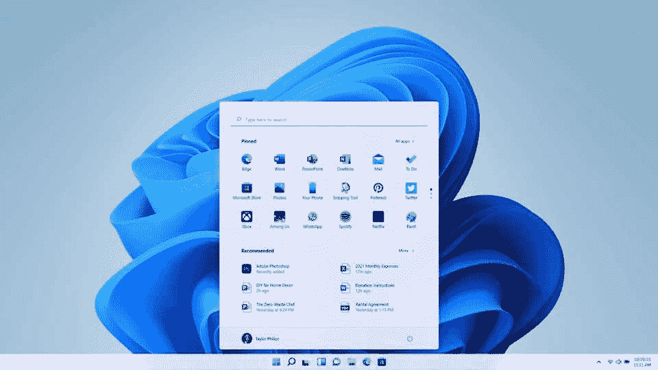
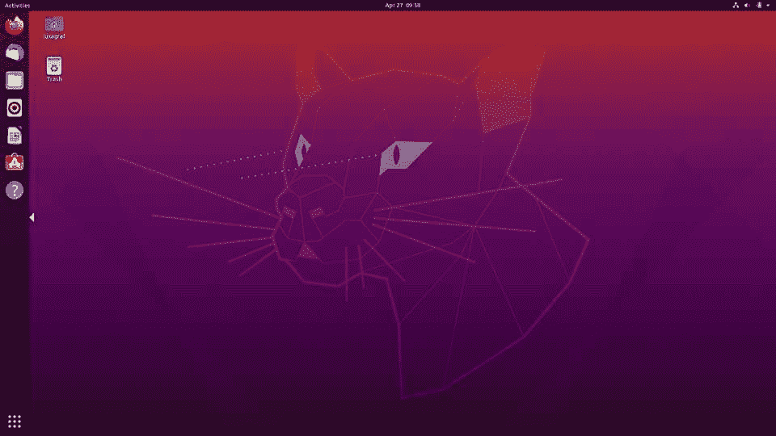

# Linux vs Windows:应该选择哪个操作系统？

> 原文：<https://hackr.io/blog/linux-vs-windows>

当选择一个操作系统的时候，有很多粉丝，各方面都有支持者。Linux vs Windows 的讨论是一场由来已久的战争，已经持续了多年。

需要强调的是,“最好的”操作系统不可能只有一个答案，因为最好的确实取决于用户的需求。

在这里，我们讨论这两个系统的利弊，因为我们希望提供一个基于特定标准的公平审查。也许这将帮助你在 Windows 和 Linux 之间做出选择。

开始这一讨论的理想方式是谈论 Linux 和 Windows 之间的差异。我们在简要讨论了每个操作系统之后，将深入探讨这一点。

## **Linux 与 Windows:势均力敌的比较**

| **参数** | **Linux** | **窗户** |
| **由**开发 | 莱纳斯·托沃兹 | 微软公司 |
| **发牌** | 开源 | 闭源 |
| **价格** | 自由的 | 昂贵的 |
| **内核类型** | 整体内核 | 微内核 |
| **效率** | 更有效率 | 效率较低 |
| **分离目录** | 斜杠 | 反斜杠 |
| **安全** | 更安全 | 不如 Linux 安全 |
| **黑客效率** | 高的 | 低的 |
| **用户账户类型** | 规则的

1.  根
2.  服务帐户
3.  管理人员

 | 标准

1.  儿童
2.  客人
3.  **超级用户**
4.  根用户

 |
| 管理员用户 | **可靠性** | 更可靠 |
| 不如 Linux 可靠 | **游戏** | 不太合适 |
| 理想的 | **系统更新** | 简单，用户可以控制 |
| 对新手用户来说很难 | **什么是 Windows 操作系统？** | **** |

### 微软于 1985 年首次发布了 Windows 操作系统。它现在主导着操作系统市场，拥有全球最大的用户群。通过更新，每个操作系统版本都有一个独特的图形用户界面。Windows 实际上有两种模式:用户模式和内核。后者运行关键的系统进程，而前者运行典型的应用程序。

我们今天看到的大多数商业系统都运行在 Windows 操作系统上，该操作系统旨在运行在 x86 硬件上，包括 Intel 和 AMD。

以下是 Windows 操作系统的利与弊:

**优点**

**缺点**

| 直观且对初学者友好 | 会随着时间变慢 |
| 高质量的用户界面 | 可能会有错误和可靠性问题 |
| 许多可用的应用程序 | 必须购买 |
| 对传统应用的良好支持 | 易受漏洞影响 |
| 有大量的硬件和驱动程序支持。 | 有数据收集功能，但可以关闭 |
| **什么是 Linux 操作系统？** | **** |

### Linux 操作系统是由 Linus Torvalds 在 20 世纪 90 年代早期创建的开源操作系统。基于 UNIX，Linux 允许用户修改现有的代码并生产不同的版本或发行版，他们可以重复使用甚至出售。

Linux 已经成为安装服务器的首选，这也是为什么互联网上的大多数网页都是通过一个发行版支持的系统提供服务的。该操作系统还广泛应用于台式机、手机、游戏机、电子书阅读器等等。

以下是 Linux 操作系统的利与弊列表:

**优点**

**缺点**

| 自由的 | 不直观，不适合初学者 |
| 比 Windows 快得多 | 没有 Windows 那么多的应用程序 |
| 可定制的 | 没有广泛的硬件或驱动程序支持 |
| 非常可靠和安全 | 高度隐私 |
| 【Linux 和 Windows 的区别 |
| 在这里，我们将基于选择标准来讨论 Windows 和 Linux 之间的区别。 |

## **1。价格和许可**

Linux 操作系统及其大部分实用程序和库都是完全免费和开源的，可以使用和修改。虽然市场上有带额外支持的 Linux 操作系统的付费发行版，但它们的价格非常适中。在 GNU 通用公共许可证下，Linux 允许用户修改、在任意数量的系统中重用，甚至出售他们自己的修改版本。

### 微软视窗操作系统附带微软许可证，不允许用户访问源代码。因此，不能在标准用户级别执行任何修改。标准版本的 Microsoft 许可证从 70 美元到 200 美元不等，并且只能安装在您购买的特定数量的计算机上。

**2。易用性**

这可能是一个艰难的比较，因为它可能因人而异。然而，Linux 已经通过不断的现代化改进了它的可用性。随着 Linux Mint 等发行版的发布，安装和设置过程变得更加简单。通过不断更新，很少或没有技术知识的人也可以安装软件并执行正常活动，如电子邮件、播放音乐和视频以及浏览互联网。

### 由于 Windows 在市场上的主导地位，它被预装在许多设备上。如果您购买的是新设备，它很可能会安装 Windows 操作系统版本。凭借其在市场上的霸主地位，绝大多数用户已经习惯了它的界面。

此外，易于使用的工具栏和易于安装的程序使其成为新老用户的绝佳选择。

**3。支持**

由于 Linux 在全球拥有庞大的用户群，因此 Linux 可以获得大量的在线支持。Linux OS 社区通过论坛、问题板和支持网站为用户提供支持。

### 通过集成的在线帮助系统、专用网站和论坛，Windows 操作系统可以轻松获得支持。此外，网上还有许多关于 Windows 的视频和书籍。

**4。品种**

Linux 因其开源性和几处修改而闻名。基于用户的需求，有许多可高度定制的发行版。如果你了解代码，你甚至可以自己修改代码，修改操作系统。一些最流行的定制 Ubuntu 环境有 Gnome、Cinnamon、Deepin 和 LXQT。

### 在 Windows 操作系统中，定制并不容易，可用的定制数量相对较少。用户大多都是开箱即用，这可能不是每个人都喜欢。

**5。速度**

说到速度，Linux 远远超过了 Windows。与 Windows 不同，Linux 倾向于在使用多个进程时尽量减少“混乱”。Linux 中的文件系统 Ext4 在保持设备效率方面做了值得称赞的工作。在 Linux 中，碎片整理已经死亡并被埋葬了。

### Windows 操作系统有时会变慢到无法忍受的程度，随着时间的推移，这在某种程度上是不可避免的。当使用多个进程时，内存和磁盘过度占用是很常见的。

**6。隐私**

在过去的几年里，Windows 变得越来越广告驱动。用户可以选择退出，但那些担心隐私的人会发现这种体验令人生厌。许多人喜欢微软 Windows 提供的工具，但不管怎样，它们都是侵入性的。

### 另一方面，Linux 用户有一个优先考虑用户隐私的操作系统。Linux 设备还配备了强大的加密功能，这意味着用户可以确保更好的安全性和更少的第三方应用程序入侵。

7 .**。安全性**

Linux 也比 Windows 安全得多。由于 Linux 的开源技术，攻击媒介仍在不断被发现。但是，任何人都可以检查漏洞，这使得识别和解决过程更快、更容易。

### 与此同时，Windows 多年来在改善其安全系统方面取得了长足的进步，在 2020 年至 2021 年期间下降了 5%，但它仍然是恶意黑客的主要目标。由于其庞大的用户群，微软总是容易受到新的威胁，当它们出现时，它们会影响许多用户。

**8。运行级别**

运行级别是 init(引导期间启动的第一个进程)和整个系统的状态，它定义了哪些系统服务正在运行。运行级别用数字标识。您可以更改运行级别和可以在其中运行的服务，这提供了对系统的更多控制。

### 虽然 Linux 可以在不同的运行级别停止，但 Windows 将在运行级别 3 重新启动，以便管理员修复遇到的问题。

**9。命令行用法**

在 Linux 操作系统中，命令行是用于管理和日常任务的非常方便和强大的工具。

### 在 Windows 中,“cmd”命令可用于打开命令行并执行一组基本操作，而 PowerShell 提供了更多的灵活性。

**推荐 Linux 命令行课程:**

10。可靠性

Linux 操作系统非常关注系统安全性、进程管理和正常运行时间。Linux 在这一点上做出了妥协，它是目前最安全可靠的操作系统。

### 相反，尽管微软这些年来在可靠性方面取得了进步，但仍远不及 Linux。它为了用户友好和易于访问而放弃了许多功能，这可能导致系统不稳定和安全漏洞。

**11。系统更新**

在 Linux 操作系统中，用户可以完全控制安装更新的时间和内容。Windows 因其在不方便的时候弹出的随机更新而臭名昭著。对于外行用户来说，这可能无关紧要，但是那些有更多计算机经验的人会因为灵活性而更喜欢 Linux。

### **12。兼容性**

Windows 轻而易举地赢得了这一奖项，因为在 Windows 上运行的应用程序比 Linux 多得多。大多数开发人员希望在 Windows 上开发，因为它的用户群很大，传统应用程序也有很多支持。

### 谈到兼容性，Linux 就没那么幸运了。

13。游戏

Windows 在游戏竞赛中大获全胜。Windows 用户可以使用 Steam、Epic 和许多其他客户端，这为他们提供了玩 AAA 游戏和小型独立游戏的机会。由于用户基数较大，显卡制造商将其支持重点放在 Windows 上。

### 虽然 Linux 正在慢慢进入游戏市场，但随着许多游戏推出测试版支持，很难想象它会赶上 Windows。如果你购买了 Linux 操作系统，你将会错过很多游戏。

[Linux 精通:11.5 小时掌握 Linux 命令行](https://click.linksynergy.com/link?id=jU79Zysihs4&offerid=1045023.1320362&type=2&murl=https%3A%2F%2Fwww.udemy.com%2Fcourse%2Flinux-mastery%2F)

Windows 与 Linux:哪个更好？

简要解释了 Windows 与 Linux 操作系统的争论之后，您应该能够在两者之间做出更好的选择。并不是说一个比一个好，只是两者心里的受众都不一样。许多人可能会问 Linux 比 Windows 更好，或者相反，但是根据上面的信息为自己挑选。

## 你觉得我们在这篇文章中遗漏了什么有用的观点吗？请在下面的评论区告诉我们。你也可以查看一些 [Linux 系统管理教程和课程](https://hackr.io/tutorials/learn-linux-system-administration?ref=blog-post)，它们可能会帮助你开始使用 Linux。

**常见问题解答**

**1。Linux 好还是 Windows 好？**

## 这个问题没有直接的答案，因为两者面向不同的受众。如果你想要一个易于使用并且开箱即可运行许多应用程序的东西，请选择 Windows。如果安全性、可定制性和可靠性对您很重要，请选择 Linux。

#### **2。Linux 和 Windows 的主要区别是什么？**

Linux 和 Windows 的主要区别在于 Linux 更安全、更私有、更可靠。Windows 更加直观，支持更多的应用和硬件。

#### **3。Linux 能做什么 Windows 做不到的事？**

有很多这样的事情。一个主要的特性是，如果改动很小，Linux 不需要重启机器来安装更新。

#### **4。Linux 可以运行 Windows 程序吗？**

是的，你可以通过第三方软件在 Linux 上运行 Windows 程序。请记住，您不能运行所有的 Windows 程序，只能运行少数程序。

#### **人也在读:**

Yes, you can run Windows programs on Linux through third-party software. Bear in mind you cannot run all Windows programs, only a select few.

**People are also Reading:**