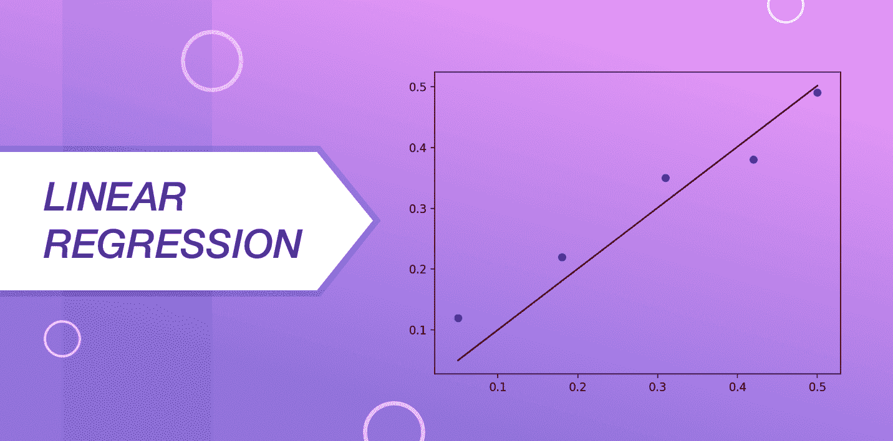
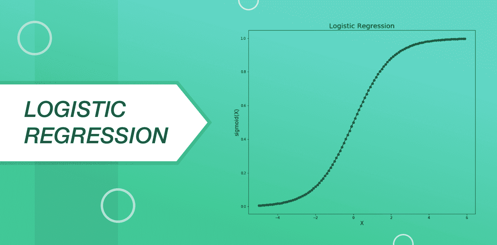
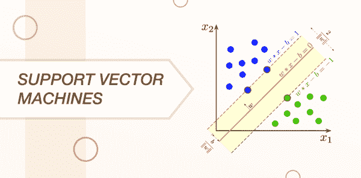

# ML 初学者的 10 大机器学习算法[更新]

> 原文：<https://hackr.io/blog/machine-learning-algorithms>

在过去十年左右的时间里，机器学习的应用和采用有了显著的发展。事实上，就技术而言，这个时代可以被称为最具革命性和意义的时期之一。机器学习的影响如此之大，以至于它已经开始普遍地主导我们的生活。

我们生活在一个世界里，所有曾经被认为是手工任务的事情正在转变为自动化任务，这一切发生的原因是因为[机器学习](https://hackr.io/blog/what-is-machine-learning-definition-types)。它是许多交互式软件应用程序、执行手术的机器人、下棋的计算机、大型计算机到个人电脑的转换、无人驾驶汽车、交互式在线学习解决方案以及许多其他事物背后的原因。

技术一直在以惊人的速度发展。如果我们分析近年来计算机技术的进步，有一件事是很容易预测的，那就是摆在我们面前的光明未来。

话虽如此，数据科学家之所以能够用技术解决方案来解决如此复杂的第一手问题，是因为他们利用了特殊的机器学习算法，这些算法已经被开发出来，可以很好地解决这些问题。至少可以说，到目前为止，结果是显著的。

在这篇博客中，我们将列出数据科学家必须了解的 **10 种机器学习算法**。如果你是一名数据科学家，一名有抱负的科学家，或者如果你只是对机器学习感兴趣，那么了解这些算法将非常有帮助。

然而，在我们开始学习 10 种机器学习算法之前，让我们先了解两种主要的机器学习技术。这些技术是理解十种机器学习算法的基础。

有两种主要类型的机器学习技术:

### 什么是监督学习？

受监督的机器学习遵循一种模型，该模型根据不确定性的证据形成预测。简而言之，监督学习算法依赖于之前记录的一组输入及其相关输出。它在利用对新数据的响应进行分析预测中发挥作用。

如果数据科学家已经知道他们希望预测的输出数据，他们可以使用监督学习。此外，使用分类和回归方法进行监督学习，以增强预测模型。

**分类技术:**该技术用于预测相当离散的反应。比如说；如果你想知道一封电子邮件是真实的还是垃圾邮件，一个肿瘤是恶性的还是开始的，那么你可以使用分类技术。

这项技术最常见的应用包括语音识别、医学成像、信用评分等。用于执行分类的常见机器学习算法包括 k-最近、判别分析、提升、袋装决策树、支持向量机(SVM)、神经网络等。

**回归技术**:为了预测诸如温度变化、电力需求波动等连续响应，使用回归技术。这种技术最常见的应用包括电力负荷、算法交易、预测等。

如果数据科学家正在处理一个数据范围，或者某个特定响应的性质是一个实数(如温度或时间),他们会使用回归技术。机器学习算法包括线性模型、正则化、逐步回归、袋装决策树、非线性模型等。

### **什么是无监督学习？**

当目标是发现数据中的隐藏模式或任何内在结构时，使用无监督学习。它使数据科学家能够从由没有任何标记响应的输入数据组成的数据集得出重要的推论。

**聚类:**最常见的无监督学习技术被称为聚类。这项技术用于探索性数据分析，以发现数据中隐藏的模式或分组。聚类最常见的应用包括市场研究、基因序列分析、对象识别等。

用于执行聚类的常用算法包括 k 均值和 k 中值、高斯混合模型、分层聚类、隐马尔可夫模型、减法聚类等

**可视化算法:**非监督算法确认未标记的数据，同时以直观结构的形式展示它，主要在 2D 或 3D 中，这种算法称为可视化算法。该数据集在可理解的群中精确地不同，以增加理解。

**异常检测:**算法检测用于找出数据中可能存在的异常。它可以用于检测任何可疑的信用交易，区分罪犯和一组人等。

数据科学家在有监督和无监督机器学习之间进行选择时遵循的规则

*   当数据科学家需要训练模型进行预测时，可以选择监督学习技术。例如:预测温度或股票价格等连续变量的未来。此外，在进行分类时也会用到它们。例如:发现一封电子邮件是来自一个真实的来源还是垃圾邮件。
*   如果需要探索一组数据或训练模型以找到良好的内部表示，如将数据分成聚类的过程，数据科学家会选择无监督学习。

现在我们已经奠定了机器学习技术的基础，让我们直接进入所有数据科学家都必须知道的 10 大机器学习算法。

### **1。线性回归**

****

线性回归是一种被世界各地的数据科学家广泛使用的机器学习算法。为了理解这种算法的功能，想象一组重量递增排列的石头。

这里的限制是你不能自己称这些石头的重量。你必须通过观察它们的高度和形状来猜测这些原木的重量，同时根据可见的参数对它们进行分类。这正是线性回归的意义所在。

线性回归是用一个方程来表示的，这个方程定义了一条非常符合输入变量和输出变量之间关系的直线。这条线称为回归线，主要用一个等式表示:

```
Y = a*X + b
```

在这个方程中，“y”是因变量，“a”是斜率，“X”是自变量，“b”是截距。线性回归的目标是找到系数“a”和“b”的值。

### **2。逻辑回归** 

****

这个算法是从统计学领域派生出来的。它被认为是解决二分类问题的可靠方法。逻辑回归的主要目的是发现代表所有输入变量的系数的值。除了线性回归之外，逻辑回归的常用预测输出会使用一种称为逻辑函数的非线性函数进行更改。

逻辑函数的形状是一个大“S ”,用于改变范围从 0 到 1 的任何值。这有助于将特定规则应用于逻辑函数的输出，以便将值从 0 更改为 1。由于掌握或识别该模型的方式，通过逻辑回归实现的重要预测可以用作属于类别 0 或 1 的任何数据的概率。这可以用来解决需要对预测进行更多思考的问题。

逻辑回归的工作方式与线性回归非常相似，当与输出变量无关的属性以及性质相同的属性被删除时，逻辑回归会更加有效。

决策树是最常用的机器学习算法之一。它基本上是一种监督学习算法，非常适合对问题进行分类。用于对既连续又具体的变量进行分类**。**

通常在统计和数据分析中用于预测模型的目的，该算法的结构借助于叶和分支来表示。目标函数的属性基于决策树的分支，目标函数的值记录在树叶中，剩余的节点包含不同情况的属性。

为了对一个新案例进行分类，[数据科学家](https://hackr.io/blog/how-to-become-a-data-scientist)应该带头给出适当的值。目标是创建一个模型，该模型可以预测依赖于许多输入变量的目标变量的值。

### **4。支持向量机**

**** 对线性和逻辑回归都非常有效的线性模型被称为支持向量机。它更像是一种分类方法，数据科学家用 n 维空间中的点来绘制原始数据；其中 n 为特征的数量。

每个要素都有一个值，该值与特定的坐标相关联，这使得数据分类过程非常简单。然后，数据被分割，并以详细的方式绘制在一个图表上，图表上有称为分类器的线条。

SVM 算法通常用于定义具有最佳裕度的最佳超平面，将数据映射到高维空间，以便更容易使用线性决策表面进行分类，并重新表述问题，以便将数据隐式映射到空间。

### **5。朴素贝叶斯**

众所周知，朴素贝叶斯是一种易于使用但有效的机器学习算法，用于预测建模。它依赖于一个模型，该模型主要包括两种类型的概率，这两种概率是通过输入训练数据直接计算出来的。

每个类的概率被认为是第一位的，给定 x 值的每个类的条件概率被认为是第二位的。计算完成后，概率模型用于借助贝叶斯定理对新数据进行预测。如果数据是基于真实值，更常见的是将其视为高斯分布，这样可以快速推导出概率。

朴素贝叶斯之所以有“朴素”一词，是因为它假设每个输入变量都是独立的，这对于真实数据来说可能是一个强烈而不切实际的假设。无论如何，当涉及到广泛的难题时，这种技术是非常有效的。

### **6。k-NN(k-最近邻)**

k-NN 算法可用于分类以及回归问题。数据科学家通常使用它来解决数据分类问题。这是一个非常简单的算法，用于存储可用的案例，同时还标记任何发现的案例或对 k 邻居进行相关投票。

之后，案例被分配到通常与之匹配的类别。距离函数通常用于执行这种测量。KNN 需要很大一部分内存来存储数据，但它只在需要预测时才进行计算。仅仅为了保持精确的预测，用时间部分地更新训练是可能的。

### **7。k-表示**

一种主要用于解决聚类问题的无监督算法被称为 K-Means。该算法中的数据集按照特定数量的聚类被分类成多个数据集。这是以这样一种方式实现的，即与落在其他聚类中的数据相比，落在聚类中的所有数据点变得同类或异类。

K-Means 通过为每个聚类挑选“k”个称为质心的点来形成聚类。所有的数据点用 K 个聚类的最近中心创建一个聚类。然后，它会根据现有的簇成员创建新的质心。在新中心的帮助下，每个数据点的最近距离被发现。这个过程一直持续到时间质心到达一个不变的点。

### **8。随机森林**

一组决策树通常被称为随机森林。为了对依赖于其属性的新对象进行分类，所有的树都被分类，并且它们为该类投票。接下来，林选择与林中所有其他树相比拥有最多票数的分类。所有的树都被种植，它们如下所述生长。

*   训练集中的事例数取为“N”。然后随机抽取“N”个案例的样本，并将该样本用作生长树的训练集。
*   当输入变量是 M 时，则标记一个数 m
*   每棵树都长到了不需要修剪的程度。

### **9。维度缩减算法**

在当今世界，各种组织都存储和分析着大量的数据。数据科学家有责任确保这些原始数据得到保护。由于它包含大量的信息，最重要的限制是识别相关的模式和变量。

因子分析、随机森林、缺失值比率、决策树等降维算法。可以帮助找到重要的细节。

### 10。梯度增强和 AdaBoost

这两种算法利用大量数据来精确管理预测。或多或少，boosting 就像一个集成学习算法，包括各种基本估计器的预测学习能力，以增强鲁棒性。

简单地说，它将弱预测器集合在一起，目的是创建一个相当强的预测器。boosting 算法在数据科学竞赛中有着非常出色的表现。它们被认为是高度优选的机器学习算法。数据科学家主要将它们与 Python 和 R 代码结合使用，以获得准确的结果。

[面向 Python 开发者的机器学习简介](https://click.linksynergy.com/link?id=jU79Zysihs4&offerid=1045023.2092098&type=2&murl=https%3A%2F%2Fwww.udemy.com%2Fcourse%2Fmachine-learning-intro-for-python-developers%2F)

## **结论**

上面提到的是所有数据科学家必须了解的十种机器算法。数据科学领域的初学者做出的一个非常常见的决定是选择正确的数据科学算法来使用。这个因素的正确选择完全取决于一些重要的亮点，包括大小、质量水平、数据的性质、手头的计算时间、任务优先级和利用数据的目的。

因此，不管您是数据科学领域的新手还是老手，选择上面提到的任何一种算法都可以获得最大的结果。

你会选择哪些 ML 算法，用于哪些场景？让我们知道！

**人也在读:**