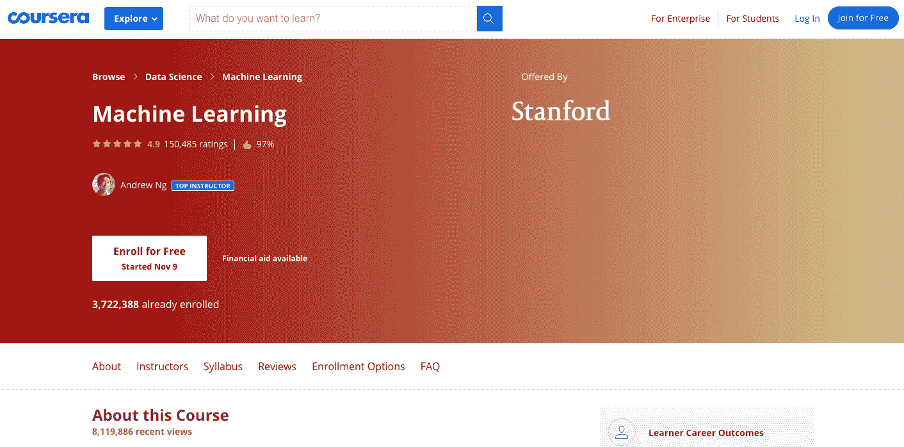
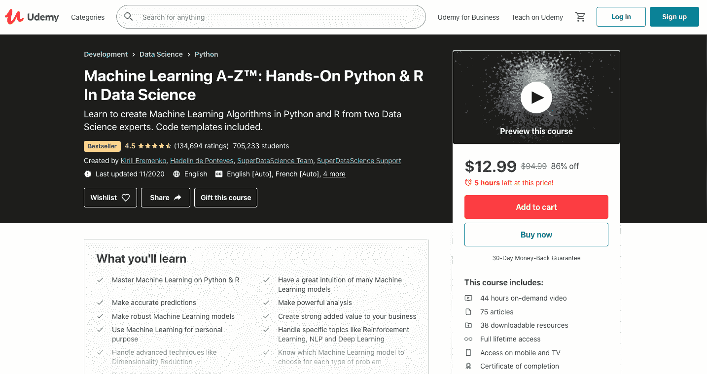
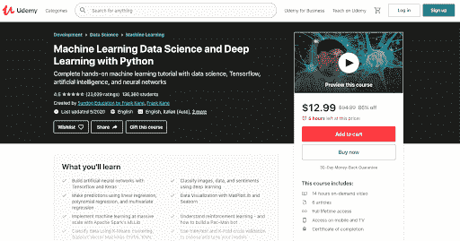
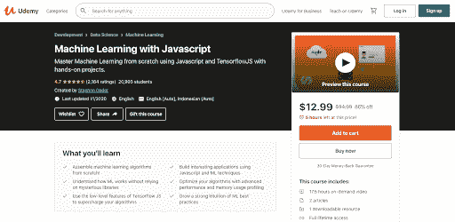
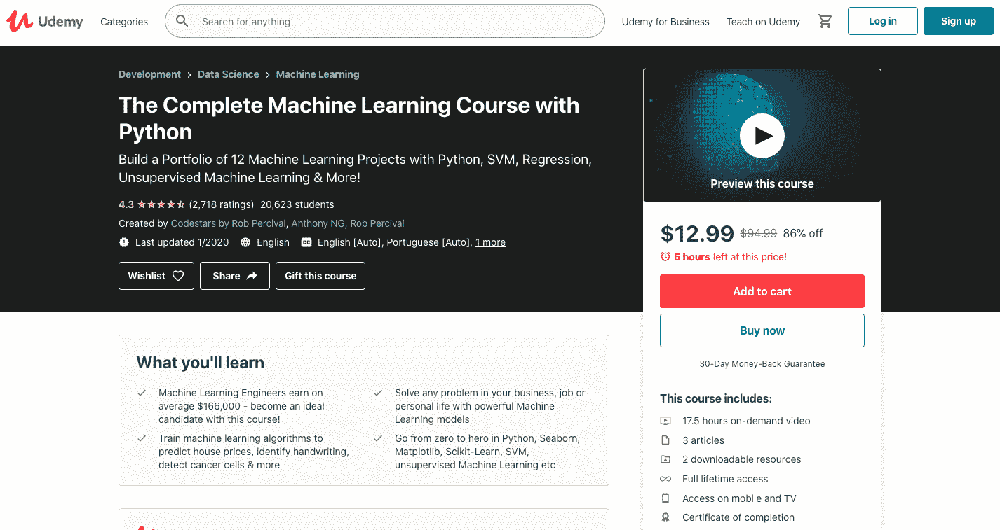
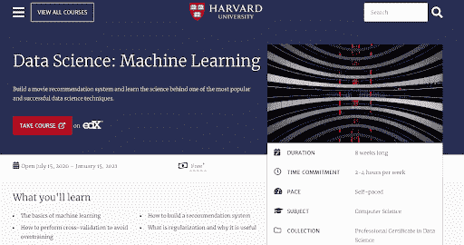
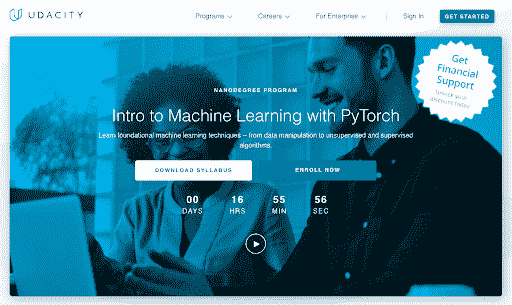
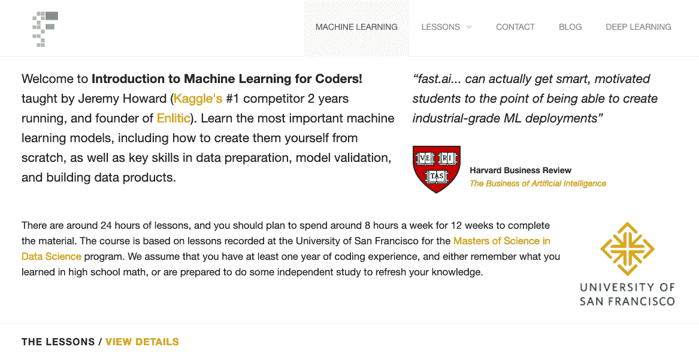
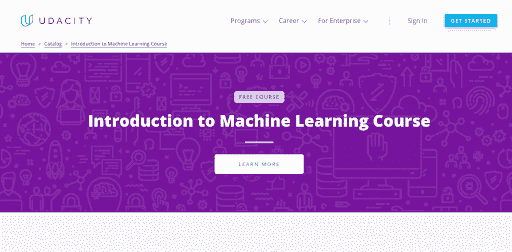

# 2023 年要学的 9 大机器学习课程[更新]

> 原文：<https://hackr.io/blog/machine-learning-courses>

像机器学习工程师和 NLP 科学家这样的专业人士是当今最有前途和最有趣的职业机会。在无数的应用和行业中，机器学习在让它们变得更加智能和高效方面发挥着重要作用。这个主题的重点是帮助有志之士学习机器学习算法的数学方面，以及它们在[编程语言](https://hackr.io/blog/best-programming-languages-to-learn)中的应用。

如果你有兴趣在这个领域建立自己的事业，可以考虑看看下面的列表。

## **10 门最佳机器学习课程**

以下是 10 个最好的机器学习课程。

 这个程序旨在使用最好的学习技术教授机器学习、支持向量机、内核、神经网络和相关概念。通过这个专业，你将学习人工智能和机器学习创新过程的技巧和技术。

涵盖的主要主题:

*   逻辑回归
*   人工神经网络
*   机器学习算法
*   医学信息学
*   数据库挖掘
*   统计模式识别
*   正规化
*   多元/一元线性回归

这门课程不仅限于为学生建立机器学习的基础；它还教给他们学习的理论基础。该课程还将教授你应用这些技术的实际知识。此外，你还可以接触到一些与该主题相关的硅谷创新最佳实践。

**先决条件:**机器学习或相关学科的背景知识不是强制性的。

**等级:**初级
**等级:** 4.9
**时长:** 54 小时(约)

你可以在这里 报名 [**。**](https://coursera.pxf.io/a19OPo)

 本课程是专家数据科学家的心血结晶，旨在帮助个人获得与主题相关的复杂算法和理论的深入知识。这是一个结构良好的学习计划，分为两个部分-数据处理和回归。最好的部分是，每个教程都旨在帮助学习者发展对机器学习的理解和技能。

这是一个有趣且令人兴奋的项目，学习以下主题:

*   数据预处理
*   回归
*   使聚集
*   关联规则学习
*   置信上限和汤普森抽样
*   自然语言处理
*   人工神经网络
*   降维
*   卷积神经网络
*   参数调整，
*   k 倍交叉验证
*   网格搜索等等。

为了方便学生，这门课程以现实生活中的例子和实践练习为特色。此外，您还将获得一些创建独特的机器学习模型的实践经验。学生们可以下载奖金、R 代码和 Python 模板，用于各种项目。

**先决条件:**不需要技术知识，除了高中水平的数学。
**等级:**初级
**等级:** 4.5 **时长:** 44 小时(大约)

你可以在这里 报名 [**。**](https://click.linksynergy.com/deeplink?id=jU79Zysihs4&mid=39197&murl=https://www.udemy.com/course/machinelearning/)

 该专业涵盖了与机器学习相关的所有主要课题，包括人工神经网络、K-Means 聚类等。此外，您将学习 Seaborn 和 MatPlotLib 的数据可视化技术，以及 MLLib Apache Spark 的大规模机器学习的实际实现。

本课程的主要主题包括:

*   使用 Keras 和 TensorFlow 的神经网络和深度学习
*   迁移学习
*   图像分类和识别
*   情感分析
*   多层次模型
*   回归分析
*   多次回归
*   随机森林和决策树
*   A/B 测试和实验设计
*   协同过滤
*   强化学习
*   支持向量机
*   特征工程
*   超参数调谐等等。

通过本课程，您还将学习使用深度学习概念对情感、图像和数据进行分类。对于打算转行的专业程序员和数据分析师来说，这是一个理想的学习计划。即使您是 Python 的新手，也可以选择这个专业，因为它提供了一个速成课程，可以更好地理解这个主题。

**先决条件:**

*   可以运行 Anaconda 3 等新版本的 Linux、Mac 或 Windows 电脑。
*   脚本或编程的经验是强制性的。
*   你应该精通高中水平的数学。

**等级:**中级
**等级:** 4.5 **时长:** 14 小时(大约)

你可以在这里 报名 [**。**](https://click.linksynergy.com/deeplink?id=jU79Zysihs4&mid=39197&murl=https://www.udemy.com/course/data-science-and-machine-learning-with-python-hands-on/)

 本机器学习课程专为 Javascript 开发人员设计，将带您深入了解高级内存剖析、构建 Tensorflow JS 库驱动的应用程序、编写 ML 代码以及其他与彻底理解该主题相关的主要主题。

此外，您还将学习创建与 Node JS 和 browser 兼容的程序。该计划还教导技巧和技术，加快与线性代数基础矩阵为基础的代码。

本课程的主要主题包括:

*   识别相关数据
*   记录观察数据
*   算法概述
*   张量拼接
*   张量流的应用
*   线性回归
*   矩阵乘法
*   提高性能的矢量化解决方案
*   用 Javascript 绘制 MSE 值
*   逻辑回归
*   随机和批量梯度下降

除此之外，您将学习根据用例改变算法。此外，本课程将让你接触到 Javascript 代码的性能增强技术和策略。最令人惊讶的是，即使你没有任何数学背景，你也可以去上这门课，因为讲座不涉及复杂的数学概念。

**先决条件:**

*   命令和终端线路使用的基本知识。
*   处理基本数学方程式的能力。

**等级:**中级
**等级:** 4.7 **时长:** 17.5 小时(约)

你可以在这里 报名 [**。**](https://click.linksynergy.com/deeplink?id=jU79Zysihs4&mid=39197&murl=https://www.udemy.com/course/machine-learning-with-javascript/)

 如果你正在寻找一门可以帮助你建立强大的机器学习基础的课程，那么用这个程序结束你的搜索吧。你将学会区分机器学习和经典编程、深度学习和机器学习。此外，您还将获得关于神经网络、张量运算和高级主题的知识，如验证、剔除、测试、正则化、欠拟合和过拟合。

该学习计划提供了对以下主题的详细了解:

*   使用 Scikit-Learn 进行线性回归
*   稳健回归
*   数据预处理
*   交叉验证
*   逻辑回归
*   混淆矩阵
*   支持向量机的概念
*   径向基函数
*   线性 SVM 分类
*   可视化边界
*   集成机器学习方法
*   梯度推进机
*   kNN 简介
*   降维概念
*   使聚集

你将对用于解决现实世界问题的机器学习工具有一个很好的理解。这是一个学习 ML 性能指标的完美课程，包括回忆、R 平方、混淆矩阵、MSE、预见、准确性等等。

**先决条件:**

**等级:**初级-中级
**等级:** 4.3 **时长:** 17.5 小时(约)

你可以在这里 报名 [**。**](https://click.linksynergy.com/deeplink?id=jU79Zysihs4&mid=39197&murl=https://www.udemy.com/course/machine-learning-course-with-python/)

 由哈佛大学提供，该专业旨在帮助有志之士学习机器学习以及与之相关的技术问题。与其他课程不同，该学习计划将帮助您更深入地挖掘 ML 的数据科学方法论。

以下是本课程的核心主题:

*   机器学习基础
*   主成分分析
*   机器学习算法
*   建筑推荐系统
*   正则化及其用途
*   交叉验证

该计划还提供培训数据的知识和使用数据集发现预测关系的有效方法。注册本课程后，您还将了解在各种产品中实现机器学习，如语音识别、邮政服务、垃圾邮件检测器等。

**先决条件:**无
**等级:** 初级 **等级:** 4.3**时长:** 8 周——每周 2-4 小时(约)

你可以在这里 报名 [**。**](https://online-learning.harvard.edu/course/data-science-machine-learning?delta=1)

uda city 提供的这个 Nanodegree 项目是增强您在监督模型、数据清理和机器学习算法方面的技能和知识的理想选择。此外，考生还可以探索其他重要的主题，如无监督和深度学习。该课程分为不同的步骤，每个步骤都为学习者提供实践经验，他们可以通过代码项目和练习来测试自己的技能。

本课程包括以下主题:

*   模型构建
*   神经网络设计
*   Pytorch 培训
*   无监督学习方法实现
*   深度学习

专业化提供处理真实项目的经验，候选人学习为顶级组织创建身临其境的内容。另外，你还将获得相关技术技能的专业学位。学员还将接受各种培训课程、面试准备、专业档案维护和其他职业发展的重要领域的指导。

**先决条件:**需要具备 Python 编程的基础知识。
**等级:** 中级(3 个月访问) **等级:** 4.3**持续时间** - 3 个月/每周 10 小时(大约)

你可以在这里 报名 [**。**](https://imp.i115008.net/rnG2Kd)

 本课程从零开始教授机器学习的机制，让学生彻底理解机器学习模型的理论和实际用法。

本课程涵盖以下主题:

*   对随机森林的介绍和深入了解。
*   模型验证过程的应用。
*   学习模型解释、树解释器、数据产品和梯度下降。
*   理解逻辑回归并使用它来解决各种复杂的问题。
*   完全理解和实施神经语言编程和列数据。

完成课程后，学生可以创建自己的机器学习模型用于商业目的，并应用实际知识推进他们的技术分析职业生涯。

先决条件:高中数学知识和实际编码经验。

**等级:**初级
**等级:** 4.3 **时长:** 24 小时

可以在这里 报名 [**。**](https://course18.fast.ai/ml)

 这个机器学习程序将帮助你掌握这门学科的核心领域，包括统计学和计算机科学，从而有效地利用预测能力。对于有抱负的数据科学家、数据分析师和其他希望在相关领域建立职业生涯的人来说，这是一门理想的课程。您将通过机器学习的视角了解数据调查过程的细节。

本课程旨在帮助考生学习以下概念:

*   朴素贝叶斯的使用
*   后验概率计算
*   支持向量机
*   使用 Python 编写决策树
*   选择一个[机器学习算法](https://hackr.io/blog/machine-learning-algorithms)
*   安然电子邮件数据集模式
*   回归和异常值
*   聚类和扩展

除了上述内容，您还将学习如何提取和识别有用的机器学习特征，以获得数据的最佳表示。该课程通过专业设计的教学大纲为考生提供了丰富的学习体验。此外，还有交互式测验，供学生测试他们在该学科的技能和知识。

**先决条件:**需要机器学习背景或相关经验。

**等级:**中级
**等级:** 4.5
**时长:** 10 周(约)

你可以在这里 报名 [**。**](https://imp.i115008.net/151WAD)

## **结论**

机器学习是一门有趣的学科，允许个人无限地试验他们的技能和知识。要在这个领域建立一个职业生涯，从获得 ML 和相关概念的完整知识开始。选择上面列出的任何专业开始您的旅程。这些机器学习课程不仅具有成本效益，还提供了随时随地学习的灵活性。

请回来与我们分享您的经验，并向社区的其他人建议您喜欢哪门课程，为什么？有其他课程推荐吗？下面评论！

**人也在读:**