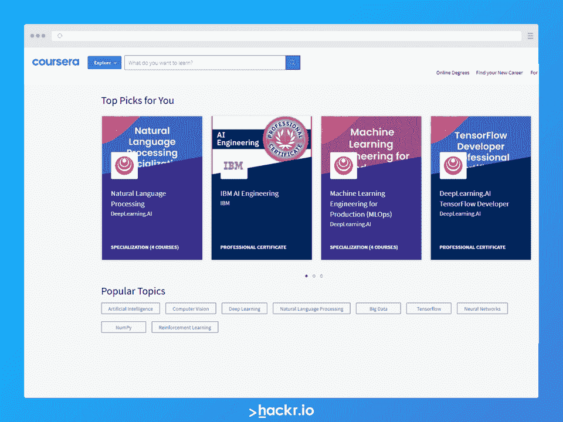

# 2023 年专家最佳机器学习框架(ML)

> 原文：<https://hackr.io/blog/machine-learning-frameworks>

随着[数字化](https://www.forbes.com/sites/jasonbloomberg/2018/04/29/digitization-digitalization-and-digital-transformation-confuse-them-at-your-peril/)在生活的几乎所有领域变得越来越重要，世界各地的企业正以疯狂的速度增加对它的投资也就不足为奇了。 [机器学习(ML)和人工智能(AI)](https://hackr.io/blog/ai-vs-machine-learning) 尤其是在组织的日常运营中见证了显著的采用率。

未来几年被设想为 **采用机器学习** 的转折点。这在一定程度上得益于目前已经开发出来的几个 **机器学习框架** 。正如我们将看到的，其中许多都很流行，这使得哪个是最好的机器学习框架成为一个具有挑战性的问题。

为您的企业选择合适的 ML 框架是一项艰巨的任务，了解最适合您的产品无疑是一项挑战。通过这篇文章，我们希望能够很好地掌握当今最流行的 **ML 框架** 。

但首先，让我们以一个简短的 **机器学习的破落** 和 2023 年的一些顶级机器学习框架开场。

## **什么是机器学习？**

机器学习，简称 ML，是计算科学的一个领域，处理大量数据中模式和结构的分析和解释。通过它，我们可以从数据集中推断出有洞察力的模式来支持商业决策——不需要或很少需要人机界面。

在机器学习中，我们将大量数据输入计算机算法，然后对其进行训练，分析它以找到模式，并生成数据驱动的决策和建议。如果在识别出的信息中存在任何错误或异常值，则该算法被构造为将该新信息作为输入，以改进其未来的输出，用于建议和决策制定。

简单地说，ML 是人工智能中的一个领域，它支持组织在持续的基础上分析数据、学习和适应，以帮助决策。另外值得注意的是 [深度学习](https://hackr.io/blog/machine-learning-vs-deep-learning) 是机器学习的子集。

## **什么是机器学习框架？**

一个简化的定义将机器学习框架描述为工具或库，允许开发人员更容易地构建 ML 模型或 [机器学习应用](https://hackr.io/blog/real-world-machine-learning-applications) ，而不必进入基础或核心算法的具体细节。它为机器学习开发提供了更多的端到端管道。

## **哪个框架最适合机器学习？**

没有一个“最佳 ML 框架”。您选择的框架将取决于您试图构建的应用程序的类型，以及您正在处理的数据。具体来说，您将考虑可伸缩性、数据处理和部署需求等因素。一旦你阅读了不同的 ML 框架，你会对这个问题有一个更好的答案。

## **tensor flow 是机器学习框架吗？**

是的， [TensorFlow](https://hackr.io/blog/pytorch-vs-tensorflow) 是一个 ML 框架，是由谷歌建立的。它非常受欢迎，并具有几个优点，包括广泛、灵活的功能，用于编程、分类、回归模型、神经网络的详尽库，包括为软件编写算法的套件。然而，这需要一些时间来完全掌握。

## **最佳机器学习框架**

有了这样的理解，让我们深入一些最流行的 ML 框架的细节。

**主要特性:**

*   基于 JavaScript
*   开源并拥有丰富的 API
*   可以通过脚本标签使用，也可以通过 npm 安装
*   在 CPU 和 GPU 上运行
*   非常受欢迎，有很多社区支持

TensorFlow 是一个开源的、 [JavaScript 库](https://hackr.io/blog/top-javascript-libraries) 和广泛使用的机器学习框架之一。作为开源软件，它是免费的，并为开发者提供 API 来构建和训练 ML 模型。

作为谷歌的产品，TensorFlow 功能多样，可以说是最好的机器学习框架之一。它提供了广泛、灵活的功能，一个用于编程、分类、回归模型、 [神经网络](https://hackr.io/blog/what-is-neural-networks) 的详尽库，包括一个为软件编写算法的套件。它也可以在 CPU 和 GPU 上运行。TensorFlow 的一个关键优势是它可以以两种方式使用:通过脚本标签或通过 NPM 安装。

TensorFlow 的一个缺点是对初学者不太友好。不过，有了好的 [TensorFlow 教程](https://hackr.io/tutorials/learn-tensorflow?q=tensorf?ref=blog-post) ，可以大大加速你的学习。

**相关文章:** [Pytorch vs Tensorflow](https://hackr.io/blog/pytorch-vs-tensorflow)

**主要特性:**

*   用 C++写的
*   开源和免费
*   用于设计算法和数据结构，尤其是在教育和研究领域
*   连接其他 ML 库，包括 LibLinear 和 LibSVM，以及其他几个库
*   兼容 R、Python、Java、MatLab、C+等语言

幕府将军是一个开源的机器学习框架，与 [C++](https://hackr.io/blog/what-is-cpp) 配合良好。对于希望专门为教育和研究领域的问题设计算法和数据结构的开发人员来说，它是免费且有用的。幕府将军还可以连接其他 ML 库，包括 LibLinear、LibSVM、SVMLight、LibOCAS 等等。

此外，幕府与其他语言和框架兼容，如 R、Python、Java、Octave、C#、Ruby、MatLab 和 Lua。这个机器学习框架的其他亮点是，它有助于实现隐马尔可夫模型，处理大量数据，是用户友好的，并提供了几个灵活的特性和功能。

**主要特性:**

*   与 Python 配合良好
*   数据挖掘和数据分析的顶层框架
*   开源和免费

Scikit-learn 专门支持 Python 的开发工作，它有一个广泛的库，用于 [Python 编程语言](https://hackr.io/blog/python-programming-language) 。许多用户认为它是数据挖掘和数据分析的最佳 ML 框架之一。Scikit-learn 为设计用于分类、聚类、预处理、回归、维度缩减和模型选择的算法和模型提供支持。

Scikit-learn 也是免费和开源的，对初学者友好，并附有详细的文档。此外，它允许开发者在使用或运行时改变算法的任何预设参数。该框架非常适合无监督和管理计算。

**主要特性:**

*   支持基于云的软件开发
*   适用于设计神经网络和自然语言处理
*   由 Meta 和 IBM 使用
*   适合设计计算图形
*   兼容 Numba 和 Cython

PyTorch 机器学习框架基于 Torch 和 Caffe2，提供了大量优化算法的选项。使用亲笔签名的模块和 [自然语言处理](https://hackr.io/blog/what-is-natural-language-processing) 非常适合设计神经网络。

PyTorch 是开源的，支持基于云的软件开发。它具有多种特性，包括库、工具和分布式培训。对于用户界面开发，它支持 Lua。Pytorch 被 Meta 和 IBM 使用。适合设计计算图形，其前端开发是混合的，这有助于多方面的可用性。该平台旨在与 Python 集成，并与 Numba 和 Cython 等库兼容。

**主要特性:**

*   写成了[c++](https://hackr.io/blog/cpp-course)
*   适用于大规模、多维或稀疏数据集
*   支持 Python 和 BrainScript

微软拥有的 CNTK 用于以有向图的形式将神经网络描述为一系列计算开发步骤。它是一个开源的 ML 框架，使用 C++编程语言和产品阅读器中的算法设计。对于来自 C++、Python 和 BrainScript 的大规模、多维或稀疏数据集，CNTK 是理想的选择。它允许开发人员合并和查看各种 ML 模型类型，其中包括递归网络、前馈深度神经网络和 [卷积神经网络](https://hackr.io/blog/convolutional-neural-network) 。

**主要特性:**

*   被亚马逊用于[AWS](https://hackr.io/blog/cpp-course)
*   支持多种语言，包括 Python、JavaScript、Julia、C++、Scala 和 Perl
*   微软、英特尔、百度也支持 Apache MXNet
*   也被华盛顿大学和麻省理工学院使用

Apache MXNet 被亚马逊采用为其基础机器学习工具 [AWS](https://hackr.io/tutorials/learn-amazon-web-services-aws) 。它通过一个参数服务器分布在云基础设施上，并且可以跨多个 GPU 和服务器进行扩展。

MXNet 支持多种语言 API，包括 Python、JavaScript、Julia、C++、Scala 和 Perl。一些 IT 公司支持 Apache MXNet，包括微软、英特尔和百度。领先的研究和教育机构，如华盛顿大学和麻省理工学院，也广泛使用 Apache MXNet。

**主要特性:**

*   为决策支持系统流程开发
*   在医疗保健行业的风险和欺诈倾向分析、保险客户分析和患者分析中普遍存在
*   H2O-3 兼容 Java、JSON、R、Python、Scala 和流笔记本/web 接口
*   与 Hadoop 和 Spark 集成

H2O 是一个开源的 ML 框架，旨在满足组织决策支持系统流程的需求。H2O 广泛应用于风险和欺诈倾向分析、保险客户分析、医疗保健领域的患者分析、广告支出和投资回报以及客户智能。

H2O 经历了三次修订，目前的版本是 H2O-3。这是一个为分布式、可伸缩的 ML 设计的内存平台。

H2O-3 兼容 Java、JSON、R、Python、Scala 等接口，以及 Flow notebook/web 接口。它还与 Hadoop 和 Spark 等大数据技术无缝集成。H2O-3 提供了许多流行算法的实现，如 GBM、随机森林、深度神经网络、Word2Vec 和堆叠集成。

H2O-3 是高度通用和可扩展的，开发者可以附加数据转换和添加他们偏好的定制算法，同时可以访问所有客户端系统。简而言之，数据收集相当容易，但决策却很难。H2O-3 正是为了这一点，它使通过更快更准确的预测模型从海量数据中获得洞察力变得快速而容易。

**主要特性:**

*   为 macOS、iOS 和 TVOS 应用开发
*   初学者友好型
*   支持 CPU 和 GPU

Core ML 主要是为 macOS、iOS 和 TVOS 应用开发的，对初学者非常友好，包括毕业生和自学的开发人员。

Core ML 非常全面，提供了大量功能，如图像分类、句子分类、自然语言处理、条形码检测、游戏套件和对象跟踪。凭借其独特的低级技术堆栈，它可以通过利用 CPU 和 GPU 来提供出色的性能。考虑到安全性和易用性，Core ML 即使在离线模式下也能确保用户隐私和应用功能。

[Python 开发者机器学习入门](https://click.linksynergy.com/link?id=jU79Zysihs4&offerid=1045023.2092098&type=2&murl=https%3A%2F%2Fwww.udemy.com%2Fcourse%2Fmachine-learning-intro-for-python-developers%2F)

## **底线**

正如我们已经看到的，您对机器学习框架的偏好和选择取决于该框架将运行的特定算法和其他一般要求。

今天，任何有互联网连接的人都可以通过亚马逊、谷歌和微软等公司提供的云服务使用机器学习框架和工具。此外，在线 [机器学习课程](https://hackr.io/blog/machine-learning-courses) 让任何人都有可能构建复杂的 ML 应用程序，事实上许多人已经这样做了。

随着[机器学习](https://hackr.io/blog/machine-learning-courses)的使用越来越多，组织和企业现在都在 ML 中创建 Coe，以加速该技术的采用和适应。很快，ML 将变得无处不在，它将触及这个星球上的几乎每一个行业。

## 想获得机器学习方面的认证？

机器学习课程专注于创建系统，以利用大型数据集并从中学习。课程包括预测算法，自然语言处理和统计模式识别。

**相关阅读:**