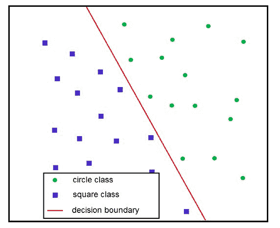
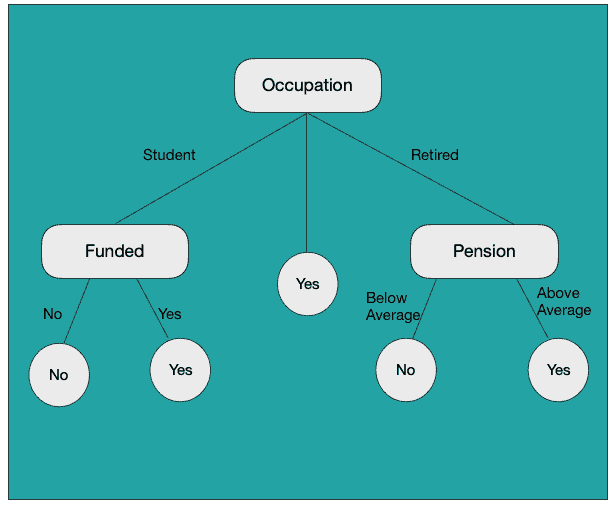

# 热门机器学习面试问答[更新]

> 原文：<https://hackr.io/blog/machine-learning-interview-questions>

听到面试的消息总是让我们紧张不安。但是我们都很清楚，整个过程是值得忍受的，因为你可能最终会得到你梦想的工作。一个机器学习面试问题也不例外；事实上，它是当今需求量最大的热门职位之一。这需要大量的准备和毅力。

如果你想做好一切准备，你可能会陷入巨大的困惑之中。你需要做的是专注于那些能阐明你所有核心概念的主要话题。这些**机器学习面试问题**将帮助你破解即将到来的面试。

## 热门机器学习面试问答

下面就让我们深入研究一下**顶级机器学习面试问答**:

#### **问题:什么是机器学习？和人工智能有什么不同？**

**答案:**机器学习是一个机器可以从它的实验中表现出来的过程。数据集被输入到能够从数据集学习的程序中。然后在输出中，它知道如何识别符合数据集的内容，即使程序中的机器以前从未见过这个例子。ML 致力于模式识别；另一方面，人工智能展示了智能的概念，并训练一个系统对任何人脑的行为做出反应。

#### **问题:定义机器学习中建立模型的三个阶段。**

**答案:**在 ML 中建立模型的三个阶段是:

为模型选择合适的算法，并根据需要对其进行训练。

通过数据集测试来检查数据的准确性

在测试后进行必要的更改，并将最终模型用于实时项目

#### **问题:举例说明参数化模型？它们与非参数模型有何不同。**

**答案:**参数个数有限的模型就是参数模型。我们需要知道模型的参数来预测新数据，例如，线性回归、逻辑回归和线性支持向量机。

具有无限数量参数的模型是非参数模型，具有更大的灵活性。我们需要知道模型的参数和观察到的数据的状态，以预测新数据—例如，决策树、k-最近邻和使用潜在狄利克雷分析的主题模型。

#### **问题:区分 I 型和 II 型错误。**

**答案:**

*   **I 型错误:**拒绝正确的零假设，是严重错误，也叫假阳性。犯这个错误的概率就是显著性水平。它声称某件事情已经发生，而它并没有发生。
*   **第二类错误:**接受一个错误的零假设。犯这个错误的概率主要取决于样本大小和总体方差。如果主题由于硬采样或高可变性而难以测试，则更有可能出现此错误。拒绝虚假零假设的概率是 1，即检验的幂。它声称什么都没发生，而事情却发生了。

#### **问题:机器学习有哪些类型？区分它们。**

**答案:**

| **监督学习** | **无监督学习** | **强化学习** | 定义 |
| 被标注数据所教。 | 使用未标记的数据，在没有任何指导的情况下教授。 | 它是通过与周围环境的互动来自学的。 | 问题的类型 |
| 回归和分类 | 关联和聚类 | 基于奖励的 | 数据类型 |
| 标记数据 | 未标记数据 | 没有预定义的数据 | 培养 |
| 涉及外部监管。 | 不涉及监督 | 不涉及监督 | 方法 |
| 将带标签的输入映射到输出。 | 通过理解模式发现输出。 | 发现输出的试错法。 | 流行算法 |
| 线性回归，KNN | k 均值，C 均值 | q 学习 | 你可以在这里阅读关于监督和非监督学习的详细内容。 |

**问题:解释一般化、过度拟合和欠拟合**

#### **答案:**

**一般化**

模型是在数据集上构建和训练的，因此它可以对看不见的数据做出准确的预测。如果经过训练的模型能够做出这些准确的预测，我们可以说该模型从训练集推广到了测试集。

**过度装配**

当一个模型与训练集的特性过于接近，并获得一个在训练集上工作良好但不能推广到新数据的模型时，这就是过度拟合的情况。简而言之，该模型在训练时被赋予了许多特征，以至于它变得混乱并给出错误的分析输出。

**营养不良**

当模型过于简单，无法涵盖数据的所有方面和可变性时，该模型在训练集上的表现可能会很差。这种选择过于简单的模式是不合适的。

**问题:什么是归纳机器学习？**

#### **答案:**

归纳机器学习涉及通过实例学习的过程，其中系统试图从一组观察到的实例中归纳出一般规则。

归纳机器学习是一个归纳步骤，在这个步骤中，你从给定的数据集中学习一个模型。

**回答:**一些工具是:

绘图处理器

*   矩阵实验室
*   地图缩小
*   火花
*   Graphlab
*   吉拉夫
*   沃帕尔
*   **问题:因果关系和相关性的区别是什么？举例说明。**

#### **答:**因果关系是两个变量之间的关系，使得另一个变量的出现导致其中一个变量的出现。

相关性是两个变量之间的关系，这两个变量彼此相关，但不是由彼此引起的。

例如，通货膨胀导致汽油和食品的价格波动，因此通货膨胀与这两者都有因果关系。汽油和食品杂货之间存在相关性，它们都可以因通胀的变化而增加或减少，但它们都不会引起或影响另一个。

**问题:定义抽样。我们为什么需要它？**

#### **答:**抽样是从目标人群中选择一个子集作为其代表的过程。我们使用样本中的数据来了解整个社区的模式。抽样是必要的，因为我们通常无法在合理的时间内收集或处理完整的数据。可以用几种技术进行采样；其中一些是随机抽样、分层抽样和整群抽样。

**问题:说明分类和回归的区别**

#### **答案:**分类是一种监督学习技术，其输出标签是离散的或分类的。另一方面，回归是一种监督学习技术，用于预测连续或实值变量。

例如，预测股票价格是一个回归问题，因为股票价格是一个可以取实值的连续变量，而预测电子邮件是否是垃圾邮件是一个分类问题，因为在这种情况下，值是离散的，只有两个可能的好处是，或不是

**问题:什么是分层抽样？**

#### **答:**分层抽样是一种概率抽样技术，其中整个人口被分成不同的称为阶层的子群，然后从每一层按比例抽取一个概率样本。例如，在二元分类的情况下，如果阳性和阴性标记数据的比例为 9:1，那么在分层采样中，您将从每个阳性和阴性标记数据集中随机选择子样本，以便在采样后该比例保持为 9:1。

**问题:定义置信区间**

#### **答:**这是一个区间估计，很可能包含一个未知的总体参数，估计范围是从给定的样本数据集计算出来的。这是您确定变量的真实值所在的值的范围。

**问题:定义条件概率。**

#### **答案:**条件概率是在给定一个事件已经发生的情况下，对一个事件发生的可能性的度量。让我们考虑两个事件，给定 A 和 B，那么 A 的条件概率，给定 B 已经发生，被提供为:

其中代表十字路口。所以，条件概率是两个事件的联合概率除以事件 b 的概率。

**问题:解释什么是贝叶斯定理，为什么有用？**

#### **答案:**该定理用于描述一个事件发生的概率，是基于与之相关的其他事件的先验知识。例如，一个人患某种疾病的概率可以从所显示的症状中找到。

贝叶斯定理在数学上表述为:

其中 A 和 B 是事件，P(B) ≠ 0。大部分的类型我们想求 P(A|B)，但是我们知道 P(B|A)，所以我们可以用贝叶斯定理来求缺失值。

**答案:**真阳性率和回忆率一样，也叫敏感度。计算它们的公式是:

其中 TP =真阳性，FN =假阴性。

**问题:什么是概率图形模型？**

#### **答:**概率图模型是一个健壮的框架，它表示图结构中随机变量之间的条件依赖关系。它可用于模拟大量相互间具有复杂相互作用的随机变量。

**问题:图形模型的两种表示是什么？区分它们。**

#### **回答:**分布的图形表示的两个分支是马尔可夫网络和[贝叶斯网络](https://hackr.io/blog/top-steps-to-learn-naive-bayes-algorithm)。两者的不同之处在于它们可以编码的独立性集合。

**贝叶斯网络:**当模型结构是有向无环图(DAG)时，模型表示所有随机变量的联合概率的因式分解。贝叶斯网络捕捉随机变量之间的条件独立性，并减少估计联合概率分布所需的参数数量。

1.  **马尔可夫网络:**当模型的底层结构在一个无向图中时使用它们。它们遵循马尔可夫过程，即给定当前状态，未来状态将独立于过去状态。马尔可夫网络表示节点序列的分布。
2.  **问题:k-最近邻(k-NN)算法和 k-Means 算法有什么不同？**

#### **答案:**

这些算法之间的根本区别在于，k-NN 是监督算法，而 k-Means 是无监督算法。

1.  k-NN 是一种[分类算法](https://hackr.io/blog/classification-algorithm)，k-Means 是一种聚类算法。
2.  k-NN 尝试对其“k”周围邻居的观察值进行分类。它也被认为是一个懒惰的学习者，因为它在训练阶段什么也不做。另一方面，k-Means 算法将训练数据集划分到不同的聚类中，使得所有数据点来自其他聚类。该算法试图在聚类之间保持足够的可分性。
3.  问题:KNN 和 k 均值聚类有什么不同？

#### **答案:**

kn

| **k 均值聚类** | 用于分类的监督学习算法。 |
| 用于聚类的无监督方法。 | 数据被标记用于训练。 |
| 没有标记数据，机器自己训练。 | “k”指的是目标标签的最近邻居的数量。 |
| k 指的是在算法开始时设置的聚类数 | 当算法给出最高可能的精度时，算法停止。 |
| 当不再有集群从一个移动到另一个时，该算法被认为是完整的。 | 我们可以使用混淆矩阵和交叉验证来优化算法。 |
| 可以使用剪影和弯头方法进行优化。 |   |

**问题:定义 f 检验。你会在哪里使用它？**

#### **答:**f 检验是指在零假设下检验统计量遵循 f 分布的任何统计假设检验。如果有两个适合数据集的模型，可以使用 f 检验来确定最适合样本总体的模型。

**问题:什么是卡方检验？**

#### **答:**卡方检验是在零假设下，检验统计量遵循卡方分布(标准正态离差平方和的分布)的任何统计假设检验。如果变量是独立的，它衡量观察到的数据分布与预期分布的吻合程度。

**问题:什么是 p 值？为什么重要？**

#### **答案:**p 值表示进行最小统计检验时的边际显著性水平。它提供了可以拒绝零假设的最小重要性水平。小的 p 值(一般是< = 0.05)意味着有强有力的证据反对零假设，因此，你可以拒绝零假设。显著的 p 值(> 0.05)表示反对零假设的证据很弱，因此不能拒绝零假设。p 值越小，可以拒绝零假设的显著性越高。

问题:解释 ROC 曲线是如何工作的。

#### **答:** ROC 曲线或受试者工作特征曲线是一个分类模型对于所有分类阈值的性能的图形化表示。该图显示了两个参数，即不同分类阈值下的真阳性率(TPR)和假阳性率(FPR)。典型的 ROC 曲线如下:

其中纵轴是 TPR，横轴是 FPR。降低阈值会将更多的项目分类为阳性，从而增加 TP 和 FP。为了计算 ROC，我们使用一种称为 AUC(曲线下面积)的排序算法，它测量曲线下的整个二维面积。

**问题:定义精度和召回率。**

#### **答案:**精度和召回率是用来评价一个分类算法性能的度量。在一个完美的分类器中，精确度和召回率等于 1。精度是相关实例在检索实例中的比例，而召回率是相关实例中检索实例的比例。

精度=真阳性/(真阳性+假阳性)

回忆=真阳性/(真阳性+假阴性)

**问:L1 和 L2 正规化有什么区别？**

#### **回答:**L1 和 L2 正则化都是为了避免过拟合。L1 试图计算中间值，而 L2 计算同样数据的平均值。L1 也称为拉索和 L2，岭正则化技术。

在 L1 正则化中，不重要的特征被消除，从而仅选择最相关的特征。在 L2，损失函数试图通过从数据分布的平均值中减去损失来最小化损失。

**问题:机器学习模型中的‘训练集’和‘测试集’有什么区别？**

#### **回答:**每当我们获得一个数据集时，我们都会将数据分成两组——训练和测试。通常，70-80%的数据用于训练，其余用于测试。训练数据集用于创建或构建模型。测试数据集用于评估和查找模型的准确性。

问:如何处理数据集中丢失或损坏的数据？

#### **回答:**有很多方法可以做到这一点:

移除或删除缺少的行或列。

*   用另一个值替换它们。
*   如果发现趋势/模式，给他们分配一个新的类别。
*   **问题:有监督的机器学习在现代商业中有哪些应用？**

#### **答案:**监督学习有很多实际应用:

图像分类

*   推荐系统
*   动态定价
*   客户细分
*   识别最有价值的客户(客户终身价值建模)
*   **问题:什么是半监督机器学习？**

#### **答案:**半监督学习是一种混合了监督和非监督学习机制的方法。它将少量已标记的数据与大量未标记的数据结合起来，输入系统进行训练。语音识别是半监督学习的一个很好的例子。当您没有足够的数据时，这种类型的 ML 方法会有所帮助，并且可以使用该技术来增加训练数据的大小。

**问题:什么是无监督机器学习技术？**

#### **答案:**无监督学习方法在我们没有带标签的数据，即只有输入已知，输出未知的情况下使用。使用未标记的训练数据集来识别和建模模式、趋势和底层结构。无监督的学习方法更加准确和可预测。最流行的算法是聚类分析，用于探索性数据分析(EDA)以获得模式、分组和趋势。

问题:什么是 F1 成绩？

#### **答案:**F1 得分是模型精度的衡量标准。它是模型精度和召回率的加权平均值。结果介于 0 和 1 之间，0 为最差模型，1 为最佳模型。F1 值广泛应用于信息检索和自然语言处理领域。

**问题:什么是贝叶斯分类器？**

#### **回答:**贝叶斯分类器是一种概率模型，它试图最小化训练数据集中的错误分类概率，计算给定类标签的特征值的概率，并使用测试数据集中的此信息，通过使用贝叶斯规则来预测给定特征值的类。

问题:在朴素贝叶斯定理的背景下解释先验概率、似然性和边际似然性。

#### **答案:**先验概率是数据集的因变量(二元)的比例。这是你能对这个职业做出的最接近的猜测，没有任何进一步的信息。例如，考虑一个包含因变量 binary、spam 或 not spam 的数据集。垃圾邮件占比 75%，非垃圾邮件占比 25%。因此，可以估计的机会，新的电子邮件是垃圾邮件是 75%。

似然性是在存在其他变量的情况下，将给定的观察分类为准确的概率。例如，单词“CASH”在垃圾消息中使用的概率是一种可能性。

边际可能性是任何信息中使用“现金”一词的概率。

**问题:混淆矩阵是什么？解释一下 2 类问题**

#### **答:**混淆矩阵描述模型在已知有效值的测试数据集上的性能的表格布局。对于二进制或二类分类，其可以取两个值，0 或假和 1 或实，混淆矩阵可以绘制为:

预测值 0

| 预测值 1 | 实际值 0 | 实际负值(TN) |
| 假阳性 | 实际值 1 | 假阴性(FN) |
| 真阳性(TP) | **问题:如何根据训练集的大小选择分类器？** | **答案:**如果训练集很小，高偏差/低方差模型，如朴素贝叶斯，往往表现更好，因为它们不太可能过度拟合。另一方面，如果训练集很大，则低偏差/高方差模型(如逻辑回归)往往表现更好，因为它们可以反映更复杂的关系。 |

#### **问题:术语决策边界是什么意思？**

**答案:**决策边界或决策曲面是将底层特征空间划分为两个子空间的超曲面，每个子空间对应一个类。如果决策边界是一个超平面，那么这些类是线性可分的。

#### 

在上图中，红线是分隔绿色圆形实例和蓝色方形实例的决策边界。

**问题:定义熵？**

**答案:**熵是与随机变量 y 相关的不确定性的度量，它是传达变量的值所需的预期比特数。

#### 

其中 P(y)是 Y 具有值 Y 的概率，关于决策树，熵用于寻找在任何节点的最佳特征分裂。

**问题:什么是决策树？**

**答:**决策树采用树状结构，作为预测模块，明确表示决策和决策制定。决策树的每个内部节点都是一个特征，来自该节点的每个正在进行的边都表示该函数可以取的值。

#### 在某些特征的情况下，输出边的数量是该类别中不同值的数量。在数字特征的情况下，输出边的数量通常是两个，一个是小于实数值的特征值，另一个是更高的。

在下图中，我们有一个二进制输出变量，其值为“是”或“否”,某些特征为“职业”、“基金”和“养老金”。职业是本质特征，基于它的好处，决策树特征分支，最后预测输出。

**问题:你对信息增益的理解是什么？**

**答:**信息用于识别分割给定训练数据集的最佳特征。它选择最大程度地减少训练集 d 的输出 Y 的条件熵的分裂 S。简而言之，信息增益是在对特征进行分裂时熵 H 从先前状态到新状态的变化:

我们计算所有特征的信息增益，并选择具有最高增益的特征作为所有特征中最重要的特征。

问题:什么是修剪，为什么它很重要？

**答:**剪枝是一种通过从中移除子树来降低最终分类器复杂度的技术，子树的存在并不影响模型的准确性。在修剪中，你生长出完整的树，然后反复修剪掉一些节点，直到进一步修剪是有害的。这是通过评估修剪每个节点对优化数据集准确性的影响，并贪婪地删除最能提高优化数据集准确性的节点来实现的。

#### 修剪决策树的一种简单方法是对到达一个叶子的训练样本的数量施加最小值。修剪使树保持简单，而不影响整体的准确性。它通过减小树的大小和复杂性来帮助解决过拟合问题。

**问题:给我介绍一下 k-最近邻算法**

**回答:** k-NN 是一种懒惰学习算法，这意味着它在训练时不做任何事情。以下是测试时执行的步骤。对于任何新的测试示例，k-NN

#### 首先计算它与训练数据集中所有示例的距离。

然后选择具有最低范围的 k 个训练样本

1.  并通过从选定的训练样本中选择最常出现的标签(在分类的情况下)或通过计算它们(在回归的情况下)来预测测试样本的输出标签
2.  **问题:k 的值如何随偏倚和方差变化？**
3.  **回答:**k 的显著值意味着模型更简单，因为它将采用大量训练样本的平均值。因此，方差会随着 k 值的增加而减小，更简单的模型意味着拟合不足，导致高偏差。相反，小 k 值意味着测试示例仅依赖于少量的训练示例，因此，它将导致高方差和低偏差。

#### 问题:如果数据集中有噪声，你将如何改变 k？

**回答:**我们应该增加 k 来处理任何噪声。相当大的 k 值会消除或抵消给定数据集中的任何噪声或异常值。

#### **问题:如何加快模型的分类/预测时间？**

**回答:**k-NN 的计算时间提升有两种方式。

#### **已编辑的最近邻:**不是保留所有的训练实例，而是选择它们中仍能提供准确分类的子集。使用向前选择或向后排除来选择实例的子集，它总是可以代表其他实例。

**K 维树:**它是一种智能数据结构，用于执行最近邻和范围搜索。k-d 树类似于决策树，只是每个内部节点存储一个数据实例，并根据具有高方差的特征的中值进行分割。

1.  **问题:定义逻辑回归**
2.  **回答:** Logistic 回归是用于分析数据集的统计方法，其中一个或多个独立数据变量确定可能仅具有有限数量值的结果，即响应变量是分类的。当响应变量为二元时，Logistic 回归是分类问题的首选方法。

#### **问题:如何训练一个 Logistic 回归模型？**

**答:**我们使用逻辑函数来训练逻辑回归模型。给定输入数据 x、权重向量 w(自变量 x 的系数)和输出标签 y，P(y)的概率，逻辑函数计算如下:

#### 

如果 P(y) > 0.5，我们预测输出为 1，否则为 0。然后基于训练实例中的预测误差，通过在每次迭代中更新权重来重复整个过程。一旦我们达到了足够好的精度或者完成了所有的迭代器，这个过程就停止了，最终的权重被用作预测测试实例结果的值。

**问题:Logistic 回归中的链接函数是什么？**

**答:**连接函数提供了响应变量的期望值和线性预测值之间的关系。逻辑回归使用 Logit 作为其链接函数，这是等式中的术语 **wx** 。

#### 问题:确定一个机器学习工程师最重要的资质？

**答案:**机器学习允许计算机在没有明确编程的情况下进行自我学习。它帮助系统从经验中学习，然后从错误中改进。基于机器学习的智能系统可以从记录的数据和过去的事件中学习。深入了解统计、概率、[数据建模](https://hackr.io/blog/what-is-data-modeling)、[编程语言](https://hackr.io/blog/what-is-programming-language)，以及 cs、 [ML 库](https://hackr.io/blog/best-machine-learning-libraries)和算法的应用、软件设计是[成为一名成功的机器学习工程师](https://hackr.io/blog/how-to-become-a-machine-learning-engineer)所需要的。

#### **问题:指出机器学习的首要意图？**

**答案:**机器学习的顶级意图陈述如下，

#### 该系统从已经建立的计算中获得信息，以给出有根据的决策和输出。

它在数据中找到特定的模式，然后对其进行特定的预测，以提供问题的答案。

*   **问题:谁被认为是机器学习的发明者？**
*   **答案:**亚瑟·塞缪尔(Arthur Samuel)被誉为机器学习的发明者。他与 IBM 合作，开发了一个玩跳棋的计算机程序。这个程序是在 20 世纪 50 年代早期开发的，由于计算机中可用的存储容量低，所以得到了 Alpha-beta 剪枝方法的支持。因此，开发了第一个机器学习，其中机器本身应用棋盘上棋子的位置，并提供计分功能。

**问题:讨论机器学习的优势？**

**答案:**机器学习是一个传统的概念，但由于其众多的优势，它最近获得了动力。机器学习的一些显著优点如下:

#### **毫不费力地识别趋势和模式:**机器学习可以轻松地遍历海量数据，识别出某些人类无法知晓的模式和趋势。

**不需要人工参与:**机器学习包括赋予机器自主学习和改进预测和算法的能力。

*   **不断改进:**当机器学习处理的数据量增加时，它会表现出提高其准确性和效率的品质。
*   **广泛的应用:**机器学习服务于各种用户，可以为客户提供更多定制化的体验，也可以瞄准正确的客户群。
*   **问题:机器学习有哪些缺点？**
*   答案:虽然机器学习有很多优点，但它并不是完美无缺的。机器学习有一些限制，如下所示:

**数据采集:**机器学习需要海量的数据来操作，数据要求不偏不倚，质量好。

**结果解释:**有时，可能会出现与算法相关的结果的绝对解释相关的问题。因此，为了这个目的，必须非常仔细地选择算法。

*   **高水平的错误敏感性:**由于该技术的自主、独立性质，在机器学习接口的场景中可能发生错误。
*   **问题:列出偏倚和方差的区别？**
*   **回答:**偏差是一种错误，因为要使用的学习算法中的假设不正确或过于简单。这会导致模型不适合数据，这导致难以具有高预测准确性，并且它将知识从训练集推广到测试集。

#### 而方差是由于正在使用的学习算法的高难度而出现的一种错误。这导致算法对训练数据中的高度变化非常敏感，这可能导致模型过度拟合数据。

**问题:从深度学习这个术语中理解什么？**

**答案:**深度学习是人工智能中机器学习的一个细分领域，与神经网络有关。它具有从无标记或非结构化数据中进行无监督学习的网络能力。它也被称为深度神经网络或深度神经学习。它包括受人脑启发的算法，人脑从大量数据中学习。它有助于引导计算机从人类身上自然看到的东西中学习经验。

#### **问题:F1 的分数有什么用途？**

**答案:** F1 是判断模型准确性的行列式。该模型以 0 和 1 的形式显示结果，其中 0 表示最差的模型，1 表示最好的模型。该模型通常用于自然语言处理和信息检索方面。F1 广泛用于机器学习，它不考虑真正的负面因素。它通常用于分类测试，其中真正的否定没有任何主要作用。

#### **问题:突出生成模型和判别模型的区别？**

**答:**生成模型的目的是从相同的分布和新的数据实例中生成新的样本，而判别模型强调不同种类的数据实例之间的差异。它尝试直接从数据中学习，然后对数据进行分类。

#### 结论

我希望这些最基本的机器学习面试问题能帮助你通过面试。这次面试既令人生畏又让人不知所措，因此我们为您带来了上述问题的详细解释，以帮助您更好地准备和成功地应对面试。

## 更多 ML 面试问题？这里有一个很棒的课程，可以帮助你全面准备即将到来的 ML 面试:[机器学习技术面试](https://click.linksynergy.com/deeplink?id=jU79Zysihs4&mid=39197&murl=https://www.udemy.com/course/mlcg-technical-interview/)。

顶级统计学面试问题准备，可以考虑这本书:[数据科学家实用统计学:50 个必备概念第 1 版](https://geni.us/lxsS)。

你有任何进一步的重要提示分享或任何其他常见问题吗？

在下面评论你的想法！！

**人也在读:**

Comment your thoughts below!!

**People are also reading:**