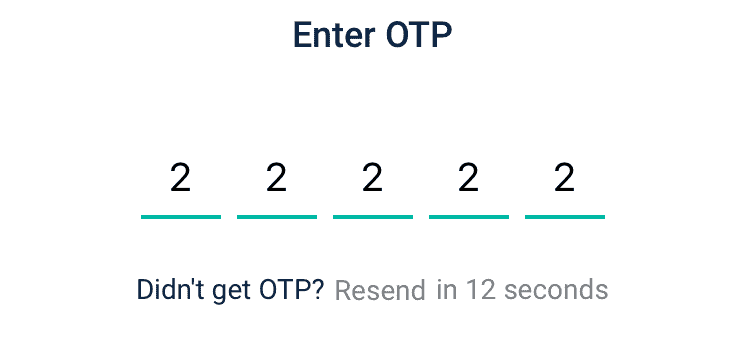
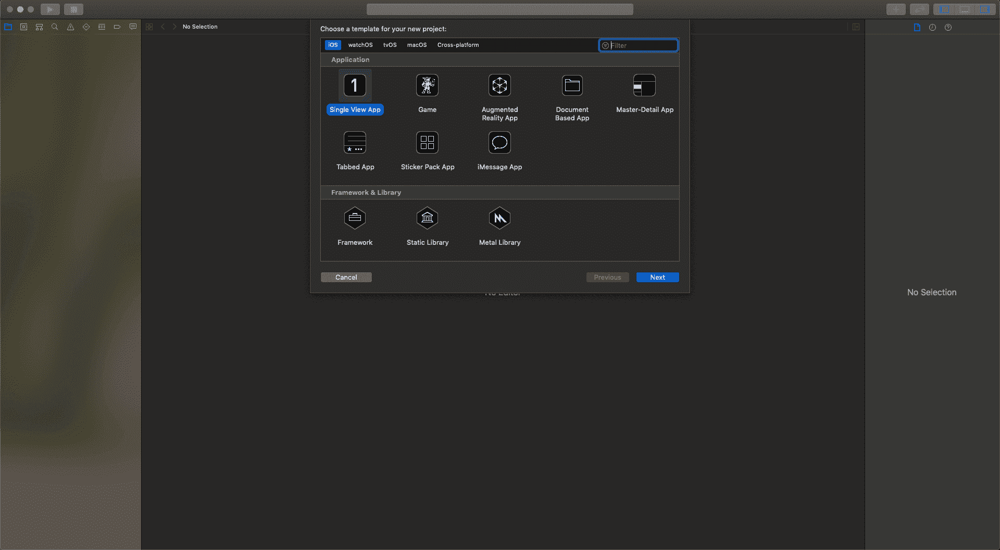
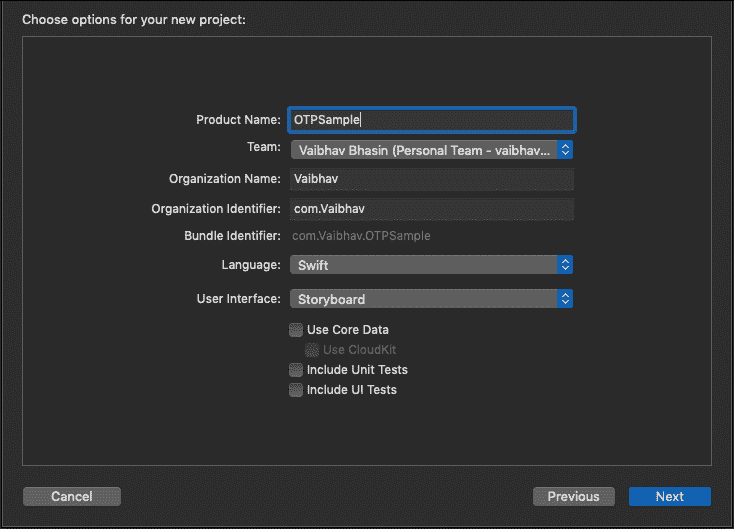
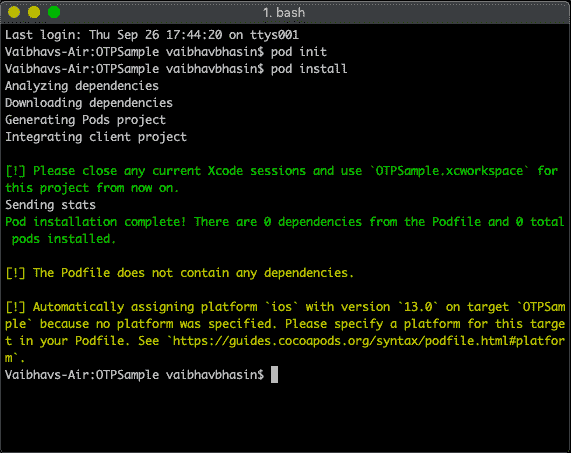
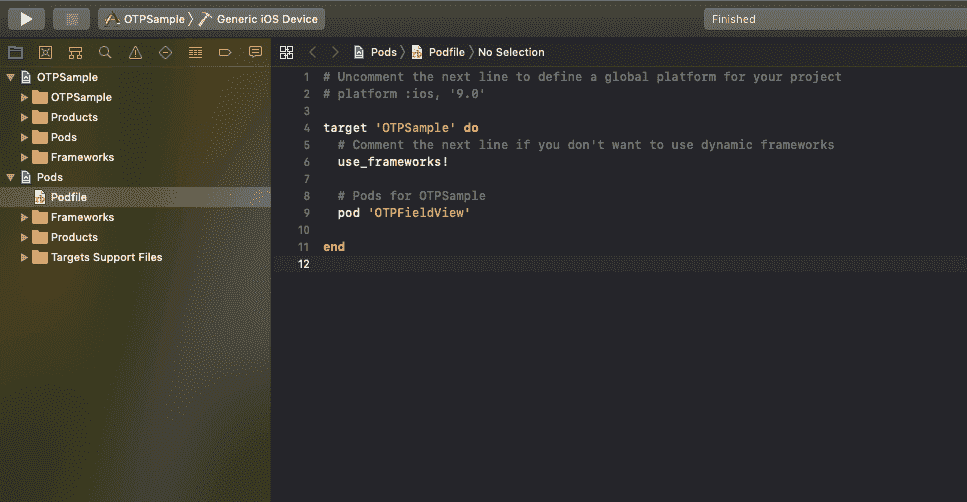
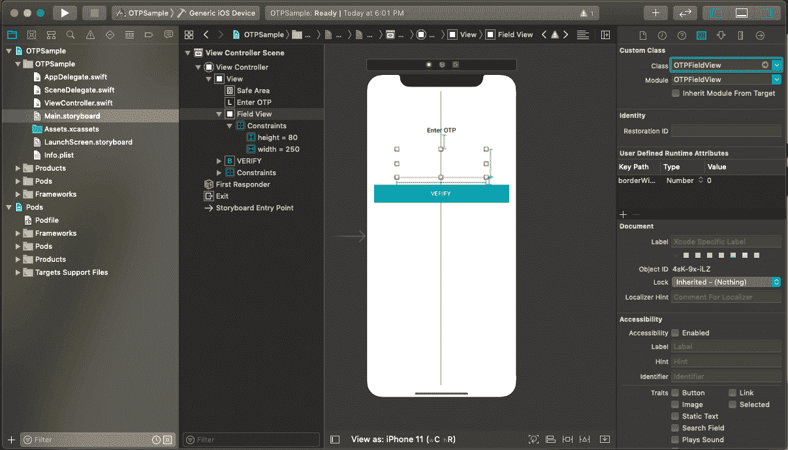
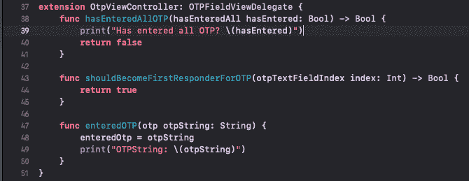
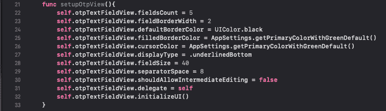
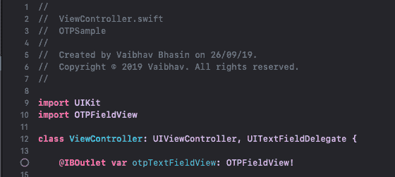

# 在 iOS 上创建 OTP 视图

> 原文：<https://hackr.io/blog/make-otp-view-on-ios>

几乎每个应用程序现在都使用电话号码来登录/注册。所以现在你想在你的 app 里加入 OTP 验证。看起来很简单，对吧？

只需添加 5 个 UITextFields，添加处理程序，管理下一个响应者，管理退格/删除按钮，管理颜色变化，显示键盘，隐藏键盘，连接所有字符串。毕竟，这种改变设计来匹配你的应用程序的外观下划线，菱形，圆形，圆形，然后显示或隐藏代码。

很简单，不是吗？

好的，别担心，我会让它变得简单。有一个分离舱可以让这一切消失，并自己处理一切。您所要做的就是创建一个视图并获取 OTP 字符串。就是这样。

1.创建新的 Xcode 项目。文件>新建>项目

2.选择名称，选择团队，将语言更改为 Swift，将用户界面更改为 Storyboard，完成项目
的初始化

3.添加 CocoaPods。CocoaPods 是 Swift 和 Objective-C Cocoa 项目的依赖管理器。它允许您在项目中安装库，也称为 Pods

" sudo gem 安装 cocoapods "

您必须使用 sudo 来安装 CocoaPods，但是安装之后您就不需要使用 sudo 了。

4.运行命令“pod init ”,然后运行“pod install”

Pod init 将为您的项目创建一个 Pod 文件，Pod install 将在您的项目中安装 Pod。

5.安装完 Pod 后，打开 Finder，你会看到一个新文件 ProjectName.xcworkspace。现在关闭。xcodeproj 文件并打开。xcworkspace 文件。

6.在 Project 中，打开 Podfile，Pods > podfile 并添加此 pod [OTPFieldView](https://github.com/Root-vb/OTPFieldView)

7.在项目名称的# Pods 下添加 Pod 'OTPFieldView'

8.然后运行“pod 更新”。Pod 更新将命令 cocapods 安装/刷新 pod 文件中列出的所有 pod

9.现在您已经成功安装了 OTPFieldView。

10.现在来制作 OTP 视图。拖动并添加 UIView，并将其类和模块更改为 OTPTextField。此外，添加它的高度和宽度约束。

11.在 ViewController 中，导入 OTPFieldView 并将 UI 元素链接到 ViewController。

12.添加以下代码来定制该字段，您可以根据需要对其进行定制。[查看此处](https://github.com/Root-vb/OTPFieldView)

13.最后，添加委托和委托方法

**hasEnteredAllOTP():** 当所有文本字段已满时，返回 true。

**shouldbucefirstresponderforotp():**自动显示键盘。

**enteredOTP():** 获取输入的 pin。

你的观点已经准备好了。现在，您可以使用 OTP 轻松地进行电话验证。

你喜欢你读到的东西吗？请在评论中告诉我你的想法！

**人也在读:**