# HTML 和 CSS 中的边距与填充:区别及如何使用

> 原文：<https://hackr.io/blog/margin-vs-padding>

在 HTML 和 CSS 中，边距和填充是确保在元素周围放置适当间距的两种方法。div、SPANs、Ps 和 IMGs 等元素同时具有 margin 和 padding 属性。

但是，虽然它们是相似的，空白填充的差异是重要的。事实上，这是一个可能在 [CSS 面试](https://hackr.io/blog/css-interview-questions)中经常出现的问题。

让我们来看一个简单的图表:


在上面的例子中，你可以看到一个元素由层组成。在这些层中是元素的内容、边框、填充和边距。

今天，我们将深入了解边距和填充的区别，如何使用边距和填充，以及如何判断何时使用它们。

## **边距和填充有什么区别？**

让我们从填充和边距之间的重要区别开始。一个[边距](https://www.w3schools.com/css/css_margin.asp)是一个元素周围的空间*，而[填充](https://www.w3schools.com/css/css_padding.asp)是一个元素*内部的空间*。您可以使用边距来确保其他元素不会离所讨论的元素太近。您使用填充在元素本身内部留出空间。*

让我们从一些简单的源代码开始。我们要创建两个盒子。一个外盒和一个内盒。外盒将包含内盒。


这两个框目前都有默认填充和默认边距，如下所示:

```
.outerBox {

padding: 0px;

margin: 0px;

}
```

你可以看到下面的图像没有填充；它只是盒子的“内容”，以及一个边框。

现在，让我们把内框的边距改为 20px。

```
.innerBox {

margin: 20px;

}
```

结果如下:

正如你所看到的，20 个像素被添加到了内框及其边框的周围。它实际上使外盒变大了，而不是内盒。

现在我们把内框的填充改为 20px。

```
.innerBox {

margin: 20px;

padding: 20px;

}
```

我们更新结果:

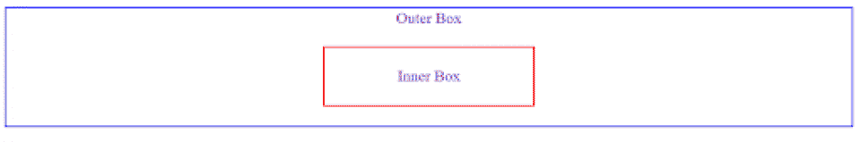

现在，内框已经添加了 20 个像素，在边框的内添加了*，在边框的*外添加了*。添加衬垫使内盒变大了。*

从视觉上看，如果我们移除所有的边框，“边距”和“填充”的操作将非常相似。它们都表示 div 内部内容和 div 周围内容之间的空间。

但是“margin”总是表示 div 外部的空间，而“padding”总是表示 div 内部的空间——就这么简单。

| **边距是指刚好超出内容和边界的空间。填充是指内容和边框之间的空间。** |

## **何时使用边距或填充**

虽然视觉上边距和填充看起来相似，但是有一个重要的区别——**边距不算元素本身的一部分，而填充算**。

如果你点击一个元素的填充，它仍然会注册为点击该元素。但是如果你点击页边空白，它不会。这是边距和填充之间最重要的区别。

边距和填充通常用于在元素周围创建空白，以使它们更具可读性:

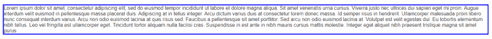

在上面的段落中，没有设置填充，边框与文本靠得太近，令人不舒服。

现在上面的填充设置好了，文本感觉可读性更好了。

同样，假设我们添加了一个 H2 标题，但我们希望它有一个红色的横幅:

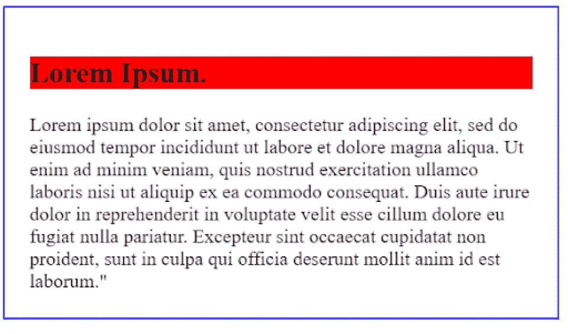

背景在离字母很近的地方被切断了，因为没有填充。让我们添加 10px 的填充:

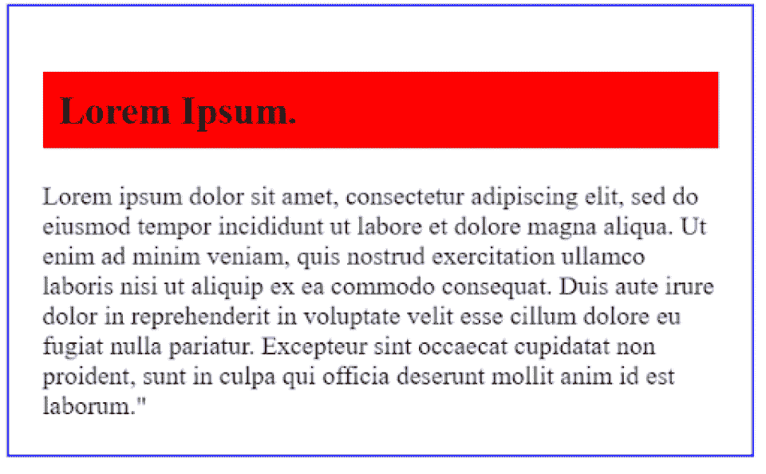

填充为标题文本提供了更多的空间。

这突出了填充和边距的另一个重要区别。边距只会增加 H2 周围的空间，对背景色没有帮助，因为背景色只应用于元素内部，而不是元素外部。

## **左、右、上、下边距与填充 CSS**

在上面的例子中，我们一次改变了整个 margin 或 padding 属性。但是您可能已经注意到，边距和填充都围绕着元素。

**边距和填充都可以根据元素的左、右、上、下进行设置。**不管你对哪个元素使用了边距和填充，不管它是一个 DIV、一个 P、一个 IMG 还是其他什么，都是如此。

让我们深入了解一下:

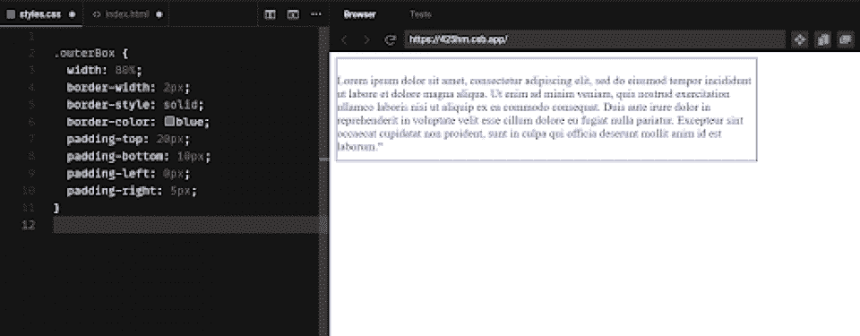

在本例中，我们将顶部填充设置为 20px，底部填充设置为 10px，左侧填充设置为 0px，右侧填充设置为 5px。你可以看到每种情况下的间距是不同的。您可以完全控制填充和边距。

我们也可以设置填充，然后在一个方向覆盖它:

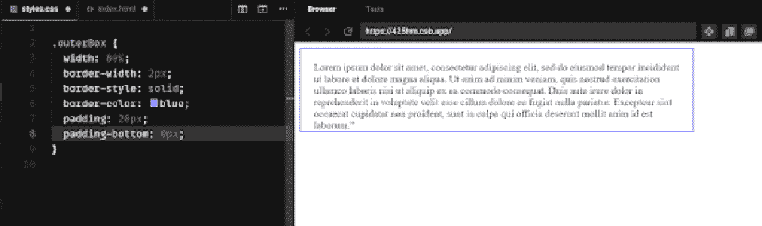

在本例中，我们将所有地方的填充设置为 20px，然后覆盖该设置，将底部填充设置为 0px。如果有一个元素紧跟在段落之后，我们可能会这样做。

同样，我们可以在文本中添加一个按钮，并更新它的边距:

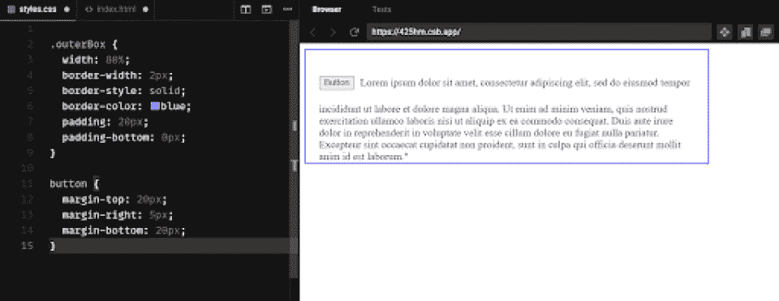

在上面的例子中，请注意，当我们将按钮的下边距设置为 20px 时，整个行内文本都向下移动了。因为按钮与文本在一行，所以考虑整个元素。

## **CSS 中的边距和填充尺寸**

在我们到目前为止的例子中，我们一直使用像素。但是与其他 CSS 元素一样，您可以使用各种填充大小。

这里有 20 像素的边距:

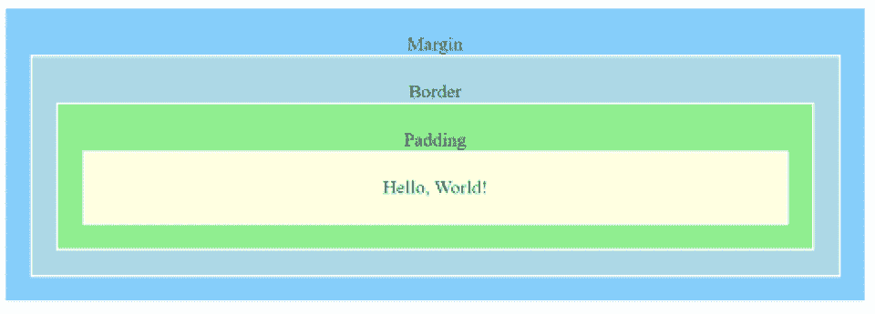

这里有 10%的利润:

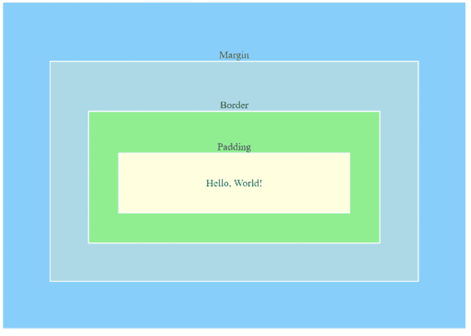

这里有 0.2 英寸的边距:

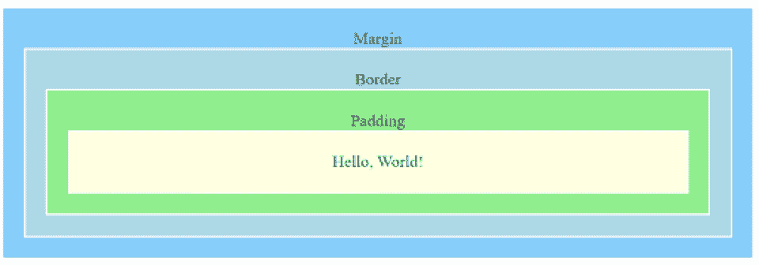

这里有一个 8 点的空白:

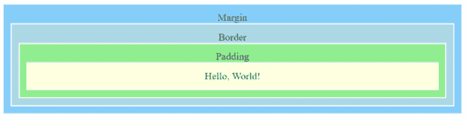

像素是一种精确的测量方法。但是**许多人也使用百分比，因为他们更容易实现响应式设计**(一种可以通过屏幕大小调整的设计)。

## **HTML 与 CSS 中的边距填充**

到目前为止，我们已经了解了 CSS 中的边距和填充。要在 CSS 中设置边距和填充，需要向元素添加适当的属性。

您可以在线完成此操作:

```
<div style=”margin: 20px; padding: 20px”></div>
```

或者您可以在单独的样式表中这样做:

```
.myDiv {

margin: 20px;

padding: 20px;

}
```

但是在 CSS 出现之前，人们是如何设置边距和填充的呢？你如何在 HTML 中设置边距和填充？

要在 HTML 中设置边距和填充，您需要创建一个 [HTML 表](https://developer.mozilla.org/en-US/docs/Learn/HTML/Tables/Basics)。现在表格已经不太常见了，但是仍然可以像下面这样创建:

```
<table>

<tr>

<td></td>

</tr>

</table>
```

每个“tr”元素代表一行，每个“td”元素代表该行中的一个单元格。

在 HTML 中，表格支持单元格填充(padding)和单元格间距(margins)。但是有一些重要的问题。也就是说，表格的行和列必须保持相互连接。所以，**表格不适合响应式设计**——行和列不能有效地适应不同的屏幕。

HTML 没有其他边距支持；否则就要全部用 CSS 来做。在 HTML 中，创建边距的主要方法是简单地添加“breaks”(
标签)。

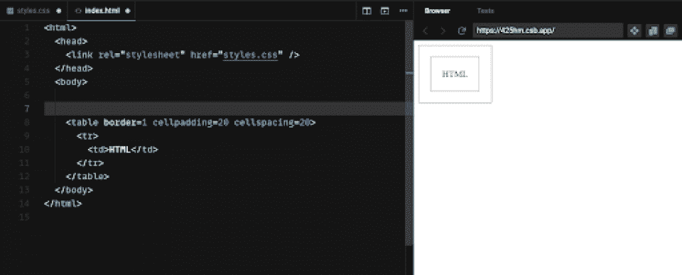

与 HTML 相比，padding vs margin CSS 非常简单。HTML 填充和边距比较复杂，因为你要么需要把所有东西都放在一个表中，要么从一开始就正确地调整所有东西的大小。

今天，几乎所有的事情都在 CSS 样式表中完成，因为这样更容易。CSS 可以直接合并到 HTML 中，也可以保存在单独的外部样式表中。CSS)。

## **边距折叠和 CSS**

CSS 中的一个常见问题是“边距崩溃”在 CSS 中，边距可以互相“折叠”。换句话说，如果两个边距相互冲突，CSS 将折叠一个边距并保留较大的边距。这不是填充会出现的问题。

这里，我们有两个段落都有 20px 的*填充*:

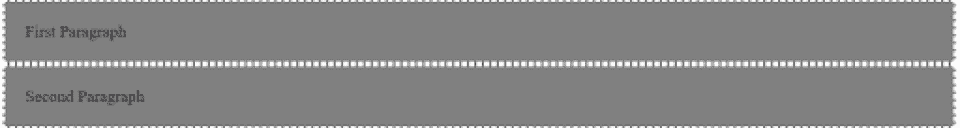

现在我们有两段，都有 20px 的*边距*:

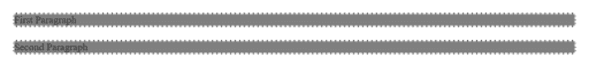

这是有趣的事情发生的地方。你会注意到，虽然这两个段落周围有 20px，但这两个段落之间也有 20px *，尽管它应该是 40px(加倍)。*

当我们将第二段的页边距改为 10px 时，这一点变得更加明显:

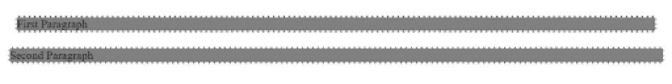

第二段的左右两边现在有 10px 的边距，但是两段之间的边距没有改变。CSS 将继续设置更大的边距:20px。

CSS 为什么要这么做？边距折叠旨在通过确保不会出现“双倍边距”来提高可读性。但是对于不想让利润暴跌的设计师来说，这可能会令人沮丧。

一般来说，**边距折叠只会发生在垂直方向**，因为它是为了增强文本的可读性。防止边距折叠的最简单的方法是在元素之间放置一个“虚拟”项，比如一个空段落。

另一种方法是对你的项目使用绝对定位。但是绝对定位并不总是一个选项，尤其是当你试图创建一个响应式设计的时候。

## **引导程序中的边距和填充**

许多开发人员很少直接访问边距或填充，因为他们使用的是像 [Bootstrap](https://hackr.io/blog/what-is-bootstrap-framework) 这样的技术。Bootstrap 是一个流行的 CSS 框架，设计用于快速网站开发。这不是唯一的框架，但是大多数都是相似的。

在 Bootstrap 中，格式化的实用程序类使得应用填充和边距等样式变得更加容易。例如，您可以使用:

```
<div class=”margin-md”></div>
```

这将创建一个中等边距的 DIV。您也可以使用:

```
<div class=”padding-sm”></div>
```

这将创建一个具有小尺寸填充的 DIV。

Bootstrap 现在经常被用于响应式网页设计。这是一个基于列的系统，对页面上的每个元素都有深度控制，因此无论屏幕有多大，页面都可以流畅地运行。

**如果你使用 Bootstrap，你不应该试图直接设置边距或填充**；相反，您应该让 Bootstrap 通过它的实用程序类为您完成这项工作。

## **边距和填充之间的边界**

在 CSS 中，边框在空白和填充之间形成了一种“墙”。但是边框是独特的样式元素，两者都不应该使用。边框可以有颜色、样式和宽度。它将始终位于边距和填充之间。

就元素而言，边框的功能更像填充，而不是边距。元素的边框是元素的一部分，所以如果你有一个工具提示，例如，工具提示会在你点击边框时打开，而不会在你点击边距时打开。

## **常见问题:边距与填充**

### **用边距好还是用填充好？**

当您想要调整元素的间距时使用边距，当您想要调整元素本身的外观时使用填充。边距不是元素的一部分；填充是。

### 你是如何记住边距和填充的？

请记住，边距在边框之外，填充在边框之内。border 属性在两者之间创建一堵墙。

## **了解 CSS 中边距和填充的更多信息**

现在你知道 CSS 和 HTML 中边距和填充的区别了。重申:

*   ***边距*** **是指 DIV、SPAN 或 p 等元素周围的空白区域**
*   ***填充是指 DIV、SPAN 或 P.** 等元素内的空白*

 *在 CSS 中，边距和填充都可以这样设置:

```
margin: 10px;

padding: 10px;
```

在 HTML 中，你需要使用表格:

```
<table cellspacing=20px cellpadding=20px></table>
```

CSS 提供了对 HTML/CSS 页面中许多属性的粒度控制。如果您需要修改 HTML 页面上的某些内容，几乎可以肯定会有 CSS 属性来完成。

现在你已经扩展了 CSS 和 HTML 中的边距和填充的知识，考虑参加一个 [HTML/CSS 课程](https://hackr.io/tutorials/learn-css)，参加一个密集的 HTML/CSS 训练营，或者只是参考一个 [CSS 备忘单](https://hackr.io/blog/css-cheat-sheet)。有了这些新技能，你将能够从头开始建立自己的网站。我们推荐使用 NameCheap 来[购买域名](https://www.namecheap.com/?clickID=wUoTbQ3KtxyNR9L3K50RiSEKUkAx6n2NkXBZwI0&irgwc=1&utm_source=IR&utm_medium=Affiliate&utm_campaign=2890636&affnetwork=ir&ref=ir)和[虚拟主机服务](https://www.namecheap.com/hosting/shared/?clickID=wUoTbQ3KtxyNR9L3K50RiSEKUkAx6E09kXBZwI0&irgwc=1&utm_source=IR&utm_medium=Affiliate&utm_campaign=2890636&affnetwork=ir&ref=ir)。它们是业内最好的，而且超级实惠。

### 推荐 Udemy 的 HTML/CSS 课程！

[](https://click.linksynergy.com/deeplink?id=jU79Zysihs4&mid=39197&murl=https%3A%2F%2Fwww.udemy.com%2Fcourses%2Fsearch%2F%3Fsrc%3Dukw%26q%3DHTML%2BCourse)

**人也在读:***