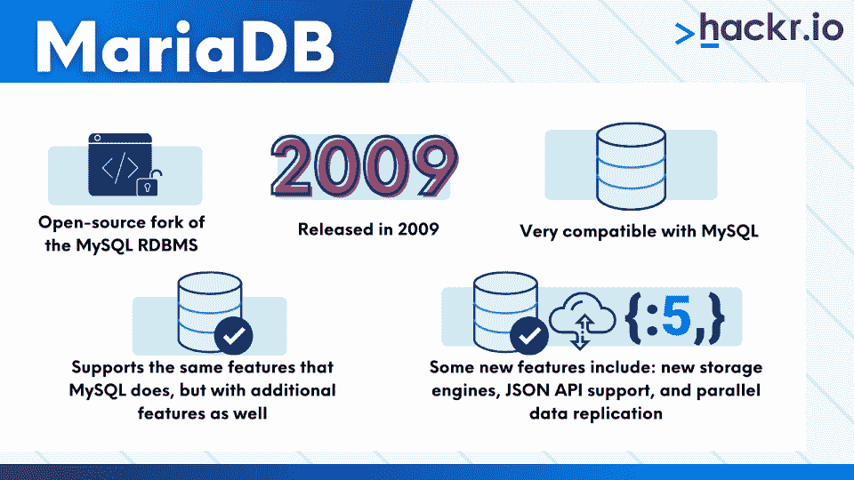
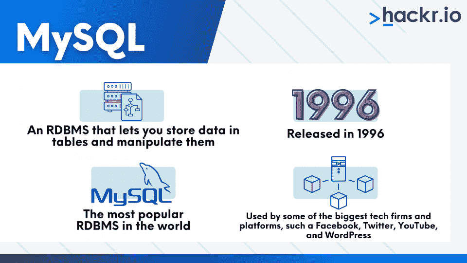

# MariaDB vs MySQL:你需要知道的一切[2023]

> 原文：<https://hackr.io/blog/mariadb-vs-mysql>

开发人员可以选择不止一种数据库。MySQL 是世界上使用最广泛的数据库之一，但绝不是唯一的。MySQL 是用 C/C++开发的，是免费和开源的，因此已经取得了很大的进步

然而，在甲骨文[收购太阳微系统](https://www.oracle.com/corporate/pressrelease/oracle-buys-sun-042009.html#:~:text=Oracle%20Corporation%20(NASDAQ%3A%20ORCL),of%20Sun's%20cash%20and%20debt.)的过程中，一些从事 MySQL 开发的高级工程师觉得 MySQL 和甲骨文的商业数据库——甲骨文数据库服务器之间存在利益冲突。

因此，这些工程师创建了 MySQL 代码库的一个分支，并开始了他们自己的组织。MariaDB 就是这样诞生的。

今天，这两个数据库都非常受欢迎，被开发人员社区广泛使用。MySQL 在关系数据库中排名第二，总体排名第二(Oracle 数据库第一)。MariaDB 在关系数据库中排名第九，总体排名第十四。

在本文中，我们将看看 MariaDB 和 MySQL 的异同。

## **Maria db 和 MySQL 的区别**

| **马里亚布** | **MySQL** 的实现 |
| 更快的性能 | 相对较慢的性能 |
| 开源 | 技术上开源，但主要由 Oracle 管理 |
| 更大的连接池 | 小得多的连接池 |
| 12 个存储引擎 | 更少的存储引擎 |
| 适用于大数据 | 不适用于大数据 |
| 支持数据屏蔽 | 不支持数据屏蔽 |
| 支持动态列 | 不支持动态列 |

## **什么是 MariaDB？**

MariaDB 是 MySQL 关系数据库管理系统(RDBMS)的开源分支。开发人员，包括一些最初为 MySQL 工作的人，在 2009 年对甲骨文收购 MySQL 感到担忧后，创建了 fork。作为 MySQL 的一个分支，MariaDB 非常兼容前者。

它支持与 MySQL 相同的特性，但也有更多的特性，我们将在下面看到。一些最重要的特性是新的存储引擎、JSON API 支持和并行数据复制。

## **什么是 MySQL？**

MySQL 是一个 RDBMS，它允许您在表中存储数据并操作它们。它由 Michael Widenius 于 1996 年首次发布，他现在是 MariaDB 的首席开发人员。

MySQL 是世界上最流行的 RDBMS，被一些最大的技术公司和平台所使用。这包括脸书、YouTube 和 Twitter。

在 WordPress 网站上可以找到 MySQL 有多受欢迎的更具体的例子。数据库系统让用户存储博客文章、用户和插件信息。

## **MariaDB vs MySQL**

### **性能对比**

与 MySQL 相比，MariaDB 有几项旨在提高性能的优化。一般来说，当谈到 MySQL 与 MariaDB 的性能时，后者显然更好，正如我们将在下面看到的那样。

#### **数据库视图**

在数据库“视图”方面有巨大的性能优化。“视图”本质上是虚拟数据库表，可以像数据库的常规表一样进行查询。

在 MySQL 中，当查询一个视图时，所有连接到该视图的表都会被查询，而不管查询可能不需要其中的一些表。这在 MariaDB 中已经过优化，查询只针对那些需要的表。

#### **列存储**

MariaDB 以“ColumnStore”的形式提供了另一个强大的性能改进，这是一个分布式数据架构，允许极大地扩展 MariaDB。它可以线性扩展，在数据库集群中的各种服务器上存储数 Pb 的数据。

#### **闪存存储性能更佳**

MariaDB 还提供了一个 MyRocks 存储引擎，将 RocksDB 数据库添加到其中。RocksDB 是一种数据库，通过提供更高级别的数据压缩，旨在提高闪存存储的性能。

#### **分段密钥缓存**

MariaDB 以分段键缓存的形式引入了另一项性能改进。在典型的缓存中，不同的线程竞争获取缓存条目的锁。这些锁被称为互斥锁。当多个线程竞争一个互斥体时，只有其中一个能够得到它，而其他线程必须等待锁被释放后才能执行操作。这会导致这些线程的执行延迟，从而降低数据库性能。

在分段键缓存的情况下，线程不需要锁定整个页面，但它可以只锁定页面所属的特定段。这有助于多线程并行工作，从而提高应用程序的并行性，从而提高数据库的性能。

### **虚拟列**

MariaDB 的另一个有趣的特性是它支持虚拟列。这些列能够在数据库级别执行计算。当许多应用程序访问同一列时，这非常有用，因此不需要在每个应用程序中编写计算。这个特性在 MySQL 中不可用。

### **查询的并行执行**

MariaDB v10.0 和更高版本允许并行执行多个查询。其思想是，来自主服务器的一些查询可以在从服务器中复制，因此可以并行执行。查询执行中的这种并行性无疑为 MariaDB 提供了超越 MySQL 的优势。

### **线程池**

MariaDB 还引入了一个叫做“线程池”的新概念。以前，当需要到数据库的多个连接时，对于每个连接，一个线程被打开，导致基于“每个连接一个线程”的架构。

有了“线程池”，就有了新连接可以获取并查询数据库的开放线程池。这样，不需要为每个新的连接请求打开一个新的线程，从而导致更快的查询结果。这个特性在 MySQL 的企业版中有，但在社区版中没有。

### **存储引擎**

MariaDB 提供了几个强大的现成存储引擎，这是 MySQL 所没有的。比如 XtraDB，Aria 等。要为 MySQL 设置这些存储引擎，您需要手动安装它们，这可能不是最方便的过程。

### **兼容性**

MariaDB 团队正在确保 MariaDB 可以在现有的应用程序中无缝地取代 MySQL。事实上，对于 MySQL 的每个版本，他们都发布相同的 MariaDB 版本号，以表明 MariaDB 与相应的 MySQL 版本大体兼容。这开启了无缝切换到 MariaDB 的可能性，而无需对应用程序代码库进行任何修改。

### **开源与专有数据库**

MySQL 是一个大型项目，由世界上最大的组织之一 Oracle 管理。这有利有弊。好处是，这意味着更好的安全性、软件稳定性和定制的客户支持体验。然而，一个显著的缺点是在如此大的组织中发布新特性需要花费大量时间。

另一方面，MariaDB 是完全开源的，他们接受外部贡献并将其作为新功能和增强功能发布的速度相当快。

## 你应该选择 MariaDB 还是 MySQL？

MariaDB 无疑是相当强大的，它提供了许多极其有用而 MySQL 不支持的特性。这些特性使得 MariaDB 成为作为主要后端数据库的有利选择。

一般来说，已经为 Oracle 购买了许可证的组织不需要投资 MariaDB。然而，对于那些重新开始并想决定使用哪个数据库的人来说，无疑 MariaDB 是一个更好的选择。

## **结论**

如您所见，在 MariaDB 与 MySQL 的面对面比较中，没有不可辩驳的理由来选择其中之一。MariaDB 更适合刚开始的人。那些已经在使用 MySQL 的人可以坚持下去，不要太担心性能损失。

更好的是，如果你需要的话，可以很容易地从 MySQL 转换到 MariaDB。两者各有利弊，所以你的决定应该反映你的需求。

[终极 MySQL 训练营:从 SQL 初学者到专家](https://click.linksynergy.com/link?id=jU79Zysihs4&offerid=1045023.1187016&type=2&murl=https%3A%2F%2Fwww.udemy.com%2Fcourse%2Fthe-ultimate-mysql-bootcamp-go-from-sql-beginner-to-expert%2F)

## **常见问题解答**

#### **1。MariaDB 和 MySQL 一样吗？**

不，Maria 和 MySQL 不一样，虽然它是 MySQL 的一个分支。如前所述，MySQL 和 MariaDB 之间有几个不同之处。您使用哪一种将取决于您的需求。

#### **2。MariaDB 比 MySQL 好吗？**

不。虽然 MariaDB 比 MySQL 有更多的特性，但两者都有优点和缺点，你选择哪一个将取决于你的需求。

#### **3。MariaDB 正在取代 MySQL 吗？**

不，MariaDB 不会取代 MySQL。然而，它变得越来越流行，给 MySQL 带来了一些竞争。

#### **4。MariaDB 是用来做什么的？**

MariaDB 是一个关系数据库管理系统(RDBMS ),其用途与 MySQL 相同，包括数据仓库和电子商务。

#### **5。MariaDB 更适合 WordPress 吗？**

MariaDB 和 MySQL 的基准测试表明，MariaDB 在 WordPress 性能方面要好得多。两者都可以为 WordPress 工作，但显然 MariaDB 的性能更高。

#### **6。可以在同一个服务器上安装 MySQL 和 MariaDB 吗？**

是的，您可以在同一台服务器上安装 MySQL 和 MariaDB。这里有一个如何做的指南。

**人也在读:**