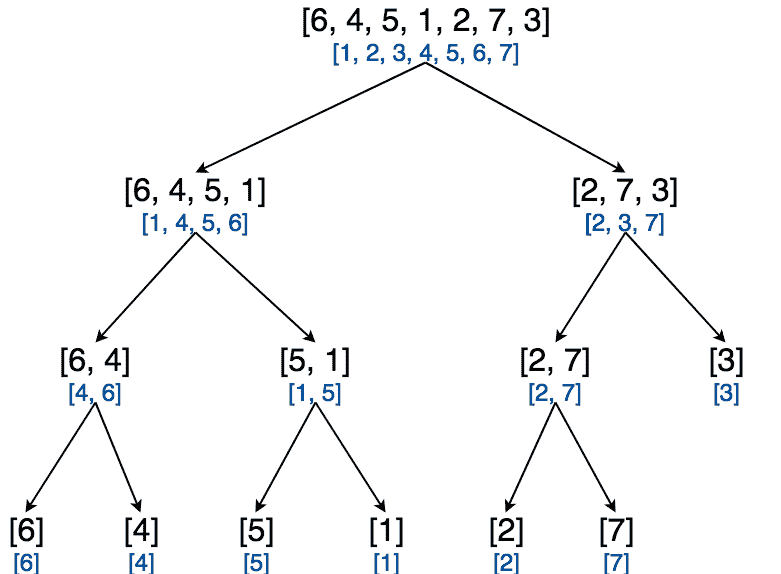

# C 语言中的归并排序——算法和程序及说明

> 原文：<https://hackr.io/blog/merge-sort-in-c>

合并排序是最强大的排序算法之一。合并排序也广泛应用于各种应用程序中。这些算法最好的部分是，它们能够以 O(n [2] )复杂度 (我们很快就会看到如何)对给定数据进行排序。此外，合并排序是有趣的，因为它为计算机科学中广泛使用的技术之一——分而治之——创建了一个极好的案例研究。

## **归并排序算法-解释**

给定一个长度为 n 的数组，我们执行以下步骤对数组进行排序:

1.  将数组分为长度分别为 n/2 和 n - n/2 的两部分(这里如果 n 是奇数，我们将 n/2 的值四舍五入)。让我们把这些数组分别称为左半部和右半部。
2.  递归排序左半数组和右半数组。
3.  合并左半数组和右半数组，得到排序后的全数组。

让我们举个例子:

给定数组:[6，4，5，1，2，7，3]

首先，按照上面的步骤 1，我们将数组分成两部分。我们可以看到，下面是左半部分和右半部分的子阵列:

*   左半边:[6，4，5，1]
*   右半部分:[2，7，3]

然后，按照上面的步骤 2，我们递归地排序左半部分和右半部分。下面是排序后的子数组的样子:

*   递归排序的左半部分:[1，4，5，6]
*   递归排序的右半部分:[2，3，7]

最后，按照步骤 3，我们将合并这两半来创建最终的排序数组。最终合并排序后的数组:[1，2，3，4，5，6，7]

左半部分和右半部分总是可以使用相同的算法递归排序。神奇的事情发生在创建最终合并和排序的数组。所以，让我们用上面的例子来很好地理解它。

在上面的例子中，我们得到了 2 个数组[1，4，5，6]和[2，3，7]。我们应该将这两个数组合并成一个排序后的数组。让我们在每个数组的开头放置一个指针。我们将通过在指针指向的相应元素下画线来描述指针。

最终合并数组= []

左阵:【 1 ，4，5，6】

右阵:【 2 ，3，7】

可以看出，左数组的指针在 1，右数组的指针在 2。我们选择较小的一个，并把它放在最终的合并数组中，然后移动相应的指针。这样做之后，我们将有以下状态:

最终合并数组= [1]

左阵:【 4 ，5，6】

右阵:【 2 ，3，7】

这里的指针现在分别位于 4 和 2。我们再次做我们上面做的——选择较小的一个，并把它放在最终的合并数组中，并移动相应的指针。我们将得到如下:

最终合并数组= [1，2]

左阵:【 4 ，5，6】

右阵:【 3 ，7】

我们再重复一次，得到:

最终合并数组= [1，2，3]

左阵:【 4 ，5，6】

右阵:【7】

继续这个练习，我们可以看到，我们能够成功地以排序后的形式得到最终的合并数组:

最终合并数组= [1，2，3，4，5，6，7]

左数组:[]

右数组:[]

如你所见，我们从一个未排序的数组开始，并且成功地得到了一个排序的数组。另一个需要回答的问题是——左右数组是如何排序的？嗯，我们用和上面一样的技术递归地对它们进行了排序。例如，考虑右边的数组:[2，7，3]。为了对它进行排序，我们将再次把它分成两个子数组:[2，7]和[3]。这两个子数组都已经排序了，所以我们可以通过使用上面解释的技术来合并它们，从而得到排序后的数组[2，3，7]。

看一下下面的图片，理解同样的过程是如何递归地应用到子阵列上的:



在上图中，我们用黑色显示了实际的子数组，用蓝色显示了排序后的子数组。让我们理解在上面的数组中执行合并排序的详细步骤:

*   【6，4，5，1，2，7，3】分为【6，4，5，1】和【2，7，3】
*   【6，4，5，1】分为【6，4】和【5，1】
*   【6，4】分为【6】和【4】
    *   [6]是一个单元素数组，因此，被排序。
    *   [4]是一个单元素数组，因此，被排序。
*   【6】和【4】合并为【4，6】
*   【5，1】分为【5】和【1】
    *   [5]是一个单元素数组，因此，被排序。
    *   [1]是一个单元素数组，因此，被排序。

*   【5】和【1】合并为【1，5】

*   *   【4，6】和【1，5】合并为【1，4，5，6】

*   【2，7，3】分为【2，7】和【3】
*   【2，7】分为【2】和【7】
    *   [2]是一个单元素数组，因此，被排序。
    *   [7]是一个单元素数组，因此，被排序。
*   【2】和【7】合并为【2，7】
*   [3]是一个单元素数组，因此，被排序。
*   【2，7】和【3】合并为【2，3，7】
*   【1，4，5，6】和【2，3，7】合并成【1，2，3，4，5，6，7】

注意重要的一点——我们需要一个单独的数组来存储最终合并数组的数据。这意味着合并排序需要额外的空间。

这就是合并排序的工作方式。这里有一个动画解释了同样的问题。


## **合并排序伪代码**

在进入实际代码之前，让我们先来看看伪代码。

```
function merge_sort(i, j, a, aux) {
 mid = (i + j) / 2
 merge_sort(i, mid, a, aux)
 merge_sort(mid + 1, j, a, aux)
 pointer_left = i, pointer_right = mid + 1
 for k in [i ... j] {
 if pointer_left points to smaller element, aux[k] = a[pointer_left] and increment pointer_left by 1
 if pointer_right points to smaller element, aux[k] = a[pointer_right] and increment pointer_right by 1
 }
 copy the contents of aux[i .. j] to a[i .. j]
}

```

现在，让我们来看看实际的工作代码。

## C 语言中的归并排序程序

让我们一步步理解代码:

`void merge_sort(int i, int j, int a[], int aux[])`

这个原型意味着 merge_sort 函数对子数组 a[i..j]使用辅助`array aux[]`。

如果`j <= i`，显然，子数组`a[i .. j]`要么包含 1 个元素(已排序)，要么不包含元素(也已排序)。因此，在这种情况下，我们什么也不做，只是返回。

```
if (j <= i) {
 return;
}

```

T2`int mid = (i + j) / 2;`

我们计划将数组划分为两个长度几乎相等的子数组。这些子阵列是`a[i .. mid]`和`a[mid + 1 .. j]`。显然，`mid = (i + j) / 2`是这里最好的，因为 mid 是 I 和 j 的平均值。

这里，我们通过调用相同的 merge_sort 函数递归排序`a[i .. mid]`和`a[mid + 1 .. j]`子数组。

```
 merge_sort(i, mid, a, aux);
 merge_sort(mid + 1, j, a, aux);

```

一旦我们有了这两个排序好的子数组，剩下的代码就简单地合并这两个。

在这里，我们将 pointer_left 放在左侧子数组`a[i .. mid]`的开头，将 pointer_right 放在右侧子数组`a[mid + 1 .. j]`的开头。

```
 int pointer_left = i;
 int pointer_right = mid + 1;
 int k;

```

在这里，我们有 4 种情况:

```
 for (k = i; k <= j; k++) {
 if (pointer_left == mid + 1) {
 aux[k] = a[pointer_right];
 pointer_right++;
 } else if (pointer_right == j + 1) {
 aux[k] = a[pointer_left];
 pointer_left++;
 } else if (a[pointer_left] < a[pointer_right]) {
 aux[k] = a[pointer_left];
 pointer_left++;
 } else {
 aux[k] = a[pointer_right];
 pointer_right++;
 }
}

```

`pointer_left == mid + 1:`在这种情况下，左边的子数组完成了，它的所有元素都已经合并了。

1.  `pointer_right == j + 1:`在这种情况下，右边的子数组完成了，它的所有元素都已经合并了。
2.  `a[pointer_left] < a[pointer_right]:`这里，2 个数组都没有完成。然而，pointer_left 指向一个比 pointer_right 更小的元素，所以我们把它放在合并的数组中。
3.  else 最后一种情况:这里，两个数组都没有完成。然而，pointer_right 指向一个比 pointer_left 更小的元素，所以我们把它放在合并的数组中。
4.  最后，我们将元素从 aux[]复制到 a[]。

这就是合并排序的工作方式。

```
for (k = i; k <= j; k++) {
 a[k] = aux[k];
}
```

合并排序复杂度

## 复杂度给出了作为输入大小的函数的执行算法所需时间的粗略概念。例如，假设 T(n)是对大小为 n 的数组执行合并排序所花费的时间

如我们所见，T(n)包括 3 个:

在左半部分执行合并排序所花费的时间。左半部分的大小为 n/2，因此，花费的时间只有 T(n/2)。

1.  在右半部分执行合并排序所花费的时间。右半部分的大小为 n/2，所以这里花费的时间也是 T(n/2)。
2.  合并左右两半花费的时间。正如我们所看到的，为了合并这两半，我们从两个子数组中一个接一个地选择每个元素，并填充到原始数组中。由于有 n 个元素，合并所花费的时间将与 n 成正比。因此，让我们把这个时间称为 cn，其中 c 是某个常数。
3.  总时间，T(n) = T(n/2) + T(n/2) + cn

于是，我们有了等式:T(n) = 2T(n/2) + cn。利用一些数学知识，这个等式可以解为

T(n) = 2T(n/2) + cn

= 2(2T(n/4)+cn/2)+cn = 2²T(n/2²)+2cn

= 2(2(2T(n/8)+cn/4)+cn/2)+cn = 2³T(n/2³)+3cn

...

...

上述数列的第 k 项为:2^kT(n/2^k)+kcn

放 2 k = n，我们有 k = log[2]n .我们把 k 的这个值放在上式中得到:T(n)= nT(1)+cn log[2]n

这里，T(1)和 c 是常数。所以，我们可以写成 T(n)= An+bn log[2]n .由于 nlog[2]n 大于 n，我们可以看出 nlog[2]n 是占优势的项。只是给你一个思路，当 n = 2 32 ，nlog[2]n = 32 * 232时，这显然大了一个数量级。所以，T(n)可以写成 T(n)= O(nlog[2]n)。

冒泡排序算法 的复杂度另一方面如我们所见为 O(n ² )。显然，合并排序比冒泡排序算法快得多，这就是它被广泛应用于各种应用程序和库中的原因。

[掌握数据结构&使用 C 和 C++](https://click.linksynergy.com/link?id=jU79Zysihs4&offerid=1045023.2121018&type=2&murl=https%3A%2F%2Fwww.udemy.com%2Fcourse%2Fdatastructurescncpp%2F) 的算法

**结论**

## 合并排序是一个有趣的算法，是理解数据结构和算法的一个很好的案例。为了打好计算机科学的基础，建议你彻底理解各种排序算法，这将有助于你掌握基础知识。

PS:你可能也会对我们在 C 博客中的[冒泡排序感兴趣。](https://hackr.io/blog/bubble-sort-in-c)

**人也在读:**

**People are also reading:**