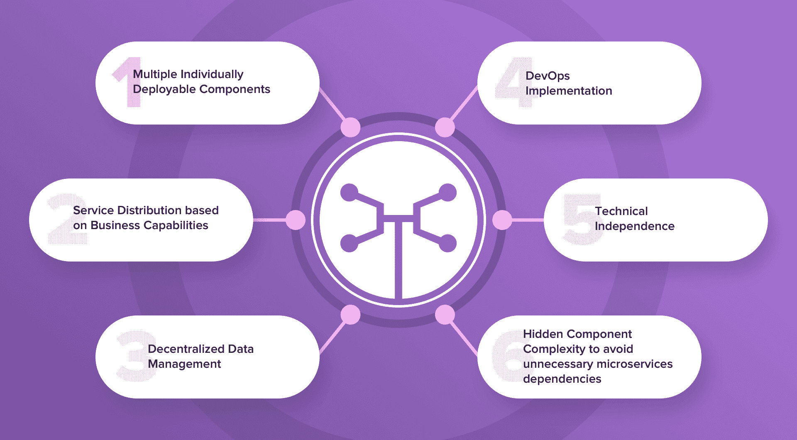
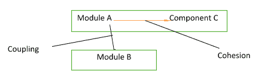
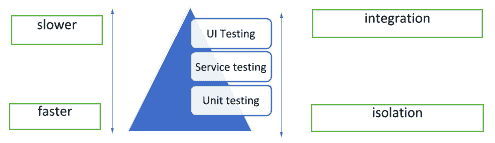
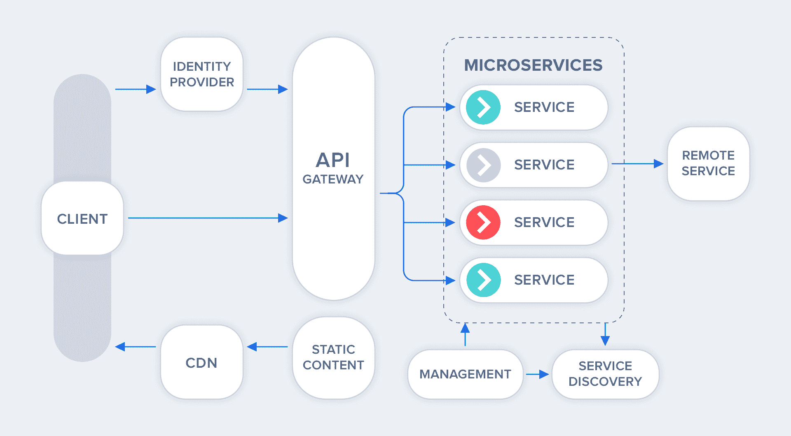
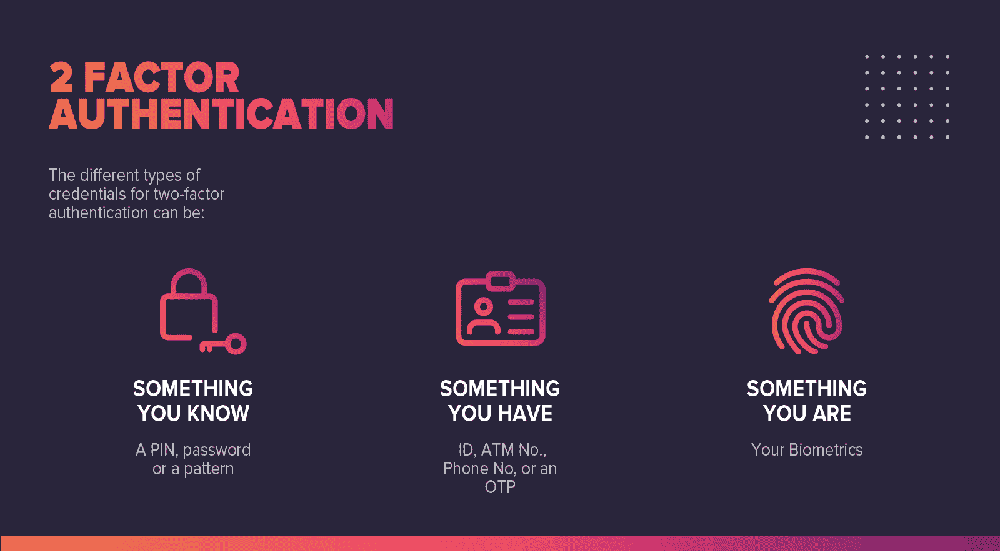

# 2023 年 50 大微服务面试问答

> 原文：<https://hackr.io/blog/microservices-interview-questions>

微服务架构是一种以离散模块的形式开发大规模应用程序的方法，这些模块彼此独立工作，但作为一个整体来考虑整个业务应用程序。越来越多的组织采用这种服务来开发企业解决方案。由于这是在简单的模块化服务上运行的，因此现在对云解决方案的需求越来越大。

微服务部署可以是基于云的，也可以是本地的。它的市场横跨医疗保健、银行、政府、制造、零售、It 和电信、媒体和娱乐、制造等。其目标受众包括投资者和顾问、系统集成商、政府机构、IT 和技术解决方案提供商。仅举几个例子，这个专业领域的著名公司有 Cognizant、IBM、Microsoft、Salesforce 和 Software AG。微服务架构市场预计将在 2023 年实现巨大飞跃。

如果你正在寻找这一领域的职业，并为面试做好准备，这里有一些你可以期待的快速微服务面试问题和答案。

## **微服务面试问答**

这里列出的问题和答案是从互联网上的许多资源编译而来的。这不应该被认为是微服务面试的最终指南。请获取这方面的深入知识，并参考更多的书籍和资源指南，以连接这方面的问题。

#### **问题:你所理解的微服务是什么？**

**回答:**微服务或者更恰当地说，微服务架构是一种 SDLC 方法，基于这种方法，大型应用程序被构建为小型功能模块的集合。这些功能模块是可独立部署的、可扩展的，面向特定的业务目标，并通过标准协议相互通信。这样的模块也可以使用不同的编程语言来实现，具有它们的数据库，并且部署在不同的软件环境上。这里的每个模块都是最小且完整的。

#### **问题:微服务的主要特点是什么？**

**回答:**微服务有以下主要特点:

*   多个可单独部署的组件。
*   基于业务能力的服务分配。
*   分散的数据管理。
*   DevOps 实现。
*   技术独立。
*   隐藏组件复杂性，避免不必要的微服务依赖。

#### **问题:微服务的主要组成部分是什么？**

**回答:**微服务架构的主要组件包括:

*   容器、集群和编排
*   作为代码概念的基础设施
*   云基础设施
*   API 网关
*   企业服务总线
*   服务提供

#### **问题:微服务架构是如何工作的？**

**答:**在微服务架构下，一个应用被简化为多个独立执行单一精确独立任务的模块:

*   被分割成松散耦合的不同模块，每个模块执行不同的功能。
*   它可以跨云和数据中心分布。
*   将每个模块实现为独立的服务/过程，可以在不中断应用程序其余部分的情况下替换、更新或删除。

在微服务架构下，应用程序可以随着其需求而增长。

#### **问题:微服务设计的基本特征是什么？**

**答案:**

*   围绕业务功能划分和组织服务。
*   由不同的开发团队处理和拥有的独立模块。
*   分散框架。
*   由各自的开发团队维护各自的模块。
*   不同的模块可以由不同的数据库维护。
*   微服务架构中的模块可以单独部署。它们可以更新、增强或删除，而不会破坏整个体系结构。
*   实时监控应用程序。

#### **问题:微服务部署的主要挑战是什么？**

**回答:**微服务面临的挑战可以是技术性的，也可以是功能性的。

从业务角度来看，主要挑战是:

*   需要大量投资
*   重型基础设施设置
*   管理运营开销的过度规划
*   人员选择和维护。

从技术角度来看

*   应用程序中不同微服务之间的通信。
*   组件自动化
*   应用程序维护
*   结构管理
*   沉重的运营开销
*   部署挑战
*   测试和调试挑战

#### **问题:微服务的优缺点是什么？**

**答案:**

**优点**:

*   改进的可扩展性
*   故障隔离
*   局部复杂性
*   提高敏捷性
*   简化的调试和维护
*   开发者和商业用户之间更好的沟通。
*   较小的开发团队
*   更好的技术升级空间。

**缺点:**

*   整体复杂。
*   需要准确的预先规划
*   模块依赖性很难计算。
*   对第三方应用程序的控制更少
*   模块化的相互依赖很难跟踪。
*   恶意入侵的机会更多。
*   完整的端到端测试非常困难。
*   部署挑战。

#### **问题:** **微服务部署有哪些不同的策略？**

**答案:**

*   **每个主机多个服务实例:**在单个/多个物理/虚拟主机上运行应用程序的单个或多个服务实例。
*   **每台主机的服务实例:**为每台主机运行一个服务实例。
*   **每个容器的服务实例:**在各自的容器中运行每个服务实例。
*   **无服务器部署:**将服务打包成 ZIP 文件，上传到 Lambda 函数。Lambda 函数是一个无状态服务，它自动运行足够多的微服务来处理所有请求。

#### **问题:列举单片、SOA 和微服务架构之间的区别，并分别举例说明。**

**答案:**

| 在整体架构中，应用程序的所有软件组件都是紧密组装和打包的。 | SOA[面向服务的架构]是通过简单的数据传递或活动协调相互通信的服务集合。 | 微服务架构是小型功能模块的集合。这些功能模块是可独立部署的、可扩展的，面向特定的业务目标，并通过标准协议相互通信。 |

#### 问题:什么是领域驱动设计？

**答案:**领域驱动设计是一种基于面向对象分析设计概念和原则的架构风格。它通过将软件系统的相关组件连接成一个不断发展的系统来帮助开发一个复杂的系统。领域驱动的设计基于三个核心原则:

*   关注核心领域和领域逻辑。
*   基于领域模型的复杂设计。
*   定期与领域专家协作，以改进应用程序模型并解决任何新出现的领域相关问题。

#### 问:什么是 Spring Boot？

**回答:** Spring Boot 是一个开源的、[基于 Java 的框架](https://hackr.io/blog/java-frameworks)，它为开发者提供了一个优秀的平台来开发一个独立的、生产级的 Spring 应用。它易于理解，提高了生产率，减少了开发时间。它会根据应用程序添加的依赖项自动配置声明。

#### 问:如何覆盖 Spring Boot 项目的默认属性？

**答案:**在 application.properties 中指定属性。

Spring MVC 应用程序需要指定后缀和前缀。这可以通过以下方式实现:

*   **For 后缀—**spring . MVC . view . suffix:。jsp
*   **For prefix-**spring . MVC . view . prefix:/we b-INF/

#### **问题:Monolithic、SOA、微服务架构有什么区别？**

**答案:**

*   **整体架构:**在这种类型的架构中，应用程序的不同组件(如 UI、业务逻辑、数据访问层)被组合到一个平台或程序中。
*   **SOA(面向服务的架构):**在这个架构中，各个组件是松散耦合的，执行一个离散的功能。有两个主要角色——服务提供者和服务消费者。在 SOA 类型中，模块可以集成和重用，这使它变得灵活可靠。
*   **微服务架构:**它是 SOA 的一种类型，在这种架构中，一系列自治的组件被构建并组合在一起，形成一个 app。这些组件是使用 API 集成的。这种方法专注于业务优先级和功能，并提供高敏捷性，即应用程序的每个组件都可以独立于其他组件构建。

#### **问题:衔接和耦合的区别？**

**答案:耦合:**是模块 A 与另一个模块 b 之间的关系，任何一个模块都可以与其他模块高度耦合(高度依赖)、松散耦合、非耦合。最好的耦合是通过接口实现的松散耦合。

**内聚:**是一个模块内 2 个或 2 个以上部分之间的关系。如果一个模块具有很高的内聚性，这意味着该模块可以在不与其他模块通信的情况下，以最高的效率独自执行某项任务。高内聚力增强了模块的功能强度。

#### **问题:提及春云解决的问题？**

**答案:**春云可以解决以下问题:

*   网络问题、延迟开销、带宽问题、安全问题和分布式系统的其他问题
*   分布式系统中出现的冗余问题。
*   平衡网络链接、CPU、集群等资源之间的负载分布。
*   运营开销导致的性能问题。
*   服务发现问题，以确保集群中服务之间的顺利通信。

#### **问题:什么是分布式事务？**

**答:**分发事务有两个或两个以上的网络主机被占用。事务由负责开发和处理事务的事务管理器处理。如果事务涉及多个对等体，每个对等体的事务管理器使用上下级关系相互通信。

同样，资源由资源管理器处理，资源管理器还与分布式事务协调器协调事务原子性和隔离。

#### **问题:解释端到端微服务测试？**

**答:**它是一种测试技术，用于使用业务事务测试应用程序的整个流程。由于微服务架构中涉及到几个组件，这些测试可以覆盖单元或集成测试期间的缺口。它还提供端到端的信心，确保网络参数得到适当配置，并帮助微服务发展。

#### **问题:什么是迈克·科恩的测试金字塔？**

**回答:**金字塔有助于最大化所有级别测试的自动化，例如单元测试、服务级别测试、UI 测试。金字塔表明，虽然单元测试更快、更孤立，但处于最高级别的 UI 测试需要时间并专注于集成。

#### 问:如何在 Spring Boot 应用程序中实现 Spring 安全性？

**答案:**

*   在 pom.xml 文件中添加 spring-boot-starter-security。
*   创建一个 Spring config 类，它将覆盖所需的方法，同时扩展 WebSecurityConfigurerAdapter 以实现应用程序中的安全性。

#### 问题:你将如何配置 Spring Boot 应用程序登录？

**答:** Spring Boot 应用登录可以通过在应用中指定 logging.level 来配置。属性文件。它通常被预先配置为控制台输出。

#### **问题:什么是春云？**

**回答:**在构建分布式系统时，会遇到一些问题。它们是配置管理、服务发现、断路器和分布式会话。Spring Boot 是一个工具的集合，为这类常见问题提供解决方案。

#### **问题:什么是执行器？**

**答:**执行器将生产就绪特性引入应用。它主要用于公开关于运行中的应用程序的健康、指标、信息、转储、环境等操作信息。它使用 HTTP 端点或 JMX bean 与之交互。

#### **问题:什么是容器？**

**回答:**容器是虚拟化操作系统中隔离的工作负载环境。它由应用程序和运行该应用程序所需的所有功能和文件组成。每个盒子都是一个独立的环境，不依赖于物理环境中的软件，从而为应用程序的可移植性提供了解决方案。

#### **问题:什么是耦合和内聚？**

**回答:**微服务架构中服务之间的依赖强度被称为耦合性。内聚是指两个或多个服务之间的相关逻辑。微服务的整个概念是基于部署和更新服务的能力，同时保持其他服务完好无损。因此，松耦合和高内聚是微服务设计的关键。

#### **问题:微服务架构中的 PACT 是什么？**

**答:**消费者应用程序和提供者应用程序之间的契约称为契约。每个契约都是互动的集合。它是一个开源工具，可用于在微服务中实现消费者驱动的契约。

#### **问题:什么是契约测试？**

**回答:**契约测试确保微服务架构的显式和隐式契约按预期工作。有两个角度要测试——消费者和提供者。消费者是使用微服务的[应用]实体，提供者是提供服务的[应用]实体。这种服务在预先定义的规范下工作，契约测试确保了这一点。

#### **问题:什么是 OAuth？**

**答:** OAuth 代表开放标准授权协议或框架，它描述了不相关的服务器和服务如何安全地允许对其资产进行认证访问，而无需共享初始相关的单一登录凭证。这也称为安全、第三方、用户代理、委托授权。

#### 问题:你能从康威定律中得出/理解什么？

**回答:**梅尔文·康威在 20 世纪 60 年代末陈述了这个想法。这条定律意味着“设计系统的组织必须生产这些组织的通信结构的复制品”。简单地说，设计软件的团队最终会按照他们的观点进行设计。

#### 问题:端到端微服务测试的步骤是什么？

**答:**微服务应用的端到端测试确保表单中的每个流程都正常运行。这验证了系统作为一个整体工作正常。由于微服务应用程序是用动态编排的多个模块构建的，因此端到端测试涵盖了服务之间的所有差距。

端到端微服务测试的步骤如下:

*   定义你对 e2e 测试的期望。
*   定义要测试的系统的范围。
*   在测试环境中执行身份验证。
*   选择一个能够解决大多数问题的测试框架。
*   测试异步流
*   自动化测试

#### **问题:模拟&存根有什么区别？**

**答:**Mock 通常是一个虚拟对象，其中某些特征最初被设置在其中。它的行为主要取决于这些特征，然后对这些特征进行测试。

存根是帮助运行测试的对象。它在一定条件下以固定的方式发挥作用。这种硬编码的行为有助于存根运行测试。

#### 问题:我们能从迈克·科恩的测试金字塔中得出什么？

**回答:** Mike Cohn 的测试金字塔描述了软件开发所需的自动化测试的类型。测试金字塔只是一个隐喻，暗示了基于粒度的测试分组。这个金字塔告诉我们哪种测试应该应用于金字塔的不同层次。

Mike Cohn 的测试金字塔由一个测试套件应该包含的三层组成:

*   单元测试
*   服务测试
*   用户界面测试。

从科恩的金字塔中得出的两点是:

*   定义不同粒度的测试
*   你的级别越高，你应该做的测试就越少。

#### **问题:Docker 在微服务方面有什么帮助？**

**回答:**微服务，正如我们所知，是独立的、单独的单元，只执行一个业务功能，以至于每个单元都可以被认为是一个独立的应用程序。应用程序开发环境和应用程序部署环境必然会在许多方面有所不同。这导致了部署问题。Docker 为应用程序的运行提供了一个静态背景，从而避免了部署问题。事实上，它是一个容器化的工具。它减少了开销，并在同一台服务器上部署了数千个微服务。Docker 确保应用程序微服务将在它们自己的环境中运行，并且完全独立于它们的操作系统。

#### 问题:金丝雀在释放什么？

**回答:** Canary releasing 是一种引入新软件版本的技术，它先向一小部分用户推出更新版本，然后再向整个基础架构推出，供所有人使用。这种技术之所以如此，是因为它基于煤矿中金丝雀的释放，以在有毒气体达到危险水平时提醒矿工。

#### **问:双因素身份认证有哪些不同类型的凭据？**

**答:**双因素身份认证要求对帐户登录流程进行第二轮身份认证。输入用户名-密码是一种单因素身份验证。用户名-密码认证以及手机号码或密钥认证可被视为双因素认证。

二元身份认证的不同类型的凭据可以是:

*   一些你知道的东西——个人识别码、密码或模式
*   你有的东西——身份证、自动取款机号、电话号码或一次性密码
*   你是什么——你的生物特征。

#### **问题:什么是客户端证书？**

**答:**客户端证书是一种数字证书，客户端系统使用它向远程服务器发出经过身份验证的请求。它在许多相互身份验证设计中起着关键作用，为请求者的身份提供了强有力的保证。

#### **问题:什么是 CDC[消费者驱动合同]？**

**回答:**消费者驱动的契约是服务演进的模式。在这里，每个消费者在一个单独的契约中捕获他们的提供者。然后，所有这些合同都与提供者共享，这有助于他们深入了解他们必须为每个客户履行的义务。

#### 问:什么是非确定性测试，你将如何消除它们？

**回答:** NDT 或非确定性是不可靠的检测。这种测试有时通过，有时失败。当这些测试失败时，它们会重新运行。测试的不确定性可以通过以下方式消除:

*   隔离
*   异步的
*   远程服务
*   隔离
*   时间
*   资源泄漏

#### **问题:微服务中的反应式扩展是什么？**

**答:**反应式扩展是一种设计方法，通过调用多个服务来收集结果，以便编译组合响应。也称为 Rx，这些调用可以是同步的，也可以是异步的。

#### **问题:RESTful APIs 在微服务中的作用是什么？**

**回答:**微服务基于这样一个概念，即它的所有组件服务都需要相互交互才能完成业务功能。这就需要每个微服务都有一个接口。RESTful APIs 为构建这些接口提供了一个逻辑模型。它基于网络的开放网络原则。因此，它是微服务最关键的推动者。

#### **问题:微服务中的 Eureka 是什么？**

**回答:** Eureka 也称为网飞服务发现服务器。它使用 Spring Cloud，对应用程序开发过程的要求不高。

#### **问题:你将如何利用 Spring Cloud 来平衡服务器端的负载？**

**答:**服务器端的负载均衡可以用网飞 Zuul 来做。它也被称为基于 JVM 的路由器。

#### 问:你认为什么时候使用网飞海斯特里克斯合适？

**答案:** Hystrix 是一个容错和延迟库。Hystrix 主要隔离接入点。它还确保所有第三方库和服务都受到限制。因此，我们可以使用 Hystrix 来确保应用程序高效运行，并避免分布式系统中出现的故障。

#### **问题:什么是 Spring Batch 框架？**

**回答:** Spring Batch 是一个开源的 web 框架，用于批处理——执行一系列作业。Spring Batch 提供了用于读/写资源、事务管理、作业处理统计、作业重启和分区技术的类和 API，以处理大量数据。

#### **问题:什么是小任务，什么是大块？**

**答:**Tasklet 是一个简单的接口，有一个方法可以执行。小任务可以用来执行单个任务，如运行查询、删除文件等。在 Spring Batch 中，tasklet 是一个接口，可用于执行独特的任务，如在任何步骤执行之前或之后清理或设置资源。

Spring Batch 在其最常见的实现中使用了“面向块”的处理风格。面向块的处理指的是一次读取一个数据，并在事务边界内创建将被写出的块。

#### **问题:你将如何在微服务中部署异常处理？**

**答:**如果在处理 HTTP 请求时出现异常，您需要在您的控制器或服务中捕获异常，并手动返回适当的 ResponseEntity。这里有一些异常处理的经验法则。

*   为您编写的异常添加@ResponseStatus。
*   对于所有其他异常，请在@ControllerAdvice 类上实现@ExceptionHandler 方法或使用 SimpleMappingExceptionResolver 的实例。
*   对于特定于控制器的异常，向控制器添加@ExceptionHandler 方法。

需要注意的是，控制器上的@ExceptionHandler 方法总是在任何@ControllerAdvice 实例上的方法之前被选择。未定义控制器优势的处理顺序。

**问题:如何访问 RESTful 微服务？**

**回答:**考虑到微服务架构概念，每个微服务都需要有一个接口。基于 Web 的开放网络原则，RESTful APIs 为在微服务架构的各个组件之间构建接口提供了最合理的模型。可以通过两种方式访问 RESTful APIs:

*   使用负载平衡的 REST 模板。
*   我正在使用多个微服务。

**问题:独立的微服务之间如何沟通？**

**回答:**微服务之间可以通过:

*   HTTP 用于传统的请求-响应。
*   用于流式传输的 Websockets。
*   运行高级路由算法的代理或服务器程序。

对于消息经纪人， [RabbitMQ](https://www.rabbitmq.com/) ，Nats，Kafka 等。，每个都是为特定的消息语义而构建的。另一种方法是像空间云一样使用后端即服务，它可以自动化整个后端。

**问题:什么是语义监控？**

**答:**语义监控或综合监控是针对实时生产系统运行应用程序自动化测试的子集。对这些结果进行监控，并在失败时发出警报。语义监控方法从业务事务的角度进行微服务监控。它的语义监控不是监控每个组件，而是确定事务对于业务和用户的表现如何。它还检测故障服务层和相应的微服务实例，所有这些都在同一个流程中进行。这种方法可以更快地进行分类，并减少修复时间。

**问题:如何对微服务进行安全测试？**

**答案:**微服务应用是一个更小的、独立的、功能模块的集合，这些模块可能用不同的编程语言开发，有不同的数据源，运行在不同的操作系统上。这使得微服务的整体测试成为一项非常艰巨的任务。不同的部件/模块需要单独测试。这有三个常见的过程。

*   代码扫描:为了保证每一行代码都没有 bug，可以复制。
*   灵活性:根据系统的需求，安全协议应该是灵活的。
*   适应性:安全协议应该能够适应恶意入侵。

**问题:你所理解的幂等是什么，它是如何使用的？**

**答案:**幂等性是指重复执行一项任务，即使最终结果保持不变。它主要用作数据源或远程服务，当它不止一次接收指令时，它只处理一次指令。

**问题:报表和仪表盘在微服务环境中有什么用？**

**答:**报表和仪表盘一般用来监控一个系统。对于微服务，报告和仪表板有助于:

*   找到哪个微服务支持哪个资源。
*   找出每当组件发生变化时受到影响的服务。
*   为文档提供一个简单的访问点。
*   检查已部署组件的版本。
*   获得组件的合规性。

**问题:管理微服务架构可以考虑哪些工具？**

**回答:**可用于构建/管理微服务架构的主要工具有:

1.  **MongoDB:** 它是一个基于文档的开源分布式数据库。在这里，数据以 JSON 格式存储，不同的文档有不同的结构。它还支持许多编程语言，如 C、C++、C#、PERL、PHP、Python、Java、Ruby、Scala 等。
2.  **Elasticsearch:** 它是一个全文搜索引擎。
3.  **卡夫卡:**它是一个事件队列系统。所有的事务都是通过事件队列处理的，因此避免了不同服务之间像 web 一样的随机交互。Kafka 使微服务架构变得健壮和干净。
4.  **JENKINS:** 它是一个自动化工具，支持持续集成和持续开发。它支持许多插件，并且很容易与几乎所有工具集成。
5.  **DOCKER:** 应用开发环境和应用部署环境必然会在很多方面发生变化。这导致了部署问题。Docker 为应用程序的运行提供了一个静态背景，从而避免了部署问题。
6.  KUBERNETES: 一个应用程序中运行着数以千计的服务，KUBERNETES 作为一个引擎协调整个流程。
7.  **JAEGER:** 它是一个开源的端到端分布式追踪工具。Jaeger 监控分布式事务，帮助优化性能，并找到服务之间的依赖关系。并给出了根本原因分析。
8.  **FLUENT:** 在多服务架构中，所有不同的系统通过不同的编程语言、不同的数据库进行管理，并在不同的操作系统中运行，登录并跟踪它是一个重要的问题。Fluentd 提供了单一的日志记录层，简化了这个问题。还可以收集日志并将其聚合到数据源上。
9.  PROMETHEUS: 它是一个监控工具，有助于检查应用程序部署时所有服务是否工作正常。它是一个时序数据存储库。它从应用程序收集指标，并以图形格式显示出来。
10.  **grafana:** Grafana 提供不同可视化格式的分析和监控，如图形、图表、表格等。
11.  **NGINX:** 它充当反向代理。它作为一个单点入口，所有的 API 调用都是通过它进行的。

#### **问题:如何从微服务中创建状态机？**

**答:**每个拥有自己数据库的微服务都是一个可独立部署的程序。这允许创建状态机，通过它我们可以为特定的微服务指定不同的状态和事件。

#### **问题:过渡到微服务时最常犯的错误是什么？**

**答案:**

*   未能概述主要挑战。
*   我正在重写已经存在的程序。
*   职责、时间表和界限的模糊定义。
*   未能识别和实现自动化。

#### **问题:WebMVC 测试标注用在哪里？**

**答案:** WebMvcTest 注释用于单元测试 Spring MVC 应用程序，其中测试目标是关注 Spring MVC 组件。

例如:@ WebMvcTest(value = totest controller . class，secure = false)

在上面的例子中，目的是启动 ToTestController。执行这个单元测试时，所有其他控制器和映射都不会启动。

#### **问题:举一个/几个微服务实现的例子。**

**答案:**网飞、Paypal、亚马逊、易贝、Twitter 等众多大型网站都是从单体开始，演变成微服务架构。

Udemy 提供一系列微服务课程。例如，[微服务面试问题准备](https://click.linksynergy.com/deeplink?id=jU79Zysihs4&mid=39197&murl=https://www.udemy.com/course/microservices-interview-questions/)包括一套全面的微服务面试问题。

如果你是一个平装爱好者，那么你可以考虑阅读这本书，以了解更多关于微服务面试问题:[50 大微服务面试问题&答案:架构师级技术面试中面临的问题的良好收集](https://geni.us/eiixjWg)。

**人也在读:**