# 7 个最佳微软 Azure 认证:哪个适合你？

> 原文：<https://hackr.io/blog/microsoft-azure-certification-guide>

微软 Azure 认证是技术世界中需求量很大的认证，被认为是在知名公司获得一份优秀工作的入场券。Azure 或微软 Azure 或 Windows Azure 是由微软创建的云计算服务，于 2010 年 2 月 1 日发布。Microsoft Azure 支持使用 Microsoft 托管数据中心构建、测试、部署和管理各种类型的应用程序和服务。它还为 Saas(软件即服务)、PaaS(平台即服务)和 IaaS(基础设施即服务)提供额外的支持。它有效地管理各种编程语言及其特定的工具和框架。

因此，它包括支持微软特定以及第三方软件系统的特性。

### 为什么需要考微软 Azure 云认证？

对 Azure 云认证的需求增加，以掌握增长最快、需求最大的云计算技术。预计云计算业务将从 2019 年的 2290 亿美元几乎翻一番，这清楚地表明了它的大规模使用。亚马逊网络服务(AWS)、谷歌云平台(GCP)、IBM 云以及现在的微软 Azure 是新时代的云计算技术，这些技术需求量很大，并为掌握该软件和系统流程知识的学生提供了一个充满希望的未来。通过 Azure 认证，一个人可以学习使用各种基于云的服务，并设法在一家科技公司获得一份高薪的好工作。各种基于角色的微软 Azure 认证可供感兴趣的候选人选择，并获得微软推出的新时代云计算系统的知识。

### 有哪些不同类型的 Microsoft Azure 基于角色的认证？

大约有九种类型的 Microsoft Azure 基于角色的认证，分别针对不同的结构级别，从基础级别、助理级别到专家级别。这些结构级别旨在促进学习过程，并帮助学习者逐步进入下一个级别，使他们更容易学习和掌握每个级别所需的技能。九个考试与 9 种类型的 Microsoft Azure 基于角色的认证的三个级别中的每一个相关联，第 10 个考试用于整体认证。

### **微软 Azure 认证学习路径**

我们列出了一个快速纲要，为您选择正确的 azure 考试和认证途径。

1.  选择您选择的 azure 解决方案领域以获得认证。从以下选项中选择:

*   *   Azure 应用和基础设施
    *   Azure 数据和人工智能

2.  接下来，决定你是希望从基础开始还是直接从基于角色的认证开始。但是，建议从基础考试开始。
3.  然后选择你想获得认证的角色。
4.  根据解决方案领域和类型，您将有不同的基于角色的认证可供选择。在做出选择之前，阅读并验证需求。
5.  选择您希望开始的第一项检查。
6.  开始学习。
7.  你可以在网上或者当地的考试中心安排考试。

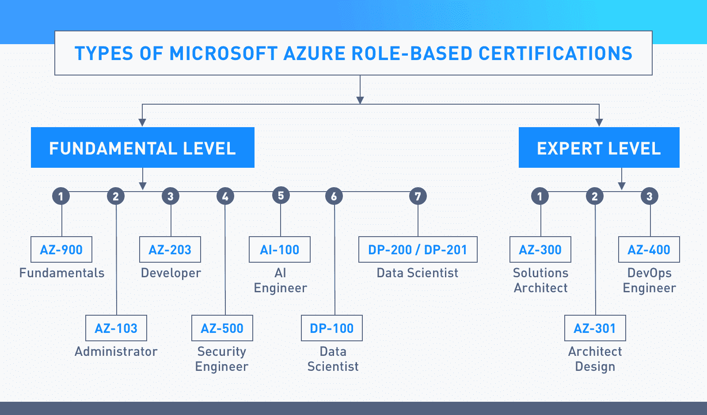

## 基础级别 Microsoft Azure 认证

基础级 Microsoft Azure 认证由以下认证和考试组成。

[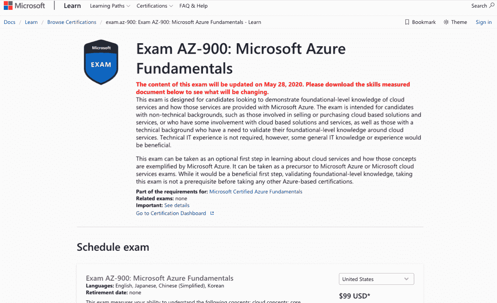](https://docs.microsoft.com/en-us/learn/certifications/exams/az-900)

这是微软 Azure 的第一级认证，专门用于验证相关候选人拥有关于微软 Azure 云服务的所有基础知识。该认证非常适合没有技术背景的候选人，旨在让他们了解云计算服务，这些服务可以帮助他们的日常业务安排和工作职责，包括使用微软 Azure 云服务的销售、营销和采购。

认证涵盖的信息:

1.  深入了解与云计算相关的概念，如 HA(高可用性)、灾难恢复、可扩展性、资本支出和运营支出的区别以及 FT(容错)。
2.  描述区域、区域可用性和资源组。
3.  Azure 架构的组件。
4.  Azure 资源管理器。
5.  关于 Azure 防火墙、Azure 订阅、网络安全组(NSG)和 DDoS 保护的详细信息。
6.  了解 Azure 订阅流程、购买方法、免费帐户服务的使用以及定价计算。

关于考试的信息:

| 先验知识 | 没有人 |
| 考试中的问题数量 | 40 到 60 岁 |
| 考试时间 | 85 分钟 |
| 最低分数要求 | 700 |
| 证书的总成本 | $99 |

准备认证的推荐在线课程:[微软 Azure 基础知识 AZ-900 考试准备](https://click.linksynergy.com/deeplink?id=jU79Zysihs4&mid=39197&murl=https://www.udemy.com/course/az900-azure/)

## 协理级微软 Azure 认证

[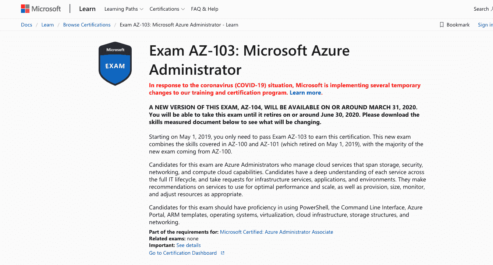](https://docs.microsoft.com/en-us/learn/certifications/exams/az-103)

微软 Azure 管理员认证于去年 2019 年 5 月 1 日创立，目的是验证候选人在监控、控制、实施和维护微软 Azure 安全服务方面的知识和技能。该认证确认候选人了解 Microsoft Azure 提供的计算流程、存储、安全和网络服务。该考试是之前两个考试的更新版本，这两个考试被标识为 Microsoft Azure Associate Exam AZ-100 和 AZ- 101。

认证涵盖的信息:

1.  学习管理 Azure 订阅和免费帐户服务。
2.  确定资源组，并学习以最佳方式分析资源利用率。
3.  获取有关消费的信息，并在 Microsoft Azure 中管理基于角色的访问。
4.  了解虚拟网络的配置流程和管理。
5.  了解 Azure 文件和 Azure 备份的功能和用法。
6.  实现 Azure 负载平衡器。
7.  了解网络安全小组(NSG)。
8.  了解创建和有效管理 Microsoft Azure Directory (AD)对象、用户和组的方法。

关于考试的信息:

| 先验知识 | 微软 Azure 基础知识测试 AZ-900 |
| 考试中的问题数量 | 40 到 60 岁 |
| 考试时间 | 150 分钟 |
| 最低分数要求 | 700 |
| 证书的总成本 | $165 |

你可以在这里注册。

[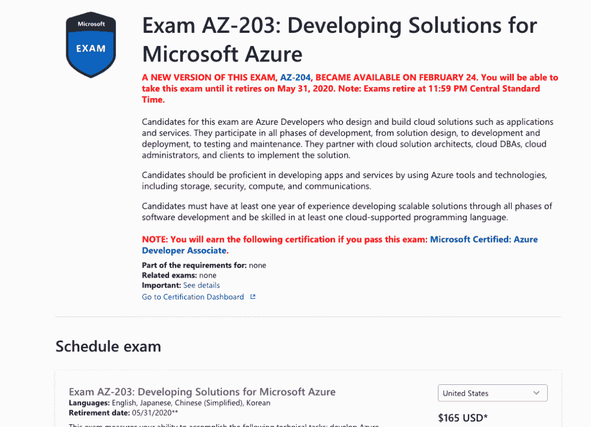](https://docs.microsoft.com/en-us/learn/certifications/exams/az-203)

微软 Azure 开发者认证是专门为开发者设计的。通过本课程的候选人被验证具有设计、构建和维护云应用服务的技能。通过该认证的候选人可以与云数据库管理员(DBA)、云计算架构师、云管理员甚至客户进行协调。除此之外，候选人还精通一种支持[编程语言](https://hackr.io/blog/what-is-programming-language)的云平台，拥有一年可扩展解决方案的软件开发经验。

认证涵盖的信息:

1.  您将学习创建 ARM (Azure 资源管理器)模板和管理批处理作业。
2.  获得创建 AKS(Azure Managed Kubernetes Services)集群的能力，甚至学习开发容器映像。
3.  培养开发应用服务的技能，包括 web 应用、移动应用、API 应用，实现其他各种 Azure 功能。
4.  您将能够为存储表的使用创建解决方案，包括 blob 存储和 Cosmos DB 存储。
5.  访问关系数据库。
6.  能够实现 Azure 安全系统进行身份验证、控制和保护数据。
7.  您将学习应用自动缩放规则和模式。
8.  将获得整合内容交付和缓存的能力。
9.  能够使用 Azure Monitor 对解决方案进行分析和故障排除。

关于考试的信息:

| 先验知识 | 微软 Azure 基础知识测试 AZ-900 |
| 考试中的问题数量 | 40 到 60 岁 |
| 考试时间 | 150 分钟 |
| 最低分数要求 | 700 |
| 证书的总成本 | $165 |

你可以在这里注册。

[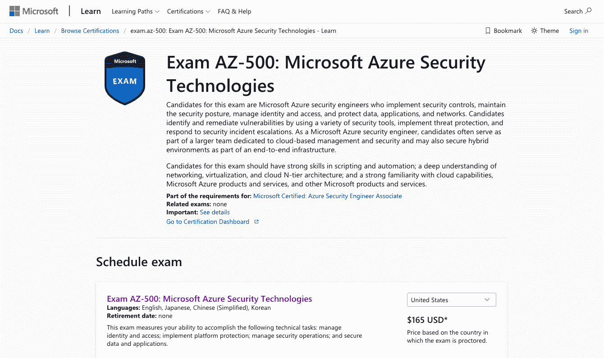](https://docs.microsoft.com/en-us/learn/certifications/exams/az-500)

微软 Azure 安全工程师，顾名思义，是专门为那些希望学习、实施和管理安全控制、访问管理，并负责保护云计算数据和其他相关信息(包括应用程序和网络)的工程师服务的。本课程的认证候选人验证此人能够管理和保护基于云的解决方案，包括作为端到端基础架构一部分的混合部分。为了通过这项考试，候选人需要获得自动化、脚本、虚拟网络方面的技能，并发展虚拟技术的其他相关技能。除此之外，关于微软云计算服务和各种可用产品的知识也会增加分数。

认证涵盖的信息:

1.  您将学习为不同类型的工作负载配置 MS AD。
2.  能够使用 Azure AD 特权身份管理服务。
3.  掌握应用 Azure 租户安全系统的知识。
4.  学习实施网络和容器安全系统。
5.  能够配置 Azure monitor、Azure 日志分析、安全策略和管理安全警报。
6.  学习使用 SSL/TLS 应用和管理数据基础架构的安全性，并管理数据的密钥库和加密。

关于考试的信息:

| 先验知识 | 微软 Azure 基础知识测试 AZ-900 |
| 考试中的问题数量 | 40 到 60 岁 |
| 考试时间 | 150 分钟 |
| 最低分数要求 | 700 |
| 证书的总成本 | $165 |

备考认证推荐在线课程:[微软 Azure Security AZ-500 认证考试练习题](https://click.linksynergy.com/deeplink?id=jU79Zysihs4&mid=39197&murl=https://www.udemy.com/course/exam-azure-2/)

[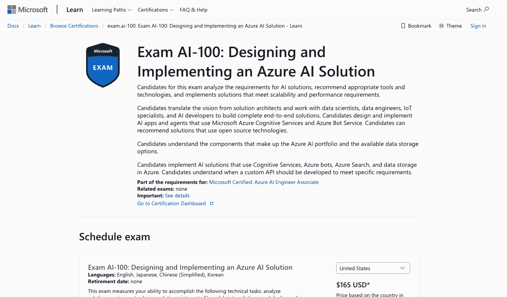](https://docs.microsoft.com/en-us/learn/certifications/exams/ai-100)

微软 Azure 人工智能工程师是一个准水平考试，旨在为有意应用微软人工智能解决方案的候选人设计。这些知识包括自然语言处理系统、计算机视觉、机器人、语音，甚至认知服务、知识挖掘和机器学习的使用。认证候选人验证有能力分析人工智能解决方案的不同要求。他们可以推荐适当的工具、技术和解决方案，以有效地满足可伸缩性和所需的性能结果。

认证涵盖的信息:

1.  您将学会选择最合适的处理架构和数据处理技术，用于处理人工智能服务，并认识到自动化是解决方案的一部分。
2.  学习设计有助于接收和输出数据的策略，并集成机器人和人工智能解决方案。
3.  能够定义用户将如何认证人工智能服务。
4.  创建人工智能管道，并学习实现工作流和数据记录过程。
5.  监控不同的[人工智能组件](https://becominghuman.ai/the-working-components-of-ai-26f7b0ca61de?gi=d20e71931a79)的可用性、改进和建议更改。

关于考试的信息:

| 先验知识 | 微软 Azure 基础知识测试 AZ-900 |
| 考试中的问题数量 | 62 |
| 考试时间 | 220 分钟 |
| 最低分数要求 | 700 |
| 证书的总成本 | $165 |

备考认证推荐在线课程: [AI-900 微软 Azure AI 基础认证](https://click.linksynergy.com/deeplink?id=jU79Zysihs4&mid=39197&murl=https://www.udemy.com/course/exam-microsoft-azure-4/)

[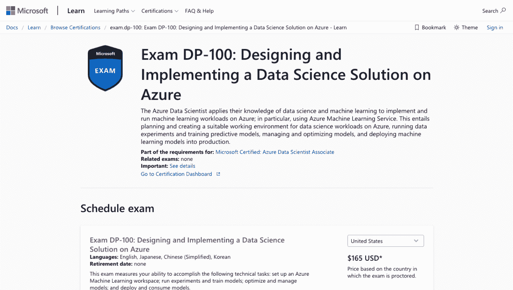](https://docs.microsoft.com/en-us/learn/certifications/exams/dp-100)

Microsoft Azure 数据科学家是一项助理级考试，旨在测试候选人在 Microsoft Azure 上设计和实施数据科学解决方案的技能和知识。经认证的候选人验证有能力将不同的 Azure 机器学习方法应用于培训、评估以及部署用于解决各种业务问题和难题的模型。

认证涵盖的信息:

1.  您将学习创建和配置各种 Microsoft Azure 数据科学环境。
2.  能够访问部署环境约束并对其进行分析，以推荐最能满足系统需求的工具。
3.  配置数据并将其转换为可用的数据集，并识别异常情况。
4.  能够应用功能进行选择、提取和缩放。
5.  识别数据不平衡并评估模型性能。

关于考试的信息:

| 先验知识 | 微软 Azure 基础知识测试 AZ-900 |
| 考试中的问题数量 | 40-60 |
| 考试时间 | 180 分钟 |
| 最低分数要求 | 700 |
| 证书的总成本 | $165 |

你可以在这里注册。

### 7.微软 Azure 数据科学家(联合考试 DP-200 和 DP-201)

要通过微软 Azure 数据科学家的认证，有两个考试。这些是 DP-200 和 Dp-201。先从了解 DP-200 考试开始。

[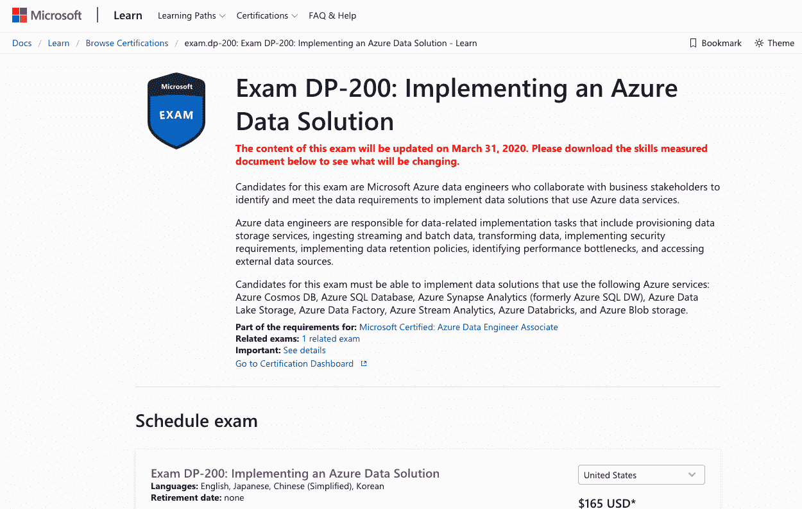](https://docs.microsoft.com/en-us/learn/certifications/exams/dp-200)

DP-200 考试是专门为测试考生实现各种 Azure 数据解决方案的学习而设计的，包括提供数据存储、开发流、实现安全性、访问外部数据源和批处理。除此之外，候选人需要获得访问外部数据源和实施数据保留政策的能力。经认证的候选人被验证具有应用 Azure SQL、Azure Cosmos DB、Azure Steam Analytics 和 Blob 存储服务的技能。

认证涵盖的信息:

1.  您将学习实现关系型和非关系型数据存储解决方案。
2.  能够通过实施数据加密和数据屏蔽技术来管理数据安全系统。
3.  创建流和批处理解决方案。
4.  监控数据处理、数据存储，并完成 Azure 数据解决方案。
5.  学习加密静态和动态数据。

关于考试的信息:

| 先验知识 | 微软 Azure 基础知识测试 AZ-900 |
| 考试中的问题数量 | 46 |
| 考试时间 | 180 分钟 |
| 最低分数要求 | 700 |
| 证书的总成本 | $165 |

准备认证的推荐在线课程: [DP-200:实施 Azure 数据解决方案](https://click.linksynergy.com/deeplink?id=jU79Zysihs4&mid=39197&murl=https://www.udemy.com/course/dp200exam/)

[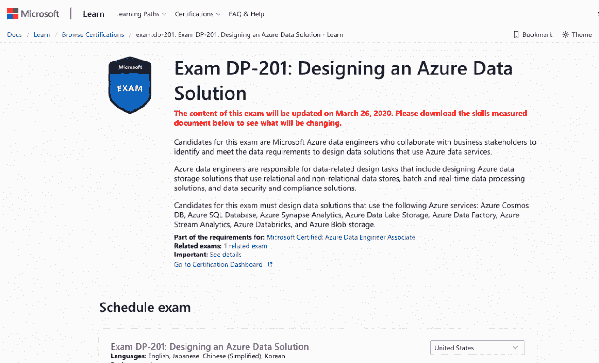](https://docs.microsoft.com/en-us/learn/certifications/exams/dp-201)

第二项考试是 DP-201，旨在评估候选人设计 Microsoft Azure 数据解决方案的能力。在这次考试中，将测试候选人设计数据存储、处理和安全应用程序的能力，以满足 Microsoft Azure 服务的合规性。认证候选人经过验证，具有设计微软 Azure SQL、Azure 数据湖、Azure 流分析、Blob 存储服务和 Azure Cosmos DB 的技能。

认证涵盖的信息:

1.  您将学习设计不同的关系型和非关系型云数据存储。
2.  能够设计实时和批处理解决方案。
3.  我们正在设计安全解决方案，包括加密、审计和数据隐私。
4.  配置数据保留策略。
5.  能够规划归档策略。

关于考试的信息:

| 先验知识 | 微软 Azure 基础知识测试 AZ-900 |
| 考试中的问题数量 | 44 |
| 考试时间 | 150 分钟 |
| 最低分数要求 | 700 |
| 证书的总成本 | $165 |

准备认证的推荐在线课程: [DP-201:设计 Azure 数据解决方案考试](https://click.linksynergy.com/deeplink?id=jU79Zysihs4&mid=39197&murl=https://www.udemy.com/course/azuredp201/)

## 专家级 Microsoft Azure 认证

专家级微软 Azure 认证有两次专家考试，包括再次考试 AZ- 300 和 AZ-301。先来了解一下关于考试 AZ-300。

[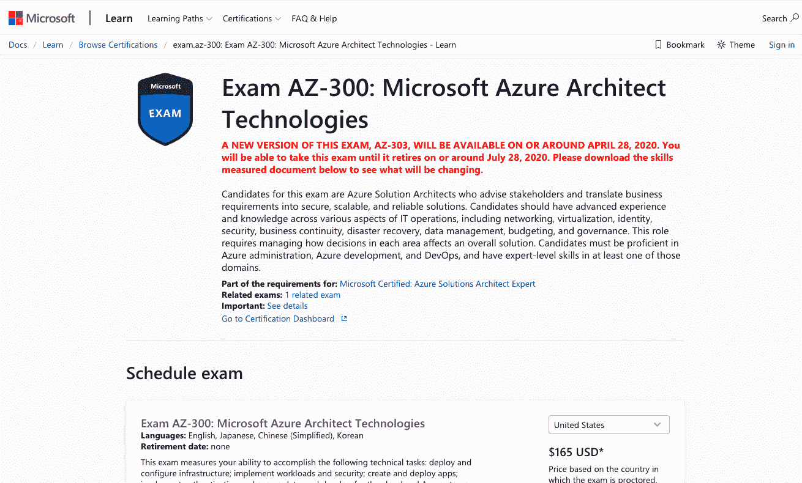](https://docs.microsoft.com/en-us/learn/certifications/exams/az-300)

Microsoft Azure Solutions Architect 专家级考试 AZ-300 专门面向对使用云计算系统和企业解决方案感兴趣的考生。该考试测试候选人向企业交付安全、可靠的 Azure 云解决方案的能力。候选人需要增强 IT 运营方面的知识和技能，包括虚拟化、网络、数据管理、预算、灾难恢复管理、业务连续性和安全性方面的专业知识。该认证验证了候选人在应用 Microsoft Azure 进行业务运营、开发和管理方面的所有要求的熟练程度。

认证涵盖的信息:

1.  你将学会分析资源利用过程。
2.  应用资源管理器模板。
3.  创建和验证虚拟网络系统和连接。
4.  正在配置存储帐户。
5.  管理 Azure active directory。
6.  使用基于角色的访问迁移到 Azure。
7.  配置无服务器计算系统。
8.  实施角色平衡和内部集成的应用程序。
9.  创建和应用 AKS (Azure Kubernetes 服务)。
10.  为安全数据解决方案实施多级和多因素身份认证流程。

关于考试的信息:

| 先验知识 | 微软 Azure 基础知识测试 AZ-900 |
| 考试中的问题数量 | 40-60 |
| 考试时间 | 150 分钟 |
| 最低分数要求 | 700 |
| 证书的总成本 | $165 |

你可以在这里注册。

[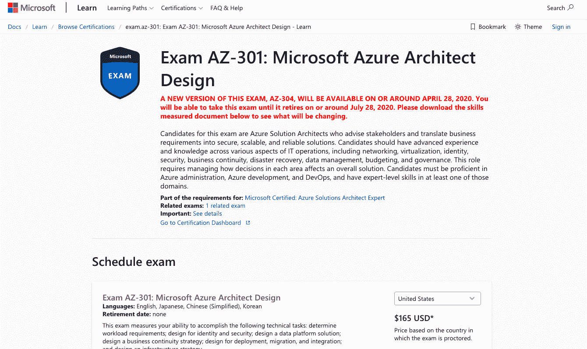](https://docs.microsoft.com/en-us/learn/certifications/exams/az-301)

微软 Azure Architect 设计是专家考试 AZ-301 的第二部分。该认证要求候选人在识别 Microsoft Azure 的各个方面方面具有深入的知识和专业技能，并有效地将其用于各种目的，如数据管理、虚拟化、网络、安全、灾难恢复等。这是候选人在 Microsoft Azure 中可以获得的最高级别，并确定了候选人在一家声誉良好的公司中的最高职位。

认证涵盖的信息:

1.  您将学习使用 Microsoft Azure 设计、计算、存储、联网和监控策略。
2.  能够收集所需的信息，并为日志的逻辑分组和数据存储开发基础设施。
3.  学习设计数据管理和风险防范技术，以更好地监控和保护数据。
4.  配置文档数据流和数据保护策略。
5.  创建站点恢复和数据归档策略。
6.  设计和部署 API 集成策略。

关于考试的信息:

| 先验知识 | 微软 Azure 基础知识测试 AZ-900 |
| 考试中的问题数量 | 40-60 |
| 考试时间 | 150 分钟 |
| 最低分数要求 | 700 |
| 证书的总成本 | $165 |

你可以在这里注册。

## 微软 Azure 最后一次期末考试是哪一次？

微软 Azure 最后也是最后一次考试是微软 Azure DevOps 工程师。

[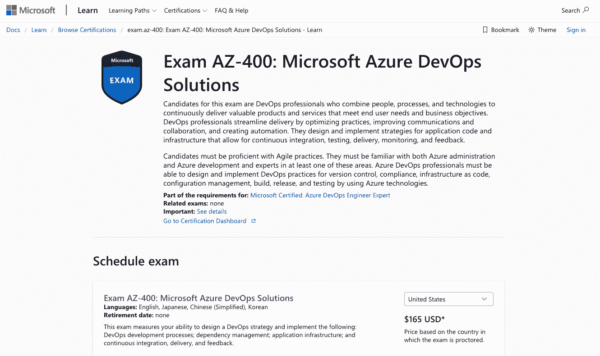](https://docs.microsoft.com/en-us/learn/certifications/exams/az-400)

微软 Azure DevOps 工程师是最终和结论性的专家考试 AZ-400，旨在测试候选人使用微软 Azure 的所有功能和组件交付云服务的专业能力。该考试回顾了所有早期的考试，目的是证明候选人具备成为 Microsoft Azure DevOps 工程师所需的所有能力和技能。该认证证明候选人有能力设计、交流、协作、实现、编码、创建自动化、监控和交付 Microsoft Azure 的各个方面。想要通过这次考试的候选人需要对敏捷实践和 Azure 开发和运营流程有很高的熟练程度。

认证涵盖的信息:

1.  您将学习使用 Microsoft Azure 设计安全的开发生命周期。
2.  能够访问和应用整合流程的工具。
3.  为 DevOps 策略应用程序设计和实施各种版本的控制。
4.  学习以代码的形式实现、集成和管理基础设施。
5.  管理托管 AKS (Azure Kubernetes 服务)基础架构。
6.  创建乐观的反馈机制。

关于考试的信息:

| 先验知识 | Azure 管理员助理/Azure 开发人员助理认证 |
| 考试中的问题数量 | 40-60 |
| 考试时间 | 150 分钟 |
| 最低分数要求 | 700 |
| 证书的总成本 | $165 |

准备认证的推荐在线课程:AZ-400 设计和实施 [DevOps 认证](https://hackr.io/blog/best-devops-certification)

## 结论

总之，微软 Azure 认证要求候选人通过各种级别的验证和认证。这是 It 界要求最高的认证，需要候选人真诚的努力和承诺才能通过。成功的候选人将能够在全球知名公司获得更好的职位和更高的薪酬。

你还有什么想和我们社区分享的课程吗？请在下面的评论中告诉我们！

**人也在读:**