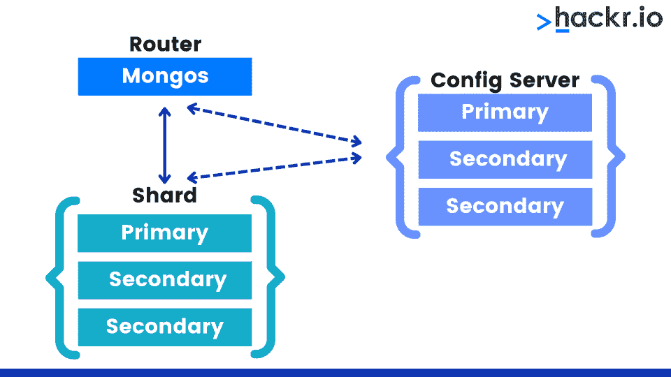
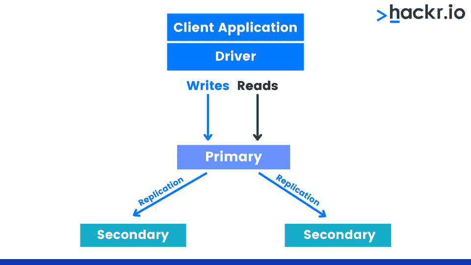
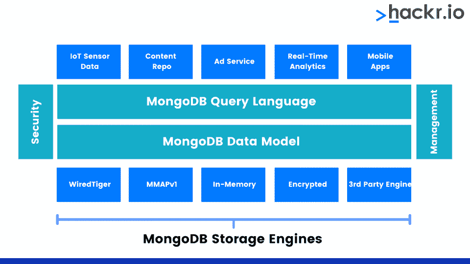

# 2023 年 50+热门 MongoDB 面试问答

> 原文：<https://hackr.io/blog/mongodb-interview-questions>

MongoDB 是一个基于文档的数据库程序，由 10gen software 于 2007 年开发，现在称为 MongoDB Inc. MongoDB 使用类似 JSON 的文档和可选模式，是一个 NoSQL 数据库程序。

这些年来，MongoDB 越来越受欢迎，尽管它仍然落后于 MySQL 和其他公司。它对以文档为中心的数据很有好处，许多开发人员都想在某种程度上了解它。对于某些角色，将测试您的 MongoDB 知识。

这里我们列出了排名靠前的 MongoDB 面试问答，分为基础题和高级题。

## **热门 MongoDB 面试问答**

### **MongoDB 基础面试问题**

#### **1。什么是 Mongo shell？**

Mongo shell 是 MongoDB 的 JavaScript 接口，可用于查询和更新数据。它是交互式的，也可用于执行管理操作。

#### **2。MongoDB 如何存储数据？**

由于是基于文档的，MongoDB 以 BSON 或二进制 JavaScript 对象符号存储文档，这是 JSON 的二进制编码格式。

#### **3。MongoDB 是什么类型的 NoSQL 数据库？**

它是一个文档数据库，包含具有键值对、键数组对和嵌套文档的文档。

#### **4。列出 MongoDB 的重要特性。**

MongoDB 的一些重要特性是:

*   使用无模式数据库
*   没有复杂的连接
*   由于工作集(内存)的存在，访问数据的速度更快
*   聚合、分片和复制等特性使其易于使用
*   跨平台和基于文档
*   自动故障转移和高可用性

#### **5。MongoDB 中的数据模型有哪些？**

数据建模依赖于文档的结构。在 MongoDB 中，这可以通过两种方式实现:

*   嵌入到单个文档结构中的相关数据(嵌入式数据模型)
*   通过从一个文档到另一个文档的引用，存储数据之间的关系([规范化数据模型)](https://hackr.io/blog/dbms-normalization)

#### **6。MongoDB 被称为无模式数据库。如果是，如何在 MongoDB 中创建模式？**

更正确的说法是，MongoDB 具有动态类型的模式，因为它依赖于 JSON，这是一种无模式的数据结构。要创建模式，请创建并插入文档。插入文档后，将在数据库中创建相应的集合。

#### 7 .**。什么是名称空间？**

名称空间是数据库名称和集合名称的串联。

示例:students.the subject 是集合，其中 students 是数据库和主题。

#### **8。如何在 MongoDB 中执行 CRUD 操作？**

*   **C**–Create:db . collection . insert()；
*   **R**–Read:db . collection . find()；
*   **U**–Update:db . collection . Update()；
*   **D**–Delete:db . collection . remove({ " field name ":" value " })；

#### **9。在 MongoDB 中约束是如何管理的？**

从 MongoDB 3.2 开始，您可以在集合上添加一个文档验证器。也可以使用 db . collection . create index({ " key ":1 }，)创建唯一索引；

#### 10。什么是 BSON？

BSON 或二进制 JSON 是 JSON 的二进制编码格式。它扩展了 JSON，提供了更多的数据类型和字段。

#### **11。MongoDB 如何处理索引？**

索引是使用 ensureIndex()方法完成的。语法是:

```
db.COLLECTION_NAME.ensureIndex()
```

#### **12。命名为新集合创建的默认索引。**

为新集合创建的默认索引是 _id

#### 13。MongoDB 中的分片是什么？

****

MongoDB 使用分片来满足数据增长，这意味着跨各种机器对数据记录进行排序。每个碎片都是一个副本集。

#### **14。使用 MongoDB 命名两个存储引擎？**

MMAPv1 和 WiredTiger 是 MongoDB 使用的两个存储引擎。

#### 15。如何在 MongoDB 中创建和删除集合？

*   **创建集合:**db . Create collection()；
*   **Drop 集合:**db . collection . Drop()；

#### 16。如何在 MongoDB 中存储图像、视频和其他大文件？

大型文件使用 GridFS 规范存储在 MongoDB 中。

#### **17。MongoDB 在哪些方面优于 MySQL？**

MongoDB 有一个灵活的数据模型，其中的模式可以根据业务需求进行扩展。此外，MongoDB 更快，可以处理更多的数据类型，以便更好地管理实时应用程序。

18。列出集合中所有索引的命令是什么？

命令是 db . collection . getindexes()；

#### **19。MongoDB 如何执行文本搜索？**

可以使用文本索引进行文本搜索。这里有一个例子:

```
db.collection_name.ensureIndex();
```

#### 20。将更新写入磁盘的默认时间间隔是多少？

默认时间间隔是 60 秒。

#### **21。列出一些 MongoDB 支持的数据类型。**

一些数据类型是数字、字符串、数组、二进制数据、布尔值、日期、正则表达式、ObjectId 等。

#### **22。应用程序如何访问实时数据变化？**

应用程序可以使用更改流访问实时数据更改，更改流充当所有收集操作(如插入、删除和更新)的订阅者。

#### **23。创建数据备份和恢复数据的命令是什么？**

*   mongodump 用于创建备份。
*   mongorestore [backup_path]用于恢复数据。

#### **24。MongoDB 支持外键约束吗？**

不，MongoDB 不支持外键约束。由于文档结构的原因，MongoDB 提供了定义关系的灵活方式。

### **MongoDB 高级面试问题**

#### **25。什么是覆盖查询，为什么它很重要？**

在覆盖查询中，查询中使用的所有字段都创建了索引。返回的结果也应该是索引的一部分。正因为如此，MongoDB 在不实际查看文档内部的情况下获取结果，从而节省了时间并提高了效率。

#### **26。MySQL 和 MongoDB 有什么区别？**

| **MySQL** 的实现 | **MongoDB** |
| 用 C 和 C++写的 | 用 C++和 JavaScript 写的 |
| 遵循 RDBMS 数据库结构 | 基于文档的结构 |
| 垂直缩放 | 水平和垂直缩放 |
| 严格定义的数据结构，模式是严格的，应该在开始时定义 | 复杂文档的动态灵活模式创建 |
| 使用结构化查询语言 | 使用非结构化查询语言 |
| 使用联接来链接两个或多个表中的数据 | JOIN 没有对等词 |
| 对于包含非结构化数据的大型数据库，性能很慢 | 高效处理大型非结构化数据 |
| 相对不太适合基于云的环境 | 基于云的服务的最佳选择 |

#### **27。什么是 ObjectId？它是如何构成的？**

ObjectId 是一个类，它是 MongoDB 中文档的默认主键。它位于插入文档的 _id 字段中。它是使用默认算法生成的 12 字节 BSON 类型。其结构是:

*   一个 4 字节的值，表示自 Unix 纪元以来的秒数
*   3 字节机器 id
*   2 字节的进程 id
*   以随机数开始的 3 字节计数器

#### **28。什么是复制，什么是主副本集和辅助副本集？**

****

复制意味着跨多台服务器同步数据。它提高了数据可用性。如果一台服务器丢失，其他服务器中的数据仍然完好无损。

*   **主副本集:** MongoDB 只将数据写入主副本集。
*   **辅助副本集:**辅助或从属节点只能接受读取。它们从原始细胞复制而来。

#### **29。什么是日志，它是如何工作的？**

MongoDB 通过使用为每次写入创建的磁盘日志来确保数据完整性。在服务器崩溃的情况下，日志可用于跟踪未写入磁盘或数据文件的写入。

#### 三十岁。比较一下 CouchDB 和 MongoDB。

| **CouchDB** | **MongoDB** |
| 数据模型是面向文档的，即 JSON | 使用 BSON，它是 JSON 的扩展 |
| 使用 HTTP/REST 进行查询 | 通过 TCP/IP 使用标准协议 |
| 数据库有文档 | 数据库包含集合，集合包含文档 |
| 用 Erlang 写的 | 用 C++写的 |
| 使用范围查询和映射/缩减 | 使用基于对象的查询语言和 map/reduce |

#### 31。MongoDB 中有哪些不同的索引类型？

*   **默认值:**这是 MongoDB 创建的 _id
*   **单个字段:用于对单个字段进行索引和排序**
*   **复合:**用于多个字段
*   **多键:**用于索引数组数据
*   **散列:**索引字段值的散列
*   **地理空间:**查询地理空间(位置)数据

#### 32。什么是 ACID 交易？MongoDB 支持吗？

酸代表原子性、一致性、隔离性和持久性。事务管理器确保这些属性得到处理。MongoDB 版支持 ACID。

#### 33。解释剖析器的作用。

分析器是一个内置的工具，它可以找出速度慢且占用大量资源的查询，并提供查询级别的洞察。您可以用它来分析查询。探查器将所有数据存储在 system.profile 集合中。

#### 34。MongoDB 如何处理事务和锁？

MongoDB 使用多粒度锁定来锁定全局、数据库或集合级别的操作。由存储引擎来实现并发级别。例如，在 WiredTiger 中，它位于文档级别。对于读取，有一个共享锁定模式，而对于写入，有一个独占锁定模式。

#### 35。解释 MongoDB 中的聚合。

聚合对来自不同文档的值进行分组，并对数据执行操作以返回单个结果。MongoDB 执行聚合的方式有三种:

*   聚合管道
*   地图缩小功能
*   单一目的聚集方法

#### 36。说明 find()和 limit()方法之间的区别。

find():只显示选定的数据，而不是文档的所有数据。例如，如果您的文档有 4 个字段，但您只想显示一个，则将必填字段设置为 1，其他字段设置为 0。

```
db.COLLECTION_NAME.find({},);
```

limit(): limit 函数限制提取的记录数。例如，如果您有 7 个文档，但只想显示集合中的前 4 个文档，请使用 limit。语法–

```
db.COLLECTION_NAME.find().limit(NUMBER);
```

#### 37。并发如何影响主副本集？

当集合更改被写入主数据库时，MongoDB 会将相同的内容写入本地数据库中的一个特殊集合，该集合称为主数据库的 oplog。因此，集合的数据库和本地数据库都被锁定。

#### 38。举一个 MongoDB 中 insert，delete，update 语句的例子。

| 插入 | 

```
db.books.insert({   _id: ObjectId(7df74fd8902c),   title: 'All about MongoDB',    description: 'Everything you need to know about MongoDB',   by: 'Author1',   url: 'http://www.blogsuthor1.com'  })
```

 |
| 删除 | 删除特定文档-

```
db.books.remove({'title':'All about MongoDB'})
```

移除所有文件-

```
db.books.remove();
```

 |
| 更新 | 要更新现有文档的值-

```
db.books.update({'title':'All 

about MongoDB'},{$set:{'title':'MongoDB for dummies'}})
```

用新文档替换现有文档一个基于 ObjectId–

```
db.books.save(

 {

"_id" : ObjectId(5983548781331adf45ec5), "title":"MongoDB for dummies",

"by":"Author2"

 }

)
```

 |

#### 39。什么是封顶集合？

上限集合是固定大小的集合，根据插入顺序插入和检索数据。如果集合的空间已满，最早的记录将被集合中的新文档覆盖。

#### 40。解释 map-reduce 命令的用途。

Map-reduce 是一种执行聚合的方法。

*   Map 函数发出指定的键值对。
*   Reduce 函数组合键值对并返回聚合结果。

语法:

```
db.collection.mapReduce( 

function() {emit(key,value);}, 

function(key, values) {return aggregatedResult}, { out: collection } 

</pre.

 )
```

#### 41。MongoDB 和 Cassandra 有什么区别？

| **特性** | **MongoDB** | 卡桑德拉 |
| **数据的结构** | 当没有清晰的数据结构时，即数据是结构化和非结构化的混合时，使用的最佳数据库 | 适用于非结构化和结构化数据，尤其是当数据库预计会动态增长时 |
| **数据模型** | 有一个丰富而富于表现力的数据模型，它是面向数据的。任何数据结构都可以很容易地表示。 | 表格中的行和列的传统模型。每一列都是特定的类型，这使得结构有组织。 |
| **主节点数量** | 集群中只有一个主节点，它控制许多从节点。 | 集群中有许多主节点。 |
| **二级指标** | 索引任何属性都很容易，因为二级索引是一级结构。 | 辅助索引仅限于单个列，灵活性较差。 |
| **可扩展性** | 对于要写入从节点的数据，它必须通过单个主节点，因此可伸缩性不是很好。 | 因为有许多主节点，所以数据存在于多个节点中。因此，可扩展性相对较好。 |
| **聚合框架** | 内置聚合框架 | 没有内置的聚合框架 |

#### **42。MongoDB 中的索引是什么？**

在 MongoDB 中，索引有助于高效地执行查询。索引是特殊的数据结构，以易于遍历的形式存储部分集合。默认情况下，在创建集合时，MongoDB 会在 _id 字段上创建一个永久的惟一索引。它可以防止数据库中出现重复的文档。

#### **43。MongoDB 中的存储引擎是什么？**

****

存储引擎是数据库的一个组件，它管理数据在内存和磁盘中的存储方式。MongoDB 支持多个存储引擎，这有助于提高不同工作负载的性能。默认的存储引擎是 WiredTiger (MongoDB3.2)，它非常适合大多数工作负载。

#### **44。解释一下 MongoDB 中日志工作的工作机制？**

当 MongoDB 意外退出时，日志记录用于恢复最后一个检查点之后的信息。存储引擎(WiredTiger)为发起写操作的每个客户端创建一个日志记录。

如果有更新，单个日志记录将记录更新操作和索引修改。日志记录使用内存缓冲存储。日志文件存储在 MongoDB 创建的“Journal”目录下。

#### **45。可以配置 MMAPv1 的缓存大小吗？**

无法为 MMAPv1 配置缓存大小。MongoDB 通过内存映射文件自动使用所有空闲内存。

#### **46。什么是 GridFS？**

GridFS 存储和检索大型文件，如图像、音频和视频文件等。虽然存储文件的限制是 16MB，但是 GridFS 可以存储比这个更大的文件。GridFS 将文件分成块，并将每个块存储为不同的文档，最大大小为 255k。它使用两个集合 fs.chunks 和 fs.files 分别存储块和元数据。

#### **47。有可能在一个 MongoDB 实例中运行多个 Javascript 操作吗？**

是的，我们可以在一个 MongoDB 实例中运行多个 JS 操作。通过 mongo shell 实例，我们可以指定要在服务器上运行的 JavaScript 文件的名称。该文件可以包含任意数量的 JS 操作。

#### **48。MongoDB 是最好的 NoSQL 数据库吗？如果是，为什么？**

MongoDB 是最适合数据分析和 web 应用程序开发的 NoSQL 数据库。它帮助开发人员和数据科学家从存储的数据中获得洞察力，不像 Hadoop 需要专家分析数据。

MongoDB 允许高效的数据操作和管理功能。对多种 Javascript 操作的支持和基于 JavaScript 的 MEAN stack 增加了 MongoDB 的受欢迎程度。用于构建管道的水平扩展和聚合框架的分片使得 MongoDB 快速高效，因此是最好的数据库。

#### 49。解释一下 MongoDB 中事务/锁的流程？

MongoDB 支持读写锁的多粒度锁定。

MongoDB 中可能有三种类型的锁定机制:

*   全球一级
*   数据库级别
*   收集级别

实现也依赖于单个存储引擎。有四种锁定模式:

*   r(共享锁)，
*   w(独占锁)，
*   r(意向共享锁)，
*   w(意向排他锁)。

要了解更多信息，请访问:

[官方文档页面。](https://docs.mongodb.com/manual/core/transactions/index.html)

#### 50。解释一下 MongoDB 和 RDBMS 有什么不同？

| **参数** | **RDBMS** | **MongoDB** |
| **定义** | 这是一个关系数据库管理系统 | 它是一个非关系数据库管理系统 |
| **工作** | 处理使用行和列的表之间的关系 | 使用文档和字段的面向文档的系统 |
| **分级数据存储** | 难以存储分层数据 | 存储分层数据的内置配置 |
| **可扩展性** | 垂直可扩展 | 纵向和横向可扩展 |
| **性能** | 性能随着 RAM 容量的增加而提高 | 性能随着处理器数量的增加而提高 |
| **模式** | 必须预先决定和设计模式；对模式的改变是困难的 | 模式的动态创建和管理使设计更加灵活 |
| **支持加入** | 支持复杂连接 | 不支持连接 |
| **查询语言** | 使用 SQL 查询数据库 | BSON 用于数据库查询 |
| **支持 Javascript** | 不支持基于 JavaScript 的客户端查询数据库 | 为基于 Javascript 的客户端查询数据库做准备 |

#### 51。解释启动 MongoDB 服务器/实例的过程。

要启动 MongoDB 实例，请执行以下步骤:

*   首先，打开命令提示符并运行 mongod.exe。
*   或者，您可以移动到 MongoDB 的安装路径，例如，“C: MongoDB”
*   导航到 bin 文件夹，找到 mongod.exe 并双击它执行。
*   也可以导航到需要的文件夹，例如“C: MongoDB/bin”，输入 mongo 通过 shell 连接 MongoDB。

## **结论**

你现在知道了一些面试中最常见的 MongoDB 问题。这应该有助于您为下一个角色做好准备，甚至有助于您对 MongoDB 有一个大致的了解。

如果你正在寻找更多基于非 SQL 数据库的面试问题，这里有一个很棒的课程: [MongoDB 面试问答](https://click.linksynergy.com/deeplink?id=jU79Zysihs4&mid=39197&murl=https%3A%2F%2Fwww.udemy.com%2Fcourse%2Fmongodb-interview-questions-answers%2F&u1=blog%2Fmongodb-interview-questions_amcid-2Iz2BOrbzrVepFOEME6Ix)。这里有一个关于数据结构和基本编程语言的一般编程问题的很棒的课程:[破解 IT 架构师面试](https://www.packtpub.com/application-development/cracking-it-architect-interview)。

当然，你还可以学习更多的东西，所以不要回避学习课程。始终实践理论，并在网上寻找更多的资源。

## **常见问题解答**

#### **1。MongoDB 的面试问题有哪些？**

MongoDB 上有几种你可能会面临的面试问题。上面的列表很好地涵盖了其中的许多问题。

#### **2。为什么 32 位系统不选择 MongoDB？**

MongoDB 不支持 32 位系统，因为这些系统的 RAM 使用量限制为 2GB。这个限制对于在生产中运行某些东西是不够的。

**3。MongoDB 需要大量内存吗？**

是的，MongoDB 确实需要大量 RAM，因为出于性能原因，它将数据保存在缓存中。每 100，000 项资产需要大约 1 GB 的 RAM。

**人也在读:**