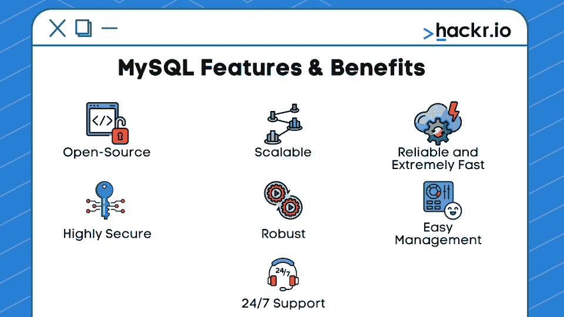
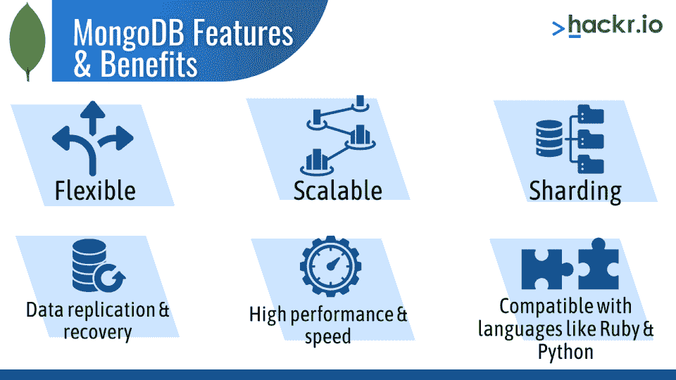

# MongoDB vs MySQL:你需要知道的区别[更新]

> 原文：<https://hackr.io/blog/mongodb-vs-mysql>

关系数据库管理系统(RDBMS)已经流行了几十年，尤其是对于基于 web 的企业应用程序。分布式和云计算的快速增长，以及用户对数据存储和管理的不断变化的期望，为两个最流行的开源数据库铺平了道路:MySQL 和 MongoDB。

在这里，我们将比较 MongoDB 和 MySQL 之间的差异，这将有助于您做出审慎的决定，并为您的应用程序选择最合适的数据库。我们从一个快速比较两者的表格开始。

## **MySQL vs MongoDB:势均力敌的对比**

| **参数** | **MongoDB** | **MySQL** 的实现 |
| **由**开发 | MongoDB 公司 | 甲骨文公司 |
| **模式** | 无模式 | 需要模式定义 |
| **数据类型** | 结构化和非结构化 | 结构化的 |
| **数据存储** | 类似 JSON 的文档 | 表格，即行和列 |
| **开发人员生产力** | 更快的 | 慢的 |
| **速度** | 快的 | 慢的 |
| **分布式架构** | 是 | 不 |
| **SQL 或 NoSQL** | NoSQL | 结构化查询语言 |
| **SQL 注入风险** | 降低 | 高等级的；级别较高的；较重要的 |
| **复制** | 内置复制、分片 | 主从和主复制 |

## **什么是 MySQL？**

[MySQL](https://hackr.io/blog/what-is-mysql) 是一个开源的关系数据库管理系统，它将数据存储在表中，并维护它们之间的关系。

它使用结构化查询语言(SQL)进行数据库访问，并具有非常强大的语法来创建简单和复杂的查询以检索和结构化数据。

MySQL 中的数据是有组织的，符合特定的格式，这有助于使它成为当今最流行的结构化数据库。

了解更多关于 NoSQL 和文档库的信息是值得的。这些是帮助理解 MongoDB 的先决条件。

一个 **NoSQL** ，或者不仅仅是 SQL，数据库的主要特征是它不像 RDBMS 那样以传统的表格格式存储数据。NoSQL 数据库处理海量数据，因此它们遵循分布式数据库模型。文档数据库、图形数据库、键值数据库和宽列存储是 NoSQL 家族中的四个主要分类。

[终极 MySQL 训练营](https://click.linksynergy.com/deeplink?id=jU79Zysihs4&mid=39197&murl=https%3A%2F%2Fwww.udemy.com%2Fcourse%2Fthe-ultimate-mysql-bootcamp-go-from-sql-beginner-to-expert%2F)

文档存储将数据作为 JSON 对象存储在文档中，文档的结构不必预先定义。数据可以嵌套，不需要像在关系数据库中那样连接数据。每个文档都可以比作关系数据库中的一个传统行，JSON 对象中的每个属性都可以比作一列。

## **什么是 MongoDB？**

[MongoDB](https://hackr.io/blog/what-is-mongodb-applications-advantages-examples) 是一个非关系的、非结构化的数据库**。**这个面向文档的数据库将您的数据存储在由单个文档组成的集合中。

在 MongoDB 中，文档是一个大的 JSON 对象，没有特定的格式或模式。MongoDB 以名为 BSON 的二进制编码格式表示 JSON 文档。

MongoDB 4.0 是 MongoDB 的最新发展，增加了多文档 ACID 事务、数据转换等特性。MongoDB Stitch——无服务器平台——让你直接从你的前端应用程序中执行任何 MongoDB 查询。缝合“触发器”让您的应用程序对实时数据变化做出响应。 [MongoDB Mobile](https://www.mongodb.com/products/mobile) 还为您的移动和物联网设备带来了文档模型的强大功能。

[Node.js，Express，MongoDB &更多:完整训练营 2023](https://click.linksynergy.com/deeplink?id=jU79Zysihs4&mid=39197&murl=https%3A%2F%2Fwww.udemy.com%2Fcourse%2Fnodejs-express-mongodb-bootcamp%2F)

## **MySQL 和 MongoDB 的相似之处**

*   MySQL 和 MongoDB 都是开源数据库。
*   它们建立在通用术语和概念的基础上，如在事务中维护 ACID(原子性、一致性、隔离性和持久性)属性；存储、分组、连接和管理数据；并且具有二级索引。
*   这两个数据库在所有主要的云平台上提供服务。
*   它们都有丰富的查询语言来访问数据。

## **MongoDB vs MySQL:差异**

### **1。数据存储和结构**

由于 MySQL 遵循关系模型，数据存储在表中，您必须根据需求以及必须在表中的字段之间设置的规则来预定义模式。

在 MongoDB 中，数据存储为集合中的文档，因此不需要定义文档的结构。如果向文档中添加了新字段，则可以创建该字段，而不会影响集合中的其他文档。这一关键差异对开发人员来说是一个很大的优势，因为代码定义了模式，您不必执行模式迁移。

### **2。开发人员生产力**

在 MySQL 中开发应用程序要慢得多，因为它使用了严格的表结构模型。

与此同时，在 MongoDB 中以灵活的 JSON 文档的形式处理数据将开发周期加快了 4 到 5 倍。这些文档自然地映射到面向对象的编程语言，使得开发人员可以很容易地将应用程序中的数据映射到数据库中的数据。

### **3。速度**

在 MySQL 数据库中，数据分布在多个表中，导致需要访问多个表来读写数据。

MongoDB 中的文档使应用程序速度更快，因为一个实体的所有数据都存储在一个文档中。这有助于在单一位置读取和写入数据。

尽管 MySQL 增加了对 JSON 的支持，但它并没有带来同样的生产力优势。

### **4。原子交易**

MySQL 支持原子事务，也就是说，在一个事务中可以有几个操作。在 MongoDB 引入对这些事务的支持之前，MySQL 在这方面比 MongoDB 要好。

MongoDB 4.0 增加了对多文档事务的支持，使其成为非结构化领域中一个强大的开源数据库。尽管有一些限制——有些操作在 MongoDB 中不受支持——但它仍然是开发人员社区的福音。

### **5。架构**

MySQL 不是建立在分布式系统架构上的。然而，“MySQL Cluster”是 MySQL 家族中的一个新的分布式数据库。

MongoDB 完全建立在分布式架构上，因此，MongoDB 提供了带有自动分片和副本集的数据本地化，以保持“永不停机”的可用性。

因此，MongoDB 数据可以在全球范围内使用，但出于治理和低延迟访问的目的，它被放置在特定地理位置的本地。

### **6。本地语言驱动程序**

尽管 MySQL 附带了 JSON 支持，但是开发人员在与 JSON 数据交互时仍然被多层 SQL 功能所束缚。如果您是一名开发人员，希望通过适合您的编程语言的 API 进行交互，这些层是一项开销。

这就是 MongoDB 比 MySQL 定位更好的地方。MongoDB 驱动程序和 API 是开发人员的编程语言所固有的。

## 什么时候应该使用 MongoDB？

MongoDB 有助于提高生产率、性能和可伸缩性。

以下是展示这些优势的一些使用案例:

*   MTV 的大本营 Viacom Media Networks 在脱离 MySQL 之后，在 MongoDB 上建立了自己的[大容量投票、投票和数据收集服务](https://www.mongodb.com/presentations/mongodb-viacom)。由于 MongoDB 灵活的文档数据模型和横向扩展设计，Viacom 能够捕获和分析大规模数据。
*   Experian Health 选择 MongoDB 而不是 MySQL 来驱动其产品'[Universal identificati on Manager](https://www.mongodb.com/press/experian-health-bringing-patient-identification-into-modern-era-with-mongodb)'，这是该公司用来唯一识别医疗保健客户的新应用程序。如果开发人员必须使用关系数据库模型，他们将需要执行多达 10 个 SQL 连接来正确匹配患者的身份，这将是很麻烦的。使用 MongoDB，模式得到了简化，消除了复杂性，并大大减少了查询的数量。它还显著提高了性能。

## 什么时候应该使用 MySQL？

尽管许多组织已经成功地从 RDBMS 迁移到 MongoDB，但是您不能将 MongoDB 作为围绕关系数据模型和 SQL 构建的遗留应用程序的替代品。在 MySQL 上运行稳定健壮的应用程序的组织将继续这样做。拥有精通 SQL 且不处理大量数据的开发人员社区的组织可能仍然希望满足于 MySQL。

## **结论:哪个更好？**

尽管 MongoDB 比 MySQL 更快，并且可以处理大量的非结构化数据，但它仍然相对较新。因此，开发人员社区缺乏技能。

应用程序和数据集的性质决定了数据库的选择。

简而言之，MongoDB 适用于大量数据、数据恢复和速度是决定性因素的情况，而 MySQL 适用于遗留应用程序。

## **常见问题解答**

#### **1。MongoDB 比 MySQL 好吗？**

对此没有明确的答案。MongoDB 适用于大量数据，而 MySQL 适用于遗留应用程序。

#### **2。MongoDB 比 MySQL 简单吗？**

对此没有直接的答案。MySQL 有更多的社区支持，而 MongoDB 使创建和升级应用程序变得容易。

#### **3。MongoDB 适合大数据吗？**

是的，MongoDB 适用于大量数据。这就是为什么一些团队在某些项目中选择它而不是 MySQL 的原因之一。

#### **4。脸书使用 MongoDB 吗？**

不，脸书主要使用 MySQL。它还使用 InnoDB 存储引擎。

#### **5。每个数据库使用哪种查询语言？**

MongoDB 使用 NoSQL 查询语言，而 MySQL 使用 SQL。

**人也读书:**