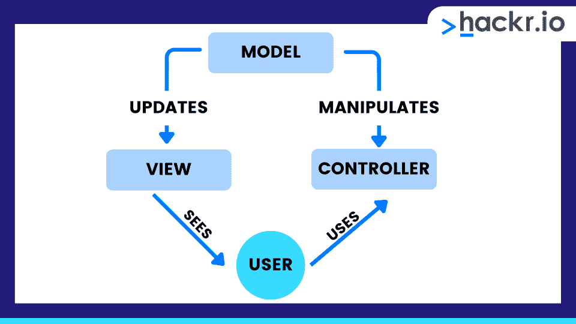
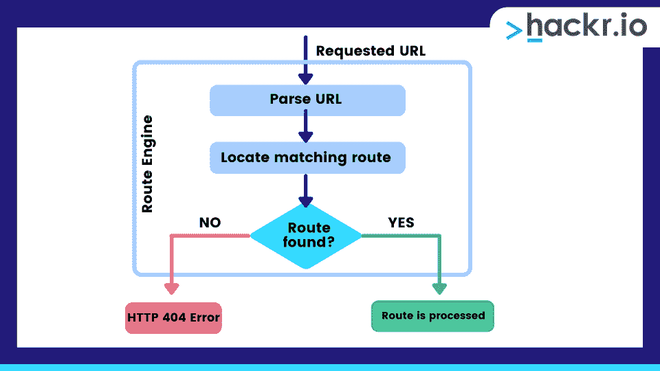

# 2023 年 50 强 MVC 面试问答[更新]

> 原文：<https://hackr.io/blog/mvc-interview-questions>

为模型、视图和控制器( [MVC](https://hackr.io/tutorial/introduction-to-aspnet-mvc-in-c) )面试做准备？在准备过程中，你有很多内容要做，包括从基础到更高级的概念。另外，你可能会被问到 MVC4 的面试问题，以及 [MVC5](https://learn.microsoft.com/en-us/aspnet/mvc/overview/getting-started/introduction/getting-started) 上的问题。

在这里，我们为你的 MVC 面试收集了顶级的 MVC 面试问题和答案。我们将问题分为基本 MVC net 面试问题和高级 MVC 4.0 面试问题。

拿个记事本或找个朋友来练习——你马上就能为面试做好准备了！

[**下载 Hackr.io 的 MVC 面试问答 PDF。**](https://drive.google.com/file/d/10QZpjM-Os8zz3L5HFq9GXQ7sisV8nkJC/view?usp=sharing)

## **50 强 MVC 面试问答**

### **基本 MVC 问题和答案**

#### **1。什么是 MVC？**

MVC 代表模型、视图和控制器。这是表示数据形态及其背后的业务逻辑的三个重要组成部分。它有助于保存和更新应用程序的数据。

首先，模型组件帮助在数据库中检索和存储模型状态。接下来，视图组件充当用户界面，帮助显示片段和修改数据。最后，控制器组件处理用户在不同时间间隔发出的请求。

#### **2。模型、视图和控制器是如何工作的？**

模型组件维护数据。视图组件改进了与用户界面和最终用户通信的通信过程。最后，控制器组件基于来自模型和视图组件的可用输入来响应用户动作。

#### **3。控制器动作方法有哪些不同的返回类型？**

控制器动作方法有以下返回类型:

*   JSON 结果
*   重定向结果
*   查看结果
*   Javascript 结果
*   内容结果

#### **4。MVC 的优势是什么？**

MVC 有很多优点，包括多视图支持、变更适应、关注点分离、可测试性和更多的控制。

#### **5。能详细解释一下 MVC 的优势吗？**

1.  MVC 的多视图支持有助于同时显示同一数据的不同视图，因为不可能将模型从图片中分离出来。
2.  MVC 提供了适应性，支持对[用户界面的定期修改。](https://hackr.io/tutorials/learn-user-interface-design)
3.  MVC 提供了关注点分离，也称为 SoC，它清晰地分离了业务逻辑、模型甚至数据。
4.  MVC 通过 ASP.NET MVC 框架为 HTML、 [CSS](https://hackr.io/blog/how-to-create-a-website-using-html) 和 JavaScript 提供了比传统使用的 web 表单更多的控制。通过 MVC 框架面试问题，你可能会被问到这个特别的优势。
5.  MVC 通过支持测试驱动的开发和 web 应用程序来提高可测试性。
6.  MVC 是轻量级的，大大减少了请求的带宽。

#### **6。表示、抽象和控制的作用是什么？**

1.  表示组件支持应用程序抽象的可视化表示。
2.  抽象组件为应用程序的业务领域提供功能。
3.  控制组件在系统的抽象和呈现给用户之间提供了一致性。此外，它还通过其他控件提供与系统的通信。

#### **7。我们能在 MVC 中维护一个会话吗？**

是的，你可以用三种不同的方式在 MVC 中维护一个会话。这些是临时数据、视图包和视图数据。

#### **8。MVC 应用程序的生命周期是什么？**

MVC 应用程序的生命周期包括两个执行步骤和两个主要阶段。这两个执行步骤包括理解请求，然后根据请求的类型发出最合适的响应。两个主要阶段包括创建请求对象，然后将响应发送给浏览器。

#### **9。定义模型逻辑。**

模型逻辑是处理应用程序数据逻辑的应用程序的重要组成部分。它帮助检索数据并将它们存储在数据库中。

#### 10。定义视图逻辑。

视图逻辑负责数据的显示，也就是用户界面。这些视图是从模型数据和各种其他方法中创建的。

#### **11。定义控制器逻辑。**

控制器逻辑处理用户交互。它响应每个用户操作。

#### **12。什么是 Spring MVC？**

Spring MVC 是一个用于创建 web 应用程序的 Java 框架。它遵循 MVC 设计模式，使用核心 spring 框架的基本特性，包括依赖注入和控制反转。

#### 13。什么是 DispatcherServlet？

DispatcherServerlet 是一个类，它接收传入的请求，并将它们映射到最合适的资源，包括模型、视图和控制器。

#### **14。定义 ASP.NET MVC。**

ASP.NET MVC 是一个 [web 应用](https://hackr.io/blog/web-application-architecture-definition-models-types-and-more)的框架，它帮助将 MVC 应用的不同组件分成模型、视图和控制器。它是可测试的，轻量级的。

#### 15。什么是 MVC 路由？

MVC 路由通过映射动作方法和控制器来使用 ASP.NET MVC 框架中的 URL，而不是将任何物理文件应用到系统中。路由引擎为信息的移动开发适当的路由，并处理不同种类的请求，这些请求随后通过路由引擎和路由，最终到达控制器。

#### 16。定义过滤器。

过滤器被定义为在动作方法执行之前甚至之后应用的逻辑。这样，它就充当了 action 方法的属性。

#### **17。MVC 动作过滤器有哪些不同的种类？**

MVC 有四个动作过滤器:授权、动作、结果和异常。

#### 18。定义局部视图和剃刀视图。

MVC 中的部分视图是可以在当前 DOM 中应用的 HTML 块。它用于组件化 Razor 视图，并定期创建和更新它们。如果 URL 从局部视图返回并从地址栏调用，将显示一个不完整的页面，其中缺少标题、样式表和脚本。

#### **19。MVC 的页面生命周期是怎样的？**

MVC 的页面生命周期从应用程序初始化开始，然后是路由、实例化和执行控制器。最后，它定位并调用控制器动作，然后应用实例化和渲染视图。

#### 20。MVC 的 ViewModel 有什么用？

ViewModel 可以使用带有属性的普通类绑定强类型视图。它还可以使用数据注释为其各种属性定义良好的验证规则。

#### **21。使用实体框架的数据库优先方法是什么？**

数据库优先方法取代了实体数据模型的代码优先和模型优先方法。它有助于创建模型类以及类、DbContext 和属性，因此可以在数据库和控制器之间建立链接。

#### **22。连接数据库和应用程序的不同方法有哪些？**

连接应用程序和数据库的不同方法包括代码优先、数据库优先和模型优先。

#### **23。什么是脚手架？**

Scaffolding 是一个代码生成框架，主要用于[ASP.NET 网络应用](https://hackr.io/blog/asp-net-interview-questions)。

visual studio 由各种预装的 MVC 代码生成器以及 Web API 项目组成。

#### **25。脚手架模板有哪些不同种类及其用途？**

页面模板、字段页面模板、过滤器模板和实体页面模板都是脚手架模板的示例。这些模板支持构建功能数据驱动的网站。

#### **26。ASP.NET MVC 中的剃刀是什么？**

Razor 是由 MVC3 引入的新的视图引擎，它充当可插拔模块，并应用不同的模板语法选项。

#### **27。MVC 中的默认路由是什么？**

默认路由添加了一个通用路由，它利用 URL 约定将给定请求的 URL 分成三个部分。

#### **28。在这种情况下，路由模式是如何注册的？**

路由模式是通过调用 RouteCollection 的 MapRoute 扩展方法注册的。

#### **29。“获取”和“发布”操作类型有什么区别？**

GET 动作类型请求来自特定资源的数据，而 POST 动作类型提交需要处理到特定资源的数据。

#### 三十岁。查看数据和查看包有什么区别？

1.  视图数据可以将数据从控制器传递到视图，而视图包可以将数据从控制器传递到相应的视图。
2.  视图数据仅适用于当前请求，而视图包适用于所有类型的请求。
3.  视图数据需要对复杂数据进行类型转换，而视图包不需要任何类型的类型转换。

#### 31。MVC 中的面积有什么好处？

1.  它有助于在不同的功能集中组织模型、视图和控制器，包括客户支持、计费等。
2.  它有助于与其他应用领域集成。
3.  它适用于单元测试。

### **高级 MVC 面试问题**

找 10 年经验的 MVC 面试问题？在高级面试中，你可能会发现更难的、基于案例的问题。我们将涵盖一般的 c# MVC 面试问题和 MVC 5 面试问题。

#### 32。创建请求对象的步骤是什么？

*   **第一步:**灌装路线。
*   **第二步:**取货路线。
*   **步骤 3:** 创建请求上下文。
*   **步骤 4:** 创建控制器实例。

#### 33。定义 MVC 模式的三个逻辑层。

MVC 模式的三个逻辑层是:

1.  模型逻辑，这是一个业务层。
2.  视图逻辑，这是一个显示层。
3.  控制器逻辑，是一种输入控制。

#### 34。我们如何在 MVC 中实现验证？

我们可以用系统中定义良好的验证器在 MVC 应用程序中实现验证。DataAnnotations 命名空间。

#### 35。有哪些不同类型的验证器？

验证器的类型包括范围、必需、数据类型和字符串长度。

#### 36。是否存在不需要或无法实现路由的情况？

是的，如果找到与 URL 模式匹配的物理文件，则不需要路由。当对 URL 模式禁用路由时，它将无法实现。

#### 37。Ajax 如何实现？

Ajax 可以使用 Ajax 库和 Jquery 在 MVC 中实现。

#### 38。引入 WebAPI 技术的必要性是什么？

HTTP 以前被用作所有类型客户端的协议。但是随着时间的推移，客户种类增加了，也变了。JavaScript、Windows 应用程序，甚至移动设备的使用都需要消耗大量的 HTTP。于是，提出了 REST 方法。WebAPI 技术应用 REST 原则来通过 HTTP 公开数据。

#### 39。Razor 的主要语法规则是什么？

Razor 的主要语法规则是:

1.  代码语句应该以分号结束。
2.  由变量和函数组成的内联表达式应该以@开头
3.  Razor 代码块必须用@(…)括起来
4.  变量必须用 var 关键字声明。
5.  字符串必须用引号括起来。

#### 40。什么是表单身份验证？

表单身份验证为用户提供了对特定服务的访问，因此他们可以使用用户名或密码来验证他们的凭据。

#### 41。为什么我们需要表单认证？

我们需要表单身份验证，以确保只有经过授权的人员才能根据他们在组织中的职位或状态使用特定的服务。

#### **42。RenderBody 和 RenderPage 有什么区别？**

RenderBody 支持 web 表单作为 ContentPlaceHolder。它在现有页面布局上呈现子页面或子视图。呈现页面是布局页面的一部分。在同一时间，RenderBody 中可以有多个 RenderPage 实例。

#### **43。什么是非行动方法？**

非动作方法执行“不放置动作”并充当填充符。它使用非动作属性。

#### **44。剃刀和 ASPX 哪个更好？**

正如微软所说，Razo 比 ASPX 更受青睐，因为它是轻量级的，语法简单。

#### **45。什么是惊鸿一瞥？**

Glimpse 揭示性能水平，支持调试，并帮助诊断信息。此外，它还收集有关路线、时间线、模型绑定等信息。

#### **46。使用超链接从一个视图导航到另一个视图有什么帮助？**

Action 链接可以帮助使用超链接从一个视图导航到另一个视图，这将创建一个简单的 URL 并导航到“Home”控制器。它还生成 Gotohome 操作。

#### **47。最后可以执行哪些过滤器？**

最后，我们可以应用名为“例外过滤器”的过滤器

#### **48。路线的可能限制是什么？**

路由的第一个约束是正则表达式，第二个约束是实现 IRouteConstraint 接口的对象。

#### 49。使用 MVC 的其他好处是什么？

MVC 帮助生成可以在单独的类文件后面使用的代码，这样它的使用可以进一步增加。MVC 也支持自动 UI 测试。

#### 50。有可能自动化手动测试并编写单元测试吗？

是的，MVC 提供了自动化手动测试系统和应用写单元测试的机会。

## **奖金面试小贴士**

第一步是在面试前的几周内定期研究这些 MVC 面试问题。这里有一些额外的提示，可以让你从这些问题中获得最大的收获:

对着镜子练习:你可能没有意识到自己在面试中避免眼神交流或东拉西扯的倾向。对着镜子回答问题，观察你的眼球运动和面部表情。这将帮助你建立意识，并感到更加自信。

**研究更难的问题:**当你背诵这些答案时，有没有觉得强迫或不自然？你可能不完全理解这些概念。进行更多的研究，参加一个辅导，甚至考虑一门课程来解决更棘手的问题。

准备好纸笔:许多编码面试都是通过视频会议或电话进行的。当面试官说话时做些笔记，或者在你回答问题之前快速计算一下，你可能会从中受益。

了解公司:尽可能在你的回答中加入公司的详细信息。你的面试官想知道你对他们的品牌和目标充满激情和热情。

## **结论**

这就是我们的 ASP.NET MVC 面试问题！当然，还有更多，但这个列表涵盖了最常见的问题。

研究我们的 MVC 面试问题列表，并和朋友一起练习。我们相信您会为自己的大日子做好准备并保持冷静。但是如果你想进一步扩展你的知识，你有很多选择。

## **常见问题解答**

#### **1。什么是 MVC 面试问题？**

有好几种。net MVC 面试问题，其中许多我们已经解释过了。MVC 面试问题的主题范围从视图、模型和控制器功能到搭建、路由约束和认证形式。

如果你准备充分，MVC 上的面试问题会很容易，这也适用于有经验的个人的 MVC 面试问题和答案。

#### **2。什么是 MVC 生命周期？**

MVC 应用程序的生命周期有两个执行步骤和两个主要阶段。这两个执行步骤包括理解请求，然后根据请求类型发出最合适的响应。两个主要阶段包括创建请求对象，然后将响应发送给浏览器。

**人也在读:**