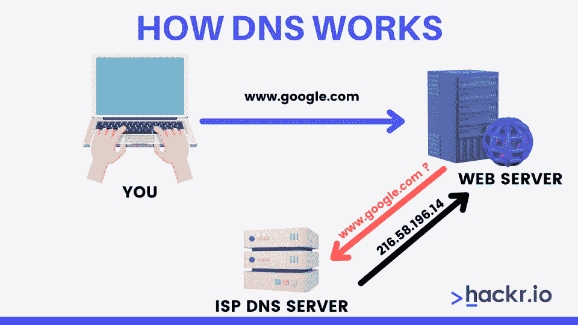
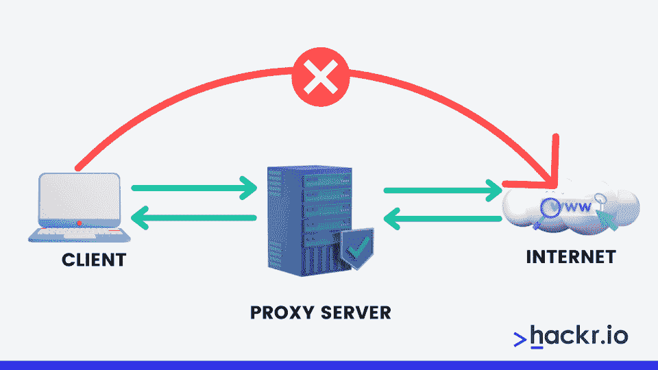
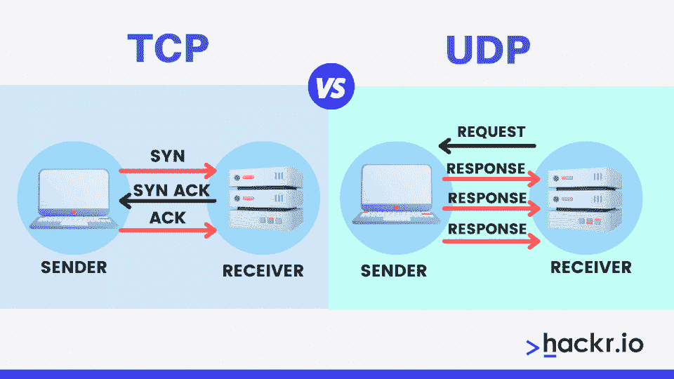

# Top 45+网络工程师面试问答【2023】

> 原文：<https://hackr.io/blog/network-engineer-interview-questions>

想知道如何在您的电脑上管理无线、视频和数据服务吗？网络工程师设计和维护处理所有这些的计算机网络。由于计算机网络无处可去，网络工程师有着良好的就业前景。今天的[网络工程师](https://www.indeed.com/career/network-engineer/salaries)在美国平均年收入超过 9 万美元。

你考虑以网络工程为职业吗？或者也许你已经开始寻找一个更高级的角色。我们整理了这份全面的网络工程师面试问题清单，以帮助您解决问题！

我们将讨论最基本的问题，以及更棘手的网络故障排除面试问题。我们开始吧！

## **顶级网络工程师面试问题**

期待行为和技术网络面试问题的组合。你可能会被问到你用来构建计算机网络的不同的网络工具。同样，你可能需要讲述过去的工作经历，在这些经历中你表现出了很强的沟通和联络能力。

我们按照难度将计算机网络面试问题列表分开，以帮助您找到与您的经历最相关的问题。

让我们从基本的网络问题开始。

### **基础网络面试问题**

想找个入门级的角色？从这些网络支持工程师面试问题开始。

花点时间复习这些关于新生人际关系的面试问题。你也可以考虑打开几个研究标签来方便你的学习。

#### **1。常用的 LAN 电缆类型有哪些？什么是交叉电缆？**

“5 类”和“6 类”是最常用的 LAN 电缆类型。“5 类”和“6 类”的速度限制分别为 100 Mbps 和 1 Gbps。

交叉表连接同类型设备进行交互，无需交换机或集线器。

#### **2。交叉电缆与普通局域网电缆有何不同？局域网电缆的最大可能长度是多少？**

交叉电缆和标准局域网电缆的不同之处在于成对导线与连接器的连接方式(RJ45)。

理论长度是 100 米，然而，当你通过 80 米后，信号丢失可能会导致你的速度下降。

#### **3。什么是 DHCP，为什么要使用它？什么是超级作用域和作用域？**

*   **动态主机配置协议(DHCP)** :在网络设置中，DHCP 将 IP 地址分配给多台 PC，简化了 IP 地址管理。

*   **作用域**:作用域是一个 IP 地址的集合，客户端可以使用它与其他网络 PC 进行通信。IP 地址中包括网关 IP、子网掩码、DNS 服务器 IP 和排除范围。

*   超级作用域是两个或更多作用域的组合。

#### **4。什么是活动目录？**

活动目录是管理网络环境的身份和连接的目录服务。它是帮助用户利用网络资源完成任务的进程和服务的集合。

#### **5。什么是 DNS，为什么要使用它？A 和 MX 记录是什么意思？**

****

域名服务(DNS)用于在名称和 IP 地址之间进行转换。虽然我们可以很容易地回忆起名字，但计算机只能理解数字。因此，我们给计算机和网站命名。当我们使用这些名称(如 yahoo.com)时，计算机通过 DNS 将请求转换为 IP 地址(一个数字)。

*   **“A”记录:**这是一条主机记录，将名称映射到一个 IP 地址。它使用域名系统(DNS)的 DNS 记录来获取名称的 IP 地址。

*   **“MX”记录:**需要 MX 或邮件交换机记录来识别网络的邮件服务器。

#### **6。Ipconfig 命令是什么，为什么要使用它？**

IPCONFIG 命令显示分配给计算机的 IP 信息。我们可以从输出中确定计算机分配的 IP 地址、DNS IP 地址和网关 IP 地址。

#### 7 .**。APIPA 的 IP 地址是什么？当 DHCP 服务器不可用时，向计算机发送什么 IP 地址？**

当 DHCP 服务器不可用时，Windows 客户端计算机会自动为自己分配一个称为 APIPA 的 IP 地址，以便与其他网络计算机进行通信。

#### **8。域名是如何工作的？**

当我们安装 Active Directory 时，就形成了一个域。这是一道安全屏障，控制着里面的电脑。使用域，您可以集中管理计算机并通过组策略控制它们。

#### **9。什么是 BSOD？如果你的电脑蓝屏了，你怎么修理它？**

BSOD 代表“死亡蓝屏”当硬件或操作系统问题导致 Windows 操作系统无法运行时，会出现带有代码的蓝屏。最佳解决方案是从 PC 上的“最后一次正确配置”启动。在安全模式下启动机器。如果不起作用，这可能意味着设备或驱动程序有问题。

#### 10。什么是 RIS？什么是成像/重影？

RIS 代表远程安装服务。一旦安装的映像保存到 Windows 服务器，RIS 就可以设置新的硬件。它可用于部署服务器和客户端操作系统。

重影，也称为映像，通过捕获已安装的映像并稍后将其安装在新硬件上来完成相同的任务。因为每次从光盘安装操作系统可能很耗时，所以我们选择了 RISE 或镜像/重影。

#### **11。如果病毒感染了您的系统，您如何恢复数据？**

您可以设置不同的系统，并安装最新版本的操作系统和防病毒软件。然后，将受感染的硬盘作为辅助光盘连接到系统。之后，擦除和扫描备份硬盘。现在，您可以将文件传输到新系统。

#### **12。什么是可管理和不可管理的交换机？**

可管理的交换机是可定制、可配置和可控制的。不可管理的交换机没有任何可定制或可配置的设置。

#### 13。NIC 是什么？

NIC 代表网络接口控制器—一种计算机硬件，也称为网卡或网络适配器。网卡使计算机能够通过计算机网络进行通信。

#### **14。什么是 USB？**

USB 代表通用串行总线，它连接调制解调器、鼠标和键盘等设备。

#### 15。什么是链接？

两台设备之间的连接称为链路。它包括电缆和使用的协议，因此两个设备可以互相交谈。

#### 16。RAS 是什么？

RAS，即远程访问服务，将远程访问连接到通常驻留在 IT 设备网络上的资源。

#### **17。“扩展”和“标准”ACI(访问控制列表)之间有什么区别？**

扩展 ACL 基于源*和*目的地。标准 ACL 是基于源的。

#### 18。定义匿名 FTP。

FTP 代表文件传输协议，这是一种通过网络在计算机系统之间交换文件的通信协议。用户可以使用匿名 FTP 访问公共服务器上的文件。

#### **19。什么是骨干网？**

主干网络是一种集中式基础设施，旨在为多个网络提供不同的路由和数据。它还管理信道和带宽控制。

#### 20。区分 DNS 中的“正向查找”和“反向查找”。

正向查找将名称转换为 IP 地址，而反向查找将 IP 地址转换为名称。

申请助理级别的职位？为有经验的网络工程师准备网络面试问题。

#### **21。什么是路由？**

路由选择跨多个网络、两个网络之间或一个网络内的流量路径。不同类型的网络(如计算机网络和电路交换网络)支持路由。路由需要做出将数据包从源定向到目的地的决策。

#### **22。怎么能让机器变成路由器？**

如果除了 lo0 之外，您的设备至少有两个附加接口，或者至少有一个点对点接口，您的设备将被配置为路由器。

Solaris 2.x:当计算机有两个或更多接口时，IP 层通常表现为路由器(转发不是发往它的数据报等)。通过使用 ndd(1M)设置/dev/ip 变量 ip forwarding，可以覆盖此行为。0 表示*不进行*，数字 1 表示*进行*。

#### **23。完全限定和部分限定域名是什么意思？**

*   **全限定域名**

完全限定的域名(FQDN)以 null 或空字符串(FQDN)结尾。

*   **部分合格域名**

部分限定的域名不以空字符串(PQDN)结尾。PQDN 没有在根处结束；相反，它从一个节点开始。

#### **24。什么是 IP？**

计算机网络中使用互联网协议(IP)的每个设备(如计算机或打印机)都被分配了一个数字标签，称为互联网协议地址(IP 地址)。您的系统或设备的 IP 从大型计算机网络中唯一地识别它。

#### **25。交换机和集线器有什么区别？**

集线器和交换机都是网络设备，可以帮助您连接到各种设备。集线器是第 1 层设备，即它工作在物理层，并将信号发送到端口。同时，交换机是通过网络路由和传输信息的第 2 层设备。

下表强调了集线器和交换机之间的主要区别:

| **集线器** | **开关** |
| 工作在第 1 层，即物理层。 | 工作在第 2 层，即数据链路层。 |
| 跟随广播传输。 | 遵循广播、单播和多播传输。 |
| 利用半双工传输技术。 | 利用全双工通信技术。 |
| 有 4 个端口。 | 有 24 到 28 个端口。 |

#### **26。什么是层？**

一个层完全逻辑地划分 PDU(协议数据单元)过程。它们规定了通过网络将数据从一台机器发送到另一台机器的方法。

#### **27。什么是 TCP/IP？**

TCP 是传输控制协议，IP 是互联网协议。

#### **28。Arp 和 Rarp 的区别是什么？**

主机或路由器可以利用地址解析协议(ARP ),通过发送带有接收方 IP 地址的 ARP 查询数据包来确定网络中另一台主机的物理地址。当主机只知道它的物理地址时，反向地址解析协议(RARP)使它能够找到它的互联网地址。

#### **29。什么是客户机/服务器？**

客户端和服务器作为不同的逻辑实体协作完成网络任务。

#### 三十岁。你如何定义一个 Mac 地址？

它是 LAN 卡的 48 位硬件地址。网络适配器卡通常将 MAC 地址保存在 ROM 中，并且是独特的。

#### 31。什么是代理服务器？

****

代理服务器为用户进行繁重的访问和检索，类似于 DNS 服务器缓存被访问网站的地址。此外，代理服务器维护一个网站列表，无论它们是在白名单中还是被禁止，以保护消费者免受容易避免的病毒的攻击。

如今，大多数大型企业和机构都使用代理来增强网络性能。

#### 32。什么是以太网局域网 10base2、10base5 和 10baset？

*   **10Base2:**10Base2 需要 100 米长的连续电缆段和最多 2 段:这是一个以太网术语，指的是使用基带信号的最大传输速率为每秒 10 兆比特。
*   **10Base5:** 10Base5 是一个以太网术语，指的是 5 个连续的网段，它们之间的最大距离为 100 米，使用基带信令的最大传输速率为每秒 10 兆比特。
*   **10BaseT:** 以太网的首字母缩写，指双绞线，最高传输速率为每秒 10 兆比特。

#### 33。什么是 HTTPS，它使用哪个港口？

HTTP 的老大哥，HTTPS 代表安全 HTTP(不要与 HTTPS 混淆，一个单独的协议)。HTTPS 是为身份验证而创建的，它使用 SSL 证书来确认您连接的服务器是可信的。虽然 HTTPS 有一定的加密能力，但通常被认为是不够的，只要可行，最好使用其他加密方法。TCP 端口 443 用于 HTTPS 传输。

### **面向有经验者的高级网络面试问题**

寻找网络工程领域的高级职位或领导职位？请不要参加面试，直到您查看了这些针对高管职位的网络工程师的面试问题。

#### 34。FTP 是什么意思？

FTP 或文件传输协议是应该淘汰的大型传统协议之一。如果下载暂停，FTP 可能会恢复下载，并且主要用于大量文件传输。有两种方法可以访问 FTP 服务器:匿名访问和标准登录。

两者的主要区别在于，标准登录需要主动用户登录，而匿名访问则不需要。用户的凭证是使用 FTP 以明文形式传递的，这使得任何通过网络监听的人都非常容易嗅到凭证。这就是 FTP 的主要问题所在。

#### 35。什么是宋承宪？

SSH，或安全 Shell，在 Linux 用户中最受欢迎，但也有广泛的应用。多亏了 SSH，系统、开关、恒温器或烤面包机都可以通过隧道安全地连接起来。SSH 还提供了充当其他程序的隧道的独特能力，这在概念上与 VPN 类似。如果配置正确，即使是不安全的程序或通过不安全连接运行的程序也可以在安全状态下使用。

#### 36。什么是 ICMP？

ICMP 代表互联网控制消息协议。它的主要功能是在系统尝试远程连接时通知系统另一端是否可访问。

#### 37。什么是 IPX？

IPX 是一种相当轻量级的协议，考虑到当时计算机的局限性，这是很有利的。它是 TCP/IP 的竞争对手，在小型网络中表现出色，几乎不需要配置，也不需要像 DHCP 这样的组件。然而，对于像互联网这样的应用，它不能有效地扩展。因此，它被放弃，不再是大多数产品的必要协议。

#### 38。什么是 Bonjour？

几乎每个苹果软件都附带一个名为 Bonjour 的工具，它控制着该公司的几项自动发现技术。Bonjour 是 IPX 和 DNS 的结合。

几乎不需要配置，Bonjour 使用 mDNS(多播 DNS)来查找网络上的广播设备。由于潜在的安全风险，许多管理员会在公司设置中有目的地停止该服务。然而，在家庭环境中，可以由用户来决定这种风险是否值得。

#### 39。什么是防火墙？

防火墙是一种网络安全设备，用于监控进出网络的流量。其主要目的是在内部网络和外部来源之间建立屏障，以避免恶意流量，如病毒或恶意软件。

#### 40。什么是子网掩码？

网络可以从子网掩码中获知自己的大小。当地址位于掩码内时，它将被视为本地网络的一部分。因为当它在外部时，它不是本地网络的成员，所以它将被不同地处理。

#### 41。TFTP 和 FTP 应用层协议有何不同？

本地主机可以使用普通文件传输协议(TFTP)从远程主机下载文件，但它缺乏安全性和可靠性。它使用 UDP 的基本数据包传递功能。

TCP/IP 提供的将文件从一台主机复制到另一台主机的常用方法是文件传输协议(FTP)。它是可靠和安全的，因为它使用 TCP 的服务。它在主机之间创建两条链路(虚电路)，一条用于信息控制，另一条用于数据传输。

#### **42。TCP/IP 协议组的每一层使用什么数据单元？**

*   **消息:**应用层创建的数据单元。
*   **段或用户数据报:**在传输层创建的数据单元。
*   **数据报:**网络层创建的数据单元。

#### **43。有哪几种网络设备？**

有四种网络设备:

**中继器**

中继器，也称为再生器，是一个只在物理层工作的技术小工具。在网络信号恶化之前，它会捕获信号，重新生成原始位模式，然后将更新后的副本重新插入链路。

**桥梁**

在同类型的局域网中，网桥在物理层和数据链路层都起作用。它们将一个更大的网络分成更易管理的部分。

**路由器**

它们在几个互连的网络(即不同类型的局域网)之间传递数据包。它们在网络层、数据链路层和物理层发挥作用。他们的软件使他们能够在几个选项中选择最佳传输路径。

**网关**

它们充当使用各种协议的网络之间的分组中继(例如，LAN 和 WAN 之间)。在转发它之前，它们接收一个格式化为一种协议的数据包，并将其转换为另一种协议的格式。它们跨越所有七个 OSI 模型层。

#### **44。网络的重要拓扑是什么？**

网络有三种重要的拓扑结构:

**总线拓扑:**总线架构中的每台计算机都连接到一条主网络电缆上。它的设置、理解和扩展既经济又简单。

**星型拓扑:**单个集线器连接每个系统，便于故障排除和重新安装。

**环形拓扑:**单台计算机从后端和前端连接到另外两台计算机。当所有计算机连接时，它们形成一个环状结构。与其他拓扑相比，这可以确保所有计算机平等地访问网络资源，并减少信号衰减。

有两种传输介质:导向的和非导向的。

**双绞线、同轴电缆和光缆等导向介质充当从一个设备到另一个设备的管道。这些介质的任何物理边界在信号沿其传播时都会引导和限制信号。以电流形式接受和传输信号的金属材料用于双绞线和同轴电缆。称为光纤的玻璃或塑料电缆以光的形式接收和传输信号。**

**无导向介质**是一种无需物理导体即可传输电磁波的无线介质。信号可以通过空气传送。无线电通信、卫星通信和移动电话被用于此。

#### **46。通信和传输的区别是什么？**

传输需要信息的物理移动，这引起了人们对比特极性、同步、时钟等问题的关注。通信是两种通信媒体之间的完整信息交换。

#### **47。三种不同类型的路由表是什么？**

路由表有三种类型:固定路由表、动态路由表和固定中心路由表。

*   每次改变时，必须手动更新一个**固定表**。

*   一个**动态表**根据网络活动更新数据，最大限度地减少了手动维护的需要。
*   一个**固定的中央表**减少了在每个系统上更新表的需要。动态表通常给网络管理员带来的问题最少，尽管表的内容可能会发生变化，而管理员并不知道这种变化。

#### **48。什么是混合路由协议？**

混合或距离矢量和链路状态路由协议方法具有以下优势:

*   发送传统的距离矢量更新。
*   邻居之间的路由表在启动时同步，并根据网络拓扑的变化提供特定的更新。

#### **49。什么是 UDP？**

****

UDP 代表用户数据报协议。它是一种通信协议，用于计算机应用程序向遵循互联网协议(IP)的网络上的其他主机传输消息，这里称为数据报。它是一种无连接的通信协议。

## **奖励提示**

恭喜你。您已经完成了我们的网络面试问答。

以下是一些在此过程中需要记住的额外提示:

*   **探索课程、教程和认证**拓宽你的知识面，建立同事网络。
*   以实习生的身份工作，或者在初级职位上开始积累实践经验。

*   维护你的简历和作品集。

*   **保持自信** —即使是最资深的网络工程师也是从你今天的位置起步的！

[网络工程师用 Python 掌握网络自动化](https://click.linksynergy.com/link?id=jU79Zysihs4&offerid=1045023.1909942&type=2&murl=https%3A%2F%2Fwww.udemy.com%2Fcourse%2Fmaster-python-network-automation-for-network-engineers%2F)

## **结论**

不要担心你的下一次网络工程师面试。你有大量的资源，比如这些网络工程师的问题，来帮助你准备。

记得下载网络工程师面试问答 PDF，随时随地在任何设备上做好离线准备。

但是不要止步于此。考虑阅读[道德黑客书籍](https://hackr.io/blog/best-hacking-books)来吊起你的胃口，或者通过课程和教程更进一步。

[探索计算机网络教程](https://hackr.io/tutorials/learn-computer-networks)

## **常见问题解答**

#### **1。如何准备网络工程师面试？**

首先回顾一下我们广泛的计算机网络面试问题清单。你可以找一个朋友在模拟面试中练习。然后，考虑寻找在线教程和课程，以帮助应用您的知识来准备技术问题。

#### **2。网络工程师应该具备哪些技能？**

雇主会在网络工程师面试中观察候选人以及他们对某些技能的展示。

以下是网络工程师必备的技能和知识:

*   云计算
*   建立工作关系网
*   操作系统的基本知识
*   沟通
*   问题解决和故障排除
*   防火墙和安全性
*   网络设计
*   编程语言

#### **3。网络工程师工作压力大吗？**

如果你在 IT 界发展，网络工程师的角色应该很适合你。然而，你可能不得不同时处理许多技术任务，这可能会感到有压力。