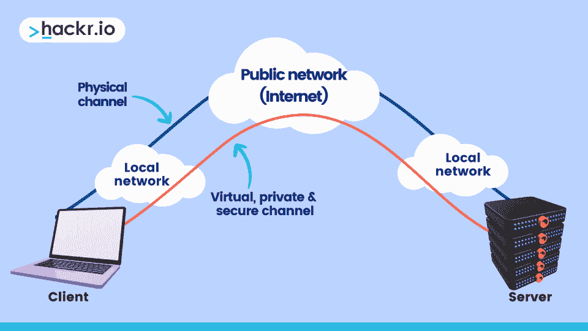
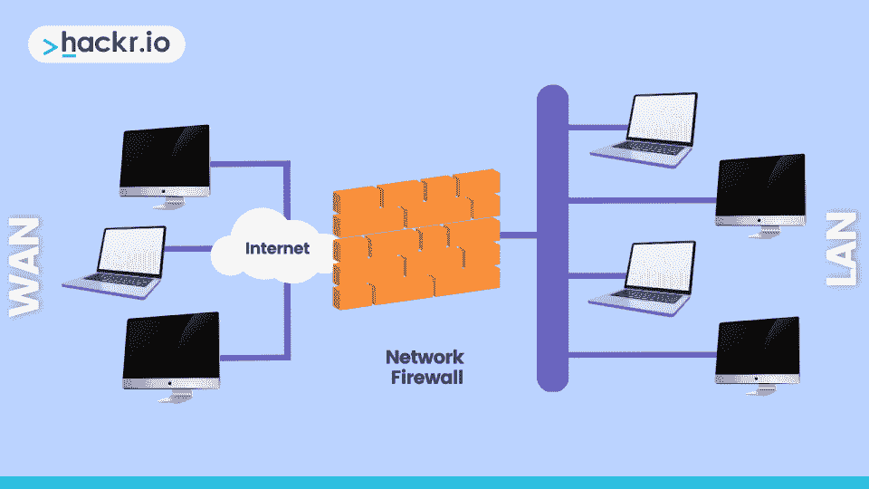
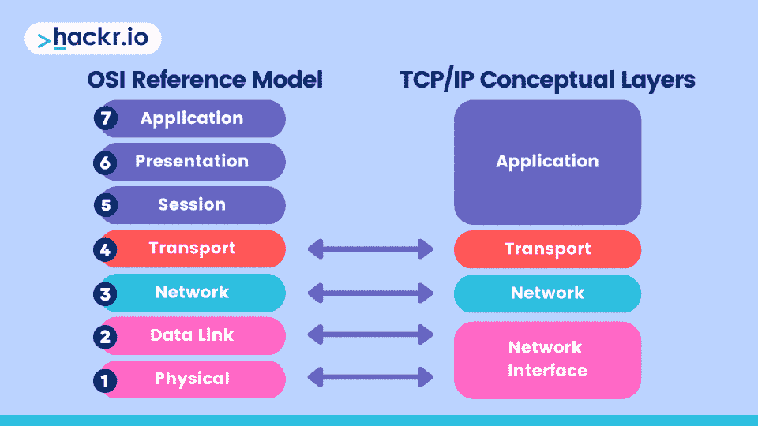
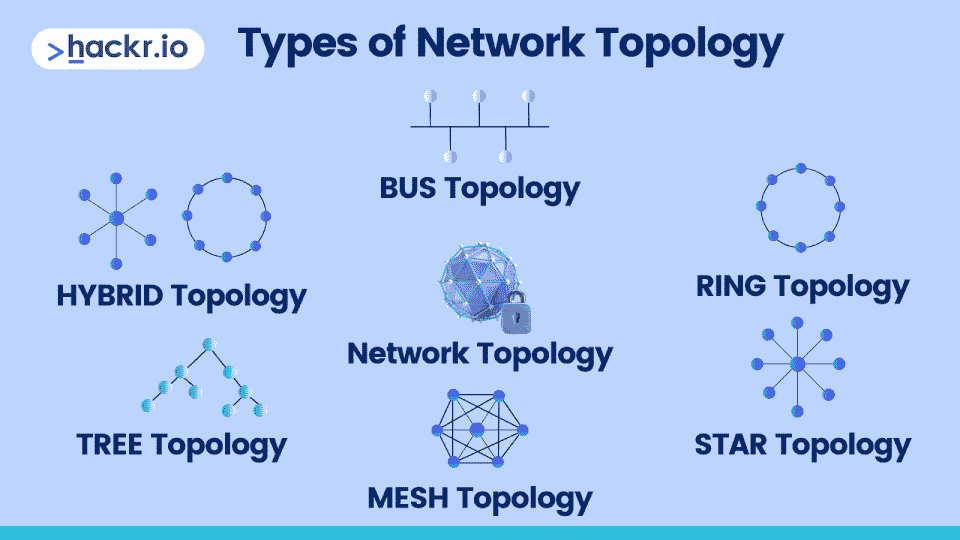
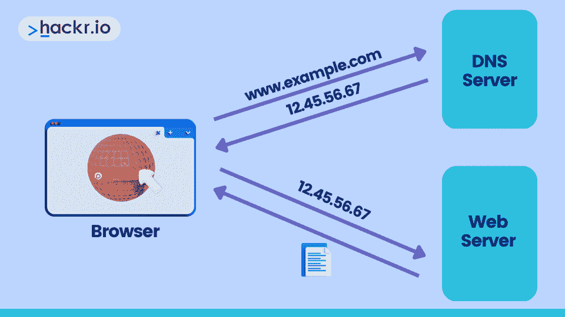

# 2023 年求职前 48 个网络面试问题和答案

> 原文：<https://hackr.io/blog/networking-interview-questions>

面试是求职中最重要的部分。它可以创造或破坏一个机会。如果你正在寻找人际关系网中的新角色，展示你的知识是给人留下深刻印象和获得工作的关键因素。网络工程师的平均基本工资超过 9 万美元，这是进入这个领域的最佳时机。

为了给自己获得这份工作的最佳机会，练习回答常见的网络面试问题来突出你的技术技能是明智的。这就是为什么我们把这个有用的指南放在一起，涵盖了技术面试中最常见的 48 个计算机网络面试问题。

无论你面试的是初级、中级还是高级职位，这份指南都将是一份有价值的资源，帮助你增加知识，赢得面试。我们开始吧！

## **基础网络面试问答**

### **1。什么是网络？**

网络是一组共享信息或资源的相连设备。这些设备通过网络相互通信，网络可以是有线的或无线的，规模可以从小型家庭网络到大型全球网络(如互联网)不等。

在所有基本的网络面试问题中，这是一个你应该能够自动回答的问题！

*[寻找远程联网工作](https://jobs.hackr.io/search/jobs?searchTerm=networking&location=Remote,%20USA&homepage=true)*

### **2。网络类型是如何分类的？解释区别。**

网络类型的特征基于其规模、地理分布和设备连接方式。这些网络类型之间的根本区别在于它们的地理范围和它们链接的设备。

| **类型** | **描述** |
| 局域网 | 连接小区域内的设备，例如一栋建筑或一间办公室。 |
| 广域网 | 连接大范围地理区域内的设备，例如跨越城市甚至国家。 |
| 城域网 | 连接城市或大都市区内的设备。 |
| 个人区域网络 | 连接个人附近的设备，如智能手机或个人电脑。 |
| 全球区域网络 | 连接多个国家、大洲甚至全球的移动设备。 |
| 无线局域网 | 一种 LAN 类型，使用无线通信而不是物理电缆来连接设备。 |
| VLAN(虚拟局域网) | 在物理局域网中创建的虚拟网络。它允许你将一个物理局域网分成多个逻辑局域网，每个逻辑局域网都有自己的广播域。 |

*这是另一个最基本的网络问题，所以让你知道这些！*

### **3。什么是数据包？**

数据包是通过网络传输的数据单位。它包含数据和控制信息，包括源地址、目的地址和错误检查信息。

当你发送一封电子邮件时，你的计算机把它分解成数据包，通过网络发送。在接收端，数据包被重组为原始消息。数据包使我们能够长距离高效地发送数据。

### **4。什么是路由器？**

路由器是连接各种网络并帮助这些网络中的设备相互通信的设备。这是通过基于目的地地址在网络之间路由数据包来实现的。

### **5。集线器、交换机、路由器和网关之间有什么区别？**

在计算机网络中，集线器、交换机、路由器和网关都是服务于不同目的的网络设备。下面是对每一个的简要说明。

| **装置** | **描述** |
| 中心 | 一种基本网络设备，通过将数据从一台设备广播到与之相连的所有其它设备，将网络中的多台设备连接起来。 |
| 转换 | 一种连接网络中众多设备的高级网络设备，与集线器不同的是，它使用硬件地址将数据仅传输到所需的设备，而不是广播到所有设备。 |
| 路由器 | 一种网络设备，用于链接各种网络，并根据数据包的目的地址定向数据包。路由表指示数据到达目的地的最佳路径，路由器使用路由表来判断如何传输数据。 |
| 门 | 作为不同网络的入口点或两个不同网络之间的接口的设备。网关可以是路由器，也可以是计算机或其他类型的设备，提供连接两个不同网络的必要功能。 |

总之，集线器向所有连接的设备广播数据，交换机根据硬件地址转发数据，路由器根据目的地址转发数据，而网关提供另一个网络的入口或执行协议转换等功能。这些都是网络技术人员常见的面试问题，一定要知道其中的区别。

### **6。什么是 VPN？**

****

VPN(虚拟专用网)是设备和网络之间的安全网络连接。它通过加密数据、使数据对在线隐私有用、保护连接和访问地理限制资源来实现这一点。VPN 有几种类型。

| **类型** | **描述** |
| 远程访问 VPN | 使远程用户能够安全地访问公司网络。 |
| 站点到站点 VPN | 通过公共网络连接多个固定位置。 |
| 基于内部网的 VPN | 用于安全地连接到公司的内部网。 |
| 基于外联网的虚拟专用网 | 将公司与其合作伙伴或供应商联系起来。 |
| 消费者 VPN | 专为保护个人在线隐私和安全而设计。 |
| 专用 VPN | 为单个组织建立的专用网络。 |
| 移动 VPN | 专为移动设备设计，提供对网络的安全访问。 |

### **7。链接和节点有什么区别？**

节点是与网络相连的设备，如计算机、路由器和服务器，而链路是节点之间允许它们通信的连接。这意味着节点是通信的端点，而链路是实现通信的通道。

这是另一个你应该能够毫不犹豫地回答的网络基础面试问题！

### **8。网络中防火墙的目的是什么？**

防火墙控制传入和传出的网络流量，以保护网络免受不必要的访问。作为第一道防线，它们根据安全规则监控和过滤流量。防火墙可以基于硬件，也可以基于软件。

### **9。HTTP 和 HTTPS 有什么区别？他们使用什么端口？**

HTTP(超文本传输协议)和 HTTPS(安全超文本传输协议)是两种非常常见的数据传输技术，它们提供类似的功能，但在安全性和端口使用方面有所不同。

| **类型** | **描述** |
| 超文本传送协议 | 一种用于在线数据传输的无状态应用层协议。它是万维网使用的基本协议，用于在客户端和服务器之间传输数据。默认情况下，HTTP 在端口 80 上通信。 |
| HTTPS | HTTP 的一种变体，使用 TLS(传输层安全性)或 SSL(安全套接字层)在客户端和服务器之间实现加密和安全的通信。HTTPS 在端口 443 上通信。 |

### 10。有哪些不同类型的 IP 地址？

网络中使用的 IP 地址有四种类型:公共 IP 地址、私有 IP 地址、静态 IP 地址和动态 IP 地址。它们的功能和行为不同。

| **类型** | **描述** |
| 公共 IP 地址 | 分配给连接互联网的设备。它们是独一无二的，全球可识别的，允许设备通过互联网相互通信。 |
| 私有 IP 地址 | 在专用网络中使用，不能通过互联网访问。它们被分配给局域网(LAN)中的计算机、打印机和路由器等设备。 |
| 静态 IP 地址 | 分配给不随时间变化的设备。这种 IP 地址对于需要稳定 IP 地址的设备(如服务器或网站)非常有用。 |
| 动态 IP 地址 | 发给不需要固定 IP 地址的设备(如 PC 和智能手机)的临时地址。 |
| 保留的 IP 地址 | 为特殊目的保留的地址，例如 127.0.0.1 用于本地主机。 |

*这是我们另一个你需要知道的基本网络面试问题！*

### **11。什么是以太网？**

以太网是用于在设备之间传输数据的有线网络技术的集合，是局域网(LAN)的事实标准。

以太网利用物理和数据链路层在设备之间传输数据。物理层定义了通过电缆传输数据的电气和机械规格，数据链路层定义了数据如何打包并在设备之间传输。

### **12。编码器和解码器有什么区别？**

编码器将信息转换为新的格式，而解码器则反向执行该过程以检索原始数据。两者都使用数据压缩和安全的算法和技术。

### 13。什么是本地主机？

Localhost 指的是您当前使用的电脑。您可以使用 IP 地址 127.0.0.1 连接到它，该地址是为“环回”接口保留的，该接口允许电脑进行通信并向自身发送数据。连接到 localhost 有助于测试和开发，包括测试 web 服务器是否正常工作。

### **14。有哪些不同类型的数据传输模式？**

| **模式** | **描述** | **例子** |
| 单一的 | 单向数据流 | 电视广播 |
| 半双工 | 数据在两个方向流动(传输和接收)，但不是同时。 | 步话机，公民波段无线电 |
| 全双工 | 数据可以同时双向流动(传输和接收)。 | 电话、互联网浏览、视频会议 |

### 15。描述排除网络连接故障的步骤？

| **第一步** | 确定问题的症状，然后检查是特定设备的问题，还是网络范围的问题。 |
| **第二步** | 检查所有电缆、电源和网络设备的物理连接。 |
| **第三步** | 检查 IP 和 DNS 配置，确保它们是正确的。 |
| **第四步** | 检查是否有防火墙阻止连接。 |
| **第五步** | 使用 traceroute、nslookup 和 netstat 等诊断工具。 |
| **第六步** | 如果问题仍然存在，请收集数据，包括网络日志和跟踪。 |
| **第七步** | 请与网络管理员或服务提供商合作解决问题。 |

想为面试做更多的准备吗？结账:

**[顶级技术面试题](https://hackr.io/blog/technical-interview-questions)**

### 16。Ipconfig 和 Ifconfig 有什么区别？

它们是命令行工具，用于查看和配置网络设置，包括对 DHCP 和 DNS 设置的更改。

| **功能** | **ipconfig** | **ifconfig** |
| 定义 | 互联网协议配置 | 界面形状 |
| 平台 | Windows 操作系统 | Linux/Unix |
| 显示 | IP 地址、子网掩码、默认网关 | IP 地址、网络接口详细信息 |

### **17。Ping 命令的目的是什么？**

Ping 是一种测试网络连通性的诊断工具，它向目标设备发送 ICMP 回应请求并等待响应。

ping 的目的是检验网络设备是否响应，并测量数据包往返源设备所需的时间。ping 有助于识别网络问题(如数据包丢失)，通常用于故障排除。

### 18。什么是 OSI 参考模型？描述这些层。

开放系统互连(OSI)参考模型是一个七层体系结构，它规定了数据如何在网络中传输。OSI 模型提供了一种标准化的网络通信方法，使设备能够共存。这些层如下所示:

| **层** | **描述** |
| 身体的 | 处理数据传输的物理方面，如电压电平、电缆规格和信号定时。 |
| 数据传输器 | 在特定网段上的设备之间传送数据帧。这包括错误检测和纠正、流量控制和媒体访问。 |
| 网络 | 使用由 IP 地址确定的最佳路由从一个网络路由数据。 |
| 运输 | 提供端到端传输服务，并确保可靠的数据传输。 |
| 会议 | 创建、管理和结束应用程序之间的会话。它保证数据以正确的顺序传输。 |
| 介绍会；展示会 | 格式化、加密和压缩数据以便传输。 |
| 应用 | 作为用户和网络之间的接口，提供文件传输、电子邮件和远程登录等服务。 |

### **19。什么是 TCP/IP 模型？描述这些层。**

****

TCP/IP(传输控制协议/互联网协议)参考模型使用四层架构来提供在线数据传输的标准。这些层如下所示:

| **层** | **描述** |
| 应用 | 直接向主机应用交付服务。它涵盖了传输数据所需的协议，如 HTTP、FTP 和 SMTP。 |
| 运输 | 使用 TCP 和 UDP(用户数据报协议)在应用程序之间提供可靠的数据传输服务。 |
| 互联网 | 使用 IP 在整个网络中处理数据包的路由和转发。 |
| 网络存取 | 使用地址解析协议(ARP)和互联网控制消息协议(ICMP)在交换机和路由器等网络设备之间提供数据连接服务。 |

### 20。什么是 MAC 地址，它与 IP 地址有何不同？

MAC(媒体访问控制)地址是 NIC(网络接口卡)的唯一 48 位标识符形式的物理地址，用于网段内的网络通信。MAC 地址的一个例子是 00:1A:2B:3C:4D:5E。

IP 地址是在互联网或网络上查找设备的逻辑标识符。它们由网络管理员指定，可以更改。IP 地址的一个例子是 192.0.2.1。

### **21。什么是子网，如何使用子网掩码将网络划分为更小的子网？**

子网是大型网络的逻辑子部分，用于改善组织、安全性和性能。子网掩码是一个 32 位的值，它与 IP 地址一起将网络划分为更小的部分，称为子网。

例如，子网掩码为 255.255.128.0 的 IP 地址 192.168.1.1 的子网范围为 192.168.0.1 - 192.168.127.254。通过子网掩码，您可以识别 IP 地址中代表网络地址的部分和代表主机的部分。

### **22。什么是代理服务器？**

代理服务器是在客户端和服务器之间充当中介的服务器。它为客户端提供访问控制、安全性、缓存和匿名，可用于提高网络的性能和安全性。

### **23。什么是网络拓扑？描述不同的类型。**

****

网络拓扑是指网络中的设备如何相互链接，以及这些设备之间如何传输数据。网络拓扑的类型如下:

| **拓扑** | **描述** |
| 公共汽车 | 设备通过称为总线的单一中央连接链接在一起，总线充当共享通信通道。 |
| 星星 | 设备连接到一个中央集线器，每个设备都有一个到集线器的专用点对点连接。 |
| 戒指 | 设备以环形模式连接，数据通过每个设备传输并返回到源。 |
| 网状物 | 网络中的每台设备都与其它设备直接相连，允许数据通过各种路径传输。 |
| 树 | 一种分层拓扑结构，其中设备以树状排列方式分组，有一个中心根设备和多个子设备分支。 |
| 杂交鸟 | 使用两种或两种以上不同的网络拓扑，可以混合使用上面列出的其他网络拓扑。 |

*这是最必备的网络架构面试问题之一，一定要注意！*

### **24。什么是 IPv4 地址以及 IPv4 的不同类别？**

IPv4 地址是分配给每个联网设备的唯一数值。这些根据它们的价值范围被分成不同的类别，以帮助组织互联网。

| **类** | **第一个八位字节的范围** | **网络数量** | **每个网络的主机数量** |
| A | 1 到 127 | 126 | 16，777，214(大型组织和 ISP) |
| B | 128 至 191 | 16,382 | 65，534(中型组织) |
| C | 192 至 223 | 2,097,150 | 254(小型组织和家庭网络) |
| D | 224 至 239 | 不适用的 | 用两台调频发射机播送一个立体声节目 |
| E | 240 到 255 | 不适用的 | 研究/实验用途 |

### **25。什么是 DMZ，为什么在网络中使用它？**

非军事区(DMZ)是一个安全的网络区域，用于面向公众的服务，充当互联网和内部网络之间的缓冲区，以提高安全性和保护敏感数据。它在网络中被用作隔离潜在威胁和保护数据安全的一种方式。

### **26。什么是 DNS？**

DNS(域名系统)用于将 hackr.io 等人类可读的域转换为 IP 地址，允许计算机通过互联网相互识别和通信。

### **27。什么是 BGP，它在网络中如何工作？**

边界网关协议(BGP)是一种路由协议，允许路由器进行通信并找到路由流量的最佳方式。它创建路由表来优化流量，并确保高效的数据包传输。BGP 对于大型网络来说至关重要，它可以防止拥塞并在必要时重新路由流量。

## **高级网络面试问答**

### **28。什么是 CIDR 街区？**

无类域间路由(CIDR)是一种分配 IP 地址和定义网络边界的方法。CIDR 块是通过 IP 地址和子网掩码的组合来定义的，允许指定块中包含哪些地址。

例如，CIDR 地址块 192.168.0.0/24 将包含从 192.168.0.0 到 192.168.0.255 的所有 IP 地址，子网掩码为 255.255.255.0。

ISP 通常使用 CIDR 块为客户分配 IP 地址，组织通常使用它来定义网络边界并有效管理 IP 地址空间。

### **29。TCP 和 UDP 协议有什么区别？**

TCP(传输控制协议)和 UDP(用户数据报协议)都是通过互联网发送数据的协议，主要区别在于它们传输数据的方式。

| **功能** | **TCP** | **UDP** |
| 类型 | 面向连接 | 无连接传输模式 |
| 可靠性 | 高-确保按顺序接收所有数据包 | 低-数据包可能会丢失或不按顺序传送 |
| 速度 | 由于建立和维护连接，速度较慢 | 由于没有连接建立的开销，速度更快 |
| 小包裹 | 整齐的 | 无序的 |
| 错误检查 | 是-包括错误检查和丢失数据包的重新传输 | Limited -包括基本的错误检查，但不重新传输丢失的数据包 |
| 使用 | 适用于数据准确性和可靠性非常重要的应用，如网页浏览和文件传输 | 适合速度非常重要的应用，例如在线游戏和流媒体 |

*这是最流行的计算机网络面试问题之一，所以一定要知道这一点！*

### 三十岁。什么是 DHCP 协议？

DHCP(动态主机配置协议)是一种自动为联网设备分配 IP 地址的网络协议。当设备连接到网络时会发生这种情况，因为它会发送一个 IP 地址请求，DHCP 服务器会响应该请求。

### 31。什么是 ARP 协议，它如何将 IP 地址映射到网络中的物理地址？

ARP(地址解析协议)是一种将 IP 地址映射到物理 MAC 地址的网络协议。设备首先检查其 ARP 缓存中的物理地址，如果没有找到，就向所有网络设备广播 ARP 请求以获取该地址。具有匹配 IP 地址的设备用物理地址进行响应，然后将物理地址保存在 ARP 缓存中。

### 32。什么是 FTP 协议？

FTP(文件传输协议)是一种网络协议，用于通过客户端-服务器模式在互联网上的设备之间传输文件。虽然它正被更安全的协议如 SFTP 和 SCP 所取代，但它仍被广泛使用。

不要忽视这些类型的计算机网络面试问题，因为它们很容易胜出！

### 33。什么是 SNMP 协议并描述其架构？

SNMP(简单网络管理协议)通过客户端-服务器架构监控和管理网络设备。这样，NMS(网络管理系统)就可以请求有关设备性能和配置的信息。

它还使用 MIB(管理信息库)对象来表示设备性能，允许网络管理员监控他们的网络。

### 34。什么是单播、任播、多播和广播？

这些都是在计算机网络中传输数据的方法，但根据数据传输的具体要求和性质而有所不同。

| **类型** | **描述** |
| 单播 | 从单一来源向单一网络设备传输数据。是一对一的沟通模式。 |
| 任播 | 根据路由表信息将数据从单一来源传送到最近的可能目的地。这是一种一对一的交流模式。 |
| 用两台调频发射机播送一个立体声节目 | 将数据从一个源传送到网络上的几个目的地。这是一种一对多的交流模式。 |
| 广播 | 将数据从单一来源传送到网络上所有可能的目的地。这是一种一对一的交流模式。 |

### 35。什么是服务质量(QoS ),如何使用它来管理网络流量？

服务质量(QoS)用于通过区分流量类型的优先级和有效分配带宽来调节网络流量，从而提高网络性能和用户体验。

根据网络要求，它可以通过将重要流量的优先级设置为较低优先级来避免拥塞。例如，这可能意味着音频和视频优先于电子邮件和文件传输。

### 36。IPv6 地址空间与 IPv4 有何不同？

| **功能** | **IPv6** | **IPv4** |
| 地址长度 | 128 位 | 32 位 |
| 地址形式 | 十六进制的 | 点分十进制 |
| 地址空间 | 2^128 | 2^32 |
| 页眉 | 固定长度 | 可变长度 |
| 地址掩码 | 不 | 是 |
| 服务质量 | 是 | 不 |
| DNS 记录 | AAAA | A |
| 示例地址 | 2001 年:0db 8:85a 3:0000:0000:8a2e:0370:7334 | 192.0.2.1 |

### 37。什么是 MPLS，它是如何在网络中使用的？

MPLS(多协议标签交换)使用短标签而不是长网络地址来路由网络流量，它通常用于提供 QoS 和 VPN。

### 38。网卡和 NAT 之间的关系是什么，它们如何协同工作来实现网络通信？

NIC(网络接口卡)是使计算机能够连接到网络的硬件设备，而 NAT(网络地址转换)是用于将私有 IP 地址转换为公共 IP 地址的协议，允许通过互联网进行通信。

当带有网卡的计算机向在线服务器发送请求时，NAT 协议用于转换 IP 地址，使通信得以进行。这些通常一起用于排除网络连接问题。

对网络工程感兴趣？结账:

**[网络工程顶级试题](https://hackr.io/blog/network-engineer-interview-questions)**

## **网络面试选择题**

### 39。网络中路由器的主要功能是什么？

1.  为了提供网络安全
2.  **连接多个网络**
3.  管理数据存储
4.  要控制网络访问

### 40。什么协议用于网络上的文件传输？

1.  **FTP**
2.  超文本传送协议
3.  简单邮件传输协议
4.  传输控制协议（Transmission Control Protocol）

### 41。私有网络最常用的 IP 地址范围是什么？

1.  192.0.0.0 - 192.255.255.255
2.  **10.0.0.0 - 10.255.255.255**
3.  127.0.0.0 - 127.0.0.1
4.  169.254.0.0 - 169.254.255.255

### **42。网络中防火墙的目的是什么？**

1.  过滤传入和传出的网络流量
2.  为了提供网络安全
3.  管理网络访问
4.  **以上所有**

### **43。TCP 和 UDP 协议有什么区别？**

1.  **TCP 是面向连接的，UDP 是无连接的**
2.  TCP 不可靠，UDP 可靠
3.  TCP 很快，UDP 很慢
4.  TCP 用于语音，UDP 用于视频

### **44。网络中划分子网的目的是什么？**

1.  为了提高网络安全性
2.  **将大型网络划分成更小的子网**
3.  为了提高网络性能
4.  为了简化网络管理

### **45。OSI 模型在网络中的用途是什么？**

1.  **标准化设备间的数据传输**
2.  为了确保不同网络设备之间的兼容性
3.  控制对网络的访问
4.  管理网络资源

### **46。静态 IP 地址和动态 IP 地址有什么区别？**

1.  **静态 IP 地址不变，动态 IP 地址频繁变化**
2.  静态 IP 地址用于公共访问，动态 IP 地址用于私人访问
3.  静态 IP 地址由网络管理员分配，动态 IP 地址由 DHCP 服务器自动分配
4.  静态 IP 地址速度较快，动态 IP 地址速度较慢

### **47。DNS 在网络中的作用是什么？**

1.  为设备分配 IP 地址
2.  提供对 web 服务的访问
3.  **将域名解析为 IP 地址**
4.  管理网络流量

### **48。VLANs 在网络中的用途是什么？**

1.  **隔离网络流量**
2.  为了简化网络管理
3.  为了提高网络性能
4.  提高网络安全性。

## **网络面试的额外技巧**

*   **用[星法](https://linkedin-learning.pxf.io/yRnm3G)** (情境、任务、行动、结果)来回答开放式问题。

*   **准备常见行为问题:**

*   请描述一次您不得不排除复杂网络问题的情况，并解释您是如何解决该问题的？
*   您如何跟上网络的最新发展？
*   你如何向非技术风险承担者传达技术信息？

*   突出你的软技能，尤其是那些与沟通、适应性、批判性思维和团队合作相关的技能。

*   如果你不知道某个问题的答案，就要诚实面对你的知识。相反，建议一个寻找解决方案的计划，避免猜测或说“我不知道”。

*   通过询问培训和认证来展示你的热情，并提及让你想在那里工作的其他特点，比如远程工作或短途通勤。

## **结论**

这就是我们列出的 2023 年你需要知道的 48 个网络面试问题和答案，从初级到高级都有。无论你面试的是初级技术人员还是高级职位，本指南都将帮助你做好一切准备。

另外，记住除了事实性的问题之外，还要准备一些基于行为的问题，因为这可以向面试官展示你的全面发展和丰富经验。

如果你对提到的任何话题有疑问，请在下面留下评论。感谢您的阅读，祝您面试顺利！

**想了解网络吗？结账:**

**[电脑联网的点滴](https://imp.i384100.net/c/2890636/1347618/14726?u=https%3A%2F%2Fwww.coursera.org%2Flearn%2Fcomputer-networking&partnerpropertyid=2722169)**