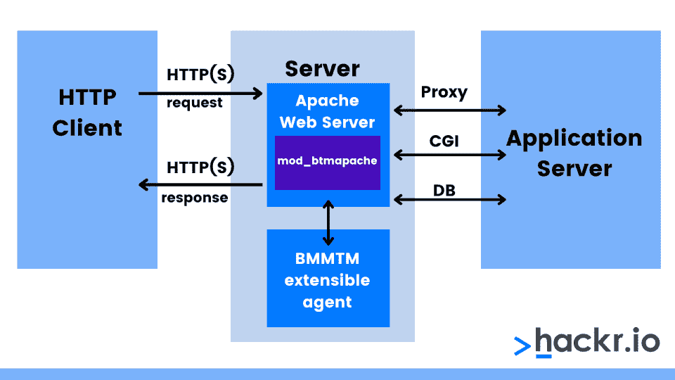
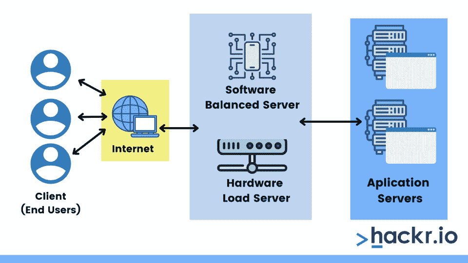
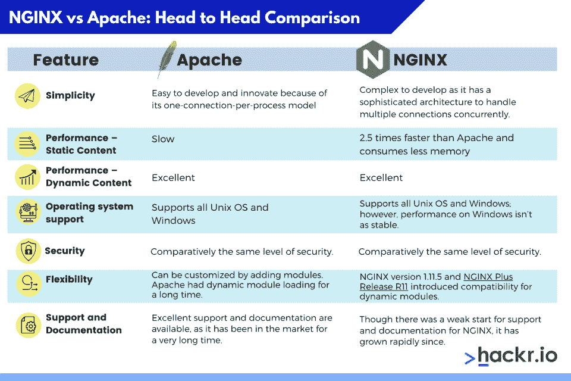

# NGINX 与 Apache:面对面的比较

> 原文：<https://hackr.io/blog/nginx-vs-apache>

当今支持互联网的两个最流行的开源 web 服务器是 Apache HTTP server 和 NGINX。世界上超过 50%的网站运行在这两台服务器上。在 NGINX(读作“engine-x”)出现之前的近二十年里，Apache Web 服务器为世界上大约 60%的网站提供服务。

由于数据流量和万维网用户数量的爆炸性增长，NGINX 被引入来克服 Apache web 服务器的性能限制。NGINX 是为更高的并发性而设计的，可以作为独立的 web 服务器部署，也可以作为 Apache 和其他 web 服务器的前端代理。

但是当谈到本质时，这两者是如何相互对抗的呢？这就是我们要调查的。NGINX 与 Apache 的比较涵盖了您需要了解的关于这两者的一切。

## **什么是阿帕奇？【定义】**

Apache 是一个由开放的开发者社区开发和维护的开源软件，它可以在多种操作系统上运行。它的开发是为了通过互联网提供 web 内容，并且众所周知，它在万维网的最初发展中发挥了关键作用。

Apache 架构包括 Apache 核心和模块。核心组件提供基本的类似服务器的功能，接受连接和管理并发性。各种模块对应于对每个请求执行的不同功能。特定的 Apache 部署可以被配置为包括不同的模块，比如安全特性、动态内容管理或基本的 HTTP 请求处理。

“一个服务器做所有事情”的模式是 Apache 早期成功的关键。然而，随着流量水平的提高、web 页面的丰富以及性能的限制，调整 Apache 来处理真实世界的流量变得更加复杂。

### **需要更多培训吗？查看这些阿帕奇课程！**

## **NGINX 是什么？【定义】**

NGINX 是专门为解决 Apache web 服务器的性能限制而编写的。NGINX 的性能和可伸缩性源于它的事件驱动架构。它与 Apache 的每个连接一个进程或一个线程的方法有很大不同。

在 NGINX 中，每个工作进程可以同时处理数千个 HTTP 连接。因此，NGINX 是一个轻量级、可伸缩和高性能的实现。这种架构使得在 RAM 使用、CPU 使用和延迟方面对高波动数据负载的处理更加可预测。

NGINX 还具有丰富的特性，可以执行各种服务器角色:

*   HTTP、HTTPS、SMTP、POP3 和 IMAP 协议的反向代理服务器。
*   负载平衡器和 HTTP 缓存。
*   Apache 和其他 web 服务器的前端代理，结合了 Apache 的灵活性和 NGINX 良好的静态内容性能。

## **Apache 和 NGINX 的区别**

我们使用 6 个标准来比较 Apache 和 NGINX。正如您将看到的，这种 web 服务器比较很大程度上导致了一个结论，即它们都有自己的用途。

### **1。简单性**

在 Apache 上开发和创新应用程序很容易。每个进程一个连接的模型使得在 web 服务逻辑的任何地方插入模块变得非常容易。开发人员可以这样添加代码，如果出现故障，只有运行代码的工作进程会受到影响。所有其他连接的处理将不受干扰地继续。

另一方面，NGINX 拥有复杂的架构，这使得模块开发更具挑战性。NGINX 模块开发人员需要创建高效准确的代码，没有任何故障，与复杂的事件驱动内核进行适当的交互，以避免阻塞操作。

### **2。性能**

Apache 与 NGINX 的性能是通过服务器如何向客户端浏览器交付大量内容来衡量的，这是一个重要因素。内容可以是静态的也可以是动态的。

#### **2.1。静态内容**

NGINX 的执行速度比 Apache 快 2.5 倍，Apache 测试运行多达 1000 个同时连接。另一个在 512 个同时连接上运行的基准测试表明，NGINX 的速度快了大约一倍，而且消耗的内存更少。

毫无疑问，NGINX 在静态内容上比 Apache 更有优势。所以如果你需要服务并发的静态内容，NGINX 是正确的选择。

#### **2.3。动态内容**

对于显示动态内容，Speedemy 的基准测试结果显示，Nginx 与 Apache 的性能完全相同。一个可能的原因是，几乎所有的请求处理时间都花费在 PHP 运行时环境中，而不是 web 服务器的核心部分。PHP 运行时环境与这两种 web 服务器非常相似。

Apache 还可以通过在每个 worker 实例中嵌入 PHP 等语言的处理器来处理动态内容。这使得它可以在 web 服务器内部执行动态内容，而不必依赖外部组件。这些动态处理器可以通过使用可动态加载的模块来启用。

NGINX 没有任何本地处理动态内容的能力。为了处理 PHP 和其他对动态内容的请求，NGINX 必须传递给外部处理器来执行，并等待呈现的内容被发送回来。然而，这种方法也有一些优点。因为动态解释器没有嵌入到工作进程中，所以它的开销只存在于动态内容中。

### **3。操作系统支持**

Apache 运行在所有操作系统上，如 UNIX、Linux 或 BSD，并且完全支持 Microsoft Windows。NGINX 也运行在几个现代的类 UNIX 系统上，并支持 Windows，但它在 Windows 上的性能不如在 Unix 平台上稳定。

### **4。安全性**

Apache 和 NGINX 都是安全的 web 服务器。Apache 安全小组为 Apache 项目提供安全问题的帮助和建议，并协调安全漏洞的处理。正确配置服务器并了解设置中每个选项的作用非常重要。有许多准则来保护服务器以防止安全攻击。

### **5。灵活性**

可以通过添加模块来定制 Web 服务器。Apache 拥有动态模块加载已经有很长时间了，所以所有的 Apache 模块都支持这一点。

NGINX Plus 是建立在开源 NGINX 之上的软件负载平衡器、web 服务器和内容缓存，它也使用模块化架构。可以通过软件模块添加新的特性和功能，这些模块可以根据需要插入到正在运行的 NGINX Plus 实例中。

动态模块为 NGINX Plus 添加了一些功能，比如通过 IP 地址对用户进行地理定位、调整图像大小以及将 Lua 脚本嵌入 NGINX Plus 事件处理模型。模块由 NGINX 和第三方开发者共同创建。

两个 web 服务器都支持大多数必要的核心模块功能(例如代理、缓存、负载平衡)。

### **6。支持和文档**

要考虑的一个要点是除了其他软件之外，对 web 服务器的可用帮助和支持。因为 Apache 已经流行了很长时间，所以对服务器的支持相当普遍。对于核心服务器和涉及将 Apache 与其他软件挂钩的基于任务的场景，有一个大型的第一和第三方文档库。

除了文档，许多工具和 [web 项目](https://hackr.io/blog/best-web-development-projects)包括在 Apache 环境中引导自己的工具。这可能包含在项目本身中，或者包含在发行版的打包团队维护的包中。

总的来说，Apache 从第三方项目获得了更多的支持，这仅仅是因为它的市场份额和它已经存在的时间长度。

对于 NGINX，过去很难找到全面的英语文档，因为大多数早期开发和文档都是俄语的。然而，现在文档已经完成，NGINX 站点上有大量的管理资源，第三方也有可用的文档。

## **NGINX vs Apache:势均力敌的对比**

| **功能** | **阿帕奇** | **NGINX** |
| 简单 | 由于其每个进程一个连接的模型，易于开发和创新 | 开发起来很复杂，因为它有一个复杂的体系结构来同时处理多个连接。 |
| 性能-静态内容 | 慢的 | 比 Apache 快 2.5 倍，消耗的内存更少 |
| 性能–动态内容 | 优秀的 | 优秀的 |
| 操作系统支持 | 支持所有 Unix 操作系统和 Windows | 支持所有 Unix 操作系统和窗口；然而，Windows 上的性能并不稳定。 |
| 安全性 | 相对相同的安全级别。 | 相对相同的安全级别。 |
| 灵活性 | 可以通过添加模块进行定制。Apache 很久以前就有动态模块加载了。 | NGINX 版本 1.11.5 和 [NGINX Plus 版本 R11](https://www.nginx.com/blog/nginx-plus-r11-released/) 引入了动态模块的兼容性。 |
| 支持和文档 | 出色的支持和文档是可用的，因为它已经在市场上存在了很长时间。 | 尽管对 NGINX 的支持和文档开始时很弱，但后来发展很快。 |

## **NGINX 和 Apache——协同工作**

在 Apache 和 NGINX 之间做出选择可能很困难，但是您可以同时使用两者。对于许多应用程序，NGINX 和 Apache 可以很好地互补。

[网络工程师用 Python 掌握网络自动化](https://click.linksynergy.com/link?id=jU79Zysihs4&offerid=1045023.1909942&type=2&murl=https%3A%2F%2Fwww.udemy.com%2Fcourse%2Fmaster-python-network-automation-for-network-engineers%2F)

一个非常常见的开始模式是在基于 Apache 的 web 应用程序前面部署开源 NGINX 软件作为代理(或 NGINX Plus 作为应用程序交付平台)。NGINX 执行与 HTTP 相关的繁重任务——服务静态文件、缓存内容和卸载慢速 HTTP 连接——以便 Apache 服务器可以在安全的环境中运行应用程序代码。

## **结论**

正如所见，Apache 和 NGINX 都是强大、灵活和有能力的。这两款服务器的最新版本在各个领域都很有竞争力。决定哪种服务器最适合您，很大程度上取决于评估您的特定需求并决定最佳选项。例如，对于静态内容，NGINX 会好得多。

至于哪个更好，没有现成的答案。像许多涉及到开发的决策一样，选择将归结于您的需求是什么。

## **常见问题解答**

#### **1。Apache 比 NGINX 好吗？**

从性能上来说，NGINX 比 Apache 好很多。NGINX 的执行速度比 Apache 快 2.5 倍，而且消耗的内存也更少。然而，Apache 有更多的功能和特性。值得注意的是，两者可以一起使用。

#### **2。Apache 和 NGINX 一样吗？**

不，Apache 和 NGINX 是不一样的。它们都是开源的 web 服务器，但 Apache 是 HTTP 服务器，NGINX 也可以用作反向代理服务器。

#### **3。NGINX 能取代 Apache 吗？**

不太可能。虽然 NGINX 效率更高，但是它没有 Apache 的配置系统，两者各有利弊。

#### **4。为什么 NGINX 比 Apache 快？**

NGINX 的架构使它在处理大量静态内容时更有能力。它不需要上下文切换，因此单个线程可以处理所有请求。

#### **5。PHP 可以在 NGINX 上运行吗？**

是的，你可以在 NGINX 上运行 PHP。你可以很容易地在网上找到安装说明。

#### **6。阿帕奇还用吗？**

是的，Apace 仍然被广泛使用。它仍然是最受欢迎的网络服务器之一。

#### **7。脸书用 Apache 还是 NGINX？**

都不是。脸书使用他们自己设计的运行在 Linux 上的定制服务器。

**人也在读:**