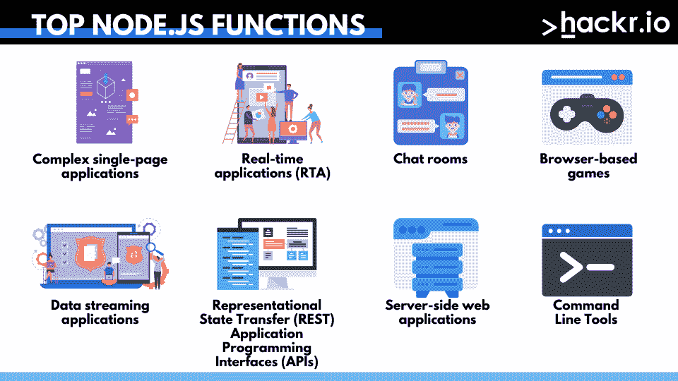
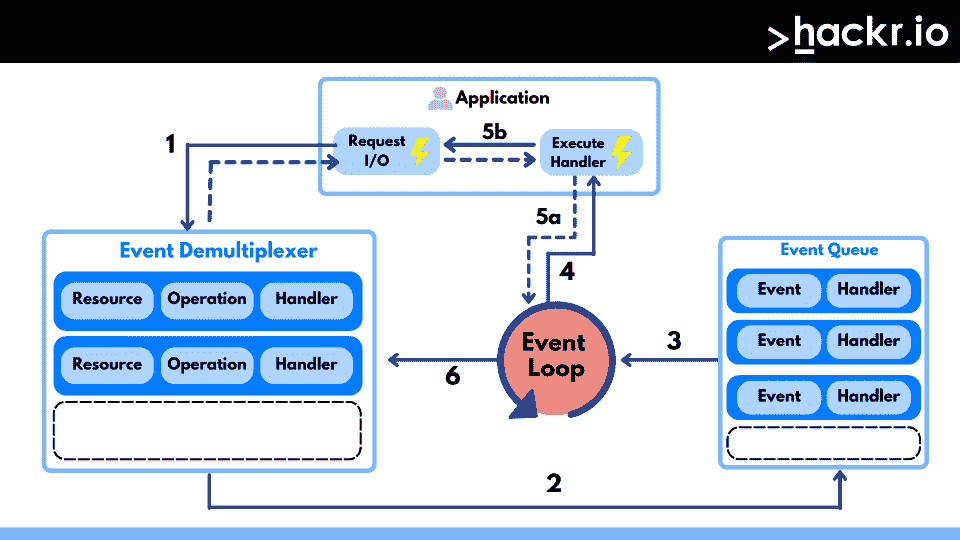

# 50 强 Node.js 面试问答[2023]

> 原文：<https://hackr.io/blog/node-js-interview-questions>

Node.js 是一个 JavaScript 环境，用于在浏览器外执行 JavaScript 代码。基于 Chrome 的 V8 引擎，它代表了*JavaScript anywhere and everywhere*编程范式，将 web 应用程序开发统一到一种语言，而不是服务器和客户端脚本的不同语言。

LinkedIn、IBM、GoDaddy、Groupon、网飞、Paypal 都使用 [Node.js](https://hackr.io/blog/what-is-node-js) 。它越来越受欢迎，引发了对 Node.js 开发人员的需求，这意味着大量的工作机会！

但是如果你对面试感到紧张，不要担心。我们将帮助您准备这些 Node.js 面试问题。先说一些入门级角色的基本节点 js 问题。

## **Node.js 面试问答**

### **Node.js 大一新生面试问题**

这些初学者节点面试问题涵盖了基本概念，但重要的是你彻底了解它们。

#### **1。Node.js 是什么？**

Node.js 是以 Chrome 的 V8 JavaScript 引擎为平台构建的 JavaScript 运行时环境。它之所以受欢迎，是因为它轻量级且高效，这得益于它的事件驱动和非阻塞 I/O 模型。Node.js 以性能为主要关注点，将 JavaScript 代码处理为本机代码，您的计算机可以使用这些代码来执行进程。

尽管 Node.js 基于 Chrome 的 V8 引擎，但它本身并不在浏览器中运行。在开发过程中，各种功能(如文件系统 API、HTTP 库和操作系统实用程序方法)被添加到引擎中，因此 Node.js 可以作为计算机上的程序执行。

#### **2。Node.js 中的“子线程”是如何处理的？**

基本上，Node.js 是一个单线程进程。它不向开发人员公开任何子线程和线程管理模式。然而，子线程可能在 Node.js 中的各种进程中生成，如异步 I/O。尽管通过这些进程产生的子线程在后台运行，但它们不会阻塞主代码或执行任何应用程序代码。但是，如果您需要在 Node.js 支持的应用程序中提供线程支持，可以使用多种工具。

#### **3。Angular JS 和 Node.js 有哪些区别？**

以下是 Angular JS 和 Node.js 的一些区别

| **角型** | **Node.js** |
| 用打字稿写的 | 用各种语言编写，如 C、C++和 JavaScript |
| 非常适合创建高度互动的网页 | 适合小规模项目和应用 |
| 用于 [web 应用开发的开源框架](https://hackr.io/blog/web-development-ide) | 基于多平台的运行时环境 |
| 用于为客户端创建单页应用程序 | 用于创建服务器端网络应用程序 |
| 帮助将应用程序拆分成模型-视图-控制器(MVC)组件 | 帮助生成数据库查询 |
| 适合开发实时应用程序 | 适用于需要快速行动和扩展的情况 |
| Angular 本身就是一个 web 应用框架 | Node.js 有很多框架，包括 Express.js、Partial.js 等等 |

#### **4。陈述 Node.js.** 的主要用途

以下是 Node.js 的一些函数:

*   复杂的单页应用程序: Node.js 非常适合创建复杂的单页应用程序，比如在线绘图工具、邮件解决方案和社交网络。这些类型的应用程序仅限于一个页面，UX 类似于桌面应用程序。这里可以使用 Node.js，因为它在后端有异步数据流。
*   **实时应用(RTA):** 我们在日常生活中使用一些实时应用，如 Google Docs、Slack、Skype、WhatsApp 等等。Node.js 的事件 API、WebSockets 和异步数据流确保了无故障的服务器操作，这可以即时更新数据。
*   **聊天室:**这可能是 RTA 下的俱乐部，但由于即时消息和聊天已经成为顶级实时应用模型之一，它需要特别关注。如果你有一个聊天室产品，你会考虑轻量级、高流量和大量数据流等需求。Node.js 和后端的一些 [JavaScript 框架](https://hackr.io/blog/best-javascript-frameworks)满足了所有这些需求。前面提到的 web 套接字对于在聊天室环境中接收和发送消息很方便。
*   **基于浏览器的游戏:**上述聊天室也可以集成到基于浏览器的游戏中，其中 Node.js 是一个完美的选择。将 Node.js 技术与 HTML5 甚至 js 工具相结合，将有助于您创建基于浏览器的实时游戏。
*   **数据流应用:**这些应用的关键卖点在于它们在卸载阶段的数据处理。通过这种方式，可以预先下载一些部分以保持连接，稍后再下载其他部分。在这种情况下，Node.js 流应用程序处理音频和视频数据。
*   **表述性状态转移(REST)应用编程接口(API):**由于超文本传输协议(HTTP)的广泛使用，基于 REST 的 API 在现代商业软件架构的构建中占据着关键地位。Node.js 生态系统的 Express.js 框架可以帮助构建快速、轻量的 REST APIs。
*   **服务器端 web 应用:**虽然 Node.js 及其框架可以帮助创建服务器端 web 应用，但您不能指望 CPU 密集型操作。
*   **命令行工具:** Node.js 的庞大生态系统有助于构建 CLT——查看在线教程来构建自己的生态系统。



#### **5。什么是事件驱动编程？**

事件驱动编程方法使用事件来触发各种功能。在这种情况下，事件可以是任何事情，例如按键或单击鼠标按钮。每当事件发生时，就会按照“发布-订阅”模式执行一个已经向元素注册的回调函数。由于这种编程方法，Node.js 比其他类似技术更快。

#### **6。在 Node.js 的上下文中，REPL 是什么？**

REPL 阅读，评估，打印和循环。REPL 是一种计算机环境(类似于 Windows 控制台或 Linux shell ),任何输入的命令都会得到系统响应输出。默认情况下，REPL 环境与 Node.js 捆绑在一起，它执行以下任务:

*   **读取**用户输入，将它们转换成 JavaScript 数据结构，并存储它们。
*   **评估**数据结构。
*   **打印**最终输出
*   **循环**所提供的命令，直到 CTRL + C 被按下两次。

#### **7。Node.js 中的测试金字塔是什么？**

测试金字塔是解释成功开发项目所需的单元测试、集成测试和端到端测试的比例的图形:

*   单元测试:他们独立地快速测试单个的代码单元。
*   **集成测试:**测试不同单元之间的集成。
*   端到端(E2E)测试:他们将系统作为一个整体进行测试，从用户界面到数据存储，然后返回。

#### **8。什么是 libuv？**

Libuv 是 Node.js 的支持库，用于异步输入/输出。虽然它最初只是为 Node.js 开发的，但现在已经可以在其他系统上使用，比如 Luvit、Julia、Pyuv 等等。它的一些功能包括:

*   文件系统事件
*   子进程
*   全功能事件循环支持
*   异步 TCP 和 UDP 套接字

#### **9。Node.js 是 CPU 密集型应用的最佳平台吗？**

CPU 激励型应用程序并不是 Node.js 的强项。CPU 密集型操作会阻塞传入的请求，并将线程推入危急情况。

#### 10。Express JS 包的用途是什么？

Expressjs 构建于 Node.js 之上，是一个 JS 框架，用于管理服务器端应用程序中路由和服务器之间的信息流。轻量级、灵活且充满相关特性，非常适合移动和 web 应用程序开发。

#### **11。Node.js 和 Javascript 的主要区别是什么？**

| **Node.js** | **JavaScript** |
| 跨平台开源 JS 运行时引擎。 | 一种基于 OOPS 概念的高级脚本语言。 |
| 代码可以在浏览器之外运行。 | 代码只能在浏览器中运行。 |
| 在服务器端使用。 | 在客户端使用。 |
| 没有添加 HTML 标签的功能。 | 可以添加 HTML 标签。 |
| 只能在谷歌 Chrome 的 V8 引擎上运行。 | 可以在任何浏览器上运行。 |
| 用 C++和 JavaScript 写的。 | 用 C++写的 ECMA 脚本的升级版本。 |

#### **12。Node.js 的主要好处是什么？**

Node.js 的好处是:

*   易于学习和巨大的社区支持。
*   易于扩展和高性能。
*   高度可扩展，支持扩展。
*   支持全栈 JavaScript。
*   缓存机制允许网页加载更快。
*   非阻塞输入输出系统。

#### 13。异步和非阻塞的区别是什么？

异步或非同步意味着我们不会立即收到对消息的响应——没有依赖关系或执行顺序。服务器存储信息，并在执行操作时进行确认。这提高了性能和效率。

非阻塞操作不会停止或阻塞任何操作。不同之处在于，无论有什么数据可用，非阻塞操作都会立即收到响应。如果数据不可用，它将返回一个错误。它主要与 I/O 一起使用。

#### **14。package.json 是什么？**

npm 包在项目根文件夹中包含一个 package.json 文件，其中包含与项目相关的元数据。它向 npm 提供信息，npm 通过这些信息识别项目及其依赖关系。除此之外，它还包含其他元数据，如项目描述、版本、许可信息和配置数据。

#### 15。描述 Node.js 中的错误优先回调

错误优先回调，也称为错误返回，给出错误和数据。它有几个参数，第一个是错误对象，其他的是数据。错误优先回调模式有很多优点:因为它是一致的，导致更多的采用，如果没有对数据的引用，就没有必要处理它。如果没有错误，调用回调时将 null 作为第一个参数。

### **高级 Node.js 资深职场人士面试问题**

现在我们进入高级节点面试问题。记住能够将这些概念付诸实践。

#### 16。解释 module.exports 的用途。

当部分代码喜欢对象、函数、字符串等时，它们会告诉 Node.js。应该从给定的文件中导出，以便其他文件可以访问它。假设我们有这个模块:

```
{

id: '.',

exports: {},

parent: null,

filename: '/modtest.js',

loaded: false,

children: [],

paths:

[

'/node_modules',

'/Users/node_modules',

'/Users/mycomp/projects/node_modules',

'/node_modules'

]

}
```

请注意，导出属性为空。如果我们对这个属性应用代码，它将成为模块的导出。如果我们需要另一个文件中的模块，那将是导出属性值:

```
module.exports.stringProperty = "Hello, welcome";

console.log(module);

{

id: '.',

exports: { stringProperty: 'Hello, welcome' }

...

}
```

#### **17。Node.js 中的反应器模式是什么？**

****

reactor 模式是 Node.js 中非阻塞 I/O 操作的一个概念，通过这个模式，我们获得了每个 I/O 操作的处理程序(或者回调函数)。每个 I/O 请求被提交给多路分解器，该多路分解器处理并发性并对请求/事件进行排队。它由资源、事件通知器/解复用器、事件循环、事件队列、请求处理程序等组成。

#### 18。解释 Node.js 的 LTS 版本

LTS 或长期支持适用于由 Node.js 项目长期支持和维护的发布行。LTS 有两种类型:

1.  主动，即主动维护和升级，以及
2.  维修线接近线的末端，维修时间很短。

#### **19。什么是 URL 模块？**

URL 模块提供了处理 URL 的 API:

*   特定于 Node.js 的遗留 API。
*   实现 WHATWG URL(web 浏览器使用的标准)的较新 API。

一些示例方法是 URL 类下的 URL.port、URL.password、URL.host、url.toString()。如需完整文档，请查看官方的 [URL 模块页面](https://nodejs.org/api/url.html#:~:text=The%20url%20module%20provides%20two,Standard%20used%20by%20web%20browsers.)。

#### 20。解释控制流函数。

控制流函数是执行语句或函数的顺序。因为 I/O 操作在 Node.js 中是非阻塞的，所以控制流不能是线性的。因此，它向事件循环注册一个回调，并将控制传递回节点，以便接下来的代码行可以无中断地运行。例如:

```
[code language="javascript"]

fs.readFile('/root/text.txt', func(err, data){

console.log(data);

});

console.log("This is displayed first");

[/code]
```

在这种情况下，readFile 操作需要一些时间；但是，下一个 console.log 不会被阻止。一旦操作完成，您将看到显示的数据。

#### **21。Node.js 中 spawn()和 fork()方法的主要区别是什么？**

| **产卵** | **叉子** |
| 旨在运行系统命令。 | spawn()的一个特殊实例，它运行 V8 的一个新实例。 |
| 不执行节点进程中的任何其他代码。 | 可以创建在同一个节点代码基上运行的多个工作线程。 |
| child_process.spawn(command[，args][，options])用给定的命令创建一个新进程。 | spawn()的特例，用于创建子进程。child_process.fork(modulePath[，args][，options]) |
| 在父进程和子进程之间创建流接口(二进制格式的数据缓冲)。 | 在父进程和子进程之间创建通信(消息传递)通道。 |
| 对于数据流(读/写)等连续操作更有用。例如，将图像/文件从种子进程流式传输到父进程。 | 对于消息传递更有用。例如，JSON 或 XML 数据消息传递。 |

#### **22。Node.js 中 ExpressJS 包的用途是什么？**

ExpressJS 包或框架构建在 Node.js 之上，用于快速跟踪单页面、多页面和基于混合服务器的应用程序的开发。据说 Express 是 MEAN 栈的后端部分。

```
let execseq = function() { 

setImmediate(() => console.log("immediate")); 

process.nextTick(() => console.log("nextTick")); 

console.log("event loop");

}
```

这将执行“事件循环”、“nextTick”和“immediate”

#### **24。Node.js 和 Ajax 有什么区别？**

Ajax 是一种客户端技术，可以更新页面内容而无需刷新页面。Node.js 是用于开发服务器软件的服务器端 JavaScript。此外，Node.js 是一个成熟的开发环境，而 Ajax 只是获取数据或运行脚本。

#### **25。为什么快递的“app”和“server”一定要分开？**

如果我们将应用程序和服务器功能分开，代码可以分成多个模块，这就减少了模块之间的依赖性。每个模块将执行一项任务。最后，逻辑的分离有助于避免重复代码。

虽然 immediate 这个词有点误导，但是回调只发生在 I/O 事件回调之后。当我们调用 setImmediate()时。，setTimeout()用于为一次性回调的执行设置延迟(以毫秒为单位)。如果我们执行:

```
setImmediate(function() {

console.log('setImmediate')

})

setTimeout(function() {

console.log('setTimeout')

}, 0)
```

我们将得到“setTimeOut”和“setImmediate”形式的输出。

#### **27。列举并解释 Node.js 的热门模块**

以下是 Node.js 的核心模块:

| 超文本传送协议（Hyper Text Transport Protocol 的缩写） | 包括用于创建 Node.js http server 的类、方法和事件。 |
| 统一资源定位器 | 包含 URL 解析和分析的方法。 |
| 查询字符串 | 处理查询字符串。 |
| 小路 | 包含使用文件路径的方法。 |
| 满量程 | 由处理文件 I/O 的类、方法和事件组成。 |
| 跑龙套 | 包括对开发者有用的实用函数。 |

#### **28。读写流的例子是什么？**

这里有一个阅读流的例子:

```
var readStream = fs.createReadStream('data.txt');

readStream.on('data', function(chunk) {

data += chunk;

});

Here’s an example of reading into stream:

var writeStream = fs.createWriteStream('dataout.txt');

writeStream.write(data,'UTF8');

writeStream.end();
```

#### **29。Node.js 中的加密模块是什么？如何使用？**

Node.js 中的 crypto 模块用于加密，也就是说，它包括一组用于开放 SSL 的散列、HMAC、签名、解密、加密和验证功能的包装器。

下面是一个使用密码进行加密的示例:

```
const crypto = require('crypto'); 

const cipher = crypto.createCipher('usrnm', 'pwdd'); 

var encryptd = cipher.update('Welcome to hackr', 'utf8', 'hex'); 

encryptd += cipher.final('hex'); 

console.log(encryptd);
```

让我们使用 decipher 来解密上面的内容，看看我们是否能得到相同的文本:

```
const crypto = require('crypto'); 

const decipher = crypto.createDecipher('usrnm', 'pwdd'); 

var encryptd = '<enter the previous output-encrypted code here>'; 

var decryptd = decipher.update(encryptd, 'hex', 'utf8'); 

decryptd += decipher.final('utf8'); 

console.log(decryptd);
```

#### 三十岁。解释 DNS 模块。

DNS 模块用于解析名称和实际的 DNS 查找。有了这个模块，不需要记忆 IP 地址，因为 DNS 服务器会将域/子域转换成 IP 地址。

#### 31。解释 Node.js 的安全机制

安全机制包括:

*   **授权码:**授权码有助于保护 Node.js 免受未经授权的第三方的攻击。任何想要访问 Node.js 的人都要通过资源提供者网络的 GET 请求。
*   **认证模块:**认证模块就像过滤器一样，扫描 Node.js 的库，以识别是否存在任何第三方代码。任何黑客行为都可以通过认证检测出来。
*   **筛选登记:**这是一个质量控制系统，所有的包(代码和软件)都经过检查，以确保其安全性。这种扫描有助于消除未经验证或不可靠的库进入您的应用程序。
*   **定期更新:**下载 Node.js 的最新版本可以防止潜在的黑客和攻击。

#### 32。解释 Node.js. 中各种类型的 API 函数

Node.js 中的两种 API 函数是:

*   **异步/非阻塞:**这些请求不等待服务器响应。它们继续处理下一个请求，一旦收到响应，它们就会收到同样的响应。
*   **同步/阻塞:**这些是阻塞任何其他请求的请求。一旦请求完成，下一个请求才会被处理。

#### 33。Node.js 有哪些 LTS 版本？

长期支持或 LTS 版本是 Node.js 发行版，要求关键修复、性能提升和安全更新。这些版本获得至少 1.5 年的支持，并专注于应用程序的安全性和稳定性。

#### 34。解释 assert 如何工作。

Assert 用于在 Node.js 中编写测试。只有当任何正在运行的测试用例失败时，才会提供反馈。为了测试不变量，该模块提供了一组断言测试。它由 Node.js 内部使用，但是如果您使用 require ('assert ')代码，您也可以在其他应用程序中使用它。

#### 35。什么是回调地狱？

在 Node.js 中，回调地狱也被称为末日金字塔。这些是由密集嵌套、不可读和不可管理的回调导致的，使得代码更难阅读和调试。这是由于不正确执行异步逻辑造成的。

#### 36。Node.js 中的存根是什么？

存根是用来模拟组件行为的程序或函数。存根在测试用例中提供函数的答案。

#### 37。什么是事件循环？

Node.js 处理异步回调。这是 Node.js 中非阻塞输入/输出的基础，使其成为最重要的特性之一。记住，Node.js 是事件驱动的。由于 Node.js 的本质是事件驱动的，所以可以将一个侦听器附加到一个事件，以便在事件发生时由前者执行回调。

Node.js 执行事件循环，然后继续执行其余代码，而不必等待输出。一旦整个操作结束，它就接收输出并执行回调函数。一旦它收到响应，这些功能就会被一个接一个地执行。

#### 38。Node.js 中的流是什么？有哪些类型？

在 Node.js 中，流是类似于字符串和数组的数据集合。此外，流是对象，通过它可以连续读取源数据或写入目标数据。这些流对于阅读和处理大量信息特别有帮助。Node.js 中有四种类型的流，它们是:

*   **可读**:用于从源读取大量数据
*   **可写**:用于将数据写入目的地
*   **双工**:用于读写
*   **转换**:用于数据修改的双工流

#### 39。列举并解释 Node.js. 的计时功能

Node.js 提供了一个定时器模块，该模块包含在特定时间段后执行代码的多个函数。该模块中提供的一些函数包括:

*   **process.nextTick:** 该函数调度一个回调函数，该函数需要在事件循环的下一次迭代中被调用
*   **setTimeout/clearTimeout:** 该函数在指定的时间量(以毫秒为单位)后调度代码执行
*   **set immediate/clear immediate:**该函数在现有事件循环周期结束时执行代码
*   **setInterval/clearInterval:**该函数用于多次执行一段代码

process.nextTick()和 setImmediate()都是 Timers 模块的函数，但是区别在于它们的执行。

*   process.nextTick()函数等待动作的执行，直到事件循环中的下一次循环，或者当事件循环结束时，才调用回调函数。
*   setImmediate()函数用于在事件循环的下一个周期执行回调方法，该方法将回调方法返回到事件循环以执行输入/输出操作。

#### 41。解释 readFile 并在 Node.js 中创建 read stream

readFile 和 createReadStream 都是读取和执行 Node.js 提供的文件的方法。

readFile 过程是完全缓冲的，只有当整个文件进入缓冲区并且可以读取时才返回响应。此过程占用大量内存，如果文件很大，会变得很慢。

createReadStream 进程是部分缓冲的，将整个进程视为一系列事件。在此过程中，整个文件被分割成块进行处理，然后作为响应逐个连续发送。与 readFile 不同，createReadStream 在读取和处理大文件时非常有效。

#### **42。Node.js 提供调试器吗？**

Node.js 提供了内置的 TCP 协议和调试客户端。如果希望调试文件，可以在要调试的 js 文件名前使用以下参数。

```
node debug [script.js | -e “script” | :]
```

#### **43。描述 Node.js.** 中的退出代码

Node.js 中的退出代码是一组特定的代码，用于结束进程，也可以包括全局对象。Node.js 中的一些退出代码是:

*   内部 JavaScript 评估失败
*   致命错误
*   内部异常处理程序运行时失败
*   不用的
*   未捕获的致命异常

#### **44。为什么要用 NODE_ENV？**

当任何 Node.js 项目处于生产阶段时，Node.js 推广使用 NODE_ENV 变量来标记它的原则。当 NODE-ENV 设置为生产时，应用程序的执行速度将比平时快 2 到 3 倍。该变量还可以提高项目开发阶段的判断能力。

#### **45。Node.js 中的 EventEmitter 是什么？**

Node.js 有一个 EventEmitter 类，它包含所有可以发出事件的对象。这些对象包含一个名为 eventEmitter.on()的函数，使用该函数可以将多个函数附加到对象发出的事件。每当 EventEmitter 类中的一个对象抛出一个事件时，该事件的所有附属函数都会被同步调用。

#### **46。什么是 Punycode？**

Punycode 可以定义为 Node.js 中的一种编码语法，它有助于将 Unicode 字符串转换为 ASCII。这样做是因为主机名只能理解 ASCII 代码，而不能理解 Unicode。虽然在最近的版本中，它被捆绑在缺省包中，但是您可以使用下面的代码在以前的版本中使用它:

```
punycode = require(‘punycode’);
```

#### **47。解释 JIT 的概念并强调它与 Node.js 的关系**

JIT 或即时编译器通过将字节码(由可解释的指令组成)转换成指令，将其发送给处理器。一旦你完成了程序的编写部分，源语言语句就被编译器编译成字节码，而不是类似于目标硬件平台处理器的携带数据的代码。

Node.js 采用 JIT 编译，这在很大程度上提高了代码执行的速度。它获取源代码，并在运行时将其转换为机器码。通过这种方式，定期调用的函数被编译成机器码，提高了代码执行的整体速度。

#### **48。Node.js 中为什么使用 buffer 类？**

在 Node.js 中，buffer 类以类似于整数数组的方式存储原始数据。但是，它与原始内存转储通信，内存转储在 V8 堆之外分配。buffer 类是一个全局类，可以在应用程序中访问它，而不必导入 Buffer 模块。它通常用于纯 JavaScript 代码不适合二进制数据的情况。

#### 49。fork 和 spawn 方法是如何工作的？

在 Node.js 中，spawn()用可用的命令集启动一个新进程。这不会生成新的 V8 实例；处理器上只有一个节点模块副本是活动的。当您的子进程向节点返回大量数据时，可以使用此方法。

另一方面，fork()是 spawn()的一个特例，它生成一个新的 V8 引擎实例。通过这种方法，多个工作者在单个节点代码库上运行多个任务。

#### 50。陈述编写 Express JS 应用程序的步骤。

要设置 ExpressJs 应用程序，您需要完成以下步骤:

*   用项目名称创建一个文件夹
*   在文件夹中创建一个名为 package.json 的文件
*   在命令提示符下运行“npm install”命令，安装程序包文件中的库\
*   创建一个名为 server.js 的文件
*   在包含名为 index.js 的文件夹的包中创建“router”文件
*   应用程序是在包含 index.html 文件的包中创建的

## **奖励提示**

这里有一些额外的建议，可以确保你通过面试。

*   **重点关注 Node.js 编程面试问题。**我们的综合清单简化了这一部分。你可以在网上找到一些这样的资源，包括 Hackr。就像每次科技面试一样，
*   **练习:**现场编码比清闲更伤脑筋，但面试官需要看到你在行动中的技巧。练习几个编码问题，为面试做准备。
*   **温习相关工具:**重要的是你有使用其他相关技术工具和[框架的经验](https://hackr.io/blog/nodejs-frameworks)。这包括 MySQL、Mongo 或 Postgres，以及 React、Angular 或前端框架的主干。

## **结论:开始准备你的 Node.js 面试**

说到这里，我们的 top Node.js 面试问题到此结束。在你准备 Node js 面试的时候，可以考虑看看由社区成员策划的最好的 [Node.js 教程](https://hackr.io/tutorials/learn-node-js?ref=blog-post)。这些都会对你的 Node js 面试有很大的帮助。如果你准备好长期学习了呢？

[**报名参加 Node.js 开发者课程**](https://click.linksynergy.com/deeplink?id=jU79Zysihs4&mid=39197&murl=https://www.udemy.com/course/the-complete-nodejs-developer-course-2/)

## **常见问题解答**

#### **1。我该如何准备节点面试？**

你可以用我们上面列出的 Node js 编程面试问题综合清单来准备 Node 面试。留出时间练习 Node.js 编码问题！

#### **2。节点 JS 中的回调是什么？**

回调是任务完成时调用的函数。它允许其他代码同时运行，并防止阻塞。

**人也在读:**