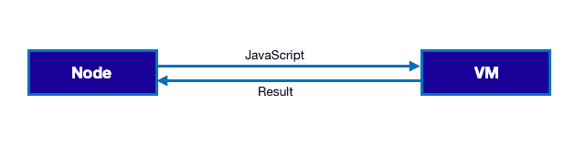
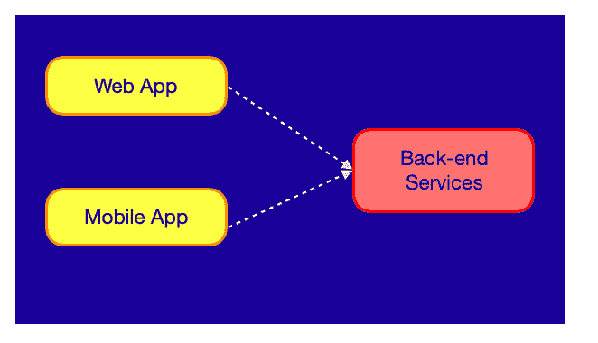
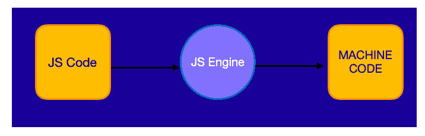
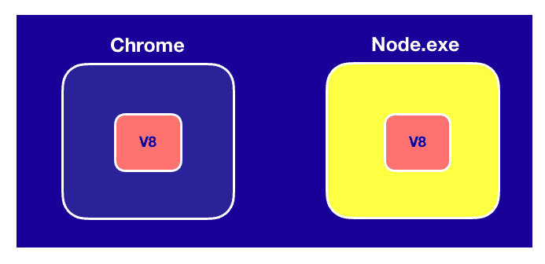
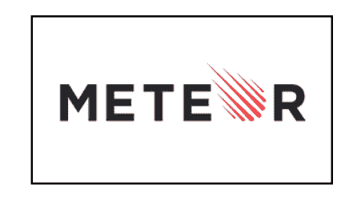
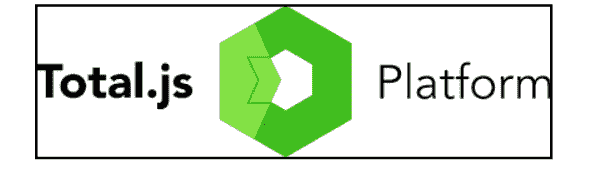
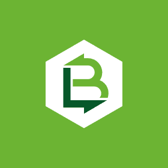

# 开发人员的 10 个最佳 NodeJS 框架[更新]

> 原文：<https://hackr.io/blog/nodejs-frameworks>

## 什么是节点？

Node 也称为 Node.js，其中 js 表示 JavaScript 是一个开源的跨平台运行时环境，用于在浏览器之外执行 JavaScript 代码。为了在后端服务器上运行 JavaScript，Google 的 V8 等虚拟机在服务器上执行 JS，因此 Node 是 V8 等虚拟机的包装器，内置模块通过易于使用的异步 API 提供丰富的功能。

像**API(应用程序编程接口)**这样的后端服务使用 Node 来构建它的服务。这些服务支持客户端应用程序，如 web 浏览器中的 web 应用程序和移动设备上的移动应用程序。用户看到这些客户端的应用程序并与之交互，因此，他们只是在表面上与位于服务器或云中的服务进行交互，以存储数据、发送电子邮件、推送通知、启动工作流等。

Node 是支持实时应用程序的高可伸缩性、数据密集型和实时后端服务的理想选择。

### **为什么节点是特殊的？**

*   非常适合原型和敏捷开发。
*   构建超快速和高度可伸缩的服务。
*   支持广泛使用的语言 JavaScript
*   更干净、更一致的代码库。
*   开源库的大型生态系统。

## **节点的架构**

传统上，浏览器为 JS 代码提供运行时环境。每个浏览器都有一个 JS 引擎，将 JS 代码转换成机器码。例如，微软 Edge 有 Chakra，火狐有 spider monkey，Chrome 有 [V8 引擎](https://en.wikipedia.org/wiki/V8_engine)。

为了在浏览器之外执行 JS，最快的引擎 V8 被嵌入到一个 C++程序中，这被称为 Node。因此，Node 是 JS 代码的运行时环境。

它包含执行 JS 代码的 JS 引擎，但也包含某些对象，这些对象为 JS 代码提供了浏览器内部没有提供的环境。

## NodeJS 框架

现在让我们看看流行的 NodeJs 框架:

### 1.Hapi.js

它是由沃尔玛的 Eran Hammer 在黑色星期五试图处理交通时推出的。它是一个强大而健壮的开源最佳节点 JS 框架，用于开发 JSON API。应用程序编程接口(API)服务器、网站和 HTTP 代理应用程序都是使用 hapi.js 构建的。各种关键功能(如输入验证、实现缓存、基于配置的功能、错误处理、日志记录等)以及完善的插件系统使哈比神成为最受欢迎的框架之一。它被 PayPal、Disney 等大型网站用于构建有用的应用程序和提供技术解决方案。

**特性:**

*   代码可重用性
*   没有外部依赖性
*   安全性
*   集成架构:在节点框架中提供全面的授权和身份验证 API。

### 2.快递. js

Express.js 由 TJ Holowaychuk 构建，是一个灵活且最小的 Node.js 应用程序框架，专门用于构建单页面、多页面和混合应用程序，为 web 和移动应用程序提供一组强大的功能。

Express 没有现成的对象关系映射引擎。Express 不是围绕特定组件构建的，对于您将什么技术插入其中“没有意见”。这种自由，加上闪电般的设置和 Node 的纯 JavaScript 环境，使 Express 成为敏捷开发和快速原型开发的有力候选。Express 最受那些希望尽快构建产品并且没有太多遗留代码的初创公司的欢迎。

该框架的优势在于所有核心功能的持续更新和改革。它是一个极简框架，用于构建几个移动应用程序和 API。

### 3\. Koa.js

Koa 是一个跨平台的服务器端运行时环境应用程序，由广泛使用的 Node.js 框架——express . js 的创建者开发和维护，它是一个包含一系列中间件功能的对象，这些功能根据请求以堆叠的方式组合和执行，使 web 开发人员更容易用 JavaScript 构建快速和可伸缩的网络应用程序。它提高了互操作性和健壮性，并使编写中间件变得更加有趣。

目前，许多 web 开发人员甚至使用 Node.js 用 JavaScript 编写 web 应用程序的前端和后端。通过使用几个 Node.js 框架，Web 开发人员可以进一步加速定制 web 应用程序和应用程序编程接口(API)的开发。

### 4.帆. js

它是 Node.js 的模型-视图-控制器(MVC)框架，遵循“约定优于配置”的原则 Ruby on Rails web 框架启发了它，因此模拟了熟悉的 MVC 模式来构建单页应用程序、REST APIs 和实时应用程序。广泛使用代码生成器，允许用更少的代码编写构建应用程序。该框架构建在 Socket.io 之上，socket . io 是一个 JavaScript 库，用于向应用程序和 Express.js 添加实时、双向、基于事件的通信，express . js 是最流行的 Node.js 库之一。

### 5.流星. js

它是一个使用 Node.js 与任何前端框架(如 Angular、React，甚至 Blaze，即 Meteor 前端框架)构建应用程序的平台。它使用的数据库默认是 MongoDB。

**特性:**

*   零配置构建工具，提供代码拆分和动态导入。
*   它的速度更快，因为它具有实时功能。
*   前端和后端完美集成
*   Meteor 方法在服务器上定义服务器端功能，然后直接从客户端调用这些方法，而不必与隐藏的 API 进行交互。
*   帐户和用户认证是非常好的。
*   优秀的 as 构建平台不需要代码分离，它的所有代码都是一个平稳通信的代码库的一部分。

### 6.德比. js

DerbyJS 是一个用于构建现代实时 web 应用的开源全栈框架。使用 PubSub 并与任何数据库兼容。我们可以使用 NPM 向 Derby 项目添加特性和功能。任何其他的 party 库都不会自动加载，也不会全局包含在 Derby 中，必须像任何 node.js 项目一样“需要”。Derby 专注于允许用户创建快速加载的实时 web 应用程序，并且具有灵活性和可扩展性。可以在浏览器和服务器上提供模板。在浏览器中，DerbyJS 使用快速的原生 DOM 方法呈现。

**特性:**

*   实时协作
*   服务器渲染
*   组件和数据绑定
*   模块化的

### 7.Total.js

 Total.js 是一个模块化的现代 Node.js 三年前的框架，支持 MVC 架构。像 Angular.js、Polymer、Backbone.js、Bootstrap 这样的客户端框架，完全兼容这个框架。这个框架是可扩展的和异步的，并且提供了优秀的性能和稳定性。任何工具，如咕哝不需要压缩它容易使用。它还嵌入了 NoSql，并支持数组和其他原型。

**特性:**

*   快速支持和错误修复
*   支持 RESTful 路由
*   支持视频流
*   支持主题
*   支持工人
*   支持网站地图
*   支持 WebSocket
*   支持模型、模块、包和同构代码
*   支持通过 GM 或 IM 进行图像处理
*   支持发电机
*   使用 diff 工具和 CSV 导出支持本地化
*   支持限制和重定向

### 8.阿多尼斯

Adonis 是一个 node.js 框架，具有核心的 MVC 结构，这是一种设计模式，它将某些功能分解到应用程序的不同部分。Adonis 用的是 edge 模板引擎，真的很好用。

**特性:**

*   它有自己的 CLI(命令行界面)
*   熟悉拉勒维尔所以容易学习
*   验证器用于检查流入控制器的数据是否具有正确的格式，并在出现错误时发出消息。

### 9.嵌套. js

NestJS 是一个渐进的 Node.js 框架，用于构建高效、可靠和可伸缩的服务器端应用程序，帮助开发人员创建模块化、高度可伸缩和可维护的服务器端 web 应用程序。

它实现了 MVC(模型-视图-控制器)模式，并提供了可扩展性。NestJS 的突出特性是其对 TypeScript 的本机支持，这允许您访问可选的静态类型检查，以及针对大型应用程序的强大工具和最新的 ECMAScript 特性。

**特性:**

*   可扩展:由于模块化架构，允许使用任何其他库，从而使其真正灵活。
*   多功能:它提供了一个适应性强的生态系统，是各种服务器端应用程序的成熟主干。
*   Progressive:通过利用最新的 JavaScript 特性，为 node.js 世界带来了设计模式和复杂的解决方案。

### 10.LoopBack.js

 LoopBack 是一个 Node.js 框架，具有易于使用的 CLI 和动态 API explorer。它允许您基于您的模式创建您的模型，或者在没有模式的情况下创建动态模型。它兼容许多 REST 服务和各种数据库，包括 MySQL、Oracle、MongoDB、Postgres 等等。

它允许用户构建一个映射到另一个服务器的服务器 API，就像创建一个代理另一个 API 的 API 一样。它支持 Android/Java、iOS、浏览器 JavaScript(Angular)等客户端的原生移动和浏览器 SDK。

**特性:**

*   难以置信的可扩展性
*   图形 QL 支持

# 结论

学习新的 Node JS 框架可能会让人不知所措，并且可能需要在开始之前进行大量的研究。上面提到的节点 JS 框架是最普遍使用的，并提供不同的功能。你使用或者更喜欢使用哪个 NodeJS 框架？你还有其他框架可以分享吗？下面评论！

如果你想掌握 Node.js，那么这个 udemy 课程是一个很好的敲门砖:[完整的 Node.js 开发者课程](https://click.linksynergy.com/deeplink?id=jU79Zysihs4&mid=39197&murl=https%3A%2F%2Fwww.udemy.com%2Fcourse%2Fthe-complete-nodejs-developer-course-2%2F)。

**人也在读:**