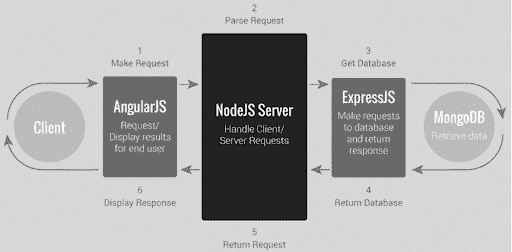
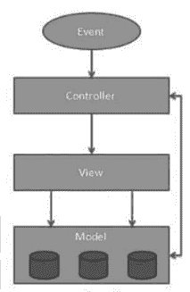

# 2023 年 NodeJS vs AngularJS:你应该知道的区别

> 原文：<https://hackr.io/blog/nodejs-vs-angularjs>

在比较 NodeJS 和 AngularJS 之前，我们先了解一下 MEAN stack 架构。MEAN Stack 是一个基于 Javascript 的技术集合，用于构建动态网站和 web 应用程序。MEAN 代表 MongoDB、ExpressJS、AngularJS 和 NodeJS。

MongoDB 是一个流行的数据库管理系统，它实现了 NoSQL 数据结构。

ExpressJS 是一个让 NodeJS 开发变得轻松的框架。

**A** : AngularJS 建立在 HTML 之上，将其视野扩展到 web 应用。

**N** : NodeJS 是一个运行时环境，可以用作应用程序后端。

NodeJS 和 AngularJS 是为使用 JavaScript 构建 web 应用和网站而开发的，但它们的架构和工作方式截然不同。让我们来看一下 web 应用程序的架构，这样您就可以了解如何使用这两种应用程序。

## node.js 与 angularjs 的比较

如你所见，AngularJS 用于前端开发，包括与客户端的交互，NodeJS 用于后端开发，包括与数据库服务器的交互。两者可以结合起来创建同构的 web 应用程序。

| **节点 j** | **角型** |
| NodeJS 是 Javascript 应用程序的跨平台和运行时环境。 | AngularJS 是一个由 Google 维护的用于 web 应用程序开发的开源平台。 |
| 为了使用 NodeJS，您需要将它安装到您的系统中。 | 为了使用 AngularJS，您需要像在应用程序中使用其他 javascript 文件一样添加 javascript 文件。 |
| Node.js 是一个建立在 Google V8 JavaScript 引擎之上的平台。 | Angular 遵循 javascript 的语法，就是这样。 |
| NodeJS 是用 C、C++和 Javascript 语言编写的。 | AngularJS 是用 Javascript 编写的，但它不同于 JQuery 等框架。 |
| 节点。Js 有许多其他不同的框架，如 Express.js、partial.js 和 Sail.js。 | 它本身就是一个框架。 |
| 它支持非阻塞 I/O API 和事件驱动架构。 | 它支持扩展 HTML 语法来描述应用程序的组件和元素。 |

### **MVC 框架**

AngularJS 提供了一个平滑的模型视图控制架构，它在本质上也是非常动态的。众所周知，任何应用程序都是由不同的模块组合而成的，这些模块的初始化方式互不相同。但是，这些模块仍然通过某种逻辑相互连接。开发人员必须单独构建所有组件，然后将它们与一些代码和应用逻辑结合起来，将它们转换成一个应用程序。当然，对于使用 MVC 框架的开发人员来说，这是一个开销。

MVC 使开发人员更容易构建客户端 web 应用程序。使用 AngularJS 框架自动组合所有单独开发的 MVC 元素。开发人员不需要编写额外的代码来将所有元素组合在一起。它允许你单独放置 MVC 元素，并相应地自动将它们放在一起。

### **AngularJS 架构**

它拥有 MVW(模型-视图-无论什么)架构，并且能够支持其他模式，如模型-视图-控制器或模型-视图-视图模型。视图修改和操作 DOM 来更新数据和行为。但是使用 AngularJS 开发，DOM 操作是指令的任务，而不是视图的任务。

#### **1。型号**

它是负责维护数据和管理应用程序数据的最低级别。它响应来自视图的请求和来自控制器的指令来更新自身。

#### **2。查看**

它负责向用户显示各种数据。它们是基于脚本的模板系统，如 JSP、ASP、PHP，非常容易与 AJAX 技术集成。

#### **3。控制器**

它控制模型和视图之间的交互。控制器响应用户输入并在数据模型对象上执行交互。

### **棱角的用途**

*   管理模型的状态
*   与其他 UI 工具集成
*   操纵 DOM
*   允许编写自定义 HTML 代码
*   这意味着 javascript 开发人员可以快速创建动态网页

### **NodeJS 体系结构**

Node.js 是一个基于 Chrome 的 JavaScript 运行时构建的服务器端平台，用于轻松构建快速且可扩展的网络应用。Node.js 使用事件驱动的非阻塞 I/O 模型，这使得它轻量级且高效，非常适合跨分布式设备运行的数据密集型实时应用程序。

### **1。异步和事件驱动**

Node.js 库的所有 API 都是异步的。这实际上意味着基于 Node.js 的服务器永远不会等待 API 返回数据。在调用下一个 API 之后，服务器移动到下一个 API，Node.js 的事件通知机制帮助服务器获得来自上一个 API 调用的响应。

### **2。单线程但高度可扩展**

Node.js 使用带有事件循环的单线程模型。事件机制有助于服务器以非阻塞的方式做出响应，并使服务器具有高度的可伸缩性，这与创建有限线程来处理请求的传统服务器不同。Node.js 使用单线程程序，同样的程序可以为比传统服务器多得多的请求提供服务。

### **3。非常快**

NodeJS 基于谷歌 Chrome 的 V8 JavaScript 引擎，代码执行速度非常快。

### **4。无缓冲**

Node.js 在单个线程上运行，使用非阻塞 I/O 调用，允许它支持数万个并发连接，而不会产生线程上下文切换的成本。在所有使用 observer 模式的请求之间共享一个线程的设计旨在构建高度并发的应用程序，其中任何执行 I/O 的函数都必须使用回调。为了适应单线程事件循环，Node.js 利用了 libuv 库，该库反过来使用固定大小的线程池来负责一些非阻塞异步 I/O 操作。

**架构描述:**

*   这里有“n”个客户端向 Web 服务器发送请求。让我们假设他们正在同时访问我们的 Web 应用程序。
*   让我们假设，我们的客户端是客户端 1、客户端 2…和客户端 n。
*   Web 服务器在内部维护一个有限的线程池。让我们假设线程池中有“m”个线程。
*   Web 服务器一个接一个地接收这些请求。Web 服务器拾取客户端 1 请求 1，从线程池中拾取一个线程 t-1，并将该请求分配给线程 t-1

1.  1.  线程 T-1 读取客户端 1 的请求 1 并对其进行处理
    2.  客户端 1 请求 1 不需要任何阻塞 IO 操作
    3.  线程 T-1 执行必要的步骤，准备响应-1 并将其发送回服务器
    4.  Web 服务器又将这个响应-1 发送给客户机-1

*   Web 服务器拾取另一个客户端 2 请求 2，从线程池中拾取一个线程 t-2，并将该请求分配给线程 t-2

1.  1.  线程 T-2 读取客户端 1 的请求-2 并对其进行处理
    2.  客户端 1 请求 2 不需要任何阻塞 IO 操作
    3.  线程 T-2 执行必要的步骤，准备响应-2 并将其发送回服务器
    4.  Web 服务器又将这个响应-2 发送给客户机-2

*   Web 服务器拾取另一个客户端请求，从线程池中拾取一个线程，并将这个请求分配给线程

1.  1.  线程 T-n 读取客户端 n 请求 n 并对其进行处理
    2.  客户端-n 请求-n 需要大量的阻塞 IO 和计算操作
    3.  线程 T-n 花费更多的时间与外部系统交互，执行必要的步骤，准备响应-n 并将其发送回服务器
    4.  Web 服务器又将这个响应-n 发送给客户机-n

如果“n”大于“m”(大多数情况下，这是真的)，那么服务器将线程分配给客户机请求，直到有可用的线程。在所有 m 个线程都被利用之后，剩余的客户端请求应该在队列中等待，直到一些繁忙的线程完成了它们的请求处理任务，可以自由地拾取下一个请求。如果那些线程忙于阻塞 IO 任务(例如，与数据库、文件系统、JMS 队列、外部服务等交互。)更长的时间，则剩余的客户端应该等待更长时间。

*   一旦线程池中的线程空闲并可用于下一个任务，服务器就会选择这些线程，并将它们分配给剩余的客户端请求。
*   每个线程使用许多资源，如内存等。因此，在从“忙碌”状态进入“等待”状态之前，它们应该释放所有获得的资源。

[NodeJS -完整指南(MVC，REST APIs，GraphQL，Deno)](https://click.linksynergy.com/link?id=jU79Zysihs4&offerid=1045023.1879018&type=2&murl=https%3A%2F%2Fwww.udemy.com%2Fcourse%2Fnodejs-the-complete-guide%2F)

## **结论**

AngularJS vs NodeJS 都是开源的，都是用 JavaScript 写的。NodeJS 用于构建服务器端应用，AngularJS 用于创建同构的 [web 应用](https://hackr.io/blog/web-application-architecture-definition-models-types-and-more#what-is-web-application-architecture)。如果您更进一步，使用 MongoDB 作为您的数据存储，您可以使用 JavaScript 偏好的工具构建您的整个基础设施。这对开发人员来说是一个巨大的收获，因为他们可以专注于只学习一种语言，并成为 [**中等堆栈开发人员**](https://www.angularminds.com/mean-stack-application-development.html) 。

**人也在读:**