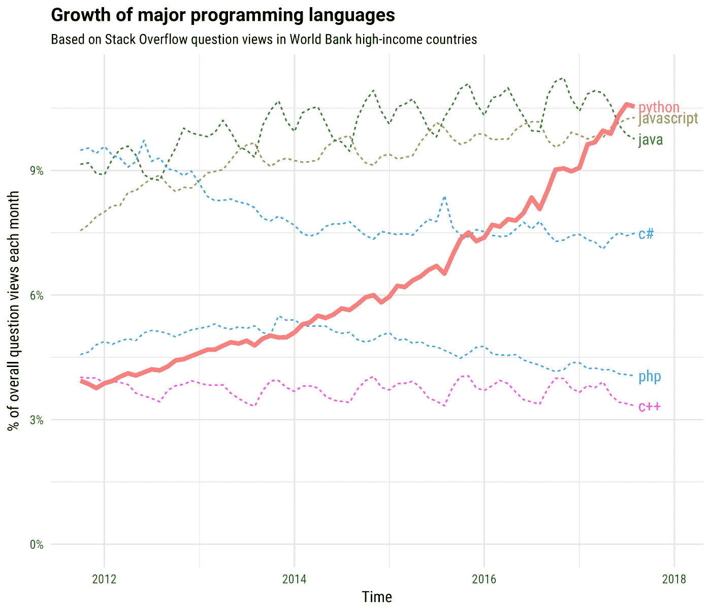
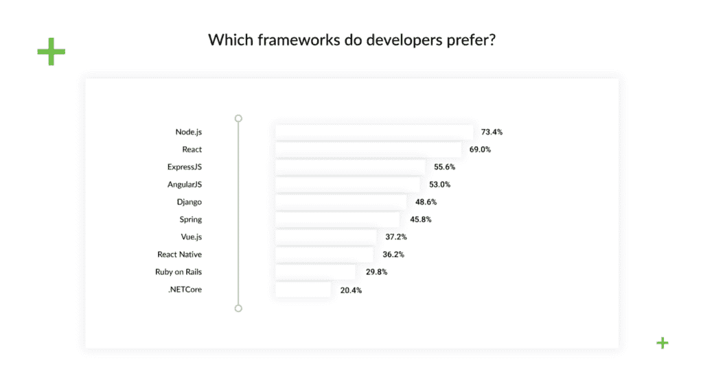

# NodeJS vs Python:特性、应用和用例[更新]

> 原文：<https://hackr.io/blog/nodejs-vs-python>

当您构建一个项目或应用程序时，最重要的决策之一是选择正确的语言。在本文中，我们将探讨 Python 和 NodeJS 的优缺点，以便您可以决定哪一种最适合您的项目。

## Python 是什么？优点、缺点和使用案例

Python 自 1991 年开发以来已经存在了很长时间，并且由于其前沿的实现、优秀的文档和库开发的连续性，它仍然是一种创新、灵活和通用的技术。Python 是人工智能、[机器学习和数据科学](https://hackr.io/blog/data-science-vs-machine-learning)项目最首选的语言。据 Jetbrains 称，这种情况至少会持续 5 年。

根据 Hackerrank 的说法，Python 拥有最大的社区之一，这意味着你将获得你所需要的所有支持。

像任何其他技术一样，Python 有其优点、缺点和特定的应用领域。我曾在许多不同的项目中使用 Python，比如图像着色和医疗保健平台。一次又一次，它被证明是处理所有任务的健壮技术。

### **Python 优点**

Python 有许多优势，可以促进从初创公司到大型企业平台的各种项目的开发。以下是一些最突出的例子:

#### **Python 缩短上市时间**

与类似的面向对象语言相比，Python 使开发人员能够用更少的代码完成工作。此外，大多数开发人员也习惯于在 Java 和 Python 之间切换(这就是为什么你会看到它们串联使用)。Python 提供无缝维护，错误可以在几分钟内解决。其紧凑的语法易于使用，并且也易于调试

得益于 Python 的快速开发方法论——允许你一次维护几次迭代——以及 DRY(不要重复自己)原则，这意味着你可以重用部分代码。

[**Reddit 用户**](https://www.reddit.com/r/Python/comments/9l14y8/why_do_you_use_python/)

我在一家为大宗采购(家具、冰箱等)融资的公司的贷款管理部门工作。).我的同事管理我们的账户，我支持他们并通过数据分析和工作流自动化进行管理。既然如此关注生产力，那么短的交付时间通常是最重要的事情，就在“这会节省多少全职员工？”所以我使用 Python 是因为它的灵活性和速度，它允许我编写可用的代码。我可以更快地覆盖更多的基地。NET、Java 或任何 Windows 脚本工具，我的工作都不是面向用户的，所以我不需要大量的 GUI 功能。Python 完全符合这一定位。

#### **Python 语法**

Python 有一个简单的语法，所以用几行代码表达逻辑更容易，这反过来允许我们容易地阅读和调试代码。它对客户来说也足够简单易懂，这有助于更方便的协作。

Sublime Text 是一个流行的代码编辑器，它提供了对 Python 编码的支持，以及额外的编辑特性和语法扩展。强大的 web 框架简化了这个过程，并允许开发人员专注于应用程序的逻辑。Django 就是这样一个例子，它是一个全栈框架，用于开发各种应用程序，优化完成项目所需的时间。

### 推荐 Python 课程

[用 Python 完成从零到英雄的 Python boot camp](https://click.linksynergy.com/deeplink?id=jU79Zysihs4&mid=39197&murl=https%3A%2F%2Fwww.udemy.com%2Fcourse%2Fcomplete-python-bootcamp%2F)

对比 Python 和 Node.js，Python 是更成熟的开源语言，拥有最大的用户群体之一。它有数量惊人的贡献者，从初级到资深。这至少意味着两件事:很容易找到开发人员，你得到了一个积极的、支持的社区，他们渴望分享解决方案和改进语言。

它已经存在了超过 25 年，开发人员可以使用高级功能和广泛的库支持。Python 还提供了几个高级 web API，包括以下用于后端的 API:

在前端，可以使用 Tkinter/py side API。它也是高度可移植的，因为它可以通过各种各样的 web 脚本和抓取用于移动和 web。

### **Python 缺点**

Python 非常适合大多数类型的项目，但是它也有一些限制:

#### **Python 是单流的**

就像其他解释编程语言一样，与编译编程语言相比，python 的执行速度较慢。它不是最适合那些需要复杂的数学计算的应用程序或任何以速度为最高要求的项目。

#### **不适合移动计算**

Python 非常适合开发服务器和桌面平台，但被认为不适合移动计算。这就是为什么很少有智能手机应用程序是用 Python 编写的。

## **什么是 NodeJS:优点、缺点和 NodeJS 用例**

Node.js 是一个允许 JavaScript 同时用于后端和前端开发的环境，解决了一些兼容性问题。它于 2009 年(不久前)推出，并逐渐受到欢迎。

**来源:** Hackerrank 软件开发者调查

**Node.js 优点**

在比较 Python 和 Node.js 的 web 开发时，Node 有几个值得夸耀的优点:

*   **Node.js 启用快速性能**对比速度时，你会发现前者更快。Node.js 基于 Google V8 引擎，这使得它非常适合开发聊天机器人和类似的实时应用程序。

[**Reddit 用户**](https://www.reddit.com/r/node/comments/8oac9v/why_do_you_use_nodejs/e02azfl/)

我经营一家小企业，做所有的技术工作，包括脚本、服务、内部 web 应用、API 抓取、数据库管理等。我喜欢用 Node 快速开发。如果我们要横向扩展任何东西，我可能会选择更成熟和锁定的技术，但目前平均堆栈对我们来说是完美的。我也喜欢 Javascript 这种语言

*   **它支持全栈开发**你需要一个懂 JavaScript 的开发团队，他们可以做整个应用，前端和后端。这是降低成本的一种方式，考虑到很容易找到 JavaScript 开发人员，而且你不需要那么多。
*   **非常适合开发实时应用**它的事件驱动架构允许你开发聊天应用和网页游戏。

**Node.js Cons**

*   Node.js 需要清晰的架构这是一个事件驱动的环境，所以它可以一次运行几个事件——但前提是它们之间的关系写得很好。
*   **它无法维持 CPU 密集型任务**繁重的计算请求会阻塞所有其他任务的处理，降低用 Node 编写的应用程序的速度。
*   **不发达的文档**不像 Python 有全面的、最新的文档，Node.js 文档比较缺乏。另外，没有核心库和工具。有太多的选择，所以并不总是清楚你应该选择哪一个。

## node.js 与 python 的比较

| **参数** | **节点 j** | **Python** |
| **由**开发 | 赖安·达尔 | 圭多·凡 rossum |
| **运行于** | 谷歌的 V8 Chrome 引擎 | CPython，并且还支持 PyPy |
| **可扩展性** | 高度可扩展 | 有限的 |
| **语法** | 纯 JavaScript | 简单易懂 |
| **实时网络应用开发** | 优秀的 | 不理想 |
| **性能** | 高的 | 慢的 |
| **内存密集型应用支持** | 是 | 不 |
| **包管理器** | 节点程序包管理器(NPM) | Python 的包安装程序(PIP) |
| **主要用例** | 前端和后端开发以及移动和桌面开发 | 后端开发、任务自动化、数据科学和桌面开发 |

## **结论**

很难说一种编程语言比另一种好，因为这都是相对的。什么对您的项目更好将取决于您的团队的专业知识和项目特定的需求。它们都有各自的优点和缺点，并且用于不同类型的项目。因此，当您在 Node.js 和 Python 之间进行选择时，您需要考虑所有的利弊，以决定哪一个最适合您的项目应用程序。

**人也在读:**