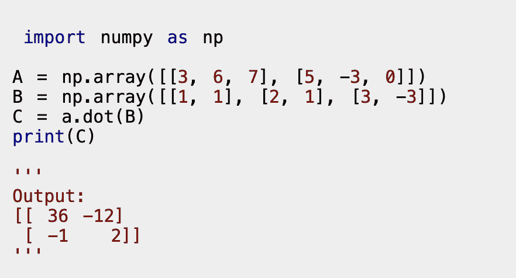

# Numpy 矩阵乘法- NumPy v1.17 手册[更新]

> 原文：<https://hackr.io/blog/numpy-matrix-multiplication>

NumPy，也被称为数字 Python，由 [Travis Oliphant](https://en.wikipedia.org/wiki/Travis_Oliphant) 创建，通过将 Numarray 的特性混合到一个数字包中来完成。NumPy 在过去充当了 Matlab(用于技术计算)的“替代品”；怎么会？将 **NumPy** 与 **SciPy** (被称为科学 Python)和**Mat plotlib**(绘图库)等包结合起来，被视为 Matlab 的 Python 替代品，因此被视为更现代、更有组织的编程语言。由于 NumPy 是开源的，对于编程爱好者和有经验的开发者来说，这是一个额外的优势。

## **什么是 NumPy 数组？**

NumPy 数组类似于 Python 列表。NumPy 库提供了一个数据结构数组，与 Python 列表相比，它有一些优点，比如读写项目的速度更快、更紧凑、更方便、更高效。

众所周知，NumPy 提供了对一些重要工具和技术的访问，这些工具和技术可以用来解决主要属于科学和工程所提供的复杂性的问题的数学模型。例如，其中一个工具是高性能多维数组对象——一种健壮的数据结构，最适合用于数组和矩阵的高效计算。为了操作和运行，这些阵列中的最佳阵列需要解决高级数学函数的可信度。

下面列出了几类必需的阵列操作:

**数组属性:**确定数组的大小、形状、数据类型和内存消耗

1.  数组上的数学和其他逻辑运算。
2.  **数组的整形:**改变提供的数组的形状。
3.  形状操作的例程和傅立叶变换。
4.  线性代数运算。
5.  **阵列切片:**在给定的较大阵列内设置较小的子阵列。
6.  **数组的拆分与连接:**将一个数组拆分成多个，将多个数组合并成一个数组。
7.  **数组索引:**设置单个数组元素的值。

### **如何安装 NumPy:**

PC 通过以下简单步骤轻松安装 NumPy:

#### **带蟒蛇轮:**

1.  你的系统需要 Python，这里是[链接](https://www.python.org/downloads/)。
2.  如果使用的是 Windows，请将 Python 添加到 PATH 环境变量中。
3.  安装一个包管理器，比如 **pip** (这样做是为了确保可以使用 Python 的开源库。
4.  [下载](http://www.lfd.uci.edu/~gohlke/pythonlibs/#numpy) (NumPy Wheel)并导航至存储它的文件夹(在您的 PC 上)。

#### **用 Python 发布:**

您也可以下载 Anaconda Python 发行版，因为这对初学者来说更容易。从[这里](https://www.anaconda.com/distribution/)下载。

#### **NumPy 乘法矩阵**

要将两个矩阵相乘，请使用 dot()方法。下面介绍 numpy.dot( a，b，out=None)

numpy.dot 的几个规格:

*   如果 a 和 b 都是 1-D(一维)数组-两个向量的内积(没有复共轭)
*   如果 a 和 b 都是 2-D(二维)阵列-矩阵乘法
*   如果 a 或 b 是 0-D(也称为标量)-使用 numpy.multiply(a，b)或 a * b 进行乘法运算。
*   如果 a 是一个 N 维数组，b 是 a 和 b 的最后一个轴上的 1 维数组和积。
*   如果 a 是一个 N-D 数组，b 是一个 M-D 数组，只要 a 的最后一个轴和 b 的倒数第二个轴上的 M>=2 -和积:

还有， **dot(a，b)[i，j，k，m] = sum(a[i，j，:] * b[k，:，m])**

以下代码用于生成一个 Numpy 乘法矩阵；*用于数组乘法。

## **总结**

这是关于 numpy 矩阵乘法的完整摘要。作为 Python 列表的一个很好的替代品，NumPy 数组很快，也更容易操作。用户有机会使用 NumPy 跨整个阵列执行计算，并对他们的程序感兴趣。

[用于数据科学和机器学习的 Python 训练营](https://click.linksynergy.com/link?id=jU79Zysihs4&offerid=1045023.3585196&type=2&murl=https%3A%2F%2Fwww.udemy.com%2Fcourse%2Fpython-for-data-science-and-machine-learning-bootcamp-d%2F)

因为 NumPy 数组比链表占用更少的内存，所以它为数学运算提供了更好的数据处理方式。分析社区青睐 NumPy 数组是有原因的，试一试吧。

**人也在读:**