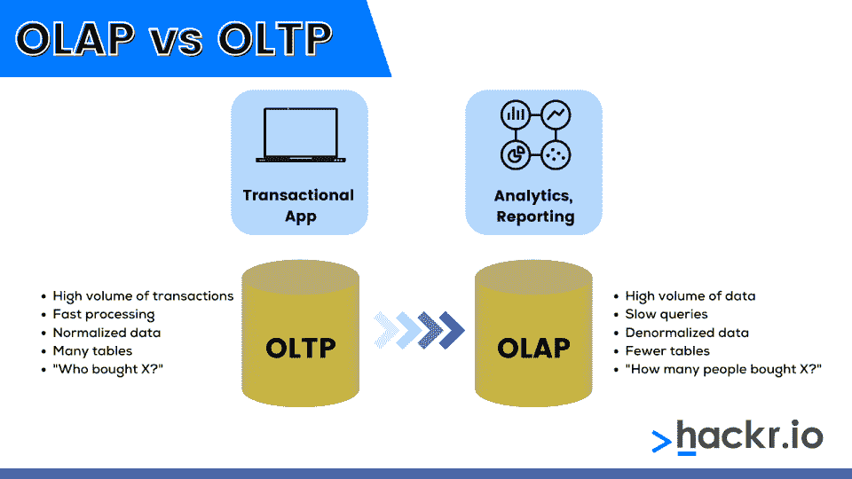

# OLAP vs OLTP:有什么区别？

> 原文：<https://hackr.io/blog/olap-vs-oltp>

与批处理系统相反，在批处理系统中，交易细节堆积在一堆文档中，然后成批登记，在线处理系统是实时登记正在进行的交易的系统。OLAP 和 OLTP 都是这样的在线处理系统。

在这里，我们比较了 OLAP 和 OLTP 之间的差异，包括它们各自的优缺点。我们还将讨论 OLAP 和 OLTP 到底是什么。我们从快速总结差异开始。

## **OLTP vs OLAP:势均力敌的比较**

| **参数** | **OLAP** | **OLTP** |
| 备份和恢复 | OLAP 系统不太需要备份 | 任何时候的完整备份都是强制性的，同时还需要为增量备份做一些准备 |
| 数据 | 它利用了数据仓库的概念，是一个在线数据库查询管理系统 | 依赖传统的数据库管理系统 |
| 数据完整性 | OLAP 系统进行不频繁的交易。因此，OLAP 系统不一定要求数据完整性 | 当涉及 OLTP 系统时，不能忽略数据完整性，因为 OLTP 系统经常执行修改数据库的事务 |
| 主要意图 | 允许用户检索/提取可用于分析和决策的多维数据。 | 侧重于插入、更新，有时也从数据库中删除信息 |
| 存储空间要求 | 由于聚合结构和历史数据的存在，需要大量存储空间 | 需要更小的存储空间，对于那些具有存档历史数据的系统来说，空间甚至更小 |
| 系统类型 | 在线数据检索和分析系统 | 在线交易系统 |
| 处理 | 交易时间更长，但频率更低 | 短平快，但交易频率更高 |
| 查询复杂性 | 复杂的查询 | 简单的查询 |
| 观众 | 面向客户 | 面向市场 |
| 正常化 | 表格未标准化 | 表格是标准化的 |
| 响应时间 | 在几秒到几分钟内 | 以毫秒计 |

### 什么是 OLAP(在线分析处理)？

在线分析处理(OLAP)数据库存储使用 OLTP 系统发送的过去的数据。OLAP 系统允许用户查看存储的多维数据的各种摘要。

OLAP 系统允许从更大的数据库中提取信息，并以决策为目的对其进行分析。为此，系统提供了对简单和复杂查询的支持。

OLAP 系统的有效性通过其响应时间来衡量，其主要目标是数据分析。如果交易失败，用户可以简单地重新运行交易并提取所需的详细信息。

与 OLTP 系统相比，使用 OLAP 系统进行的事务很少。但是，OLAP 事务很长，因此需要更多的处理时间和存储空间。OLAP 数据库中的表没有被规范化。

OLAP 数据库以存储在多维模式中的聚合数据和历史数据为特色。通常，这是一个星型模式。

OLAP 事务的示例包括查看财务和销售报表、提取预算信息以及查看营销管理详细信息。带有商品推荐的个性化亚马逊主页也是 OLAP 系统发挥作用的例子。

**优点:**

*   可以轻松地对用户施加安全限制，以遵守法规并保护敏感数据。
*   信息和计算的一致性。
*   为几乎所有类型的业务分析需求提供单一平台。

**缺点:**

*   在实施和维护方面严重依赖 IT 专业人员或团队。
*   有效性取决于部门间人员的合作。

### **什么是 OLTP(在线事务处理)？**

在线事务处理(OLTP)系统成为 OLAP 系统的数据源。典型的 OLTP 系统的主要目的是记录当前的更新、插入和删除请求，并相应地修改现存的数据库。

OLTP 系统支持三层架构中面向事务的应用程序。他们管理一个组织的日常事务。数据处理是 OLTP 系统的主要目标。

与 OLAP 数据库不同，典型的 OLTP 数据库会经常更新。OLTP 事务可能会在完成之前失败，从而给 OLTP 系统带来严重的数据完整性问题。因此，这样的在线处理系统需要特别注意数据的完整性。

OLTP 系统在多路访问环境中维护数据完整性，其有效性通常由它们在一秒钟内可以执行的事务总数来评估。

典型的 OLTP 数据库存储详细的当前数据。实体模型是用于存储这种事务数据库的方案。因此，关于 OLTP 系统的数据库是规范化的。通常，这是通过使用 [3NF 归一化](https://hackr.io/blog/dbms-normalization)来实现的。

大多数 OLTP 查询简单而简短。因此，它们具有较少的处理时间和存储空间需求。ATM 是 OLTP 系统的最好例子。OLTP 系统的其他值得注意的例子包括网上银行和发送 SMS。

**优点:**

*   对日常交易有用。
*   简化单个流程，允许组织增加其消费者基础。

**缺点:**

*   允许多个用户访问和修改相同的数据，从而导致潜在的问题。
*   硬件故障会严重影响在线交易。

## **OLAP 与 OLTP:差异**

****

为了简化 OLAP 系统和 OLTP 系统之间的比较，我们将下面的部分分成了几个类别。

### **1。备份&恢复**

OLAP 系统不太需要备份。因此，严格的备份计划并不重要。一些环境还可能考虑将重新加载相关的 OLAP 数据作为恢复方法，而不是进行定期备份。

对于 OLTP 系统，对备份和恢复的看法正好相反。任何时候的完整备份都是强制性的，同时还要提供某种增量备份。

这是因为运营数据对于企业的运营至关重要，丢失此类数据会给相关组织带来不良的财务和法律问题。

### **2。数据**

在线事务数据是 OLTP 系统的主要数据源。关于多个 OLTP 系统的几个数据库集合在一起充当 OLAP 系统的主要数据源。

关于 OLTP 系统的数据是运营数据，而与 OLAP 系统相关的数据是整合数据。OLTP 系统数据的目的是控制和运行基本的业务任务。

对于 OLAP 系统，数据旨在帮助规划、解决问题和制定决策。通常，暴露给 OLTP 请求的数据以屏幕或屏幕截图的形式出现。

相反，OLAP 系统显示的数据是多维视图的形式。

### **3。数据库**

OLTP 系统是依赖于传统数据库管理系统的在线数据库修改系统。OLAP 系统利用了数据仓库的概念，是一个在线数据库查询管理系统。

虽然 OLTP 数据库由几个表组成，但典型的 OLAP 数据库包含的表较少。对于 OLAP 数据库中的表，这是可选的，通常使用星型和/或雪花型模式进行规范化。

但是，这与属于 OLTP 数据库的表不同。在这种情况下，必须对表进行规范化，通常是在 3NF 中。

### **4。数据完整性**

OLTP 系统经常执行修改数据库的事务。如果事务失败，可能会导致一些严重的数据完整性后果。因此，当涉及到 OLTP 系统时，不能忽视数据完整性。

与 OLTP 系统不同，OLAP 系统经历不频繁的事务。所以有些交易失败的几率很低。因此，OLAP 系统不一定要求数据完整性。

### **5。主要意图**

OLTP 系统侧重于插入、更新，有时还会从数据库中删除信息。相反，典型的 OLAP 系统的主要焦点是允许用户检索/提取多维数据，这些数据可以被分析并用于决策。

当用户对 OLTP 系统进行快速插入和更新时，OLAP 系统的特点是定期长时间运行批处理作业和刷新数据的选择操作。

### **6。存储空间要求**

OLTP 系统对存储空间的需求很小，而那些具有存档历史数据的系统对存储空间的需求更小。

相反，OLAP 系统需要大量的存储空间。这是由于聚合结构和历史数据的存在，它们比典型的 OLTP 系统需要更多的索引。

### **7。系统类型**

OLAP 是一个在线数据检索和分析系统，而 OLTP 是一个在线交易系统。与 OLAP 系统不同，OLTP 系统负责管理数据库修改。

### **8。交易**

OLTP 系统的平均事务短而快。这不是 OLAP 系统的情况，典型的交易持续时间要长得多。但是，OLAP 系统的事务频率较低，OLTP 系统的事务频率较高。

OLTP 事务所需的总处理时间很少。相反，OLAP 交易需要很多时间来完成一笔交易。OLTP 和 OLAP 系统的响应时间分别以毫秒和秒或分钟来衡量，这一事实证明了这一点。

### **9。查询复杂度**

OLAP 和 OLTP 系统都是基于查询的。然而，与支持复杂查询的 OLAP 系统相比，关于 OLTP 系统的查询是简单的。

典型的 OLTP 查询是相对标准化的，返回几条记录。另一方面，OLAP 查询涉及聚合并返回大量记录或信息。

[了解 NoSQL 数据库-完成 MongoDB 训练营 2023](https://click.linksynergy.com/link?id=jU79Zysihs4&offerid=1045023.2162940&type=2&murl=https%3A%2F%2Fwww.udemy.com%2Fcourse%2Flearn-nosql-databases-complete-mongodb-bootcamp-2019%2F)

## **结论**

虽然 OLTP 系统适合管理日常任务，但 OLAP 系统擅长存储历史数据，这些数据可以在以后用于决策和解决问题。

由于 OLAP 和 OLTP 联机处理系统实现不同的目的，因此在它们之间进行选择完全取决于需求。组织倾向于同时使用 OLAP 和 OLTP，但是当您需要从大量数据中获得洞察力时，您可以使用 OLAP。如果您需要快速管理大量事务，您可以使用 OLTP 系统。

## **常见问题解答**

#### **1。SQL 中的 OLAP 是什么？**

OLAP 用于从更大的数据库中提取信息，并对其进行分析以做出决策。OLAP 事务的示例包括查看财务和销售报表、提取预算信息以及查看营销管理详细信息。

#### **2。OLAP 是规格化的还是反规格化的？**

OLAP 的表格没有标准化。它不需要每个事务的原子细节，所以不会发生标准化。

#### **3。OLAP 和数据仓库是一样的吗？**

数据仓库是存储数据的仓库，这些数据可以在以后用于分析。OLAP 用于分析和评估仓库中的数据。它们不完全相同。

**人也在读:**