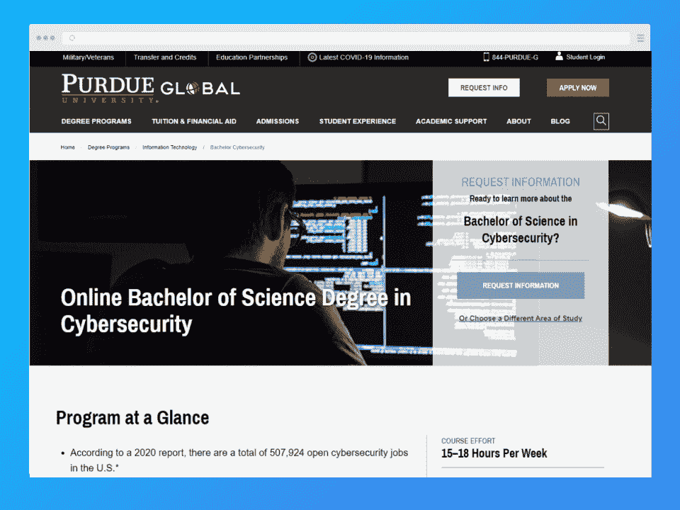
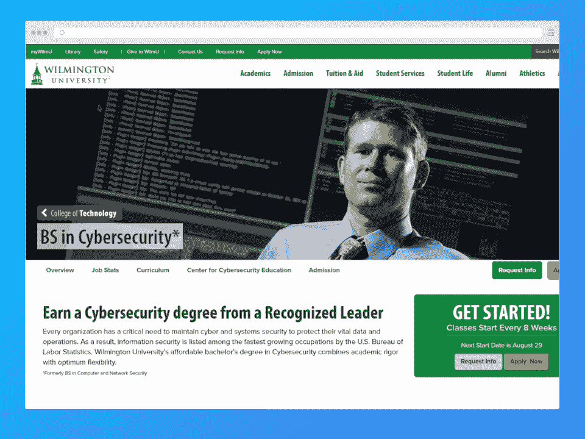
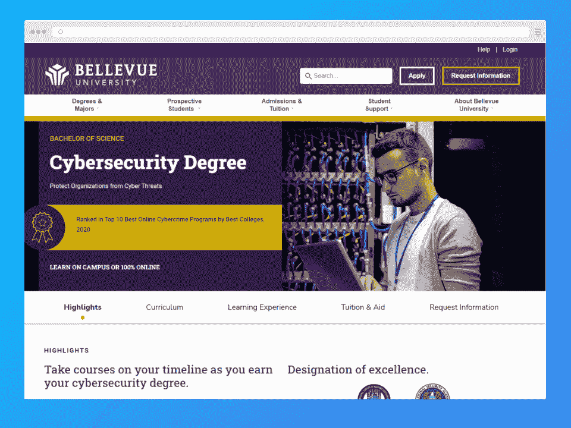
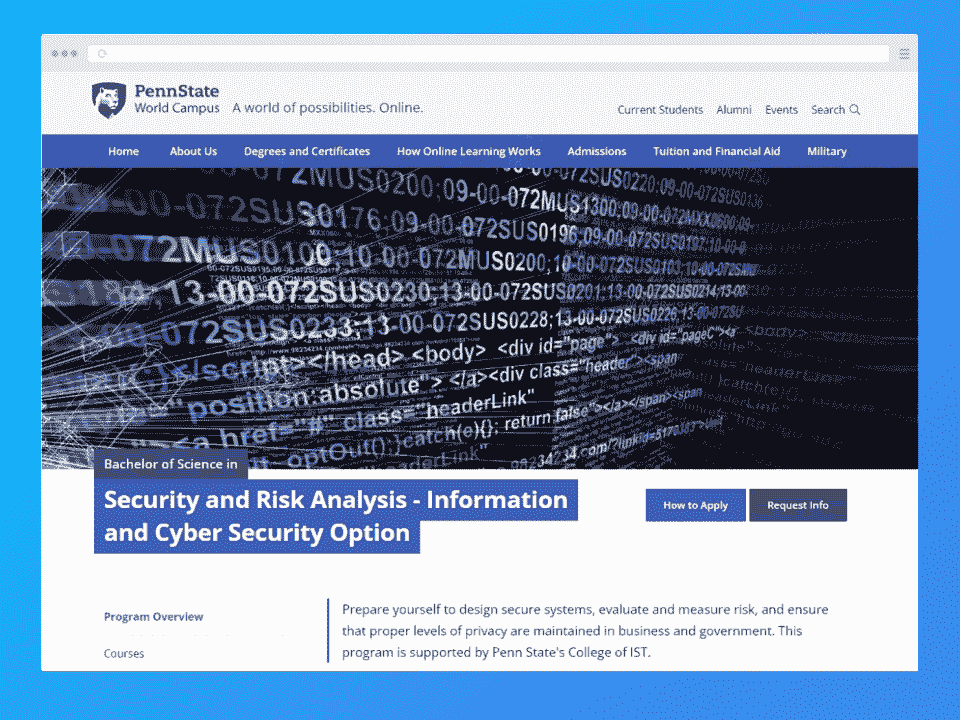
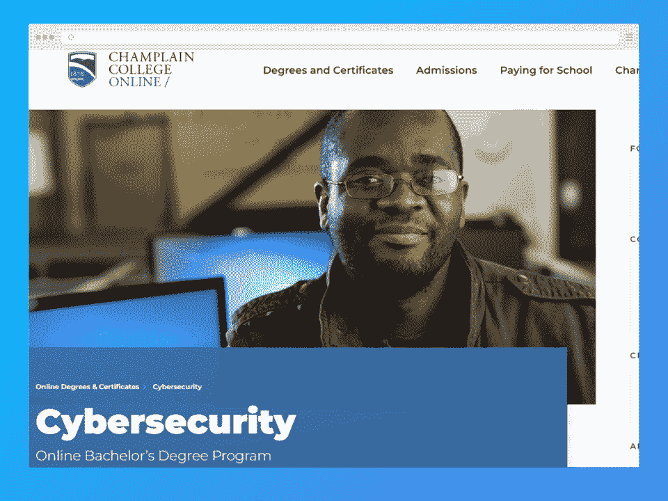
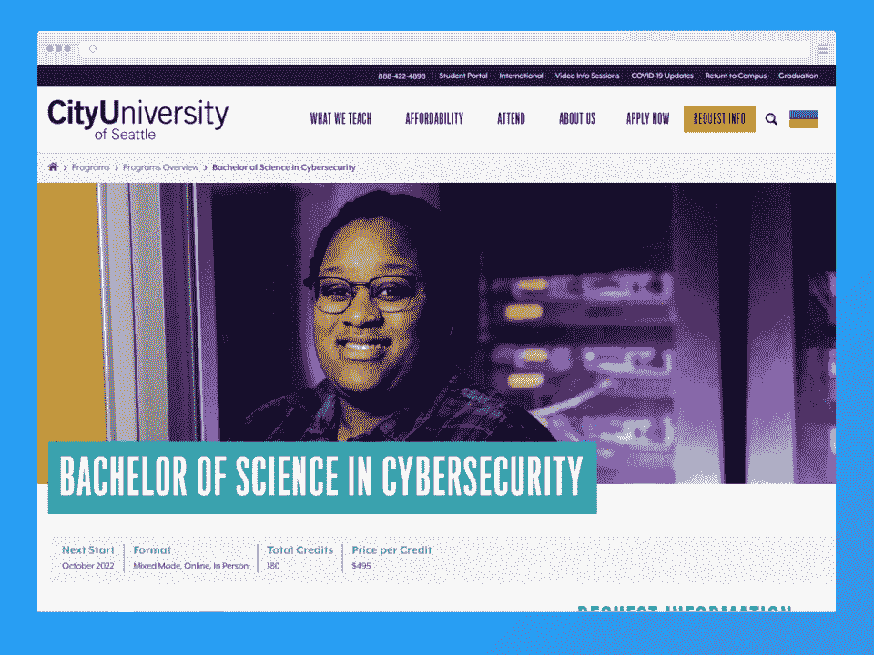
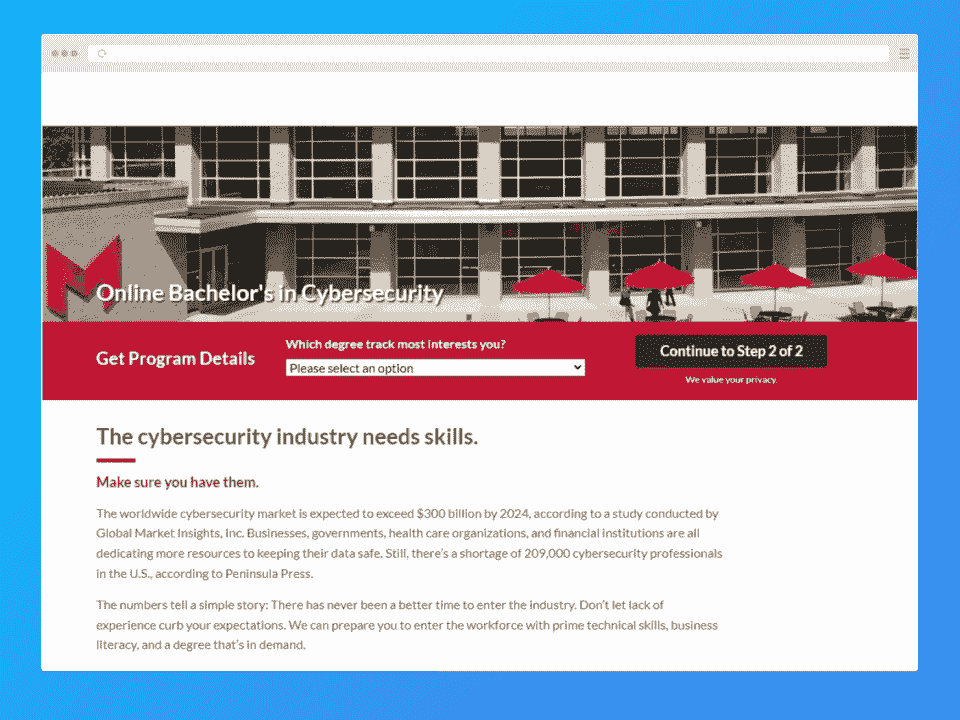
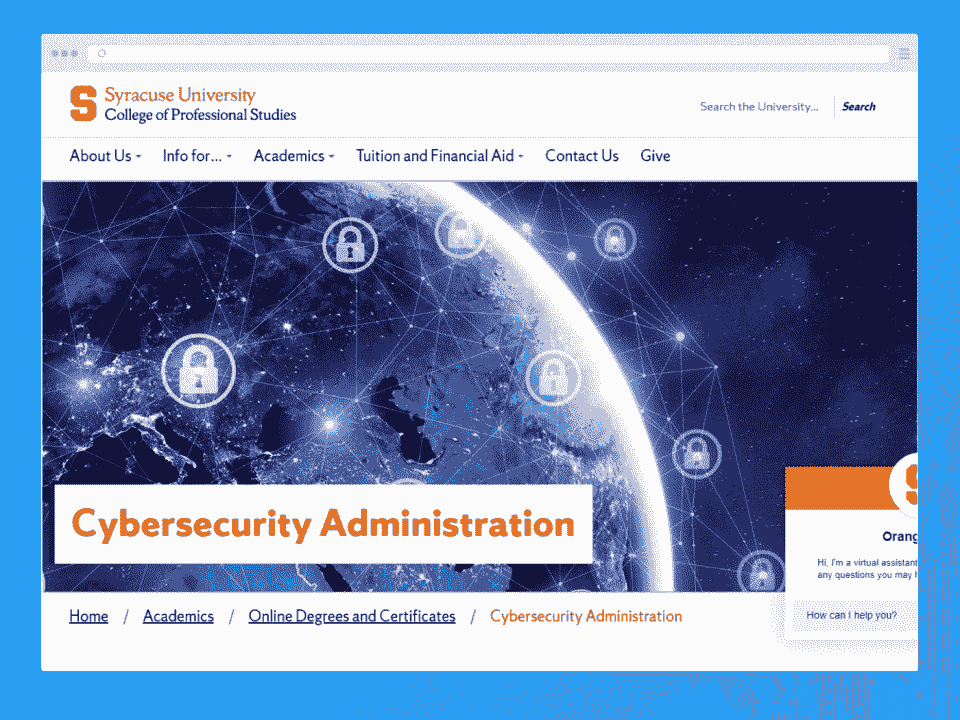
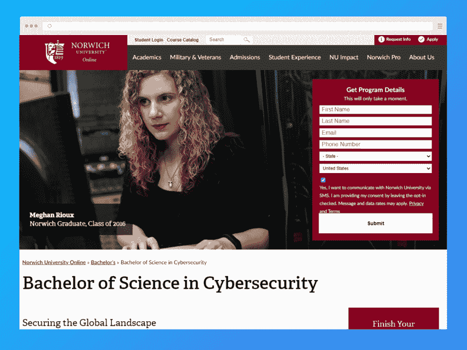

# 2023 年十大在线网络安全学位选项[更新]

> 原文：<https://hackr.io/blog/online-cyber-security-degree>

网络犯罪是现代个人和组织面临的最大威胁之一。随着网络安全技术的进步，恶意行为者只会用新数据来完善他们的攻击。因此，每个行业都需要网络安全专家来阻止跟踪他们的黑客，保护敏感的公司数据。

由于这种高需求，网络安全专业人士可以在私营企业、政府、甚至国家安全机构和情报机构找到收入丰厚的工作。根据劳工统计局的数据，信息安全分析师的平均年薪为 102，600 美元。更好的是，从 2020 年到 2030 年，就业岗位预计将增长 33%，远高于全国平均水平。

有兴趣将您的编程生涯提升到网络安全的高度吗？

让我们探索你的最佳在线网络安全学位的选择。

## **特色在线网络安全计划**

## **十大最佳网络安全度选项**

### **普渡大学全球**

**1。[网络安全在线学士](https://www.purdueglobal.edu/degree-programs/information-technology/bachelor-cybersecurity/)**

[****](https://www.purdueglobal.edu/degree-programs/information-technology/bachelor-cybersecurity/)

普渡大学全球分校是一所在线大学，被美国国家安全局(NSA)指定为国家级网络防御教育(CAE-CDE)学术卓越中心。该计划是最好的在线网络安全学位之一，有六个不同的专业，包括数据管理、云计算、分析、供应链、编程和游戏开发。ExcelTrack 选项帮助您以更低的成本更快地完成学位。

*   **课程:**道德黑客、Python 编程、入侵检测&响应。
*   **学分:** 180
*   **持续时间:** 4 年
*   ****:**$ 371**
***   **助学金:**奖学金、助学金、贷款。*   接受率: 100%*   **地点:**印第安纳州西拉斐特**

 **[在此注册](https://www.purdueglobal.edu/degree-programs/information-technology/bachelor-cybersecurity/)

### **威尔明顿大学技术学院**

**2。[网络安全中的 BS](https://www.wilmu.edu/technology/computer-network-security.aspx)**

[****](https://www.wilmu.edu/technology/computer-network-security.aspx)

威尔明顿大学是特拉华州最便宜的私立大学之一。它每年提供六次开学时间，并且有一个简化的入学程序，所以你可以在最方便的时候开始你的课程。该项目被评为 2017 年全国最佳[项目](https://www.wilmu.edu/technology/computer-network-security.aspx#intro)，并一直是最佳网络安全在线学位之一。

它有一个双学分优势选项，某些选修课可以帮助你获得双学分证书，或者通过包括硕士水平的课程来加速你的下一个学位。除了在线模式，该计划还在四个校园内提供。

*   **课程:**数据库基础，网络&数据安全，密码学。
*   **积分:** 120
*   [**学费**](https://www.wilmu.edu/technology/computer-network-security.aspx) **:** 【每门 3 学分课程 1197 美元
*   **助学金:**奖学金、助学金、贷款、勤工俭学。
*   接受率: 99%
*   **地点:**特拉华州新城堡

[在此注册](https://www.wilmu.edu/technology/computer-network-security.aspx)

### **贝尔维尤大学**

**3。[网络安全理学学士](https://www.bellevue.edu/degrees/bachelor/cybersecurity-bs/)**

[****](https://www.bellevue.edu/degrees/bachelor/cybersecurity-bs/)

在贝尔维尤大学，你有机会在知名教师的指导下学习，这些教师曾在世界各地著名的安全和情报机构工作过(或继续工作)，包括国防部、美国航天局和美国空军。这个在线网络安全项目允许你在行业中使用的网络技术工具的帮助下学习。您可以通过加速队列选项或从您的副学士学位转移学分来更快地完成该计划。

*   **课程:**安全访问控制、结构化系统分析&设计、网络犯罪&业务。
*   **学分:** 127
*   ****:**$ 440**
***   **经济资助:**奖学金、助学金、贷款、退伍军人福利和雇主学费资助。*   接受率: 100%*   **地点:**内布拉斯加州贝尔维尤**

 **[在此注册](https://www.bellevue.edu/degrees/bachelor/cybersecurity-bs/)

### **宾夕法尼亚州立大学世界校区**

**4。[安全和风险分析理学学士-信息和网络安全选项](https://www.worldcampus.psu.edu/degrees-and-certificates/security-and-risk-analysis-bachelors/overview)**

[****](https://www.worldcampus.psu.edu/degrees-and-certificates/security-and-risk-analysis-bachelors/overview)

一个多世纪以来，宾夕法尼亚州立大学一直提供远程教育课程，过去二十年来一直提供在线课程。这个在线网络安全项目给你一个和校园安全项目一样的证书。它采用跨学科的方法，包括情报分析、信息保障和网络取证等学科。

*   **课程:**安全介绍&风险分析、计算机&网络取证、网络安全。
*   **积分:** 120
*   [**每学分学费**](https://www.worldcampus.psu.edu/degrees-and-certificates/security-and-risk-analysis-bachelors/costs) **:** $664
*   经济援助:奖学金、军饷、贷款
*   接受率: 54%
*   **地点:**宾夕法尼亚大学公园

[在此注册](https://www.worldcampus.psu.edu/degrees-and-certificates/security-and-risk-analysis-bachelors/overview)

### **摄政大学**

**5。[网络安全中的 BS](https://www.regent.edu/program/bs-in-cybersecurity/)**

[****](https://www.regent.edu/program/bs-in-cybersecurity/)

摄政大学是美国最好的在线基督教大学之一*和*最实惠的私立基督教机构之一。这个学士课程是最好的网络安全在线学位之一。有趣的事实:丽晶大学连续十年被评为[最佳在线学士学位](https://www.regent.edu/program/bs-in-cybersecurity/)之一。在这个项目中，如果你有 CompTIA 或 EC 委员会的行业认证，你可以获得 9 个学分。该计划也有一个校园版。

*   **课程:**信息系统安全、应急计划&灾难恢复和数字取证。
*   **学分:** 120+分
*   [**学费**](https://www.regent.edu/program/bs-in-cybersecurity/#tuition-fees) **每学分:** $395
*   **助学金:**奖学金和贷款。
*   接受率: 50%
*   **地点:**弗吉尼亚州弗吉尼亚海滩

[在此注册](https://www.regent.edu/program/bs-in-cybersecurity/)

### **尚普兰学院在线**

**6。[网络安全在线学士](https://online.champlain.edu/degrees-certificates/bachelors-cybersecurity)**

[****](https://online.champlain.edu/degrees-certificates/bachelors-cybersecurity)

尚普兰学院提供超过 60 个完整的在线课程，以帮助在职成人继续他们在各个领域的教育。网络安全课程的设计以工作为导向，因此你可以在毕业后将学到的知识直接应用到新工作中。如果你有 CISSP 认证，这个学位允许你转一些学分:你可以转 120 个学分中的 90 个。你也可以通过这个项目获得特定浓度的单独证书。

*   **课程:**操作系统安全、云计算安全、新兴威胁&防御。
*   **积分:** 120
*   ****:**$ 328**
***   **助学金:**助学金、贷款、奖学金。*   接受率: 85%*   地点:佛蒙特州伯灵顿**

 **[在此注册](https://online.champlain.edu/degrees-certificates/bachelors-cybersecurity)

### **西雅图城市大学**

7 .**。[网络安全理学学士](https://www.cityu.edu/programs-overview/bachelor-of-science-cybersecurity/)**

[****](https://www.cityu.edu/programs-overview/bachelor-of-science-cybersecurity/)

西雅图城市大学是另一个致力于为在职成年人提供有价值的教育项目的机构。它被评为全国十大成人教育机构之一。这个网络安全在线学士学位的课程是在咨询了业内网络安全专家后设计的，因此侧重于雇主和招聘人员非常需要的治理、风险和合规性(GRC)方面的技能。通过学分转移选项，您可以在短短两年内完成该计划。

*   **课程:**道德黑客、数据安全和合规。
*   **学分:** 180
*   ****:**$ 495**
***   **助学金:**奖学金、助学金、联邦勤工俭学、贷款。*   接受率: 100%*   **地点:**华盛顿西雅图**

 **[在此注册](https://www.cityu.edu/programs-overview/bachelor-of-science-cybersecurity/)

### **玛丽维尔大学**

**8。[网络安全在线学士](https://online.maryville.edu/lpap-bscs/?Access_Code=MVU-BSCS-SEO2&utm_campaign=MVU-BSCS-SEO2&_ga=2.76603601.558273741.1659164446-313704845.1659164446)**

[****](https://online.maryville.edu/lpap-bscs/?Access_Code=MVU-BSCS-SEO2&utm_campaign=MVU-BSCS-SEO2&_ga=2.76603601.558273741.1659164446-313704845.1659164446)

玛丽维尔大学(Maryville University)入选了 2019 年《福布斯》美国顶级大学榜单。它也被认为是美国最具创新性和综合性的教育机构之一，关注学生、学习成果和成功。该大学拥有著名的“玛丽维尔虚拟实验室”，苹果公司因其移动创新而认可该实验室。其网络安全学士在线课程提供三个方向:网络安全、攻击性网络安全和防御性网络安全。

*   **课程:**数字取证、道德黑客和事件响应&恶意软件分析。
*   **学分:** 128
*   **持续时间:** 2.5 年以上
*   [**学费**](https://online.maryville.edu/admissions/financial-aid-tuition/) **:** $622 每学分
*   **经济资助:**助学金、奖学金、机构勤工俭学、雇主资助、贷款。
*   接受率: 95%
*   **地点:**密苏里州圣路易斯

[在此注册](https://online.maryville.edu/lpap-bscs/?Access_Code=MVU-BSCS-SEO2&utm_campaign=MVU-BSCS-SEO2&_ga=2.76603601.558273741.1659164446-313704845.1659164446)

### **锡拉丘兹大学专业研究学院**

**9。[网络安全管理专业学士](https://professionalstudies.syracuse.edu/academics/online/cybersecurity-administration/?redirect)**

[****](https://professionalstudies.syracuse.edu/academics/online/cybersecurity-administration/?redirect)

锡拉丘兹大学专业研究学院是一所在线网络安全学校，提供高度灵活且面向未来的课程，学生可以根据自己的时间表量身定制。这个 BPS(专业研究学士)项目不同于通常的 BS 学位，因为它有一个沉重的职业重点。它的课程侧重于你可以随时应用于行业的知识。该计划的灵活性允许你以任何你想要的方式追求它——完全在线、校园或混合模式。

*   **课程:**网络环境中的安全性、企业风险管理和数字取证。
*   **积分:** 120
*   [**学费**](https://professionalstudies.syracuse.edu/tuition-aid/tuition-fees/) **:** $695 每学分
*   **助学金:**奖学金、助学金、联邦勤工俭学、贷款。
*   接受率: 68.7%
*   **地点:**纽约州锡拉丘兹

[在此注册](https://professionalstudies.syracuse.edu/academics/online/cybersecurity-administration/?redirect)

### **诺威奇大学在线**

10。[网络安全理学学士](https://online.norwich.edu/academic-programs/bachelors/cybersecurity)

[****](https://online.norwich.edu/academic-programs/bachelors/cybersecurity)

诺里奇大学已经有 200 多年的历史，提供在线教育已经有 25 年了。这个网络安全学位是专门为在职成年人设计的。它提供了两个焦点:信息战&安全管理和计算机取证&漏洞管理。

*   **课程:**恶意软件取证，网络调查，防御信息战。
*   持续时间:平均 18 个月
*   每学分学费: $375
*   **助学金:**奖学金、助学金、军饷。
*   接受率: 74%
*   地点:佛蒙特州诺斯菲尔德

[在此注册](https://online.norwich.edu/academic-programs/bachelors/cybersecurity)

## **如何挑选最好的网络安全等级**

没有放之四海而皆准的网络安全学位。对你来说，正确的选择取决于多种因素。

话虽如此，以下是挑选最佳网络安全学位的一般指南:

**1。查看项目认证**

确保提供该项目的大学是经过适当认证的，尤其是如果它是一所在线大学。最好的网络安全在线学校得到了 NSA(国家安全局)或 DHS(国土安全部)等安全组织的认可，并被指定为网络防御教育卓越学术中心(CAE-CDE)。此外，该机构可能有其他组织的认证，如高等教育委员会。

**2。研究费用**

在选择项目之前，考虑学费、住宿、设备、其他费用和可用的财政援助。

**3。决定自己是否想要一个专业重点的节目**

许多大学提供纯网络安全课程，选修主题有限。然而，其他人有专业导向的课程，强调实用的前景，以装备你为现代劳动力。

**4。询问实习是否可行**

经验知识总是有价值的，所以要留意有实习机会的项目。

**5。勾选信用转账选项**

许多网络安全项目允许从以前的学习中转移学分，帮助你更快地完成学位。

## **网络安全学位通用录取标准**

每个学校的入学要求都不一样。但是，您通常需要:

*   **高中文凭:**你必须是高中毕业生，持有普通教育发展(GED)证书，或具有同等资格。
*   **学校成绩单:**大部分院校要求之前大学学习和高中阶段的成绩单。
*   个人陈述:这篇文章概述了你的教育和职业目标。
*   **考试成绩:**很多大学要求 SAT 或者 ACT 成绩。
*   推荐:你需要来自过去或现在的老师、主管或导师的推荐信。
*   **英语语言** **熟练程度:**母语非英语的外国学生可能需要通过雅思和托福证明语言熟练程度。

## **在线网络安全学位和平均年薪的职业选择**

在线网络安全学士学位为国防、安全、政府、营销和技术领域的工作打开了独特的职业大门。

它可以让你为各种专业职位做好准备，例如:

*   **信息安全分析师(**[**【73，887 美元**](https://www.payscale.com/research/US/Job=Information_Security_Analyst/Salary) **):** 这些专业人员监控组织的信息网络，并制定策略来保护它们免受入侵。
*   **计算机网络架构师(**[**【120，520 美元**](https://www.bls.gov/ooh/computer-and-information-technology/computer-network-architects.htm) **):** 该角色涉及设计安全的信息和通信网络，包括 LAN(局域网)和 WAN(广域网)。
*   网络和计算机系统管理员([**【80，600 美元**](https://www.bls.gov/ooh/computer-and-information-technology/network-and-computer-systems-administrators.htm) ):这些网络安全专业人员负责组织信息系统网络的日常安全。
*   计算机网络支持专家([**【57，910 美元**](https://www.bls.gov/ooh/computer-and-information-technology/computer-support-specialists.htm) **):** 这些专家通过测试、故障排除、分析和维护提供技术支持。
*   **数据库管理员(**[**【98860 美元**](https://www.bls.gov/ooh/computer-and-information-technology/database-administrators.htm) **):** 数据库管理员负责管理网络数据库，确保重要数据的安全存储和组织。
*   **渗透测试员(**[**【87440 美元**](https://www.cyberdegrees.org/careers/penetration-tester/career-and-salary/) **):** Pen 测试员进行授权的网络攻破，模拟网络攻击，以测试网络安全实力。
*   **[**【99730 美元**](https://www.forensicscolleges.com/careers/computer-forensics-examiner)**)**这些专业人员通过恢复受损存储设备中的数据来协助网络犯罪调查。**

 **## **网络安全学位必修课**

网络安全涉及一系列专业分支学科。然而，在线网络安全学位的核心课程通常包括:

*   **网络安全:**网络攻击及如何防范。
*   **密码术:**如何存储和传输数据，使得网络攻击者即使设法访问这些信息也无法使用。
*   **事件响应和调查:**应对真实网络攻击场景的策略。
*   **安全&风险分析:**如何分析一个网络的安全强度和管理风险。
*   **应用安全:** App 和软件漏洞。
*   **数字取证:**利用数字证据调查网络犯罪。
*   **合规:**研究保护组织安全、隐私和利益相关者数据的法律。

## **在线网络安全学位需要多少钱？**

公立大学的在线网络安全学位费用约为 17，000 美元。大多数公共机构将学费定在每学分 300 美元到 550 美元之间。对于私立网络安全学校来说，学费和学习材料的成本要高得多。

另一方面，你可以通过在线课程节省生活费用。然而，在线课程通常对数字技术和媒体收取“技术费”来授课。

## 在线网络安全学位有许可要求吗？

一般来说，作为一名现场专业人员，你只需要一个网络安全学位。然而，额外的认证让你脱颖而出。

一些著名的[网络安全认证](https://hackr.io/blog/best-cybersecurity-certification)包括:

*   **认证法医计算机考官:**国际计算机调查专家协会提供这种数字法医认证。
*   **授权渗透测试员:**这份由欧盟委员会颁发的大师级证书证明你是一名专业渗透测试员，可以通过入侵尝试测试信息网络的安全强度。
*   **认证信息系统安全专家:**国际信息系统安全认证联盟，或(ISC)2 颁发这一令人印象深刻的认证。

## 完成一个在线网络安全学位需要多长时间？

通常，在线本科网络安全课程需要四年时间才能完成。但是，有些项目允许你从以前的学习中转移学分，这加快了你的学习速度。一些大学允许你从 120 个学分中转移 90 个。

一些在线网络安全学校也提供速成课程，你可以在 18-24 个月内完成课程。

## 为什么要接受网络安全教育？

网络安全资格有许多优势，包括:

*   **强劲的就业市场:**无论是医疗保健、商业机构、制造业还是教育，每个行业都面临着网络威胁。因此，对网络安全专业人员的需求一直存在。

*   **高收入潜力:**网络安全专业毕业生收入丰厚。根据美国劳工统计局的数据，一名信息安全分析师的平均工资为[102，600 美元](https://www.bls.gov/ooh/computer-and-information-technology/information-security-analysts.htm#tab-1)。你甚至可以获得报酬更高的职位，比如信息系统经理，平均年薪为[15.9 万美元](https://www.bls.gov/ooh/management/computer-and-information-systems-managers.htm#tab-1)。

*   有价值的职业:网络安全专业人士喜欢富有挑战性和令人兴奋的工作，没有哪两天是一样的。此外，阻止网络犯罪是值得的。

## **网络安全学位的替代方案**

网络安全职业本身并不需要网络安全学位。你可以遵循一系列的途径，通过一点点的奉献和努力，在这个领域开创一个职业生涯。

例如，你可以结合这些学科的经验，在网络安全领域建立职业生涯:

*   信息安全和保证
*   计算机取证
*   网络管理员
*   信息技术管理
*   数据库管理
*   云计算

## **最终想法**

如果你对分析和解决问题感兴趣，网络安全学位为你打开了通往优秀职业选择的大门。更不用说令人印象深刻的薪水了——这无疑是收入最高的学位之一。

**[《网络安全教程-模拟测试-第一卷](https://click.linksynergy.com/link?id=jU79Zysihs4&offerid=1045023.1522754&type=2&murl=https%3A%2F%2Fwww.udemy.com%2Fcourse%2Fthe-complete-cyber-security-course-practice-test-vol-1%2F)**

也许你已经在工作，负担不起全日制学习的费用——幸运的是，在线网络安全学位提供了一些灵活性。拥有最好的在线网络安全学位、工作经验和一些分析思维，你将建立一个有价值和利润丰厚的职业生涯。

虽然大学是获得网络安全知识的绝佳场所，但你还有更便宜的选择。尝试灵活的课程、[教程](https://hackr.io/tutorials/learn-cyber-security)或者认证。

**[探索网络安全认证](https://hackr.io/blog/best-cybersecurity-certification)**

## **常见问题解答**

#### **1。网络安全哪个学位最好？**

网络安全学士学位将使你有资格在网络安全领域的一系列角色。然而，如果你着眼于网络安全管理的高级职位，那么继续攻读硕士学位或博士学位可能是个好主意。

#### **2。网络安全在线学位值得吗？**

各种组织都非常需要网络安全专业人员，该领域的工作预计在未来几年将进一步增长。这种资格可以帮助你建立一个充实和高薪的职业生涯。

#### **3。两年的网络安全学位值得吗？**

在这个领域如此高的需求下，即使你有这个学科的两年或大专学历，你也会发现找工作相对容易。两年制学位通常足以胜任该领域的初级工作。你可以从事安全分析师、网络安全助理、信息保障专家或数据库分析师的工作，薪水还不错。你也可以边工作边在网上攻读学士学位来提升自己的资历，这会带来更多的机会。

#### **4。网络安全是一个容易的学位吗？**

任何好的学位都有一定的挑战性，网络安全学位也不例外。你将需要学习跨学科的科目，如安全、计算机科学和编程，以完成你的网络安全学士学位，所以在这些领域有才能是有帮助的。然而，只要有正确的态度和奉献精神，任何人都可以完成这个学位。

#### **5。你能工作并获得网络安全学位吗？**

是的。许多大学理解在职专业人员继续接受教育的需要，因此提供灵活的网络安全在线课程。你可以在继续从事当前工作的同时，在线报名参加众多网络安全学校中的一所，并按照自己的进度完成学业。

许多项目允许你在方便的时候采用完全在线、混合或面对面的学习模式。如果您有时间，还可以选择加速计划，以便更快地完成。**********