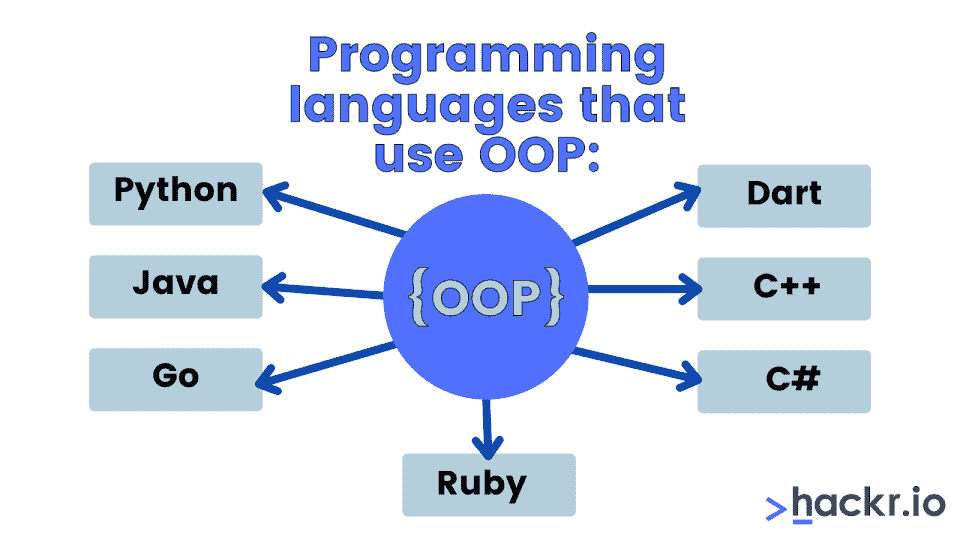
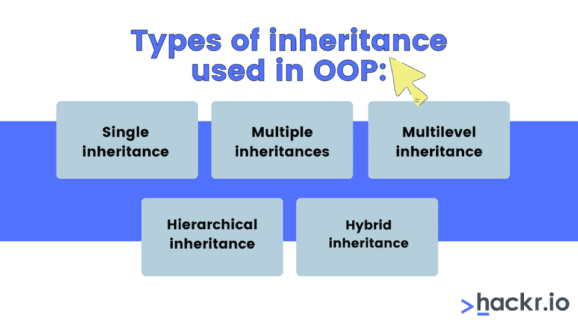
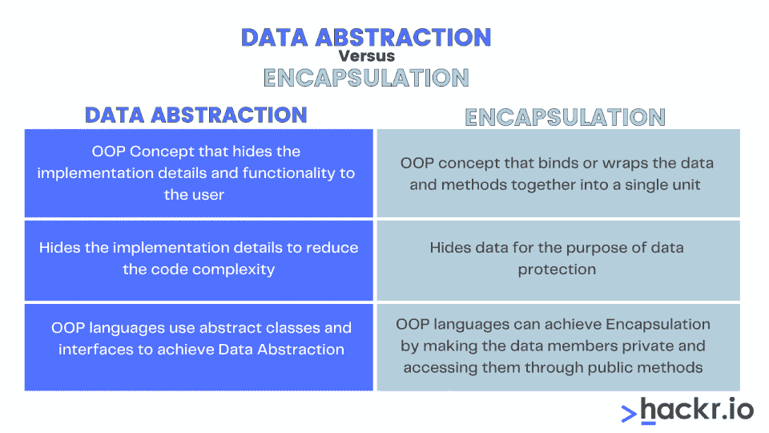
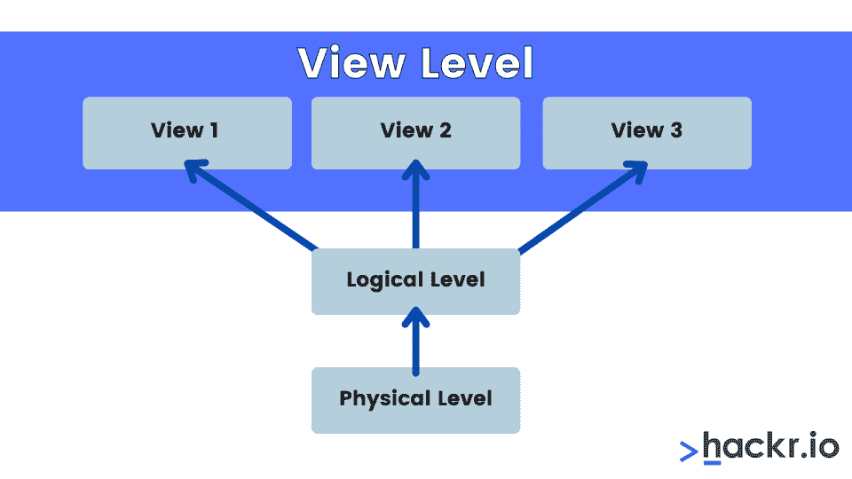
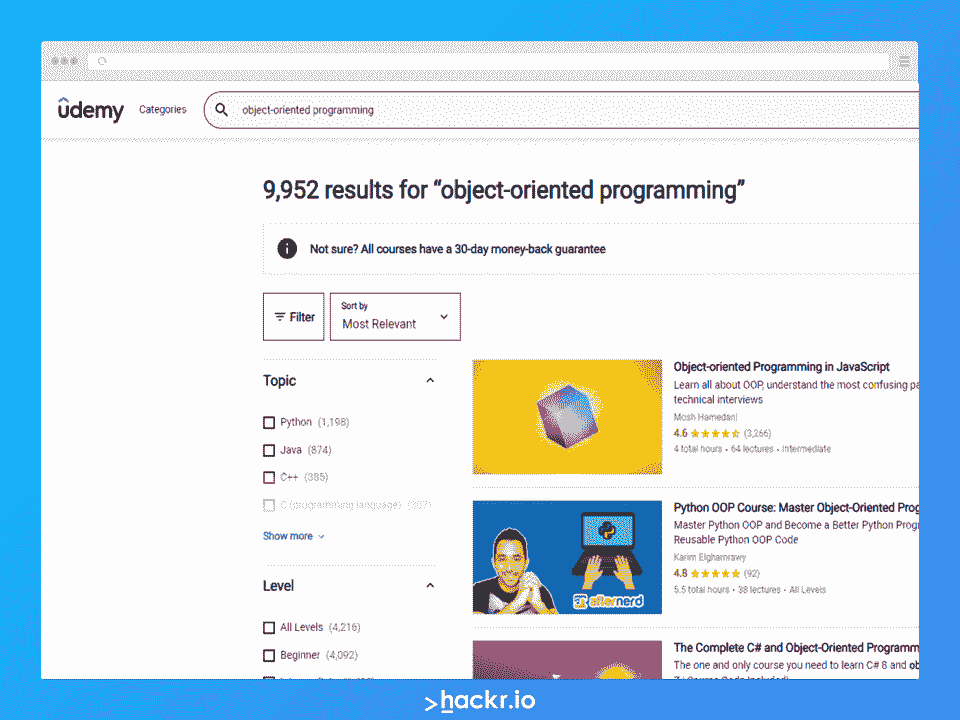

# 2023 年 50+ OOP 面试问答

> 原文：<https://hackr.io/blog/oop-interview-questions>

OOP 代表着面向对象编程，是最有影响力的编程范例之一。它关注的是类和对象，而不是函数和过程。它的主要目标是将数据和对象绑定在一起，使对它们的操作更容易。

在 OOP 中，每个对象都由字段形式的数据和过程或方法形式的代码组成。一些广泛使用的面向对象编程语言有 C++、Objective C、 [Python](https://hackr.io/blog/python-programming-language) 、Perl、 [Java](https://hackr.io/blog/what-is-java) 、Ada 等等。

了解更多这方面的知识很重要，因为糟糕的面试问题很常见。大多数公司寻求精通面向对象方法和模式的开发人员。所以，如果你打算去一家半成熟的公司面试，你必须对 OOP 概念有深入的了解。

在这里，我们重点介绍一些常见的 **面向对象编程面试问题** 。我们将面试问题分为两类:基本面试问题和高级面试问题。

我们开始吧！

## **基本哎呀面试问题**

### **1。什么是面向对象编程(OOP)？**

面向对象编程(OOP)是一种基于类和对象而不是函数和存储过程的模型。对象是通过具有特定行为和特征的类定义的真实世界的实体，而类被称为创建对象的蓝图。

**类** 被定义为特定对象的蓝图，是一种用户定义的数据类型。一个类由变量、方法、成员函数等组成。你不能把类看作是逻辑实体的数据结构。这些类在运行时不占用内存。

**对象** 是现实世界的实体，由定义对象的行为、属性和特性组成。它是用户定义的类的实例，它占用内存，不像类本身。

例如:

*   **类:** 各种汽车型号，如丰田、现代、大众等。
*   **对象:** 具体汽车型号
*   **特征:** 颜色、速度、里程等。
*   **行为:** 如何操作保养汽车等等

基于定义对象的属性，该类的每个对象可以具有不同的特征。

### **2。为什么要用 OOP？**

面向对象编程在设计程序时有几个好处。其中一些是:

*   编程清晰，有助于更轻松地解决复杂问题
*   重复使用继承中使用的特定代码，从而消除对设计中某些元素的重新编码
*   封装，将数据和代码绑定在一起以确保安全性
*   可以帮助将复杂的问题分解成更简单、更小的部分，这些部分可以单独解决
*   多态性，通过创建一个实体的多种形式来赋予灵活性

### **3。OOP 概念的支柱是什么？**

下面是 OOP 的主要支柱:

*   **继承:** 继承允许类继承另一个类的特征。
*   **封装:** 这被指定为隐藏关键数据的对象的属性。这使得数据对类成员是隐藏的。说明符定义了代码中对象属性的访问。
*   多态: 这让你可以用不同的方式执行一个任务。它是通过接口实现的，我们定义一个接口，然后这个接口被多次实现。
*   **数据抽象:** 使用这个特性，你可以对外界隐藏关键信息，只提供必要的细节。

### **4。OOP 范例的局限性是什么？**

OOP 确实有一些限制。这些是:

*   耗时的密集测试过程
*   没有适当的类文档，你可能无法理解代码
*   由于程序庞大，它消耗了大量的内存

### **5。陈述 OOP 和结构化编程的区别。**

下表描述了两种编程模型之间的差异:

| **面向对象编程** | **结构化编程** |
| 自下而上的方法 | 自上而下的方法 |
| 实现数据隐藏 | 不确保数据隐藏 |
| 能处理复杂问题 | 通常只能处理中等程度的问题 |
| 允许代码重用 | 不利于代码重用 |
| 更加灵活 | 灵活性较差 |
| 主要关注的是数据 | 主要关注的是逻辑结构 |

### **6。有哪些编程语言使用 OOP？**

以下语言使用 OOP:

*   Python
*   Java
*   出发
*   镖
*   C++
*   C#
*   红宝石



### **7。什么是类和对象？**

**Class:** 为特定对象的蓝图，是用户定义的数据类型。一个类由称为成员数据或数据的值和一些称为函数的规则集组成。每当创建一个对象时，它会自动获取该类中的函数和数据成员。在这种情况下，类就是对象的蓝图。我们可以根据类创建尽可能多的对象。

**对象:** 由定义对象的行为、属性和特性组成的现实世界实体。它是用户定义的类的实例。对象具有特有的行为，并消耗一些空间。

### **8。说明类和对象的区别。**

下表强调了类和对象的区别:

| **类** | **物体** |
| 定义为逻辑概念实体 | 定义为现实世界的实体 |
| 将数据和方法绑定在一起 | 类似于一个类的变量 |
| 不需要内存 | 占用内存 |
| 你只能声明一次类 | 您可以为特定类别创建多个对象 |
| 使用“class”关键字定义类别 | 使用“新建”关键字创建对象 |

### **9。什么是继承？**

一般来说，我们将继承定义为从父类接收属性或行为到子类。在面向对象编程中，继承允许我们从一个类继承到另一个类的属性，比如方法、变量、实例等。这样，您可以重用一个类的代码，而不用在另一个类中编写相同的代码。

### 10。有哪些不同类型的继承？

OOP 中使用的不同类型的继承是:

*   单一继承
*   多重继承
*   多级继承
*   层次继承
*   混合遗传



### **11。什么是多重继承？**

多个继承允许用户将多个基类继承给一个特定的类。或者，一个类或对象可以从多个父类或父对象继承属性。然而，由于模糊性，Java 不支持多重继承。相反，Java 使用接口来实现多重继承。

**例如:**

```
class A

{ 
  void msg()

   {

      System.out.println("Hello");

   } 
} 
class B

{ 
  void msg()

   {

      System.out.println("Welcome");

   } 
} 
class C extends A,B

{  
  public static void main(String args[])

   { 
      C obj=new C(); 
      obj.msg(); 
  } 
} 
```

这将导致编译时错误，因为编译器无法决定调用哪个类的哪个方法。

### **12。什么是多级遗传？**

在多级继承中，派生类继承基类，并且该派生类充当其他类的基类。例如，“摩托车”类继承了“两轮车”类，而“两轮车”类是“车辆”类的子类。

**多级继承的一个例子:**

| 类 动物{  虚空 吃 (){System.out.println( 【吃】)；}  }  类 狗 延伸 动物{  虚空 树皮 (){System.out.println( 【树皮】)；}  }  类Pupp延伸 狗{  虚空 尾巴 (){System.out.println( 【尾巴】)；}  }  类 测试{  公共 静态 无效 主 (String args[]){  Pupp d =newPupp()；  d . tail()；  d . bark()；  d . eat()；  }} |

13。继承的局限性是什么？

### 使用继承会增加执行时间，因为它会重复访问各种类

*   子类和父类之间存在紧密耦合
*   如果您想对程序进行任何更改，您需要更改父类和子类。
*   如果没有正确实现继承，程序执行将会出错。
*   **14。extends 和 implements 关键字有什么区别？**

### 下表强调了 extends 和 implements 关键字之间的显著差异:

**延伸**

| **实现** | 你可以使用这个关键字来扩展一个类(子类可以通过继承特性来扩展其父类) |
| 这个实现被这个类用来实现接口 | 子类不需要扩展超类的所有方法 |
| 如果一个类正在实现一个接口，那么它必须实现它的所有方法 | 你可以使用 extends 关键字来扩展一个超类 |
| 有了接口，一个类可以实现多个接口 | 通过扩展，一个接口可以扩展多个接口 |
| 您不能使用一个接口的实现来实现另一个接口 | **语法:** |
| 子类扩展类父类**语法:** | XYZ 级工具玫瑰15。什么是多态性？ |

### Poly 的意思是多种形式，只有当我们有多个通过继承而相互关联的类时，它才会出现。我们可以在多态中使用多种方法来执行一个动作。多态性使我们能够定义一个接口，并为其提供多个实现。

例如，假设您已经用一个速度方法定义了一个名为 Vehicle 的类，但是没有必要定义这个方法，因为不同的车辆有不同的速度。您可以在具有不同定义的子类中定义该方法。

Java 有两种不同类型的多态性:

编译时多态性:通过操作符重载的方法重载来实现。用相同的名称定义了多个方法，编译器根据使用的参数决定在编译时调用哪个函数。

在上面的例子中，编译器会检查调用哪个方法，并调用它们进行编译。

```
class Com_pol
{
  // 1st method
  public int sum(int x, int y){
    return x+y;
  }
  // 2nd method
  public int sum(int a, int b, int c)
  {
    return a+b+c;
  }
    }
class Test_sum
{
  public static void main(String[] args)
{
  Com_pol demo=new Com_ Pol();
  // call method 1
  System.out.println(demo.sum(2,3));
  //calls method 2
  System.out.println(demo.sum(2,3,4)); 
  }
}
```

运行时多态性:通过方法覆盖实现。

*   16。什么是静态和动态多态？

```
class Veh
{
  public void run()
  {
    System.out.println("Any vehicle should run!!");
  }
}
class Scooter extends Vehicle
{
  public void run()
  {
    System.out.println("Scooter can run too!!");
  }
}
class Test_demo

{
  public static void main(String[] args)

  {
    Veh v= new Scooter();
    v= new Veh();
    v.run();
  }
}
```

### 静态多态: 这种类型的多态发生在编译时。方法重载是静态多态性的一个例子。

**举例:**

类 演示  {  intvar =100；    公共 静态 无效 主 (String args[])

| {  Demo b =newDemo()；  system . out . println(b . var)；  }  }**输出:****动态多态:** 运行时多态或动态多态在运行时被解析。方法重写是动态多态的一个例子。 |

**动态绑定示例:**

班  【简单】int  }  班 【t]  系统. out . println(b . var)； 【}【【【}【

**输出:**

**17。什么是方法重载？**

方法重载允许你用相同的名字定义许多方法，但是参数不同于同一个类中定义的其他方法。

| **举例:**类  求和 }  【静态】  }} t107【类】  系统. out . println(sum . add _ num(【， } } |

**输出:**

18。什么是方法重写？

方法覆盖允许你重新定义基类方法。被重写的方法将具有确切的定义、签名、参数数量和返回类型。

### 类 车辆  {  虚空 运行()  {  system . out . println(【运行】  }  }  *//子类*类 滑板车 延伸 } 公有 静态voidmain(String args[])  obj . run()；  }  }

**输出:**

**19。什么是运算符重载？**

| 操作符重载意味着根据传递的参数使用用户定义的类型实现操作符。 |

20。什么是封装？

封装是将执行特定任务所需的一切都绑定在一个胶囊内，并使该胶囊可供用户使用。简而言之，所有必要的数据和方法都被绑定在一起，所有不必要的细节对普通用户都是隐藏的。下面的例子解释了这个概念。

**打包文件:**

包 简单 _ 包；  公共 类 打包

### {  私有intvar；  公共intgetVar()

{  返回var；

| }  publicvoidsetVar(intv) |

{

var = v；

}  }

**简单文件:**

### 包 简单 _ 包；  *//导入演示 _ 包。*;*  类Sim

{  公共 静态 无效 主 (String args[])

{  Pack d =newPack()；  d . setvar(6)；  system . out . println(d . getvar())；  }  }

| **21。什么是联想？**它指定了对象的关系。您可以将一个对象与一个或多个对象相关联。存在以下类型的关联关系:一对一一对多多对一多对多 |

**高级 OOP 面试问题**

**22。什么是例外？**

| 异常是指中断代码正常运行的事件。您可以在 Java 中处理这些异常以继续执行。Java 中有各种类型的预定义异常，它使用 **try-catch** 块提供异常处理来管理引发的异常。**23。什么是异常处理，它的优点是什么？**异常处理是 Java 中处理意外运行时错误的最重要的过程。使用它，您可以管理程序执行期间出现的运行时错误。 |

异常处理的好处是你可以通过异常处理来维持正常的程序流程。例如，如果任何错误发生在程序的特定部分，如果我们使用 try-catch 块处理该异常，它不会影响程序的其余部分。

### **24。Java 中有哪些不同类型的异常？**

下面是 Java 中三种不同类型的异常:

*   **检查异常:**
*   Java 中的检查异常是编译时异常，因为它们是在编译时检查的。此外，Java 编译器验证程序是否处理异常。如果程序不处理已检查的异常，将导致编译错误。
*   **未检查的异常:**
*   Java 中未检查的异常是运行时异常，因为它们是在运行时检查的。这些异常与检查异常相反，Java 编译器不会检查这些异常。

## **错误:**

### 错误是不可恢复的，如果程序流程失败，就会发生错误。

**25。异常中使用了哪些不同的关键字？**

### 以下是异常处理中使用的主要关键字:

**Try:**Try 关键字将指定放置异常代码的代码块。不能单独使用 try 块；它后面必须跟有 catch 块或 finally 块。

**Catch:** 这个块将处理 try 块中抛出的异常。此外，不能单独使用 catch 块；它的前面应该是 try 代码块，后面应该是 finally 代码块。

### **最后:** 该程序块将被执行，不管是否出现异常。

**抛出:** 这个关键字将被用来抛出一个异常。

**Throws:** 该关键字用于声明块中的异常。

**26。解释垃圾收集的概念。**

面向对象编程是基于对象的。每个对象都会占用一些内存，因为你可以创建一个类的多个对象，所以对象会占用相当多的空间。因此，如果您未能正确管理内存，可能会导致与内存相关的错误并使您的系统崩溃。

OOP 有一个叫做垃圾收集的概念，可以帮助处理程序已经被消耗的空闲内存。

**27。类会消耗内存空间吗？**

不，这个类不消耗任何内存空间。相反，它将作为文件保存在您的硬盘上。当我们创建该类的对象时，内存分配就发生了。Java 类只是对象的蓝图。

### **28。用 Java 解释令牌。**

Java 编译器将代码行分解成称为 Java 标记的文本或单词。这些标记被认为是 Java 程序的最小元素，由分隔符分隔。它有助于编译器检测错误。但是这些分隔符不是 Java 标记的一部分。

在上面的代码片段中，public，class，Test1，{，static，void，main，(，String，args，[，]，)，System 等。都是 Java 令牌。

**29。OOP 中有哪些不同类型的变量？**

下面是 OOP 中三种不同类型的变量:

**实例变量:** 这些变量是在类内声明的。但是它们总是在方法块、代码块和构造函数之外。这些变量是在对象创建时产生的，您可以通过直接调用它们来轻松访问它们。

### **静态变量:** 这些变量总是使用静态关键字声明，它们在方法、代码块、构造函数之外声明，存储在静态内存中。为了访问静态变量，您需要使用 class_name.var_name。

**局部变量:** 这些是在方法块构造函数中声明的方法级变量，它的可见性仅限于在其中声明它的方法。

三十岁。你总是需要从一个类中创建对象吗？

### 如果基类包含非静态方法，你应该为那个类创建对象来访问那个类的方法。但是如果类包含静态方法，您可以简单地使用类名调用类方法来访问类方法，而无需为该类创建对象。

31。什么是抽象类？

### 抽象类由只有声明体而没有定义的抽象方法组成。为了在子类中使用这些方法，您必须专门定义它们。

32。什么是耦合？

指不同类之间相互依赖，包含信息的时候。如果一个类拥有另一个类的详细信息，那么它被指定为强耦合。使用访问修饰符，可以定义类、方法或任何变量的可见性。对于较弱的耦合，使用接口。

```
class Veh
{
  public void run()
  {
    System.out.println("Any vehicle should run!!");
  }
}
class Scooter extends Vehicle
{
  public void run()
  {
    System.out.println("Scooter can run too!!");
  }
}
class Test_demo

{
  public static void main(String[] args)

  {
    Veh v= new Scooter();
    v= new Veh();
    v.run();
  }
}
```

33。什么是凝聚力？

### 内聚是指一个组件如何执行一个特定的任务。强内聚的方法将简单地执行指定的任务，而弱内聚的方法将单个任务分解成许多小任务，然后执行它们。Java.io 包的内聚力很高，而 java.util 的内聚力则没有那么高。

34。什么是作文？

*   你可以通过构图产生联想。与聚合不同，它表示依赖对象和独立对象之间的强对象关系。在这种情况下，从属对象不存在，如果父对象被删除，从属对象也会被删除。
*   35。初始化一个对象有哪些不同的方法？
*   我们可以使用来初始化对象

### 参考变量

一种方法

### 一个建造师

36。Java 中预定义的方法有哪些？

### Java 类库有几个预定义的方法或者内置的方法。您可以随时在程序中直接使用这些方法。这些方法执行特定的常用任务。例如，length()、equals()、compareTo()是 Java 库中三个预定义的方法。

**举例:**

### **输出:**

在上面的例子中，main()、print()和 max()是预定义的方法，所以不需要声明。

### 37。什么是抽象方法？

抽象方法没有主体，实现接口的抽象类将提供该方法的主体定义。您可以使用“abstract”关键字来创建抽象方法。

### **举例:**

**输出:**

*   38。当创建一个抽象类的时候需要考虑什么？
*   在创建一个抽象类时，请考虑以下几点:
*   总是用 **抽象** 关键字声明抽象类

### 抽象类可以有抽象和非抽象方法

我们不能实例化一个抽象类

抽象类可以有构造函数和静态方法

```
class Veh
{
  public void run()
  {
    System.out.println("Any vehicle should run!!");
  }
}
class Scooter extends Vehicle
{
  public void run()
  {
    System.out.println("Scooter can run too!!");
  }
}
class Test_demo

{
  public static void main(String[] args)

  {
    Veh v= new Scooter();
    v= new Veh();
    v.run();
  }
}
```

它也可以有最终的方法

39。什么是析构函数？

析构函数是一种每当对象被销毁时自动调用的方法。

### 析构函数清除对象消耗的堆空间。它还将关闭打开的文件和与该对象相关的数据库连接。

40。抽象和封装有什么区别？

****

```
abstract class Dem
{ 
  abstract void display(); 
} 
public class MyClass extends Dem
{ 
//implementing method 
    void display() 
    { 
      System.out.println("Bye"); 
    } 
    public static void main(String args[]) 
    { 
        Dem obj = new MyClass(); 
        obj.display(); 
    } 
} 
```

抽象允许你创建一个类的一般结构，由实现者来实现接口。另一方面，封装定义了对象及其成员变量和方法的限制。

抽象是在接口和抽象类的帮助下实现的，而封装是使用不同的访问级别修饰符实现的，即 public、protected 和 private，或者根本没有修饰符。

41。类和结构的区别是什么？

### **类**

**结构**

*   类是一组共享属性的对象
*   结构被定义为不同数据类型的集合
*   包含数据成员和成员函数
*   仅包含数据成员
*   特性继承

### 不具备继承性

不能直接初始化数据成员

可以直接初始化数据成员

### 默认情况下，所有成员都是私有的

默认情况下，所有成员都是公共的

为了定义一个类，我们将使用 class 关键字

我们将使用 struct 关键字来定义一个结构

### 适用于处理复杂的数据结构

| 对小型数据结构有用 |  |
| **42。创建构造函数有哪些规则？** | 下面是在 Java 中创建构造函数时需要记住的一些规则: |
| 它没有返回类型 | 与类名同名声明 |
| 构造函数不能是静态的、抽象的或最终的 | **43。复制构造函数和赋值运算符有什么区别？** |
| **复制构造函数** | **赋值运算符** |
| 它是一种重载构造函数 | 是操作员 |
| 创建现有对象的副本 | 将对象的值分配给另一个现有对象 |
| 用现有对象创建新对象时有用 | 当你想将一个现有对象分配给一个新对象时有用 |

两个对象拥有独立的内存位置

### 两个对象共享同一个内存

*   **44。数据抽象的不同层次是什么？**
*   
*   数据抽象有三个层次，如下所述:

### **物理层:** 定义数据在内存中实际存储方式的最低数据抽象层

| **逻辑层:** 以表格的形式规定了存储在数据库中的信息，以及简单结构中的数据实体关系。它描述了什么数据存储在数据库中。 | **视图层:** 它是数据抽象的顶层。它是用户可见的实际数据库。它使数据库更容易被个人用户访问。 |
| **45。你能重载一个构造函数吗？** | 是的，我们可以通过向每个构造函数传递不同的参数列表来重载一个构造函数。Java 编译器根据传递的参数数量及其数据类型调用构造函数。 |
| **46。可以重载 Java 中的 main 方法吗？** | 是的，我们可以在 Java 中重载 main()方法，但是方法签名必须不同。 |
| **例如:** | **47。哪些运算符不能重载？** |
| 范围解析运算符(::) | 三元运算符(？:) |

成员访问或点运算符(。)

### 指向成员运算符(。*)

sizeof 运算符

**Java OOPs 面试问题**

*   **48。Java 中的访问修饰符是什么？**
*   Java 中有四种不同类型的访问修饰符，如下所述。
*   **Private:**Private 修饰符的作用域限制只能在类内部访问，而不能在方法和构造函数块之外访问

### **默认:** 默认作用域只限制包内的访问。您不能从包外部访问默认数据成员。如果您没有定义修饰符，它将默认采用这种形式。

**Protected:**Protected 作用域将访问权限限制在包内。您可以使用类在包外部访问这些变量，如果不使用子类，则无法访问 protected 修饰符。

### **Public:** 你可以在任何类、包、子包等的任何地方访问公共修饰符。

49。接口和抽象有什么区别？

**抽象类**

```
class Over_Main   
{   
  public static void main(int a)  //overloaded main method   
  {   
      System.out.println(a);   
  }   
  public static void main(String args[])   
  {      
      System.out.println("call main method");   
      main(4);   
  }   
} 
```

**界面**

*   它可以由抽象和非抽象方法组成
*   它由抽象、默认或静态方法组成
*   不支持多重继承
*   支持多重继承
*   变量可以声明为静态、最终、非最终、非静态

## 变量只能声明为静态的和最终的

### 提供接口实现

不提供抽象类实现

*   你需要用 **抽象** 关键字来声明一个类
*   你需要用 **接口** 关键字声明一个接口
*   这可以扩展并实现多个接口
*   这只能扩展另一个接口

| **抽象类和接口的例子:** |  |
| **输出:** | 欢迎主显示  欢迎 摘要 显示  封面 |
|  | 50。最后的关键词是什么？ |
| Final 是用来限制用户的关键字。如果数据成员是使用 final 关键字定义的，则不能更改其值。您可以在变量、方法和类的上下文中使用“final”关键字。 | 例如，如果一个变量被声明为 final，它将作为一个常量。 |
| **举例:** | **输出:** |
| 编译时错误 | 在上面的例子中，速度是最后一个变量，我们试图在 run 方法中改变它的值。因此，它会给出一个编译时错误。 |
| 51。Java 中的 final 方法是什么？ | 如果一个方法在一个类中被指定为 final，你不能在它的子类中覆盖它。如果在子类中重写 final 方法，将会得到一个编译时错误，如下例所示。 |

**举例:**

**输出:**

编译时错误

```
interface demo
{
  void display();
  void cover();
}

abstract class mask implements demo
{
  public void display()
  {
      System.out.println("welcome abstract display");
    }
}

class Sim extends mask
{
  public void display()
  {
      System.out.println("welcome main display");
    }
    public void cover()
    {
      System.out.println(" cover");
    }

    public static void main(String args[])
    { 
      demo de= new Sim(); 
      de.display();
      de.cover();
    } 
} 
```

**52。最后一节课是什么？**

| 如果你用 final 关键字声明任何类，你不能扩展它和访问它的数据成员。如果扩展最后一个类，将会出现编译时错误，如下例所示。 |

**举例:**

### **输出:**

编译时错误

53。Java 中的超级关键字是什么？

在 Java 中，super 关键字用于直接父类。每当您创建超类的子类的实例时，都会自动创建超类的实例。然后，您可以使用 super 关键字继承超类方法和变量。

```
class Test

{ 
  final int speed=10; 
  void run()

  { 
    speed=410; 
  } 
  public static void main(String args[])

  { 
    Test obj=new  Test();  

    obj.run(); 
  } 
}
```

可以用超级关键字引用实例变量、类方法、构造函数、直接父类。下面列出了一些例子来更好地理解这一点。

**如何引用父类实例变量**

如果超类和子类有相同的数据成员，你可以使用这个关键字来解决歧义。

### **举例:**

**输出:**

```
class Demo
{ 
  final void run()
  {

    System.out.println("running");
  } 
} 
class Big extends Demo
{ 
  void run()
  {
      System.out.println("running safely");
  } 

  public static void main(String args[])
  { 
    Big b= new Big(); 
    b.run(); 
  } 
} 
```

在上面的例子中，子类和父类都有相同的数据成员 Col，默认情况下会显示当前类数据成员的值，但是如果指定了 super 关键字，则会显示父类的值。

**调用父类方法**

### 要调用 parents 类方法，需要用方法指定 super 关键字。如果父类和子类都有同名的方法，这是很有帮助的。如果方法被重写，可以使用下面的 super 关键字访问父类的方法。

**举例:**

类 动物

```
final class Demo{} 

class Bike extends Demo

{ 
  void run()

  { 

    System.out.println("running");

  } 

  public static void main(String args[])

  { 
      Bike b= new Bike(); 
      b.run(); 
  } 
} 
```

{  虚空 喝酒 ()

{

### System.out.println( 【饮酒】)；

}  }  类 狗 延伸 动物

{  虚空 喝酒 ()

{

System.out.println( 【吃】)；

}  作废 运行 ()

{

```
class Animal
{ 
  String col="Black"; 
} 
class Dog extends Animal
{ 
  String col="Beige"; 
  void Col()
  { 
    System.out.println(col);
    System.out.println(super.col);
  } 
} 
class Demo
{ 
    public static void main(String args[])
    { 
          Dog s=new Dog(); 
          s.printCol(); 
      }
}
```

System.out.println( 【运行】)；

}  虚空demo _ function()

{  超级 。喝()；  run()；  }  }  类 德

{  公共 静态 无效 主 (String args[])

{  狗德= 新 狗()；  de . demo _ function()；  }

}T3

| **输出:****调用父类的构造函数**为了调用父类的构造函数，可以使用 super 关键字，如下所示。**举例:**类 动物{  动物(){System.out.println( 【动物类】)；}  }  类 狗 延伸 动物{  狗(){  超()；  system . out . println(【狗类】)；  }  }  类 演示{  公共 静态 无效 主 (String args[]){  狗 d= 新 狗()；  }}**输出:**54。什么是构造函数？在面向对象程序设计中，构造函数是一个特殊的代码块或方法，用于初始化一个特定类的新创建的对象。构造函数与类名同名。当我们在一个类中创建一个对象时，一个构造函数会被自动调用。当调用构造函数时，内存被分配给对象。 |

例如，对于名为“Demo”的类，构造函数被定义为:

**55。Java 中默认的构造函数是什么？**

没有任何参数的构造函数被称为默认构造函数。如果不传递任何值，构造函数将显示变量数据类型的默认值。

**语法:**

**举例:**

**输出:**

| 56。什么是 Java 中的参数化构造函数？当我们创建一个带有几个参数的构造函数时，我们称之为参数化构造函数。它允许您为不同的对象分配不同的值。**举例:****输出:****57。什么是构造函数重载？**在 Java 中，你可以重载构造函数，就像方法一样。您可以使用不同的参数列表创建多个构造函数来执行不同的任务。Java 编译器根据参数的数量和它们的数据类型调用构造函数。**举例:****输出:****58。什么是复制构造函数？**Java 没有复制构造函数，但是你可以把一个对象的值复制到另一个对象，就像 C++复制构造函数一样。您可以使用下列方法将一个对象的值复制到另一个对象。 |

使用构造函数

将一个对象的值赋给另一个对象

### 使用对象类的 clone()方法

**使用构造函数的例子:**

```
Demo de= new Demo();
```

### **输出:**

**结论**

这就是我们的面向对象编程问答列表。面向对象是编程的一个重要部分，它要求你对它有透彻的了解。

要想编程好，你必须对面向对象的特性有深入的理解，比如类、对象、抽象、封装、继承、多态等等。这些糟糕的面试问题应该会有所帮助。如果你需要的话，我们有一个 Java 中的 [**OOP 概念的指南**](https://hackr.io/tutorials/learn-java) 。

**通过这些课程了解面向对象编程**

```
class Demo1

{ 
  Demo1()
  {

    System.out.println("Hello");
  } 
  public static void main(String args[])

  { 
    Demo1 b=new Demo1(); 
  } 
} 
```

[](https://click.linksynergy.com/deeplink?id=jU79Zysihs4&mid=39197&murl=https%3A%2F%2Fwww.udemy.com%2Fcourses%2Fsearch%2F%3Fsrc%3Dukw%26q%3Dobject-oriented%2Bprogramming)

### **人也在读:**

When we create a constructor with several parameters, it is called a parameterized constructor. It allows you to assign different values to distinct objects. 

**Example:**

```
class Demo

{ 
    int id; 
    String name; 
    Demo(int i,String n)

    { 
      id = i; 
      name = n; 
    } 
    void display()
    {

       System.out.println(id+" "+name);

    }  
    public static void main(String args[])

    { 
        Demo s1 = new Demo(1,"Jac"); 
        Demo s2 = new Demo(2,"Samy"); 
        s1.display(); 
        s2.display(); 
  } 
} 
```

**Output:**

### **57\. What is constructor overloading?**

In Java, you can overload constructors, just like methods. You can create more than one constructor with a different parameter list to perform different tasks. The Java compiler calls the constructor depending upon the number of parameters and their data types.

**Example:**

```
class Demo

{ 
    int id; 
    String name; 
    Demo(int i,String n)

    { 
      id = i; 
      name = n; 
    } 
    Demo (int id)
    {
      id=i;
    }
    void display()
    {

      System.out.println(id+" "+name);

    } 

    public static void main(String args[])

    { 
      Demo s1 = new Demo(1,"Jacob"); 
      Demo s2 = new Demo(2); 
      s1.display(); 
      s2.display(); 
  } 
} 
```

**Output:**

### **58\. What is a copy constructor?**

Java does not have a copy constructor, but you can copy the value of one object to another object, just like C++ copy constructor. You can use the following methods to copy one object’s value to another.

*   Using a constructor
*   Assigning an object’s value to another object
*   Using the clone() method of the object class

**Example using constructor:**

```
class Demo

{ 
    int id; 
    String name; 
    Demo(int i,String n)

    { 
      id = i; 
      name = n; 
    } 
    void display()
    {

       System.out.println(id+" "+name);

    } 

    public static void main(String args[])

    { 
      Demo s1 = new Demo(1,"Jacob"); 
      Demo s2 = new Demo(s1); 
      s1.display(); 
      s2.display(); 
  } 
} 
```

**Output:**

## **Conclusion**

That’s it for our list of object-oriented programming questions and answers. OOP is an important part of programming and it’s required that you know it quite thoroughly. 

To program well, you must have an in-depth understanding of object-oriented features like classes, objects, abstraction, encapsulation, inheritance, polymorphism, and others. These OOPs interview questions should help with that. We have a guide for [**OOP concepts in Java**](https://hackr.io/tutorials/learn-java)if you need it.

### **Learn About Object-oriented Programming With These Courses**

[](https://click.linksynergy.com/deeplink?id=jU79Zysihs4&mid=39197&murl=https%3A%2F%2Fwww.udemy.com%2Fcourses%2Fsearch%2F%3Fsrc%3Dukw%26q%3Dobject-oriented%2Bprogramming)

**People Are Also Reading: **