# 20 大开源项目:Python、JavaScript、Java 和 C++

> 原文：<https://hackr.io/blog/open-source-projects>

为顶级开源项目做贡献是建立你的[编程](https://hackr.io/blog/how-to-learn-programming)职业生涯的好方法。你不仅可以练习软件开发，还可以把你的开源代码项目放到你的作品集里。许多雇主寻找一个活跃、繁荣的 Github 账户。

尽管如此，开源项目的列表实际上是无限的。如果你不想在一个无止境的开源项目列表中梳理，那就看看我们的列表吧。

今天，我们将看看一些最好的开源项目。这些开源代码项目中有一些是备受瞩目和受欢迎的——而其他一些只是很酷的开源项目，你可以用它们来进行一些实践。

## **什么是开源项目？**

在我们为贡献者缩小理想的顶级开源项目之前，让我们定义一个开源项目。一个开源项目的源代码可供任何人查看、下载、派生和修改。麻省理工学院许可证是这些项目最常见的许可证类型。

你可以对一个开源项目进行任意多的修改——甚至不需要征得项目维护者的同意。此外，您可以将您的代码更改贡献回原始项目。

让我们来看看一些你可以贡献的顶级开源项目。

## 为什么要为开源项目做贡献？

最好的开源项目会有一个活跃的社区和用户群。此外，对于您的投资组合来说，最好的开源项目与您在编程生涯中想要做的事情直接相关。

如果你是一个初学编程的人，为开源项目做贡献是获得经验的一个好方法。你可以得到一些编码和软件开发的实践。如果你是一个有经验的程序员，为开源项目做贡献是回报社区的一个很好的方式。

无论您的技能水平如何，参与开源项目都有很多好处，比如:

*   构建您的投资组合
*   积累经验
*   提高解决问题的技能
*   与其他开发人员联网
*   让您的代码得到认可

当然，你不需要为一个开源项目做出贡献来获得这些好处。您也可以派生一个项目并构建自己的版本。

如果你想为一个开源项目做贡献，第一步是找到一个你感兴趣的项目。让我们看看不同编程语言的一些最好的开源项目。

所以，让我们按语言来看一些最流行的开源项目。

| 

### **如何开始？**

你实际上如何为一个开源项目做贡献？ [Github](https://github.com/) 是最简单的方法。作为一个代码库，Github 允许你对一个项目进行修改，然后这些修改被社区验证和确认。从寻找你认为可以解决的错误报告开始。 |

## **最佳 Python 开源项目**

在 Python 中，大多数开源项目都与人工智能、机器学习和神经网络有关。但是也有一些经典的 web 开发框架和统计数据分析套件。

[**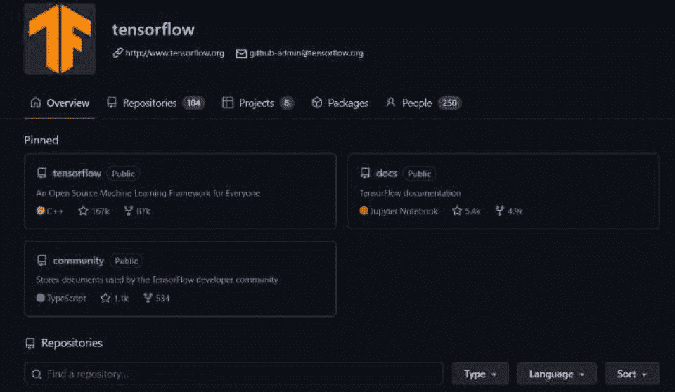**](https://github.com/tensorflow)

用这个神经网络库进入机器学习。TensorFlow 是用 Python 开发的，是一个开源的深度学习框架。虽然它肯定不适合初学者，但这是一个展示你技能的好项目。开始用 Python 开发神经网络，你可以写下任何形式开发的入场券。

[**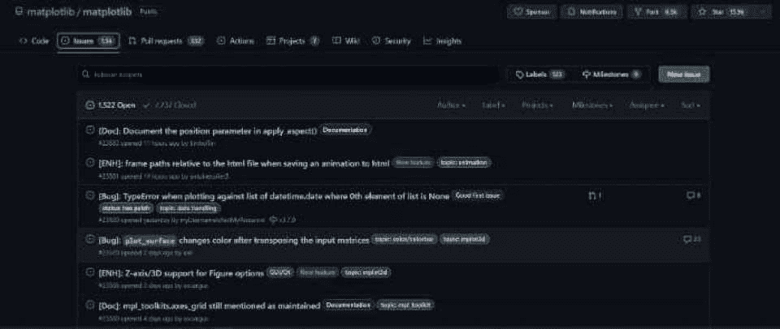**](https://github.com/matplotlib/matplotlib/issues)

如果你喜欢数据可视化和分析，Matplotbib 是你想去的地方。Matplotlib 是世界上最流行的数据可视化技术之一，也是一个非常活跃的 GitHub 社区。

[**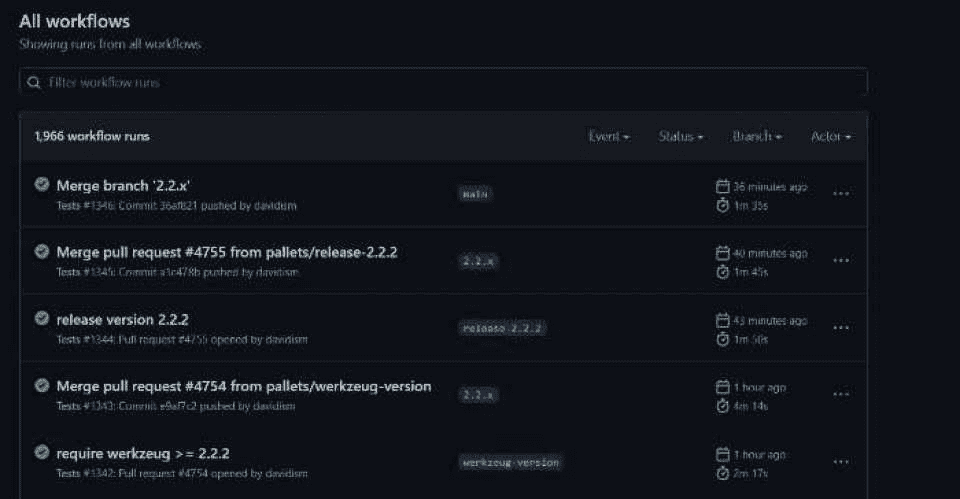**](https://github.com/pallets/flask/actions)

Flask 是 Python 中的一个 web 开发库，非常适合那些对 web 开发和编程感兴趣的人。如果你已经使用 Flask 作为 web 开发人员，为什么不尝试修复几个 bug 并开发你的 GitHub 帐户呢？

[****](https://github.com/django/django/pulse)

Django 是另一个非常活跃的 web 框架项目。Django 是一个由 Django 软件基金会维护的免费开源解决方案，旨在促进高级快速部署。许多新的 web 开发人员都是从学习 Django 开始的。

[**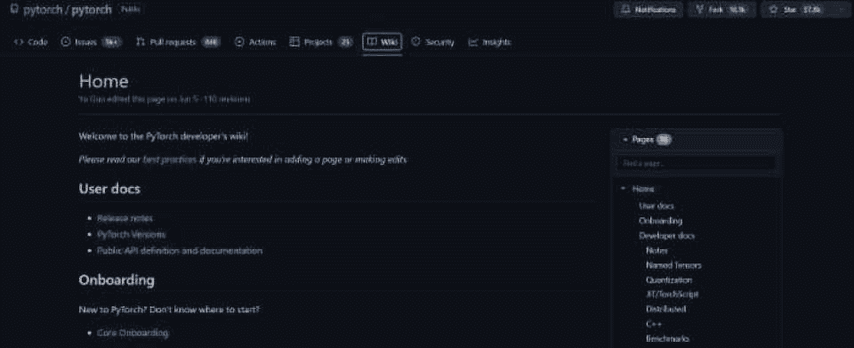**](https://github.com/pytorch/pytorch/wiki)

PyTorch 是另一个处理神经网络和机器学习的高级 Python 包。如果你想同时了解更多关于[人工智能](https://hackr.io/blog/what-is-artificial-intelligence)和 Python 的知识，请花些时间在 PyTorch 上。你可以先解决几个 bug，然后再开始。

## **最佳 JavaScript 开源项目**

在 JavaScript 中，大多数开源项目都与 web 开发、框架和移动应用程序开发有关。您将了解关于快速部署和基于组件的库的更多信息。

[**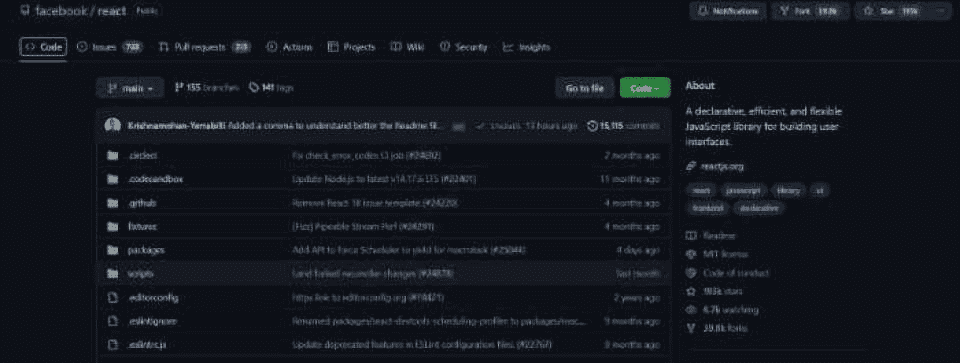**](https://github.com/facebook/react)

React 和 React Native 是基于组件的框架，用于开发动态、易于部署的 ui。React 由脸书开发，用于复杂 web 属性的快速部署，对移动和 web 开发人员都非常有用。

[**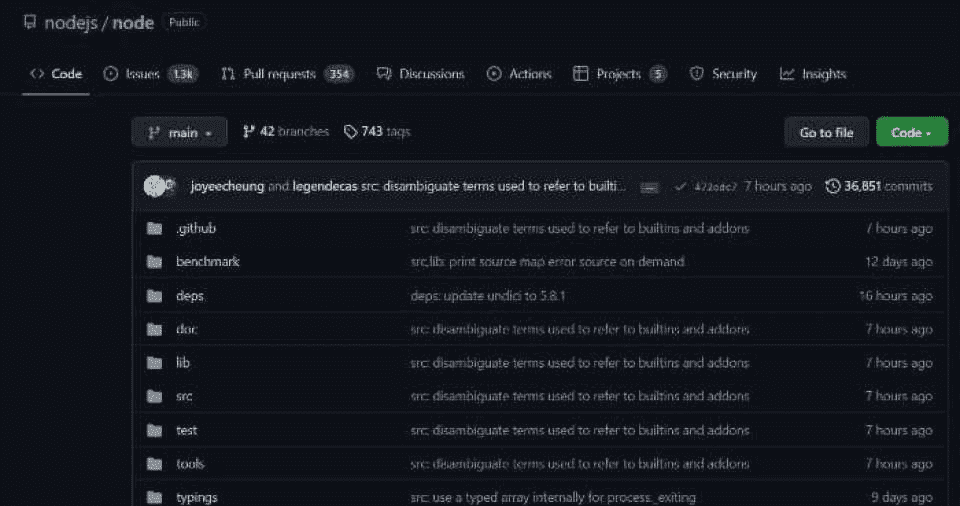**](https://github.com/nodejs/node)

节点。JS 是一个跨平台的开源框架，用于在传统浏览器环境之外运行 JavaScript。带节点。JS，开发人员可以创建快速、可伸缩的服务器端解决方案。如果你为 Node.jS 做贡献，你就是在为一个由数千名开发者组成的活跃社区做贡献。

[****](https://github.com/jquery/jquery/releases/tag/3.6.0)

jQuery 可能是当今最流行的 JavaScript 库，致力于使遍历和操作 HTML DOM 变得更容易。此外，jQuery 简化了 CSS 动画和事件处理，使开发人员更容易更快地编写复杂的 JavaScript 应用程序。

[掌握数据结构&使用 C 和 C++](https://click.linksynergy.com/link?id=jU79Zysihs4&offerid=1045023.2121018&type=2&murl=https%3A%2F%2Fwww.udemy.com%2Fcourse%2Fdatastructurescncpp%2F) 算法

[**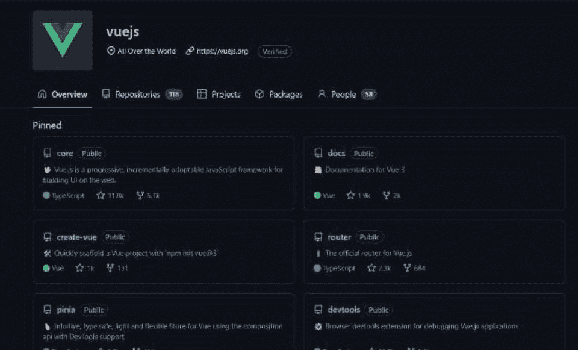**](https://github.com/vuejs/vue)

Vue.js 开发是一个渐进式的 JavaScript 框架，主要关注单页面应用程序和 UI 开发。你可以参与一些当今最流行的 MVC 框架。

[**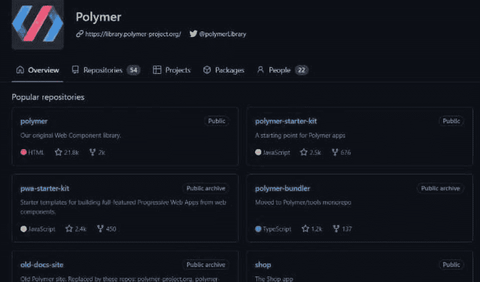**](https://github.com/Polymer)

Google 开发人员开发了 Polymer——一个使用 web 组件开发网站的开源库。如果你想跳进一个方项目，让它聚合或反应。在扩展您的投资组合的同时，您将加深对基于组件的库的理解。

## **最佳 C++开源项目**

在 C++ 中，你会发现非常广泛的开源项目。你可以开发任何东西，从操作系统到游戏开发工具包。

[**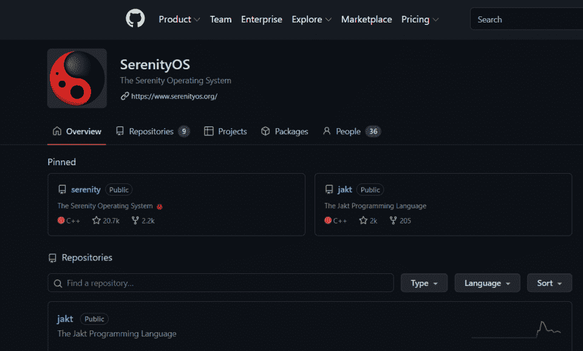**](https://github.com/SerenityOS/serenity)

Serenity 是一个有趣的小操作系统项目，用新技术复制了一个类似 Unix 的图形化操作系统。SerenityOS 是一款功能齐全的操作系统，最初于 2018 年发布。

[**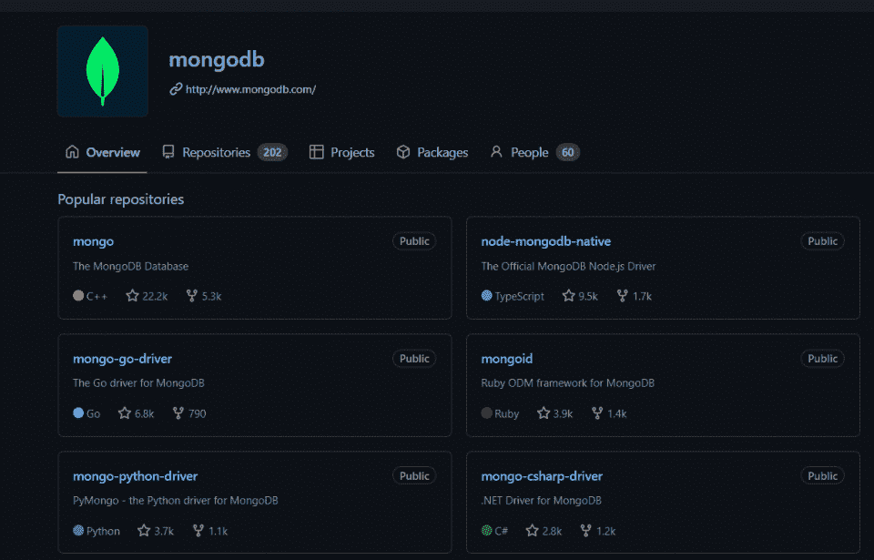**](https://github.com/mongodb)

认真对待您的 MongoDB 开发。MongoDB 是一个开源的、跨平台的文档数据库。作为一个 NoSQL 数据库解决方案，MongoDB 经常被开发人员用于数据挖掘。

[**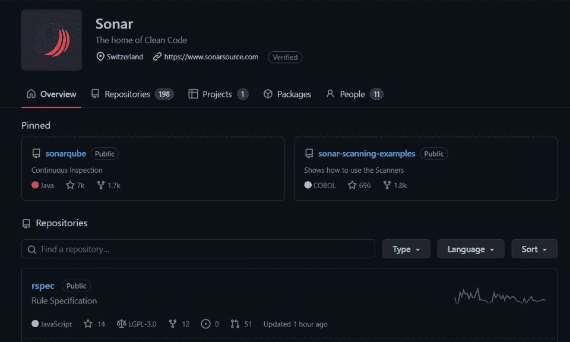**](https://github.com/SonarSource)

使用 SonarSource 提高代码质量和安全性。SonarSource 提供了一套产品，旨在通过静态代码分析和质量检查来改进持续集成和开发。

[**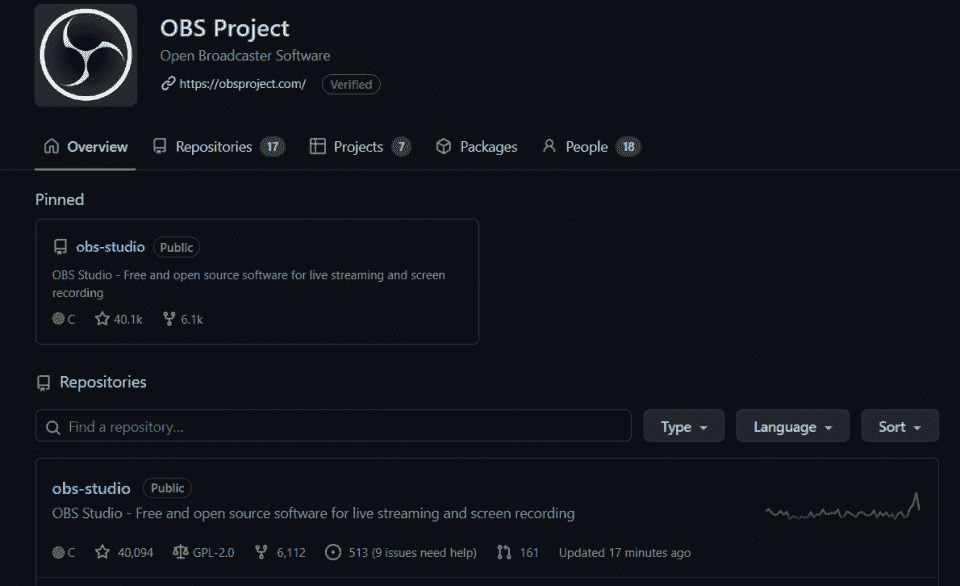**](https://github.com/obsproject)

OBS Studio 是当今最受欢迎的流媒体平台之一。它用于在 Twitch 和 YouTube 等平台上进行直播。您可以了解直播服务和视频捕捉。

[**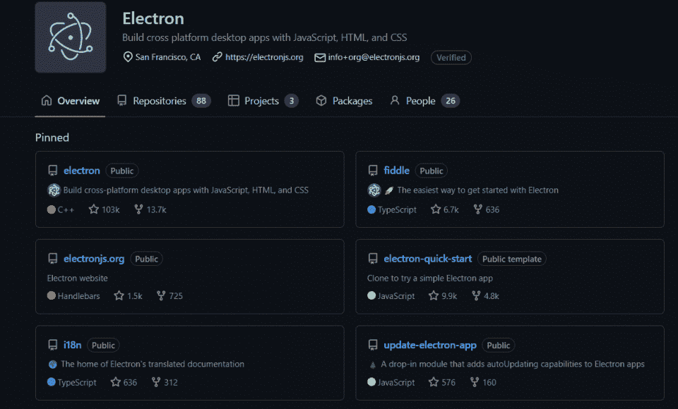**](https://github.com/electron/electron)

这里有一个有趣的项目。电子使得通过 HTML、JavaScript 和 CSS 编译跨平台的桌面应用成为可能。电子将向你介绍所有这些技术的来龙去脉。

## **最佳 Java 开源项目**

像 C++项目一样，Java 开源项目也是极其多样化的。从 Arduino 控制器到数据库技术，您几乎可以找到任何任务的 Java 开源项目。

[**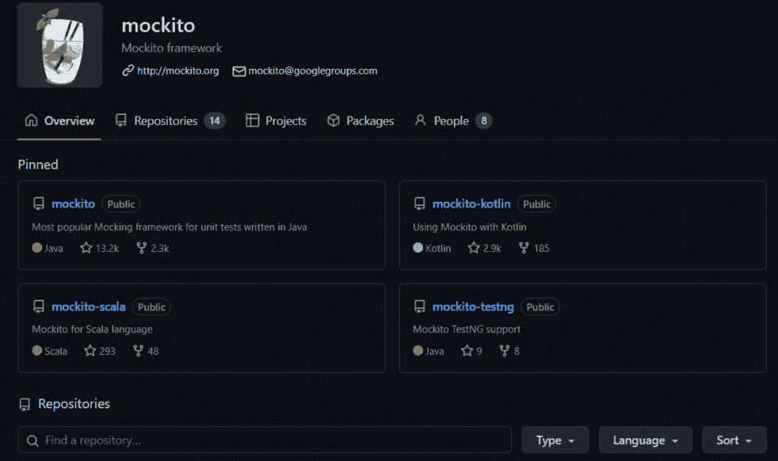**](https://github.com/mockito/mockito)

一个模仿 Java 的框架。Mockito 运行单元测试和自动化测试过程。用 Java 编写的 Mockito 测试可用于 Kotlin 和 Scala 等语言。开发人员可以了解更多关于单元测试和 QA 的知识。

[**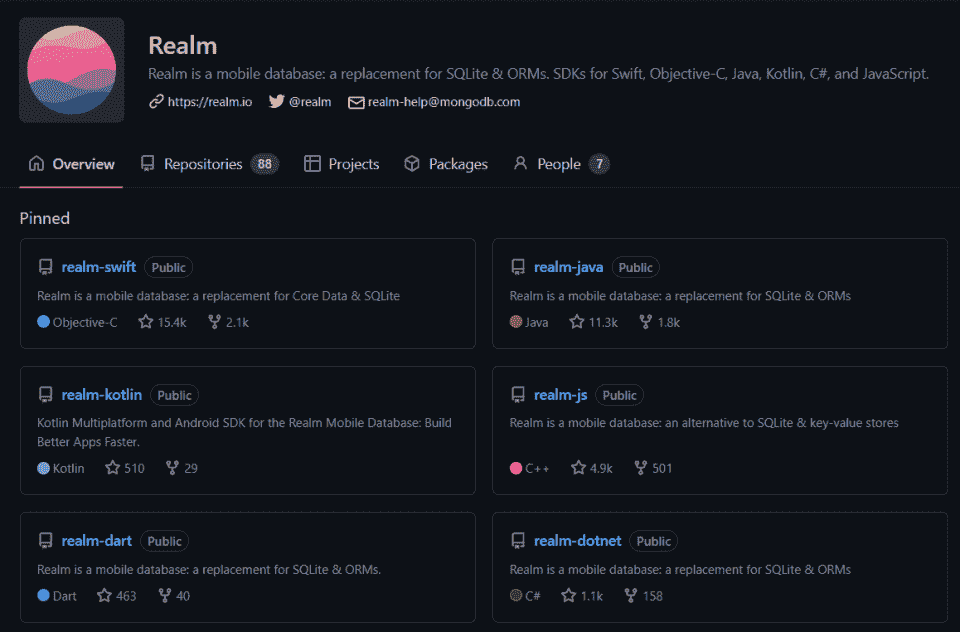**](https://github.com/realm)

Realm 是一个移动数据库解决方案，用于 SQL 等更传统的应用程序，用 Kotlin、C#、JavaScript 和 Swift 语言设计。学习 Realm-Java，了解更多关于数据库管理和移动设备开发的知识。

[**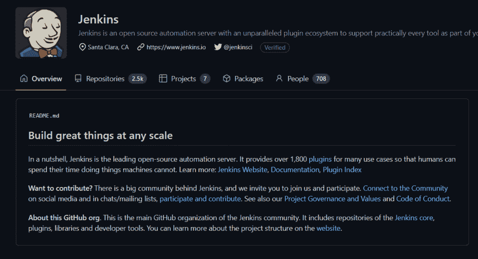**](https://github.com/jenkinsci)

Jenkins 是一个非常受欢迎和被采用的自动化服务器，是一个值得深入研究和探索的优秀项目。进一步探索自动化及其优势是理想的。

[**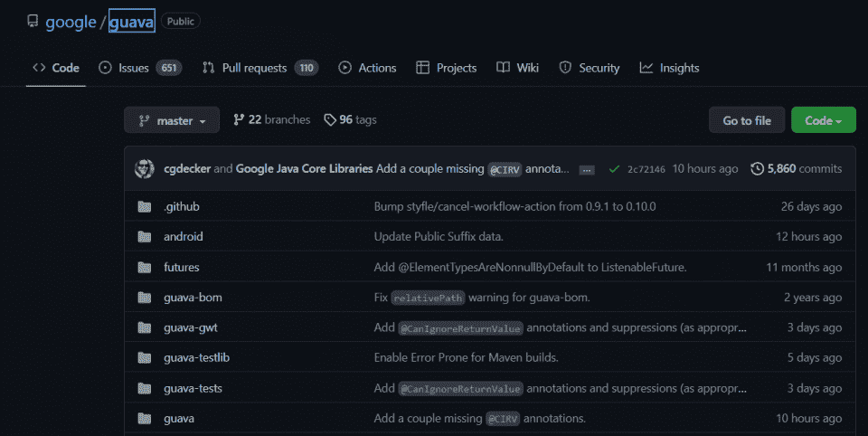**](https://github.com/google/guava)

谷歌的许多项目都是开源的——包括番石榴。通过查看 Google 的公共 Java 库，看看 Google 开发人员是如何启动和维护一个项目的。

[**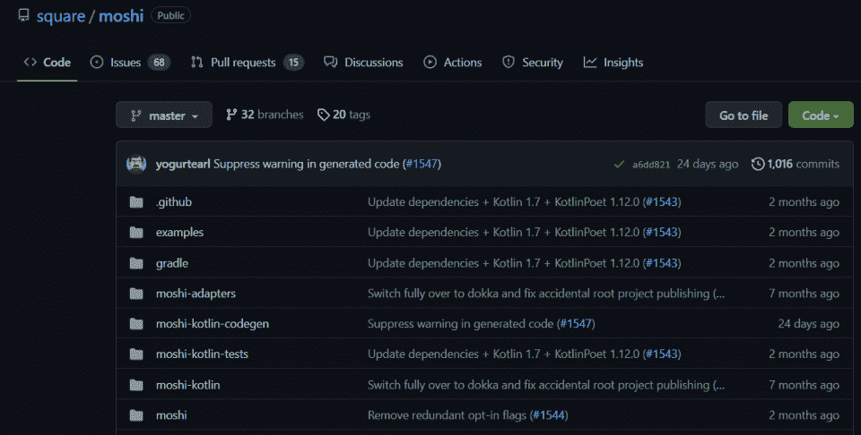**](https://github.com/square/moshi)

Moshi 是一个用于 Kotlin 和 Java 的现代 JSON 库，它将教你更多关于用这两种语言编程和开发的知识。它将 Javascript 的对象符号系统(JSON)移植到 Java 和 Kotlin 语言中。

## **如何找到有趣的开源项目**

是什么让上述项目成为最好的开源项目？一个好的开源项目应该是:

*   关于你感兴趣的事情
*   用你知道(或想学)的语言写
*   由一个庞大活跃的社区支持
*   你想学习的技术

如果一个开源项目符合这个标准，请随意加入。不要害怕犯错误。有时候，你从犯错误中学到的比从成功的承诺中学到的更多。

## **结论:今天就开始练习你的开源代码**

是时候开始开发自己的开源项目了。探索上面的项目——或者，如果你还没有准备好，考虑参加一个训练营或课程。你甚至可以探索一个 [web 开发 IDE](https://hackr.io/blog/web-development-ide) 的代码。

对开源安全好奇？

## **常见问题解答**

#### **1。什么是开源项目？**

开源项目是源代码公开的项目。任何人都可以查看、编辑和贡献代码。从事一个开源项目可以让你进入一个现有的项目，了解它是如何工作的，并帮助社区成长。

#### **2。有哪些好的开源项目？**

有很多好的开源项目。理想情况下，你会从事一个与你的兴趣相符的项目。例如，如果你对 Python 和机器学习感兴趣，你可能想从事 Pytorch。如果您对 Java 和数据库管理感兴趣，可以考虑 Realm。

#### **3。开源项目能挣钱吗？**

开源项目有很多赚钱的方法。例如，您可以创建项目的高级版本，或者提供咨询服务。最直接的是，如果你从事开源项目，你可以将你的工作添加到你的 Github 个人资料中，并有可能建立你的职业生涯。

#### **4。为什么开源项目很重要？**

开源项目很重要，因为它们允许人们协作、共享代码和相互学习。在个人层面上，开源项目帮助你作为一名开发人员学习和成长。