# 熊猫降柱法进行数据清洗

> 原文：<https://hackr.io/blog/pandas-drop-column-method-for-data-cleaning>

数据清理是从数据集中识别、修复和消除任何不准确或不一致的过程。这是大多数数据分析和数据挖掘项目的关键部分，通常在我们进行任何数据分析之前执行。

数据清理可能是一项耗时且乏味的任务，但它对于向数据分析师和科学家提供可用的数据集是必不可少的。一个净化良好的数据集可能是一个成功的数据分析项目和一个彻底失败的区别。

有几种方法可以执行数据清理，包括 pandas drop column 方法。无论您采用哪种方法，目标都是一样的:生成高质量、一致的数据，供我们进行详细分析。

本文将向您展示如何在 pandas 中删除一个列，作为数据清理过程的一部分。

## 为什么要删除列？

删除列是数据清理过程中的一个重要步骤，原因有几个

*   **节省时间和内存:**支持更快的数据分析和处理
*   **提高数据准确性:**删除不准确、重复或缺失的值
*   **提高数据的清晰度:**删除不相关的数据，例如，如果我们有用户信息数据，可能不需要名字和姓氏列
*   **关注数据子集:**从额外的列和数据中去除干扰
*   **防止数据泄露:**限制机器学习模型在预测目标变量时访问错误的数据

Pandas 是一个非常流行的 Python 库，经常用于一系列数据活动，包括数据清理和从数据帧中删除列。出于这个原因，在您的工具包中有 pandas drop column 方法是很方便的，这意味着您需要知道它是如何工作的。

**想要提升您的 Python &数据科学技能吗？**

**[查看 Python 中的顶级数据科学库](https://hackr.io/blog/top-data-science-python-libraries)**

## **熊猫降柱&其他方法**

我们可以使用几种方法在 pandas 中删除一列，无论是清理数据集还是从现有数据中提取具有特定列的数据帧。我们也可以使用这些方法中的一些来使熊猫放弃多个列。

*   熊猫。【drop()【行和列】方法

*   熊猫。dropna() 方法用于包含空值的行和列

*   熊猫。pop() 用于行、列或单个条目

*   *Python del* 列的方法

让我们来看看使用这些方法中的每一个从数据帧中删除一列的代码示例。

## 熊猫数据框。drop()方法

**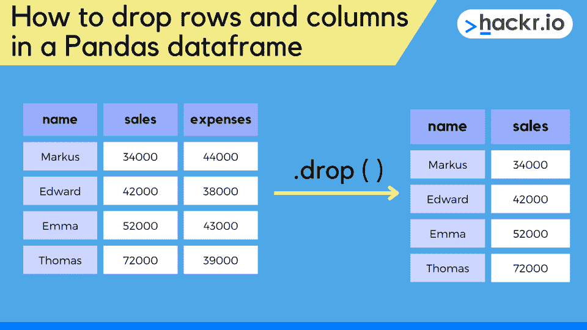**

我们可以使用*。drop()* 从 pandas 数据帧中删除行或列的方法。这是通过指定放置数据的轴来实现的。默认情况下，这将删除行，但是我们可以将轴值指定为 1 来删除列。

默认行为为*。drop()* 返回一个删除了指定行或列的新数据帧。这意味着我们不修改原始数据帧(不就地改变)。

但是，我们可以将可选的 inplace 参数设置为 true，以便从原始数据框中永久移除行或列。

**注意:**您不能撤消就地删除，因此在执行此操作之前，请仔细检查您的数据。

我们可以通过索引或值从数据帧中删除行或列。索引可以通过名称或数字来指定，而值需要列表或布尔掩码。

如果你想了解更多关于熊猫*的信息，请查阅官方文件。【drop()【方法】及其可选参数范围。*

我们来跳一个例子吧！我们将把 tips.csv 数据集(可从这里下载)加载到一个 pandas dataframe 中，通过*对其进行裁剪，使其包含前 5 行。head()* 方法，然后打印出来，对数据有个感觉。

```
import pandas as pd

df = pd.read_csv('tips.csv')
print(df.head(5))
```

**输出**

**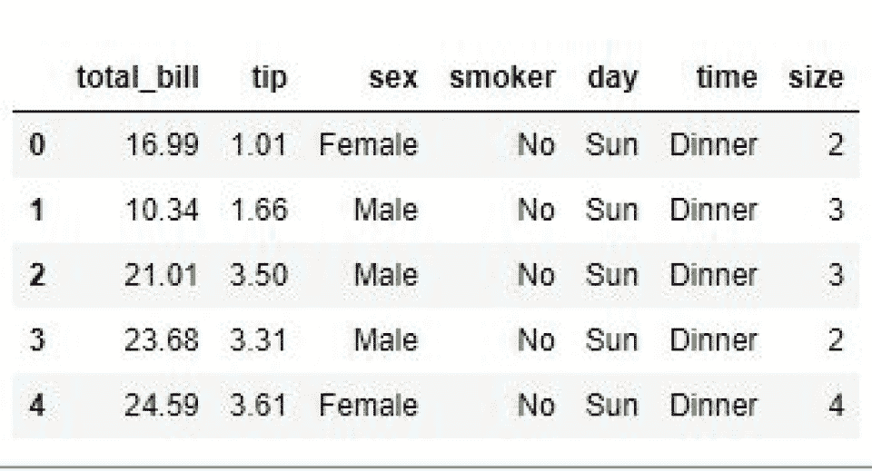**

**按标签删除列**

### 现在，让我们尝试通过标签(列名)删除其中一列。

为此，我们将标签传递给我们的*。*调用 drop()，如下所示。我们还将值 1 传递给可选的 axis 参数，以确保我们删除的是列而不是行。如果我们想要删除行，我们可以省略这个参数或者传递一个值“0”。

然后我们可以看到，我们已经能够删除输出中的“tip”列。

**输出:**

```
df_drop = df.drop(labels='tip', axis=1)
print(df_drop)
```

**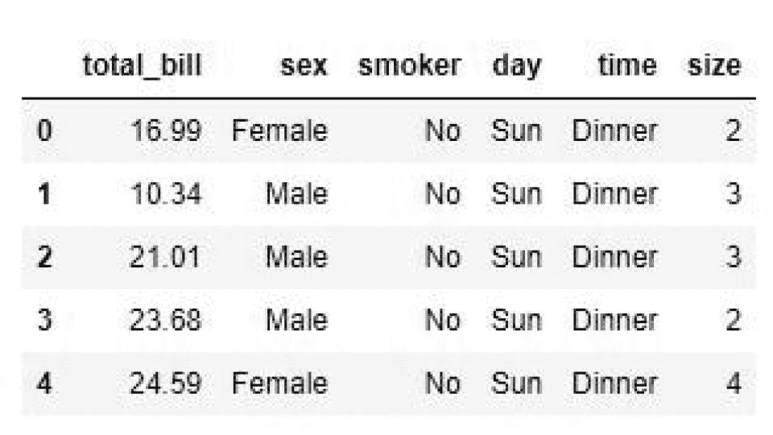**

如果我们想通过标签删除 pandas 中的多个列，我们可以将列名列表传递给 label 参数，如下所示。在这种情况下，结果 dataframe 丢失了“tip”和“sex”列，如输出所示。

**输出:**

**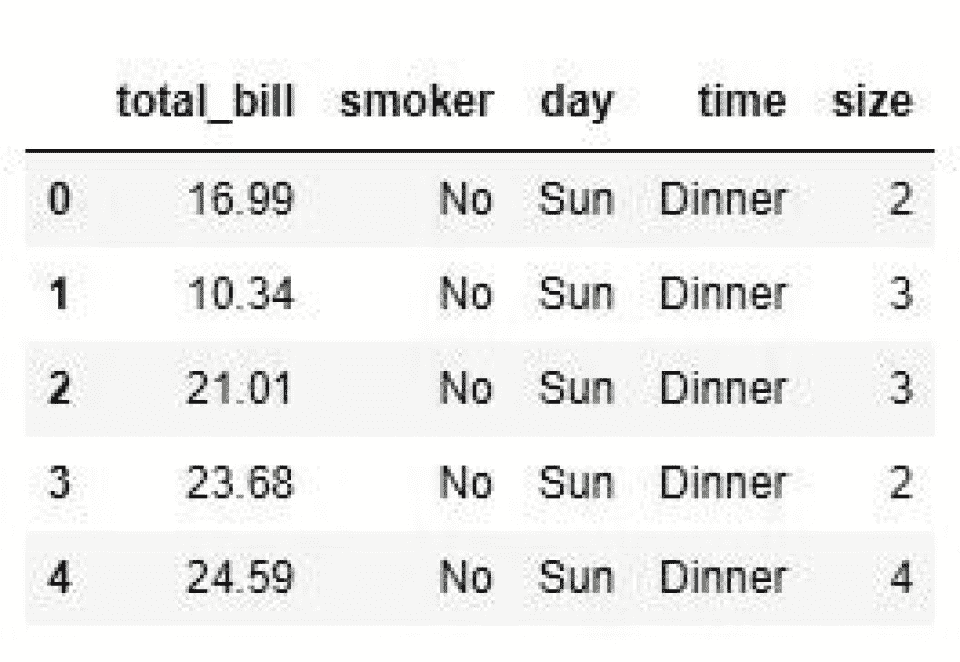**

```
df_drop = df.drop(labels=['tip', 'sex'], axis=1)
print(df_drop)
```

**按索引删除列**

删除列的另一种方法是使用列索引。在这种情况下，我们使用索引来访问我们希望通过*删除的列标签。列[n]* 。

*。columns* 属性返回一个 pandas index 对象，我们可以使用它通过传递一个索引 n 来返回我们想要删除的列的标签。

### 因此，通过传递索引值 1，我们可以返回第二列的标签(由于零索引)。然后用它来删除 dataframe 列，如输出所示。

**注意:**索引为 1 的列是“提示”列。

**输出:**

**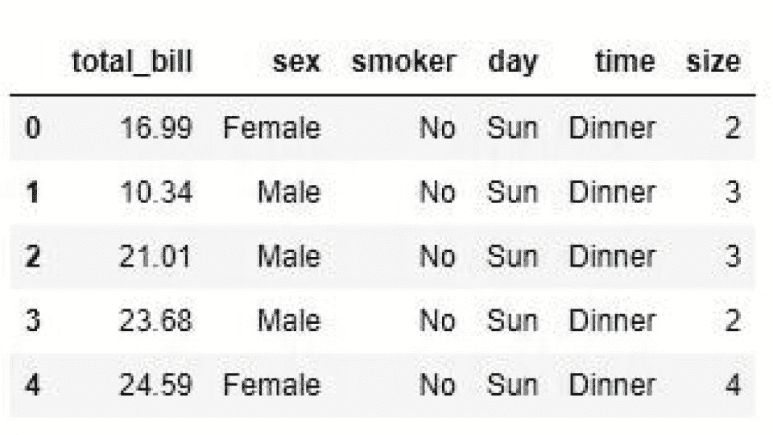**

与我们通过标签删除多个列一样，我们也可以通过索引删除多个列。为此，我们将一列索引值传递给由*返回的 pandas 索引对象。列*。

```
df_drop = df.drop(df.columns[1], axis=1)
print(df_drop)
```

下面的示例显示了索引 1 和 2 的情况，它们引用第二列和第三列。查看输出，我们可以看到结果数据帧丢失了“tip”和“sex”列。

**输出:**

**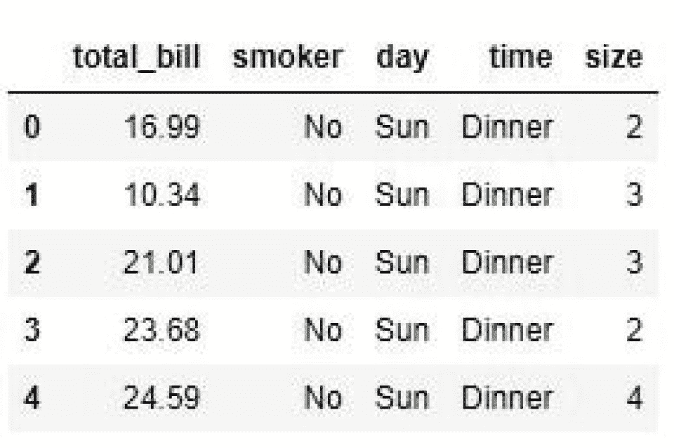**

**用列参数**删除列

删除列的另一种方法是通过可选的 columns 参数。在这种情况下，我们传递列名(就像我们传递 labels 参数一样)。正如我们已经看到的，生成的数据帧将删除“tip”列。

```
df_drop = df.drop(df.columns[[1,2]], axis=1)
print(df_drop)
```

**输出:**

**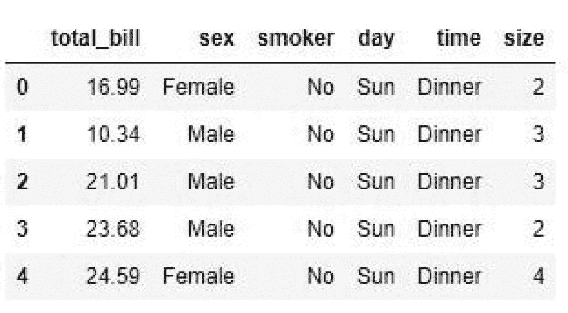**

我们还可以通过传递如下所示的列名列表来删除多个列(很像我们对 labels 参数所做的)。下面输出的结果数据帧显示我们已经删除了“tip”和“sex”列。

### **输出:**

**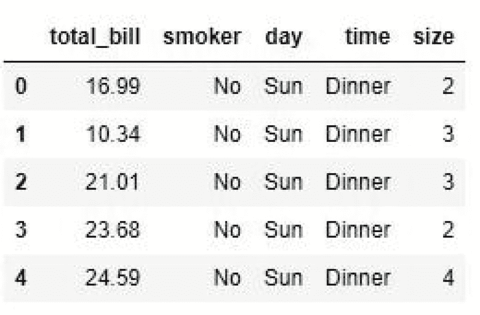**

```
df_drop = df.drop(columns='tip')
print(df_drop)
```

**用 DataFrame.columns.difference 方法删除列**

从 pandas 数据帧中删除一列或多列的另一个有用方法是*data frame . columns . difference()*方法。这将返回参数值的补集，这意味着我们可以使用此方法从数据帧中删除列。

对于本例，让我们创建一个新的三列三行的 dataframe，如下面的代码片段和输出所示。

**输出:**

```
df_drop = df.drop(columns=['tip', 'sex'])
print(df_drop)
```

**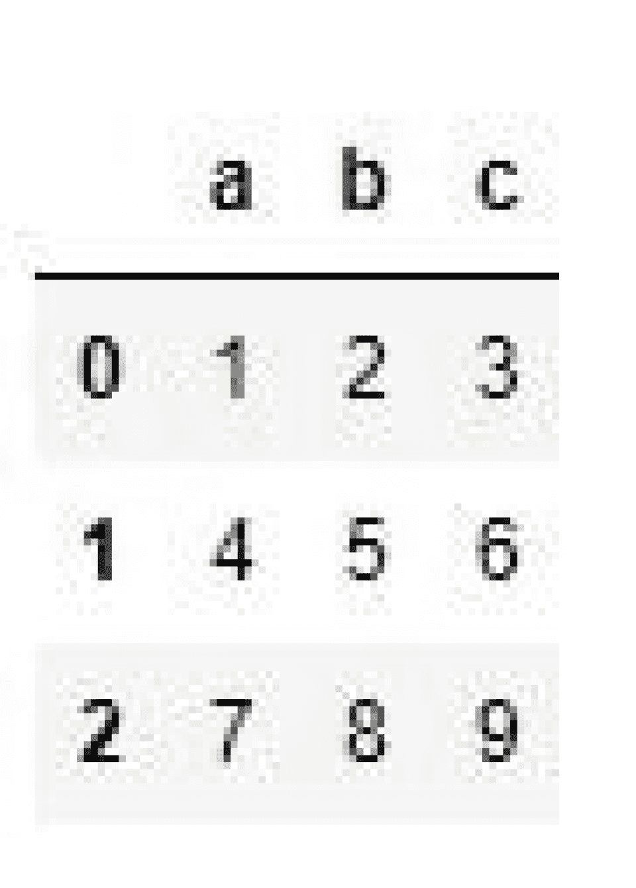**

如果我们现在想要删除' c '列，我们可以使用如下所示的 *df.columns.difference()* 。在这种情况下，我们传入一个我们想要删除的列的列表，在这种情况下，只是标签' c '。然后，我们可以在输出中看到结果数据帧丢失了列“c”。

**输出:**

### **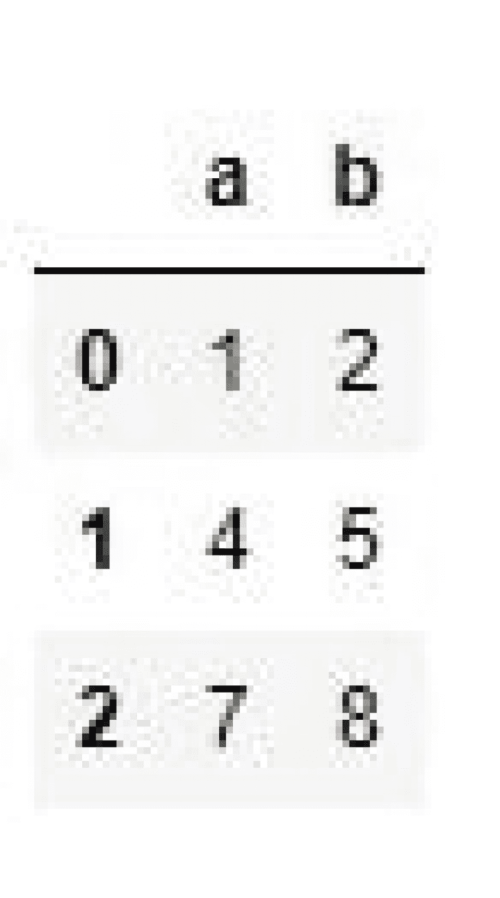**

**用...删除列。iloc()和。loc()**

删除一列或多列的另一种方法是使用熊猫*。loc()* 和*。iloc()* 方法。我们可以使用它们从数据帧中删除单个列或一系列列。

```
df = pd.DataFrame([(1,2,3),(4,5,6),(7,8,9)], columns=('a','b','c'))
print(df)
```

在下面的例子中，我们使用*。iloc()* 从数据帧中删除第 1 到第 3 列。这是因为 *i.loc()* 符号不包含第二个整数参数(即 4)。我们可以在输出中看到结果数据帧，减去“小费”、“性别”和“吸烟者”列。

**输出:**

**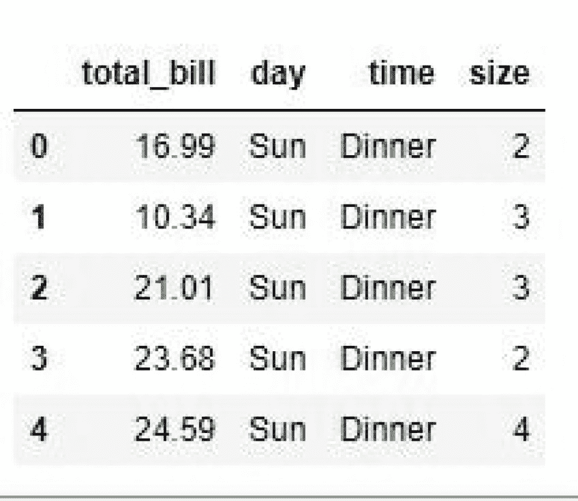**

```
df_drop = df[df.columns.difference(['c'])]
print(df_drop)​
```

同样，我们也可以用*。loc()* 从 dataframe 中删除列，但是这次我们传递一个列标签列表，如下所示。这是因为。 *iloc()* 使用整数位置和*。loc()* 使用列标签。查看输出，我们可以看到“tip”和“sex”列被删除。

**输出:**

**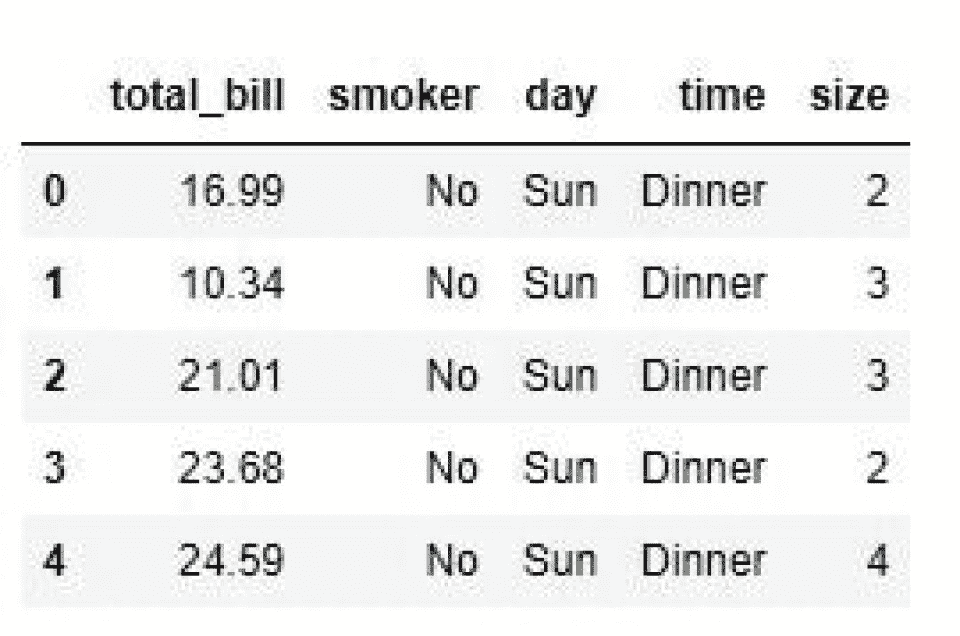**

### **删除带有标签列表的列**

用*删除列的快速方法。drop()* 将一列标签作为第一个参数传递。

这是因为*的第一个可选参数。drop()* 是‘labels ’,所以如果我们传入单个标签或一组标签，我们可以省略参数名，如下所示。

```
df_drop = df.drop(df.iloc[:, 1:4], axis=1)
print(df_drop)
```

结果是一个 dataframe 减去“tip”和“sex”列，如输出所示。

**输出:**

**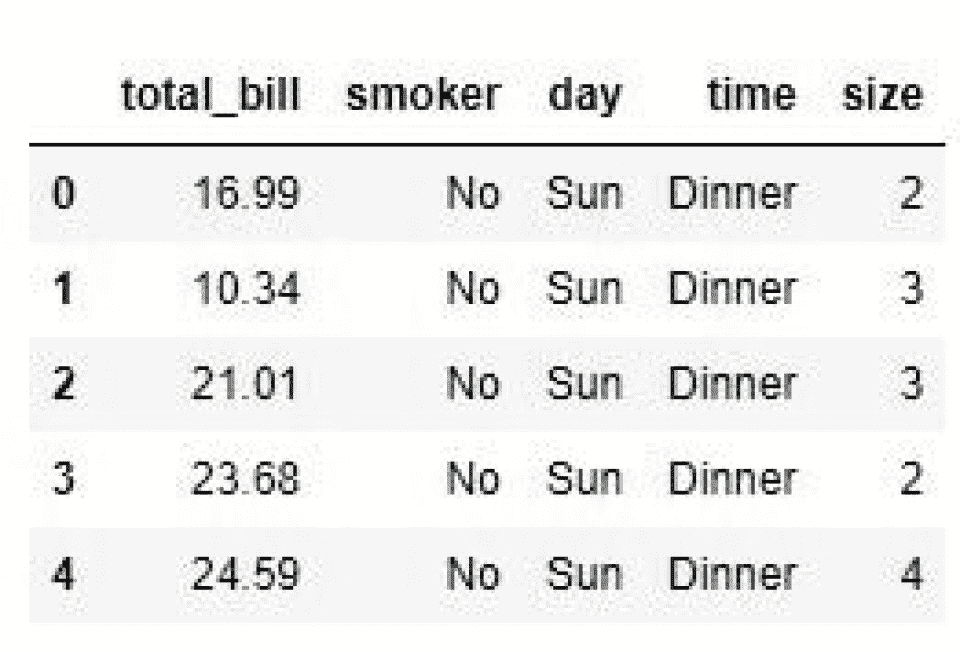**

熊猫数据框。dropna()方法

```
df_drop = df.drop(df.loc[:, ['tip', 'sex']], axis=1)
print(df_drop)
```

我们可以使用*。dropna()* 方法从 pandas dataframe 中删除包含空值的行或列。此方法的默认行为是删除至少有一个 null 值的任何行或列。

我们还可以通过传入 threshold 参数来指定要删除的行或列的 null 值的最小数量。如果您有一个包含大量空值的数据框，但您只想删除充满空值的列，这将非常有用。

**注意:**这个方法也要求 axis 参数为 1 来删除列而不是行。

### 这个例子将使用一个两列四行的新数据帧。在这种情况下，我们将使用 pandas 和 NumPy 的经典 Python 数据分析组合。我们需要使用 NumPy 将‘NP . nan’值(对于空条目)添加到新的数据帧中。好了，让我们开始吧！

查看输出，我们可以在列“A”中看到“NaN”值，pandas 会将其识别为 null。

**输出:**

**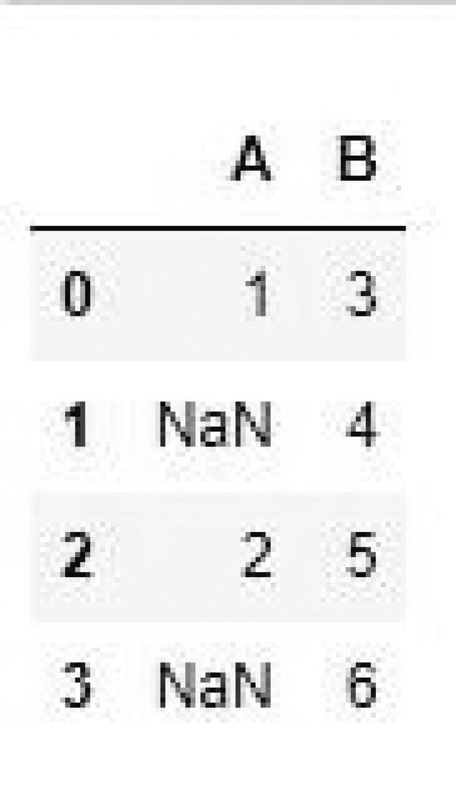**

```
df_drop = df.drop(['tip', 'sex'], axis=1)
print(df_drop)
```

现在，让我们尝试从这个 dataframe 中删除至少有一个 null 值(默认行为)的所有列。dropna() 。查看输出，我们可以看到列“A”已被删除。

**输出:**

**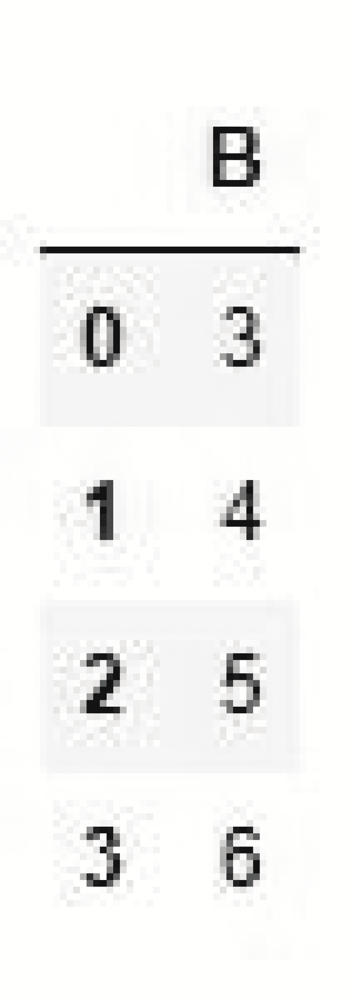**

## **注意:**只能用*。dropna()* 删除空值的列或行，不会删除非空值的行或列，为此，使用*。drop()*

熊猫数据框。pop()方法

从 pandas 数据帧中删除列的一个相对简单的方法是使用*。pop()* 方法。注意，这也将返回被删除的列，这对于任何类型的 *pop* 方法来说都是相当标准的。

*的一个关键区别。pop()* 和*。滴()*或*。dropna()* 的一个优点是它只修改现有的数据帧。这意味着您将直接从原始数据框架中删除该列，因此请确保您对此感到满意。

好了，让我们创建一个简单的三列三行的 dataframe，如代码片段所示。如果我们想删除列‘c’，我们必须将标签传递给*。pop()* 如下图所示。输出中的结果数据帧显示列“c”已被删除。

**注意:**这个方法也返回弹出的列。因此，我们可以将该列保存到一个新的数据框架中，或者如果我们愿意，可以用另一种方式来处理它。

```
import numpy as np
import pandas as pd

data = pd.DataFrame({"A":['1', np.nan, '2', np.nan],
                     "B":['3', '4', '5','6']})
print(data)​
```

**输出:**

**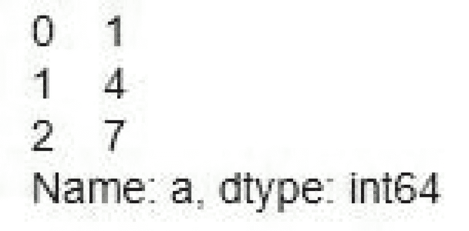**

如上所述。pop() 是一种破坏性的方法，可以就地修改你的数据。因此，有时提前制作数据帧副本是个好主意。这意味着如果你改变主意，你可以随时恢复。为此，请使用*。*复制()【方法】如下所示。

```
data_drop = data.dropna(axis=1)
print(data_drop)
```

使用*时需要牢记的一些其他注意事项。pop()*

如果您试图弹出一个不存在的列或行，您会看到一个错误

弹出一列后，不能保证任何剩余列的顺序。如果需要保持列顺序，使用*。drop()*

**用 Python del 方法删除列**

## 从 pandas 数据帧中删除列的另一个选择是使用 Python 的 *del* 方法。很像*。pop()* ，这是一个破坏性的方法，用于从原始数据帧中删除一列。

不像熊猫。drop()方法，您不能使用 *del* 来删除行。这意味着您只能删除列，并且一次只能删除一列。

让我们创建一个三行三列的简单数据帧，如下面的代码和输出所示。

**输出:**

****

```
df = pd.DataFrame([(1,2,3),(4,5,6),(7,8,9)], columns=('a','b','c'))
df.pop('c') ​
```

要删除一列，我们需要通过将标签放在方括号中来访问它。然后我们可以将它作为参数传递给 Python *del* 方法，如下所示。输出中的结果数据帧显示“b”列已被删除。

**输出:**

**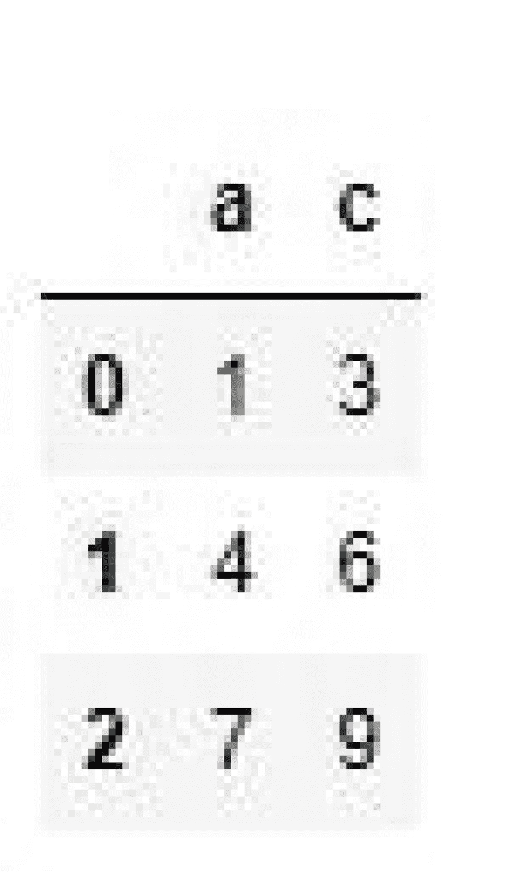**

**注:**就跟*一样。pop()* ，使用 *del* 后，无法恢复已删除的列。如果您想恢复选项，复制一份数据帧或使用*。降()*取而代之。

```
df_copy = df.copy() 
df_copy.pop('c')​
```

**从数据帧中删除列的提示**

选择*。drop()* 方法来确保您的原始数据得以保留

*   将 axis 参数设置为 1 以删除列而不是行
*   如果要永久改变原始数据帧，请仅将 inplace 设置为 True

## **结论**

用*从 pandas 数据帧中删除一列是一个相对简单的操作。*降()，*。pop()* 或 *del* 方法。只需指定要删除的列名，新简化的数据框架就可以使用了。

也就是说，从数据帧中删除列时，需要记住一些事情

确保要删除的列确实存在，否则会出现错误

```
df = pd.DataFrame([(1,2,3),(4,5,6),(7,8,9)], columns=('a','b','c'))
print(df)​
```

如果您删除的列正在任何计算或操作中使用，则需要进行更新以反映这一更改

如果您有任何其他数据框架依赖项，这些将需要更新以反映更改

就是这样！数据帧中的 pandas drop column 操作是一个简单但具有潜在破坏性的操作。所以在你放弃一个专栏之前，确保你知道你在做什么！

**想提高您的 Python 技能吗？结账:**

```
del df['b'] 
print(df) 
```

**[最好的 Python 课程](https://hackr.io/blog/best-python-courses)**

**[最好的 Python 项目](https://hackr.io/blog/python-projects)**

**常见问题解答**

## **1。如何通过索引删除列？**

1.  若要按索引删除列，请使用以下语法
2.  **2。如何删除没有名称的列？**
3.  我们不能放弃一个没有名字的专栏。

## **3。如何在 Pandas 中删除多个列？**

要在 pandas 中放下多个列，可以使用*。drop()* 功能。例如，要删除列“a”和“b ”,您需要执行以下操作

With that said, there are some things to bear in mind when dropping columns from a dataframe

*   Ensure the column you want to drop actually exists, else you'll get an error
*   If the column you’ve dropped is being used in any calculations or operations, these will need to be updated to reflect this change 
*   If you have any other dataframe dependencies, these will need to be updated to reflect the change 

And that’s it! The pandas drop column operation in a dataframe is a simple, but potentially destructive action. So make sure you know what you're doing before you drop a column!

**Want to boost your Python skills? Check out: **

**[The Best Python Courses](https://hackr.io/blog/best-python-courses)**

**[The Best Python Projects](https://hackr.io/blog/python-projects)**

## **Frequently Asked Questions**

#### **1\. How Do I Drop a Column by Index?**

To drop a column by index, use the following syntax 

```
df.drop(df.columns[index], axis=1)​
```

#### **2\. How Do I Drop a Column With No Name?**

We can’t drop a column with no name.

#### **3\. How Do I Drop Multiple Columns in Pandas?**

To drop multiple columns in pandas, you can use the *.drop()* function. For example, to drop the columns 'a' and 'b', you would do the following 

```
df.drop(['a', 'b'], axis=1)​
```