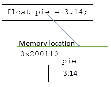
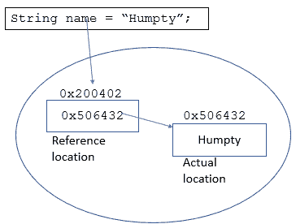
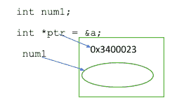
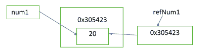

# C++中通过引用传递与通过指针传递

> 原文：<https://hackr.io/blog/pass-by-reference-vs-pass-by-pointer>

向函数传递变量有三种方式——按值传递、按指针传递和按引用传递。C++中最常用的使用引用传递的语言。为了详细讨论按引用传递，我还想向您解释另外两种方法，以便将这些概念永远植入您的脑海中。我写的例子都是用 C++写的，因为 C++使用了所有这三种语言，我们比较和理解它们会更容易。如果你想了解更多关于 C++的知识，请点击这里[](https://hackr.io/blog/difference-between-c-and-cplusplus)。

## **按值传递**

当你调用一个带有传递值的函数时，会创建两个具有相同值的变量副本。实际上，对被调用函数内部的变量所做的任何更改都不会反映到调用该函数的实际变量中(因为它们是内存地址不同的两个不同的副本)。例如——

```
void doubleTheValue(int a) 
{ 
 a = a*2; 
} 
int main() 
{ 
 int a = 5;
 cout << "Value of a before calling double function = " << a << "\n"; 
 doubleTheValue(a); 
 cout << "Final Value of a = " << a << "\n"; 
}

```

您可能认为计数器会将值打印为 10。但事实并非如此。即使调用 doubleTheValue 函数后，main 函数中 a 的值仍将保持为 5。

## **参照通过**

为什么上例中的值没有改变？因为，内存中有两个值指向不同的地址！通过引用传递有助于解决这个问题，它将变量的内存位置传递给被调用的函数。这意味着，传递的变量和被调用函数中使用的参数指向同一个位置，并且总是同步的——参数的任何变化也会反映在变量中。太棒了。让我们改变上面的例子—

```
void doubleTheValue(int &param) 
{ 
 param = param*2; 
}  
int main() 
{ 
 int a = 5;
 cout << "Value of a before calling double function = " << a << "\n"; 
 doubleTheValue(a); 
 cout << "Value of a = " << a << "\n"; 
}

```

& a 指向 a 的内存位置，当函数执行时，从那个内存位置拾取 a 的值并改变它。这一次，cout 给我们的答案是‘10’。

有了这个基本的概述，现在让我们继续讨论引用传递的更多细节。

### 【Java 和其他语言如何“通过引用传递”

虽然大多数较新的语言以不同的名称处理按引用传递，但基本概念是相同的。比如 [Java](https://hackr.io/blog/java-constructor) 通过引用传递对象(类类型)，但是 int、double 等原语是通过值传递的。考虑—

```
public class Student {
int rollNo;
char gender;
boolean pass;
}

```

让我们说一个函数 changeDetails(Student stud1)通过了 Student 的对象。这个对象有一个内存位置，对 Student 对象的任何更改都将反映在地址中。但是原始类型呢？

即使它们通过值传递，它们的值也会改变，因为它们驻留在对象内部，并且通过相同的内存位置访问。因此，当我们这样做时,将创建一个变量的副本，而 stud1 对象中的值不会改变！

同理，如果你传递单个的原始变量，原始值不会被改变。但是，如果您传递整个对象，这些值就会改变。像 [Python](https://hackr.io/blog/python-programming-language) ， JavaScript ，[Ruby](https://hackr.io/blog/getting-started-with-rails)和[PHP](https://hackr.io/blog/php-interview-questions)这样的语言也是如此！

整个讨论把我们带到了一个重要的点上——值类型和引用类型之间的区别是什么？

### **值类型 vs 引用类型**

快速比较将有助于我们清楚地理解不同之处和用法—

| **值类型** | **参考类型** |
| 所有的原始数据类型都是值类型。例如–int、double、byte、char、long、short 等… | 引用数据类型可以是字符串、数组、类、委托 |
| 该值存储在内存中，可以直接访问。 | 引用类型存储包含数据的内存位置。内存位置充当指向实际内存位置的指针。 |
|  |  |

既然你已经能够描绘出按值传递和按引用传递之间的区别，让我们来理解另一个概念——按指针传递。

## **经过指针**

在我们前面的 doubleTheValue 函数的例子中，我们使用“&通过引用传递“a”的值。我们可以通过指针传递值来做同样的事情。让我们修改 doubleTheValue 示例，并包含一个指针–

```
void doubleTheValue(int *ptr) 
{ 
 int a = *ptr;
 *ptr = a*2; 
 cout << "Address of a (ptr) = " << ptr << "\n"; 
 cout << "Initial value of a = " << a << "\n"; 
}  
int main() 
{ 
 int a = 5;
 doubleTheValue(&a); 
 cout << "Final Value of a = " << a << "\n"; 
}

```

当我们发送 a 的地址时，它是 ptr 或指向位置的指针，a 的值作为*ptr 被访问。这将给出如下输出–

```
Address of a (ptr) = 0x7ffc0f8fa3ec
Initial value of a = 5
Final Value of a = 10

```

无论我们是通过指针传递还是通过引用传递，输出都是一样的。在这两种情况下，我们引用存储变量' a '的内存位置，并直接从单个地址修改值。与按值传递不同，没有创建的其他副本。

那么，通过指针传递和通过引用传递有什么区别呢？

在进行表格比较之前，我想给你看另一个例子，在这里我们可以很容易地将不同之处形象化。

#### **指针快速概览**

一个指针可以存储任何变量的内存地址(而不是值)，命名的或未命名的。它也可以指向 null 或空。例如——



同理，我们可以说——int * ptr 2 = new int；

这里没有给新的 int 赋值变量，但是已经创建了一个内存位置和一个指针 ptr2。

你也可以给 null 分配一个指针！

#### **快速回顾参考文献**

另一方面，引用是变量的别名。让我们说，

```
int num1 = 20;
int &refNum1 = num1;

```

num1 和 refNum1 现在都指向同一个位置。



正因为如此，每当我们改变 num1 的值时，refNum1 就会改变，反之亦然。基本上，我们改变的是内存位置的值，它有两个名字——num 1 和 refNum1。

我们看到引用变量和指针都持有变量的地址，然而引用值应该总是被初始化。它们不能包含空值或 null 值。

int&ref num 1；//会给你编译错误

### **指针对参考值**

这里是一个示例代码，我们将在其中使用指针和引用。一步一步读-

```
#include 
using namespace std;
int main() {
 int maths = 99, science = 70; 
 // Create a pointer pointing to maths
 int * pMaths = &maths; // Explicit referencing 
 // value of variable that the pointer is pointing to
 cout << *pMaths << "\n"; 
 // Both give the memory address of maths variable
 cout << &maths << "\n"; 
 cout << pMaths << "\n"; 
 // Gives location of pointer
 cout << &pMaths << "\n"; 
 // pointer can be reassigned to point to some other address
 pMaths = &science; // pMaths no longer points to maths 
 cout << pMaths << "\n"; // prints the address of science
 cout << &pMaths << "\n"; // pointer location is same though points to different variable
 // Create a reference (alias) to maths
 int & refMaths = maths; // maths and not &maths
 // not pointer *refMaths, just refMaths (value of maths)
 refMaths = 92; 
 cout << refMaths << "\n"; // 92
 cout << maths << "\n"; //92 
 //Both &maths and &refMaths give memory address of maths variable</span
 cout << &maths << "\n"; 
 cout << &refMaths << "\n"; 
 //This code is wrong, you cannot assign reference to another. In other words "invalid conversion from 'int*' to 'int'"
 //refMaths = &science; 
 // This will change maths and refMaths both to the value of science
 refMaths = science; 
 science++; 
 cout << refMaths << "\n"; // 70
 cout << maths << "\n"; // 70
 cout << science << "\n"; // 71
} 
```

代码是从 [到这里](https://www3.ntu.edu.sg/home/ehchua/programming/cpp/cp4_PointerReference.html) 原始代码的修改版本。

[掌握数据结构&使用 C 和 C++](https://click.linksynergy.com/link?id=jU79Zysihs4&offerid=1045023.2121018&type=2&murl=https%3A%2F%2Fwww.udemy.com%2Fcourse%2Fdatastructurescncpp%2F) 算法

### **通过指针传递与通过引用传递:头对头比较**

现在，让我们并排比较这两种操作—

| **通过指针传递变量** | **通过引用传递变量** |
| 创建一个指针，存储变量的内存地址 | 为同一变量(别名)创建另一个名称 |
| 解引用运算符*给出变量的值 | 可以使用引用名隐式引用值。 |
| 可以指无，null 或空。 | 必须在声明期间初始化 |
| 可以被重新分配到另一个存储位置 | 不能被重新分配给另一个内存地址 |
| Uses ‘&’ to reference the address of variable. For example –int * pMaths =&数学；还有，cout<T3&pMaths<" \ n "；给出指针的地址 | 使用&，我们可以得到引用的地址(因为地址和原变量的地址相同) |

## **最后一句话**

希望这些例子和比较已经让你足够清楚地了解了通过引用传递，以及它与通过值传递和通过指针传递有什么不同。尽管按引用传递和按指针传递的目的相同，但两者之间还是有细微的差别。记住指针是一个引用，但反之可能不成立。正如我们已经看到的，大多数对象使用引用，因为它更快，而且不必处理指针提供的额外特性。当你必须重新分配一个位置时，使用指针。否则，总是更喜欢参考！

**您可能感兴趣的教程:**

**人也在读:**