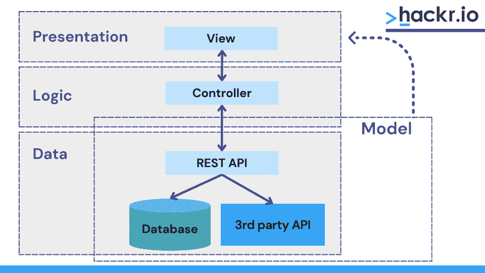

# 2023 年 Top 53+ PHP 面试问答[更新]

> 原文：<https://hackr.io/blog/php-interview-questions>

超文本预处理器(PHP)是一种用于 web 开发的流行脚本语言。这种开源语言创建于 1994 年，现在由 PHP 团队管理。这种语言可以在各种平台上运行，比如 Windows、Linux 和 MacOSX，并且与当今使用的大多数服务器兼容，比如 Apache 和 IIS。

如果你渴望成为一名 PHP 开发人员，你需要彻底了解它。在这里，我们收集了一些 PHP 面试的常见问题和答案来帮助你。我们将这些问题分为初级、中级和高级 PHP 面试问题。

## **PHP 面试问答**

### **基本 PHP 问题**

#### **1。PHP 是什么？**

PHP 是一种通用脚本语言，大部分用 C 和 C++实现，常用于 web 开发。它是一种高性能语言，因为代码在执行前不需要编译。它也是免费和开源的，可以很容易地学会。PHP 也很划算，因为大多数虚拟主机服务器默认支持它。

示例代码:

```
<?PHP

echo'Good morning';

?>
```

*阅读[本帖](https://hackr.io/blog/what-is-php)了解什么是 PHP？*

#### **2。PHP7.4 有什么特点？**

PHP7.4 中的一些新特性是:

*   预加载以进一步提高性能。
*   数组扩展运算符。
*   单行箭头功能(短闭包)用于更清晰的代码。
*   类中的类型化属性。
*   使用下划线格式化数值。
*   使用 FFI 进行扩展开发。
*   一种更好的方差。

#### **3。解释$message 和$$message 的区别？**

$message 是一个常规变量，它有固定的名称和固定的值，而$$message 是一个引用变量，它存储关于变量的数据。$$message 的值可以随着变量值的变化而动态变化。

#### **4。什么是幻常数？**

魔术常量以双下划线开始和结束，是预定义的常量，根据上下文和用法改变它们的值。PHP 中有 9 个神奇的常数:

```
__LINE__, __FILE__, __DIR__, __FUNCTION__, __CLASS__, __TRAIT__, __METHOD__, __NAMESPACE__, ClassName::class
```

#### **5。PHP 中的各种数据类型有哪些？**

中 PHP 的不同数据类型有:

*   **字符串:**字符序列，例如“Hackr.io”
*   **Float:** 浮点(十进制)数，例如 23.456
*   **整数:**整数，如 12
*   **布尔:**代表两种状态——真、假。
*   **对象:**将不同数据类型的值存储到单个实体中，例如 apple = new Fruit()；
*   **数组:**存储多个相同类型的值，如数组(“红”、“黄”、“蓝”)
*   **NULL:** 没有给变量赋值时，可以给变量赋值 NULL。例如，$ msg = NULL

#### **6。isset()函数是什么？**

函数的作用是:检查特定的变量是否被设置，以及是否有一个非 NULL 的值。如果变量未设置，则该函数返回 Boolean–false；如果变量已设置，则返回 true。该函数可以检查多个值:isset(var1，var2，var3…)

#### 7 .**。PHP 的各种数组函数有哪些？**

有许多数组函数，它们都是 PHP 核心的一部分:

| **数组函数** | **描述** |
| **数组()** | 创建一个数组。 |
| **array_diff()** | 比较数组并返回值的差异。 |
| **array_keys()** | 返回数组的所有键。 |
| **array_reverse()** | 反转数组。 |
| **array_search()** | 搜索一个值并返回相应的键。 |
| **array_slice()** | 返回数组的特定部分。 |
| **array_sum()** | 对数组中的所有值求和。 |
| **count()** | 数组中元素的数量。 |

在 [PHP 手册页](https://www.php.net/manual/en/ref.array.php)上找到更多函数。

#### **8。解释索引数组和关联数组的区别。**

| **索引数组** | **关联数组** |
| 有数字键或索引 | 每个键都有它的价值 |
| 索引从 0 开始，自动分配 | 键是手动分配的，也可以是字符串 |
| 示例:

```
$fruits = array(“orange”, “apple”, banana);
```

在这里，橘子是$水果[0]，苹果是$水果[1]，香蕉是$水果[2] | 示例:

```
$empdetails = array(“Sam”=>1200, “Mike”=>1201, “Mac”=>1202);
```

在这里，单个值可以作为，

```
$empdetails[“Sam”] = “1200”;
```

 |

#### **9。PHP 的各种字符串函数有哪些？**

PHP 允许许多字符串操作。一些流行的字符串函数有:

| **功能** | **描述** | **示例用法** |
| 回声() | 输出一个或多个字符串 | 

```
echo"Welcome to hackr.io"
```

 |
| 爆炸() | 将字符串分成数组 | 

```
$mystr = “welcome to hackr.io”
```

```
explode(“ ”, $mystr)
```

会呈现[0] =“欢迎”等等 |
| ltrim() | 从字符串左侧移除多余的字符或空格 | 

```
ltrim($mystr, "…. hello")
```

 |
| parse_str() | 将查询字符串解析为变量 | 

```
parse_str("empId=1234&name=Sam");
```

 |
| str_replace() | 替换字符串中的指定字符 | 

```
str_replace("mysite","hackr.io","Welcome to mysite");
```

 |
| str_split() | 将字符串拆分成字符数组 | 

```
str_split("welcome")
```

 |
| 字符串字数() | 字符串的字数 | 

```
str_word_count("my name is sam");
```

结果= 4 |
| 斯特伦() | 计算字符串的长度 | 

```
strlen("welcome");
```

结果= 7 |
| strncmp() | 比较字符串的前几个字符 | 

```
strncmp("welcome to mysite","welcome to hackr.io", 11);
```

如果前 11 个字符相同，结果= 0 |

更多字符串函数，请参考 [PHP 手册的字符串函数。](https://www.php.net/manual/en/ref.strings.php)

#### 10。require 和 include 的区别是什么？

require 和 include 都是构造，可以不带括号调用:include myfile.php

但是，如果没有找到要包含的文件，include 将发出警告，脚本将继续运行。Require 将给出一个致命错误，脚本将立即停止。如果文件对脚本至关重要，那么应该使用 require。

#### **11。最流行的基于 PHP 的内容管理系统(CMS)有哪些？**

现在有太多基于 PHP 的内容管理系统在使用。Drupal、Joomla 和 WordPress 是其中最受欢迎的。

#### **12。用 PHP 怎么上传文件？**

首先，PHP 应该允许文件上传；这可以通过使指令 file_uploads = On 来实现

然后，您可以将操作方法添加为“post”，编码类型为“multipart/form-data”

```
<formaction="myupload.php"method="post"enctype="multipart/form-data">
```

myupload.php 文件包含特定于要上传的文件类型(如图像或文档)的代码，以及目标路径、大小和其他参数等详细信息。

然后，您可以编写 HTML 代码，通过将输入类型指定为“file”来上传您想要的文件。

#### 13。如何用 PHP 创建数据库连接和查询？

要创建数据库连接:

```
$connection = new mysqli($servername, $username, $password);
```

其中$servername，$username，$password 应该由开发人员预先定义。

检查**连接是否成功:**

```
if ($conn->connect_error) {

die("Connection error: " . $conn->connect_error);

}
```

创建数据库查询:

```
$sql = "CREATE DATABASE PRODUCT";

if ($conn->query($sql) === TRUE) {

echo"Database successfully created";

} else {

echo"Error while creating database: " . $conn->error;

}
```

#### **14。什么是饼干？如何用 PHP 创建 cookies？**

Cookies 在浏览器上存储有关用户的数据。它用于识别用户，并在用户请求特定页面时嵌入到用户的计算机中。我们可以使用 setcookie()函数在 PHP 中创建 cookie:

```
setcookie(name, value, expire, path, domain, secure, httponly);
```

这里 name 是必需的，所有其他参数都是可选的。

示例:

```
setcookie(“instrument_selected”, “guitar”)
```

#### 15。解释解析器的重要性。

PHP 解析器是一种将源代码转换成计算机能够理解的软件。这意味着我们以代码形式给出的任何指令集都会被解析器转换成机器可读的格式。可以用 PHP 使用 token_get_all 函数解析 PHP 代码。

#### 16。解释 constant()函数及其用途。

constant 函数用于检索常量的值。它接受常量的名称作为输入:

```
constant(string $name)
```

如果可用，该函数返回一个常数值；否则，它返回 null。

#### **17。你能提供一个 PHP Web 应用程序架构的例子吗？**

#### ****

#### 18。定义的使用。php 中的 htaccess 和 php.ini 文件？

它们都是用来修改 PHP 设置的。

*   **。htaccess**–一个特殊的文件，可以用来改变或管理网站的行为。将所有用户定向到一个页面和将域的页面重定向到 https 或 www 是该文件的两个最重要的用途。因为。htaccess 要工作，PHP 需要作为 Apache 模块安装。
*   这个特殊的文件允许对默认的 php 设置进行修改。可以编辑默认的 php.ini 文件，也可以创建一个新文件，添加相关内容，然后保存为 php.ini 文件。为了让 php.ini 工作，php 需要作为 CGI 运行。

#### **19。比较编译时异常和运行时异常。它们叫什么？**

检查异常是在编译时发生的异常。因为不可能忽略这种类型的异常，所以需要谨慎处理。另一方面，未检查的异常是在运行时发生的异常。如果未处理已检查的异常，它将成为未检查的异常。

#### 20。解释路径遍历。

路径遍历是读取 web 应用程序文件的一种攻击形式。'../'被称为点-点序列。它是一个跨平台的符号，可以在目录中上升。为了操作 web 应用程序文件，路径遍历使用了点-点-斜线序列。

攻击者可以使用 web 服务器或应用程序根目录之外的路径遍历来泄露受攻击文件的内容。这通常是为了获取访问令牌、秘密密码和文件中存储的其他敏感信息。

路径遍历也称为目录遍历。它使攻击者能够利用受攻击的 web 文件中存在的漏洞。

#### **21。解释 GET 和 POST 请求的区别。**

任何 PHP 开发人员都需要对 HTTP 协议有足够的了解。GET 和 POST 的区别是 HTTP 协议学习过程中不可或缺的一部分。这两个请求的主要区别如下:

*   GET 允许将提交的数据显示为 URL 的一部分。使用 POST 时情况就不一样了，因为在此期间，数据是在请求中编码的。
*   GET 处理的最大字符数限制为 2048。对邮政没有这种限制。
*   GET 只支持 ASCII 数据。另一方面，POST 允许 ASCII、二进制数据以及其他形式的数据。
*   通常，GET 用于检索数据，而 POST 用于插入和更新数据。

#### **22。解释邮件功能及其语法。**

为了直接从脚本或网站发送电子邮件，PHP 中使用了 mail()函数。它总共有 5 个参数。邮件函数的一般语法是:

```
mail (to, subject, message, headers, parameters);
```

*   收件人表示电子邮件的收件人
*   主题表示电子邮件的主题
*   该消息是要在邮件中发送的实际消息(每行使用/n 分隔，最大字符限制为 70 个字符。)
*   邮件头表示邮件的附加信息，如抄送和密件抄送(可选)
*   参数表示发送邮件程序中包含的一些附加参数(可选)

### **高级 PHP 问题**

#### **23。什么是 Memcache 和 Memcached？有可能在几个 PHP 项目之间共享一个 Memcache 实例吗？**

Memcached 是一个有效的缓存守护进程，专门为减少动态 web 应用程序中的数据库负载而设计。Memcache 模块为 Memcached 提供了一个方便的面向过程和面向对象的接口。

Memcache 是一个内存存储空间，可以在一台或多台服务器上运行 Memcache。因此，在多个项目之间共享一个 Memcache 实例是可能的。

可以将客户端配置为与一组不同的实例对话。因此，在同一台主机上运行两个不同的 Memcache 进程也是允许的。尽管运行在同一个主机上，这两个进程保持独立，除非有一个数据分区。

#### **24。当发生变化时，如何更新 Memcached？**

当 PHP 代码发生变化时，有两种方法可以更新 Memcached:

1.  **主动清理缓存:**这意味着在进行插入或更新时清理缓存
2.  **重置缓存:**插入或更新完成后，重置值。

#### **25。PHP 中对象的比较是怎么做的？**

运算符“==”用于检查两个对象是否使用相同的类进行实例化，是否具有相同的属性和相等的值。为了测试两个对象是否引用同一个类的同一个实例，使用了标识运算符“===”。

#### **26。PHP 中如何实现类型转换？**

输出类型的名称需要在要转换的变量前的括号中指定。一些例子是:

*   **(数组):**强制转换为数组
*   **(布尔)，(布尔):**转换为布尔
*   **(double)，(float)，(real):** 强制转换为 float
*   **(int)，(integer):** 转换为整数
*   **(对象):**转换为对象
*   **(字符串):**转换为字符串

#### **27。如何从 PHP 脚本连接到 MySQL 数据库？**

要连接到某个 MySQL 数据库，需要使用 mysqli_connect()函数。它的使用方式如下:

```
<!--?php $database = mysqli_connect("HOST", "USER_NAME", "PASSWORD");

mysqli_select_db($database,"DATABASE_NAME"); ?-->
```

#### **28。什么是构造函数和析构函数？举个例子。**

PHP 中的构造函数和析构函数是特殊类型的函数，它们分别在 PHP 类对象被创建和销毁时被自动调用。

构造函数用于初始化类的私有变量，而析构函数释放由类创建或使用的资源。

下面是一个代码示例，演示了构造函数和析构函数的概念:

```
<?php

classConDeConExample {

private $name;

private $link;

publicfunction__construct($name) {

$this->name = $name;

 } # Constructor

publicfunctionsetLink(Foo $link){

$this->link = $link;

 }

publicfunction__destruct() {

echo'Destroying: ', $this->name, PHP_EOL;

 } # Destructor

}

?>
```

#### **29。PHP 中常见的错误类型有哪些？**

PHP 支持三种类型的错误:

*   **注意:**不严重的错误。这些发生在脚本执行期间。访问未定义的变量是通知的一个实例。
*   **警告:**优先级高于通知的错误。与通知一样，包含警告的脚本的执行不会中断。通知的一个例子包括一个不存在的文件。
*   **致命错误:**一旦遇到这种错误，脚本执行就会终止。访问不存在的对象的属性会产生致命错误。

#### 三十岁。使用 PHP 7 比 PHP 5 最重要的优势是什么？

*   **对 64 位整数的支持:**尽管 PHP 7 内置了对原生 64 位整数和大文件的支持，但 PHP 5 并不支持这两种整数。
*   **性能:** PHP 7 的性能远远优于 PHP 5。PHP 7 使用 PHP-NG (NG 代表下一代)，而 PHP 5 依赖于 Zend II。
*   PHP 5 最重要的缺点之一是它不允许定义函数的返回类型。PHP 7 消除了这一限制，它允许开发人员定义代码中任何函数返回的值的类型。
*   **错误处理:**在 PHP 5 中管理致命错误极其困难。另一方面，PHP 7 带有一个新的异常对象引擎。它有助于管理几个主要的严重错误，这些错误现在被异常所取代。
*   **匿名类:**这些只执行一次，以增加执行时间。这在 PHP 5 中是没有的。
*   **Group use declaration:**PHP 7 允许将所有从同一个名称空间导入的类、常量和函数分组到一个一次性语句中。这就是所谓的组使用声明。该特性在 PHP 5 中不可用。
*   **新运算符:**PHP 7 引入了几个新运算符，包括'< = >'和'？?'前者被称为三向比较运算符，后者被称为零合并运算符。

#### 31。PHP 中对 Mysql 的结果集的各种处理方式有哪些？

PHP 中有四种处理 Mysql 结果集的方法:

*   mysqli _ fetch _ array
*   mysqli_fetch_assoc
*   mysqli _ fetch _ object
*   mysqli_fetch_row

#### 32。PHP 中有哪些特质？

traits 机制允许在不支持多重继承的 PHP 类语言中创建可重用的代码。一个特征不能自己被实例化。

#### 33。PHP 中的会话是什么？编写一个代码示例来演示会话数据的移除。

根据惟一的会话 ID 存储单个用户的数据的最简单方法是使用 PHP 会话。它用于维护服务器上的状态以及跨多个页面共享数据。之所以需要这么做，是因为 [HTTP 是一种无状态协议](https://stackoverflow.com/questions/13200152/why-is-it-said-that-http-is-a-stateless-protocol)。

通常，使用会话 cookies 将会话 id 发送到浏览器。该 ID 用于检索现有会话数据。如果服务器上没有会话 ID，那么 PHP 会创建一个新的会话，然后生成一个新的会话 ID。

下面是演示如何删除会话数据的程序:

```
<?php

session_start();

$_SESSION['user_info'] = ['user_id' =>1,

'first_name' =>

'Hacker', 'last_name' =>

'.io', 'status' =>

'active'];

if (isset($_SESSION['user_info']))

{

echo"logged In";

}

unset($_SESSION['user_info']['first_name']);

session_destroy(); // Removal of entire session data

?>
```

#### 34。您认为密码的最佳哈希方法是什么？

与其使用典型的哈希算法，包括 md5、sha1 和 sha256，不如使用 crypt()或 hash()。crypt()提供了对几种散列算法的本地支持，而 hash()提供了对更多算法的支持。

#### 35。为什么 JavaScript 和 PHP 不能直接交互？你知道任何解决方法吗？

JS 和 PHP 之间不可能直接交互，因为前者是客户端语言，后者是服务器端语言。两种主流编程语言之间的间接交互可以通过交换变量来实现。

由于两个原因，这种变量交换是可能的:

1.  PHP 可以生成由浏览器执行的 JavaScript 代码。
2.  可以通过 URL 将特定的变量传回 PHP。PHP 总是在 JavaScript 之前执行，所以 JS 变量必须通过表单或 URL 传递。为了传递变量，使用 GET 和 POST。类似地，为了检索传递的变量，使用了$_GET 和$_POST。

#### 36。用 PHP 写代码计算两个日期之间的总天数？

```
<?Php

$date1 = ‘2019-01-11’; # Date 1

$date2 = ‘2019-01-09’; # Date 2

$days = (strtotime($date1)-strtotime($date2))/(60*60*24);

echo $days;

?>
```

**输出:**

一

#### 37。有哪些流行的 PHP 开发框架？

有各种各样的 PHP 框架可用。三个最流行的 PHP 框架是:

*   CodeIgniter: 简单而强大，CodeIgniter 是一个极其轻量级的 PHP 框架，安装过程简单，配置要求极低。完整的框架只有 2 MB，其中包括文档。由于它带有许多用于开发强大的、可重用的组件的内置模块，CodeIgniter 是开发动态网站的理想选择。流行的 PHP 框架也在专用和共享主机平台上提供了流畅的工作体验。
*   虽然没有其他一些流行的 PHP 框架古老，但 Laravel 可能是最流行的 PHP 框架。PHP 框架于 2011 年推出，其广受欢迎可以归功于它为处理复杂的 web 应用程序提供额外的速度和安全性的能力。Laravel 还通过降低重复性任务的复杂性简化了开发过程，包括身份验证、路由、会话和排队。
*   Symfony 自 2005 年发布以来就被 PHP 开发人员使用，它是一个流行的 PHP 框架，经受住了时间的考验。一个扩展的 PHP 框架，Symfony，是唯一一个完全遵循 PHP 和 web 标准的 PHP 框架。流行的 CMS 如 Drupal、OroCRM 和 PHPBB 都使用 Symfony 组件。

如果你有兴趣学习 Codeigniter、Laravel 或 Symfony，那么 Hackr 有编程社区推荐的最佳教程和课程:

#### 38。对服务器端和客户端编程语言进行比较。

服务器端编程语言用于构建在服务器上运行并生成网页内容的程序。服务器端编程语言的例子包括 C++、Java、PHP、Python 和 Ruby。服务器端编程语言有助于:

*   访问和/或写入服务器上的文件
*   与其他服务器交互
*   处理用户输入
*   查询和处理数据库
*   构建 web 应用程序

与服务器端编程语言相反，客户端编程语言有助于开发在客户机(通常是浏览器)上运行的程序，并涉及显示输出和/或附加处理，如读写 cookies。

CSS、HTML、JavaScript 和 VBScript 是流行的客户端编程语言。客户端编程语言允许:

*   开发交互式网页。
*   与临时存储和/或本地存储交互。
*   向服务器发出数据和/或其他请求。
*   提供服务器和最终用户之间的接口。

#### 39。PHP 中的 echo 和 print 语句有什么区别？

在 PHP 中有两种获取输出的语句——echo 和 print。两者之间的区别是:

*   虽然很少使用，但是 echo 能够接受多个参数。相反，print 语句只能接受一个参数。
*   Echo 没有返回值，而 print 的返回值为 1。因此，后者是表达式中使用的首选选项。
*   通常，echo 语句比 print 语句更受欢迎，因为它的速度稍快一些。

#### 40。静态网站和动态网站有什么区别？

网站有两种类型:静态和动态。不同之处在于:

*   静态网站的主要优势在于灵活性，而动态网站的主要优势在于 CMS 的形式。
*   **更改/修改:**只有当文件被更新和发布，即被发送到网络服务器时，静态网站的内容才会被更改。另一方面，动态网站包含“服务器端”代码，允许服务器在网页加载时生成独特的内容。
*   **内容:**对于一个静态网站，每次页面重新加载时，内容保持不变。相反，属于动态网站的内容会定期更新
*   **响应:**静态网站为每个请求发送相同的响应，而动态网站可能为不同的请求生成不同的 HTML。
*   **技术:**只有 HTML 用于构建静态网站，而动态网站是使用多种技术开发的，如 ASP.Net、JSP、Servlet、PHP 等。

#### 41。imagetypes()函数有什么用？

imagetypes()函数给出了当前版本的 GD-PHP 支持的图像格式和类型。

#### **42。PHP 中‘按值传递变量’和‘按引用传递变量’有什么区别？**

通过值传递变量意味着变量的值直接传递给被调用的函数。然后，它使用存储在变量中的值。对函数的任何更改都不会影响源变量。

通过引用传递变量意味着将存储值的变量的地址传递给被调用的函数。它使用存储在传递的地址中的值。对函数的任何更改都会影响源变量。

#### **43。你对类型转换和类型杂耍的理解是什么？**

当用户显式转换变量的数据类型时，这就是所谓的类型转换。PHP 编程语言不支持变量声明中的显式类型定义。因此，变量的数据类型由变量使用的上下文决定。

例如，如果将一个字符串值赋给一个$var 变量，那么它会自动转换成一个字符串。同样，如果一个整数值被赋给$var，那么它就变成一个整数。这叫做类型杂耍。

#### **44。如何使用 PHP 从 MySQL 数据库中获取数据？**

首先，您需要首先建立与您希望使用的 MySQL 数据库的连接。为此，您可以使用 mysqli_connect()函数。

假设您需要访问的数据库存储在名为 localhost 的服务器上，其名称为 instanceDB。它还使用 user_name 作为用户名，pass_word 作为密码。

为了建立到 instanceDB 的连接，您需要使用下面的 PHP 代码:

```
<?php

$servername = “localhost”;

$username = “user_name”;

$password = “pass_word”;

$dbname = “instanceDB”;

$conn = new mysqli($servername, $username, $password, $dbname);

if (!$conn) { // For checking connection to the database

die(“Connection failed: ” . mysqli_connect_error());

}
```

接下来，您需要使用 SELECT 语句从一个或多个表中获取数据。一般语法是:

```
SELECT column_name from table_name
```

假设我们有一个名为 instancetable 的表，在 instanceDB 中有 column_1、column_2 和 column_3。要获取数据，我们需要添加以下 PHP 代码:

```
$sql = “SELECT column_1, column_2, column_3 from instancetable”;

$result = $conn->query($sql);
```

#### **45。如何用 PHP 脚本显示文本？**

echo 语句或 print 语句都可以用于显示 PHP 脚本中的文本。通常，前者比后者更受欢迎，因为后者速度稍快。

#### **46。什么是参数化函数？**

带参数的函数被称为 PHP 参数化函数。在一个函数中传递任意多的参数是可能的。这些参数在函数名后面的括号中指定，在 PHP 参数化函数中充当变量。

#### **47。mysqli_connect()和 mysqli_pconnect()函数有什么区别？**

mysqli_connect()和 mysqli_pconnect()都是 PHP 中用于连接 MySQL 数据库的函数。但是，后者确保与数据库建立持久连接。这意味着连接不会在 PHP 脚本结束时关闭。

#### **48。什么是$_SESSION？**

$_SESSION[]在 PHP 中被称为关联数组。它用于存储在会话的整个生命周期中可以访问的会话变量。

#### 49。substr()和 strstr()函数有什么区别？

函数的作用是:返回字符串的一部分。它有助于在 PHP 中一部分一部分地拆分字符串。这个函数通常在所有编程语言中都可用，语法几乎相同。

常规语法:

```
substr(string, start, length);
```

函数的作用是:在 PHP 中，在一个字符串中搜索另一个字符串。与 substr()函数不同，strstr()函数区分大小写。

常规语法:

```
strstr(string, search, before_string);
```

#### 50。$_REQUEST 变量有什么用？

$_REQUEST 是一个关联数组，默认情况下，它包含$_COOKIE、$_GET、$_POST 超全局变量的内容。

因为$_REQUEST 数组中的变量是通过 COOKIE、GET 和 POST 输入机制提供给 PHP 脚本的，所以它可能被远程用户修改。$_REQUEST 数组中列出的变量及其顺序是在 PHP variables_order 配置指令中定义的。

#### 51。for 和 foreach 循环的主要区别是什么？

以下是 for 和 for each 循环之间的区别:

*   for-each 循环通常用于动态数组。
*   for 循环有一个计数器，因此需要额外的内存。for-each 循环没有计数器，因此不需要额外的内存。
*   使用 for 循环时，需要确定循环的执行次数。但是，在使用 for each 循环时，您不必这样做。

#### **52。有没有可能提交一个有专用按钮的表单？**

是的，可以通过使用 document.form.submit()方法提交带有专用按钮的表单。代码应该是这样的:

```
<inputtype=buttonvalue=“SUBMIT”onClick=“document.form.submit()”>
```

#### 53。有可能扩展一个最终定义的类吗？

不，扩展一个最终定义的类是不可能的。final 关键字防止类扩展。当与方法一起使用时，final 关键字防止它重写。

#### 54。有没有可能延长一个 PHP 脚本的执行时间？

是的，延长 PHP 脚本的执行时间是可能的。我们有 set_time_limit(int seconds)函数。您需要以秒为单位指定希望延长 PHP 脚本执行时间的持续时间。默认时间为 30 秒。

## **总结**

这是我们列出的 PHP 开发人员面试问题。当然，你还可以学习更多的东西，但这是一个好的开始。你也可以看看我们的 [PHP 面试问题及解答第一部分](https://click.linksynergy.com/deeplink?id=jU79Zysihs4&mid=39197&murl=https://www.udemy.com/course/php-interview-questions-with-solutions-part-1/)来获取更多的学习资料。

如果你想了解更多，你应该看看这些 PHP 教程。练习也很重要！我们还推荐一本准备 PHP 面试的好书，就是《现代 PHP: [现代 PHP:新特性和好实践第 1 版](https://geni.us/sF31)。

祝你 PHP 面试好运！

**人也在读:**