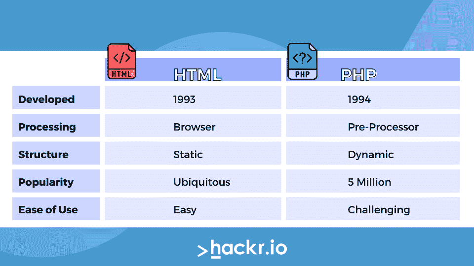

# PHP 与 HTML:有什么区别？

> 原文：<https://hackr.io/blog/php-vs-html>

如果你试图建立一个动态网站，你可能会直接被引导到 PHP 和 HTML。这两者都是基础技术——HTML/PHP 站点的一个很好的例子是 WordPress。但是它们也是非常不同的技术。

今天，我们来看看 HTML 和 PHP 之间的区别，以及它们是如何相互作用的。

## **什么是 HTML？**

HTML 是超文本标记语言的缩写。它是一种客户端标记语言。那是什么意思？这意味着它是一个代码序列，你的浏览器读取它来决定如何显示像文本和图像这样的东西。

HTML 是每个网站的基本构件。写“你好！”在网站上，你应该写下以下内容:

```
<b>Hello!</b>
```

这将显示在浏览器窗口中:

**您好！**

您也可以插入图像，如下所示:

```

```

最重要的是，浏览器可以看到上面的代码，并且知道不打印文本，

```

```

它必须拉文件*hello.jpg*并显示它。所以，HTML 只是一种告诉浏览器它必须显示什么的方式，以一种计算机可以理解的速记方式。

HTML 不是一种动态语言。例如，您不能使用 HTML 来显示某人的登录名和登录信息。你能做的就是用 HTML 显示静态网站。HTML 可以用 JavaScript 或 CSS 来增强，使之成为动态的或交互式的。否则，HTML 通常被称为“前端”开发——主要关注网站外观和感觉的开发。

## **什么是 PHP？**

PHP 是一种后端编程语言，代表 PHP 超文本处理器(递归首字母缩写)。PHP 是一种由服务器编译的[编程语言](https://hackr.io/blog/what-is-programming-language)。您编写的代码通过服务器，然后生成 HTML 代码。然后浏览器翻译 HTML 代码。

在 PHP 中，我们会写:

```
print("<b>Hello!</b>");
```

上面的代码调用了 PHP 的 print()函数。服务器会看到上面的代码，然后它会产生:

```
<b>Hello!</b>
```

这现在只是 HTML 代码，不是 PHP 代码。它在各个方面都与我们之前生成的 HTML 代码相同。然后，HTML 代码将被发送到浏览器，这将产生:

**您好！**

因此，PHP 在静态 HTML 代码之上提供了一个动态层。例如，我们可以这样写:

```
if($morning) {
print("<b>Good morning!</b>") ;
} else {
print("<b>Good night!</b>");
}
```

PHP 和 HTML 之间的区别可能很复杂，因为它们可以很好地协同工作。PHP 代码一般都是将 *集成到* HTML 页面中，所以你可能会看到很长的 HTML 字符串和很少的 PHP 代码或者很长的 PHP 字符串和很少的 HTML 代码。根据“$morning”变量是否返回 true，所提供的 HTML 会有所不同，但是浏览器甚至不会知道有不同的代码可用。浏览器得到的只会是“早上好”或“晚安”

使上述情况变得复杂的是，我们有时会提到“PHP HTML”事实上，PHP 的一个扩展是“. PHTML”。所以，这不是 PHP 与 HTML 或 PHP 或 HTML 的问题。如果你正在创建一个动态的网站，你通常会用到这两者。

## **PHP 和 HTML 有什么区别？**

PHP 是一种服务器端编程语言，而 HTML 是一种客户端标记语言。它们被用于完全不同的事情，但因为它们经常一起使用，人们可能会混淆两者。

WordPress 是用 PHP 设计的网络上最流行的应用程序之一。如果你懂 PHP，你可以钻研 WordPress 的代码(因为它是开源的)并改变应用程序的工作方式。

互联网上许多最受欢迎的网站都是用 PHP 和 HTML 开发的。

### **PHP 比 HTML 好吗？**

PHP 并不比 HTML 更好，因为它们是如此的不同。事实上，在很多方面，HTML 更通用。从留言板到社交媒体网站，HTML 几乎无处不在。但是 PHP 比 HTML 更健壮；它可以制作更复杂、动态设计的网站。

### **HTML 为什么用 PHP？**

由于解释器的工作方式，PHP 代码可以“放入”HTML。解释器将忽略任何 HTML 代码，只关注 PHP，将所有 HTML 发送到浏览器。一旦 PHP 处理完成，页面就只是 HTML 了。

可以把 PHP 看作是使 HTML 页面更加动态的一种方法。PHP 没有 HTML 就不能工作，尽管 HTML 没有 PHP 也能工作。

### **我需要先学 HTML 再学 PHP 吗？**

严格来说，你不需要在学习 PHP 之前先学习 HTML，但是它确实有帮助。你可以同时学习它，但如果你想学习 PHP，你最终需要学习 HTML。

## PHP 与 HTML:势均力敌的比较

****

### HTML 和 PHP:哪个更容易？

学习 PHP 可能需要更长的时间，因为 HTML 也必须学习。然而，许多人实际上发现学习 HTML 可能是一个很大的障碍，因为它通常是他们学习的第一门计算机语言。HTML 自首次发布以来也发生了重大变化，其标准更新相当频繁。

如今，HTML 开发已经与 CSS/JavaScript 开发密不可分。HTML 开发人员的薪水很高，但是一般认为他们也了解 CSS、Bootstrap 和其他各种技术。因此，完整的“HTML 生态系统”可能是一个挑战，即使 HTML 本身不是。

### HTML vs PHP:静态还是动态？

如果你正在构建一个静态网站(一个不必根据用户信息或用户行为而改变的网站)，那么你所需要的就是 HTML。如果你想微调和优化你的网站的外观，你可能还需要 CSS 或 JavaScript。

如果你正在构建一个动态网站(一个必须承认用户信息或用户行为的网站)，那么你需要 PHP 或另一种类似的服务器端编程语言。你也可以使用 JavaScript。

如果你需要连接一个数据库，比如一个 [MySQL 数据库](https://hackr.io/blog/mysql-create-database)，你将需要使用 PHP。所以，简而言之，如果你的网站*永远不需要改变*，那么 HTML 就足够了。

### **HTML vs PHP:职业选择有哪些？**

HTML 开发者通常会比 PHP 开发者赚得少，原因很简单；一个 PHP 开发人员需要理解 HTML，但反之则不然。也就是说，这两种技能都是就业市场非常需要的宝贵技能。一个全面掌握 CSS 和 JavaScript 知识的 HTML 开发人员可以比一个 PHP 开发人员赚得更多，但这些都是额外的(和广泛的)技能。

### HTML 和 PHP:它们是如何处理的？

任何人都可以编写 HTML 代码，将其另存为”。html“文件”，并在他们的浏览器中启动它。因为是客户端语言，所以一切都被浏览器过滤了。但是 PHP 稍微复杂一点。要用 PHP 编写[代码，你需要在你的电脑上安装一个服务器和 PHP，或者你需要一个安装了 PHP 的托管服务。](https://hackr.io/blog/what-is-php)

还应该注意的是，这意味着 PHP 和 HTML 可以根据用户的平台改变它们的结果。因为 PHP 生成 HTML，然后 HTML 由浏览器翻译，所以浏览器的标准将影响站点的外观和感觉。CSS 和 JavaScript 通常用于创建跨所有平台的通用体验。

## PHP 和 HTML 的替代品

HTML 是静态网站开发的行业标准，但 CSS 和 JavaScript 目前承担了大量繁重的工作。许多公司已经转向 jQuery、React 或 Bootstrap 开发；这些都使用 HTML，但是使用 CSS/JavaScript 组件。因此，尽管 HTML 的直接替代品很少(至少是那些非常受欢迎的)，但并不是每个人都只使用*HTML。*

Python 和 JavaScript 都是 PHP 的热门替代品(T2)。由于 PHP 本质上使用动态编程来*创建*静态 HTML，Python 和 JavaScript 可以用来做同样的事情。今天，许多开发人员使用 JavaScript 作为服务器端脚本语言，而不是使用 PHP。但这真的取决于你想学哪种语言，你想用它做什么。

如果你申请的是“HTML 开发人员”的职位，你应该更深入地了解这些要求。他们很可能希望你至少了解 HTML 和 CSS。如果你申请的是一个“PHP 开发人员”的职位，他们也可能希望你了解 JavaScript 和 CSS。如果你懂 HTML、PHP、JavaScript，你本质上就是一个全栈程序员。

## PHP 与 HTML:势均力敌的比较

| **参数** | **PHP** | **HTML** |
| **类型** | 服务器端脚本语言 | 客户端标记语言 |
| **由**开发 | 拉斯马斯·勒德尔夫 | 蒂姆·伯纳斯·李 |
| **最新版本** | PHP 7.4 | HTML5 |
| **主要用途** | 动态网站和网络应用 | 网页 |
| **打字专业** | 动态的 | 静态 |
| **学习曲线** | 陡峭的 | 低的 |
| **文件扩展名** | 。服务器端编程语言（Professional Hypertext Preprocessor 的缩写） | 。超文本标记语言 |
| **替代品** | Python 和 JavaScript | 没有直接的选择 |
| **支持数据操作** | 是 | 不 |
| **代码执行** | 在服务器上 | 在浏览器中 |

## **结论**

PHP 和 HTML 的区别很简单。HTML 是一种客户端标记语言，控制页面的外观和感觉。PHP 是一种服务器端编程语言，它控制发送到浏览器的 HTML、JavaScript 和 CSS。

一个前端开发人员可能只懂 HTML，CSS，JavaScript。但是后端开发人员需要既懂 PHP 又懂 HTML 才能用 PHP 编码。

要开始学习 HTML 和 PHP，可以从 HTML 的一个类开始。从那里，你可以从[PHP 入门课程](https://hackr.io/tutorials/learn-php)开始。使用 IDE，在你的机器上安装 PHP，练习用 HTML 和 PHP 一起开发。如果你想用你的新技能来建立自己的网站，我们推荐你使用 name cheap[购买你的域名](https://www.namecheap.com/?clickID=wUoTbQ3KtxyNR9L3K50RiSEKUkAx6n2NkXBZwI0&irgwc=1&utm_source=IR&utm_medium=Affiliate&utm_campaign=2890636&affnetwork=ir&ref=ir)和[虚拟主机服务](https://www.namecheap.com/hosting/shared/?clickID=wUoTbQ3KtxyNR9L3K50RiSEKUkAx6E09kXBZwI0&irgwc=1&utm_source=IR&utm_medium=Affiliate&utm_campaign=2890636&affnetwork=ir&ref=ir)。它们是业内最好的，而且超级实惠。

#### 初学 PHP？参加这个课程！

[PHP 初学者——成为 PHP 高手](https://click.linksynergy.com/deeplink?id=jU79Zysihs4&mid=39197&murl=https://www.udemy.com/php-for-complete-beginners-includes-msql-object-oriented/)

**人也在读:**