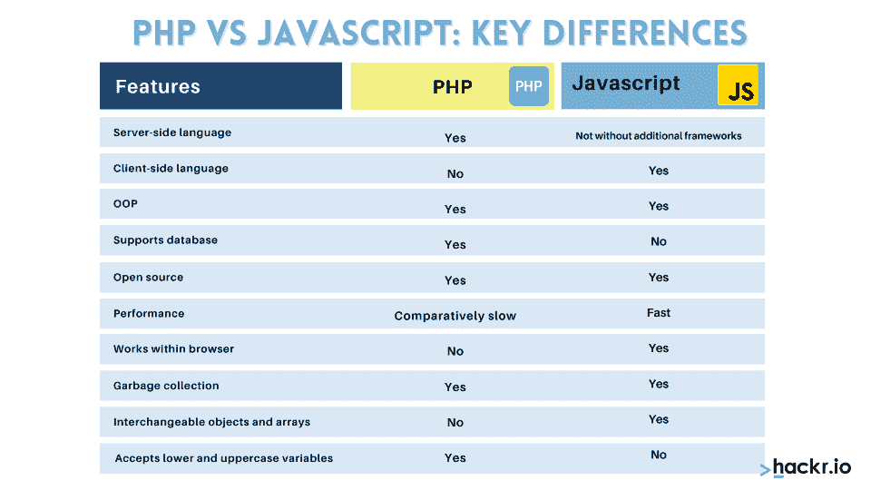
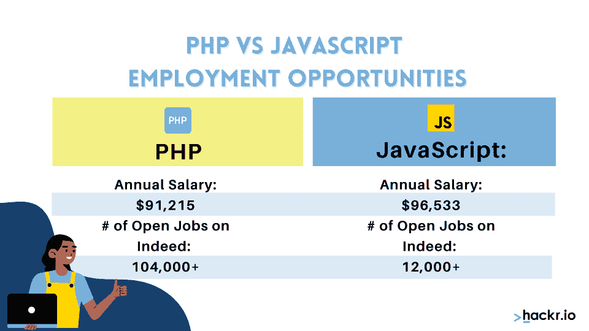

# 2023 年的 PHP 与 Javascript:比较、特性与应用

> 原文：<https://hackr.io/blog/php-vs-javascript>

如果你对为 web 编写代码感兴趣，至少在一开始，你需要在成为客户端开发者还是服务器端开发者之间做出选择。换句话说，您将不得不在前端和后端开发之间做出选择。虽然有许多编程语言可以实现这两个目的，但在这里我们将讨论选择 PHP 还是 JavaScript——或者两者都选。

许多流行的网站，如脸书、维基百科、Flickr 和雅虎，都是用 JavaScript 和 PHP 构建的。即使是最流行的网页设计工具， [WordPress](https://en.wikipedia.org/wiki/WordPress) ，也是使用 PHP 和 JavaScript 构建的。

JavaScript 和 PHP 都是适合 web 开发的通用脚本语言。但是，JavaScript 是客户端脚本语言，PHP 是服务器端脚本语言。这两种语言可以独立使用，也可以协作使用，它们结合起来可以创造奇迹。

这篇文章将帮助你更好地理解这两种语言，包括帮助你决定学习哪一种语言以及它们的特性。

## **PHP 与 JavaScript:主要区别**



## **什么是 PHP？**

PHP:超文本预处理器，简称 PHP，是一种广泛使用的开源通用脚本语言，特别适合服务器端 web 开发。PHP 用于创建动态的交互式网站。

PHP 代码嵌入在 HTML 代码中，它有特殊的[开始和结束处理指令](https://www.php.net/manual/en/language.basic-syntax.phpmode.php)。这允许您在“PHP 模式”中跳来跳去

PHP 不同于客户端 JavaScript，因为代码是在服务器上执行的，生成的 HTML 会发送到客户端。客户机(在本例中是浏览器)接收运行该脚本的结果——但是底层代码是隐藏的。PHP 程序可以收集表单数据，生成动态页面内容，或者发送和接收 cookies。你也可以为桌面应用程序编写 PHP 脚本。

PHP 运行在几乎所有的主流操作系统上，比如微软的 Windows、macOS、RISC OS、Linux 和 UNIX 变种，以及 Web 服务器，比如 Apache 和 IIS。

如果你想开发一个成熟的网站并托管它，那么 PHP 可能是你的首选。PHP 代码很简单，而且是免费的，你的代码可以在任何平台上运行。它有大量的标准库，因此应用程序开发速度很快。一些流行的 PHP 框架有 [Laravel](https://hackr.io/tutorials/learn-laravel) ，Symfony，Zend 和 CodeIgnitor。

示例 PHP 代码:

```
<!DOCTYPE html>
<html>
<head>
<title>Example</title>
</head>
<body>
<?php
echo"Hi, I'm a PHP script!";
?>
</body>
</html>
```

## **JavaScript 是什么？**

[https://www.youtube.com/embed/W6NZfCO5SIk](https://www.youtube.com/embed/W6NZfCO5SIk)

视频

JavaScript 是世界上最流行、使用最广泛的脚本语言之一。网飞、沃尔玛和贝宝等巨头已经用 JavaScript 构建了他们的互联网应用程序。它最初用于构建交互式网页，但今天您可以构建 web 和移动应用程序、实时应用程序和游戏。JavaScript 符合规范标准 [ECMAScript](https://hackr.io/tutorials/learn-ecmascript-es?ref=blog-post)

作为一种客户端编程语言，它运行在浏览器上。每个浏览器都有一个 JavaScript 引擎来执行代码——火狐浏览器的 SpiderMonkey 是，Chrome 的 V8 是。

分析报告称，JavaScript 目前被超过 94%的网站使用。还可以使用 Node.js 这样的跨平台运行时引擎，用 JavaScript 编写服务器端代码。通过结合 JavaScript、HTML5 和 CSS3，您还可以创建跨各种浏览器、平台和设备运行良好的网页。

网络市场上有很多 JavaScript 框架,如 AngularJS、ReactJS、NodeJS 等。通过使用这些框架，基于 JavaScript 的网站和应用程序的开发时间和工作量显著减少。JavaScript 允许程序员轻松构建大型 web 应用程序。

下面是一个 JavaScript 代码示例:

```
<html>
<body>
<scripttype="text/javascript">
document.write("JavaScript is the most popular language");
</script>
</body>
</html>
```

JavaScript **是最流行的语言**

### 推荐的 JavaScript 课程

【JavaScript 全教程 2023:从零到专家！

[创意编码:用 JavaScript 制作视觉效果](https://domestika.sjv.io/c/2890636/1558123/17608?u=https%3A%2F%2Fwww.domestika.org%2Fen%2Fcourses%2F2729-creative-coding-making-visuals-with-javascript&partnerpropertyid=2722169)

## PHP 和 JavaScript 哪个更好？

[https://www.youtube.com/embed/pWG7ajC_OVo](https://www.youtube.com/embed/pWG7ajC_OVo)

视频

这取决于你打算走什么样的职业道路(尽管在这个问题上有一些灵活性。)PHP 是一种后端语言，所以您将负责服务器端的工作。JavaScript 是一种前端语言，所以您将主要负责客户端的工作。

然而，这里有一些回旋的余地。PHP 可以用来为桌面应用程序编写脚本，并且可以将其代码嵌入到 HTML 代码中。同样，JavaScript 可以通过 Node.js 用于后端开发。



就薪水而言，JavaScript 略微领先。JavaScript 开发人员在美国的平均工资为 96533 美元，相比之下，PHP 在 T2 的平均工资为 91215 美元。

就就业机会而言，JavaScript 是最受欢迎的编程语言，近十年来一直如此。在[上的快速工作搜索显示(在撰写本文时)JavaScript 开发人员有 104，000 多个空缺职位，而 PHP 开发人员有 12，000 多个空缺职位。](https://www.indeed.com/)

因此，就就业和薪酬而言，JavaScript 可能被认为是更好的编程语言，尽管两者都非常有利可图。

## **PHP 比 JavaScript 简单吗？**

这有点像苹果和橘子的比较，因为这两种语言被用来处理不同的问题。

一般来说，学习者和专业人士认为 PHP 更容易上手，但是如果你打算努力学习一门新的语言(尤其是如果你是第一次)，那么 JavaScript 是最好的选择。难度上的差别微乎其微，而且如前所述，工资待遇和就业机会都好一点。

## **需要学习 PHP 还是 JavaScript？**

简单的答案是，如果你选择先学习哪种编程语言，选择 JavaScript。您可以相当快地构建功能性应用程序，而且就业机会非常多。

你可以在以后学习 PHP，事实上，一旦你掌握了 JavaScript，它会变得更容易。

## **我应该先学 PHP 再学 JavaScript 吗？**

你可以先学习这两种语言中的任何一种，但最好是先学习 JavaScript 再学习 PHP，这样你更容易找到机会。之后你可以[学习 PHP](https://hackr.io/tutorials/learn-php) ，这应该足够简单了。除此之外，没有明确的理由说明为什么你应该先学一门，再学另一门。

## JavaScript 能做什么 PHP 做不到的事？

PHP 和 JavaScript 在这方面的区别并没有一个非常简单的答案，因为它们都可以做很多事情，都支持很多特性。最好认为这两种语言在某些方面都比另一种语言做得好。互斥功能本质上更具技术性，所以现在，只要把这个想法放在一边，知道你可以用两者做很多事情。

## **PHP vs JavaScript:特性**

有必要了解 PHP 和 JavaScript 在特性方面的区别。下一节描述了这些差异。

### **1。语言类型**

PHP 和 JavaScript 都是脚本语言。然而，PHP 代码是在服务器上执行的，结果是作为对浏览器的响应返回的纯 HTML 代码，这使得 PHP 成为一种服务器端语言。作为一种客户端语言，JavaScript 代码是在浏览器而不是服务器上执行的。

在 Node.js 开发出来之前，JavaScript 只能在浏览器上运行。Node.js 是一个开源的、跨平台的 JavaScript 运行时环境，它在浏览器之外执行 JavaScript 代码。它的开发者使用 JavaScript for [服务器端脚本](https://en.wikipedia.org/wiki/Server-side_scripting)在页面被发送到用户的网络浏览器之前产生动态网页内容。使用 Node.js，在客户端和服务器端不需要两种不同的语言。

### **2。开源**

PHP 是开源的，由大型社区开发和维护，有很好的支持基础。因为是免费的，所以开始使用它所需要的只是一个 PHP 解析器、一个 web 服务器(比如 Apache)和一个像 Google Chrome 这样的 web 浏览器。JavaScript 是 ECMAScript 的实现，ECMAScript 是一个开放标准，但不是开源的。JavaScript 下载是免费的。

### **3。学习难度**

JavaScript 不是 HTML 或 CSS 那样的标记语言，而是一种编程语言。因此，如果你有编程经验，学习 JavaScript 会更容易。同样，PHP 也被认为是一种简单易学的[编程语言](https://hackr.io/blog/what-is-programming-language)。JavaScript 和 PHP 都有大量的在线教程和资源。

两者都是解释型语言，这意味着您可以对代码进行更改并再次运行它来查看效果，而不必重新编译代码。

### **4。并发性**

JavaScript 是一种异步单线程编程语言，与 PHP 的多线程异步语言相反。您可以使用 Ajax 和 JavaScript 来引入异步功能。Ajax 是异步 JavaScript 和 XML，在客户端作为一组相关的 web 开发技术使用，以创建异步 web 应用程序。

### **5。平台无关**

JavaScript 和 PHP 都是平台无关的。PHP 可以在所有主流操作系统上运行，比如 Linux、Windows、Mac 和 Solaris，也可以在 web 服务器上运行，比如 Apache、IIS 和 Lighttpd。JavaScript 可以在任何现代浏览器上运行，比如 Google Chrome、Mozilla Firefox 和 Safari。

### **6。安全性**

PHP 比 JavaScript 更安全，因为代码本身在浏览器中是不可见的。JavaScript 代码相对来说更容易受到攻击。您可以通过使用安全分析器工具并遵循最佳开发实践(如使用 SSL/HTTPS)来保护您的 JavaScript 代码。

### **7。数据库访问**

使用 PHP 之类的服务器端语言访问数据库很容易。但是 JavaScript 作为前端语言，需要一个直接访问数据库的环境。随着 Node.js 的引入，JavaScript 获得了执行以前仅限于服务器端语言的任务的能力。

## PHP 与 JavaScript:势均力敌的比较

| **参数** | **PHP** | **JavaScript** |
| **由**开发 | 拉斯马斯·勒德尔夫 | 布伦丹·艾希 |
| **脚本语言** | 服务器端 | 客户端 |
| **并发** | 多线程 | 单线程的 |
| **文件扩展名** | 。服务器端编程语言（Professional Hypertext Preprocessor 的缩写） | 。射流研究… |
| **平台** | Mac、Solaris、Linux 和 Windows | 谷歌浏览器、Safari 浏览器和 Mozilla Firefox 浏览器 |
| **安全** | 高度安全 | 不安全 |
| **数据库访问** | 是 | 不是直接的。需要一个环境，比如 NodeJS。 |
| **用例** | 动态网页、发送和接收烹饪、收集表单数据、发送电子邮件和创建会话 | 动态网站、移动应用程序、实时应用程序和游戏 |
| **框架** | Laravel，Symfony 和 CakePHP | Angular、React、Vue.js 和 Meteor |

## **应该学 PHP 还是 JavaScript？**

这就是我们对 PHP 和 JavaScript 的分析。主要的一点是，根据您的应用程序开发需求，您可以使用它们中的任何一个，或者两者协同使用。

JavaScript 是全球大约 1000 万开发者使用的最流行的编程语言。因此，你会发现大量学习 JavaScript 的资源和大量就业机会。还有几个 [Javascript 框架](https://hackr.io/blog/best-javascript-frameworks)和库可供选择。

PHP 仍然被许多公司使用，是一种容易掌握的语言。然而，正如我们反复指出的，如果 JavaScript 是你的第一种编程语言，你最好还是用它。如果你还想学的话， [PHP 认证](https://hackr.io/blog/best-php-certification)会派上用场。

无论你选择哪个，祝你好运！

**人也在读:**