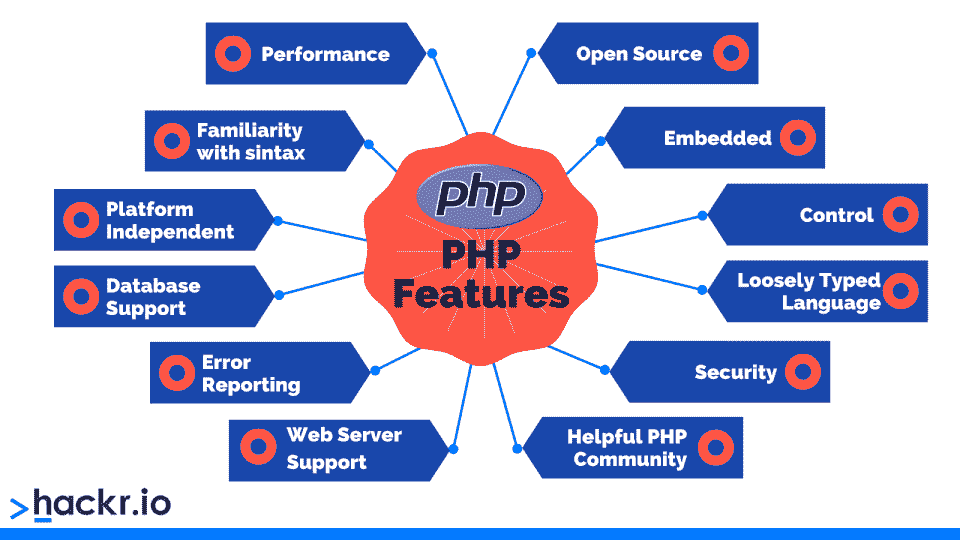
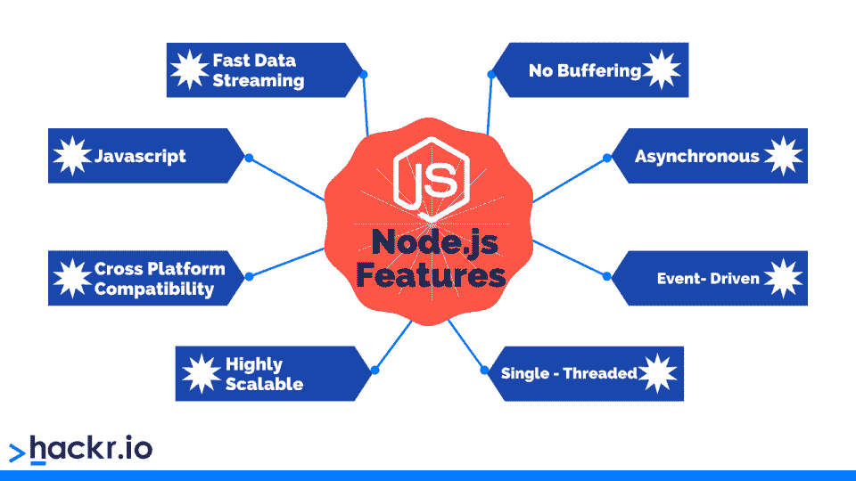

# node . js vs PHP:2023 年你该选哪个[更新]

> 原文：<https://hackr.io/blog/php-vs-node-js>

PHP 和 Node.js 是使用最广泛的两种服务器端技术。两位领导有不少不同之处，这也是我们希望在这里说明的。如果你想研究这两者中的任何一个，这篇文章会让你对它们有一个很好的了解。

如果您正在考虑从事后端开发，Node.js 与 PHP 的争论可能与您有关。在我们继续讨论这两者之间的区别之前，让我们先简单看一下这两种技术。

## **Node.js vs PHP:势均力敌的比较**

| **参数** | **PHP** | **节点 j** |
| **性质** | 服务器端脚本语言 | JavaScript 的运行时环境 |
| **由**开发 | 拉斯马斯·勒德尔夫 | OpenJS 基金会 |
| **访问命令行** | $ php -i | $ node |
| **代码类型** | 同步的 | 异步的 |
| **应用领域** | 客户端和服务器端之间没有频繁的交互 | 客户端和服务器端之间的持续交互。 |
| **速度** | 比 NodeJS 慢 | 快的 |
| **数据库首选项** | SQL 数据库的关系 | SQL 和 NoSQL |
| **开发堆栈** | LAMP (Linux、Apache HTTP Server、MySQL 和 PHP) | MEAN (MongoDB、Express.js、AngularJS 和 Node.js)或 MERN (MongoDB、Express.js、React 和 Node.js) |
| **框架** | Laravel、CodeIgniter 和 Cakephp | 德比、快车和流星 |
| **模块** | 需要下载并安装 | 预先包装 |

## **什么是 PHP？**

PHP 由拉斯马斯·勒德尔夫创建，于 1995 年首次亮相，最初代表个人主页。现在 [PHP](https://hackr.io/tutorials/learn-php?ref=hackr-blogpost) 指的是[超文本预处理器](https://www.php.net/manual/en/intro-whatis.php):一种开源的、专门用于 web 开发的服务器端脚本语言。

与其他流行的编程语言不同，PHP 直到 2014 年都没有一个书面的正式规范。在那之前，编程语言的最初实现充当了事实上的标准。

虽然 PHP 是一种服务器端脚本语言，但它也可以用于其他目的。php 脚本的扩展名为. PHP，包含 CSS、HTML、JavaScript 和纯文本的组合。

**PHP 依然是** [**找工作的顶级编程语言之一**](https://hackr.io/blog/which-programming-language-is-best-for-getting-a-job) **。**

它也被互联网上一些最大的网站和公司使用，包括脸书、Flickr、维基百科、雅虎和 Tumblr。

| **优点** | **缺点** |
| 有大量的框架集合 | 不适合大型应用 |
| 用 PHP 编写的页面加载速度很快 | 性能通常比 Node.js 慢 |
| 在数据库和系统方面非常灵活 | 错误处理可能是一个问题 |
| 非常稳定 | 失去其受欢迎程度 |

## 

## **node . js 是什么？**

Node.js 由 Ryan Dahl 开发，于 2009 年 5 月推出。随着 [Node.js](https://hackr.io/tutorials/learn-node-js?ref=Hackr-Blogpost) 的引入，您可以创建在 web 浏览器环境之外运行的纯 js 应用程序。

Node.js 是一个开源的服务器端 JavaScript 运行时环境，构建在 Chrome V8 JavaScript 引擎之上。它遵循具有非阻塞 I/O 设计的事件驱动架构，这使得它适合于开发快速且高度可伸缩的应用程序。

这些文件使用。js 文件扩展名，包含纯 JavaScript 代码。使用 Node.js 的公司包括 GoDaddy、IBM、LinkedIn、网飞、PayPal 和沃尔玛。

| **优点** | **缺点** |
| 适用于实时应用 | 不适合 CPU 繁重的任务 |
| 易于扩展 | 不适合可扩展性 |
| 异步且更快 | 嵌套回调可能是一个问题 |
| 可以快速构建应用程序 | 异步编程会使代码维护变得困难 |

## PHP vs Node.js:它们有什么不同？

我们将通过关注几个不同的标准来检查 PHP 和 Node.js 之间的差异。这应该让您对这两种服务器端技术有一个全面的了解。

### **应用程序**

就应用程序而言，对于客户端和服务器端之间没有频繁交互的应用程序，PHP 优于 Node.js。另一方面，Node.js 更适合需要持续的客户端-服务器交互的应用程序。

PHP 使用的最佳应用场景是在 API 开发、内容管理系统(Drupal 和 WordPress 都使用 PHP)中使用 LAMP stack 的应用，以及开发 CPU 密集型应用，如气象应用和科学应用。

Node.js 广泛用于创建单页应用程序，包括个人网站和简历文件夹；开发高可伸缩的服务器端应用(主要得益于 Node.js 的非阻塞 I/O 和事件驱动模型)；以及实时应用，例如聊天应用和视频流应用。

### **速度和性能**

有两种类型的编程代码:

*   **同步:**代码逐行执行。只有在前一行代码执行完毕后，才会执行下一行同步代码。
*   **异步:**整个代码同时执行。

PHP 大部分是同步的，除了一些 API 以异步方式运行。如果同步代码的前一行有一个函数需要时间来执行，那么剩下的代码必须等待。因此，这增加了总的执行时间。

Node.js 代码是异步的。这意味着 JS 引擎一次运行整个代码，不需要等待函数成功完成执行。因此，与 PHP 相比，Node.js 非常快。

然而，异步代码有一个问题。如果有很多函数需要链接，程序可能会陷入回调地狱。它需要将数据从一个函数传输到另一个函数。尽管如此，Node.js 有一个解决这个问题的方法。Node.js 的 async/await 特性使代码块能够像同步代码一样执行。

### **数据库**

PHP 通常与传统或关系数据库一起使用，如 MariaDB、MySQL 和 PostgreSQL。虽然有办法在 PHP 中使用 NoSQL 数据库，但这并不常见。

Node.js 适用于 SQL 数据库，但它正趋向于 NoSQL 数据库，如 CouchDB 和 MongoDB。

SQL 数据库系统，尤其是 MySQL，容易受到 SQL 注入、跨站点脚本和其他攻击。尽管 NoSQL 注入攻击是基于 NoSQL 的数据库的注册漏洞，但这种可能性比 SQL 数据库要小。

这是因为 NoSQL 的数据库设计理念能够抵御这种攻击。事实上它们是最近才出现的。

### **开发堆栈**

不同环境和编程语言之间的切换导致效率低下。有时候，这真的很令人沮丧。

在用 PHP 编写后端代码时，开发人员必须经常在不同的编程语言之间切换。这是因为 PHP 通常被用作 LAMP (Linux、Apache HTTP Server、MySQL 和 PHP)堆栈的一部分。

另一方面，Node.js 通常使用 MEAN ( [MongoDB](https://hackr.io/blog/what-is-mongodb-applications-advantages-examples) ，Express.js，AngularJS 和 Node.js)或 MERN (MongoDB，Express.js，React 和 Node.js)堆栈。使用整个堆栈所需的唯一编程语言知识是 JavaScript。

### **框架**

Node.js 提供了各种各样的框架。Derby、Express 和 Meteor 是 Node.js 开发项目中使用的一些最流行的框架。此外，Node.js 的新框架不时出现。

有各种各样的 [PHP 框架](https://hackr.io/blog/best-php-frameworks)可用于简化和加速 web 开发。这些框架有助于构建敏捷、健壮和安全的 web 应用程序。

### **模块**

PHP 利用了模块安装技术，最显著的是:

*   ***梨*** **:** 一个可复用 PHP 组件的框架和分发系统。
*   ***作曲*****:**PHP 中的依赖管理工具。这允许开发人员声明和管理依赖于项目的库。

Node.js 预打包了 NPM 包管理系统及其注册表。它比 PHP 模块更容易使用和发布。

与 Node.js 不同，PHP 不与模块捆绑在一起。开发人员需要手动下载并安装它们。

### **请求处理**

请求处理决定了该技术处理客户端请求的能力。PHP 和 Node.js 在这方面的功能不同。

PHP 一次处理一个请求，这可能相对较慢。也消耗了大量的计算资源。从好的方面来看，它可以准确地处理请求。

Node.js 一次处理多个请求，整体上消耗的计算资源更少。但是，如果在一个请求中有一个未解决的错误，它会导致整体的不准确性。

### **网络服务器设置**

5.4 之前的 PHP 版本需要下载并设置 LAMP 和 XAMPP 服务器。然而，请注意，PHP 与内置的开发服务器捆绑在一起。

Node.js 预打包了核心模块，包括文件系统、HTTP 和 DNS。这些有助于定制 web 服务器的开发。

Express.js、Koa.js 和 Sails.js 是一些最流行的用于运行 web 服务器的 Node.js 框架。每一个都可以用最多 4 行代码来设置。

## **Node.js 和 PHP:哪个好？**

这就完成了我们对 PHP 和 Node.js 的比较。正如您所看到的，两种后端技术都有各自不同的优点和缺点。在它们之间做出选择很大程度上取决于项目需求。

**简而言之:**

*   选择 **Node.js** 用于包含大量客户端-服务器交互的网站。
*   对于服务器交互较少的网站，和/或当数据库连接是优先考虑的时候，选择 PHP。

如果你想学习任何一门课程，考虑一下你想开发什么样的应用程序，以及你想走什么样的职业道路。这会帮助你决定先学哪个。

## **常见问题解答**

#### **1。Node.js 比 PHP 好吗？**

不一定。Node.js 和 PHP 各有利弊，上面已经解释过了。你会在不同的应用中发现两者的用途。

#### **2。Node.js 比 PHP 简单吗？**

Node.js 和 PHP 都很好学。如果你在这两者之间做决定，考虑一下你想要构建什么样的应用程序，然后做出相应的选择。

#### **3。PHP 比 Node.js 慢吗？**

是的，Node.js 一般比 PHP 快。然而，更重要的是为您正在构建的应用程序使用正确的技术。

#### **4。什么时候推荐使用 Node.js？**

Node.js 最适用于游戏、聊天室和协作工具等实时应用。当有大量请求进来时，它做得很好。不要将 Node.js 用于 CPU 密集型应用程序。

**人也在读:**