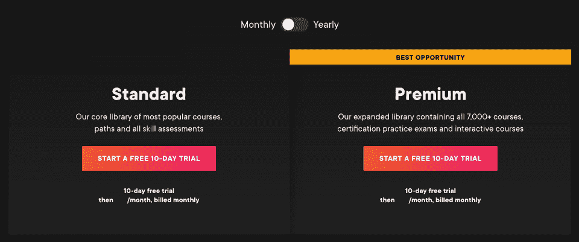

# Pluralsight 评论:这个专注于技术的平台适合你吗？

> 原文：<https://hackr.io/blog/pluralsight-review>

Pluralsight 是一个电子学习平台，更侧重于技术相关的主题。虽然许多企业使用该平台来提升他们的劳动力技能，但对于那些希望学习新技能来改善职业生涯的个人来说，Pluralsight 也是一个很好的选择。该平台的学生从内部制作的高质量课程中学习。

| 教练 | 4.75/5 |
| 课程 | 5/5 |
| 经验 | 4.5/5 |
| 总数 | 4.75/5 |

**一览:**

*   Pluralsight 是一个平台，拥有超过 7，000 门关于技术领域各种主题的课程。
*   对于第一次尝试该平台的学习者，有一些免费课程可供选择(还有五门免费课程，每个月都有变化)。
*   该平台服务于希望学习和提升技能的个人和企业。
*   个人可以负担得起付费计划，起价为每月 29 美元。
*   Pluralsight 提供无与伦比的可访问性，有超过 50 种语言的隐藏式字幕和完整文本。

**那么，Pluralsight 值得吗？**

这份全面综合的 **Pluralsight 评论**将讨论您需要了解的一切，以确定该平台是否适合您。Pluralsight 到底有多好？复数视线是做什么的？请继续阅读，寻找答案！

## **什么是复数视线？**

如果你在这里，你可能会想:复数视线是做什么的？

嗯， [Pluralsight](https://www.pluralsight.com/) 是一个在线学习平台。它于 2004 年成立，当时是一家派遣教师帮助培训企业的公司，但在 2007 年，它转向了在线视频课程。Pluralsight 的课程侧重于技术相关的主题，有十个类别可供选择。

Pluralsight 是一个独特的平台，其功能包括但不限于:

*   移动应用程序(iOS 和 Android)
*   离线模式可用性
*   每门课程的课程讨论
*   实践练习和项目(针对高级计划订户)
*   完工证书
*   测验和测试
*   技能智商和角色智商
*   50 多种语言的完整课程成绩单和隐藏式字幕

Pluralsight 的扩展库中有超过 7000 门课程，这些课程分为新手、熟手和专家三个级别。学生可以选择单独的课程或路径。路径将工具和课程结合到一个单一的引导式体验中，可以从头到尾教授学生特定的技能。

### 多重视野合法吗？

总部设在犹他州，Pluralsight 是 100%合法的。该平台始于 2004 年，是一家帮助企业开展面对面培训活动的培训公司。2007 年，Pluralsight 转向提供在线培训，重点是提供技术相关主题的视频课程。

### 多视是否得到认可和认证？

Pluralsight 不是一个被认可的机构。然而，由于课程质量高，雇主认可该平台的许多证书。

如果你更愿意从一个提供认证的平台学习，你可以试试 Coursera。

点击这里查看我们的评论。

### 谁应该使用复数形式？

Pluralsight 是一个完美的平台，适合任何想要学习新技术相关技能和知识的人。这里欢迎寻求提高劳动力技能的个人和企业。

Pluralsight 为新手、中级和高级学习者提供了内容，因此这里有适合每个人的内容。然而，值得一提的是，许多过去的订阅者表示，这些内容(甚至是针对初学者的内容)更多地是针对已经有一些经验和知识的学习者。

如果你想获得专业认证(ITIL、CompTIA、PMP 等)，并且想要一些有指导的准备和一些实践考试，Pluralsight 是你的绝佳选择。如果您已经获得认证，那么有必要知道 Pluralsight 的认证可以计入 CEU(继续教育单位)的学分。

## 多视是如何工作的？

Pluralsight 是一个在线学习平台，在这里你可以学习与技术相关的技能。该平台以视频格式提供课程(视频由内部制作以保证质量)。注册该平台非常容易，尽管如果你想开始 10 天(或 200 分钟)的免费试用，你需要一种方便的支付方式。

一旦你在平台上注册，你就可以访问这些课程。您获得的访问级别取决于您选择的订阅。请注意，如果您想下载您的课程和课程材料，您需要成为付费订户。

如果您希望能够访问项目、专业认证实践考试和交互式课程，您将需要高级订阅。

### **如何开立多见账户**

开始使用 Pluralsight 简单直观。按照以下步骤创建您的帐户:

*   选择您想免费试用十天(或 200 分钟)的计划。选择是按月付费还是按年付费(*免费)。*

*   填写您的帐户详细信息。
*   Pluralsight 会要求您输入付款方式的详细信息。别担心，在免费试用结束之前，不会向您收费。如果您不想继续您的计划，请不要忘记取消，否则您的*将被*收费。 **Pluralsight 不提供退款**。
*   查看您的详细信息并确认您的帐户。

## **多见的利弊**

出于学习目的，你应该选择复数形式吗？这些利弊可能对你的决定有所帮助:

| **优点** | **缺点** |
| 提供 7000 多门高质量的技术相关课程，每个月还会增加更多

*   移动/桌面应用
*   离线观看(仅付费会员可下载)
*   帮助学生记住信息的测验
*   所有课程的隐藏式字幕和 50 多种语言的完整文本
*   由经过审查的专家撰写的课程
*   竣工证明
*   授权继续教育提供商，这意味着许多证书作为 CEU/CPU 学分有效
*   良好的客户支持
*   免费试用(尽管相对较短)
*   个人相对负担得起的订阅费率
*   不退款

 | 没有终身学习课程的机会

*   订阅定价模型
*   初学者课程可能对初学者更友好
*   课程仅与技术相关
*   多视课程多少钱？
*   以下是您需要了解的每月 Pluralsight 费用:

 |

## **个人计划**

**计划**

| **按月支付** |
| **每年支付** | 标准 | $29 |
| 299 美元(每月 24.92 美元) | 溢价 | $45 |
| 449 美元(每月 37.42 美元) | Pluralsight 提供为期十天或 200 分钟的免费试用。当您达到其中一个限制时，免费试用期结束。 | **团队计划** |

**计划(最少 2 个用户)**

| **每年支付** |
| 启动器 | 每位用户每年 399 美元(每月 33.25 美元) |
| 专业的 | 每位用户每年 579 美元(每月 48.25 美元) |
| 企业 | 每位用户每年 779 美元(每月 64.92 美元) |
| Pluralsight 为其专业计划提供十人团队试用，并为其企业计划提供请求试用。 | Pluralsight 提供免费课程吗？ |

是的—您可以使用免费的 Pluralsight 帐户访问数量有限的免费课程。此外，该平台还提供[五门免费课程](https://pluralsight.pxf.io/Ea1JG9)，每月都有变化。

### Pluralsight 上有哪些课程？

Pluralsight 的课程都围绕着技术相关的话题。您当然也可以找到[编码](https://hackr.io/blog/coding-for-beginners)内容，但是它们将特定于以下十个类别之一:

## 软件开发

[机器学习](https://hackr.io/blog/how-to-learn-machine-learning)/人工智能

*   云计算
*   IT 运营
*   商务专业人士
*   建筑和施工
*   数据专家
*   信息和[网络安全](https://hackr.io/blog/best-cybersecurity-certification)
*   创意专业人士
*   制造和设计
*   你也可以通过路径学习，这可能是三到十五个课程的长度(有些路径甚至更多)。路径结合了各种课程，为您提供学习特定技能的线性课程。
*   **如何找到最好的多元化课程**

以下是找到最适合你的 Pluralsight 课程的方法:

## 使用平台的**搜索功能**并利用**搜索过滤器**。

报名参加为期十天(200 分钟)**的免费试用，**可以查看所有课程并进行技能评估。

*   注册一个**免费账户**来访问 50 多门课程、指南和评估。你也可以使用角色智商和技能智商功能。
*   查看**免费月度课程**。每个月有五个。
*   查看一门课程的投稿作者，确定他们的资质以及你为什么想向他们学习。
*   查看 Pluralsight **资源中心**。

*   确定哪些课程适合你的最好方法之一是使用技能智商和角色智商功能。

*   **技能智商**需要十分钟才能完成。这是一份有 20 个项目的问卷，旨在帮助确定你在某项技能上的熟练程度。完成后，你会得到 0 到 300 分的评分，你的技能水平分为三个等级——新手(1)、熟练(2)或专家(3)。

**角色智商**类似于技能智商，只是它衡量的是你对与你所选角色相关的技能的熟练程度。一旦完成，你也将被分为 1 级、2 级或 3 级。从这里，你可以更好地了解你的弱点，以通知你的学习重点。

*   技能智商和角色智商非常有助于你决定要走的道路。

*   **最佳多元视觉节目**

Pluralsight 上有成千上万的高质量课程，但我们在下面列出了一些最好和最受欢迎的课程。

## **路径**

**Java 语言基础**是一个结合了 21 门课程和超过 50 个小时的视频材料的极好途径。这条路径带领学生学习 Java 语法、Java 基础知识、Java 集合等等。不需要以前的经验。

### **虚拟化基础知识**是一条结合了五门课程、总共六个小时学习时间的道路。该路径向学生展示了为什么虚拟化对公司是必要的，如何虚拟化服务器，如何测试和部署服务器虚拟化，等等。

*   **Google Cloud 认证云工程师助理**是一条结合了六门课程共 17 个小时学习的道路。在这里，学生学习计算引擎、谷歌应用引擎、数据存储服务等。这条道路的学生必须有以前的知识和至少六个月的谷歌云工作经验。

*   **课程**

*   创建具有 Angular JS、Node 和 Token 身份验证的应用程序是一门中级课程，它将带领学生通过实践/动手体验来学习如何允许应用程序用户通过谷歌、脸书、Twitter 和其他第三方身份验证提供商来验证他们的帐户。

### F **云计算基础知识**是一门新手友好的课程，教授学生不同类型的云计算，为什么它们是有用的，为什么它们如此强大。这是一个只有两个小时的短期课程。

*   **云计算:大图**是一个长达一小时的课程，即使初学者也可以参加。它很好地介绍了你需要了解的关于云计算的一切。

*   **我们的多视角回顾:总结**
*   想要总结我们的 Pluralsight 评论吗？基于不同的标准，我们认为:

## 用户友好度:5/5 -许多 Pluralsight 评论者发现在这个平台上学习非常简单和直观。用户界面简洁、时尚、干净，高对比度的颜色让用户更容易专注于重要的内容。

**便利性:4/5** -开始使用 Pluralsight 非常简单，唯一的警告是，你需要一个信用卡、借记卡或 PayPal 帐户来开始为期 10 天的免费试用。除非你是付费会员，否则不能下载课程和学习材料。

*   **可访问性:5/5** - Pluralsight 可用于各种平台，包括移动(Android 和 iOS)和桌面(或笔记本电脑)。然而，Pluralsight 最好的一点是，该平台为每一门课程提供了隐藏字幕和完整的文字记录。不仅如此，字幕和文字记录可以在 [50 多种语言](https://pluralsight.pxf.io/GjJG2n)中找到。

*   **负担能力:5/5** -相比其他学习平台，Pluralsight 相当实惠。它的月订阅费从每月 29 美元开始，更多的人有机会学习，并有可能进一步发展他们的职业生涯。

*   **认证:4.5/5**——完成课程的付费学生可以获得结业证书。尽管这些证书未经认证(不能用于大学学分)，但它们通常被认可，尤其是作为 PMI、CompTIA(ISC)2 和 ISACA 的继续教育单元(CEU)或继续专业教育(CPE)学分。请注意，只有某些课程授予证书-你不能为项目和互动课程赢得证书。

*   目录:4/5 - Pluralsight 已经在技术领域找到了自己的位置，这也是为什么它的大部分目录都关注这个话题。然而，该平台有十个类别可以帮助您学习特定的技能。

*   **课程质量:5/5**-plural sight 上的视频课程时长为 9 至 50 小时。他们结合多种工具和视频课程，教你想学的技能。该平台在质量检查方面非常严格，你可以放心，这些视频是在内部制作和拍摄的，质量很好。

*   课程设置/结构:5/5-plural sight 上的所有课程都是自定进度的，因此您不必担心会错过任何重要的内容。标准(个人)订阅让您可以访问视频课程，而高级(个人)订阅允许您进行项目、互动课程和模拟考试，以帮助您获得未来的认证。

*   **用户支持:5/5** - Pluralsight 有一个电子邮件，您可以全天候联系以获得支持(【support@pluralsight.com】T2)和一个[电话号码](https://pluralsight.pxf.io/yRA9EB)，您可以在周一至周五上午 8 点到下午 5 点(时区 GMT-7)拨打电话。您也可以在任何时候提交一张票，尽管 Pluralsight 鼓励您访问他们的[帮助中心](https://pluralsight.pxf.io/MXzyoY)(知识库)以首先检查那里的答案。

*   **付款方式:5/5** -如果您想购买个人套餐，Pluralsight 接受 PayPal 或信用卡和借记卡(Visa、美国运通、万事达和 Discover)。请注意，如果您用美元付款，您只能使用美国运通。Pluralsight 允许以美元、英镑、欧元和印度卢比支付。

*   **退款政策:0/5** - Pluralsight 不接受退款。您可以取消订阅(下一个付费周期不会向您收费),并在付费周期结束时继续访问。

*   **最终裁决和评级**
*   Pluralsight 好不好？毫无疑问，Pluralsight 是一个优秀的平台，它提供了很好的课程，可以帮助你学习到有助于职业发展的技能。在我们看来，这个平台提供了一个很好的组合，包括可负担性、可访问性和独特的功能(角色智商、技能智商),使其与众不同。

## 也许我们对 Pluralsight 唯一真正的抱怨是，即使是针对初学者的课程也不太适合初学者——它们是针对那些已经有一些知识或经验的人的。除此之外，我们强烈建议去看看 Pluralsight。

那么 Pluralsight 到底有多好？对于我们来说，这是一个优秀的 **4.75/5 星。** Pluralsight 已经掌握了它的技术优势，因此优化了它的所有内容和学习体验，以便为学生提供最好的教育。

**多见的替代方案**

如果你不喜欢 Pluralsight，你可以看看其他一些更适合你的平台。

## Udemy 是当今最大的在线学习平台之一。该平台的近 20 万门课程涵盖了各种主题，这意味着你找到想要学习的东西的几率非常高。课程经常会有很大的折扣，购买课程会让你终身受益。

Coursera 是另一个采用订阅价格模式的平台(尽管也有一些课程你可以单独购买)。Coursera 与许多教育机构合作创建课程。在这里，你甚至可以获得一些全日制学士和硕士学位。

*   **[LinkedIn Learning](https://linkedin-learning.pxf.io/jW0Z2M)** 拥有超过 16000 门课程，全部由各自领域的专家打造。您可以选择注册订阅或单独支付课程费用(如果该选项适用于特定课程)。这个平台上的许多课程都有测验和项目来帮助巩固你的学习。
*   **结论**
*   在 Pluralsight 上学习是一种身临其境的体验，许多人都负担得起，也可以使用，这要归功于隐藏式字幕和 50 多种语言的完整文本。其独特的功能是无与伦比的，可以帮助你确定正确的道路，学习你想帮助改善你的职业生涯的技能。

## 我们希望这篇 Pluralsight 评论能够帮助您决定是否尝试该平台。

如果你宁愿尝试一个初学者更容易学习的平台，可以考虑 Udacity 或者 Udemy。

**[查看我们的 Udacity 评论](https://hackr.io/blog/udacity-review)**

**常见问题解答**

**1。对于初学者来说，Pluralsight 值得吗？**

## Pluralsight 为那些完全初学者提供了大量的课程，无论他们想学什么主题。借助 Pluralsight 的技能智商和角色智商功能，确定学习有助于职业发展的特定技能的途径变得更加容易。请注意，过去的用户提到，课程似乎更适合那些在该领域至少有一些知识或经验的人，所以在你做决定时要考虑这一点。

#### **2。Pluralsight 是免费的吗？**

不幸的是，如果你想享受 Pluralsight 的大部分功能和课程，你需要成为付费用户。然而，确实有一个小型的课程图书馆，供那些拥有免费 Pluralsight 帐户的人使用。此外，您还可以访问 Pluralsight 的[五门免费课程](https://pluralsight.pxf.io/Ea1JG9)，这些课程每个月都有变化。请记住，许多功能都被锁在付费墙后面，比如证书和可下载的课程材料。

#### **3。复数视线有练习吗？**

是的，Pluralsight 确实有练习。然而，要想利用它们，你必须至少是一个 **premium** 级别的用户。高级订户可以访问项目、认证实践考试和交互式课程。

#### **4。Pluralsight 的审判时间有多长？**

您可以享受 Pluralsight 为期 10 天或 200 分钟的全访问免费试用，以您先到达的为准。达到限额后，您将需要付费才能继续访问。

#### **5。Pluralsight Premium 值不值？**

如果你真的想从 Pluralsight 的学习中获得最大收益，付费订阅是值得的。您可以参加认证实践考试、互动课程和项目，巩固您的学习经验。

#### **5\. Is Pluralsight Premium Worth It?**

If you would really like to get the most out of your learning on Pluralsight, a premium subscription is worth it. You can access certification practice exams, interactive courses, and projects that can solidify your learning experience.