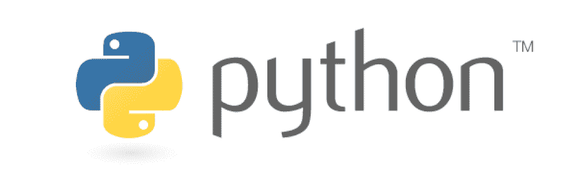
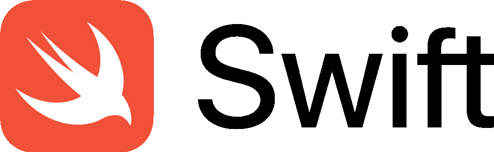
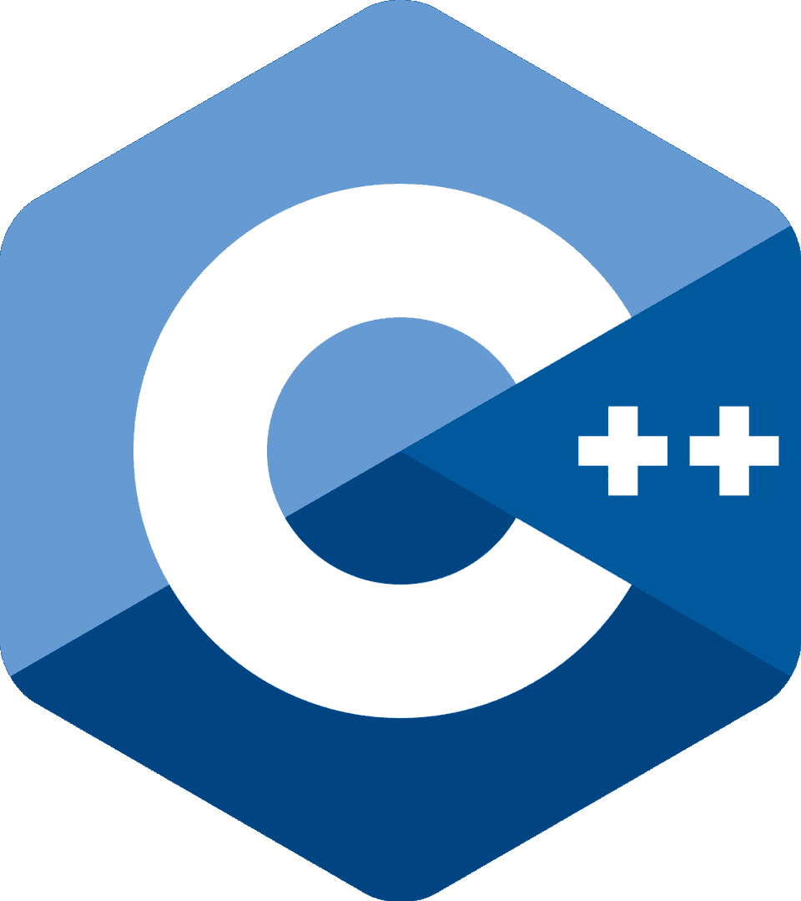
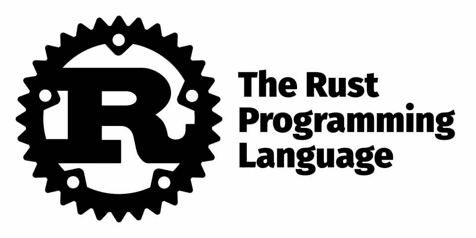
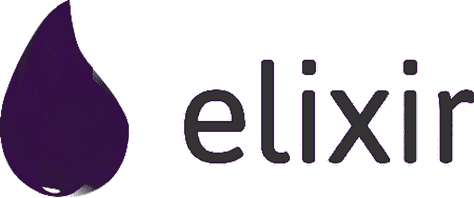

# Java 替代品:2023 年最受欢迎的 Java 竞争者

> 原文：<https://hackr.io/blog/popular-java-alternatives>

自 1995 年以来，Java 一直是一种流行的编程语言。Java 具有可移植性和强大的功能，被嵌入到全球的在线和本地系统中。Java 支持物联网设备、SaaS 解决方案和移动应用。但是它不是唯一的语言。

你可能想找一个 [Java](https://www.slant.co/options/112/alternatives/~java-alternatives) [替代](https://www.slant.co/options/112/alternatives/~java-alternatives)的原因有很多。Java 是一种老式的语言；与现代语言相比，它很难使用而且晦涩难懂。今天，有一些强大的语言提供了广泛的生活质量特性。

让我们来看看一些顶级的 Java 替代品。

## **你为什么会想使用 Java 的竞争对手？**

尽管 Java 具有可移植性和功能性，但它仍有一些缺点。也许你碰壁了，决定寻找 Java 的替代品。或者，您可能想学习与 Java 类似的寿命更长的语言。

以下是寻找 Java 替代品的一些最常见的原因:

*   **易用性。** Java 是一种函数式语言，但它不具备现代语言所提供的生活质量特性，比如对垃圾收集的内置支持。如果您不想手动管理内存分配，Java 并不适合您。
*   **表现** 。Java 是一种有趣的语言，因为它只编译了一部分。它仍然是部分解释的，运行速度比大多数编译语言慢。如果你需要高性能，你需要一个 Java 替代品。
*   **灵活性** 。有些人觉得 Java 很乏味或难以使用，因为它可读性或可维护性不高。如果您想在团队中快速部署代码，Java 可能会拖您的后腿。
*   **未来展望** 。过去许多系统都是用 Java 构建的，但是现在已经不那么普遍了。有如此多的 Java 竞争者和类似于 Java 的语言，市场上充斥着其他解决方案。

在使用 Java 替代品时，你必须考虑这样一个事实:大多数 Java 替代品都没有 Java 的原始。这意味着不太活跃的社区，不太频繁的更新，以及潜在的更小的库。不过，如果更容易使用的话，Java 替代品可能会大大减少您的开发时间。

## Java 最受欢迎的替代品是什么？

成为 Java 的替代品意味着什么？这种语言应该是面向对象的、可扩展的、通用的和健壮的。它应该能做 Java 能做的一切，包括极其便携。Java 是一种流行的语言，因为它可以部署在任何地方。

考虑到这一点，下面是一些最流行的类似 Java 的语言:

1.  [科特林](https://hackr.io/blog/kotlin-vs-java)
2.  [打字稿](https://hackr.io/blog/typescript-vs-javascript)
3.  [Python](https://hackr.io/blog/python-vs-javascript)
4.  [JavaScript](https://hackr.io/blog/how-to-learn-javascript)
5.  [雨燕](https://hackr.io/blog/best-way-to-learn-swift)
6.  [镖](https://hackr.io/tutorials/learn-dart)
7.  [c++](https://hackr.io/tutorials/learn-c-plus-plus)
8.  [锈](https://hackr.io/tutorials/learn-rust)
9.  [仙丹](https://hackr.io/tutorials/learn-elixir)
10.  [走](https://hackr.io/blog/golang-vs-python)

不是所有这些语言都能做 Java 能做的一切。但是如果你正在为一个特定的项目寻找替代品，你会在这个列表中找到一个。

Java 是一种更古老的语言。有许多选择，但大多数都倾向于这样或那样的应用程序——无论是移动应用程序、网页设计还是系统。

## **一览式 Java 备选方案比较**

|   | **主要应用** | **面向对象** | **发布** | **用户(预计)** |
| **Java** | 应用、业务、客户端、通用、移动、服务器端、web | 是 | 1996 | [900 万](https://blogs.oracle.com/oracleuniversity/post/why-is-java-the-most-popular-programming-language) |
| **锅炉** | 应用、移动开发、服务器端、客户端、web | 是 | 2016 年 | [150 万](https://www.jetbrains.com/research/kotlin-census-2018/) |
| **打字稿** | 客户端、服务器端、web | 是 | 2012 年 | 未知 |
| **Python** | 应用、通用、web 脚本、人工智能、科学计算 | 是 | 1991 | [700 万](https://www.futurelearn.com/info/insights/python-insights) |
| **JavaScript** | 客户端、服务器端、web | 是 | 1995 年 | [1240 万](https://www.daxx.com/blog/development-trends/number-software-developers-world) |
| **镖** | 应用、网络、服务器端、移动、物联网 | 是 | 2011 年 | 未知 |
| **C++** | 应用程序，系统 | 是 | 1985 年 | [440 万](https://www.daxx.com/blog/development-trends/number-software-developers-world) |
| **生锈** | 应用、服务器端、系统、网络 | 是 | 2010 年 | 未知 |
| **仙丹** | 应用程序，已分发 | 否 | 2012 年 | 未知 |
| **出发** | 应用、网络、服务器端 | 否 | 2012 年 | [110 万](https://blog.jetbrains.com/go/2021/02/03/the-state-of-go/) |

## **Java vs. Kotlin**

[****](https://hackr.io/blog/kotlin-vs-java)

Kotlin 是一种静态类型语言，用于服务器端、客户端和 Android 开发。Kotlin 与 Java 100%互操作，这意味着任何 Java 代码都可以在 Kotlin 项目中运行，无需修改。

Kotlin 是为了改进 Java[](https://hackr.io/blog/kotlin-vs-java)的缺点而设计的。它更简洁，可读性更强，更有表现力。Kotlin 还具有 Java 所缺乏的特性，比如空安全、扩展函数和数据类。

科特林迅速走红。最近，Google 宣布 Kotlin 将成为 Android 开发的首选语言。许多开发人员选择在学习 Java 的同时学习 Kotlin，以便为未来做准备。

#### **kot Lin 相对于 Java 的优势**

*   Kotlin 比 Java 更简洁，可读性更强，表达能力更强。
*   Kotlin 具有 Java 所缺乏的特性，比如空安全、扩展函数和数据类。
*   Kotlin 与 Java 100%互操作，这意味着任何 Java 代码都可以在 Kotlin 项目中运行，无需修改。

#### **kot Lin 相对于 Java 的劣势**

*   Kotlin 是一种不如 Java 流行的语言，所以社区更小，可用的资源也更少。

#### “你好，世界！”在科特林

```
fun main(args : Array<String>) {
    println("Hello, World!")
}
```

## **Java 与 TypeScript**

[****](https://hackr.io/blog/typescript-vs-javascript)

TypeScript 是一种 [建立在 JavaScript](https://hackr.io/blog/typescript-vs-javascript) 而非 Java 之上的语言。但是今天它是相关的，因为当涉及到 web 应用程序和 SaaS 解决方案(越来越普遍)时，JavaScript 是 Java 的流行替代品。TypeScript 将静态类型检查添加到 JavaScript 中，使得在开发过程的早期捕捉错误变得更加容易。TypeScript 也比普通的 JavaScript 更具可读性和可维护性。

TypeScript 在 web 开发中很流行，尤其是 Angular 框架。它还用于开发 Node.js 应用程序。对于 web 应用程序，JavaScript 和 TypeScript 通常比 Java 更受青睐。

#### **TypeScript 相对于 Java 的优势**

*   当 JavaScript 比 Java 更适用时，可以使用 Typescript 作为替代。

#### **TypeScript 优于 Java 的缺点**

*   像 JavaScript 一样，TypeScript 是一种主要的 web 开发语言。
*   TypeScript 不像 JavaScript 或 Java 那样流行。

#### “你好，世界！”在打字稿中

```
let message: string = 'Hello, World!';
console.log(message);
```

## **Java vs. Python**

[****](https://hackr.io/blog/python-programming-language)

Python 是一种 [广泛使用的编程语言](https://hackr.io/blog/python-programming-language) 以易用著称。它经常用于科学计算、数据分析、人工智能和教育环境。如今，它是许多人学习的第一语言，这使得它非常受欢迎，非常有市场。

对于初学者来说，Python 是一种很棒的语言。它在脚本和自动化方面也很流行。Python 在很多大型项目中都有使用，比如 Django、Reddit、Instagram。

#### **Python 相对于 Java 的优势**

*   Python 对于初学者来说很容易学。
*   Python 有许多模块和库，使得开发更快更容易。

#### **Python 相对于 Java 的劣势**

*   Python 比 Java 提供了更多的自由，这使得它更容易出错。

#### “你好，世界！”在 Python 中

```
print("Hello, World!")
```

## **Java 与 JavaScript**

[****](https://hackr.io/blog/java-vs-javascript)

明确一点，JavaScript 和 [Java](https://hackr.io/blog/java-vs-javascript) 没有太多相似之处；它不是 Java 的网络版。然而，JavaScript 是网络语言。它用于前端开发、后端开发等等。众所周知，JavaScript 易于入门，但它也为高级用户提供了大量功能。

互联网上几乎每一个网页都使用 JavaScript。它还用于构建流行的框架和库，如 React 和 Angular。很少有语言像 JavaScript 一样无处不在。

#### **JavaScript 相对于 Java 的优势**

*   JavaScript 比 Java 更受欢迎，使得许多代码片段和 框架 可用。
*   JavaScript 比 Java 更容易上手，尤其是 web 开发。
*   JavaScript 为高级用户提供了大量的特性。

#### **JavaScript 相对于 Java 的劣势**

*   Java 比 JavaScript 更快、更轻量级。
*   Java 是后端开发更流行的语言。

#### “你好，世界！”在 JavaScript 中

```
console.log('Hello World');
```

## **Java vs. Swift**

[****](https://hackr.io/blog/best-way-to-learn-swift)

[Swift](https://hackr.io/blog/best-way-to-learn-swift) 是苹果公司创造的语言，用于开发 iOS、macOS、watchOS、tvOS 应用。Swift 是一种语法清晰的现代语言。读写方便，设计安全。

Swift 在服务器端开发方面也越来越受欢迎。Kitura web 框架使得在 Swift 中构建 web APIs 和 Web 应用程序变得非常容易。

#### **Swift 相对于 Java 的优势**

*   Swift 是一种较新的语言，所以它有更清晰的语法。
*   Swift 易于读写。
*   Swift 的设计是安全的。

#### **Swift 优于 Java 的劣势**

*   Swift 主要用于苹果生态系统。
*   它没有 Java 流行，社区更小，文档也更少。

#### “你好，世界！”在 Swift

```
print("Hello, World!")
```

## **Java 对 Dart**

[****](https://hackr.io/tutorials/learn-dart)

[Dart](https://hackr.io/tutorials/learn-dart) 是 Google 创造的语言，用于客户端和服务器端开发。Flutter 移动应用程序框架使用 Dart 来构建跨平台应用程序。

Dart 是一种构建网络应用程序的优秀语言。它具有 JavaScript 所具有的所有特性，以及诸如提前编译和类型推断之类的附加特性。

#### **Dart 相对于 Java 的优势**

*   Dart 具有提前编译功能，执行速度更快。
*   Dart 是一种非常适合网络应用的语言。
*   谷歌为 Dart 提供重要支持。

#### **Dart 优于 Java 的缺点**

*   Dart 是一种相对晦涩的语言，没有多少资源。

#### “你好，世界！”在镖中

```
void main() {
  print('Hello, World!');
}
```

**Java 与 C++**

## [****](https://hackr.io/blog/python-vs-cpp)

[C++](https://hackr.io/blog/what-is-cpp) 是一种强大但古老的语言，用于低级系统编程或高级应用程序开发。它以快速、高效和便携著称。

许多大型项目都使用 C++，比如谷歌 Chrome、微软 Office 和 Adobe Photoshop。通常，程序员要么坚持使用 Java，要么使用 C++。请记住，每种 C 类语言(C、C++和 C#)都是不同的。

**c++相对于 Java 的优势**

#### C++比 Java 更快更高效。

*   C++甚至比 Java 的更加便携。
*   C++是一种“经典”和众所周知的通用语言。
*   c++相对于 Java 的劣势:

#### C++比 Java 更难学。它对程序员有更高层次的要求。

*   “你好，世界！”在 C++中

```
#include <iostream>

int main() {
    std::cout << "Hello, World!";
    return 0;
}
```

**Java vs. Rust**

## [](https://hackr.io/ru/tutorials/learn-rust)

Mozilla 创造了 Rust 编程语言。它用于开发低级系统，如操作系统、游戏引擎和 web 浏览器。Rust 因其安全特性越来越受欢迎。由于新的 Actix web 框架，它也越来越广泛地用于 web 开发。

**Rust 相对于 Java 的优势**

#### 对于那些想要制作简单、轻量级应用的人来说，Rust 是一个极好的解决方案。

*   众所周知，Rust 是一种安全、快速的语言。
*   **Rust 胜过 Java 的缺点**

#### 与 Java 相比，Rust 的应用范围相当窄，社区也非常小。

*   “你好，世界！”在生锈中

```
$ ./hello
Hello World!
```

**Java vs. Elixir**

## [****](https://hackr.io/tutorials/learn-elixir)

Elixir 是由流行的 Rails web 框架背后的团队开发的语言。它用于构建可伸缩和容错的应用程序。Elixir 以并发、高效和易学而闻名。

得益于其快速的框架，Elixir 在 web 开发中越来越受欢迎。它也用于开发嵌入式系统和创建聊天机器人。

**仙丹优于 Java**

#### Elixir 是一种较新的语言，所以它有更清晰的语法。

*   仙丹比 Java 更有效率。
*   **仙丹优于 Java 的缺点:**

#### 基本上，这种语言仍然相当小众和生僻。

*   “你好，世界！”在药剂中

#### **Java vs. Go**

```
iex(2)> "hello" <> " world"
"hello world"
```

[](https://hackr.io/tutorials/learn-golang)

## Go 是谷歌创造的一种语言。它有时被称为[](https://hackr.io/tutorials/learn-golang)。它用于构建高效且可伸缩的软件。围棋以其快速、简单和安全而闻名。

由于其优秀的标准库和框架，如 Echo 和 Gin，Go 在 web 开发中越来越受欢迎。

**Go 优于 Java 的优势**

Go 比 Java 更快更高效。

#### Go 比 Java 简单易学。

*   Go 拥有先进的安全功能。
*   **复习 Java 的缺点**
*   和这个列表中的其他应用一样，Go 通常主要用于网络开发或移动应用。

#### “你好，世界！”进入

#### **当** ***不应该*** **你用 Java 替代吗？**

如果你已经熟悉了 Java，并且对它的语法也很熟悉，那就没有理由去换一种不同的语言。如果你对 Java 生态系统满意，就没有必要去寻找替代品。

```
package main
import "fmt"
func main() {
    fmt.Println("hello world")
}
```

Java 是一种古老的语言，但在一段时间内它仍将保持相关性。Java 可以做几乎任何一种新语言可以做的事情——但是有些事情在 Java 中比在其他语言中更难。

此外，如此多的系统都是用 Java 构建的，需要 Java 开发人员来管理。意思？Java 开发人员将在就业市场上保持多年的市场竞争力。因为 Java 天生就比许多现代语言更难学，所以这种技能会一直受到追捧。

不要因为你认为 Java“就要过时了”而改变语言 COBOL 程序员仍然获得高薪是有原因的。

结论:你应该学习哪种语言？

你应该学习的语言取决于你作为程序员的目标。

## 你想要一个更容易上手的， **通用语言** :考虑学习 C++或者 Python。

你希望 **Java 更容易使用** 考虑学习 Kotlin，一种与 Java 互操作的语言。

*   你想 **建立功能齐全的网站** 和网络应用:考虑学习 JavaScript、Typescript、Swift、Elixir 或 Go。
*   你想开发**:考虑 [学习 Python](https://hackr.io/tutorials/learn-python) 或者 [Go](https://hackr.io/tutorials/learn-golang) 。**
***   每个程序员和每个项目都有一种理想的语言。很长一段时间，Java 是许多应用程序的最佳全能语言——但是现在有了强大的 Java 替代品，它们提供了更容易的开发和部署。*   **常见问题解答****

 ****可以用什么代替 Java？**

## 许多语言最终都能提供和 Java 一样的结果。一些流行的选项包括 Kotlin、Python、C++和 Go。哪种语言是最好的取决于你所从事的项目类型。

### **Java 还有必要吗？**

不需要。您可以使用许多 Java 替代品或类似于 Java 的语言来执行与 Java 相同的功能。虽然 Java 很受欢迎，但今天的程序员可能想学习一门寿命更长的语言。例如，Python 比 Java 更受欢迎。

### **kot Lin 比 Java 好吗？**

作为 Java 的流行替代品，Kotlin 对于那些已经是 Java 专家的人来说是一种很好的语言。Kotlin 以简洁、安全、易学而闻名。

### **Java 是垂死挣扎的** **语言** 吗？

不。虽然 Java 不像以前那样流行，但它仍然是一种被广大开发者广泛使用的语言。Java 很可能在未来的许多年里保持相关性，特别是对于许多需要支持的遗留系统。

### **Is Java a Dying** **Language**?

No. While Java is not as popular as it once was, it's still a widely used language with a large community of developers. Java will likely remain relevant for many years to come, especially with the many legacy systems that will need to be supported.**