# 下载 PostgreSQL 备忘单 PDF 作为快速参考

> 原文：<https://hackr.io/blog/postgresql-cheat-sheet>

PostgreSQL 是一个免费的开源关系数据库管理系统(RDBMS)，被称为 Postgres。

这个 RDBMS 提供了各种特性，包括自动更新视图、触发器、物化视图、存储过程、外键和具有 ACID(原子性、一致性、隔离性和持久性)属性的事务。

PostgreSQL 运行在所有主流操作系统上，包括 Windows ，macOS，Linux，OpenBSD。然而，它是 macOS 服务器的默认数据库系统。这个数据库系统可以处理各种各样的工作负载。此外，它还带有强大的插件，如流行的 PostGIS 地理空间数据库扩展器。

由于 PostgreSQL 在数据科学中有应用，许多专业人士都渴望将它添加到他们的技能组合中。如果有一个 Postgres 命令行备忘单来帮助您处理日常任务和开发会怎么样？

你来对地方了。我们创建了这个 PostgreSQL 备忘单，其中包含语法、命令、查询和示例，以便在使用 PostgreSQL 数据库时作为快速参考。

[点击这里](https://drive.google.com/file/d/1vYMDnW2dxts2c-jmn2reo68ElsrrXmac/view?usp=sharing)下载 Hackr.io 的 PostgreSQL 备忘单 PDF。

让我们开始吧！

## PostgreSQL 备忘单

### 第 1 部分- PostgreSQL 查询备忘单:查询数据

让我们讨论在 PostgreSQL 数据库中查询数据的不同命令或查询。

#### 1。选择

这个常用的查询允许您从表中检索信息。这也是最复杂的语句之一，因为它有几个子句。因此，为了更好地理解，我们将它分成了几个部分。

语法:

```
SELECT
  select_list
FROM
  table_name;
```

其中:

**Select _ list****指定要从特定表格中检索的列数。如果提到多列，必须用逗号分隔。此外，可以使用(*)从特定表的所有列中检索数据。**

 ****table _ name****指定要从中检索数据的表格的名称。**

 ***   **从一列中查询数据**

```
SELECT first_name FROM customer;
```

在这里，分号指定 PostgreSQL 语句的结束。

*   **查询多列数据**

```
SELECT
  first_name,
  last_name,
  email
FROM
  customer;
```

*   **查询一个表中所有列的数据。**

```
SELECT * FROM customer;
```

我们不建议使用(*)，因为它会影响数据库和应用程序的性能。因此，显式指定所有列的名称。

*   **用表达式选择语句。**

```
SELECT 
  first_name || ' ' || last_name,
  email
FROM 
  customer;
```

(||)是连接运算符。

您也可以简单地使用 SELECT 语句，而不连接任何子句:

```
SELECT 5 * 3;
```

#### 2。列别名

您可以使用列别名为列或表达式分配一个临时名称。该别名在查询执行期间暂时存在。

语法:

```
SELECT column_name AS alias_name
FROM table_name;
```

您也可以省略上述语法中的 AS:

```
SELECT column_name alias_name
FROM table_name;
```

或者

```
SELECT expression AS alias_name
FROM table_name;
```

假设我们需要从表中检索所有客户的名字和姓氏。我们使用下面的查询:

```
SELECT 
  first_name,
  last_name
FROM customer;
```

现在，我们将使用别名更改姓氏:

```
SELECT 
  first_name,
  last_name AS surname
FROM customer;
```

列名“姓氏”更改为“姓氏”。

您也可以使用下面的查询，提供相同的结果(省略 as)。

```
SELECT 
  first_name,
  last_name surname
FROM customer;
```

*   **给表达式分配列别名。**

这将检索所有客户的名字和姓氏，中间有一个空格。

```
SELECT 
  first_name || ' ' || last_name
FROM 
  customer;
```

上面的查询将显示一个没有任何特定列名的表。

现在，让我们为连接的列指定一个别名，名为“全名:”

```
SELECT
   first_name || ' ' || last_name AS full_name
FROM
   customer;
```

您将得到一个列名为“full_name”的表

*   **用空格分配列别名**

列名为“列别名”

例如:

```
SELECT
   first_name || ' ' || last_name "full name"
FROM
   customer;
```

### 向一流的数据库讲师学习 Postgresql！
[](https://click.linksynergy.com/deeplink?id=Qouy7GhEEFU&mid=39197&murl=https%3A%2F%2Fwww.udemy.com%2Ftopic%2Fpostgresql%2F)

上述查询将显示一个列名为“full_name”的表。

#### 3。排序依据

“S elect”查询结果没有组织起来。因此，您可以使用“order by”子句按升序或降序组织它。

语法:

```
SELECT
        select_list
FROM
        table_name
ORDER BY
        sort_expression1 [ASC | DESC],
       ...
        sort_expressionN [ASC | DESC];
```

在上述语法中，排序表达式可以是要在 ORDER BY 关键字之后排序的列或表达式。对于基于多个列或表达式的数据排序，必须在两个列或表达式之间放置逗号(，)来分隔它们。然后，您必须指定升序或降序。

注意:“order by”子句必须是任何选择查询中的最后一个。

*   **按一列排序。**

```
SELECT
        first_name,
        last_name
FROM
        customer
ORDER BY
        first_name ASC;
```

该查询将显示一个表，其中有一列按升序排列的所有客户的名字。

此外，如果没有在 order by 子句中指定(asc 或 desc ),则默认为升序

因此，以下查询将显示相同的输出:

```
SELECT
        first_name,
        last_name
FROM
        customer
ORDER BY
        first_name;
```

*   **按多列排序行。**

```
SELECT
        first_name,
        last_name
FROM
        customer
ORDER BY
        first_name ASC,
        last_name DESC;
```

上面的查询将显示一个有两列的表，名字和姓氏。first_name 列将按升序排列客户的名字，而 last_name 列将按降序排列客户的姓氏。

*   **按表达式排序行。**

```
SELECT 
        first_name,
        LENGTH(first_name) len
FROM
        customer
ORDER BY 
        len DESC;
```

该查询将显示一个包含两列的表，即 first_name 和它们的长度。它根据名字的长度对行进行降序排序。

*   **对空值行进行排序。**

Null 表示缺失或未知的数据。您甚至可以对包含空值的行进行排序。

```
ORDER BY sort_expresssion [ASC | DESC] [NULLS FIRST | NULLS LAST]
```

**-创建新表**

```
CREATE TABLE sort_demo(
        num INT
);
```

**——插入一些数据**

```
INSERT INTO sort_demo(num)
VALUES(1),(2),(3),(null);
```

*   **对空值行进行排序。**

```
SELECT num
FROM sort_demo
ORDER BY num;​
```

|   | **num**整数 |
| 1 | 1 |
| 2 | 2 |
| 3 | 3 |
| 4 | [null] |

如你所见，空值默认是最后一个。

下面的查询将提供相同的结果。

```
SELECT num
FROM sort_demo
ORDER BY num NULLS LAST;
```

但是为了首先获得空值行，您必须显式地提到它:

```
SELECT num
FROM sort_demo
ORDER BY num NULLS FIRST;
```

您将获得以下输出:

|   | **num**整数 |
| 1 | [null] |
| 2 | 1 |
| 3 | 2 |
| 4 | 3 |

#### 4。选择不同的

这个从结果集中删除重复的行。可以将 DISTINCT 子句应用于 select 语句的选择列表中的一列或多列。

语法:

```
SELECT
  DISTINCT column1
FROM
  table_name;
```

或者:

```
SELECT
  DISTINCT column1, column2
FROM
  table_name;
```

或者:

```
SELECT
  DISTINCT ON (column1) column_alias,
  column2
FROM
  table_name
ORDER BY
  column1,
  column2;
```

例如，我们将使用以下查询创建一个 distinct_demo 表，并插入一些数据。

```
CREATE TABLE distinct_demo (
        id serial NOT NULL PRIMARY KEY,
        bcolor VARCHAR,
        fcolor VARCHAR
);
```

使用以下查询插入行。

```
INSERT INTO distinct_demo (bcolor, fcolor)
VALUES
        ('red', 'red'),
        ('red', 'red'),
        ('red', NULL),
        (NULL, 'red'),
        ('red', 'green'),
        ('red', 'blue'),
        ('green', 'red'),
        ('green', 'blue'),
        ('green', 'green'),
        ('blue', 'red'),
        ('blue', 'green'),
        ('blue', 'blue');
```

**不使用相异子句**

```
SELECT
        id,
        bcolor,
        fcolor
FROM
        distinct_demo ;
```

输出:

| **id** | 整数**b 颜色** | 字符变化**颜色** | 字符变化1 |
| 1 | 红色 | 红色 | 2 |
| 2 | 红色 | 红色 | 3 |
| 3 | 红色 | [null] | 4 |
| 4 | [null] | 红色 | 5 |
| 5 | 红色 | 绿色 | 6 |
| 6 | 红色 | 蓝色 | 7 |
| 7 | 绿色 | 红色 | 8 |
| 8 | 绿色 | 蓝色 | 9 |
| 9 | 绿色 | 绿色 | 10 |
| 10 | 蓝色 | 红色 | 11 |
| 11 | 蓝色 | 红色 | 12 |
| 12 | 蓝色 | 蓝色 | **一列中的 Distinct 子句。** |

*   输出:

```
SELECT
        DISTINCT bcolor
FROM
        distinct_demo
ORDER BY
        bcolor;
```

**b 颜色**

| 字符变化 | 1蓝色 |
| 2 | 绿色 |
| 3 | 红色 |
| 4 | [null] |
| **在多列上截然不同。** | 输出: |

*   **b 颜色**

```
SELECT
        DISTINCT bcolor,
        fcolor
FROM
        distinct_demo
ORDER BY
        bcolor,
        fcolor;
```

字符变化

| **颜色** | 字符变化1 | 蓝色蓝色 |
| 2 | 蓝色 | 绿色 |
| 3 | 蓝色 | 红色 |
| 4 | 绿色 | 蓝色 |
| 5 | 绿色 | 绿色 |
| 6 | 绿色 | 红色 |
| 7 | 红色 | 蓝色 |
| 8 | 红色 | 绿色 |
| 9 | 红色 | 红色 |
| 10 | 红色 | [null] |
| 11 | [null] | 红色 |
| 输出: | **b 颜色** | 字符变化 |

```
SELECT
        DISTINCT ON (bcolor) bcolor,
        fcolor
FROM
        distinct_demo
ORDER BY
        bcolor,
        fcolor;
```

**颜色**

| 字符变化 | 1蓝色 | 蓝色2 |
| 绿色 | 蓝色 | 3 |
| 红色 | 蓝色 | 4 |
| [null] | 红色 | 第 2 节-过滤数据 |
| 现在，让我们看看可以与 SELECT 语句一起使用的不同类，以便从数据库表中过滤和检索数据。 | 1。Where 子句 | 它用于根据提到的特定条件检索行。 |

### 语法:

条件必须评估为真、假或未知。它可以是布尔表达式，也可以是使用 AND 和 or 运算符的布尔表达式的组合。只有满足条件的行将被返回。

#### 在 where 子句中，可以使用逻辑和比较运算符:

**操作员**

**描述**

```
SELECT select_list
FROM table_name
WHERE condition
ORDER BY sort_expression
```

=

等于

| > | 大于 |
| < | 小于 |
| > = | 大于或等于 |
| < = | 小于或等于 |
| < >或者！= | 不等于 |
| 和 | 逻辑运算符和 |
| 或 | 逻辑运算符或 |
| 在…里 | 如果一个值匹配列表中的任何值，则返回 true |
| 之间 | 如果一个值在一系列值之间，则返回 true |
| 喜欢 | 如果一个值与一个模式匹配，则返回 true |
| 为空 | 如果值为空，则返回 true |
| 不是 | 否定其他算子的结果 |
| 上面的查询返回一个包含两列的表，即姓氏和名字，其中名字列上的值只包含 Jamie。 | 上面返回的表中，姓氏列中的值为 Rice，名字列中的值为 Jamie。 |
| 该查询返回一个表，其中包含姓氏为 Rodriguez 或名字为 Adam 的值。 | 它返回一个包含名字为 Ann、Anne 和 Annie 的值的表。 |

```
SELECT
        last_name,
        first_name
FROM
        customer
WHERE
        first_name = 'Jamie';
```

该查询返回一个名字列值以‘Ann’开头的表。

```
SELECT
        last_name,
        first_name
FROM
        customer
WHERE
        first_name = 'Jamie' AND 
       last_name = 'Rice';
```

您将得到一个包含所有名字的表，其长度在 3 到 5 之间变化。

```
SELECT
        first_name,
        last_name
FROM
        customer
WHERE
        last_name = 'Rodriguez' OR 
        first_name = 'Adam';
```

**使用不等于(< >)的运算符。**

```
SELECT
        first_name,
        last_name
FROM
        customer
WHERE 
        first_name IN ('Ann','Anne','Annie');
```

上述查询返回一个表，其中包含 first_name 列中以“Bra”开头的值，以及 last_name 列中除“Motley”以外的所有其他值。

```
SELECT
        first_name,
        last_name
FROM
        customer
WHERE 
        first_name LIKE 'Ann%'
```

2。极限值

```
SELECT
        first_name,
        LENGTH(first_name) name_length
FROM
        customer
WHERE 
        first_name LIKE 'A%' AND
        LENGTH(first_name) BETWEEN 3 AND 5
ORDER BY
        name_length;
```

此子句将约束查询返回的行数。

*   语法:

```
SELECT 
        first_name,
        last_name
FROM 
        customer
WHERE 
        first_name LIKE 'Bra%' AND 
        last_name <> 'Motley';
```

该语句返回查询生成的 row_count 行。如果 row_count 为零，查询将返回一个空集。如果 row_count 为 NULL，查询将返回相同的结果集，因为它没有 LIMIT 子句。

#### 在返回 row_count 行之前，使用 OFFSET 子句跳过几行。

**使用 LIMIT 来限制行数。**

该查询返回一个包含 film_id、title 和 release_year 的五行表，其中 film_id 按升序排序。

```
SELECT select_list
FROM table_name
ORDER BY sort_expression
LIMIT row_count
```

该查询返回一个包含 film_id、title 和 release_year 的四行表，其中 film_id 按升序排序。它从 film_id = 4 开始计算值，而不是从头开始。

**使用偏移量获取顶/底行。**

```
SELECT select_list
FROM table_name
LIMIT row_count OFFSET row_to_skip;
```

*   具有 film_id、title 和 rental_rate 列的表包含十行，其中 rental_rate 按降序排列。

```
SELECT
        film_id,
        title,
        release_year
FROM
        film
ORDER BY
        film_id
LIMIT 5;
```

3。获取

```
SELECT
        film_id,
        title,
        release_year
FROM
        film
ORDER BY
        film_id
LIMIT 4 OFFSET 3;
```

PostgreSQL 支持 FETCH 子句来检索查询返回的几行。

*   语法:

```
SELECT
        film_id,
        title,
        rental_rate
FROM
        film
ORDER BY
        rental_rate DESC
LIMIT 10;
```

FETCH 子句在功能上等同于 LIMIT 子句。如果您计划让您的应用程序与其他数据库系统兼容，您应该使用 FETCH 子句，因为它遵循标准 SQL。

#### 4。在

与“where”子句一起使用，tthis 子句将检查一个值是否与值列表中的任何值匹配。

您也可以使用选择查询来代替值:

```
OFFSET start { ROW | ROWS }
FETCH { FIRST | NEXT } [ row_count ] { ROW | ROWS } ONLY
```

例如:

#### 我们有 1 个和 2 个客户 ID，上面的查询将返回一个包含客户 ID 为 1 或 2 的客户数据的表。

上面的查询将返回一个包含所有客户数据的表，除了客户 ID 为 1 或 2 的客户数据

```
value IN (value1,value2,...)
```

5。在之间

```
value IN (SELECT column_name FROM table_name);
```

此子句将一个值与一系列值进行匹配。

```
SELECT customer_id,
        rental_id,
        return_date
FROM
        rental
WHERE
        customer_id IN (1, 2)
ORDER BY
        return_date DESC;
```

语法:

```
SELECT
        customer_id,
        rental_id,
        return_date
FROM
        rental
WHERE
        customer_id NOT IN (1, 2);
```

值> =低，值< =高

#### 值<低或值>高

上述查询返回包含 customer_id、payment_id 和 amount 的表，其中 amount 的范围在 8 和 9 之间。

上面的查询返回带有 customer_id、payment_id 和 amount 的表，除了介于 8 和 9 之间的金额。

```
value BETWEEN low AND high;
```

上面的查询返回包含 customer_id、payment_id、amount 和 payment_date 的表，其中日期范围在 2007 年 2 月 7 日和 2007 年 2 月 15 日之间。

```
value NOT BETWEEN low AND high;
```

6。比如

```
SELECT
        customer_id,
        payment_id,
        amount
FROM
        payment
WHERE
        amount BETWEEN 8 AND 9;
```

该操作符将使用类似以下查询的字符串匹配客户的名字:

```
SELECT
        customer_id,
        payment_id,
        amount
FROM
        payment
WHERE
        amount NOT BETWEEN 8 AND 9;
```

您将得到一个包含 first_name 和 last_name 列的表，其中 first_name 列中的值以“Jen”开头。

```
SELECT
        customer_id,
        payment_id,
        amount,
payment_date
FROM
        payment
WHERE
        payment_date BETWEEN '2007-02-07' AND '2007-02-15';
```

通过组合文字值和通配符，并使用 LIKE 或 NOT LIKE 操作符来查找匹配项，可以匹配一个模式。PostgreSQL 为您提供了两个通配符:

#### 百分号(%)匹配零个或多个字符的任意序列。

下划线(_)匹配任何单个字符。

```
SELECT
        first_name,
       last_name
FROM
        customer
WHERE
        first_name LIKE 'Jen%';
```

例如:

选择

*   ‘福’像‘福’，-真
*   ‘foo’像‘f %’，- true

'foo '像' _o_ '，- true

‘杠’如‘b _’；-假

这将返回一个包含 first_name 和 last_name 列的表，其中 first_name 列中的值以后跟“her”的任何字母开头。

您将得到一个包含 first_name 和 last_name 列的表，其中 first_name 列包含不以“Jen”开头的值。

**使用 ILIKE(检查区分大小写)**

该查询返回一个包含名字和姓氏列的表，其中名字中的值以 BAR 开头。

```
SELECT
        first_name,
        last_name
FROM
        customer
WHERE
        first_name LIKE '_her%'
ORDER BY 
       First_name;
```

7。为空

```
SELECT
        first_name,
        last_name
FROM
        customer
WHERE
        first_name NOT LIKE 'Jen%'
ORDER BY 
       first_name
```

IS NULL 条件用于测试 SELECT、INSERT、UPDATE 和 DELETE 语句中的 NULL 值。

*   语法:

```
SELECT
        first_name,
        last_name
FROM
        customer
WHERE
        first_name ILIKE 'BAR%';
```

如果表达式为空，则条件评估为真。否则，条件评估为假。

#### 上面的查询返回一个表，该表包含来自 employee 表中 fisst_number 为 NULL 的记录。

上面的查询将新数据插入到雇员编号为空值的 contacts 表中。

上面的查询更新了 employees 表中姓氏为空值的记录。

```
expression IS NULL;
```

上述查询将删除所有雇员编号为空的记录雇员表。

```
SELECT *
FROM employees
WHERE first_number is NULL;
```

第 3 节-连接多个表

```
INSERT INTO contacts
(first_name, last_name)
SELECT first_name, last_name
FROM employees
WHERE employee_number IS NULL;
```

让我们讨论一下 PostgreSQL 中的‘JOIN ’:

```
UPDATE employees
SET status = 'Not Active'
WHERE last_name IS NULL;
```

1。加入

```
DELETE FROM employees
WHERE employee_number IS NULL;
```

您可以根据相关表之间的公共列值，合并一个(自联接)或多个表中的列。公共列通常是第一个表的主键列和第二个表的外键列。

### 为了解释这个概念，我们将使用两个表来执行不同类型的连接。

下面的查询创建了表‘basket _ a:’

#### 以下查询创建了表' basket_b:'

使用以下查询将数据插入' basket_a:'

以下查询将数据插入' basket_b:'

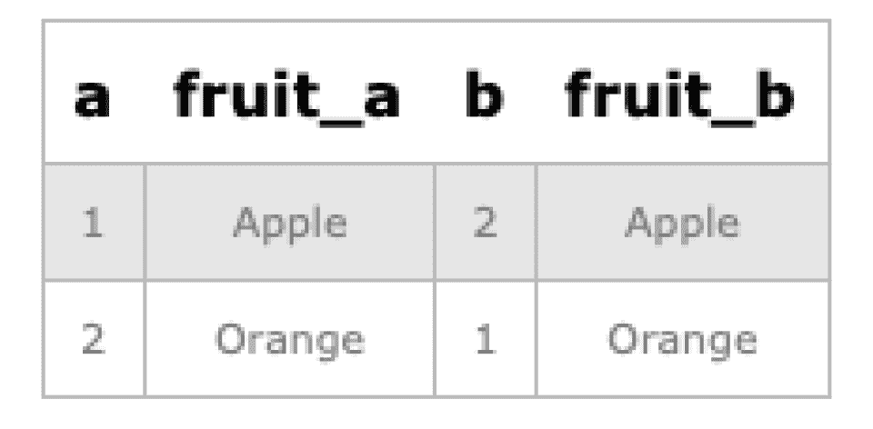

```
CREATE TABLE basket_a (
   a INT PRIMARY KEY,
   fruit_a VARCHAR (100) NOT NULL
);
```

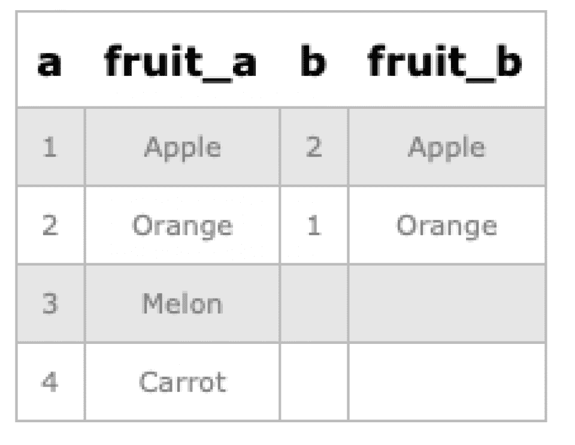

```
CREATE TABLE basket_b (
   b INT PRIMARY KEY,
   fruit_b VARCHAR (100) NOT NULL
);
```

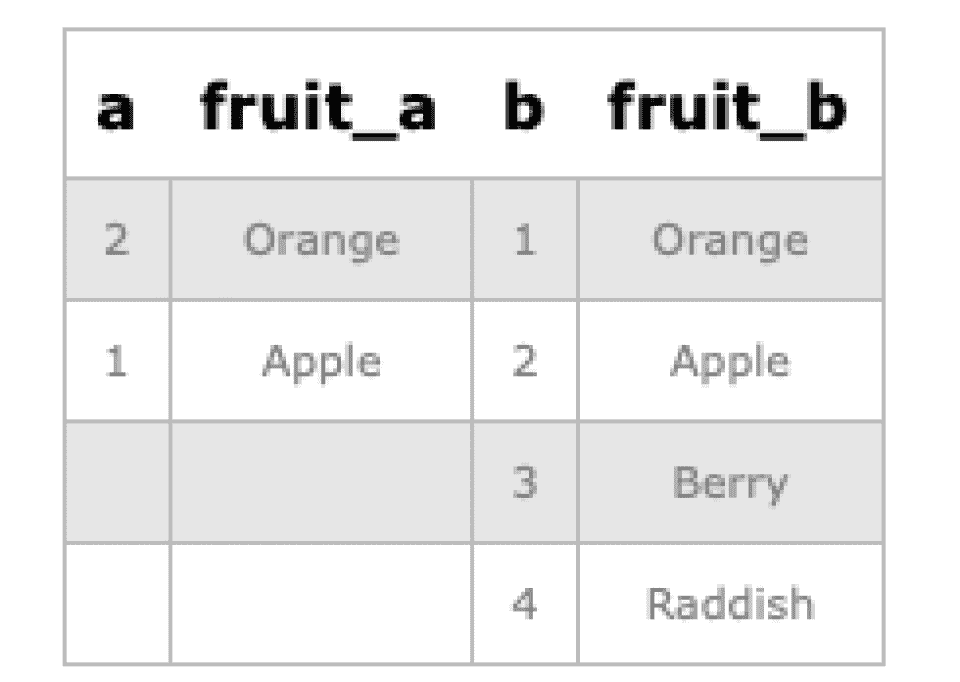

```
INSERT INTO basket_a (a, fruit_a)
VALUES
   (1, 'Apple'),
   (2, 'Orange'),
   (3, 'Banana'),
   (4, 'Cucumber');
```

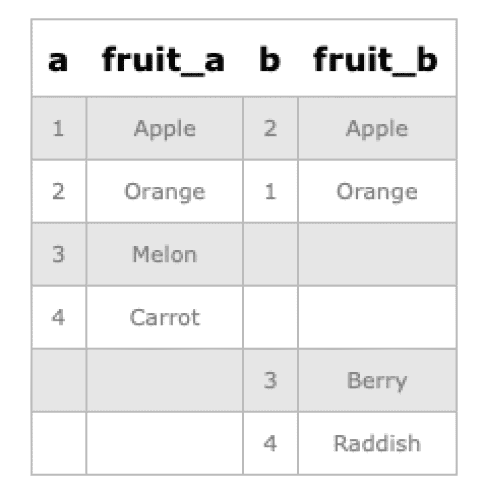

```
INSERT INTO basket_b (b, fruit_b)
VALUES
   (1, 'Orange'),
   (2, 'Apple'),
   (3, 'Watermelon'),
   (4, 'Pear');
```

```
SELECT
   a,
   fruit_a,
   b,
   fruit_b
FROM
   basket_a
INNER JOIN basket_b
   ON fruit_a = fruit_b;
```

2。表格别名

```
SELECT
   a,
   fruit_a,
   b,
   fruit_b
FROM
   table_a
LEFT JOIN table_b
  ON fruit_a = fruit_b;
```

在查询执行期间，这些函数会临时为表指定新的名称。

```
SELECT
   a,
   fruit_a,
   b,
   fruit_b
FROM
   table_a
RIGHT JOIN table_b ON fruit_a = fruit_b;
```

3。自连接

```
SELECT
   a,
   fruit_a,
   b,
   fruit_b
FROM
   table_a
FULL OUTER JOIN table_b
   ON fruit_a = fruit_b;
```

自联接是将表联接到自身的常规联接。要形成自连接，需要用不同的表别名指定同一个表两次，并在 ON 关键字后提供连接谓词。

#### 例如，这里有一个员工表，插入了一些数据:

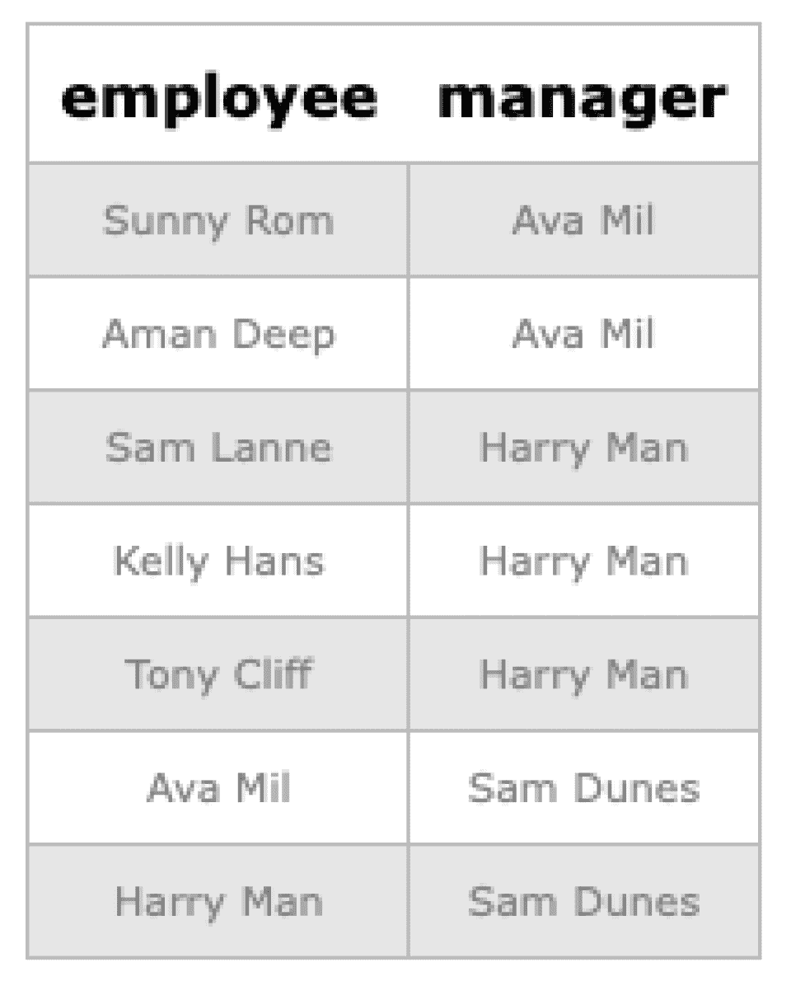

```
table_name AS alias_name;
```

#### 4。交叉连接

这个连接允许你在两个或更多的表中产生一个笛卡尔乘积。与左连接或内连接不同，交叉连接子句没有连接谓词:

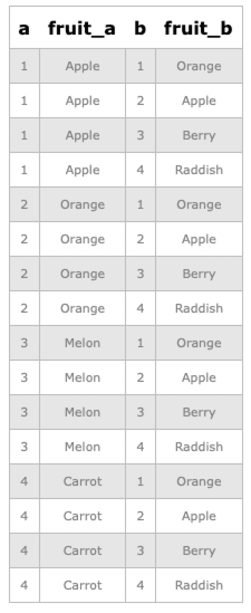

```
CREATE TABLE employee_data (
        emp_id INT PRIMARY KEY,
        f_name VARCHAR (255) NOT NULL,
        l_name VARCHAR (255) NOT NULL,
        manager_id INT,
        FOREIGN KEY (manager_id)
        REFERENCES employee (emp_id)
        ON DELETE CASCADE
);
```

```
INSERT INTO employee (
        emp_id,
        f_name,
        l_name,
        manager_id
)
VALUES
        (1, 'Sam', 'Dunes', NULL),
        (2, 'Ava', 'Mil', 1),
        (3, 'Harry', 'Man, 1),
        (4, 'Aman', 'Deep', 2),
        (5, 'Sunny', 'Rom', 2),
        (6, 'Kelly', 'Hans', 3),
        (7, 'Tony', 'Cliff, 3),
        (8, 'Sam', 'Lanne', 3);
```

```
SELECT
   e.f_name || ' ' || e.l_name employee,
   m .f_name || ' ' || m .l_name manager
FROM
   employee_data e
INNER JOIN employee_data m ON m .emp_id = e.manager_id
ORDER BY manager;
```

5。自然连接

#### 这个基于连接的表中相同的列名创建一个隐式连接。

语法:

```
CREATE TABLE table_a (
   a INT PRIMARY KEY,
   fruit_a VARCHAR (100) NOT NULL
);​
```

```
CREATE TABLE table_b (
   b INT PRIMARY KEY,
   fruit_b VARCHAR (100) NOT NULL
);​
```

```
INSERT INTO table_a (a, fruit_a)
VALUES
   (1, 'Apple'),
   (2, 'Orange'),
   (3, 'Melon'),
   (4, 'Carrot');​
```

```
INSERT INTO table_b (b, fruit_b)
VALUES
   (1, 'Orange'),
   (2, 'Apple'),
   (3, 'Berry'),
   (4, 'Raddish');
```

```
SELECT * FROM table_a cross join table_b;
```

例如，我们创建了一个表格并插入了一些行:

#### 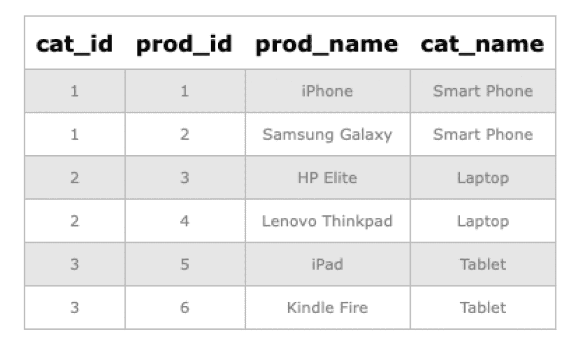

第 4 部分-分组数据

1。Group by 子句

```
SELECT select_list
FROM T1
NATURAL [INNER, LEFT, RIGHT] JOIN T2;
```

这个将 SELECT 语句返回的行分成几组。对于每个组，您可以应用聚合函数。

```
DROP TABLE IF EXISTS categories;
CREATE TABLE categories (
        cat_id serial PRIMARY KEY,
        cat_name VARCHAR (255) NOT NULL
);​
```

```
DROP TABLE IF EXISTS products;
CREATE TABLE prod (
        prod_id serial PRIMARY KEY,
        prod_name VARCHAR (255) NOT NULL,
        cat_id INT NOT NULL,
        FOREIGN KEY (cat_id) REFERENCES categories (cat_id)
);​
```

```
INSERT INTO categories (cat_name)
VALUES
        ('Smart Phone'),
        ('Laptop'),
        ('Tablet');​
```

```
INSERT INTO prod (prod_name, cat_id)
VALUES
        ('iPhone', 1),
        ('Samsung Galaxy', 1),
        ('HP Elite', 2),
        ('Lenovo Thinkpad', 2),
        ('iPad', 3),
        ('Kindle Fire', 3);
```

```
SELECT * FROM prod
NATURAL JOIN categories;
```

语法:

### PostgreSQL 在 FROM 和 WHERE 子句之后、HAVING SELECT、DISTINCT、ORDER BY 和 LIMIT 子句之前计算 GROUP BY 子句。

#### **使用 group by 而不使用聚合函数**

您将得到一个错误:

列“employee_data.emp_id”必须出现在 GROUP BY 子句中或用于聚合函数中。

```
SELECT 
  column_1,
  column_2,
  ...,
  aggregate_function(column_3)
FROM 
  table_name
GROUP BY 
  column_1,
  column_2,
  ...;
```

**用 sum()函数分组**

```
DROP TABLE IF EXISTS employee_data;
```

```
CREATE TABLE employee_data (
        emp_id INT PRIMARY KEY,
        f_name VARCHAR (255) NOT NULL,
        l_name VARCHAR (255) NOT NULL,
        manager_id INT,
        Salary int,
        FOREIGN KEY (manager_id)
        REFERENCES employee_data (emp_id)
        ON DELETE CASCADE
);​
```

```
INSERT INTO employee_data (
        emp_id,
        f_name,
        L_name,
        salary,
        manager_id
)
VALUES
        (1, 'Sam', 'Dunes', 1000,NULL),
        (2, 'Ava', 'Mil', 2000, 1),
        (3, 'Harry', 'Man', 2400, 1),
        (4, 'Aman', 'Deep', 4500, 2),
        (5, 'Sunny', 'Rom', 3455, 2),
        (6, 'Kelly', 'Hans', 6733,  3),
        (7, 'Tony', 'Cliff', 4577, 3),
        (8, 'Sam', 'Lanne', 4533, 3);
```

*   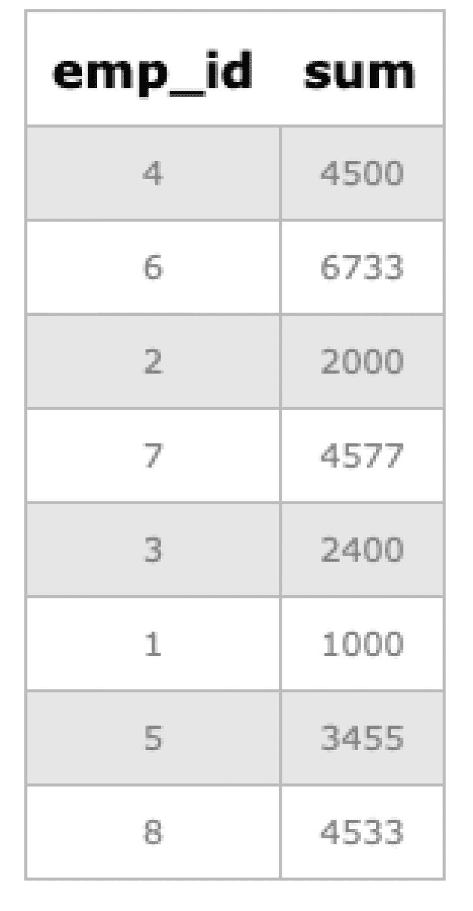

```
SELECT
  emp_id
FROM
  employee_data
GROUP BY
  Manager_id;
```

**使用 group by with join 子句**

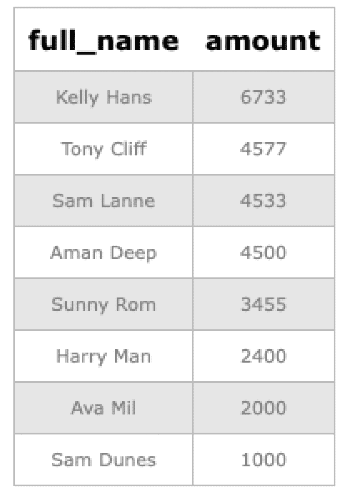

*   **用 count()函数分组**

```
SELECT
        emp_id,
        SUM (salary)
FROM
        employee_data
GROUP BY
        emp_id;
```

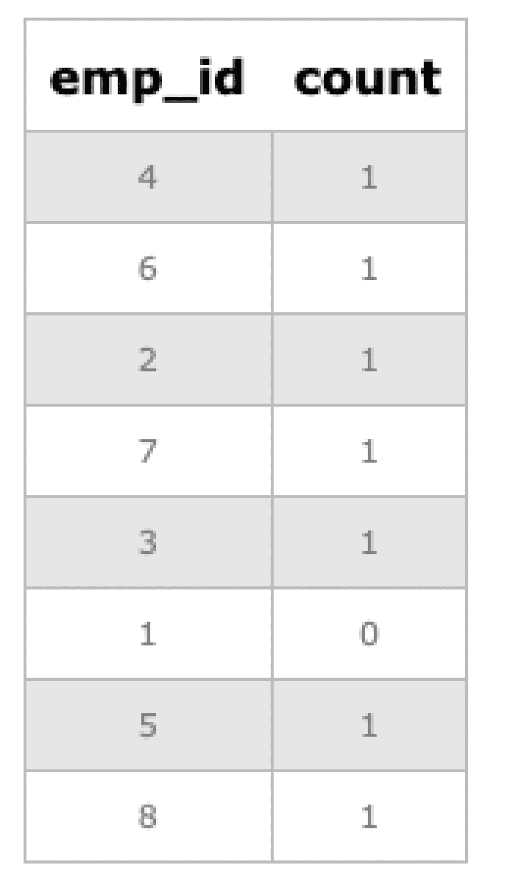

*   **用多列分组**

```
SELECT
        f_name || ' ' || l_name full_name,
        SUM (salary) amount
FROM
        employee_data           
GROUP BY
        full_name, employee_data.salary
ORDER BY salary DESC; 
```

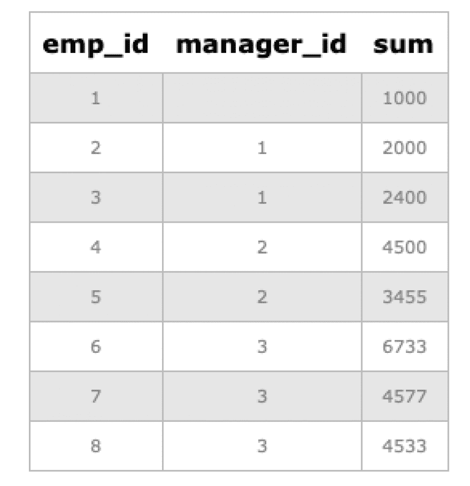

*   **分组依据与日期列**

```
SELECT
        emp_id,
        COUNT (manager_id)
FROM
        employee_data
GROUP BY
        manager_id;
```

Having 子句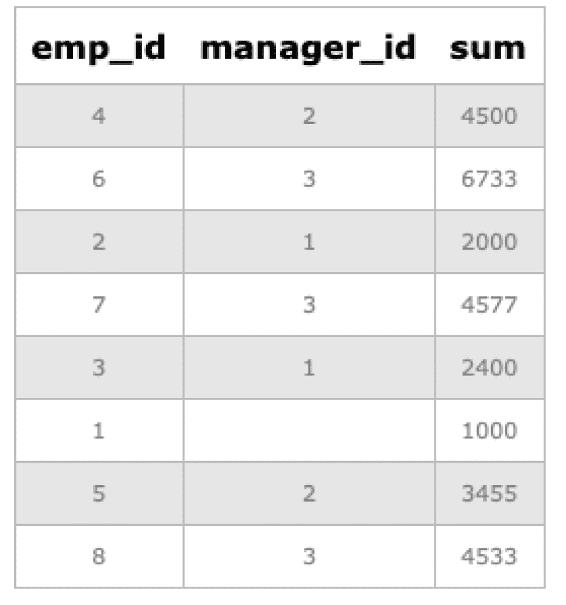

*   指定一个组或一个集合的搜索条件。HAVING 子句通常与 GROUP BY 子句一起使用，根据指定的条件筛选组或聚合。

```
SELECT 
        emp_id,
        manager_id,
        SUM(salary)
FROM 
        employee_data
GROUP BY 
        manager_id,
        emp_id
ORDER BY 
   emp_id;
```

语法:

*   PostgreSQL 在 FROM、WHERE、GROUP BY 之后、SELECT、DISTINCT、ORDER BY 和 LIMIT 子句之前计算 HAVING 子句。

```
SELECT 
                emp_id, manager_id, SUM(salary) sum
FROM 
        employee_data
GROUP BY
        emp_id, manager_id,salary ;
```

**使用具有求和功能的 having**

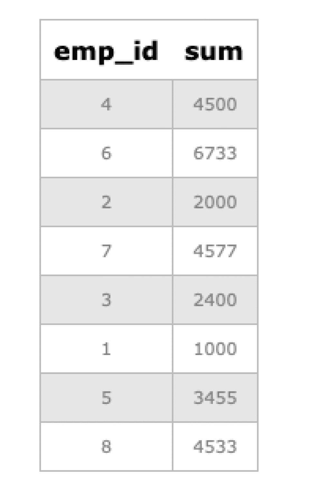

**使用 having 子句与 count 函数**

```
SELECT
        column1,
        aggregate_function (column2)
FROM
        table_name
GROUP BY
        column1
HAVING
        condition;
```

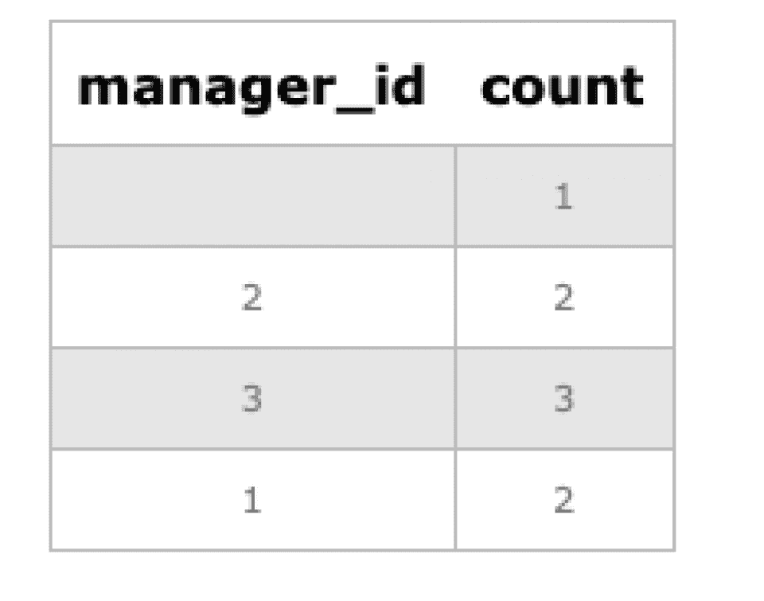

*   第 5 节-设定操作

```
SELECT
        EMP_id,
        SUM (SALARY)
FROM
        EMPLOYEE_DATA
GROUP BY
        emp_id;
```

本节将带您了解 PostgreSQL 支持的不同集合操作。

*   1。工会

```
SELECT
        manager_id,
        COUNT (emp_id)
FROM
        employee_data
GROUP BY
        manager_id;
```

它将两个或多个 SELECT 语句的结果集合并成一个结果集。

### 语法:

例如，我们创建了两个表，并在其中插入数据来执行 union。

#### 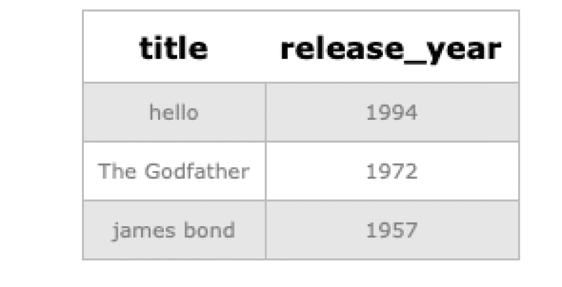

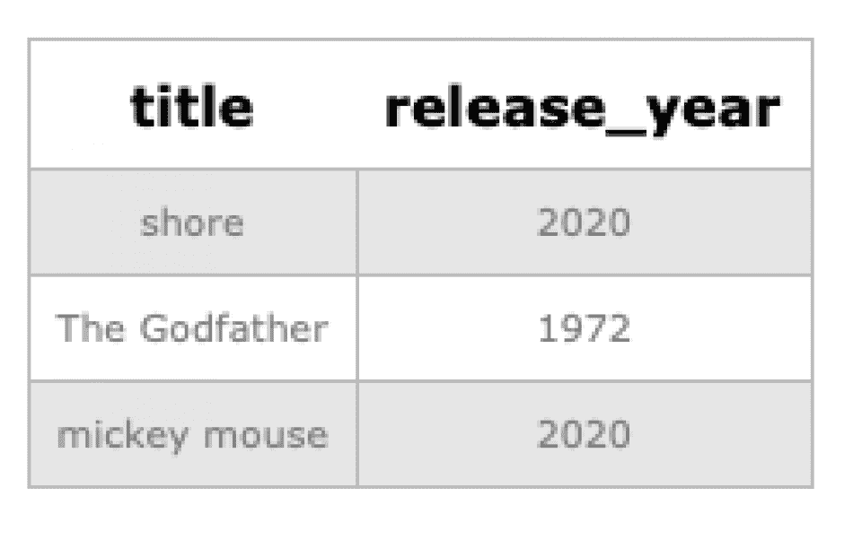

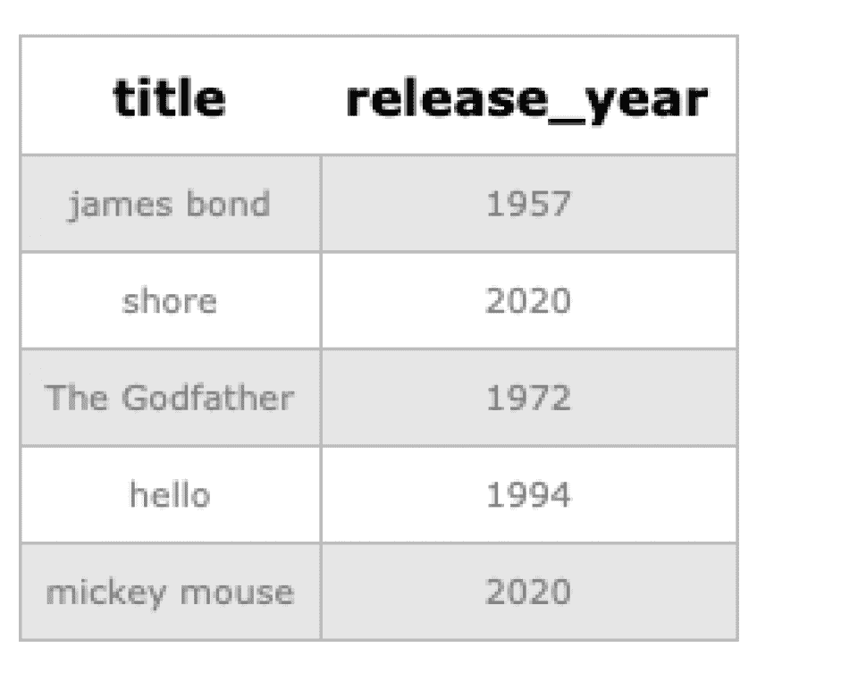

```
SELECT select_list_1
FROM table_expresssion_1
UNION
SELECT select_list_2
FROM table_expression_2
```

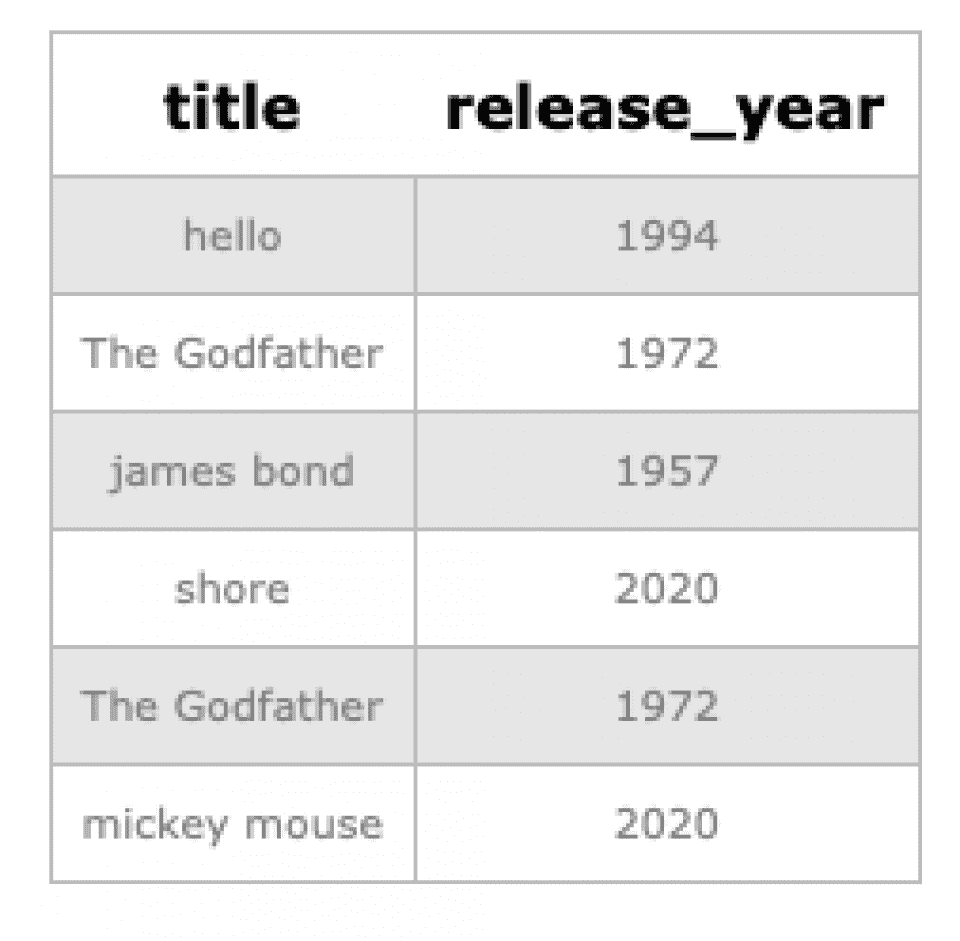

```
DROP TABLE IF EXISTS top_films;
CREATE TABLE top_films(
        title VARCHAR NOT NULL,
        release_year SMALLINT
);​
```

```
DROP TABLE IF EXISTS popular_films;
CREATE TABLE popular_films(
        title VARCHAR NOT NULL,
        release_year SMALLINT
);​
```

```
INSERT INTO 
  top_films(title,release_year)
VALUES
  ('hello',1994),
  ('The Godfather',1972),
  ('james bond',1957);​
```

```
INSERT INTO 
  popular_films(title,release_year)
VALUES
  ('shore',2020),
  ('The Godfather',1972),
  ('mickey mouse,2020);​
```

```
SELECT * FROM top_films;
```

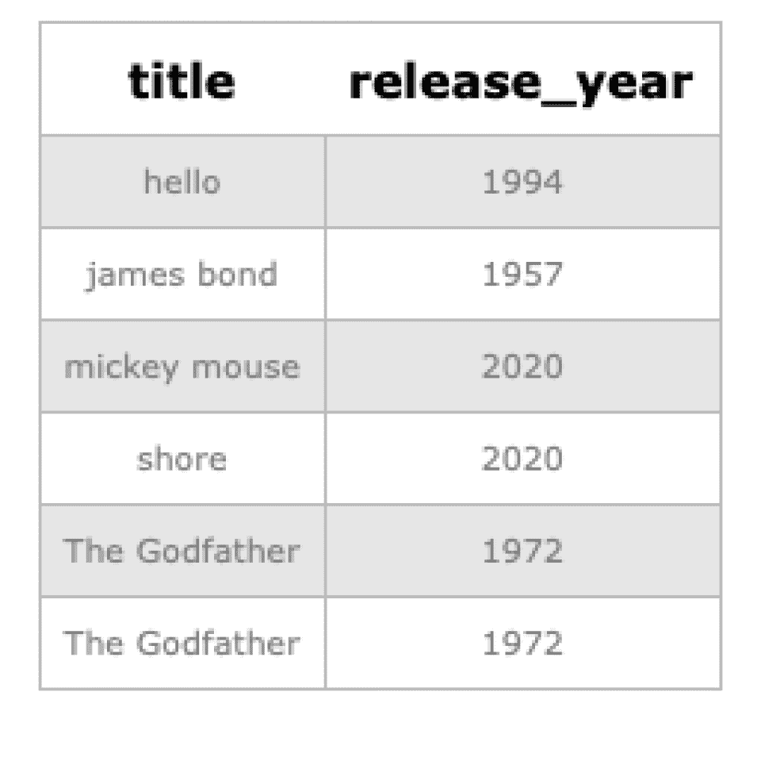

```
SELECT * FROM popular_films;
```

2。相交

```
SELECT * FROM top_films
UNION
SELECT * FROM popular_films;
```

该运算符将两个或多个 SELECT 语句的结果集组合成一个结果集。

```
SELECT * FROM top_films
UNION ALL
SELECT * FROM popular_films;
```

语法:

```
SELECT * FROM top_films
UNION ALL
SELECT * FROM popular_films
ORDER BY title;
```

请确保列数相同，并且具有要合并的兼容数据类型。

#### **与一个 order by 子句** 相交

例如，我们将交叉两个表:popular_films 和 top_films:

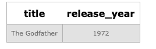

```
SELECT select_list
FROM A
INTERSECT
SELECT select_list
FROM B;
```

第 6 节-分组集、立方体和汇总

*   1。分组集合

```
SELECT select_list
FROM A
INTERSECT
SELECT select_list
FROM B
ORDER BY sort_expression;
```

这可以在一个查询中生成多个分组集。为了解释，我们将创建销售表:

```
SELECT *
FROM popular_films
INTERSECT
SELECT *
FROM top_films;
```

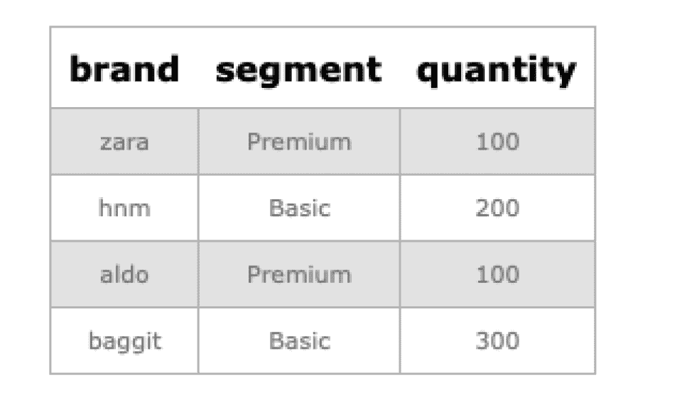

### 分组集是使用 GROUP BY 子句分组的一组列。分组集的语法由括号中的多列组成，用逗号分隔。

#### 语法:

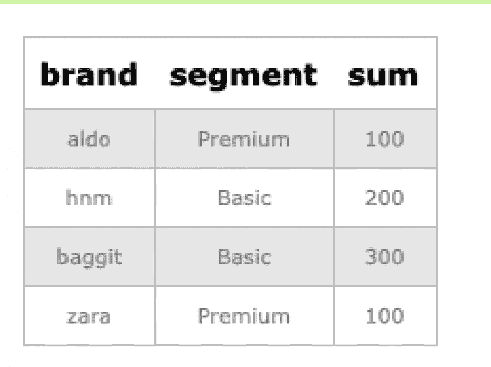

```
DROP TABLE IF EXISTS sales;
CREATE TABLE sales (
   brand VARCHAR NOT NULL,
   segment VARCHAR NOT NULL,
   quantity INT NOT NULL,
   PRIMARY KEY (brand, segment)
);​
```

```
INSERT INTO sales (brand, segment, quantity)
VALUES
   ('zara', 'Premium', 100),
   ('hnm', 'Basic', 200),
   ('aldo', 'Premium', 100),
   ('baggit', 'Basic', 300);​
```

```
SELECT * FROM sales;
```

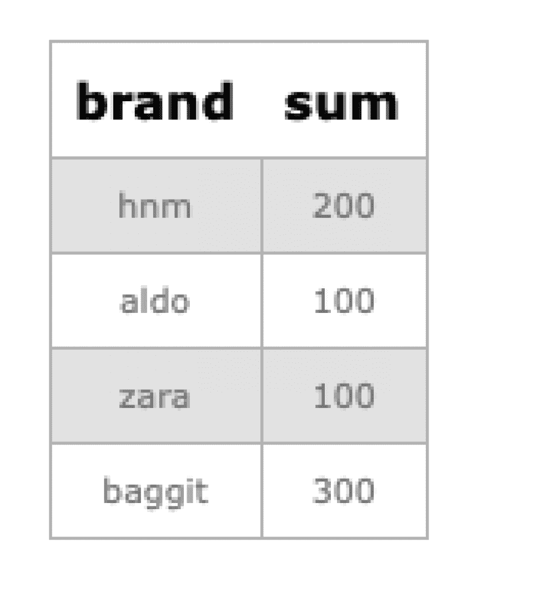

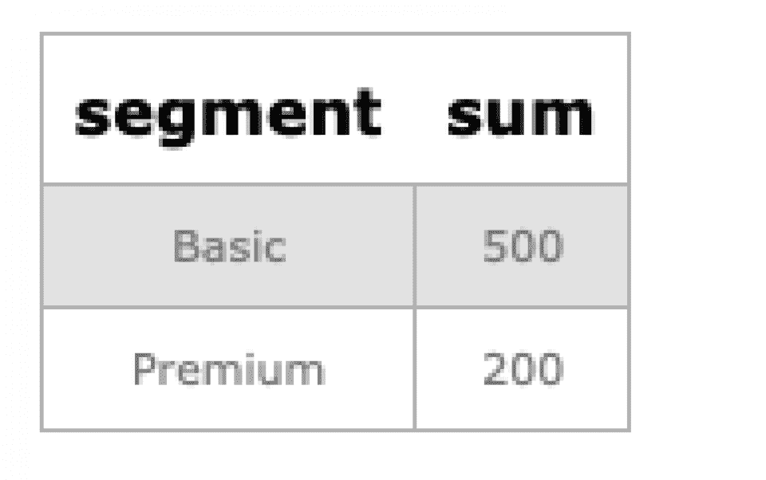 ** 分组集合的一般语法**

例如:

```
(column1, column2, ...)
```

```
SELECT
   brand,
   segment,
   SUM (quantity)
FROM
   sales
GROUP BY
   brand,
   segment;
```

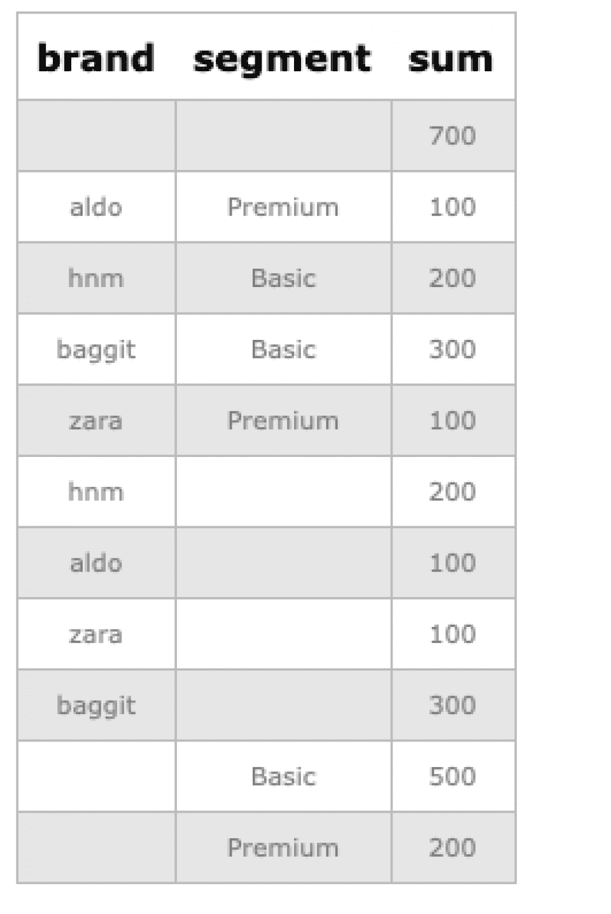

```
SELECT
   brand,
   SUM (quantity)
FROM
   sales
GROUP BY
   brand;
```

2。立方体

```
SELECT
   segment,
   SUM (quantity)
FROM
   sales
GROUP BY
   segment;
```

CUBE 是 GROUP BY 子句的子子句。多维数据集允许您生成多个分组集。

```
SELECT
   c1,
   c2,
   aggregate_function(c3)
FROM
   table_name
GROUP BY
   GROUPING SETS (
       (c1, c2),
       (c1),
       (c2),
       ()
);
```

语法:

```
SELECT
   brand,
   segment,
   SUM (quantity)
FROM
   sales
GROUP BY
   GROUPING SETS (
       (brand, segment),
       (brand),
       (segment),
       ()
   );
```

CUBE 子子句是定义多个分组集的一种简单方法，因此下面的两个查询是等价的。

#### 我们将使用“sales”表来理解 CUBE 子句:


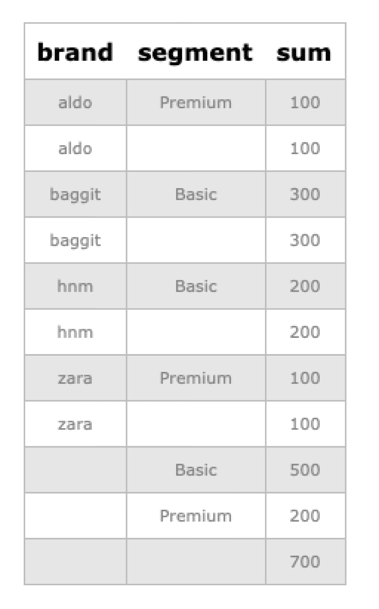

```
SELECT
   c1,
   c2,
   c3,
   aggregate (c4)
FROM
   table_name
GROUP BY
   CUBE (c1, c2, c3);
```

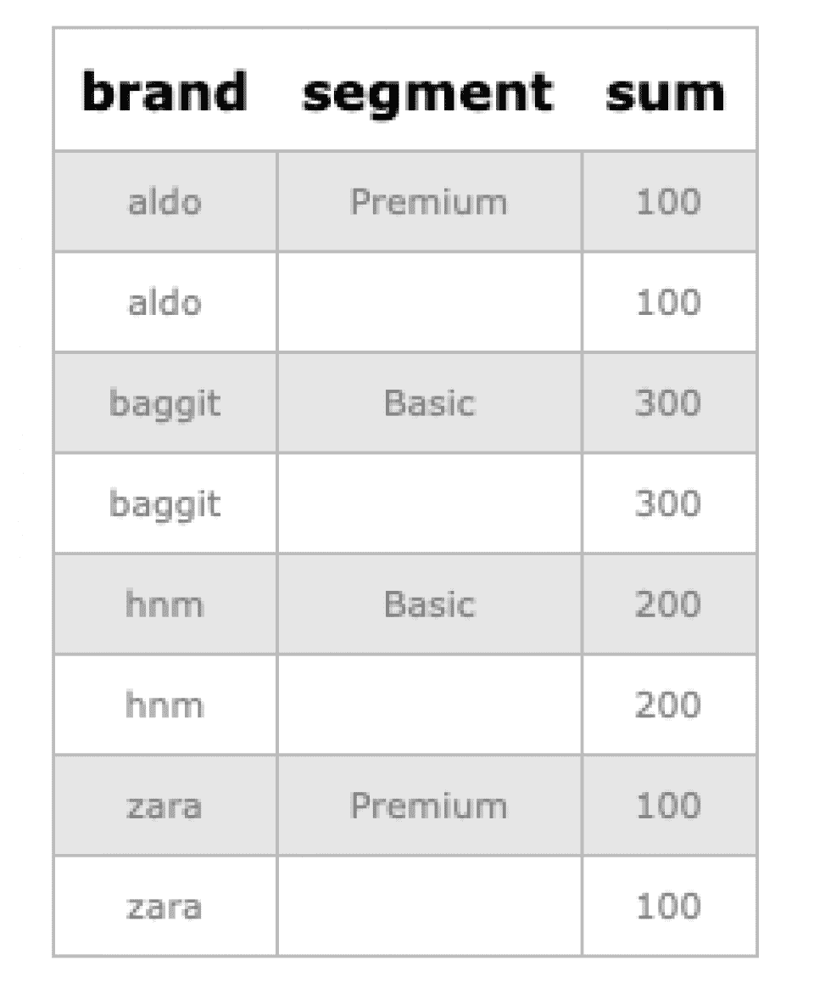

```
CUBE(c1,c2,c3)
```

```
GROUPING SETS (
   (c1,c2,c3),
   (c1,c2),
   (c1,c3),
   (c2,c3),
   (c1),
   (c2),
   (c3),
   ()
)
```

3。上卷

```
SELECT * FROM sales;
```

ROLLUP 是 GROUP BY 子句的一个子子句，它为定义多个分组集提供了一种快捷方式。un 与 CUBE subc lause 一样，ROLLUP 不会基于指定的列生成所有可能的分组集。它只是组成了一个子集。

```
SELECT
   brand,
   segment,
   SUM (quantity)
FROM
   sales
GROUP BY
   CUBE (brand, segment)
ORDER BY
   brand,
   segment;
```

语法:

```
SELECT
   brand,
   segment,
   SUM (quantity)
FROM
   sales
GROUP BY
   brand,
   CUBE (segment)
ORDER BY
   brand,
   segment;
```

例如，我们创建了“销售”表并插入数据:

#### 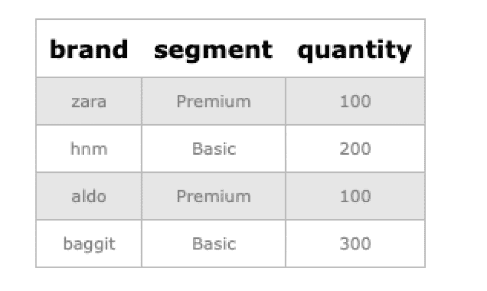

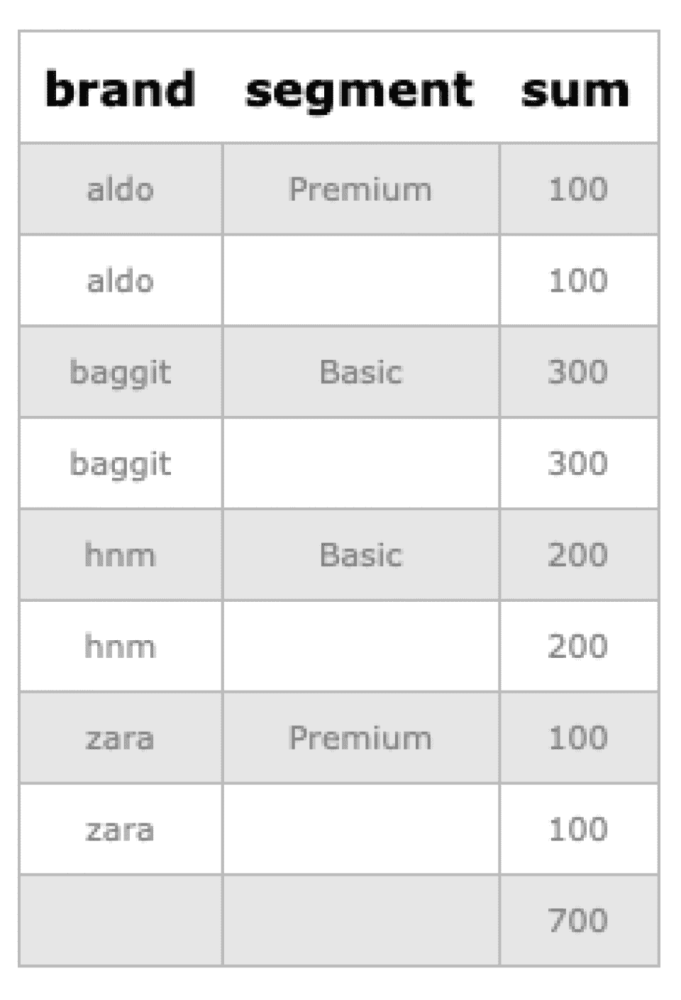

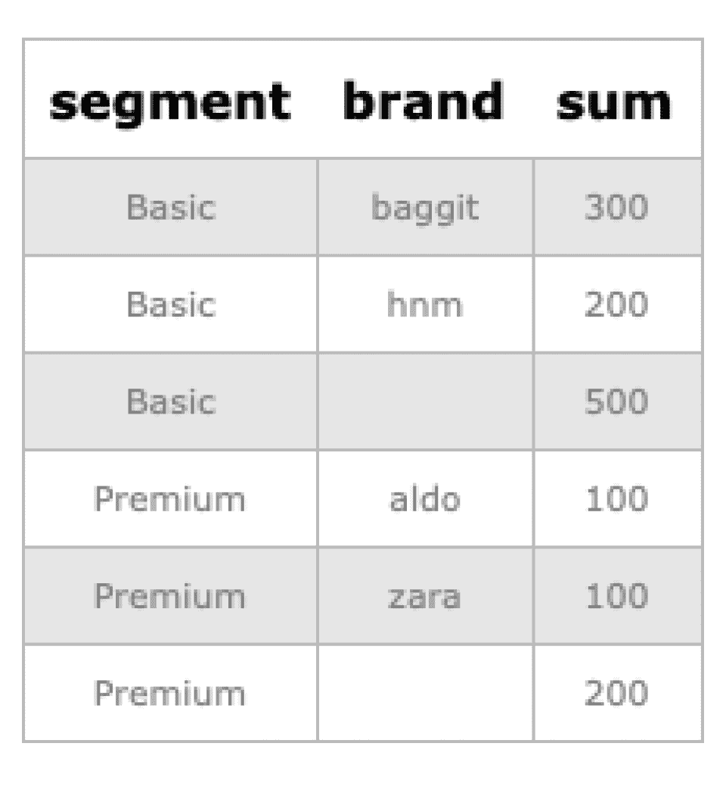

```
SELECT
   c1,
   c2,
   c3,
   aggregate(c4)
FROM
   table_name
GROUP BY
   ROLLUP (c1, c2, c3);
```

```
SELECT
   c1,
   c2,
   c3,
   aggregate(c4)
FROM
   table_name
GROUP BY
   c1,
   ROLLUP (c2, c3);
```

第 7 节-子查询

```
DROP TABLE IF EXISTS sales;
CREATE TABLE sales (
   brand VARCHAR NOT NULL,
   segment VARCHAR NOT NULL,
   quantity INT NOT NULL,
   PRIMARY KEY (brand, segment)
);​
```

```
INSERT INTO sales (brand, segment, quantity)
VALUES
   ('zara', 'Premium', 100),
   ('hnm', 'Basic', 200),
   ('aldo', 'Premium', 100),
   ('baggit', 'Basic', 300);
```

```
SELECT * FROM sales:
```

1。子查询

```
SELECT
   brand,
   segment,
   SUM (quantity)
FROM
   sales
GROUP BY
   ROLLUP (brand, segment)
ORDER BY
   brand,
   segment;
```

检索特定的输出有时需要运行多个查询。为了减少步骤，我们使用子查询，即另一个查询中的一个查询。

```
SELECT
   segment,
   brand,
   SUM (quantity)
FROM
   sales
GROUP BY
   segment,
   ROLLUP (brand)
ORDER BY
   segment,
   brand;
```

假设我们想知道出租率大于平均水平的电影。我们将创建“电影”表并将值插入其中:

### 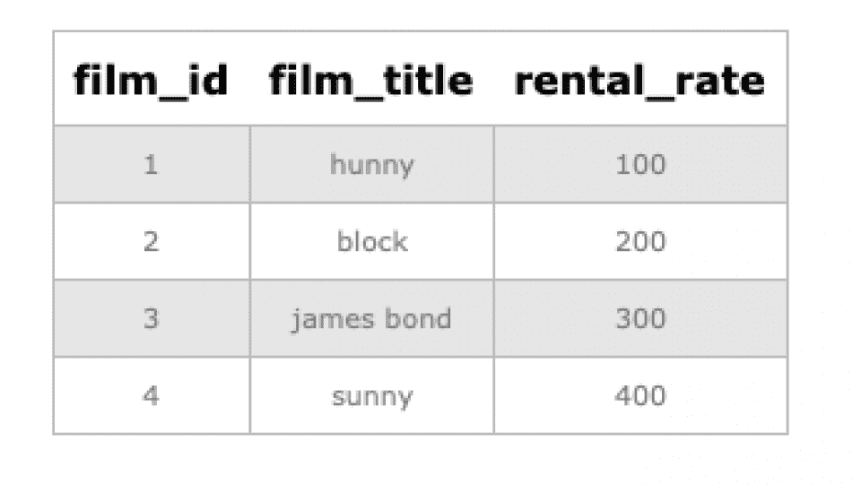

#### 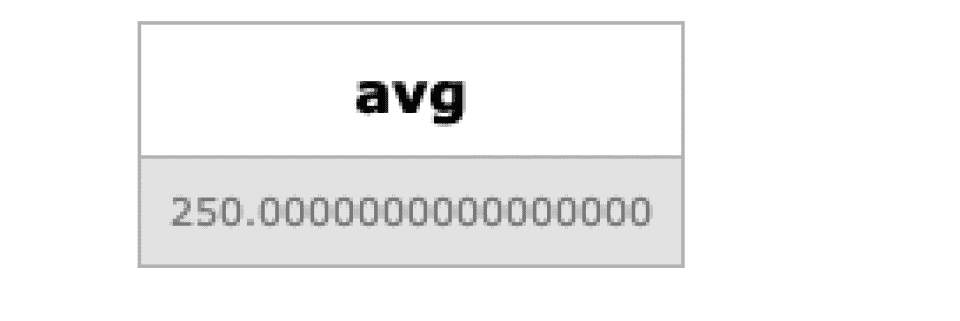


我们使用子查询:

```
DROP TABLE IF EXISTS film;
CREATE TABLE film (
   film_id INT NOT NULL,
   film_title VARCHAR NOT NULL,
   rental_rate INT NOT NULL,

   PRIMARY KEY (film_id)
);​
```

```
INSERT INTO film (film_id, film_title, rental_rate)
VALUES
   (1, 'hunny', 100),
   (2, 'block', 200),
   (3, 'james bond', 300),
   (4, 'sunny', 400);​
```

```
SELECT * FROM film;
```

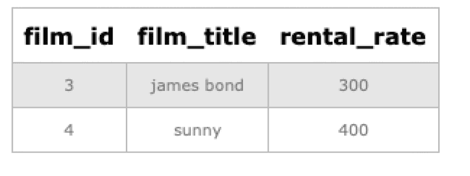

```
SELECT
        AVG (rental_rate)
FROM
        film;
```

**子查询带 IN 运算符**

```
SELECT
        film_id,
        film_title,
        rental_rate
FROM
        film
WHERE
        rental_rate > 2.98;
```

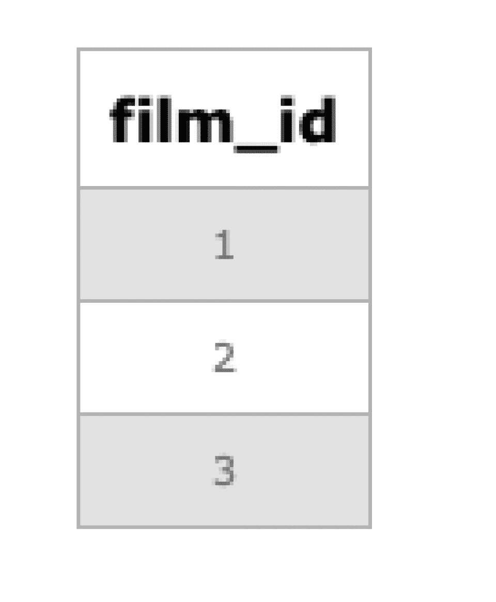

上面的例子将只允许单列输出。要获取多个列，请使用子查询:

```
SELECT
        film_id,
        film_title,
        rental_rate
FROM
        film
WHERE
        rental_rate > (
                SELECT
                        AVG (rental_rate)
                FROM
                        film
        );
```

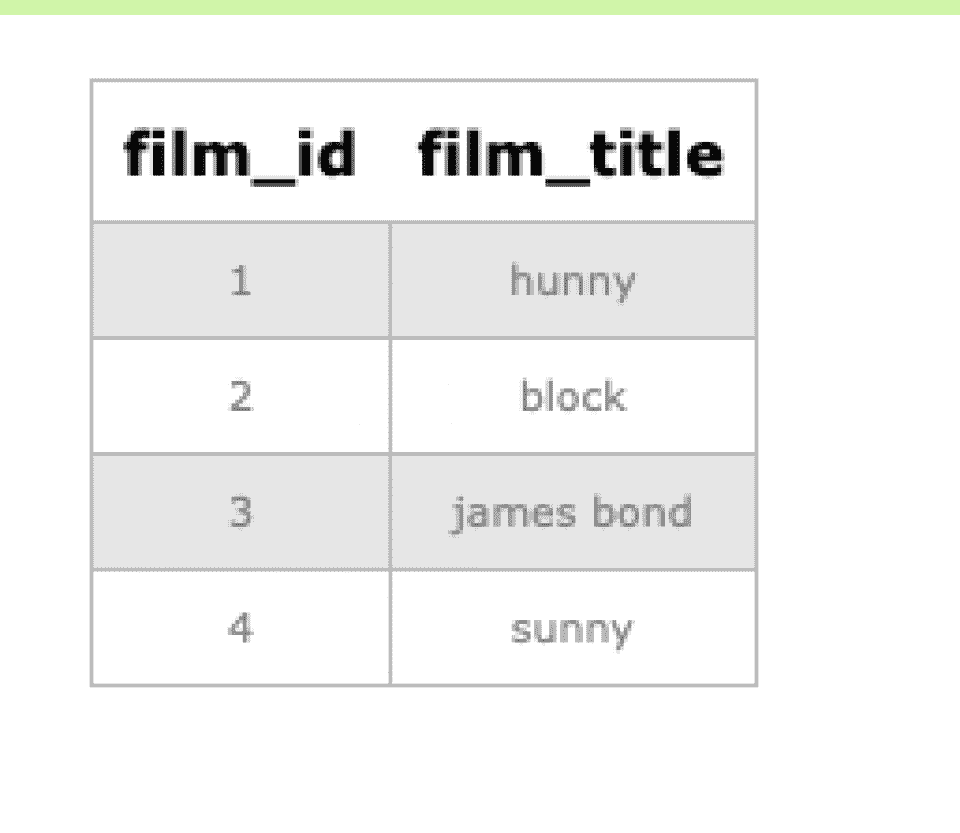

*   2。任何

```
SELECT
        film_id
FROM
        film
WHERE
        salary BETWEEN '100'
AND '300';
```

ANY 运算符将一个值与子查询返回的一组值进行比较。如果任何子查询值满足条件，则返回 true 否则，它返回 false。

语法:

```
SELECT
        film_id,
        film_title
FROM
        film
WHERE
        film_id IN (
                SELECT
                        film_id
                FROM
                        film
                                WHERE
                        rental_rate BETWEEN '100'
                AND '400'
        );
```

例如，查找长度大于或等于任何电影类别最大长度的电影:

#### 

3。全部

ALL 运算符允许您通过将一个值与子查询返回的值列表进行比较来查询数据。

```
expression operator ANY(subquery)
```

语法:

```
SELECT film_title
FROM film
WHERE rental_rate >= ANY(
   SELECT MAX( rental_rate )
   FROM film
      );
```

要查找按电影分级分组的所有电影的平均长度，请运行以下查询:

#### 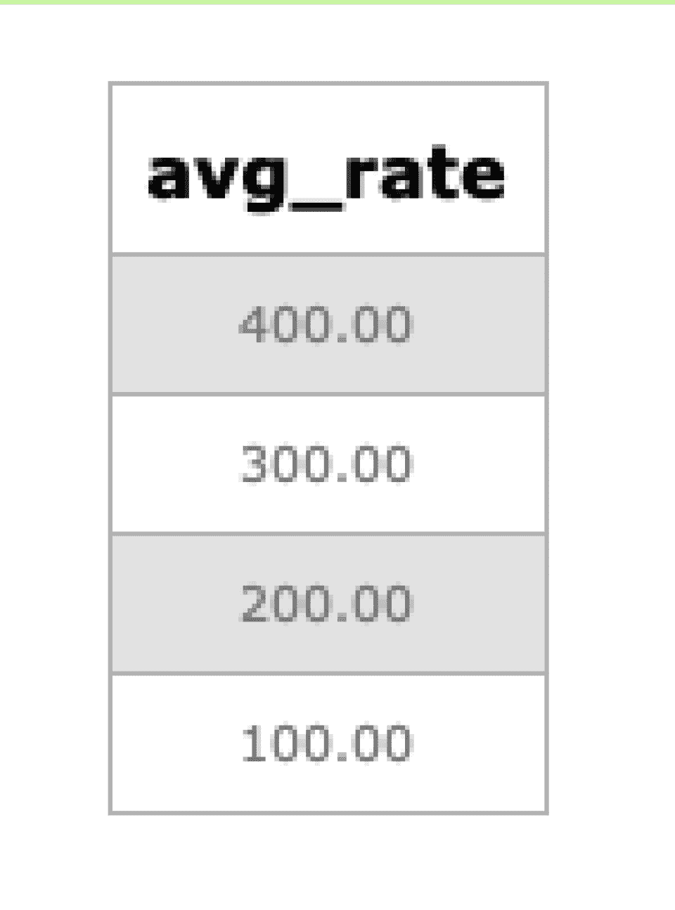

查找长度大于上述平均长度列表的所有影片:

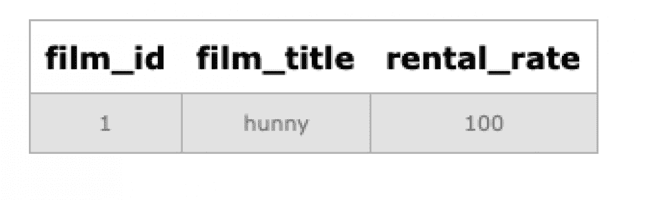

```
comparison_operator ALL (subquery)
```

4。存在

```
SELECT
   ROUND(AVG(rental_rate), 2) avg_rate
FROM
   film
GROUP BY
   film_id
ORDER BY
   avg_rate DESC;
```

这是一个布尔操作符，测试子查询中是否存在行。

语法:

```
SELECT
   film_id,
   film_title,
   rental_rate
FROM
   film
WHERE
   rental_rate <= ALL (
           SELECT
               ROUND(AVG (rental_rate),2)
           FROM
               film
           GROUP BY
               film_id
   )
ORDER BY
   rental_rate;
```

它将接受子查询作为参数。如果子查询至少返回一行，EXISTS 的结果为 true。如果子查询不返回任何行，EXISTS 的结果为 false。EXISTS 运算符通常与相关子查询一起使用。

#### **至少有一笔付款金额大于 11 的客户**

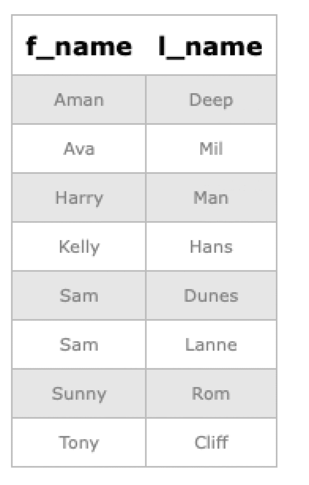

没有结果集。

```
SELECT 
   column1
FROM 
   table_1
WHERE 
   EXISTS( SELECT 
               1 
           FROM 
               table_2
           WHERE 
               column_2 = table_1.column_1);
```

第 8 节-常用表表达式

*   通用表表达式是一个临时结果集，可以在另一个 SQL 语句中引用，包括 SELECT、INSERT、UPDATE 或 DELETE。公用表表达式是临时的，因为它们只在查询执行期间存在。

```
SELECT f_name,
      l_name
FROM employee_data
WHERE EXISTS
   (SELECT 1
    FROM employee_data
    WHERE salary > 2000 )
ORDER BY f_name,
        l_name;
```

语法:

```
SELECT f_name,
      l_name
FROM employee_data
WHERE NOT EXISTS
   (SELECT 1
    FROM employee_data
    WHERE salary < 3000)
ORDER BY f_name,
        l_name;
```

例如:

### 

### 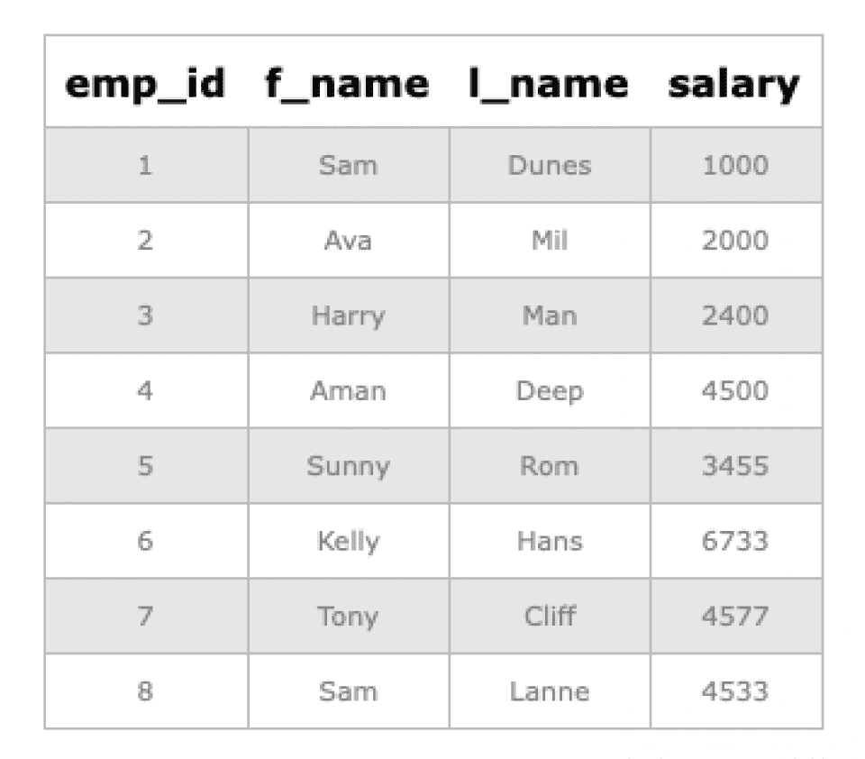

1。递归查询

递归查询指的是递归 CTE。它们在查询组织结构、物料清单等分层数据时很有用。

```
WITH cte_name (column_list) AS (
   CTE_query_definition
)
statement;
```

语法:

```
WITH cte_film AS (
   SELECT 
       film_id,
       Film_title, rental_rate
         FROM
       film
)​
```

```
SELECT
   film_id,
   film_title,
   rental_rate
FROM 
   cte_film
WHERE
 rental_rate>200
ORDER BY 
   film_title;
```

例如，我们创建了“雇员”表并插入了一些数据:

```
WITH cte_emp AS (
   SELECT emp_id,
       COUNT(salary) count
   FROM   employee_data
   GROUP  BY manager_id, emp_id
)
SELECT emp_id,
   f_name,
   l_name,
   salary
FROM employee_data;
```

要获取 id 为 2 的所有经理下属:

#### 非递归项返回基本结果集 R0，即 id 为 2 的雇员。

员工 id |经理 id |全名

- + - + -

```
WITH RECURSIVE cte_name AS(
   CTE_query_definition -- non-recursive term
   UNION [ALL]
   CTE_query definion  -- recursive term
) SELECT * FROM cte_name;
```

2 | 1 |梅根·贝瑞

```
CREATE TABLE employees (
        employee_id serial PRIMARY KEY,
        full_name VARCHAR NOT NULL,
        manager_id INT
);​
```

```
INSERT INTO employees (
        employee_id,
        full_name,
        manager_id
)
VALUES
        (1, 'Michael North', NULL),
        (2, 'Megan Berry', 1),
        (3, 'Sarah Berry', 1),
        (4, 'Zoe Black', 1),
        (5, 'Tim James', 1),
        (6, 'Bella Tucker', 2),
        (7, 'Ryan Metcalfe', 2),
        (8, 'Max Mills', 2),
        (9, 'Benjamin Glover', 2),
        (10, 'Carolyn Henderson', 3),
        (11, 'Nicola Kelly', 3),
        (12, 'Alexandra Climo', 3),
        (13, 'Dominic King', 3),
        (14, 'Leonard Gray', 4),
        (15, 'Eric Rampling', 4),
        (16, 'Piers Paige', 7),
        (17, 'Ryan Henderson', 7),
        (18, 'Frank Tucker', 8),
        (19, 'Nathan Ferguson', 8),
        (20, 'Kevin Rampling', 8);
```

递归项的第一次迭代返回以下结果集:

```
WITH RECURSIVE subordinates AS (
        SELECT
                employee_id,
                manager_id,
                full_name
        FROM
                employees
        WHERE
                employee_id = 2
        UNION
                SELECT
                        e.employee_id,
                        e.manager_id,
                        e.full_name
                FROM
                        employees e
                INNER JOIN subordinates s ON s.employee_id = e.manager_id
) SELECT
        *
FROM
        subordinates;
```

员工 id |经理 id |全名

- + - + -

6 | 2 |贝拉·塔克

瑞安·梅特卡夫

8 | 2 |最大铣削量

本杰明·格洛弗

递归成员的第二次迭代使用上述步骤的结果集作为输入值，并返回这个结果集。

员工 id |经理 id |全名

- + - + -

16 | 7 |皮尔斯·佩奇

17 | 7 |瑞安·亨德森

弗兰克·塔克

19 | 8 |内森·弗格森

凯文·兰普林

第三次迭代返回一个空结果集，因为没有员工向 id 为 16、17、18、19 和 20 的员工报告。

下面是最终结果集，它是由非递归项和递归项生成的第一次和第二次迭代中所有结果集的并集。

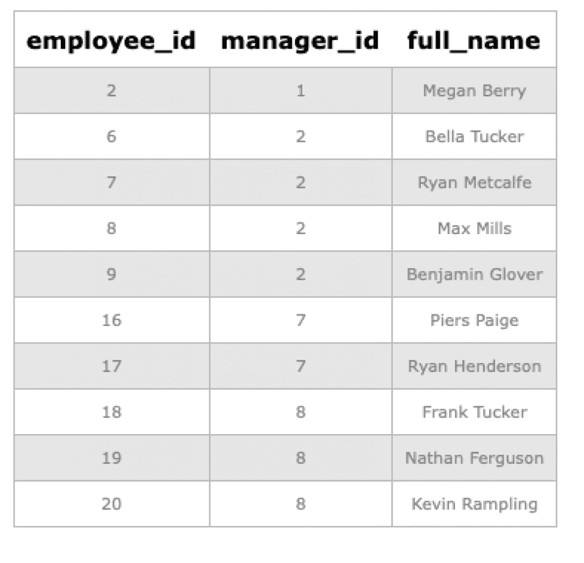

第 9 节-修改数据

在本节中，您将学习如何:

用 insert 语句将数据插入表格

用更新语句修改现有数据

## 用删除语句删除数据

### 用 UPSERT 语句合并数据

插入

*   这个语句允许你在表格中插入一个新行。
*   语法:
*   如果你想返回整个插入的行，你可以在 RETURNING 关键字后使用星号(*)。
*   若要返回有关插入行的一些信息，可以在 RETURNING 子句后指定一列或多列。

#### **插入包含单个字符的字符串**

**获取最后插入 id**

插入多行

```
INSERT INTO table_name(column1, column2, ...)
VALUES (value1, value2, ...);
```

使用以下语法插入多行。

```
INSERT INTO table_name(column1, column2, ...)
VALUES (value1, value2, ...)
RETURNING *;
```

若要插入并返回多行，请使用 returning 子句:

```
INSERT INTO table_name(column1, column2, ...)
VALUES (value1, value2, ...)
RETURNING id;
```

```
INSERT INTO links (url, name)
VALUES('https://www.xyz.com', 'data');
```

*   例如，我们将创建“链接”表并插入数据:

```
INSERT INTO links (url, name)
VALUES('http://www.xyz.com','O''XYZ');
```

```
INSERT INTO links (url, name, last_update)
VALUES('https://www.google.com','Google','2013-06-01');
```

*   **使用下面的查询** 插入多行

```
INSERT INTO links (url, name)
VALUES('http://www.xyz.org','PostgreSQL')
RETURNING id;
```

#### 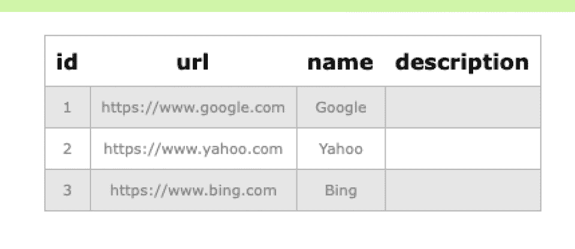

**插入并返回多列**

```
INSERT INTO table_name (column_list)
VALUES
   (value_list_1),
   (value_list_2),
   ...
   (value_list_n);
```

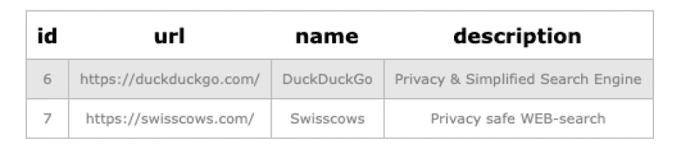

```
INSERT INTO table_name (column_list)
VALUES
   (value_list_1),
   (value_list_2),
   ...
   (value_list_n)
RETURNING * | output_expression;
```

更新

```
DROP TABLE IF EXISTS links;

CREATE TABLE links (
   id SERIAL PRIMARY KEY,
   url VARCHAR(255) NOT NULL,
   name VARCHAR(255) NOT NULL,
   description VARCHAR(255)
);
```

*   更新允许你修改表格中的数据。

```
INSERT INTO 
   links (url, name)
VALUES
   ('https://www.google.com','Google'),
   ('https://www.yahoo.com','Yahoo'),
   ('https://www.bing.com','Bing');
```

```
SELECT * FROM links;
```

语法:

*   为了解释，我们将创建“课程”表并插入数据:

```
INSERT INTO 
   links(url,name, description)
VALUES
   ('https://duckduckgo.com/','DuckDuckGo','Privacy & Simplified Search Engine'),
   ('https://swisscows.com/','Swisscows','Privacy safe WEB-search')
RETURNING *;​
```

```
SELECT * FROM links;
```

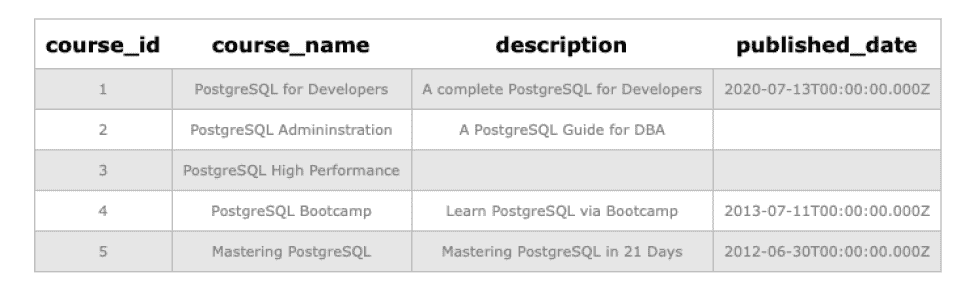

#### 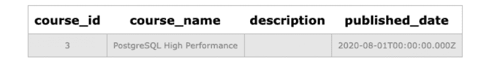

更新加入

此语句用于根据一个表中的值更新另一个表中的数据。

```
UPDATE table_name
SET column1 = value1,
   column2 = value2,
   ...
WHERE condition;
```

```
UPDATE table_name
SET column1 = value1,
   column2 = value2,
   ...
WHERE condition
RETURNING * | output_expression AS output_name;
```

语法:

```
DROP TABLE IF EXISTS courses;

CREATE TABLE courses(
        course_id serial primary key,
        course_name VARCHAR(255) NOT NULL,
        description VARCHAR(500),
        published_date date
);​
```

```
INSERT INTO 
        courses(course_name, description, published_date)
VALUES
        ('PostgreSQL for Developers','A complete PostgreSQL for Developers','2020-07-13'),
        ('PostgreSQL Admininstration','A PostgreSQL Guide for DBA',NULL),
        ('PostgreSQL High Performance',NULL,NULL),
        ('PostgreSQL Bootcamp','Learn PostgreSQL via Bootcamp','2013-07-11'),
        ('Mastering PostgreSQL','Mastering PostgreSQL in 21 Days','2012-06-30');
```

```
SELECT * FROM courses:
```

例如，我们创建了两个表，并向其中插入了数据。

```
UPDATE courses
SET published_date = '2020-08-01' 
WHERE course_id = 3;​
```

```
SELECT * FROM COURSES WHERE COURSE_ID=3;
```

–表 1

#### –表 2

现在，我们将运行更新连接查询:


```
UPDATE t1
SET t1.c1 = new_value
FROM t2
WHERE t1.c2 = t2.c2;
```

删除

这个语句允许你从一个表中删除一行或多行。

```
CREATE TABLE prod (
   id SERIAL PRIMARY KEY,
   segment VARCHAR NOT NULL,
   discount NUMERIC (4, 2)
);
```

```
INSERT INTO 
   Prod (segment, discount)
VALUES
   ('Grand Luxury', 0.05),
   ('Luxury', 0.06),
   ('Mass', 0.1);
```

语法:

```
DROP TABLE IF EXISTS product;
CREATE TABLE product(
   id SERIAL PRIMARY KEY,
   name VARCHAR NOT NULL,
   price NUMERIC(10,2),
   net_price NUMERIC(10,2),
   segment_id INT NOT NULL,
   FOREIGN KEY(segment_id) REFERENCES prod(id)
);
```

```
INSERT INTO 
   product (name, price, segment_id)
VALUES 
   ('diam', 804.89, 1),
   ('vestibulum aliquet', 228.55, 3),
   ('lacinia erat', 366.45, 2),
   ('scelerisque quam turpis', 145.33, 3),
   ('justo lacinia', 551.77, 2),
   ('ultrices mattis odio', 261.58, 3),
   ('hendrerit', 519.62, 2),
   ('in hac habitasse', 843.31, 1)
  ;
```

使用 RETURNING 子句将删除的行返回给客户端:

```
UPDATE product
SET net_price = price - price * discount
FROM prod
WHERE product.segment_id = prod.id;
```

```
SELECT * FROM product;
```

**删除并返回一行。**

#### 向上插入

该语句将在现有行中插入或更新数据。其思想是，当您向表中插入一个新行时，PostgreSQL 将更新已经存在的行；否则，它将插入新行。这就是为什么我们称这个行动为 upsert。

要使用 PostgreSQL 中的 upsert 功能，请使用 INSERT ON CONFLICT 语句。

```
DELETE FROM table_name
WHERE condition;
```

例如，我们将创建“客户”表并将数据插入其中:

```
DELETE FROM table_name
WHERE condition
RETURNING (select_list | *)
```

```
DELETE FROM links
WHERE id = 8;
```

*   现在我们可以使用以下查询来更改电子邮件:

```
DELETE FROM links
WHERE id = 7
RETURNING *;
```

```
DELETE FROM links
WHERE id IN (6,5)
RETURNING *;
```

#### 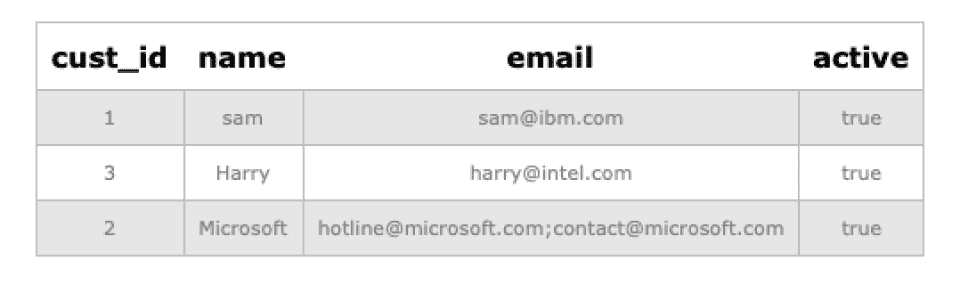

第 10 节-交易

数据库事务是包含若干操作的单个工作单元。PostgreSQL 事务是原子的、一致的、隔离的和持久的，表现为 ACID 属性。

```
INSERT INTO table_name(column_list)
VALUES(value_list)
ON CONFLICT target action;
```

例如:

```
DROP TABLE IF EXISTS customers;
```

```
CREATE TABLE customers (
        cust_id serial PRIMARY KEY,
        name VARCHAR UNIQUE,
        email VARCHAR NOT NULL,
        active bool NOT NULL DEFAULT TRUE
);​
```

```
INSERT INTO 
   customers (name, email)
VALUES 
   ('sam', 'sam@ibm.com'),
   ('Microsoft', 'contact@microsoft.com'),
   ('Harry', 'harry@intel.com');
```

在语句的开头使用 BEGIN 语句。

```
INSERT INTO customers (name, email)
VALUES('Microsoft','hotline@microsoft.com')
ON CONFLICT (name)
DO 
  UPDATE SET email = EXCLUDED.email || ';' || customers.email;
```

即使发生崩溃，这也会使你的更改永久生效。

### -开始交易。

-在账户表中插入新的一行。

-提交更改(或稍后回滚)。

```
DROP TABLE IF EXISTS accounts;

CREATE TABLE accounts (
   id INT GENERATED BY DEFAULT AS IDENTITY,
   name VARCHAR(100) NOT NULL,
   balance DEC(15,2) NOT NULL,
   PRIMARY KEY(id)
);
```

您可以回滚任何事务，直到最后一个提交语句。

```
BEGIN;

INSERT INTO accounts(name,balance)
VALUES('Alice',10000);
```

-开始交易。

-从账户 1 中扣除金额。

```
BEGIN;
```

-添加账户 3 的金额(而不是账户 2)。

```
INSERT INTO accounts(name,balance)
VALUES('Alice',10000);
```

-回滚事务。

```
COMMIT;
```

第 11 节-将 CSV 文件导入 PostgreSQL 表

我们现在将创建“persons”表，以了解如何将 CSV 文件导入 PostgreSQL 表。

```
BEGIN;
```

使用以下格式创建 CSV:

```
UPDATE accounts
SET balance = balance - 1500
WHERE id = 1;
```

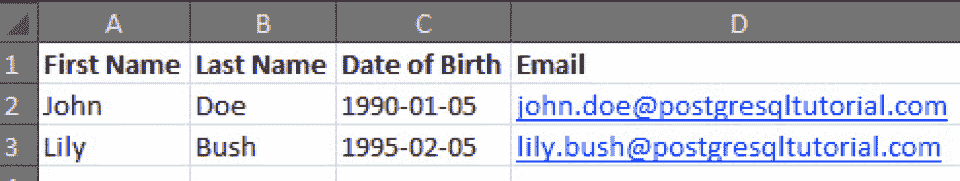

```
UPDATE accounts
SET balance = balance + 1500
WHERE id = 3;
```

**用复制语句导入**

```
ROLLBACK;
```

### 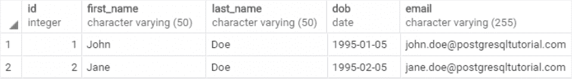

下面的查询将截断该表并重新开始:

```
CREATE TABLE persons (
 id SERIAL,
 f_name VARCHAR(50),
 l_name VARCHAR(50),
 dob DATE,
 email VARCHAR(255),
 PRIMARY KEY (id)
)
```

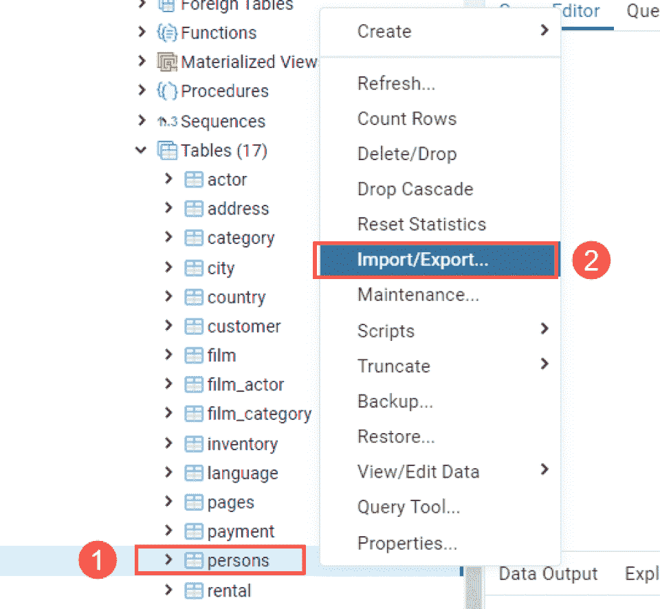

*   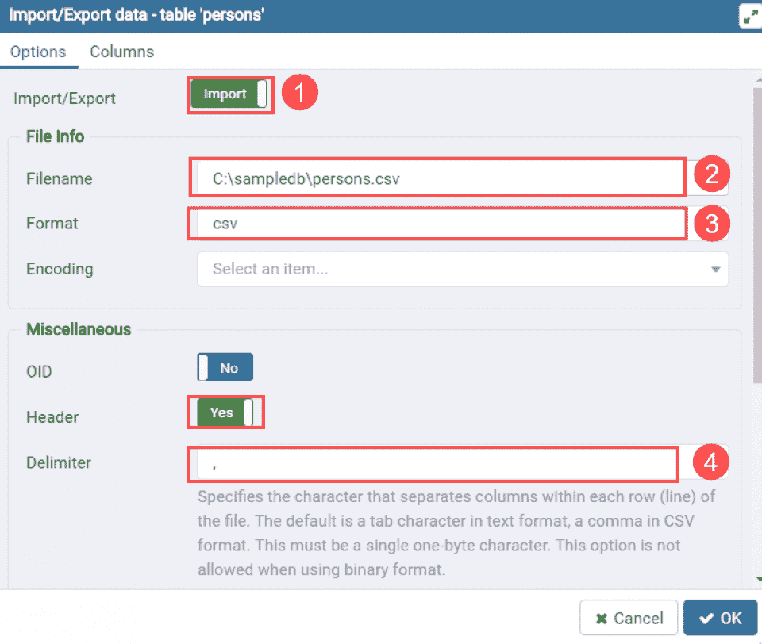

```
COPY persons(first_name, last_name, dob, email)
FROM 'C:\sampledb\persons.csv'
DELIMITER ','
CSV HEADER;​
```

```
SELECT * FROM persons;
```

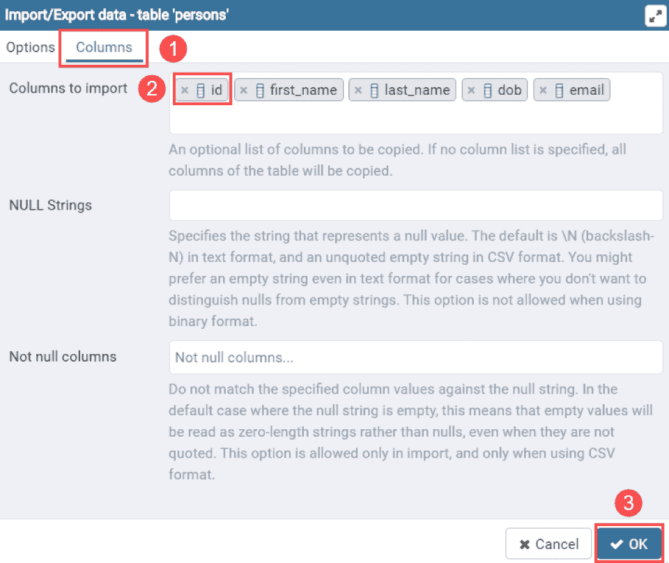

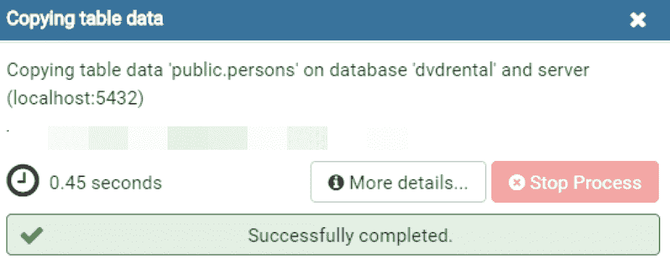

```
TRUNCATE TABLE persons
RESTART IDENTITY;
```

第 12 节-在 PostgreSQL 中管理表

数据类型

**布尔** : 可以保存三个可能值之一:真、假或空。

**【CHAR(n)**:用空格填充的定长字符。

**ARCHAR(n****)**:可变长度字符串，最多可存储 n 个字符。

### **文本** :变长字符串。

#### **【SMALLINT】**:2 字节有符号整数，范围从-32768 到 32767。

*   **【INT】**:4 字节整数，取值范围为-2147483648 到 2147483647。
*   **(n)**:浮点数，其精度至少为 n，最多为 8 个字节。
*   **realor float 8**:4 字节浮点数。
*   numeric 或 numeric(p，s) :小数点后有 p 位数字和 s 位数字的实数。数字(p，s)是精确的数字。
*   **日期** :只存储日期。
*   **时间** :存储一天中的时间值。
*   **时间戳** :存储日期和时间值。
*   **TIMESTAMPTZ** :时区敏感时间戳数据类型。它是时间戳和时区的缩写。
*   :存储时间段。
*   创建表格
*   使用CREATE TABLE 语句创建一个新表:
*   语法:
*   选择进入
*   该语句创建一个新表，并将查询返回的数据插入到该表中。新表将包含与查询结果集列同名的列。与常规 SELECT 语句不同，SELECT INTO 语句不向客户端返回结果。

#### 语法:

例如:


```
CREATE TABLE [IF NOT EXISTS] table_name (
  column1 datatype(length) column_contraint,
  column2 datatype(length) column_contraint,
  column3 datatype(length) column_contraint,
  table_constraints
);
```

#### 序列

PostgreSQL 中的序列是用户定义的模式绑定对象，它根据指定的规范生成整数序列。

**创建一个升序序列**

```
SELECT
   select_list
INTO [ TEMPORARY | TEMP | UNLOGGED ] [ TABLE ] new_table_name
FROM
   table_name
WHERE
   search_condition;
```

**创建降序序列**

```
SELECT
   film_id,
  film_ title,
   rental_rate
INTO TABLE film_r
FROM
   film
WHERE
  Rental_rate > 200
ORDER BY
  film_ title;​
```

```
SELECT * FROM film_r;
```

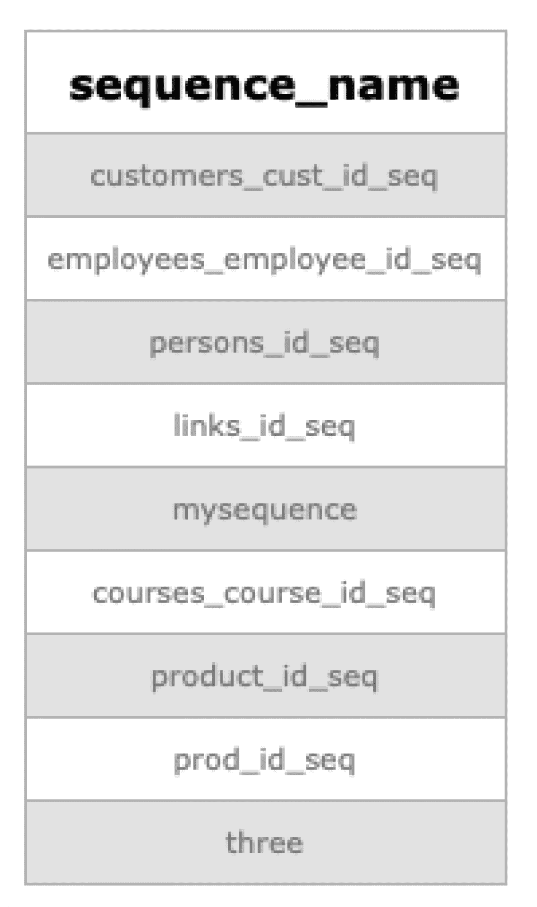

#### 身份栏

它允许你自动给一个列分配一个唯一的编号。生成的 AS IDENTITY 约束是符合 SQL 标准的 good old SERIAL 列的变体。

```
CREATE SEQUENCE [ IF NOT EXISTS ] sequence_name
   [ AS { SMALLINT | INT | BIGINT } ]
   [ INCREMENT [ BY ] increment ]
   [ MINVALUE minvalue | NO MINVALUE ]
   [ MAXVALUE maxvalue | NO MAXVALUE ]
   [ START [ WITH ] start ]
   [ CACHE cache ]
   [ [ NO ] CYCLE ]
   [ OWNED BY { table_name.column_name | NONE } ]
```

*   **生成总例**

```
CREATE SEQUENCE mysequence
INCREMENT 5
START 100;
```

*   **默认生成为身份**

```
CREATE SEQUENCE three
INCREMENT -1
MINVALUE 1 
MAXVALUE 3
START 3
CYCLE;
```

```
SELECT
   relname sequence_name
FROM 
   pg_class
WHERE 
   relkind = 'S';
```

更改表格

```
DROP SEQUENCE [ IF EXISTS ] sequence_name [, ...]
[ CASCADE | RESTRICT ];
```

```
DROP TABLE order_details;
```

#### 要更改现有表的结构，请使用 PostgreSQL ALTER TABLE 语句。

**改变栏的默认值**

```
column_name type GENERATED { ALWAYS | BY DEFAULT } AS IDENTITY[ ( sequence_option ) ]
```

*   **改变非空约束**

```
CREATE TABLE color (
   color_id INT GENERATED ALWAYS AS IDENTITY,
   color_name VARCHAR NOT NULL
);​
```

```
INSERT INTO color(color_name)
VALUES ('Red');
```

*   下降表

```
DROP TABLE color;

CREATE TABLE color (
   color_id INT GENERATED BY DEFAULT AS IDENTITY,
   color_name VARCHAR NOT NULL
);​
```

```
INSERT INTO color (color_name)
VALUES ('White');
```

#### 使用以下语法删除表:

**层叠** 选项允许您删除表格及其依赖对象。

```
ALTER TABLE table_name action;
```

```
ALTER TABLE table_name
ADD COLUMN column_name datatype column_constraint;
```

```
ALTER TABLE table_name
ADD COLUMN column_name datatype column_constraint;
```

```
ALTER TABLE table_name
RENAME COLUMN column_name
TO new_column_name;
```

*   **限制** 选项拒绝移除任何对象，视表格而定。如果没有在 DROP TABLE 语句中显式指定，这是默认设置。

```
ALTER TABLE table_name
ALTER COLUMN column_name
[SET DEFAULT value | DROP DEFAULT];
```

*   您也可以删除多个用逗号分隔的表格:

```
ALTER TABLE table_name
ALTER COLUMN column_name
[SET NOT NULL| DROP NOT NULL];
```

```
ALTER TABLE table_name
ADD CHECK expression;
```

```
ALTER TABLE table_name
RENAME TO new_table_name;
```

#### **删除不存在的表**

**删除带有依赖对象的表格**

```
DROP TABLE [IF EXISTS] table_name
[CASCADE | RESTRICT];
```

*   **错误** :无法删除表格作者，因为其他对象依赖于它
*   **DETAIL** :表格页面上的约束 pages_author_id_fkey 依赖于表格作者

**提示** :使用掉落...层叠以删除相关对象

```
DROP TABLE [IF EXISTS]
  table_name_1,
  table_name_2,
  ...
[CASCADE | RESTRICT];
```

*   **SQL 状态** : 2BP01

```
DROP TABLE IF EXISTS author;
```

*   运行以下查询:

```
CREATE TABLE authors (
       firstname VARCHAR (50),
          author_id INT PRIMARY KEY,
       lastname VARCHAR (50)
);​
```

```
CREATE TABLE pages (
        page_id serial PRIMARY KEY,
        title VARCHAR (255) NOT NULL,
        contents TEXT,
        author_id INT NOT NULL,
        FOREIGN KEY (author_id)
         REFERENCES authors (author_id)
);
DROP TABLE IF EXISTS authors;
```

截断表格

要从表中删除所有数据，使用 DELETE 语句。但是，您可以使用 TRUNCATE TABLE 语句来提高效率。

**截断多个表格**

**截断带有外键引用的表**

临时表

```
DROP TABLE authors CASCADE;
```

```
DROP TABLE tv shows, animes;
```

#### 临时表是在数据库会话期间存在的短期表。PostgreSQL 会在会话或事务结束时自动删除临时表。

第 13 节- PostgreSQL 约束

```
TRUNCATE TABLE table_name;
```

*   PostgreSQL 包括以下列约束:

```
TRUNCATE TABLE 
   table_name1,
   table_name2,
   ...;
```

*   **不为空**:En 确保一列中的值不能为空。

```
TRUNCATE TABLE table_name
CASCADE;
```

#### **唯一**:En 一列中的保证值在同一表格的所有行中都是唯一的。

**主键** : 标识一个表的主键。

```
CREATE TEMPORARY TABLE temp_table_name(
  column_list
);
```

### **检查** : 确保数据满足布尔表达式。

**外键** : 确保一个表的一列或一组列中的值存在于另一个表的一列或一组列中。与主键不同，一个表可以有许多外键。

*   第 14 节-条件表达式&运算符

```
CREATE TABLE table_name(
  ...
  column_name data_type NOT NULL,
  ...
);
```

*   案例

```
CREATE TABLE person (
        id SERIAL PRIMARY KEY,
        first_name VARCHAR (50),
        last_name VARCHAR (50),
        email VARCHAR (50) UNIQUE
);
```

*   CASE 表达式与其他编程语言中的 IF/ELSE 语句相同。它允许您将 if-else 逻辑添加到查询中，以形成一个强大的查询。

```
CREATE TABLE po_headers (
        po_no INTEGER PRIMARY KEY,
        vendor_no INTEGER,
        description TEXT,
        shipping_address TEXT
);
```

*   合并

```
DROP TABLE IF EXISTS employees;
CREATE TABLE employees (
        id SERIAL PRIMARY KEY,
        first_name VARCHAR (50),
        last_name VARCHAR (50),
        birth_date DATE CHECK (birth_date > '1900-01-01'),
        joined_date DATE CHECK (joined_date > birth_date),
        salary numeric CHECK(salary > 0)
);
```

*   COALESCE 函数接受无限数量的参数。它返回第一个不为空的参数。如果所有参数都为 null，则 COALESCE 函数将返回 null。

```
[CONSTRAINT fk_name]
  FOREIGN KEY(fk_columns)
  REFERENCES parent_table(parent_key_columns)
  [ON DELETE delete_action]
  [ON UPDATE update_action]
```

### 该函数从左到右计算参数，直到找到第一个非空参数。不计算第一个非空参数的所有剩余参数。

#### 语法:

例如:

```
CASE
     WHEN condition_1  THEN result_1
     WHEN condition_2  THEN result_2
     [WHEN ...]
     [ELSE else_result]
END
```

#### 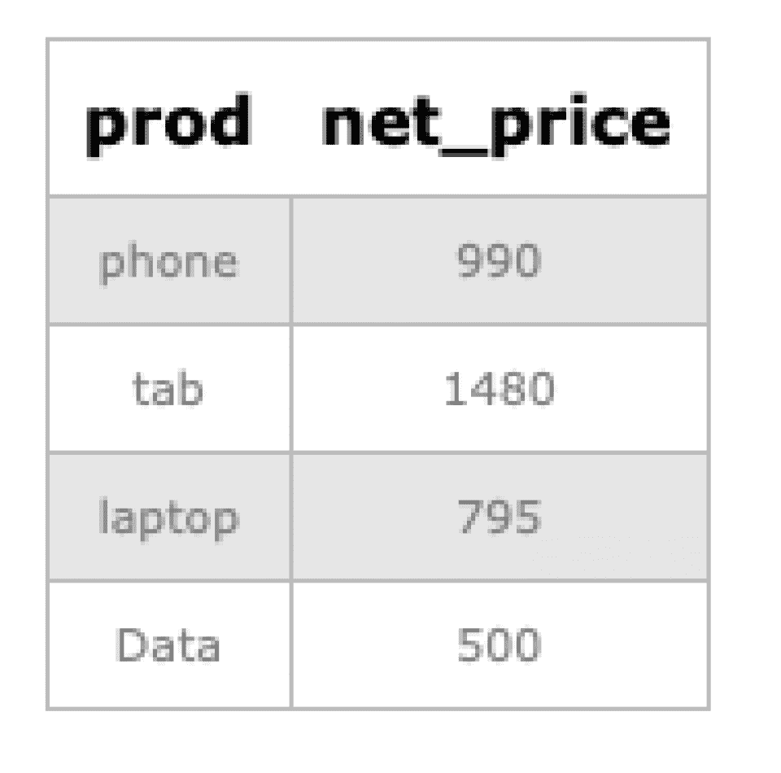

NULLIF

NULLIF 函数是最常见的条件 PostgreSQL 表达式之一。

语法:

```
COALESCE (argument_1, argument_2, ...);
```

例如:

```
CREATE TABLE items (
        ID serial PRIMARY KEY,
        product VARCHAR (100) NOT NULL,
        price NUMERIC NOT NULL,
        discount NUMERIC
);​
```

```
INSERT INTO items (product, price, discount)
VALUES
        ('A', 1000 ,10),
        ('B', 1500 ,20),
        ('C', 800 ,5),
        ('D', 500, NULL);

SELECT
        product,
        (price - COALESCE(discount,0)) AS net_price
FROM
        items;
```

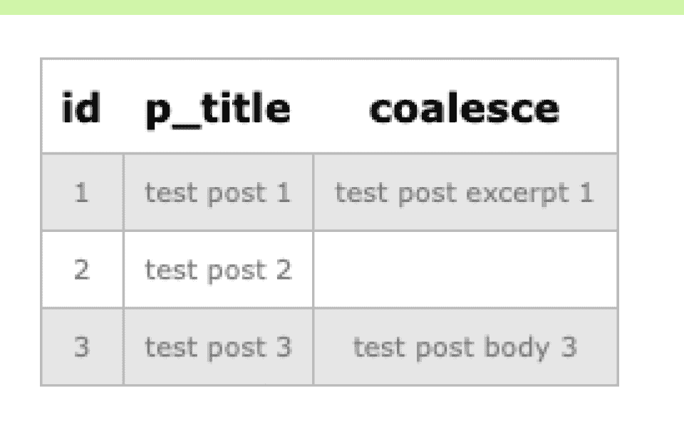

#### 剧组

在很多情况下，你会想把一个值从一种数据类型转换成另一种数据类型。PostgreSQL 为您提供了 CAST 操作符，允许您这样做。

语法:

```
SELECT
        NULLIF (1, 1); -- return NULL

SELECT
        NULLIF (1, 0); -- return 1

SELECT
        NULLIF ('A', 'B'); -- return A
```

**将字符串转换为整数**

```
CREATE TABLE posts (
 id serial primary key,
        title VARCHAR (255) NOT NULL,
        excerpt VARCHAR (150),
        body TEXT,
        created_at TIMESTAMP DEFAULT CURRENT_TIMESTAMP,
        updated_at TIMESTAMP
);​
```

```
INSERT INTO posts (title, excerpt, body)
VALUES
     ('test post 1','test post excerpt 1','test post body 1'),
     ('test post 2','','test post body 2'),
     ('test post 3', null ,'test post body 3');​
```

```
SELECT
        id,
        title,
        COALESCE (excerpt, LEFT(body, 40))
FROM
        posts;
```

**将字符串转换为布尔型**

#### **将字符串转换成时间戳**

**将字符串转换为音程**

第 15 节- Psql 命令备忘单

```
CAST ( expression AS target_type );
```

*   下面是最常用的 Psql 命令:

```
SELECT
        CAST ('100' AS INTEGER);
```

```
SELECT
  CAST ('2015-01-01' AS DATE),
  CAST ('01-OCT-2015' AS DATE);
```

```
SELECT
        CAST ('10.2' AS DOUBLE);
```

*   psql -d 数据库-U 用户-W

```
SELECT 
  CAST('true' AS BOOLEAN),
  CAST('false' as BOOLEAN),
  CAST('T' as BOOLEAN),
  CAST('F' as BOOLEAN);
```

*   \c 数据库名用户名

```
SELECT '2019-06-15 14:30:20'::timestamp;
```

*   \l

```
SELECT '15 minute'::interval,
'2 hour'::interval,
'1 day'::interval,
'2 week'::interval,
'3 month'::interval;
```

### \dt

\d 表名

\dn

\dv

**列出用户及其角色**

\杜

**执行之前的命令**

选择版本()；

\s

*   \i 文件名

\？

*   **开启查询执行时间**

DVD rental = # \计时

计时开始。

DVD rental = # select count(*)from film；

计数

*   -

1000

(1 排)

时间:1.495 毫秒

dvdrental=#

\q

结论

在这个 PostgreSQL 备忘单中，我们已经涵盖了 PostgreSQL 的所有基本概念和一个快速 PostgreSQL 命令备忘单。无论你是初学者还是专业人士，你都可以在你的日常编程中找到这份备忘单的绝佳用途。

对其他编程小抄很好奇？ [探索我们的 Java 备忘单！](https://hackr.io/blog/java-cheat-sheet)

常见问题解答

1。学习 PostgreSQL 最好的方法是什么？

## 有几个网上资源可以考虑:

PostgreSQL for Developers-一个完整的 PostgreSQL for Developers

PostgreSQL 管理 DBA 的 PostgreSQL 指南

## PostgreSQL 高性能

#### PostgreSQL 训练营-通过训练营学习 PostgreSQL

掌握 PostgreSQL

*   2。Psql 中的' #是什么意思？
*   提示符“postgres=#”是等待新命令开始的新提示符。“postgres-#”提示符是在键入不以分号结尾的命令后按 enter 键的结果。
*   3。如何查看 PostgreSQL 中的所有表？
*   使用 SQL 查询
*   运行以下查询:

#### 或在特定模式中:

使用 Psql

#### 列出所有表格:

#### 在所有模式中:\dt *。*

在特定的模式中:\dt schema_name。*

```
SELECT * FROM information_schema.tables;
```

4。Postgres 比 MySQL 快吗？

```
SELECT * FROM information_schema.tables WHERE table_schema = 'schema_name';
```

在决定使用哪个数据库时，速度很重要。PostgreSQL 在处理海量数据集、复杂查询、读写操作时速度更快。另一方面，MySQL 对于只读命令更快。

5。PostgreSQL 中的问号是什么？

？在预处理语句中用作参数的占位符。因为原始的 SQL 查询实际上并没有准备好，所以我们可以切换执行它们的方式。

6。我如何得到 Postgres 外壳？

#### 首先，s 选择运行 PostgreSQL 的服务器。默认情况下，选择 localhost。如果它运行在不同的机器上，请在此处提供服务器名称。

接下来，选择一个数据库。在 postgres 安装过程中，会创建一个名为 Postgres 的数据库。

#### 默认情况下，PostgreSQL 服务器运行在端口 5432 上，除非您在安装过程中更改它。如果您更改了端口号，请在此处提供相同的端口号。

提供用户名。我们将使用默认用户“postgres”

#### 输入用户密码，点击输入。

**人也在读:**

Next, select a database. During the Postgres installation, a database is created with the name postgres.

By default, the PostgreSQL server runs on port 5432, unless you change it during installation. If you changed the port number, provide the same here.

Provide the username. We will go with the default user “postgres.”

Type in the password for the user and click enter.

**People are also Reading:******