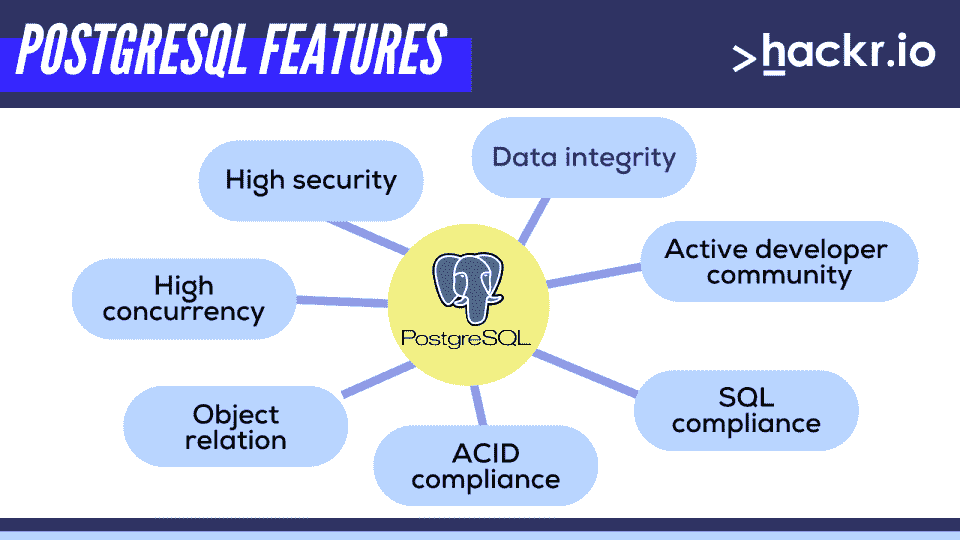
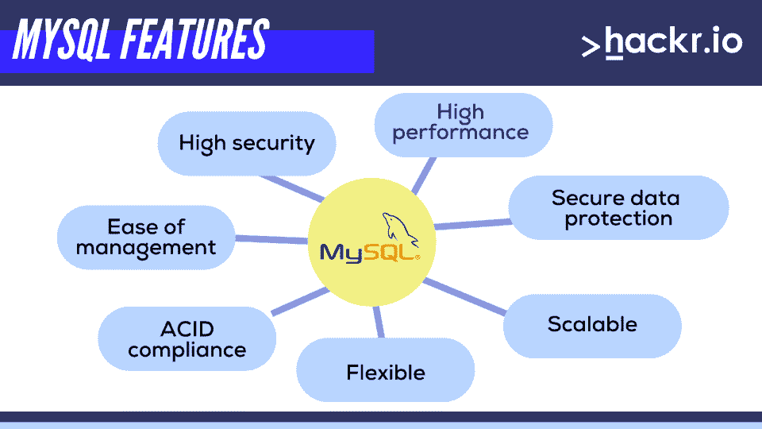

# PostgreSQL vs MySQL:2023 年你需要知道的一切

> 原文：<https://hackr.io/blog/postgresql-vs-mysql>

近 40 年来，关系数据库管理系统(RDBMS)一直是在数据库中存储信息的首选，主要用于个人数据、财务信息和生产记录等。

数据库管理的关系模型使用表格式来存储数据，这使得它不同于标准的数据管理模型。RDBMS 的流行可以归因于随着时间的推移任务关键型应用程序的增加，这些应用程序需要健壮的管理系统。

今天，所有主要的关系数据库都使用 [SQL](https://hackr.io/blog/how-to-learn-sql) 作为查询语言。虽然有一个标准的 SQL，但大多数数据库平台使用不同的方言，这些方言可能包括特定的附加功能或标准 SQL 功能的一部分。在本文中，我们将向您介绍两个在应用程序开发领域广受欢迎的主要关系数据库管理系统。

本指南是 PostgreSQL 与 MySQL 的比较。我们将研究这些系统的特性，并帮助您为您的项目选择正确的 RDBMS。这些是 MySQL——最流行和最常用的 RDBMS 以及 PostgreSQL——最先进的 SQL 兼容和开源目标 RDBMS。

## **PostgreSQL vs MySQL:势均力敌的比较**

为了快速了解 MySQL 和 PostgreSQL 的区别，下面的表格详细介绍了它们的特性。之后，我们将详细讨论这两种技术。

| **RDBMS** | **PostgreSQL** | **MySQL** 的实现 |
| **治理** | 它是免费和开源的，在 PostgreSQL 许可下发布，类似于 MIT 许可 | 即使 MySQL 的源代码是可用的，Oracle 公司也提供某些付费版本用于商业用途 |
| **SQL 符合性** | PostgreSQL 在很大程度上是 SQL 兼容的，并且满足 SQL 标准的几乎所有核心特性 | MySQL 是部分 SQL 兼容的，并没有实现完整的 SQL 标准 |
| **支持的平台** | Solaris、Windows 操作系统、Linux、OS X、Unix 操作系统和 Hp-UX 操作系统 | Solaris、Windows 操作系统、Linux、OS X 和 FreeBSD 操作系统 |
| **编程语言支持** | C/C++，Java，。Net、R、Perl、Python、JavaScript 等等 | C/C++，Erlang，PHP，Lisp，Go，Perl 等等 |
| **安全** | PostgreSQL 为加密连接提供了本地 SSL 支持 | MySQL 内置了很多安全特性，非常安全 |
| **访问方式** | 支持所有标准 | 支持所有标准 |
| **复制** | PostgreSQL 可以执行主从复制，并且可以使用第三方扩展将其他类型的实现付诸实践 | MySQL 使用主-主复制，并且可以执行主-从复制 |
| **性能** | 广泛用于读写速度至关重要并需要执行复杂查询的大型系统 | 广泛适用于只需要数据库进行数据事务的基于 web 的项目 |
| **社区支持** | 一个非常强大和活跃的社区，致力于改进现有的功能并巩固其作为最先进的数据库的地位 | 一个大型社区，专注于维护现有功能，而新功能很少发布 |
| **数据类型** | 支持高级数据类型，包括数组、hstore 和用户定义的类型 | 支持标准 SQL 数据类型 |
| **表格继承** | 是 | 不 |
| **触发器** | 支持各种命令上的触发器，具有全局影响的除外 | 对命令触发器的有限支持 |
| **存储引擎** | 单存储引擎 | 多个存储引擎 |

## **什么是 PostgreSQL？**

PostgreSQL 被认为是最先进和最强大的符合 SQL 的开源目标 RDBMS。

由于其强大的底层技术，它已成为执行复杂和大量数据操作的公司的首选。它使用多版本并发控制(MVCC ),允许几个作者和读者同时在系统上工作。

PostgreSQL 非常能够同时高效地处理多个任务。因此，它受到商业巨头的信任，如苹果、雅虎。、脸书和 Instagram，以及电信公司、金融和政府机构。

PostgreSQL 的目标是符合标准、高度可编程和可扩展。尽管这种 DBMS 具有引人注目的性质，但许多第三方工具和库使得使用 PostgreSQL 变得简单。

其他特性包括高并发性、ACID 遵从性(原子性、一致性、隔离性、持久性)、对象关系、SQL 遵从性(大部分)以及来自活跃的开发人员社区的支持。

## **什么是 MySQL？**

Oracle 支持的 RDBMS MySQL 是最著名的大型数据库服务器。这是一个开源系统，支持大量在线应用和网站。它易于设置，只需极少的微调即可实现出色的性能水平。

诸如 Adminer、HeidiSQL、MySQL Workbench 和 dbForge Studio 之类的第三方 GUI 工具使得 MySQL 更容易上手。

还有大量的 MySQL 教程和资源，这对刚刚开始学习数据库的初学者来说是一个福音。

MySQL 是一个功能丰富的系统，直接或间接地支持大多数 SQL 功能，这是 RDBMS 所期望的。它高度灵活且相当灵活，使其成为 web 应用程序的流行选择。其他一些特性包括特定安全特性的可用性、平台独立性、ACID 遵从性和支持的易用性。

## **PostgreSQL 比 MySQL 好吗？**

PostgreSQL 和 MySQL 是两种最常用的 RDBMS，为您的项目选择正确的关系数据库管理系统可能会对最终结果产生重大影响。

然而，简而言之，PostgreSQL 是未来更好的选择。它有更多的选择和 MySQL 能做的一切，它也能。然而，MySQL 不能做 PostgreSQL 能做的一切。

PostgreSQL 具有表分区和函数重载等特性，并能更好地处理并发性。

## **PostgreSQL 比 MySQL 更安全吗？**

PostgreSQL 比 MySQL 更符合 SQL 标准。它还具有身份验证方法、权限角色和无库间查询等特性。

请记住，数据库技术的安全缺陷通常在于程序员，而不是数据库本身。对于必要的目的，它们都足够安全(否则 MySQL 不会是如此受欢迎的选择)。

## **PostgreSQL 比 MySQL 简单吗？**

总的来说，PostgreSQL 在实际应用方面**并不比 MySQL 容易**。它有更多的高级特性，当涉及到[学习 PostgreSQL](https://hackr.io/tutorials/learn-postgresql?ref=blog) 时，你会比使用 MySQL 多一点点。

也就是说，它并没有难到让你觉得太难去学。学习曲线的差异不是特别大。

## **PostgreSQL 与 MySQL 的主要区别**

正如我们所说的，尽管它们有大量重叠的特性，但这都取决于您的需求以及您希望如何解决眼前的问题。下面几节讨论这两个系统最显著的特性，帮助您在 MySQL 和 PostgreSQL 之间做出选择。

### **治理**

技术的治理模型具有独特的优势，在 MySQL 和 PostgreSQL 的例子中，展示了显著的差异。

**PostgreSQL** 由 PostgreSQL 全球开发小组开发，在开源许可下可用，类似于 MIT 许可。

MySQL 项目的源代码在 GNU 许可下向公众开放，同时还有多个专有协议。它现在归甲骨文公司所有，必须提供各种商业用途的付费版本。

### **SQL 符合性**

SQL 遵从标准是数据库在实现所有 SQL 准则和标准时必须遵守的一组规则。对于希望在项目(应用程序)中使用异构数据库的公司来说，SQL 遵从性是一个重大的限制。

PostgreSQL 最符合 SQL 标准，因为它符合 SQL 标准 179 个核心特性中的 160 个，以及一些可选特性。

另一方面， **MySQL** 部分符合 SQL，因为它没有实现完整的 SQL 标准。然而，它确实提供了许多有用的非 SQL 特性，比如检查约束。

### **支持的平台**

**PostgreSQL 和 MySQL 系统都可以在 Solaris、Windows 操作系统、Linux 和 Mac OS X 上运行。**

PostgreSQL 还支持由科技巨头惠普公司开发的惠普-UX 操作系统，以及开源的 Unix 操作系统。

相比之下， **MySQL** 扩展了对开源 FreeBSD 操作系统的支持。

### **编程语言支持**

如果一个系统支持多种编程语言，它可以帮助不同背景的开发人员用他们熟悉的语言执行任务，从而提高效率。由于服务器支持许多数据库函数的编程语言，开发人员可以很容易地决定是在客户机还是在服务器上执行任务。对其他编程语言的支持增强了开发人员的能力。

**PostgreSQL** 用 C 编写，支持多种编程语言，最突出的是 C/C++、Delphi、JavaScript、Java、Python、R、Tcl、Go、Lisp、Erlang 和。Net 等等。

**MySQL** 用 C 和 C++编写，扩展了对 C/C++、Erlang、PHP、Lisp、Go、Perl、Java、Delphi、R 和 Node.js 的支持。

### **安全**

DBMS 的安全性深刻地影响着它的可靠性，并成为系统中最重要的特征之一。数据库安全指向进程和工具的集体使用，以保护 DBMS 或数据库免受非法来源的威胁和攻击。

MySQL 包括多种安全特性，其中一些相当先进。它根据访问控制列表(ACL)为用户操作(如连接和查询)执行安全协议。

**PostgreSQL** 为客户端/服务器通信加密的连接提供本地 SSL 支持。此外，名为 SE-PostgreSQL 的内置增强功能基于 SELinux 策略提供了额外的访问控制。

### **访问方式**

**MySQL 和 PostgreSQL 都支持所有标准，有多种通用的访问方法，包括 ADO.NET、JDBC、ODBC。**

 **JDBC 是用于 Java 编程的数据库访问 API，而 ODBC 是用于访问数据库的标准 API。ADO.NET 是开发人员用来访问基于 XML 的数据的一组 API。该平台的原生 C 库和流式 API 也可用于访问 PostgreSQL。

[SQL 和 PostgreSQL:完整的开发人员指南](https://click.linksynergy.com/link?id=jU79Zysihs4&offerid=1045023.3350536&type=2&murl=https%3A%2F%2Fwww.udemy.com%2Fcourse%2Fsql-and-postgresql%2F)

### **复制**

数据库复制是指将数据从一台计算机或服务器电子复制到另一台计算机或服务器的过程，它允许所有用户访问相同的信息。数据库可以利用多种技术在几个节点上存储多余的数据。

MySQL 使用主-主复制，其中每个节点都是主节点，可以更新数据。

然而，**PostgreSQL 和 MySQL 都可以执行主从复制，其中一个节点是主节点，控制其他节点的数据存储。使用第三方扩展，可以在 PostgreSQL 中实施其他类型的实现。**

### **性能和速度**

**PostgreSQL** 适用于需要对数据进行认证且读写速度对成功至关重要的大型系统。此外，它还支持许多只在专有解决方案中可用的性能增强器，包括无读锁的并发、SQL server 和地理空间数据支持等。一般来说，PostgreSQL 最适合需要执行复杂查询、数据仓库和数据分析的系统。

MySQL 是那些基于网络的项目的第一选择，这些项目只需要一个用于数据交易的数据库，而不需要任何复杂的东西。它在只需要高读取速度的[在线分析处理(OLAP)和在线事务处理(OLTP](https://hackr.io/blog/olap-vs-oltp) )系统中工作得非常好。然而，一旦 MySQL 承受了沉重的负载或复杂的查询，它就会开始表现不佳。

当我们讨论这些系统的应用时，RDBMS 的实际性能和速度只能通过评估可能场景的度量来衡量，因为它主要取决于需求和它所用于的项目的性质。

社区支持对于任何数据库系统的改进都是非常重要的。

PostgreSQL 有一个非常活跃的社区，它不断帮助改进现有的功能，同时它的创新委员会尽一切努力确保数据库仍然是最先进的数据库，具有最新的功能和最大的安全性。

MySQL 还拥有一个庞大的追随者和贡献者社区，他们专注于维护现有功能，同时也偶尔添加一些新功能。

## PostgreSQL 和 MySQL:哪个更好？

我们讨论了两个最广泛使用的 RDBMS，PostgreSQL 和 MySQL 的最突出的特性。这两个系统都有一些独特的功能，以及一些相似之处。考虑到每种方法都有相当多的优缺点，PostgreSQL 和 MySQL 的选择取决于您的项目对 RDBMS 的要求。

如果您需要一个用于 web 应用程序或定制解决方案的 RDBMS，MySQL 是您项目的理想选择，但如果您需要一个完全符合 SQL 的 RDBMS，能够快速执行复杂的任务，MySQL 则不是理想选择。相反，**如果您的需求围绕着复杂的过程、集成、复杂的设计和数据完整性，PostgreSQL 是您的项目**的理想选择。

## **常见问题解答**

#### **1。PostgreSQL 和 MySQL 哪个好？**

如今许多开发人员更喜欢 PostgreSQL，因为它的开发速度很快。PostgreSQL 能做 MySQL 能做的一切，但不能反过来。

#### **2。PostgreSQL 比 MySQL 简单吗？**

MySQL 比 PostgreSQL 更容易设置和管理。后者更具挑战性，但并不是很大。

#### **3。我应该学习 PostgreSQL 还是 MySQL？**

从长远来看，PostgreSQL 可能是最好的选择。然而，如果您想要更简单的东西，MySQL 可能是一个不错的起点。

#### **4。哪个数据库最适合大数据？**

PostgreSQL 通常更适合大量数据。

**人也在读:****